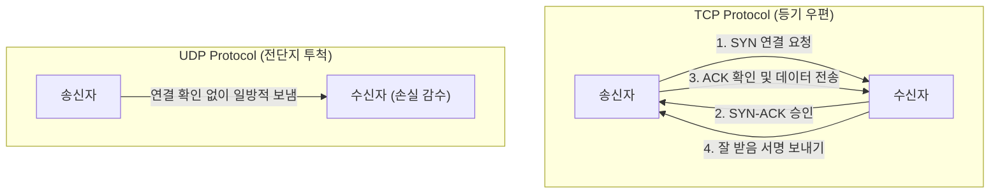

# TCP vs UDP (전송 계층 프로토콜 비교)

## 1. 개요 (Overview)

인터넷에서 데이터를 보낼 때 사용되는 전송 계층(Transport Layer)의 두 핵심 프로토콜인 **[TCP (Transmission Control Protocol)](tcp-udp-protocols.md)** 와 **[UDP (User Datagram Protocol)](tcp-udp-protocols.md)** 는 신뢰성과 전송 속도라는 서로 다른 목표를 가진다.

---

### 초보자를 위한 쉽게 이해하는 비유

* **TCP (등기 우편 / 서명 수령)**:
  - 택배기사가 집에 손님이 있는지 확인(3-way Handshake)하고, 물건을 전달한 뒤 **받았다는 서명(ACK)**을 확인한다. 만약 도중에 잃어버리면 **다시 배송(재전송)**해 준다. (신뢰성 100%, 대신 약간 느림)
* **UDP (전단지 투척 / 실시간 생방송)**:
  - 지나가는 오토바이가 대문 안에 전단지를 휙 던지고 그냥 지나간다. 집주인이 받았는지 확인하지 않고 잃어버려도 상관없다. 대신 **멈추지 않고 신속하게 계속 던진다.** (속도 최우선, 데이터 유실 가능)

---

## 2. TCP vs UDP 핵심 기술 비교표

| 비교 항목 | TCP (Transmission Control Protocol) | UDP (User Datagram Protocol) |
| :--- | :--- | :--- |
| **연결 방식** | **연결 지향적 (Connection-oriented)** | **비연결 지향적 (Connectionless)** |
| **연결 수립** | **3-Way Handshake** (SYN, SYN-ACK, ACK) | 연결 과정 없음 (즉시 전송) |
| **신뢰성** | **높음** (손실 시 재전송, 순서 보장) | **낮음** (손실 발생 가능, 순서 미보장) |
| **속도 및 오버헤드** | 상대적으로 느림 (헤더 20~60바이트) | **매우 빠름** (헤더 8바이트 고정) |
| **흐름/혼잡 제어** | **지원** (Sliding Window, Congestion Control) | 미지원 |
| **주요 사용 분야** | **웹 (HTTP/HTTPS), 이메일 (SMTP), 파일 (FTP)** | **실시간 스트리밍, 온라인 게임, VoIP, DNS** |

---

## 3. 연결 문서 (Related Links)

- [TCP & UDP 프로토콜 상세](tcp-udp-protocols.md) - TCP 와 UDP 의 헤더 구조 및 작동 메커니즘
- [OSI 7계층 vs TCP/IP 4계층](osi-vs-tcpip.md) - 전송 계층이 속한 네트워크 모델 비교
