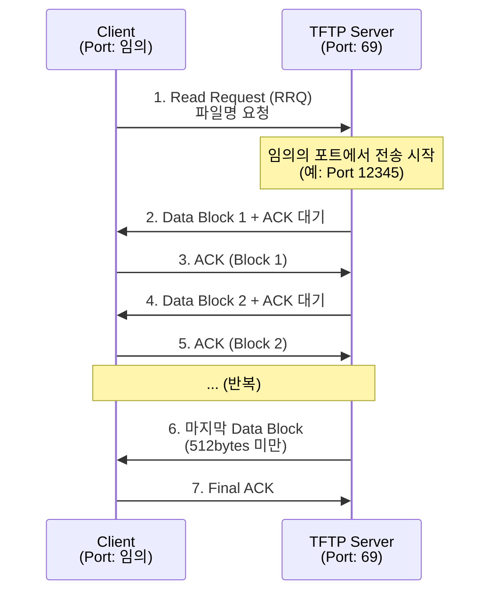

## TFTP (Trivial FTP)

**TFTP (Trivial File Transfer Protocol)**는 간단하고 경량의 파일 전송 프로토콜입니다. UDP 기반으로 복잡한 FTP의 기능을 최소화하여 임베디드 시스템, 네트워크 부팅 등에서 사용됩니다.

---

### 초보자를 위한 쉽게 이해하는 비유

* **FTP (배송 회사의 종합 서비스)**:
  - 주소 확인, 서명 요청, 배송 추적 등 모든 기능을 제공.

* **TFTP (편의점 배송)**:
  - 최소한의 기능만 제공. 빠르지만 복잡한 기능은 없음.

---

## TFTP 특징

| 특성 | 설명 |
|------|------|
| **프로토콜** | UDP (비연결 지향) |
| **포트** | 69 |
| **인증** | 없음 |
| **기능** | 최소화 (읽기/쓰기만) |
| **파일 크기** | 기본 32MB (블록 크기 설정으로 확대 가능) |
| **신뢰성** | 저하지만 간단함 |
| **용도** | 펌웨어 업로드, PXE 부팅, IoT 디바이스 부팅 |

---

## FTP vs TFTP 상세 비교

| 비교 항목 | FTP | TFTP |
|---------|-----|------|
| **프로토콜** | TCP | UDP |
| **포트** | 21/20 | 69 |
| **연결 방식** | 연결 지향 (Connection-oriented) | 비연결 지향 (Connectionless) |
| **인증** | ID/Password | 없음 |
| **기능** | 풍부함 (LIST, DELE, MKDIR 등) | 최소화 (GET, PUT만) |
| **구현 복잡도** | 복잡 | 간단 |
| **신뢰성** | 높음 (TCP의 재전송) | 낮음 (UDP 기반) |
| **용도** | 일반 파일 전송 | 네트워크 부팅, 펌웨어 업데이트 |
| **보안** | 취약 (평문 전송) | 인증 없음 (더 취약) |

---

## TFTP 동작 방식

### TFTP 프로토콜 흐름



### TFTP 패킷 형식

| 필드 | 크기 | 설명 |
|------|------|------|
| Opcode | 2 bytes | 1=RRQ, 2=WRQ, 3=DATA, 4=ACK, 5=ERROR |
| Filename | 가변 | 파일명 + null |
| Mode | 가변 | "netascii" 또는 "octet" + null |

---

## TFTP 명령어 (Opcode)

| Opcode | 메시지 | 설명 |
|--------|--------|------|
| **1** | RRQ (Read Request) | 파일 다운로드 요청 |
| **2** | WRQ (Write Request) | 파일 업로드 요청 |
| **3** | DATA | 데이터 블록 전송 |
| **4** | ACK | 수신 확인 |
| **5** | ERROR | 오류 응답 |

### TFTP 전송 모드

| 모드 | 설명 |
|------|------|
| **netascii** | 텍스트 모드 (줄 끝 변환) |
| **octet** | 바이너리 모드 (데이터 그대로 전송) |
| **mail** | 메일 모드 (거의 사용 안 함) |

---

## TFTP vs FTP 사용 시나리오

### FTP 사용 권장

```
- 다양한 파일 관리 필요
- 사용자 인증 필요
- 대용량 파일 전송
- 신뢰성 중요
```

예시:
```bash
ftp user@ftp.example.com
# ID/Password 입력 후 다양한 명령 실행
```

### TFTP 사용 권장

```
- 간단한 파일 전송만 필요
- 인증 불필요 (내부 네트워크)
- 빠른 부팅 시간 필요
- 임베디드 디바이스/라우터
```

예시:
```bash
# 라우터 펌웨어 업데이트
tftp 192.168.1.1
tftp> put firmware.bin
tftp> quit
```

---

## TFTP 보안 주의사항

### 보안 취약점

| 취약점 | 설명 | 대책 |
|--------|------|------|
| **인증 없음** | 누구나 접속 가능 | 방화벽 제한 |
| **암호화 없음** | 평문 전송 | 신뢰할 수 있는 네트워크에서만 사용 |
| **디렉토리 접근** | 루트 디렉토리 공개 | 접근 권한 관리 |

### 보안 적용 권장사항

```
1. TFTP 서버를 내부 네트워크에만 제한
2. 방화벽에서 TFTP (UDP 69) 차단
3. 특정 IP에서만 접속 허용
4. 읽기/쓰기 권한 제한
5. 감시(모니터링) 활성화
```

---

## 실무 명령어

```bash
# TFTP 클라이언트 접속
tftp 192.168.1.1

# TFTP 프롬프트에서
tftp> get firmware.bin          # 파일 다운로드
tftp> put local-file.bin        # 파일 업로드
tftp> mode octet               # 바이너리 모드 설정
tftp> verbose                  # 상세 정보 출력
tftp> quit                     # 종료

# 한 줄로 파일 다운로드 (일부 시스템)
tftp -g -r firmware.bin 192.168.1.1

# 한 줄로 파일 업로드 (일부 시스템)
tftp -p -l firmware.bin 192.168.1.1
```

---

## TFTP 서버 설정 (Linux)

```bash
# TFTP 서버 설치
sudo apt install tftpd-hpa

# 설정 파일 (보통 /etc/default/tftpd-hpa)
TFTP_USERNAME="tftp"
TFTP_DIRECTORY="/var/lib/tftpboot"
TFTP_ADDRESS="0.0.0.0:69"
TFTP_OPTIONS="--secure"

# TFTP 서버 시작
sudo systemctl start tftpd-hpa
sudo systemctl enable tftpd-hpa

# 상태 확인
sudo systemctl status tftpd-hpa
```

---

## 연결 문서 (Related Documents)

- [FTP Protocol](ftp-protocol.md) - FTP의 상세 설명 및 Active/Passive 모드
- [TCP/UDP Protocols](tcp-udp-protocols.md) - TCP와 UDP의 비교
- [OSI 7 Layer Model](osi-7-layer-model.md) - OSI 7 계층 (응용 계층)
