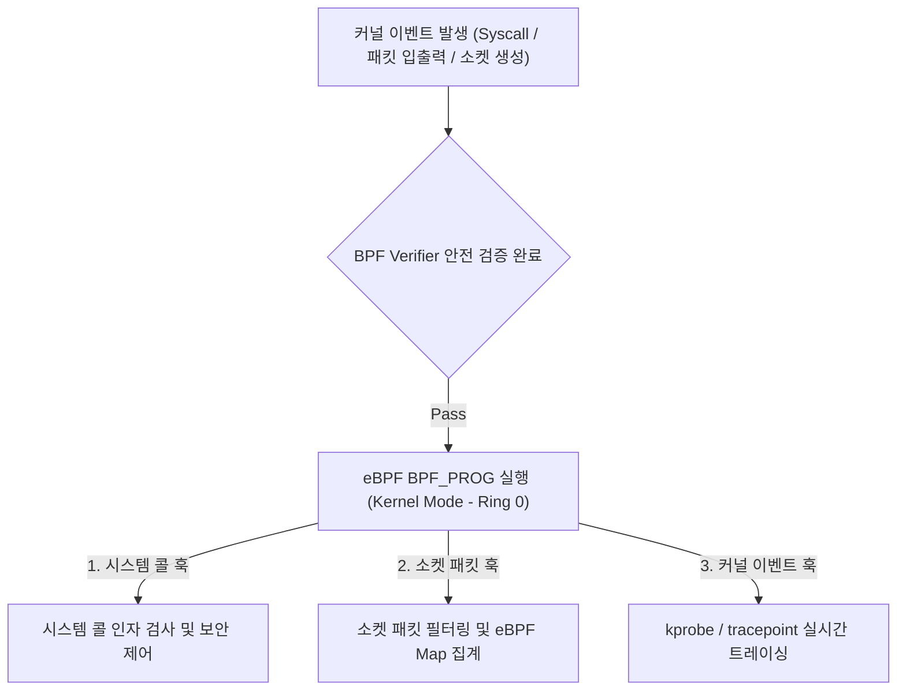

## eBPF (Extended Berkeley Packet Filter - Linux 커널 런타임 엔진)

### 1. 개요 (Overview)

**eBPF (Extended Berkeley Packet Filter)** 는 [Linux 커널](../../operating-systems/linux-kernel.md) 소스 코드를 직접 수정하거나 커널 모듈을 재컴파일하지 않고도, **[커널 이벤트](kernel-event.md)(네트워크 패킷 입출력, [시스템 콜(syscall)](system-call.md), [소켓 트래픽](../networking/socket.md), 보안 권한 이벤트)를 커널 공간 내부에서 안전하고 고속으로 관측하고 통제하는 차세대 커널 실행 엔진**이다.

서버 OS, Cloud Native (Kubernetes Cilium), 및 [Android 네트워크 런타임](../../mobile/android/01_system_internals/connectivity/ebpf-networking.md) 에 표준 적용되어 고성능 방화벽, 데이터 사용량 집계, 커널 추적(Tracing) 및 보안 패킷 드롭을 수행한다.

---

#### 초보자를 위한 쉽게 이해하는 비유

- **eBPF (고속도로 하이패스 정문 무인 검문 감시소)**:
  - [Linux 커널](../../operating-systems/linux-kernel.md) 톨게이트로 들어오는 [소켓 패킷](../networking/socket.md)과 [시스템 콜](system-call.md) 매 요청마다 매번 응용 앱을 정지시키고 검사하는 대신, 커널 입구 위에 소형 고속 스캐너(eBPF 바이트코드)를 달아두어 **[커널 이벤트](kernel-event.md) 발생 순간 0.001 초 만에 정상 패킷과 차단 대상을 걸러내는 무인 감시 엔진**.



---

### 2. 핵심 동작 원리 (Internal Mechanism)

1. **커널 레벨 안전 검증기 (BPF Verifier)**:
   - 유저스페이스에서 컴파일되어 로딩된 eBPF 바이트코드가 [Linux 커널](../../operating-systems/linux-kernel.md) 메모리를 침범하거나 무한 루프에 빠지지 않는지 사전 검증하여 커널 파닉스(Crash)를 완전 예방한다.
2. **eBPF Maps (유저스페이스 - 커널 간 데이터 공유 메모리)**:
   - 유저스페이스 애플리케이션과 커널 내 eBPF 바이트코드가 고속으로 데이터를 주고받기 위한 효율적인 링 버퍼 및 해시 맵 구조.
3. **[커널 이벤트](kernel-event.md) 훅 (Kprobes & Tracepoints)**:
   - `sys_enter`, `cgroup_skb`, `tc` 등 주요 [커널 이벤트](kernel-event.md) 지점에 바인딩되어 패킷 드롭, [시스템 콜](system-call.md) 차단, 트래픽 집계를 0ms 에 집행한다.

---

### 3. 관측 가능 증거 및 Linux CLI 명령어 (Observable Evidence)

Linux 커널 환경에서 로딩된 eBPF 바이트프로그램 및 BPF Map 현황을 `bpftool` 및 `tc` 도구로 진단한다:

```bash
# 1. 현재 커널에 로드된 eBPF 바이트프로그램 목록 및 ID 조회
sudo bpftool prog show

# 2. 커널 내부 eBPF Map 현황 및 데이터 덤프
sudo bpftool map dump id <map_id>

# 3. 네트워크 패킷 트래픽 컨트롤러(tc)에 바인딩된 eBPF 필터 조회
sudo tc filter show dev eth0 ingress
```

---

### 4. 연결 문서 (Related Links)

- [Linux 커널](../../operating-systems/linux-kernel.md) - eBPF 가 상주하는 하부 OS 커널
- [시스템 콜 (System Call)](system-call.md) - eBPF 가 훅하는 시스템 콜 인터페이스
- [소켓 (Socket)](../networking/socket.md) - eBPF 가 필터링하는 네트워크 소켓
- [커널 이벤트 (Kernel Event)](kernel-event.md) - eBPF 가 바인딩되는 tracepoint / kprobe
- [Android eBPF 네트워크 패킷 통제](../../mobile/android/01_system_internals/connectivity/ebpf-networking.md) - 안드로이드 eBPF 확장 노드
