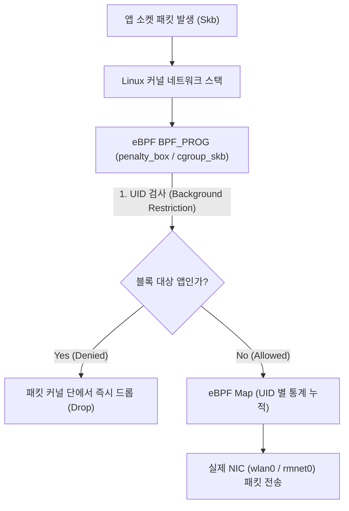

## eBPF (Extended Berkeley Packet Filter - Linux 커널 런타임 엔진)

### 1. 개요 (Overview)

**eBPF (Extended Berkeley Packet Filter)** 는 Linux 커널 소스 코드를 수정하거나 커널 모듈을 재컴파일하지 않고도, **커널 이벤트(네트워크 패킷 입출력, 시스템 콜, 소켓 트래픽, 보안 이벤트)를 커널 공간 내부에서 안전하고 고속으로 관측하고 제어하는 컴퓨터 과학 및 OS 핵심 커널 실행 엔진**이다.

서버 OS, Cloud Native (Kubernetes Cilium), 및 Android OS 런타임에 전반적으로 적용되어 고성능 방화벽, 트래픽 집계, 추적(Tracing) 및 보안 패킷 드롭을 수행한다.

---

#### 초보자를 위한 쉽게 이해하는 비유

- **eBPF (고속도로 하이패스 정문 무인 검문 감시소)**:
  - 톨게이트(커널 공간)에 차(패킷)들이 들어올 때, 매번 차를 멈추고 운전자 신분증을 확인하는 대신(기존 iptables/user-space 처리), 하이패스 차선 위에 소형 스캐너(eBPF 바이트코드)를 달아두어 **차량을 전혀 멈추지 않고 0.001 초 만에 승인 차량(Allowed)과 미납/수배 차량(Denied - penalty_box)을 걸러내는 고속 무인 감시소**.



---

### 2. 핵심 동작 원리 (Internal Mechanism)

1. **커널 레벨 안전 검증기 (BPF Verifier)**:
   - 개발자(Android OS `netd` 데몬)가 작성한 eBPF C 코드는 Clang 으로 LLVM 바이트코드로 컴파일된 후 커널에 로딩된다. BPF Verifier 가 무한 루프나 메모리 침범 위험이 없는지 사전에 검증하여 커널 파닉스(Crash)를 예방한다.
2. **eBPF Maps (유저스페이스 - 커널 간 데이터 공유 메모리)**:
   - `netd` 데몬이나 `ConnectivityService` 는 eBPF Map 을 통해 차단할 UID 목록(`penalty_box`)을 커널에 실시간 갱신하고, 커널이 기록한 앱별 데이터 소모량을 읽어온다.
3. **Data Saver 및 백그라운드 제한 (Data Saver & Network Policy)**:
   - 사용자가 백그라운드 데이터 제한을 켜면, 해당 앱의 UID 가 eBPF `penalty_box` 맵에 즉시 추가되어 백그라운드 소켓 패킷이 사용자 공간까지 도달하기 전에 커널 단에서 0ms 로 드롭된다.

---

## 3. 관측 가능 증거 및 Linux CLI 명령어 (Observable Evidence)

Linux 커널 환경에서 로딩된 eBPF 바이트프로그램 및 BPF Map 현황을 `bpftool` 및 `tc` 도구로 진단한다:

```bash
# 1. 현재 커널에 로드된 eBPF 바이트프로그램 목록 및 ID 조회
sudo bpftool prog show

# 2. 커널 내부 eBPF Map 현황 및 데이터 덤프
sudo bpftool map dump id <map_id>

# 3. 네트워크 패킷 트래픽 컨트롤러(tc)에 바인딩된 eBPF 필터 조회
sudo tc filter show dev eth0 ingress
```

---

### 4. 연결 문서 (Related Links)

- [Android Connectivity 런타임](../../mobile/android/01_system_internals/connectivity/android-connectivity.md) - 안드로이드 네트워크 전체 아키텍처
- [NetId & Multi-Routing Table](../../mobile/android/01_system_internals/connectivity/netid-routing-table.md) - netd 데몬과 멀티 라우팅 파이프라인
- [dumpsys 시스템 진단 도구](../../mobile/android/06_testing_performance/debugging/dumpsys.md) - dumpsys netd 상태 확인
- [system_server 표준 레퍼런스](../../mobile/android/04_system_services/system-server.md) - NetworkPolicyManagerService 호스팅
