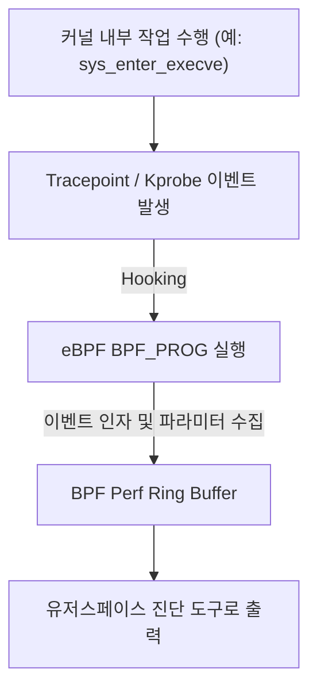

# Kernel Event & Tracing (커널 이벤트 및 트레이싱)

## 1. 개요 (Overview)

**Kernel Event (커널 이벤트)** 는 Linux 커널 내부에서 발생하는 **상태 변화 지점(시스템 콜 진입/진출, 소켓 패킷 수신, 콘텍스트 스위칭, 보안 권한 검사)** 을 일컫는다.

Linux 커널은 **`kprobes` (동적 커널 함수 프로빙)** 와 **`tracepoints` (정적 커널 트레이스 지점)** 메커니즘을 제공하여, 커널을 재컴파일하지 않고도 [eBPF](ebpf.md) 프로그램이 특정 커널 이벤트가 발생하는 순간을 실시간 훅(Hook)하여 모니터링할 수 있게 한다.

---

### 초보자를 위한 쉽게 이해하는 비유

* **커널 이벤트 & 프로브 (공장 생산 라인의 센서 훅)**:
  - 공장 전용 라인(커널) 내부의 특정 기계 부품이 움직일 때마다(커널 이벤트) 센서(kprobe / tracepoint)가 찰칵 감지하여 통계 컴퓨터([eBPF](ebpf.md))로 데이터를 쏘아 보내는 모니터링 센서 지점.



---

## 2. 주요 커널 이벤트 트레이싱 3대 메커니즘

1. **`kprobes` / `kretprobes`**: Linux 커널 내의 거의 모든 함수 시작(`kprobe`) 및 반환(`kretprobe`) 지점에 동적으로 브레이크포인트를 삽입하는 기법.
2. **`tracepoints`**: 커널 개발자가 핵심 서브시스템(네트워크, 디스크 I/O, 무선 칩셋)에 미리 심어놓은 정적 훅 지점.
3. **`uprobes`**: 유저스페이스 바이너리 및 공유 라이브러리의 함수 호출 지점을 커널에서 트레이싱하는 훅 지점.

---

## 3. 관측 가능 증거 및 Linux CLI 명령어

Linux 커널의 `ftrace` 및 `trace-cmd` 를 이용해 커널 이벤트를 실시간 로깅할 수 있다:

```bash
# Available tracepoint 커널 이벤트 목록 조회
sudo cat /sys/kernel/debug/tracing/available_events | grep sys_enter
```

---

## 4. 연결 문서 (Related Links)

- [eBPF 커널 런타임 엔진](ebpf.md) - 커널 이벤트를 훅하여 바이트코드 집행
- [시스템 콜 (System Call)](system-call.md) - sys_enter / sys_exit 커널 이벤트
- [Linux 커널](../../operating-systems/linux-kernel.md) - 커널 트레이싱 서브시스템
