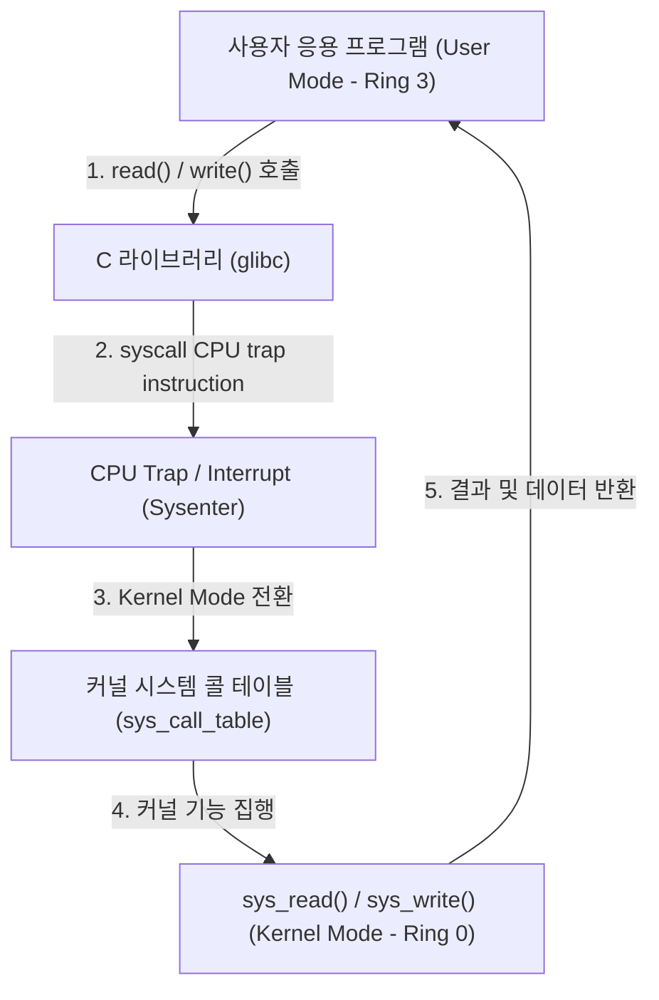

# System Call (시스템 콜 / syscall)

## 1. 개요 (Overview)

**System Call (시스템 콜 / syscall)** 은 사용자 응용 프로그램(User Space)이 하드웨어 자원(파일, 메모리, 네트워크 소켓, 프로세스 생성)에 접근하기 위해 **운영체제 커널(Kernel Space)에게 특권 실행을 요청하는 표준 프로그래밍 인터페이스**이다.

CPU 의 실행 모드를 User Mode(Ring 3)에서 Kernel Mode(Ring 0)로 전환시키는 **인터럽트/트랩(sysenter / syscall instruction)** 을 통해 동작하며, 커널의 안전성과 자원 보호를 보장한다.

---

### 초보자를 위한 쉽게 이해하는 비유

* **시스템 콜 (은행 창구 직원을 통한 금고 출금)**:
  - 예금주(사용자 앱)가 은행 비밀 금고(하드웨어/커널)에 직접 걸어 들어가 돈을 집어 올 수 없고, 반드시 통로에 있는 **전용 은행 창구 직원(시스템 콜)**에게 신분증과 전표를 내밀어 직원이 대신 금고에서 돈을 받아 오게 하는 안전 출입 창구.



---

## 2. 주요 시스템 콜 분류

1. **프로세스 제어**: `fork()`, `execve()`, `exit()`, `waitpid()`
2. **파일 및 I/O 관리**: `open()`, `read()`, `write()`, `close()`
3. **네트워크 소켓**: `socket()`, `bind()`, `connect()`, `accept()`, `send()`, `recv()`
4. **메모리 관리**: `brk()`, `mmap()`, `munmap()`

---

## 3. 관측 가능 증거 및 Linux CLI 명령어

Linux 환경에서 애플리케이션이 실행 중 호출하는 시스템 콜을 `strace` 도구로 실시간 추적할 수 있다:

```bash
# 특정 프로세스가 실행하는 시스템 콜 실시간 추적
strace -f -e trace=open,read,write,socket -p <pid>
```

---

## 4. 연결 문서 (Related Links)

- [Linux 커널](../../operating-systems/linux-kernel.md) - 커널 모드 및 자바 런타임 하부 OS
- [eBPF 커널 런타임 엔진](ebpf.md) - 시스템 콜 트레이싱 및 sys_enter 가로채기
- [소켓 네트워크 통신](../networking/socket.md) - socket() 시스템 콜 기반 통신
