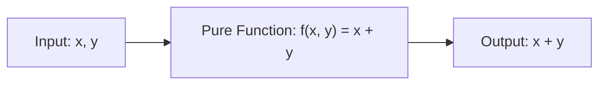

## Pure Function (순수 함수) 란 무엇인가

소프트웨어 공학 및 함수형 프로그래밍(FP)에서 **Pure Function (순수 함수)**이란 다음 두 가지 조건을 엄격하게 만족하는 함수를 말합니다.

1. **동일 입력 - 동일 출력 (Deterministic)**: 동일한 매개변수(Argument)가 전달되면 몇 번을 실행하더라도 항상 100% 동일한 결과값을 반환합니다.
2. **부작용 없음 ([Side Effect](../../02_references/computer-science/side-effect.md)-Free)**: 함수 실행 과정에서 함수 외부의 변수/상태를 변경하지 않으며, I/O 작업(파일 읽기/쓰기, 네트워크 통신, 콘솔 출력 등)을 일으키지 않습니다.

---

### 초보자를 위한 쉽게 이해하는 비유

순수 함수는 **"수학 계산기"**와 같습니다.
계산기에 `2 + 3`을 입력하면 내일 누르든, 100번 누르든 항상 `5`가 나옵니다. 계산기를 누른다고 해서 집 안의 전등이 켜지거나(부작용), 이전 계산 기록에 따라 결과가 달라지지 않는 것과 같습니다.

---

### 순수 함수의 핵심 특성과 이점

1. **참조 투명성 (Referential Transparency)**
   * 함수 호출 표현식을 그 결과값으로 언제든 대체하더라도 프로그램 동작이 달라지지 않는 성질입니다.
   * 예: `add(2, 3)`이란 코드는 어디서나 숫자 `5`로 바로 바꿔 써도 완전히 동일합니다.

2. **안전한 동시성 및 스레드 안전성 (Thread Safety)**
   * 외부의 가변 상태(Mutable State)에 의존하거나 수정하지 않으므로, 수많은 스레드에서 동시에 호출해도 데이터 오염이나 경쟁 상태(Race Condition)가 발생하지 않습니다.

3. **쉬운 테스트 및 디버깅**
   * 데이터베이스, 네트워크, 외부 환경(현재 시간 등)을 가짜로 흉내 내기 위한 복잡한 Mock/Stub 객체가 필요 없습니다. 단순히 입력을 넣고 출력값만 검증하면 테스트가 끝납니다.

4. **메모제이션 및 캐싱 (Memoization)**
   * 동일 입력에 대해 항상 동일한 결과가 보장되므로, 계산 비용이 비싼 함수 결과를 메모리에 저장(캐싱)해 두고 재사용할 수 있습니다.

---

### 순수 함수 vs 비순수 함수 (Impure Function) 비교

동일 입력에 따른 결과 결정론 및 부작용 유무에 따른 비순수 함수(Impure Function)와의 비교와 실무 활용은 별도 문서로 분리되어 있습니다.

- **[Pure vs Impure Function](pure-vs-impure-function.md)** - 순수 함수와 비순수 함수의 기술 비교표 및 실무 적용 지침

---

### 선언적 UI 프레임워크에서의 의미 (Jetpack Compose, React)

Jetpack Compose의 `@Composable` 함수 본문이나 React 컴포넌트는 **"상태(State)를 입력받아 UI 구조를 반환하는 순수 함수"** 개념을 지향합니다.

UI 런타임은 성능 최적화를 위해 컴포넌트를 언제든 임의의 순서나 비동기로 재실행(Recomposition)할 수 있습니다. 만약 UI 함수 내부가 비순수 함수여서 실행할 때마다 외부 변수를 바꾸거나 네트워크 요청을 보낸다면, 화면을 그릴 때마다 심각한 버그와 데이터 오염이 생기게 됩니다.

---

### 연관 노트

- [Pure vs Impure Function](pure-vs-impure-function.md) - 순수 함수와 비순수 함수 비교
- [Side Effect](../../02_references/computer-science/side-effect.md) - 순수 함수의 자격 요건인 부작용 부재에 관한 레퍼런스
- [Idempotency](../../02_references/computer-science/idempotency.md) - 순수성과 멱등성의 개념적 차이점 비교
- [Immutability](immutability.md) - 순수 함수가 의존하는 불변 데이터 구조
- [Composable Body Must Be Fast, Idempotent and Side-Effect Free](../mobile/android/02_app_framework/jetpack-compose/runtime/compose-runtime-contracts/composable-body-purity.md) - Compose 런타임에서 Composable 본문이 순수해야 하는 이유
