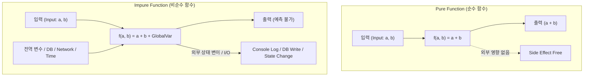

# Pure vs Impure Function (순수 함수와 비순수 함수 비교)

## 1. 개요 (Overview)

프로그래밍에서 함수는 외부에 미치는 영향과 동일 입력에 대한 동일 출력 보장 여부에 따라 **[Pure Function (순수 함수)](pure-function.md)** 와 **Impure Function (비순수 함수)** 로 분류된다. 함수형 프로그래밍(FP) 및 현대 선언적 UI 프레임워크는 예측 가능성과 동시성 안전성을 위해 순수 함수 사용을 적극 권장한다.

---

### 초보자를 위한 쉽게 이해하는 비유

* **순수 함수 (수학 계산기 / 자판기)**:
  - 동전을 넣고 버튼을 누르면 항상 약속된 음료수(결과)가 나온다. 버튼을 누른다고 자판기 외부의 날씨가 바뀌거나 건물에 불이 나지 않는다. (외부 영향 0, 예측률 100%)
* **비순수 함수 (오늘의 운세 자판기 / 주사위 던지기)**:
  - 동전을 넣어도 시각, 현재 날씨, 전역 상태 변수 등에 따라 매번 결과가 달라진다. 또한 버튼을 누를 때마다 사장님 핸드폰으로 문자 메시지가 발송([Side Effect](../../02_references/computer-science/side-effect.md))된다. (결과 불확실, 외부 상태 변이)

---

## 2. Pure vs Impure Function 핵심 기술 비교표

| 비교 항목 | 순수 함수 (Pure Function) | 비순수 함수 (Impure Function) |
| :--- | :--- | :--- |
| **결과 결정론 (Determinism)** | **100% 결정론적 (Deterministic)** 동일 입력 ➔ 항상 동일 출력 | **비결정론적 (Non-deterministic)** 외부 상태/시간/난수에 따라 결과 변동 |
| **부작용 ([Side Effect](../../02_references/computer-science/side-effect.md))** | **❌ 전혀 없음** | **⭕ 존재 함** (전역 변수 수정, DB 변경, I/O 수행) |
| **참조 투명성** | **보장됨** (함수 호출식을 결과값으로 대체 가능) | **불가** (호출 시점과 횟수가 결과/상태에 영향) |
| **스레드 안전성 (Thread Safety)**| **100% 스레드 안전** (동시성 데이터 경쟁 0) | **데이터 경쟁 (Race Condition) 위험** 존재 |
| **테스트 용이성** | **매우 쉬움** (Mock/Stub 없이 입력/출력 검증) | **어려움** (DB, 네트워크, 외부 환경 Mocking 필요) |
| **캐싱 / 메모제이션** | **가능** (입력값 키로 결과 캐싱 재사용) | **불가** (매번 호출 시마다 새로 실행 필요) |
| **Code Example (Kotlin)** | `fun add(a: Int, b: Int): Int = a + b` | `var total = 0` `fun addAndSave(a: Int) { total += a }` |

---

## 3. 실무에서의 사용 트렌드 및 지침

현대 소프트웨어 아키텍처(Clean Architecture, Redux, Jetpack Compose 등)에서는 **"비즈니스 로직과 UI 렌더링은 순수 함수로 작성하고, Side Effect는 격리된 영역(Effect Handling Layer)에서 제어"**하는 패턴을 채택한다.

- **순수 영역**: 도메인 연산, 데이터 변환, UI 상태 결정 로직
- **비순수 영역**: 네트워크 요청, 데이터베이스 CRUD, 시스템 시간 조회, 디스크 파일 저장

---

## 4. 연결 문서 (Related Links)

- [Pure Function](pure-function.md) - 순수 함수의 자격 요건 및 선언적 UI에서의 의미
- [Side Effect](../../02_references/computer-science/side-effect.md) - 부작용의 정의 및 소프트웨어 영향
- [Immutability](immutability.md) - 순수 함수의 기반이 되는 불변성 개념
