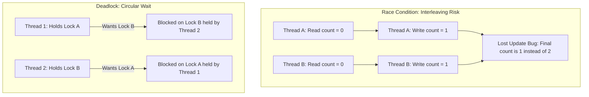

## 동시성 문제: Race Condition & Deadlock

멀티스레드 및 동시성(Concurrency) 프로그래밍 환경에서 **Race Condition(경쟁 상태)**, **Mutex/Lock(상호 배제)**, **Deadlock(교착 상태)**은 소프트웨어 안정성을 위협하는 3대 핵심 개념입니다.

---

### 초보자를 위한 쉽게 이해하는 비유

* **Race Condition (경쟁 상태)**: **"공용 노트에 두 사람이 동시에 글 쓰기"**와 같습니다. A와 B가 서로 상대방의 글을 확인하지 않고 동시에 숫자를 읽고 `+1`을 적다 보면, 한 사람의 작업 기록이 지워지는(Lost Update) 데이터 오염 버그가 생깁니다.
* **Mutex / Lock (상호 배제)**: **"화장실 열쇠"**와 같습니다. 열쇠를 가진 사람 1명만 화장실(임계 영역)에 들어가고 문을 잠급니다. 볼일이 끝나면 열쇠를 반납해야 다른 사람이 들어갈 수 있습니다.
* **Deadlock (교착 상태)**: **"좁은 외나무다리에서 만난 두 자동차"**와 같습니다. 양쪽 자동차가 서로 상대방이 양보하기만을 기다리며 멈춰 서서 아무도 앞으로 나아가지 못하는 영구 대기 상태입니다.

---

### 1. Race Condition (경쟁 상태)

#### 정의
두 개 이상의 프로세스나 스레드가 공유 데이터(Shared Resource)에 동시에 접근하여 조작할 때, **실행 순서(Timing / Interleaving)에 따라 연산의 최종 결과가 달라지는 비결정론적 오류 상태**입니다.

#### Data Race와의 차이점
* **Data Race (데이터 경쟁)**: 동기화(Synchronization) 없이 둘 이상의 스레드가 메모리의 같은 위치에 접근하고 하나 이상이 쓰기(Write) 작업인 하위 레벨 언어 스펙 개념입니다.
* **Race Condition**: 비즈니스 로직 수준의 타이밍 실패나 경쟁 상태를 포함하는 더 넓은 개념입니다.

---

### 2. Mutex / Lock (상호 배제)

#### 정의
**Mutex (Mutual Exclusion)** 및 **Lock**은 임계 영역(Critical Section)에 한 번에 단 하나의 스레드만 접근할 수 있도록 제어하는 동기화 열쇠입니다.

#### 핵심 특징
* **소유권 (Ownership)**: Mutex는 락을 획득(Acquire/Lock)한 바로 그 스레드만 락을 해제(Release/Unlock)할 수 있는 소유권 개념이 존재합니다. (세마포어와의 결정적 차이점)

---

### 3. Deadlock (데드락 / 교착 상태)

#### 정의
둘 이상의 작업이 서로 상대방이 가진 자원(락)을 얻기 위해 대기하면서 **모든 작업의 진행이 영구적으로 중단되는 멈춤 현상**입니다.

#### Deadlock 발생의 4가지 필요충분 조건 (Coffman Conditions)
데드락은 다음 4가지 코프만(Coffman) 조건이 **동시에 모두 성립**할 때만 발생합니다.

1. **상호 배제 (Mutual Exclusion)**: 한 번에 한 스레드만 자원을 사용할 수 있음
2. **점유와 대기 (Hold and Wait)**: 자원을 점유한 채로 다른 자원을 추가 대기함
3. **비선점 (No Preemption)**: 다른 스레드가 가진 자원을 강제로 빼앗을 수 없음
4. **순환 대기 (Circular Wait)**: A는 B의 락을, B는 A의 락을 서로 대기하는 고리 형성

---

### 개념 간 차이점 종합 비교

| 구분 | Race Condition (경쟁 상태) | Deadlock (교착 상태) |
| :--- | :--- | :--- |
| **발생 원인** | 동기화 부족으로 무작위 덮어쓰기 발생 | 락 획득 순서 꼬임으로 인한 순환 대기 |
| **프로그램 상태** | 스레드가 계속 실행되며 **잘못된 데이터 생성** | 스레드가 멈춰서(Blocked) **작업 진행 안 됨** |
| **주요 해결책** | Mutex/Lock 적용, [Immutability](immutability.md), Atomic 연산 | Lock 획득 순서 정렬, 타임아웃, Lock 범위 최소화 |

---

### 주요 예방 및 해결 전략

1. **[Immutability](immutability.md) (불변성) 활용**
   * 불변 객체는 상태를 변경할 수 없어 Lock 없이도 Race Condition을 100% 근본적으로 예방합니다.
2. **Lock Ordering (락 획득 순서 정렬)**
   * 시스템 내부의 모든 락에 순서를 지정하여 반드시 Lock A ➔ Lock B 순서로만 획득하게 만들어 Circular Wait 조건 자체를 파괴합니다.
3. **Lock-free / Atomic 연산**
   * 하드웨어 지원 CAS(Compare-And-Swap) 명령어 기반의 `AtomicInteger` 등을 활용해 Lock 없이 안전하게 카운팅을 수행합니다.

---

### 연관 노트

- [Structured Concurrency](structured-concurrency.md) - 안전한 비동기 작업 범위 제어
- [Immutability](immutability.md) - 경쟁 상태를 없애는 불변 데이터 구조
- [Context](context.md) - 스레드 실행 환경과 상태 관리
- [Pure Function](pure-function.md) - 상태를 변이시키지 않는 순수 함수

