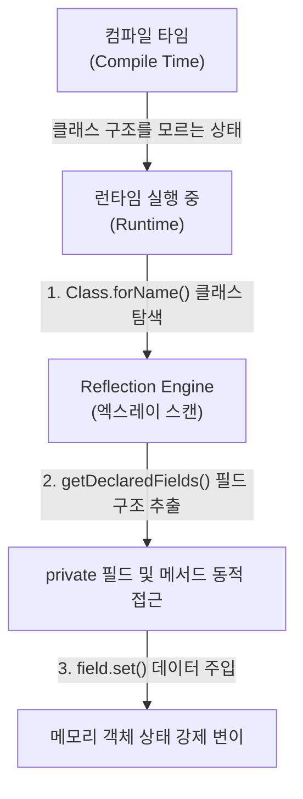

## Reflection (런타임 리플렉션)

### 1. Reflection 이란 무엇인가

프로그래밍 언어 및 런타임 환경에서 **Reflection (리플렉션 / 런타임 리플렉션)** 은 **"프로그램이 런타임(실행 중)에 자기 자신의 구조(클래스 정의, 필드, 메서드, 어노테이션 등)를 동적으로 조사(Introspect)하고 수정(Mutate)할 수 있는 메커니즘"** 을 의미한다.

정적 메타데이터를 런타임에 조회하므로, 소스 코드 작성 시점에 클래스나 메서드의 이름을 몰라도 문자열 이름 기반으로 클래스를 로딩하거나 private 필드에 접근하여 값을 읽고 쓸 수 있다.

---

#### 초보자를 위한 쉽게 이해하는 비유

- **일반적인 코드 작성 (Static Access)**:
  - **"설계도가 이미 완성된 정품 규격 부품을 순서대로 조립하는 공장"** 과 같다. 컴파일 시점에 무엇을 실행할지 100% 알고 있으므로 속도가 매우 빠르다.
- **리플렉션 (Reflection)**:
  - **"X-ray 엑스레이 검사기"** 와 같다. 실행 중에 상자가 들어오면 상자를 열어보지 않고 엑스레이로 내부 필드 구조를 하나하나 스캔하고 탐색한 뒤, 비공개(private) 부품까지 몰래 조작하는 방식이다.

---

### 2. 리플렉션의 주요 활용 분야

리플렉션은 유연성이 높아 현대적인 프레임워크나 라이브러리 내부에서 널리 활용된다.

1. **의존성 주입 (Dependency Injection / DI Framework)**:
   - Spring Framework 나 구형 Guice 등에서 클래스 생성자에 `@Inject` 가 달린 필드를 런타임 탐색하여 의존성을 주입할 때 사용한다.
2. **구형 직렬화 메커니즘 ([Serializable](../mobile/android/00_foundations/glossary/android-glossary/19-serializable.md))**:
   - `java.io.Serializable` 이 객체를 바이트 스트림으로 바꿀 때, 런타임 리플렉션으로 객체의 모든 private 필드를 동적으로 탐색하여 추출한다.
3. **ORM (Object-Relational Mapping)**:
   - JPA/Hibernate 가 DB 테이블 컬럼과 자바 객체 필드를 매핑할 때 사용한다.

---

### 3. 리플렉션의 심각한 단점 (왜 함부로 쓰면 안 되는가?)

#### 1) 심각한 런타임 성능 오버헤드 (Performance Cost)

- 런타임에 클래스 필드와 메서드를 탐색하고 보안 검사(Access Control)를 거치므로, 직접 메서드를 호출하는 것보다 **수십 배 ~ 수백 배 이상 느리다.**
- Android 런타임([ART](../mobile/android/01_system_internals/art.md))에서 JIT/AOT 컴파일러 최적화(Inlining)를 방해한다.

#### 2) 가비지 컬렉션(GC) 부담 폭증

- 필드와 메서드를 탐색하는 과정에서 `Field`, `Method`, `Class` 등의 임시 메타데이터 객체가 무수히 생성되어 [가비지 컬렉션(GC)](garbage-collection.md) 팝업과 [프레임 드롭(Jank)](../../android/01_system_internals/graphics-and-media/graphics-media-contracts/jank-is-frame-deadline-failure-across-ui-renderthread-and-surfaceflinger) 을 일으킨다.

#### 3) 컴파일 타임 타입 안전성 파괴 (Compile-time Type Safety Loss)

- 클래스나 메서드 이름에 오타가 있어도 컴파일 시점에는 에러가 나지 않고, 앱이 실행되는 런타임 시점에 `ClassNotFoundException`이나 `NoSuchMethodException` 으로 폭발(Crash)한다.

---

### 4. 리플렉션의 대안: 컴파일 타임 코드 생성 (KSP / APT & Metro DI)

현대적인 모바일 및 웹 개발(Android/Kotlin)에서는 런타임 리플렉션의 단점을 극복하기 위해 **[Compile-time Code Generation (컴파일 타임 코드 생성)](compile-time-code-generation.md)** 기술로 완전히 전환되었다.

- **KSP (Kotlin Symbol Processing) / APT (Annotation Processing)**:
  - 런타임에 엑스레이 스캔하듯 리플렉션을 돌리는 대신, 컴파일 시점에 심볼과 어노테이션을 분석하여 팩토리 및 직렬화 소스 코드를 사전 생성한다. 자세한 메커니즘은 [Compile-time Code Generation](compile-time-code-generation.md) 문서를 참고한다.
- **현대 DI 프레임워크 (Metro DI / Dagger / Hilt)**:
  - 과거 Spring/Guice 처럼 런타임 리플렉션으로 객체를 주입하던 방식에서 탈피하여, **컴파일 타임에 KSP/APT 가 의존성 그래프 조립 소스 코드를 자동 생성**한다. 런타임 리플렉션 0% 로 초고속 객체 주입을 보장한다.
- **Kotlinx.serialization (`@Serializable`)**:
  - 런타임 리플렉션 대신 **컴파일 타임에 `KSerializer` 코드를 생성**하여 초고속 직렬화를 제공한다.
- **Android `@Parcelize`**:
  - [Parcelable](../mobile/android/00_foundations/glossary/android-glossary/18-parcelable.md) 코드를 컴파일 시점에 자동 생성한다.

---

## 5. 연결 문서 (Related Links)

- [Compile-time Code Generation (KSP / APT)](compile-time-code-generation.md) - 리플렉션을 대체하는 KSP/APT 및 Metro/Dagger DI 메커니즘
- [Serializable](../mobile/android/00_foundations/glossary/android-glossary/19-serializable.md) - 리플렉션 기반 구형 직렬화와 컴파일 타임 kotlinx.serialization 비교
- [Garbage Collection](garbage-collection.md) - 리플렉션 객체 생성으로 인해 유발되는 GC 팝업
- [ART (Android Runtime)](../mobile/android/01_system_internals/art.md) - 리플렉션 실행 시 컴파일 최적화가 제약되는 안드로이드 런타임
