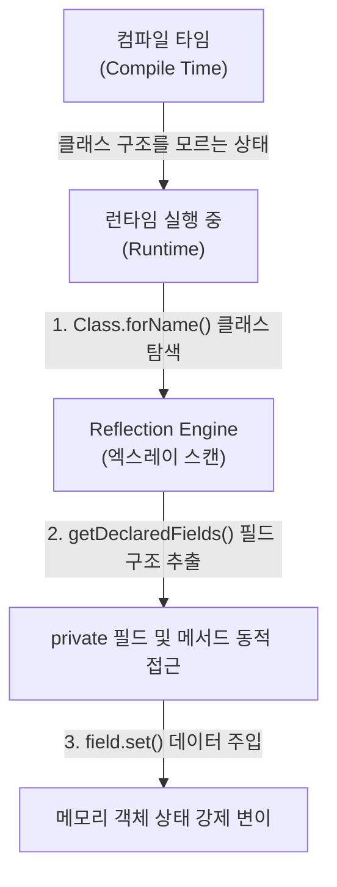

## Reflection (런타임 리플렉션)

### 1. Reflection 이란 무엇인가

프로그래밍 언어 및 런타임 환경에서 **Reflection (리플렉션 / 런타임 리플렉션)** 은 **"프로그램이 런타임(실행 중)에 자기 자신의 구조(클래스 정의, 필드, 메서드, 어노테이션 등)를 동적으로 조사(Introspect)하고 수정(Mutate)할 수 있는 메커니즘"** 을 의미한다.

정적 메타데이터를 런타임에 조회하므로, 소스 코드 작성 시점에 클래스나 메서드의 이름을 몰라도 문자열 이름 기반으로 클래스를 로딩하거나 private 필드에 접근하여 값을 읽고 쓸 수 있다.

---

#### 초보자를 위한 쉽게 이해하는 비유

- **일반적인 코드 작성 (Static Access)**:
  - **"설계도가 이미 완성된 정품 규격 부품을 순서대로 조립하는 공장"** 과 같다. 컴파일 시점에 무엇을 실행할지 100% 알고 있으므로 속도가 매우 빠르다.
- **리플렉션 (Reflection)**:
  - **"X-ray 엑스레이 검사기"** 와 같다. 실행 중에 상자가 들어오면 상자를 열어보지 않고 엑스레이로 내부 필드 구조를 하나하나 스캔하고 탐색한 뒤, 비공개(private) 부품까지 몰래 조작하는 방식이다.

---

### 2. Java Reflection vs Kotlin Reflection (`kotlin-reflect`)

"리플렉션은 Java 의 구시대 유물이라 Kotlin 에서는 쓰지 않는다"고 생각하기 쉽지만, **Kotlin 도 자체적인 공식 리플렉션 API (`kotlin-reflect`)를 제공**한다. 다만 언어 차원에서 사용을 강력히 지양하도록 설계되어 있다.

### 1) Java Reflection (`java.lang.reflect`)
- JDK 1.1 부터 제공된 자바의 전통적인 리플렉션 패키지 (`Class`, `Field`, `Method`).
- Java 의 모든 객체와 런타임 타입을 스캔하지만, Kotlin 전용 기능(Nullability, Data Class Component, Property Delegate, Sealed Class)을 파악하지 못한다.

### 2) Kotlin Reflection (`kotlin.reflect`)
- Kotlin 언어 특성을 지원하기 위한 전용 패키지 (`KClass`, `KProperty`, `KFunction`).
- Kotlin 객체의 널 가능성(Nullable `?`), 가변성(`val` vs `var`), 프로퍼티 위임(Delegate) 정보를 런타임에 동적으로 조회할 수 있다.

---

## 3. Kotlin 이 런타임 리플렉션을 지양하는 이유와 언어적 대안

Kotlin 생태계에서는 **`kotlin-reflect` 사용을 가급적 피하고 컴파일 타임으로 해결**하는 패턴을 권장한다.

1. **`kotlin-reflect.jar` 파일 용량 부담**:
   - 코틀린 리플렉션 라이브러리를 프로젝트에 포함하면 APK/AAB 빌드 용량이 약 2.5MB 이상 증가한다.
2. **`inline` + `reified` 키워드를 통한 런타임 타입 추상화**:
   - Java 에서는 generic 타입 파라미터가 런타임에 소거(Type Erasure)되어 `Class<T>` 를 얻으려면 리플렉션을 써야 했다.
   - Kotlin 은 **`inline fun <reified T> getGenericType()`** 문법을 통해 리플렉션 없이 컴파일 타임에 타입을 구체화(Reify)하여 리플렉션 오버헤드를 0 으로 만든다.
3. **KSP 기반 컴파일 타임 코드 생성**:
   - [Compile-time Code Generation](compile-time-code-generation.md)을 활용하여 `kotlinx.serialization` 이나 Metro/Hilt DI 처럼 리플렉션 없는 초고속 빌드를 지향한다.

---

## 4. 리플렉션의 주요 활용과 단점

### 1) 주요 활용 분야

- **구형 의존성 주입 (DI)**: Spring Framework, Guice 등 런타임 탐색.
- **구형 직렬화**: [java.io.Serializable](../mobile/android/00_foundations/glossary/android-glossary/19-serializable.md) 객체 자동 변환.

### 2) 단점

- **런타임 성능 오버헤드**: 직접 호출 대비 수십 배 이상 느리며 [ART 런타임](../mobile/android/01_system_internals/art.md) 최적화를 방해함.
- **가비지 컬렉션(GC) 폭증**: 메타데이터 객체 남발로 [Garbage Collection](garbage-collection.md) 팝업 유발.
- **타입 안전성 파괴**: 오타 발생 시 런타임 크래시 유발.

---

## 5. 리플렉션의 대안: 컴파일 타임 코드 생성 (KSP / APT & Metro DI)

현대적인 모바일 및 웹 개발(Android/Kotlin)에서는 런타임 리플렉션의 단점을 극복하기 위해 **[Compile-time Code Generation (컴파일 타임 코드 생성)](compile-time-code-generation.md)** 기술로 완전히 전환되었다.

- **KSP (Kotlin Symbol Processing) / APT (Annotation Processing)**:
  - 런타임에 엑스레이 스캔하듯 리플렉션을 돌리는 대신, 컴파일 시점에 심볼과 어노테이션을 분석하여 팩토리 및 직렬화 소스 코드를 사전 생성한다. 자세한 메커니즘은 [Compile-time Code Generation](compile-time-code-generation.md) 문서를 참고한다.
- **현대 DI 프레임워크 (Metro DI / Dagger / Hilt)**:
  - 과거 Spring/Guice 처럼 런타임 리플렉션으로 객체를 주입하던 방식에서 탈피하여, **컴파일 타임에 KSP/APT 가 의존성 그래프 조립 소스 코드를 자동 생성** 한다. 런타임 리플렉션 0% 로 초고속 객체 주입을 보장한다.
- **Kotlinx.serialization (`@Serializable`)**:
  - 런타임 리플렉션 대신 **컴파일 타임에 `KSerializer` 코드를 생성**하여 초고속 직렬화를 제공한다.
- **Android `@Parcelize`**:
  - [Parcelable](../mobile/android/00_foundations/glossary/android-glossary/18-parcelable.md) 코드를 컴파일 시점에 자동 생성한다.

---

## 6. 연결 문서 (Related Links)

- [Compile-time Code Generation (KSP / APT)](compile-time-code-generation.md) - 리플렉션을 대체하는 KSP/APT 및 Metro/Dagger DI 메커니즘
- [Serializable](../mobile/android/00_foundations/glossary/android-glossary/19-serializable.md) - 리플렉션 기반 구형 직렬화와 컴파일 타임 kotlinx.serialization 비교
- [Garbage Collection](garbage-collection.md) - 리플렉션 객체 생성으로 인해 유발되는 GC 팝업
- [ART (Android Runtime)](../mobile/android/01_system_internals/art.md) - 리플렉션 실행 시 컴파일 최적화가 제약되는 안드로이드 런타임
