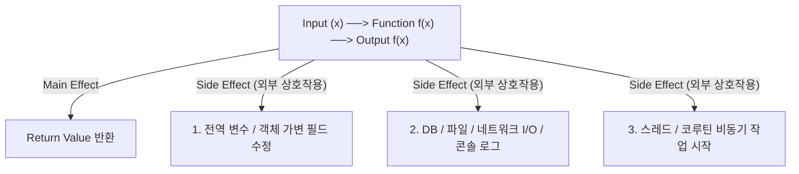

## Side Effect

### 1. 개요 (Overview)

**Side Effect (부수 효과 / 부작용)** 는 소프트웨어 공학에서 **함수나 표현식이 자신의 반환값(Return Value)을 생성하는 주된 목적(Main Effect) 이외에, 함수 외부의 상태(Global State, DB, 파일 I/O, UI 등)를 변경하거나 외부 세계와 상호작용하는 모든 행위**를 의미하는 컴퓨터 공학의 기본 개념이다.

의학 용어인 '부작용'에서 유래했지만, 컴퓨터 과학에서는 단순히 "해로운 버그"만을 뜻하는 것이 아니라 **"주 목적을 벗어나는 모든 상태 변화 및 I/O 동작"** 을 가리키는 중립적인 용어다.

---

#### 초보자를 위한 쉽게 이해하는 비유

- **Pure Function vs Side Effect (순수 계산기와 벽면 스위치)**:
  - **Pure Function (순수 계산기)**: `2 + 3` 을 누르면 오직 화면에 `5` 만 보여주고 방 안의 전등이나 전원에 아무런 영향을 주지 않음.
  - **Side Effect (벽면 스위치)**: 버튼을 누르는 동작(반환값) 외에, 방 안의 전등을 켜거나(전역 상태 변경), 외부 전기를 경보음으로 울리는(I/O 상호작용) 외부 변이를 일으킴.



---

### 2. Side Effect 유발 동작 및 연관 개념 Matrix

#### Side Effect 를 유발하는 5 대 대표 동작

1. **외부 상태 변이 (State Mutation)**: 전역 변수, 싱글톤 객체, 클래스 인스턴스 가변 멤버 변수 수정
2. **I/O 작업**: 파일 읽기/쓰기, 네트워크 API 호출, 데이터베이스 Query/Mutation, 콘솔 로그 출력 (`println`, `Log.d`)
3. **비동기 및 동시성 작업 트리거**: 코루틴/스레드 시작 (`CoroutineScope.launch`), 비동기 작업 등록
4. **비결정적(Non-Deterministic) 요소 의존**: `System.currentTimeMillis()`, `Random.nextInt()` 등 실행 시마다 달라지는 외부 데이터 조회
5. **UI 프레임워크 부수 효과**: UI 렌더링 파이프라인 외부에서의 Toast/Snackbar 표시, Navigation 전환

#### 연관 개념 비교 Matrix

| 개념                                    | 정의                             | Side Effect 허용 여부     | 핵심 보장 성질                            |
| :------------------------------------ | :----------------------------- | :-------------------- | :---------------------------------- |
| **[Pure Function](pure-function.md)** | 입력값만으로 출력을 만들고 외부 상태 미변경       | ❌ 절대 금지               | 입력이 같으면 항상 출력 동일 (Side-Effect Free) |
| **멱등성 (Idempotency)** | N 번 실행해도 최종 결과 상태가 1 번 실행과 동일  | ⭕ 허용 (단, 상태 변화 누적 금지) | `f(f(x)) = f(x)` (반복 실행 안전성)        |
| **Side Effect**                       | 반환값 생성 외의 모든 외부 상태 변경 및 I/O 행위 | N/A (개념 자체)           | 프로그램 외부 세계와의 상호작용                   |

---

### 3. 실전 코드 예시 (Kotlin / Pure vs Side Effect)

```kotlin
// ❌ Side Effect 가 포함된 비순수 함수 (안티패턴: 외부 전역 변수 가변 및 I/O)
var globalCounter = 0

fun addAndLog(a: Int, b: Int): Int {
    globalCounter++ // Side Effect 1: 전역 상태 변이
    println("Adding $a and $b") // Side Effect 2: I/O (콘솔 출력)
    return a + b
}

// ⭕ Side Effect 가 없는 순수 함수 (Pure Function)
fun add(a: Int, b: Int): Int {
    return a + b // 외부 상태 조작 없이 오직 반환값만 계산
}
```

---

### 4. 연결 문서 (Related Links)

- [Pure Function](pure-function.md) - Side Effect 가 전혀 없는 순수 함수
- [Immutability](immutability.md) - Side Effect 방지를 위한 객체 불변성 원칙
- [Compose Side Effect](../mobile/android/02_app_framework/jetpack-compose/state-and-lifecycle/compose-side-effect.md) - 안드로이드 Compose 프레임워크 부수 효과
