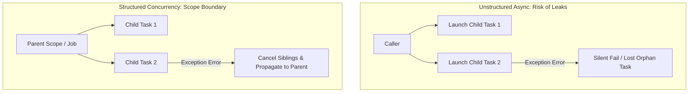

## Structured Concurrency (구조적 동시성) 이란 무엇인가

**Structured Concurrency (구조적 동시성)**는 비동기(Asynchronous) 작업의 생명주기(Lifetime)를 단일 스레드 코드의 코드 블록(`{ ... }`) 범위처럼 **명확한 부모-자식(Parent-Child) 계층 구조**로 묶어서 관리하는 비동기 프로그래밍 패러다임입니다.

구조적 프로그래밍(Structured Programming)에서 `if`, `for`, `try-catch` 같은 블록이 코드 실행 흐름의 시작과 끝을 제한하여 과거 `goto` 문의 무질서함을 해결했듯, Structured Concurrency는 비동기 스레드/코루틴의 **"언제 어디서 시작하고 끝나는지 알 수 없는 난잡함(Unstructured Async)"**을 해결합니다.

---

### 초보자를 위한 쉽게 이해하는 비유

* **비구조적 비동기 (Unstructured Async)**: **"부모 없이 혼자 놀이공원에 간 아이들"**과 같습니다. 부모가 집에 가자고 해도(Scope 종료) 아이들이 어디 있는지 알 수 없으며, 아이 하나가 길을 잃거나 사고가 나도(예외 발생) 부모가 알 수 없어 고아 작업(Orphan Task)이 됩니다.
* **구조적 동시성 (Structured Concurrency)**: **"손을 꼬옥 잡고 놀이공원에 간 가족"**과 같습니다. 부모는 모든 자식이 놀이기구를 다 탈 때까지 기다렸다가 함께 집으로 돌아가며, 자식 하나가 울거나 사고가 나면 부모가 즉시 다른 자식들의 손을 잡고 안전하게 상황을 수습(취소 전파)합니다.

---

### 핵심 원칙 및 작동 메커니즘

1. **부모-자식 생명주기 계층 구조 (Parent-Child Hierarchy)**
   * 모든 코루틴 비동기 작업은 부모 `CoroutineScope` 내에서만 생성될 수 있습니다.
   * 부모 작업은 내부에서 생성된 모든 자식 작업의 상태를 추적합니다.
   * **완료 보장**: 부모 작업은 모든 자식 작업이 완전히 끝날 때까지 자신의 종료를 자동으로 미룹니다.

2. **양방향 취소 및 예외 전파 (Cancellation & Exception Propagation)**
   * **부모 ➔ 자식 (하향 취소)**: 부모 작업이 취소되면 모든 자식 작업에 취소 신호가 즉시 전파됩니다.
   * **자식 ➔ 부모 (상향 예외 전파)**: 자식 작업 중 하나에서 예기치 못한 에러가 터지면:
     1. 부모 작업에게 예외가 즉시 전달됩니다.
     2. 부모 작업은 다른 모든 자식(형제) 작업들을 즉시 취소시킵니다.
     3. 부모 작업 자신도 예외 상태로 안전하게 종료됩니다. (`SupervisorJob` 사용 시 예외 상향 전파 억제 가능)

---

### Unstructured Async vs Structured Concurrency 비교

비구조적 비동기 실행(Unstructured Async)과 구조적 동시성(Structured Concurrency)의 세부 기술 비교표, 예외 전파 메커니즘, 그리고 Kotlin 실무 예시는 별도 문서로 분리되어 있습니다.

- **[Structured vs Unstructured Concurrency](structured-vs-unstructured-concurrency.md)** - 구조적 동시성과 비구조적 동시성의 비교 및 실무 가이드

---

### 연관 노트

- [Structured vs Unstructured Concurrency](structured-vs-unstructured-concurrency.md) - 구조적 vs 비구조적 동시성 비교
- [Context](context.md) - 부모-자식 간 공유되는 실행 환경 및 Job 계층 구조
- [Race Condition and Deadlock](race-condition-and-deadlock.md) - 자원 경쟁 및 무한 대기 문제 해결
- [Immutability](immutability.md) - 동시성 환경에서의 데이터 안전성
