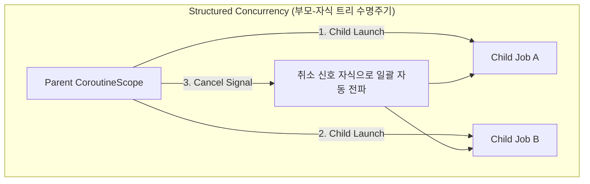

## Structured Concurrency (구조화된 동시성)

### 1. 개요 (Overview)

**Structured Concurrency (구조화된 동시성)** 는 비동기(Asynchronous) 동시성 작업의 수명주기(Lifecycle)를 명확한 부모 - 자식 계층 구조(Parent-Child Hierarchy)로 묶어 관리하는 **컴퓨터 공학 동시성 프로그래밍 패러다임**이다. "부모 스코프는 모든 자식 작업이 완료될 때까지 종료되지 않으며, 부모가 취소되면 자식도 함께 취소된다"는 엄격한 약속을 보장한다.

---

#### 초보자를 위한 쉽게 이해하는 비유

부모 팀장이 모든 부하 팀원(자식 작업)이 일을 끝낼 때까지 곁을 지키며, 팀장이 작업 중단 명령(취소)을 내리면 모든 팀원이 즉시 도구를 놓고 함께 퇴근하는 엄격한 수명주기 팀 모델이다.



---

### 2. 이전 방식(Unstructured Concurrency)과의 차이

과거의 Unstructured Concurrency(비구조화된 동시성)에서는 스레드나 백그라운드 작업(`GlobalScope`, `Thread`)이 통제 없이 산발적으로 생성되어 부모가 종료되어도 자식 작업이 고아(Orphan Task)로 남아 메모리 누수나 자원 낭비를 유발했다. 두 방식의 비교표, 대비되는 코드 예시, 실무 지침은 별도 문서로 분리되어 있다.

- **[Structured vs Unstructured Concurrency](structured-vs-unstructured-concurrency.md)** - 수명주기 결합/고아 작업/취소 전파/예외 처리 기준 비교표와 Kotlin 코드 대비

---

### 3. 실전 코드 예시 (Kotlin Coroutines)

```kotlin
// coroutineScope 가 모든 자식의 완료를 보장한다
suspend fun runStructured() = coroutineScope {
    launch {
        delay(1000)
        println("자식 작업 1 완료")
    }
    launch {
        delay(2000)
        println("자식 작업 2 완료")
    }
    // 두 자식이 모두 끝날 때까지 runStructured() 는 종료되지 않음
}
```

---

### 4. 연결 문서 (Related Links)

- [Kotlin Coroutines](../mobile/android/02_app_framework/data/async-flow/coroutines/kotlin-coroutines.md) - Structured Concurrency 기반 안드로이드 비동기 엔진
- [Compose SSOT](../mobile/android/02_app_framework/jetpack-compose/runtime/compose-ssot.md) - ViewModel / StateScope 수명주기 연동
- [Race Condition](race-condition.md) - 동시성 레이스 조건
- [Deadlock](deadlock.md) - 교착 상태
- [Mutex/Lock](mutex-lock.md) - 상호 배제를 통한 동시성 제어
- [Pure Function](pure-function.md) - Side-Effect 없는 [부수 효과](side-effect.md) 통제
