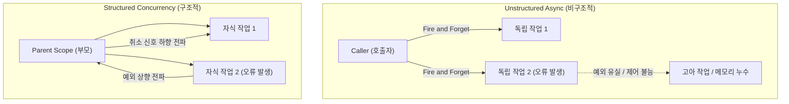

# Structured vs Unstructured Concurrency (구조적 동시성과 비구조적 동시성 비교)

## 1. 개요 (Overview)

비동기 프로그래밍에서 비동기 작업(Async Tasks / Coroutines)을 생성하고 실행할 때 생명주기 관리 방식에 따라 **[Structured Concurrency (구조적 동시성)](structured-concurrency.md)** 와 **Unstructured Concurrency (비구조적 동시성 / Unstructured Async)** 로 구분된다. 구조적 동시성은 비동기 작업의 부모-자식 관계를 명확히 하여 자원 누수와 제어 불가능한 예외를 방지한다.

---

### 초보자를 위한 쉽게 이해하는 비유

* **Unstructured Async (부모 없이 놀이공원에 간 아이들)**:
  - 아이들(비동기 스레드/코루틴)이 부모 없이 자유롭게 놀이공원에 돌아다닌다. 부모(호출자 Scope)가 집으로 돌아갈 시간(Scope 종료)이 되어도 아이들이 어디서 무얼 하고 있는지 알 수 없어 길을 잃고 자원(메모리/CPU)을 무한히 소모(Orphan Task)한다.
* **Structured Concurrency (손을 꼬옥 잡은 놀이공원 가족)**:
  - 부모(Scope/Job)가 모든 자식 작업의 손을 꼭 잡고 있다. 자식이 노는 동안 부모는 끝날 때까지 기다려주고, 자식 하나가 사고를 당하면(예외 발생) 부모가 즉시 다른 자식들의 손을 잡고 안전하게 퇴장(취소 전파)한다.

---

## 2. Structured vs Unstructured Concurrency 핵심 기술 비교표

| 비교 항목 | Unstructured Async (비구조적) | Structured Concurrency (구조적) |
| :--- | :--- | :--- |
| **생명주기 관리** | 부모와의 관계가 없어 백그라운드에서 **고아(Orphan) 실행** | **부모 Scope 의 생명주기에 완벽 종속** |
| **자원 누수 (Resource Leak)**| 작업 취소가 안 되어 메모리/스레드 **무한 점유 위험** | 부모 Scope 취소 시 **모든 자식 작업 즉시 자동 취소** |
| **예외 처리 (Exception Handling)**| 예외가 유실(Silent Failure)되거나 전역 크래시 발생 | 부모 계층으로 예외가 안전 전파되어 **중앙 캡처 가능** |
| **완료 동기화 (Completion)**| `join()`, `Future.get()` 등을 개발자가 **수동 호출** | 부모 작업이 자식들의 **완료를 자동 대기 및 수집** |
| **코드 가독성 및 디버깅**| 언제 어디서 끝나는지 추적하기 매우 어려움 | 단일 블록(`{ ... }`) 내에서 실행 범위 명확 |
| **Kotlin Coroutine 예시** | `GlobalScope.launch { ... }` | `coroutineScope { launch { ... } }` |

---

## 3. 선택 가이드 및 실무 예시

- **Unstructured Async가 위험한 이유**: 화면이 닫히거나(Activity/Fragment Destroy), 요청이 취소되었음에도 네트워크 통신이나 DB 쿼리가 백그라운드에서 계속 실행되어 메모리 누수(Memory Leak) 및 Null Pointer Exception 크래시를 유발함.
- **Structured Concurrency 활용**: Android의 `viewModelScope.launch`, `lifecycleScope.launch` 또는 Kotlin의 `coroutineScope { }` 블록을 사용하여 화면이나 컴포넌트 생명주기와 비동기 작업 생명주기를 100% 일치시킴.

---

## 4. 연결 문서 (Related Links)

- [Structured Concurrency](structured-concurrency.md) - 구조적 동시성의 원칙 및 메커니즘
- [Context](context.md) - CoroutineContext 및 Job 계층 구조
- [Race Condition and Deadlock](race-condition-and-deadlock.md) - 동시성 문제와 자원 관리
- [Immutability](immutability.md) - 동시성 환경에서의 데이터 안전성
