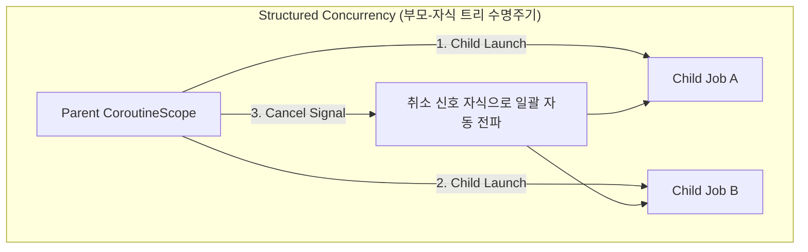

## Structured vs Unstructured Concurrency (구조화된 동시성과 비구조화 동시성 비교)

### 1. 개요 (Overview)

**[Structured Concurrency (구조화된 동시성)](structured-concurrency.md)** 와 **Unstructured Concurrency (비구조화된 동시성)** 는 비동기 작업의 수명주기를 부모 작업이 소유하는지 여부에서 갈린다. 과거의 비구조화된 동시성에서는 스레드나 백그라운드 작업(`GlobalScope`, `Thread`)이 통제 없이 산발적으로 생성되어 부모가 종료되어도 자식 작업이 고아(Orphan Task)로 남아 메모리 누수나 자원 낭비를 유발했다.

---

### 초보자를 위한 쉽게 이해하는 비유 (직속 상사 팀 구조 vs 무책임한 용역 기사)

- **Unstructured Concurrency (무책임한 용역 기사)**: 작업 반장(부모)이 일을 시키고 집으로 퇴근(종료)해 버려도, 혼자 남아 밤새도록 엔진을 켜두고 전기를 낭비하는 고아 기사.
- **Structured Concurrency (직속 상사 팀 구조)**: 부모 팀장이 모든 부하 팀원(자식 작업)이 일을 끝낼 때까지 곁을 지키며, 팀장이 작업 중단 명령(취소)을 내리면 모든 팀원이 즉시 도구를 놓고 함께 퇴근하는 엄격한 수명주기 팀 모델.



---

### 2. 핵심 기술 비교표

| 구분 | Unstructured Concurrency (비구조화) | Structured Concurrency (구조화) |
| :--- | :--- | :--- |
| **수명주기 결합** | 독립적 (부모 종료와 자식 실행이 따로 돎) | **명확한 계층적 결합 (Parent-Child Hierarchy)** |
| **고아 작업 (Orphan Task)** | 발생 가능 (`GlobalScope`, 독립 Thread) | **원천 차단 (부모 스코프 범위 내 캡슐화)** |
| **취소 전파 (Cancellation)** | 수동으로 일일이 취소 제어해야 함 | **부모 취소 시 자식으로 자동 전파 (Propagation)** |
| **예외 처리 (Exception)** | 자식의 예외가 허공으로 사라지거나 미처리 크래시 | **자식의 예외가 부모로 전파되어 안전 수집** |
| **실제 대표 예시** | `Thread.start()`, `GlobalScope.launch` | `coroutineScope {}`, `viewModelScope` |

---

### 3. 실전 코드 예시 (Kotlin Coroutines)

```kotlin
// 1. Unstructured Concurrency (위험: 부모가 끝나도 GlobalScope 작업은 죽지 않음)
fun runUnstructured() {
    GlobalScope.launch {
        delay(5000)
        println("부모가 죽어도 혼자 계속 실행됨 (메모리 누수 위험)")
    }
}

// 2. Structured Concurrency (안전: coroutineScope 가 자식 완료를 보장)
suspend fun runStructured() = coroutineScope {
    launch {
        delay(1000)
        println("자식 작업 1 완료")
    }
    launch {
        delay(2000)
        println("자식 작업 2 완료")
    }
    // 두 자식이 모두 끝날 때까지 runStructured() 는 종료되지 않음
}
```

---

### 4. 연결 문서 (Related Links)

- [Structured Concurrency](structured-concurrency.md) - 구조화된 동시성의 정의와 보장 사항
- [Kotlin Coroutines](../mobile/android/02_app_framework/data/async-flow/coroutines/kotlin-coroutines.md) - Structured Concurrency 기반 안드로이드 비동기 엔진
- [Compose SSOT](../mobile/android/02_app_framework/jetpack-compose/runtime/compose-ssot.md) - ViewModel / StateScope 수명주기 연동
- [Race Condition](race-condition.md) - 동시성 레이스 조건
- [Deadlock](deadlock.md) - 교착 상태
- [Mutex/Lock](mutex-lock.md) - 상호 배제를 통한 동시성 제어
