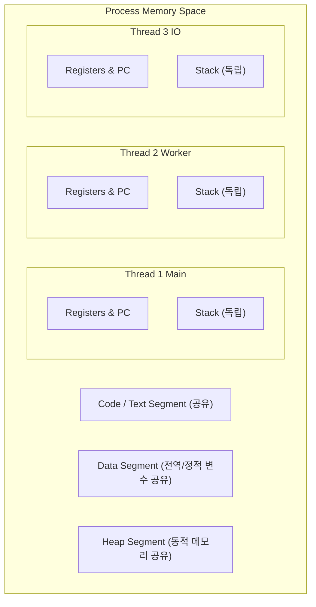

## Thread (스레드) 란 무엇인가

컴퓨터 과학 및 운영체제(OS)에서 **Thread (스레드)** 란 **"프로세스(Process) 내에서 실제로 작업을 수행하는 가장 작은 실행 단위(Unit of Execution)"** 를 의미한다.

하나의 프로세스는 최소 하나 이상의 스레드(Main Thread)를 가지며, 필요에 따라 여러 스레드를 생성하여 작업을 동시에 수행하는 **다중 스레딩 (Multi-Threading)** 환경을 구축한다.

---

## 스레드의 핵심 구조와 특성

1. **자원 공유 (Resource Sharing)**:
   - 동일 프로세스 내의 스레드들은 프로세스의 **Heap 메모리, Code 영역, Data 영역, 파일 디스크립터**를 서로 공유한다.
   - 따라서 스레드 간 통신(IPC)은 IPC 통로 없이도 메모리를 직접 공유하므로 매우 빠르고 비용이 적다.

2. **독립된 스택 및 레지스터 (Independent Stack & Registers)**:
   - 각 스레드는 함수 호출 궤적을 추적하기 위한 자신만의 **독립된 스택(Stack) 영역**과 **PC(Program Counter) 레지스터**를 가진다.

3. **스레드 동시성 문제 (Concurrency Hazards)**:
   - 여러 스레드가 공유 메모리(Heap/Data)에 동시에 접근하여 수정할 때 **경쟁 상태(Race Condition)** 나 **데이터 오염**이 발생할 수 있다.
   - 이를 예방하기 위해 Mutex, Lock, 또는 [불변성(Immutability)](immutability.md) 패턴을 적용해야 한다.

---

## Android 에서의 스레드 역할

Android 앱 프로세스는 기본적으로 단 하나의 **메인 스레드 (Main Thread / UI Thread)** 상에서 실행된다.

- **Main Thread (UI Thread)**: 화면 렌더링 및 UI 이벤트(터치, 클릭)를 처리한다.
- **ANR (Application Not Responding) 예방**: 네트워크 API, 파일 I/O, 무거운 계산 작업을 메인 스레드에서 5 초 이상 실행하면 메인 스레드가 블로킹되어 ANR 팝업이 발생하므로, 반드시 [백그라운드 스레드(Worker Thread / Coroutine)](structured-concurrency.md) 로 이관해야 한다.

---

## 연결 문서

- [Process & Binder IPC](../mobile/android/01_system_internals/binder-ipc.md) - 독립 메모리를 갖는 프로세스 간 통신
- [Immutability](immutability.md) - 스레드 안전성을 보장하는 불변성
- [Race Condition & Deadlock](race-condition-and-deadlock.md) - 스레드 동시성 문제와 교착 상태
- [Structured Concurrency](structured-concurrency.md) - 코루틴 기반 구조적 스레드 관리
