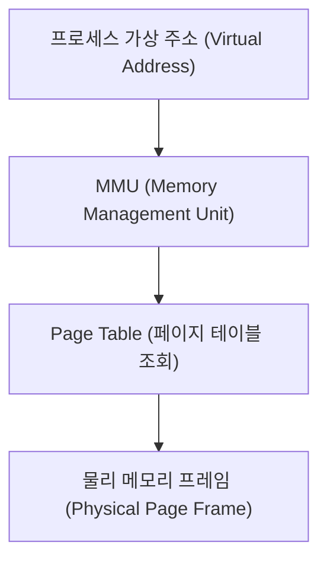

## Virtual Memory Paging (가상 메모리 페이징)

### 1. 개요 (Overview)

**Virtual Memory Paging (가상 메모리 페이징)** 은 운영체제(OS)가 가상 주소 공간(Virtual Address Space)과 물리 메모리(Physical Memory)를 **고정된 크기의 블록 단위인 페이지(Page)로 분할하여 관리하는 메모리 관리 기법**이다.

프로세스는 보조기억장치의 가상 메모리를 연속된 주소처럼 다루지만, OS 와 하드웨어 MMU(Memory Management Unit)는 이를 **페이지 크기(기존 4KB, 차세대 16KB)** 단위로 쪼개어 물리 메모리의 페이지 프레임(Page Frame)에 매핑한다.

---

#### 초보자를 위한 쉽게 이해하는 비유

- **가상 메모리 페이징 (바인더 공책과 표준 규격 종이)**:
  - 책 전체(프로세스의 가상 메모리)를 4KB 또는 16KB 라는 **동일한 규격의 종이 낱장(Page)** 으로 나눠 바인더(물리 메모리)의 비어있는 구멍(Page Frame)에 꽂아서 사용하는 방식.

---

### 2. Paging 의 핵심 요소 및 Page Size 의 영향

1. **Page (페이지)**: 가상 메모리를 일정 크기로 나눈 가상 블록 (4KB, 16KB, 64KB 등).
2. **Page Frame (페이지 프레임)**: 물리 메모리(RAM)를 페이지와 동일한 크기로 나눈 물리 블록.
3. **Page Size 가 성능에 미치는 영향**:
   - 페이지 크기가 커지면(4KB ➔ 16KB) 페이지 테이블의 크기가 줄어들고, CPU 의 **TLB(Translation Lookaside Buffer) 미스율이 대폭 감소**하여 메모리 접근 속도 및 앱 로딩 성능이 향상된다.

---

### 3. 연결 문서 (Related Links)

- [data-structure-alignment](data-structure-alignment.md) - 메모리 정렬 원리
- [linux-kernel](../operating-systems/linux-kernel.md) - 리눅스 커널 가상 메모리 관리
- [android-16kb-page-alignment](../mobile/android/01_system_internals/kernel-and-hal/android-16kb-page-alignment.md) - 안드로이드 16KB 페이지 정렬 규약
