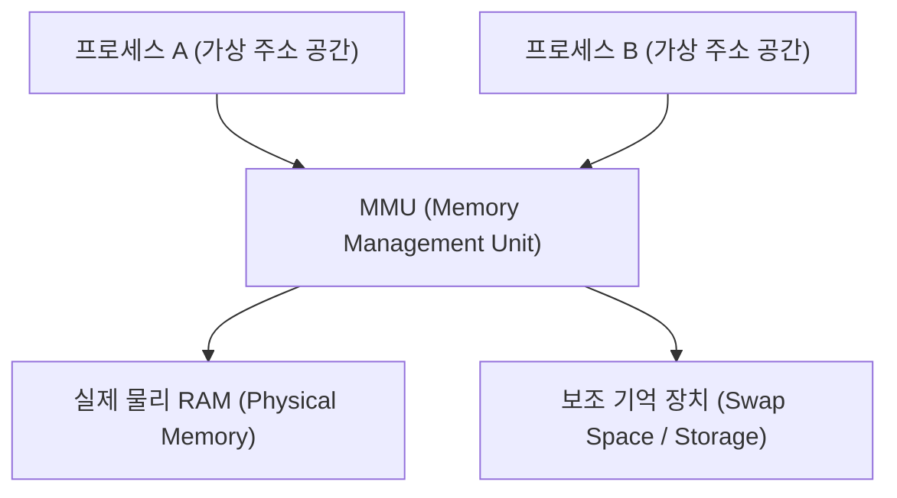

## Virtual Memory (가상 메모리 시스템)

### 1. 개요 (Overview)

**Virtual Memory (가상 메모리)** 는 운영체제(OS)가 물리적 RAM 메모리의 한계를 극복하고, **각 프로세스에게 독립적이고 연속적인 가상 주소 공간(Virtual Address Space)을 제공하는 메모리 관리 추상화 기술**이다.

실제 물리 메모리 크기보다 더 큰 프로그램을 실행할 수 있게 해주며, 프로세스 간 메모리 침범을 완전히 차단하는 메모리 보호(Memory Protection) 기능을 제공한다. OS 는 [virtual-memory-paging](virtual-memory-paging.md) 기법을 통해 가상 주소를 물리 주소로 동적 매핑한다.

---

#### 초보자를 위한 쉽게 이해하는 비유

- **가상 메모리 (각 독서 공간에 지급되는 가상의 개인 도서관 카드)**:
  - 실제 도서관 책장(물리 RAM)의 크기는 제한되어 있지만, 각 이용자(프로세스)에게는 마치 도서관 전체를 혼자 다 쓰는 것 같은 가상의 개인 도서관 카드(가상 주소 공간)를 지급함. 도서관 사서(MMU)가 알아서 실제 책장 위치로 책을 찾아줌.

---

### 2. 가상 메모리의 3 대 주요 핵심 이점

1. **메모리 보호 및 격리 (Memory Isolation)**: 각 프로세스가 고유의 가상 주소 공간을 가지므로 타 프로세스 메모리를 무단 엑세스할 수 없음.
2. **물리 RAM 확장 (Swap Space)**: 자주 쓰이지 않는 페이지를 스토리지로 내리고(Page-out), 필요한 페이지만 물리 RAM 에 로드(Page-in).
3. **편리한 프로그래밍 추상화**: 컴파일러와 링커가 파편화된 물리 메모리 위치를 신경 쓰지 않고 0 번지부터 시작하는 연속된 가상 주소 바이너리를 생성할 수 있음.

---

### 3. 연결 문서 (Related Links)

- [virtual-memory-paging](virtual-memory-paging.md) - 가상 메모리 페이징 기법
- [data-structure-alignment](data-structure-alignment.md) - 메모리 정렬 및 얼라인먼트
- [linux-kernel](../operating-systems/linux-kernel.md) - 리눅스 커널 가상 메모리
- [android-16kb-page-alignment](../mobile/android/01_system_internals/kernel-and-hal/android-16kb-page-alignment.md) - 안드로이드 16KB 페이지 정렬
