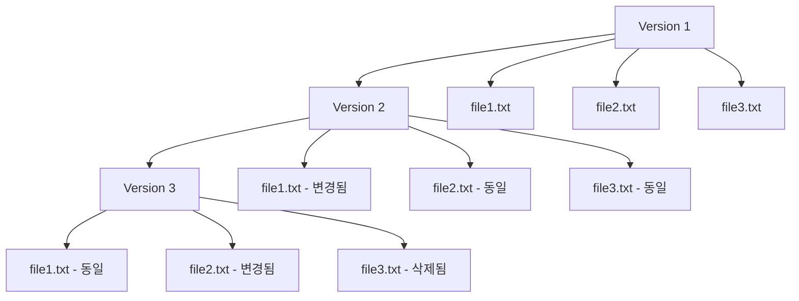
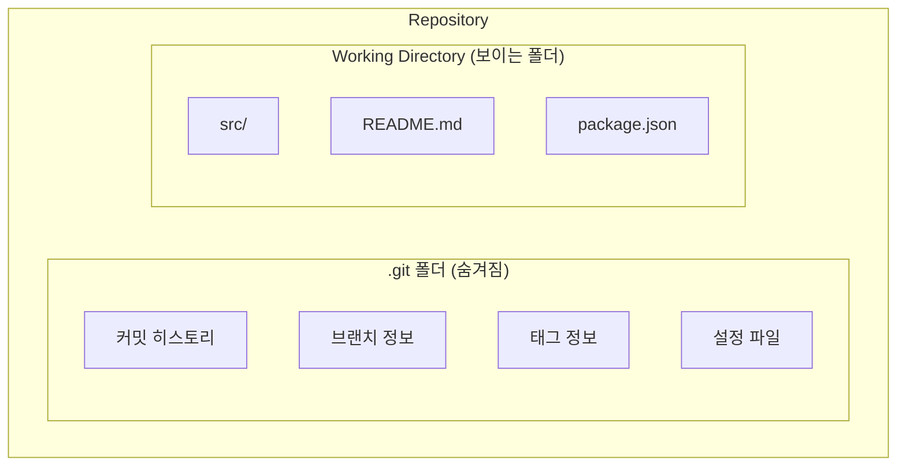
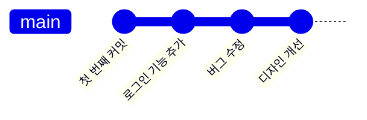
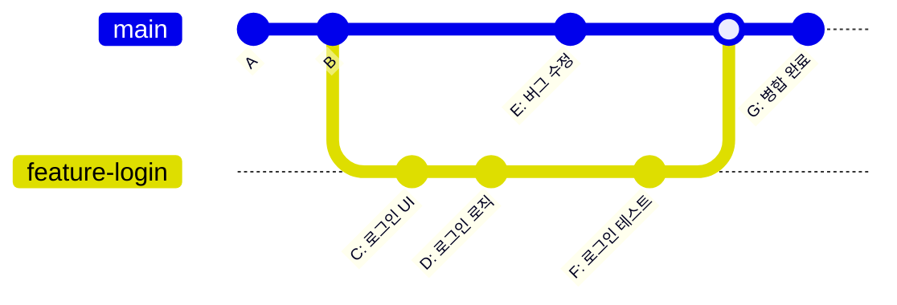
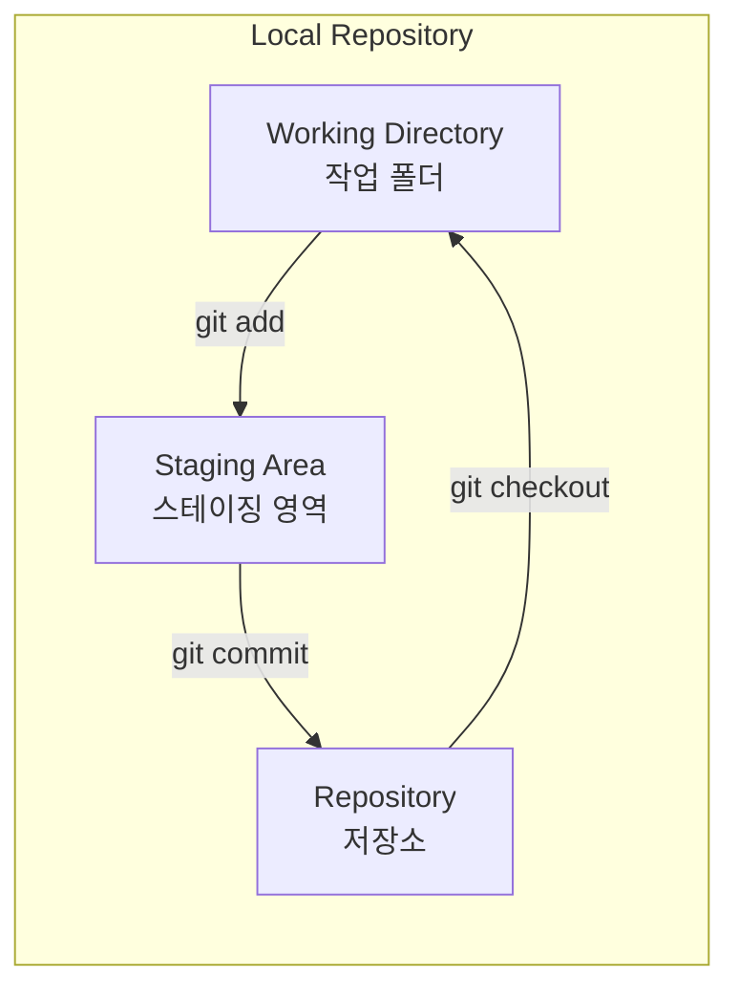
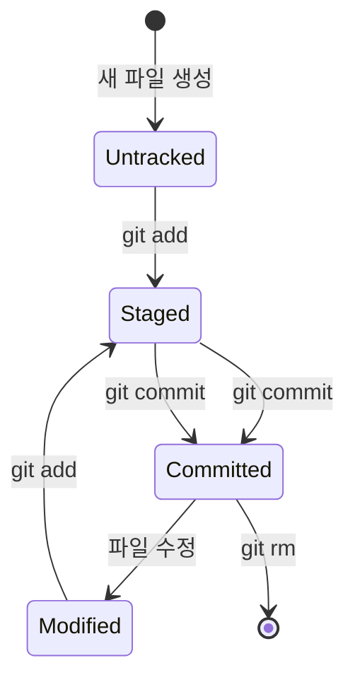
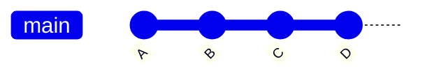
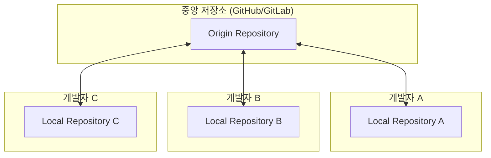
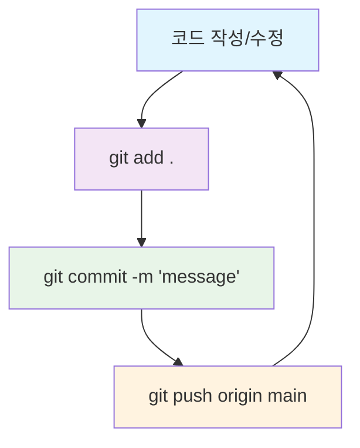
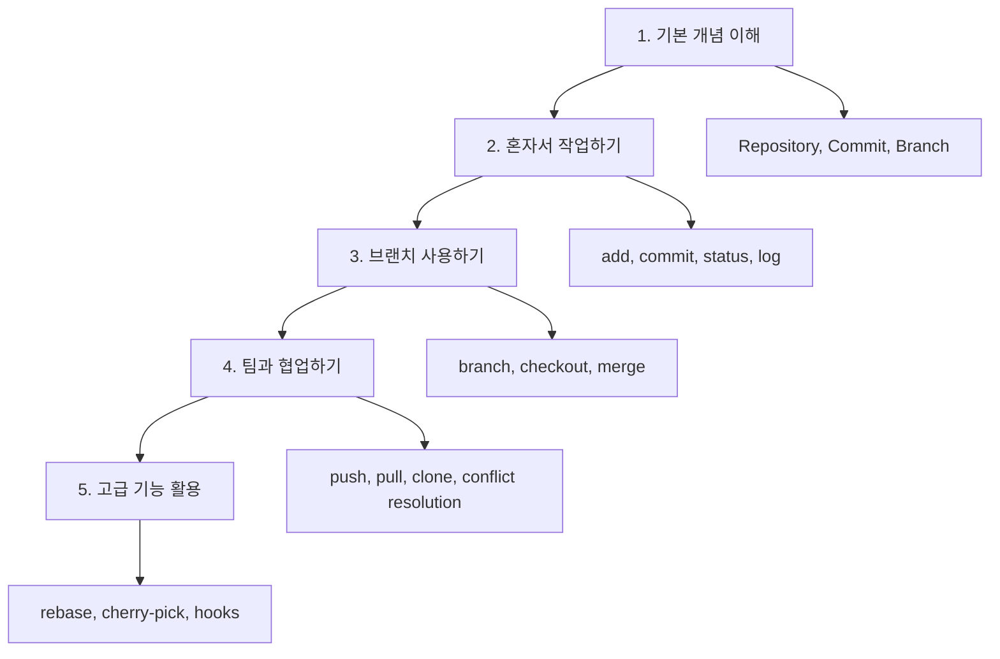

# Git 기본 개념

## Git이란?

### 버전 관리 시스템의 필요성
코딩을 하다 보면 이런 상황들을 자주 겪습니다:
- "어제 작업한 코드가 더 좋았는데, 어떻게 되돌리지?"
- "팀원이 같은 파일을 수정해서 코드가 꼬였어..."
- "이 버그가 언제부터 있었지? 누가 이 코드를 바꿨지?"
- "새 기능을 개발하는 동안 기존 코드를 망가뜨리고 싶지 않아"

Git은 이런 문제들을 해결해주는 **분산 버전 관리 시스템**입니다. 마치 워드 문서의 "변경 내용 추적" 기능의 강력한 버전이라고 생각하면 됩니다.

### Git의 핵심 아이디어


## Git의 작동 원리

### 스냅샷 방식의 저장
다른 버전 관리 시스템과 달리 Git은 **스냅샷** 방식으로 작동합니다:



이는 마치 프로젝트 폴더 전체를 매번 복사해두는 것과 같습니다. 하지만 Git은 똑똑해서 실제로는 변경된 파일만 새로 저장하고 나머지는 이전 버전을 참조합니다.

### 해시를 이용한 무결성
Git은 모든 데이터를 SHA-1 해시로 관리합니다:
```
예시: a3b2c1d4e5f6a7b8c9d0e1f2a3b4c5d6e7f8a9b0
```
이 해시는 파일 내용이 조금이라도 바뀌면 완전히 달라지므로, 데이터 손상을 즉시 감지할 수 있습니다.

## 핵심 개념들

### 리포지토리 (Repository)
리포지토리는 Git이 관리하는 **프로젝트의 전체 역사가 담긴 데이터베이스**입니다.



**현실 비유**: 도서관과 같습니다
- 도서관 = Repository 전체
- 책들 = 프로젝트 파일들
- 도서 대출 기록 = Git 히스토리
- 사서 = Git 시스템

### 커밋 (Commit)
커밋은 **특정 시점의 프로젝트 상태를 저장한 스냅샷**입니다.



각 커밋에는 다음 정보가 포함됩니다:
- **고유 ID (해시)**: `a3b2c1d...`
- **작성자**: 누가 만들었는지
- **시간**: 언제 만들어졌는지
- **메시지**: 무엇을 바꾸었는지
- **부모 커밋**: 어떤 커밋에서 이어져 왔는지

**현실 비유**: 사진 앨범과 같습니다
- 각 사진 = 커밋
- 사진에 적힌 날짜와 메모 = 커밋 메시지
- 시간순 배열 = Git 히스토리

### 브랜치 (Branch)
브랜치는 **독립적인 작업 공간**을 만들어 줍니다.



**현실 비유**: 문서 작업과 같습니다
- main 브랜치 = 최종 보고서
- feature 브랜치 = 임시 초안
- 각자 작업 후 나중에 합치기 = 병합(merge)

### Git의 세 영역

Git에서 파일이 거치는 세 단계를 이해하는 것이 매우 중요합니다:



#### 1. 워킹 디렉토리 (Working Directory)
- 실제로 파일을 편집하는 곳
- 컴퓨터의 일반적인 폴더와 동일하게 보임
- `git status`로 어떤 파일이 변경되었는지 확인 가능

#### 2. 스테이징 영역 (Staging Area / Index)
- 다음 커밋에 포함될 변경사항들을 **임시로 모아두는 대기실**
- `git add` 명령으로 파일을 이곳으로 이동
- 커밋하기 전에 정말 포함시킬 변경사항인지 **최종 검토하는 공간**

**현실 비유**: 온라인 쇼핑의 장바구니
- 상품 보기 = Working Directory에서 파일 편집
- 장바구니에 담기 = git add로 Staging Area에 추가
- 결제하기 = git commit으로 Repository에 저장

#### 3. 리포지토리 (Repository)
- 커밋된 변경사항들이 **영구적으로 저장되는 곳**
- `.git` 폴더 안에 압축되어 보관
- 언제든 이전 상태로 되돌아갈 수 있음

### 파일 상태의 변화



#### Untracked (추적되지 않음)
- Git이 아직 모르는 새로운 파일
- 새로 만든 파일은 처음에 이 상태

#### Modified (수정됨)
- 이미 Git이 알고 있는 파일을 변경한 상태
- 아직 스테이징하지 않음

#### Staged (스테이지됨)
- `git add`로 스테이징 영역에 올라간 상태
- 다음 커밋에 포함될 예정

#### Committed (커밋됨)
- 변경사항이 Git 저장소에 안전하게 보관된 상태

### HEAD 포인터

HEAD는 현재 작업 중인 위치를 가리키는 **포인터**입니다:


```
HEAD → main → D (현재 위치)
```

**현실 비유**: 책갈피와 같습니다
- 책 = Git 히스토리
- 책갈피 = HEAD 포인터
- 현재 읽고 있는 페이지 = 현재 커밋

## Git의 장점

### 1. 분산형 시스템


- 인터넷이 끊어져도 작업 가능
- 중앙 서버가 고장나도 각자의 복사본으로 복구 가능
- 각자 독립적으로 작업 후 나중에 합치기

### 2. 완벽한 히스토리 추적
- 누가, 언제, 무엇을, 왜 바꿨는지 모두 기록
- 코드의 한 줄 한 줄이 언제 어떻게 바뀌었는지 추적 가능

### 3. 효율적인 브랜치
- 브랜치 생성과 전환이 매우 빠름 (몇 밀리초)
- 동시에 여러 기능 개발 가능
- 실험적인 코드도 안전하게 작업

## 실제 작업 흐름 예시

### 새 프로젝트 시작하기
```bash
# 1. 새 폴더에서 Git 시작
mkdir my-project
cd my-project
git init

# 2. 첫 번째 파일 만들기
echo "# My Project" > README.md

# 3. 파일을 Git에 추가
git add README.md

# 4. 첫 번째 커밋 만들기
git commit -m "첫 번째 커밋: README 파일 추가"
```

이 과정을 도식화하면:


### 일상적인 작업 사이클


## 자주 하는 실수와 이해

### "Git이 복잡하다"고 느끼는 이유
1. **개념을 이미지로 이해하지 못함**
   - Git의 동작을 머릿속에 그려볼 수 있어야 함
   - 이 문서의 다이어그램들을 자주 참고하세요

2. **명령어만 외우려고 함**
   - 왜 그 명령어를 써야 하는지 이해가 먼저
   - [[Git 명령어 비교]]에서 맥락과 함께 학습

3. **브랜치 개념의 오해**
   - 브랜치는 무거운 것이 아니라 단순한 포인터
   - 언제든 만들고 삭제할 수 있음

### Git 학습 단계


## 관련 문서
- [[Git 명령어 비교]] - 각 명령어의 구체적인 사용법과 차이점
- [[Git 브랜치 전략]] - 팀 프로젝트에서의 브랜치 활용법
- [[Git 고급 워크플로우]] - 복잡한 상황을 다루는 고급 기법
- [[Git 커밋 메시지 작성법]] - 좋은 커밋 메시지 작성하기
- [[Git 트러블슈팅]] - 문제 상황 해결법