# Git 명령어 비교

이 문서는 비슷해 보이지만 전혀 다른 역할을 하는 Git 명령어들을 구체적인 상황과 함께 설명합니다. 각 명령어가 **언제, 왜** 사용되는지 이해하는 것이 중요합니다.

## 저장소 생성하기

### git init vs git clone

#### 상황별 선택
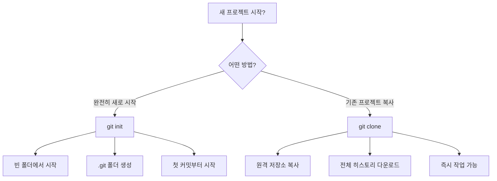

#### git init - 새 프로젝트 시작
```bash
mkdir my-new-project
cd my-new-project
git init                    # 빈 Git 저장소 생성
```

**언제 사용?**
- 완전히 새로운 프로젝트를 시작할 때
- 기존 폴더를 Git으로 관리하기 시작할 때
- 로컬에서만 작업할 때 (원격 저장소 없이)

**내부적으로 일어나는 일:**


#### git clone - 기존 저장소 복사
```bash
git clone https://github.com/user/repo.git     # HTTPS로 복제
git clone git@github.com:user/repo.git         # SSH로 복제
git clone <url> my-folder-name                 # 특정 폴더명으로 복제
```

**언제 사용?**
- GitHub/GitLab의 프로젝트를 내 컴퓨터로 가져올 때
- 팀 프로젝트에 참여할 때
- 오픈소스 프로젝트에 기여하고 싶을 때

**내부적으로 일어나는 일:**
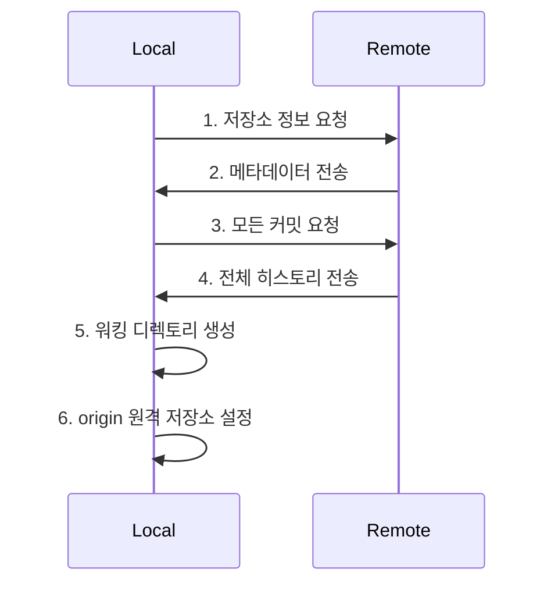

## 현재 상황 파악하기

### git status vs git diff vs git log

이 세 명령어는 **정보 확인**의 핵심입니다. 각각 다른 시점의 정보를 보여줍니다:

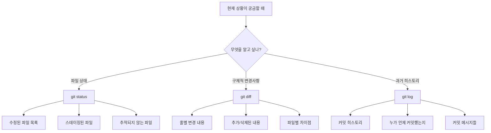

#### git status - "지금 어떤 상태인가?"
```bash
git status                 # 현재 상태 한눈에 보기
git status -s             # 간단한 형태로 보기
git status --porcelain    # 스크립트용 간단한 형태
```

**실제 출력 예시:**
```
On branch main
Your branch is up to date with 'origin/main'.

Changes to be committed:
  (use "git restore --staged <file>..." to unstage)
        new file:   src/login.js
        modified:   src/app.js

Changes not staged for commit:
  (use "git add <file>..." to update what will be committed)
  (use "git restore <file>..." to discard changes in working directory)
        modified:   README.md

Untracked files:
  (use "git add <file>..." to include in what will be committed)
        temp/debug.log
```

**언제 사용?**
- 작업을 시작하기 전에 현재 상태 확인
- 커밋하기 전에 무엇이 포함될지 확인
- 뭔가 이상할 때 상황 파악

#### git diff - "무엇이 바뀌었나?"
```bash
git diff                   # 워킹 디렉토리 vs 스테이징 영역
git diff --staged         # 스테이징 영역 vs 마지막 커밋
git diff HEAD             # 워킹 디렉토리 vs 마지막 커밋
git diff commit1 commit2  # 두 커밋 간 차이
git diff --name-only      # 변경된 파일명만 보기
```

**실제 출력 예시:**
```diff
diff --git a/src/app.js b/src/app.js
index 1234567..abcdefg 100644
--- a/src/app.js
+++ b/src/app.js
@@ -10,7 +10,7 @@ function getUserData() {
     return {
         name: user.name,
-        age: user.age
+        age: user.age,
+        email: user.email
     }
 }
```

**각 기호의 의미:**
- `---` : 이전 버전 (삭제될 내용)
- `+++` : 새 버전 (추가될 내용)
- `-` : 삭제된 줄 (빨간색)
- `+` : 추가된 줄 (초록색)

#### git log - "과거에 무슨 일이 있었나?"
```bash
git log                    # 전체 커밋 히스토리
git log --oneline         # 한 줄씩 간단히
git log --graph           # 브랜치 구조와 함께
git log --since="2 weeks ago"  # 2주 전부터
git log --author="김개발"   # 특정 작성자만
git log -- file.txt       # 특정 파일의 히스토리만
```

**실제 사용 시나리오:**
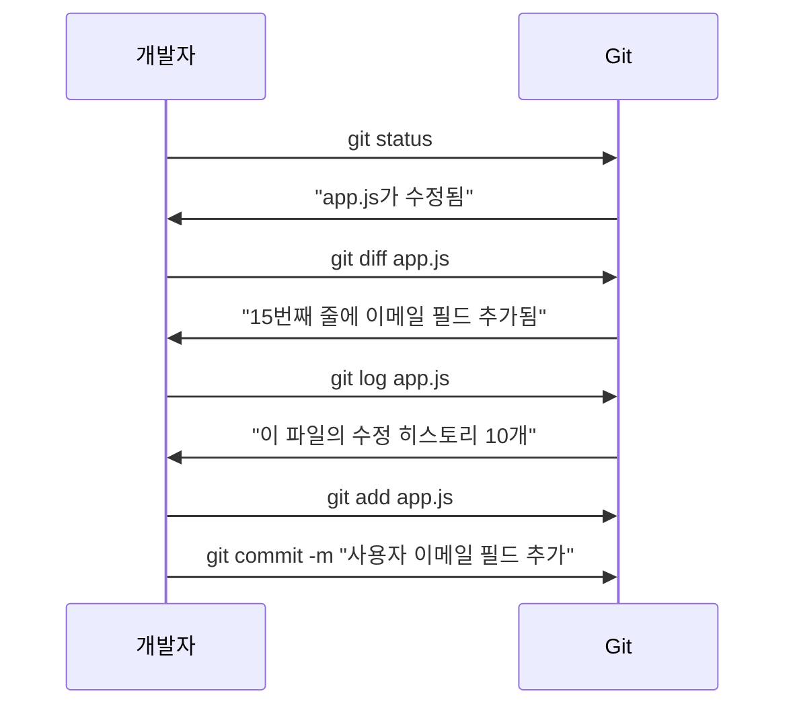

## 변경사항을 스테이징하기

### git add의 다양한 방법과 선택 기준

`git add`는 워킹 디렉토리의 변경사항을 스테이징 영역으로 이동시킵니다. **무엇을 커밋할지 정확히 선택**하는 중요한 과정입니다.

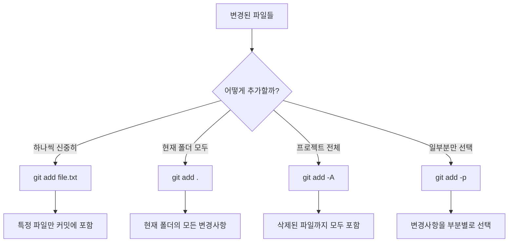

#### 명령어별 상세 비교

| 명령어 | 포함 범위 | 삭제된 파일 | 새 파일 | 언제 사용? |
|--------|-----------|-------------|---------|------------|
| `git add file.txt` | 특정 파일 | ❌ | ⭕ | 신중하게 파일별로 커밋 |
| `git add .` | 현재 폴더 | ❌ | ⭕ | 현재 폴더 작업 완료 시 |
| `git add -A` | 전체 프로젝트 | ⭕ | ⭕ | 모든 변경사항 한번에 |
| `git add -u` | 추적 중인 파일만 | ⭕ | ❌ | 기존 파일 수정만 커밋 |

#### 실제 상황별 선택 가이드

**상황 1: 신중한 커밋 (권장)**
```bash
# 1단계: 어떤 파일이 변경되었는지 확인
git status

# 2단계: 각 파일의 변경사항 검토
git diff file1.js
git diff file2.css

# 3단계: 논리적으로 관련된 파일들만 스테이징
git add file1.js file2.css

# 4단계: 스테이징된 내용 최종 확인
git diff --staged
```

**상황 2: 빠른 작업 흐름**
```bash
# 현재 폴더의 모든 변경사항 추가 (삭제 제외)
git add .

# 또는 삭제까지 포함해서 모든 변경사항
git add -A
```

**상황 3: 부분 스테이징 (고급 사용법)**
```bash
# 대화형 모드로 변경사항 선택
git add -p file.js
```

이렇게 하면 다음과 같은 선택지가 나타납니다:
```
Stage this hunk [y,n,q,a,d,/,j,J,g,e,?]?
y - 이 변경사항 스테이징
n - 이 변경사항 건너뛰기
q - 종료
s - 더 작은 단위로 분할
e - 수동으로 편집
```

**언제 부분 스테이징을 사용할까?**
- 하나의 파일에 여러 기능이 섞여 있을 때
- 디버깅용 코드와 실제 기능이 함께 있을 때
- 큰 리팩토링을 작은 커밋으로 나누고 싶을 때

## 변경사항을 영구 저장하기

### git commit vs git commit -a vs git commit --amend

커밋은 스테이징 영역의 변경사항을 **영구적으로 Git 히스토리에 저장**하는 과정입니다.

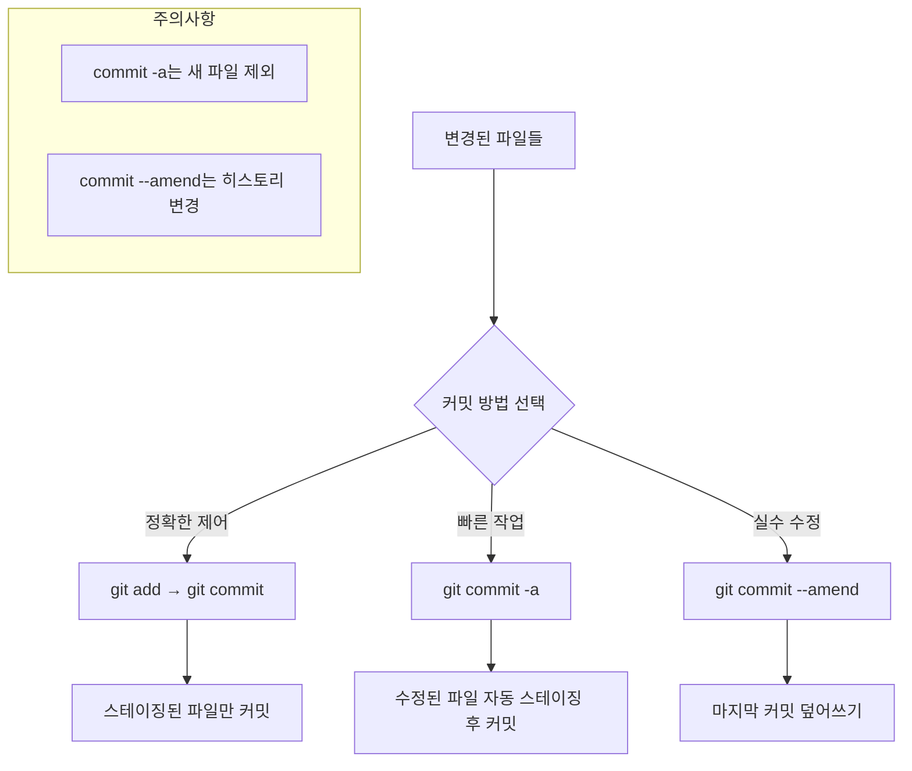

#### 상세한 차이점과 언제 사용할지

**1. git commit (기본, 권장)**
```bash
git add file1.js file2.css    # 원하는 파일만 선택
git commit -m "로그인 UI 구현"  # 스테이징된 파일만 커밋
```

**장점:**
- 정확히 무엇을 커밋할지 제어 가능
- 실수로 원하지 않는 파일이 포함될 위험 없음
- 논리적으로 관련된 변경사항만 그룹핑 가능

**언제 사용?**
- 여러 파일을 수정했지만 일부만 커밋하고 싶을 때
- 새로운 파일이 포함된 경우
- 팀 프로젝트에서 신중하게 작업할 때

**2. git commit -a (빠른 작업용)**
```bash
git commit -a -m "버그 수정"   # 수정된 파일들 자동 add + commit
# 위는 다음과 동일:
# git add -u
# git commit -m "버그 수정"
```

**주의사항:**
- **새로 만든 파일은 포함되지 않음** (Untracked files 제외)
- 삭제된 파일은 포함됨
- 모든 수정사항이 한 번에 들어가므로 신중해야 함

**언제 사용?**
- 혼자 작업하는 개인 프로젝트
- 모든 변경사항이 논리적으로 연관된 경우
- 빠른 프로토타이핑이나 실험 중

**실제 비교 예시:**
```bash
# 상황: 3개 파일 수정, 1개 파일 새로 생성
# modified: app.js, style.css, README.md
# new: config.json

git status
# Changes not staged for commit:
#   modified: app.js
#   modified: style.css
#   modified: README.md
# Untracked files:
#   config.json

# commit -a 사용 시
git commit -a -m "업데이트"
# → app.js, style.css, README.md만 커밋됨
# → config.json은 여전히 untracked

# 정확한 방법
git add .
git commit -m "설정 파일 및 UI 업데이트"
# → 모든 파일 포함됨
```

**3. git commit --amend (실수 수정용)**
```bash
# 마지막 커밋의 메시지만 수정
git commit --amend -m "새로운 커밋 메시지"

# 마지막 커밋에 파일 추가
git add forgotten-file.txt
git commit --amend --no-edit    # 메시지는 그대로, 파일만 추가

# 마지막 커밋을 완전히 새로 작성
git add .
git commit --amend              # 에디터가 열림
```

**언제 사용?**
- 커밋 직후 오타를 발견했을 때
- 커밋 메시지를 잘못 작성했을 때
- 빠뜨린 파일이 있을 때

**⚠️ 중요한 주의사항:**
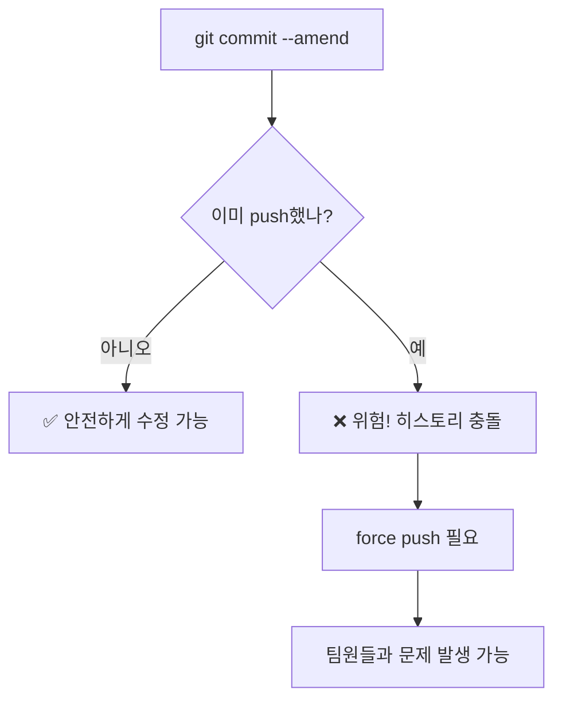

- `--amend`는 마지막 커밋을 **새로운 커밋으로 교체**함
- 이미 원격에 push한 커밋은 수정하지 말 것!
- 수정 후에는 `git push --force-with-lease` 필요할 수 있음

## 실수를 되돌리기

### git reset vs git revert vs git checkout vs git restore

실수를 되돌리는 방법은 **무엇을 되돌릴지와 안전성**에 따라 달라집니다:

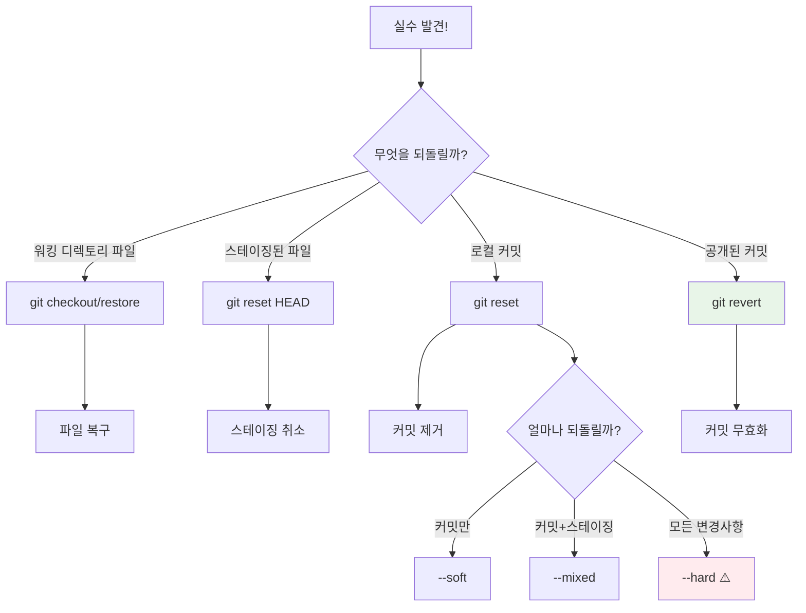

#### 위험도와 사용 시나리오

| 명령어 | 위험도 | 히스토리 변경 | 협업 시 사용 | 주요 용도 |
|--------|-------|-------------|-------------|----------|
| `git restore` | 🟢 낮음 | ❌ | ✅ | 파일 복구 |
| `git reset --soft` | 🟡 보통 | ✅ | ⚠️ | 커밋 메시지 수정 |
| `git reset --mixed` | 🟡 보통 | ✅ | ⚠️ | 커밋 취소 + 재작업 |
| `git reset --hard` | 🔴 높음 | ✅ | ❌ | 완전한 초기화 |
| `git revert` | 🟢 낮음 | ❌ | ✅ | 안전한 커밋 취소 |

#### 1. 파일 수준의 되돌리기

**git restore (Git 2.23+, 권장)**
```bash
# 워킹 디렉토리의 파일 복구
git restore file.txt
git restore .                    # 모든 파일

# 스테이징된 파일 취소
git restore --staged file.txt
git restore --staged .           # 모든 스테이징 취소

# 특정 커밋에서 파일 복구
git restore --source=HEAD~2 file.txt
```

**git checkout (구버전)**
```bash
git checkout -- file.txt         # 파일 복구 (구버전 방법)
git checkout HEAD~1 file.txt     # 이전 커밋에서 복구
```

**현실 상황 예시:**
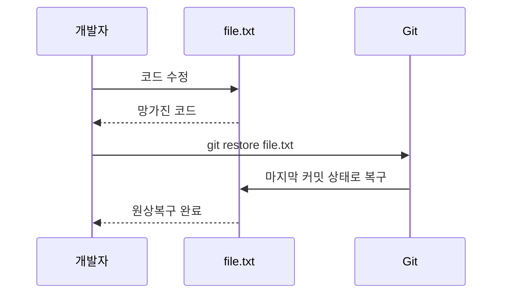

#### 2. 커밋 수준의 되돌리기

**git reset의 3가지 모드**

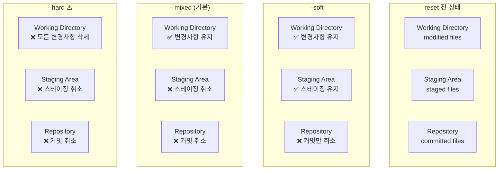

**실제 사용 예시:**
```bash
# 상황: 마지막 3개 커밋이 잘못됨

# 1. 커밋만 취소, 작업내용은 보존 (가장 안전)
git reset --soft HEAD~3
# → 변경사항이 스테이징 상태로 남음, 바로 다시 커밋 가능

# 2. 커밋과 스테이징 취소, 작업내용은 보존
git reset --mixed HEAD~3  # 또는 git reset HEAD~3
# → 변경사항이 워킹 디렉토리에 남음, git add 후 다시 커밋

# 3. 모든 변경사항 완전 삭제 (매우 위험!)
git reset --hard HEAD~3
# → 모든 작업이 사라짐, 복구 불가능
```

**언제 어떤 reset을 사용할까?**
- `--soft`: 커밋 메시지만 수정하고 싶을 때
- `--mixed`: 커밋을 취소하고 다시 스테이징부터 하고 싶을 때
- `--hard`: 모든 변경사항을 버리고 싶을 때 (신중하게!)

#### 3. 안전한 커밋 취소 (협업 환경)

**git revert - 새로운 커밋으로 안전하게 취소**
```bash
# 마지막 커밋 취소
git revert HEAD

# 특정 커밋 취소
git revert abc1234

# 여러 커밋 범위 취소
git revert HEAD~3..HEAD

# 병합 커밋 취소 (부모 지정)
git revert -m 1 merge-commit-hash
```

**reset vs revert 비교:**


**협업에서 안전한 선택:**
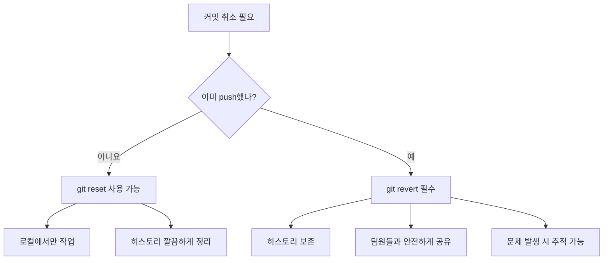

## 브랜치로 작업하기

### git branch vs git checkout vs git switch

브랜치 작업은 **독립적인 작업공간 관리**의 핵심입니다. Git 2.23부터 명령어가 더 명확하게 분리되었습니다:

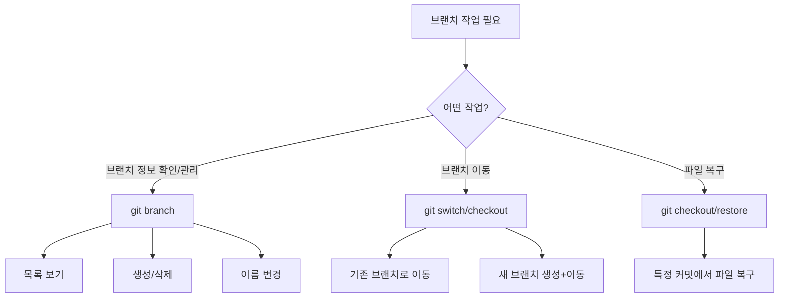

#### 왜 명령어가 분리되었나?

**기존 문제점:**
`git checkout`이 너무 많은 일을 담당:
- 브랜치 전환
- 파일 복구
- 커밋으로 이동
- 새 브랜치 생성

**새로운 구조 (Git 2.23+):**
- `git switch`: 브랜치 전환 전용
- `git restore`: 파일 복구 전용
- `git checkout`: 하위 호환성 유지

#### 브랜치 정보 관리

**git branch - 브랜치 관리의 중심**
```bash
# 브랜치 목록 확인
git branch                    # 로컬 브랜치만
git branch -r                # 원격 브랜치만
git branch -a                # 로컬 + 원격 모두
git branch -v                # 마지막 커밋 정보와 함께

# 브랜치 생성 (전환하지 않음)
git branch feature-login     # 현재 위치에서 새 브랜치 생성
git branch feature-api HEAD~2  # 2커밋 전에서 브랜치 생성

# 브랜치 삭제
git branch -d feature-done   # 병합된 브랜치 삭제
git branch -D feature-exp    # 강제 삭제 (병합 안된 브랜치도)

# 브랜치 이름 변경
git branch -m old-name new-name    # 다른 브랜치 이름 변경
git branch -m new-name             # 현재 브랜치 이름 변경
```

#### 브랜치 전환하기

**git switch (권장, Git 2.23+)**
```bash
# 기존 브랜치로 전환
git switch main
git switch feature-login

# 새 브랜치 생성 후 전환
git switch -c feature-payment     # create + switch
git switch -c hotfix-bug origin/main  # 원격 브랜치 기반으로

# 이전 브랜치로 돌아가기
git switch -                      # 이전 브랜치로 (cd - 와 유사)

# 특정 커밋으로 이동 (detached HEAD)
git switch --detach HEAD~3
```

**git checkout (기존 방식, 여전히 유용)**
```bash
# 브랜치 전환
git checkout main
git checkout feature-login

# 새 브랜치 생성 + 전환
git checkout -b feature-user       # 가장 많이 사용하는 패턴
git checkout -b hotfix origin/main # 원격 브랜치 기반

# 특정 커밋으로 이동
git checkout HEAD~3               # 3커밋 전으로
git checkout abc1234              # 특정 커밋으로

# 원격 브랜치 추적
git checkout -t origin/feature-new # tracking 브랜치 생성
```

#### 실제 작업 시나리오

**시나리오 1: 새 기능 개발**
```bash
# 1. 최신 main에서 시작
git switch main
git pull origin main

# 2. 새 기능 브랜치 생성
git switch -c feature-shopping-cart

# 3. 작업 진행...
# ... 코딩 ...
git add .
git commit -m "쇼핑카트 UI 구현"

# 4. 기능 완료 후 main으로 돌아가기
git switch main
```

**시나리오 2: 긴급 버그 수정**
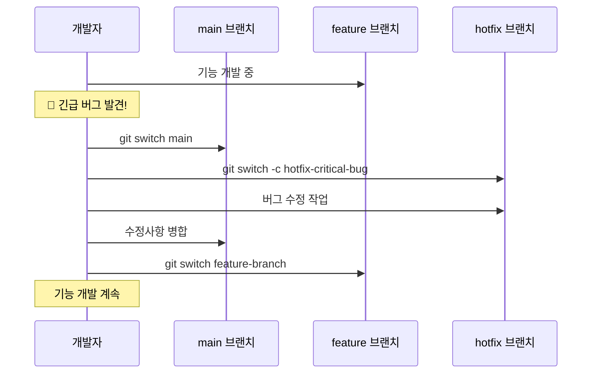

```bash
# 긴급 상황 대응 흐름
git stash                         # 현재 작업 임시 저장
git switch main                   # 안정 버전으로 이동
git switch -c hotfix-login-bug    # 핫픽스 브랜치 생성
# ... 버그 수정 ...
git add .
git commit -m "로그인 버그 긴급 수정"
git switch main
git merge hotfix-login-bug        # 메인에 병합
git switch feature-original       # 원래 작업으로 복귀
git stash pop                     # 작업 내용 복구
```

#### 브랜치 상태 시각화

**현재 브랜치 상황 파악하기:**
```bash
# 시각적으로 브랜치 구조 보기
git log --oneline --graph --all

# 브랜치별 최신 커밋
git branch -v

# 병합된/안된 브랜치 확인
git branch --merged main          # main에 병합된 브랜치들
git branch --no-merged main       # 아직 병합 안된 브랜치들
```

**출력 예시:**
```
* feature-payment    a1b2c3d 결제 모듈 완성
* feature-user       x9y8z7w 사용자 관리 구현
  main              m5n6o7p 초기 설정
* hotfix-security    s3c4r5t 보안 패치
```

#### 주의사항과 팁

**브랜치 전환 시 체크리스트:**
```mermaid
flowchart TD
    A[브랜치 전환 시도] --> B{워킹 디렉토리 깨끗한가?}
    B -->|예| C[✅ 안전하게 전환 가능]
    B -->|아니요| D[어떻게 할까?]

    D --> E[git add + git commit]
    D --> F[git stash]
    D --> G[git checkout -- . (변경사항 버림)]

    E --> C
    F --> C
    G --> C
```

**자주하는 실수와 해결:**
```bash
# 실수 1: 변경사항이 있는 상태에서 브랜치 전환
git switch main
# error: Your local changes would be overwritten by checkout.

# 해결 1: 변경사항 저장
git add .
git commit -m "작업 중간 저장"
git switch main

# 해결 2: 임시 저장
git stash
git switch main
# 나중에: git stash pop

# 실수 2: 브랜치 이름 오타
git switch featrue-login  # 오타!
# error: pathspec 'featrue-login' did not match any file(s)

# 해결: tab 자동완성 활용 또는
git branch                # 정확한 브랜치명 확인
```

## 브랜치를 합치기

### git merge vs git rebase - 히스토리 철학의 차이

두 브랜치를 합치는 방법은 **히스토리를 어떻게 기록할 것인가**의 철학적 차이입니다:

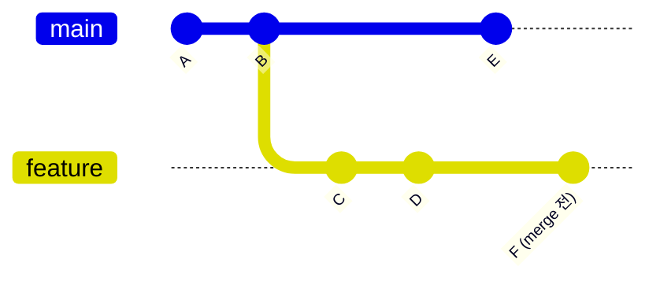

#### Merge 방식 - "실제 협업 과정 기록"

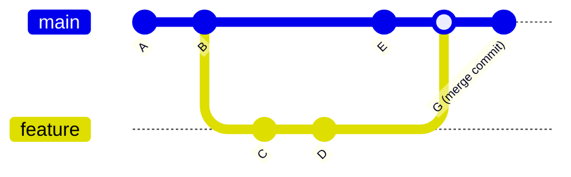

**특징:**
- 실제 개발 과정 그대로 기록
- 브랜치가 언제 분기되고 합쳐졌는지 명확
- 병합 커밋(merge commit) 생성
- 히스토리가 복잡해 보일 수 있음

**명령어:**
```bash
# 기본 merge
git checkout main
git merge feature-branch

# Fast-forward 방지 (항상 merge 커밋 생성)
git merge --no-ff feature-branch

# 충돌 시 merge 취소
git merge --abort
```

#### Rebase 방식 - "깔끔한 선형 히스토리"

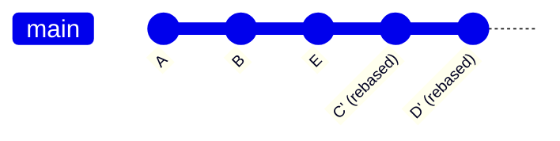

**특징:**
- 마치 순차적으로 개발한 것처럼 보임
- 선형적이고 깔끔한 히스토리
- 브랜치 분기 기록이 사라짐
- 커밋 해시가 변경됨 (새로운 커밍)

**명령어:**
```bash
# feature 브랜치에서 main 위로 rebase
git checkout feature-branch
git rebase main

# 이후 fast-forward merge
git checkout main
git merge feature-branch

# 충돌 시 해결 과정
git rebase main
# 충돌 해결 후
git add resolved-files
git rebase --continue

# rebase 취소
git rebase --abort
```

#### 상황별 선택 가이드

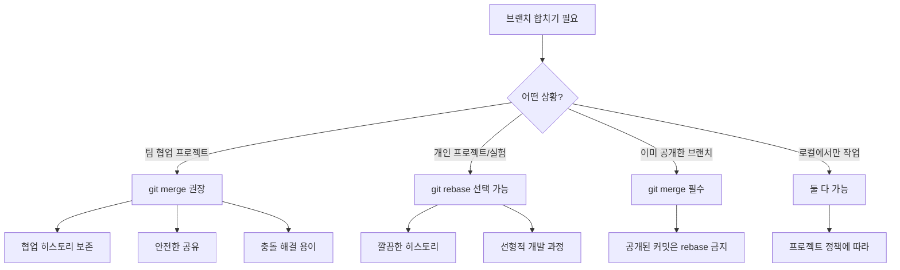

#### 실제 워크플로우 비교

**Merge 기반 워크플로우:**
```bash
# 1. 기능 개발
git checkout -b feature-login
# ... 개발 작업 ...
git add .
git commit -m "로그인 UI 구현"
git commit -m "로그인 검증 로직 추가"

# 2. main 브랜치 업데이트 확인
git checkout main
git pull origin main

# 3. 기능 브랜치에 최신 변경사항 가져오기 (선택)
git checkout feature-login
git merge main                    # 또는 git pull origin main

# 4. main에 병합
git checkout main
git merge feature-login           # merge commit 생성
git push origin main

# 5. 브랜치 정리
git branch -d feature-login
```

**Rebase 기반 워크플로우:**
```bash
# 1. 기능 개발 (동일)
git checkout -b feature-login
# ... 개발 작업 ...
git add .
git commit -m "로그인 UI 구현"
git commit -m "로그인 검증 로직 추가"

# 2. main의 최신 변경사항 위로 rebase
git checkout main
git pull origin main
git checkout feature-login
git rebase main                   # 커밋들이 main 위로 이동

# 3. main에 fast-forward merge
git checkout main
git merge feature-login           # merge commit 없이 선형 히스토리
git push origin main

# 4. 브랜치 정리
git branch -d feature-login
```

#### Interactive Rebase - 커밋 히스토리 정리

```bash
# 최근 3개 커밋을 정리
git rebase -i HEAD~3
```

**에디터에서 할 수 있는 작업:**
```
pick a1b2c3d 첫 번째 커밋
squash d4e5f6g 두 번째 커밋    # 첫 번째와 합치기
reword h7i8j9k 세 번째 커밋   # 커밋 메시지 수정
drop l0m1n2o 네 번째 커밋     # 이 커밋 삭제
```

**사용 예시:**
```bash
# 개발 과정에서 만든 임시 커밋들 정리
# Before:
# - feat: 로그인 기능 추가
# - fix: 오타 수정
# - fix: 또 다른 오타
# - temp: 디버깅용 로그 추가
# - fix: 디버깅 로그 제거

git rebase -i HEAD~5

# After:
# - feat: 로그인 기능 구현
```

#### 충돌 해결 비교

**Merge 충돌:**
```bash
git merge feature-branch
# CONFLICT: 충돌 발생

# 1. 충돌 파일 수정
vim conflicted-file.js

# 2. 해결 후 커밋
git add conflicted-file.js
git commit                        # merge commit 완성
```

**Rebase 충돌:**
```bash
git rebase main
# CONFLICT: 충돌 발생

# 1. 충돌 파일 수정 (동일)
vim conflicted-file.js

# 2. 해결 후 rebase 계속
git add conflicted-file.js
git rebase --continue             # 다음 커밋으로 진행

# 여러 커밋에서 충돌이 있다면 반복될 수 있음
```

#### 언제 어떤 방법을 선택할까?

**Merge를 선택해야 하는 경우:**
- 팀 프로젝트에서 협업할 때
- 이미 push한 브랜치를 합칠 때
- 브랜치의 분기/병합 히스토리를 보존하고 싶을 때
- Git 초보자가 많은 팀에서

**Rebase를 선택할 수 있는 경우:**
- 개인 프로젝트나 실험적 개발
- 아직 공개하지 않은 로컬 브랜치
- 깔끔한 히스토리를 선호하는 팀
- 선형적 개발 과정을 기록하고 싶을 때

**⚠️ Rebase 사용 시 주의사항:**
```mermaid
graph TD
    A[git rebase 사용 전] --> B{이미 push한 커밋인가?}
    B -->|예| C[🚫 rebase 금지!]
    B -->|아니요| D[✅ rebase 가능]

    C --> C1[다른 개발자들이 이미 사용 중]
    C --> C2[히스토리 충돌 발생 위험]

    D --> D1[로컬에서만 작업한 커밋]
    D --> D2[안전하게 히스토리 정리 가능]
```

**황금 규칙:** "공개된 히스토리는 절대 rebase하지 말 것!"

## 원격 저장소와 동기화하기

### git fetch vs git pull - 안전성과 편의성의 트레이드오프

원격 저장소와 동기화하는 방법은 **얼마나 자동화할 것인가**의 선택입니다:

```mermaid
sequenceDiagram
    participant L as Local Repo
    participant R as Remote Repo
    participant W as Working Dir

    Note over L,R: git fetch (안전한 방법)
    L->>R: "변경사항 있나요?"
    R->>L: "새 커밋들 전송"
    Note over L: origin/main 업데이트
    Note over W: 워킹 디렉토리는 그대로

    Note over L,R: git pull (편리한 방법)
    L->>R: "변경사항 가져와서 병합"
    R->>L: "새 커밋들 전송 + 자동 병합"
    Note over W: 워킹 디렉토리도 업데이트
```

#### git fetch - "안전한 동기화"

**언제 사용?**
- 원격의 변경사항을 먼저 검토하고 싶을 때
- 현재 작업을 방해받고 싶지 않을 때
- 충돌 가능성이 있는 상황에서
- 여러 브랜치의 상태를 파악하고 싶을 때

```bash
# 기본 fetch
git fetch origin                    # origin의 모든 브랜치 정보 가져오기
git fetch origin main              # main 브랜치만 가져오기
git fetch --all                    # 모든 원격 저장소에서 가져오기

# fetch 후 상황 파악
git log --oneline main..origin/main # 원격에서 새로 추가된 커밋들
git diff main origin/main           # 로컬과 원격의 차이점
git status                          # 현재 상태 확인

# 검토 후 수동 병합
git merge origin/main               # 또는 git rebase origin/main
```

**실제 워크플로우:**
```bash
# 1. 원격 변경사항 가져오기
git fetch origin

# 2. 무엇이 바뀌었는지 확인
git log --oneline HEAD..origin/main
# 출력:
# a1b2c3d 팀원이 추가한 새 기능
# x9y8z7w 버그 수정

# 3. 변경사항 자세히 검토
git diff HEAD origin/main

# 4. 안전하다고 판단되면 병합
git merge origin/main
```

#### git pull - "편리한 동기화"

**내부 동작:**
`git pull` = `git fetch` + `git merge` (또는 `git rebase`)

```mermaid
flowchart TD
    A[git pull origin main] --> B[1. git fetch origin main]
    B --> C[2. git merge origin/main]

    D[git pull --rebase origin main] --> E[1. git fetch origin main]
    E --> F[2. git rebase origin/main]
```

**기본 사용법:**
```bash
# 현재 브랜치를 원격과 동기화
git pull                           # 기본 원격 브랜치와 병합
git pull origin main              # 특정 브랜치와 병합
git pull --rebase origin main     # merge 대신 rebase 사용

# 첫 번째 pull (추적 브랜치 설정)
git pull -u origin main           # upstream 설정과 함께
```

**언제 사용?**
- 안정적인 프로젝트에서 정기적 업데이트
- 혼자 작업하는 브랜치에서
- 충돌이 거의 없는 상황에서
- 빠른 개발 사이클에서

#### 상황별 선택 가이드

```mermaid
flowchart TD
    A[원격 동기화 필요] --> B{현재 상황은?}

    B -->|안정적이고 충돌 없음| C[git pull]
    B -->|불확실하거나 중요한 작업 중| D[git fetch + 검토 + merge]
    B -->|여러 브랜치 상태 파악 필요| E[git fetch --all]

    C --> C1[빠르고 편리함]
    C --> C2[자동으로 병합됨]

    D --> D1[안전한 검토 과정]
    D --> D2[수동 제어 가능]

    E --> E1[전체 프로젝트 상태 파악]
```

#### pull의 두 가지 전략

**1. Merge 전략 (기본값)**
```bash
git pull origin main
# = git fetch origin main + git merge origin/main
```

결과:
```mermaid
gitGraph
    commit id: "A"
    commit id: "B (로컬 커밋)"
    commit id: "C (원격 커밋)"
    merge id: "D (merge commit)"
```

**2. Rebase 전략**
```bash
git pull --rebase origin main
# = git fetch origin main + git rebase origin/main

# 또는 기본값으로 설정
git config pull.rebase true
git pull origin main              # 이제 자동으로 rebase
```

결과:
```mermaid
gitGraph
    commit id: "A"
    commit id: "C (원격 커밋)"
    commit id: "B' (rebase된 로컬 커밋)"
```

#### 충돌 상황 대처법

**Pull 중 충돌 발생:**
```bash
git pull origin main
# Auto-merging file.txt
# CONFLICT (content): Merge conflict in file.txt
# Automatic merge failed; fix conflicts and then commit the result.

# 1. 충돌 파일 확인
git status

# 2. 충돌 해결
vim file.txt                      # 충돌 부분 수정

# 3. 해결 완료 표시
git add file.txt

# 4. 병합 완료
git commit                        # merge commit 생성
```

**Pull --rebase 중 충돌:**
```bash
git pull --rebase origin main
# CONFLICT (content): Merge conflict in file.txt

# 1. 충돌 해결 (동일)
vim file.txt
git add file.txt

# 2. rebase 계속
git rebase --continue

# 또는 rebase 취소
git rebase --abort
```

#### 실용적인 팁과 주의사항

**안전한 pull을 위한 체크리스트:**
```bash
# 1. 현재 상태 확인
git status                        # 깨끗한 워킹 디렉토리인지 확인

# 2. 변경사항 임시 저장 (필요시)
git stash

# 3. 안전한 동기화
git fetch origin
git log --oneline HEAD..origin/main  # 무엇이 바뀔지 미리 확인
git pull origin main

# 4. 임시 저장한 것 복구 (필요시)
git stash pop
```

**자주하는 실수와 해결:**

```bash
# 실수 1: 더티 워킹 디렉토리에서 pull
git pull
# error: Your local changes would be overwritten by merge.

# 해결:
git stash                         # 임시 저장
git pull                          # 안전하게 pull
git stash pop                     # 복구

# 실수 2: 잘못된 브랜치에서 pull
git pull origin main              # feature 브랜치에서 main을 pull?

# 해결: 의도를 명확히
git switch main                   # main으로 이동 후
git pull                          # 동기화
```

**고급 사용법:**
```bash
# 모든 원격 브랜치 정보 업데이트
git remote update

# 삭제된 원격 브랜치 정리
git fetch --prune                 # 또는 git remote prune origin

# 특정 깊이만 가져오기 (대용량 저장소)
git pull --depth=1

# pull 기본값 설정
git config pull.rebase true       # 항상 rebase 방식
git config pull.ff only           # fast-forward만 허용
```

### git push - 로컬 작업을 원격에 전송하기

`git push`는 로컬의 커밋들을 **원격 저장소에 업로드**하는 명령입니다:

```mermaid
flowchart TD
    A[로컬 커밋들] --> B{push 전략}
    B -->|기본 push| C[git push origin main]
    B -->|첫 번째 push| D[git push -u origin feature]
    B -->|강제 push| E[git push --force-with-lease]
    B -->|모든 브랜치| F[git push --all]

    C --> C1[하나의 브랜치만]
    D --> D1[업스트림 연결 설정]
    E --> E1[안전한 강제 업로드]
    F --> F1[전체 브랜치 동기화]
```

#### 기본 push 전략

**1. 기본 push**
```bash
# 가장 기본적인 사용법
git push origin main              # main 브랜치를 origin으로
git push origin feature-login     # 특정 브랜치를 원격으로

# upstream이 설정된 경우 생략 가능
git push                          # 현재 브랜치를 기본 원격으로
```

**2. 첫 번째 push (-u 옵션)**
```bash
# 새로운 브랜치를 첫 번째 push할 때
git push -u origin feature-payment
# = git push --set-upstream origin feature-payment

# 이후로는 간단히
git push                          # 자동으로 feature-payment → origin/feature-payment
```

**upstream 연결의 이점:**
```mermaid
sequenceDiagram
    participant Local as 로컬 브랜치
    participant Remote as 원격 브랜치

    Note over Local,Remote: 첫 번째 push
    Local->>Remote: git push -u origin feature
    Remote->>Local: 브랜치 생성 + upstream 연결

    Note over Local,Remote: 이후 push/pull
    Local->>Remote: git push (브랜치명 생략)
    Local->>Remote: git pull (원격명 생략)
```

#### push 거부당했을 때

**일반적인 상황:**
```bash
git push origin main
# To github.com:user/repo.git
# ! [rejected]        main -> main (fetch first)
# error: failed to push some refs
# hint: Updates were rejected because the remote contains work
# hint: that you do not have locally.
```

**이유와 해결:**

```mermaid
gitGraph
    commit id: "A"
    branch remote-main
    commit id: "B (원격 커밋)"
    checkout main
    commit id: "C (로컬 커밋)"

    checkout remote-main
    commit id: "하지만 로컬에는 B가 없음!"
```

**해결 방법:**
```bash
# 1. 원격 변경사항 가져오기
git fetch origin

# 2. 로컬 변경사항과 링이
git merge origin/main              # 또는 git rebase origin/main

# 3. 충돌 해결 (필요시)
# ... 충돌 해결 작업 ...

# 4. 다시 push
git push origin main
```

**또는 한 번에:**
```bash
# pull = fetch + merge 이므로
git pull origin main
git push origin main
```

#### 강제 push - 주의해서 사용

**언제 필요한가?**
- 로컬에서 rebase나 commit --amend를 한 경우
- 원격 브랜치를 완전히 대체하고 싶은 경우

**두 가지 강제 push 방법:**

```bash
# 1. --force (위험한 방법)
git push --force origin main
# ⚠️ 무조건 덮어쓴, 다른 사람의 작업 손실 가능

# 2. --force-with-lease (더 안전)
git push --force-with-lease origin main
# 내가 마지막으로 알고 있는 원격 상태와 다르면 실패
```

**force-with-lease 동작 원리:**
```mermaid
sequenceDiagram
    participant Dev as 개발자
    participant Local as 로컬
    participant Remote as 원격

    Dev->>Local: git fetch (원격 상태 기억)
    Dev->>Local: rebase 또는 commit --amend
    Dev->>Remote: git push --force-with-lease

    alt 원격이 예상과 동일
        Remote->>Local: push 성공
    else 다른 사람이 미리 push한 경우
        Remote->>Local: push 거부 (안전)
    end
```

**강제 push 사용 예시:**
```bash
# 상황: 개인 브랜치에서 커밋 히스토리 정리
git checkout feature-cleanup
git rebase -i HEAD~3              # 3개 커밋 정리

# 히스토리가 바뀌었으므로 일반 push 실패
git push origin feature-cleanup
# ! [rejected] ... (non-fast-forward)

# 안전한 강제 push
git push --force-with-lease origin feature-cleanup
```

#### 고급 push 옵션들

```bash
# 모든 브랜치 push
git push --all origin              # 로컬의 모든 브랜치를 원격에

# 태그 push
git push --tags origin             # 모든 태그를 원격에
git push origin v1.0.0            # 특정 태그만

# 브랜치 삭제
git push origin --delete feature-old  # 원격에서 브랜치 삭제
git push origin :feature-old       # 동일한 효과

# 특정 커밋까지만 push
git push origin main~2:main        # 마지막 2개 커밋 제외

# Dry run (실제로 push하지 않고 미리보기)
git push --dry-run origin main
```

#### 실용적인 push 워크플로우

**일상적인 개발 사이클:**
```bash
# 1. 새로운 기능 브랜치 시작
git checkout -b feature-shopping-cart

# 2. 작업 및 커밋
# ... 코딩 ...
git add .
git commit -m "쇼핑카트 UI 구현"

# 3. 첫 번째 push (원격 브랜치 생성)
git push -u origin feature-shopping-cart

# 4. 계속 작업 및 push
# ... 더 많은 코딩 ...
git add .
git commit -m "쇼핑카트 로직 추가"
git push                              # -u 설정으로 원격명 생략 가능

# 5. Pull Request 또는 링 등으로 코드 리뷰
# 6. 멀지 후 정리
git checkout main
git pull origin main
git branch -d feature-shopping-cart   # 로컬 브랜치 삭제
git push origin --delete feature-shopping-cart  # 원격 브랜치 삭제
```

**팀 협업에서의 주의사항:**
```mermaid
flowchart TD
    A[push 전] --> B{공유 브랜치인가?}
    B -->|예 (main, develop 등)| C[❌ --force 절대 금지]
    B -->|아니오 (개인 브랜치)| D[필요시 --force-with-lease 사용 가능]

    C --> C1[대신 pull + merge + push 사용]
    C --> C2[팀원들의 작업 보호]

    D --> D1[히스토리 정리 가능]
    D --> D2[하지만 여전히 주의 필요]
```

## 정보 확인 명령어들
### git show vs git blame vs git grep
```bash
git show HEAD                  # 최근 커밋의 상세 정보
git blame file.txt            # 각 줄을 누가 언제 수정했는지 확인
git grep "검색어"              # 저장소에서 코드 검색
git log --grep="버그"          # 커밋 메시지에서 검색
```

## 임시 저장
### git stash
```bash
git stash                     # 현재 변경사항을 임시 저장
git stash list               # 저장된 stash 목록 보기
git stash apply              # 가장 최근 stash 적용
git stash pop                # 가장 최근 stash 적용 후 삭제
git stash drop               # stash 삭제
```

## 관련 문서
- [[Git 기본 개념]]
- [[Git 고급 워크플로우]]
- [[Git 트러블슈팅]]
- [[Git 브랜치 전략]]