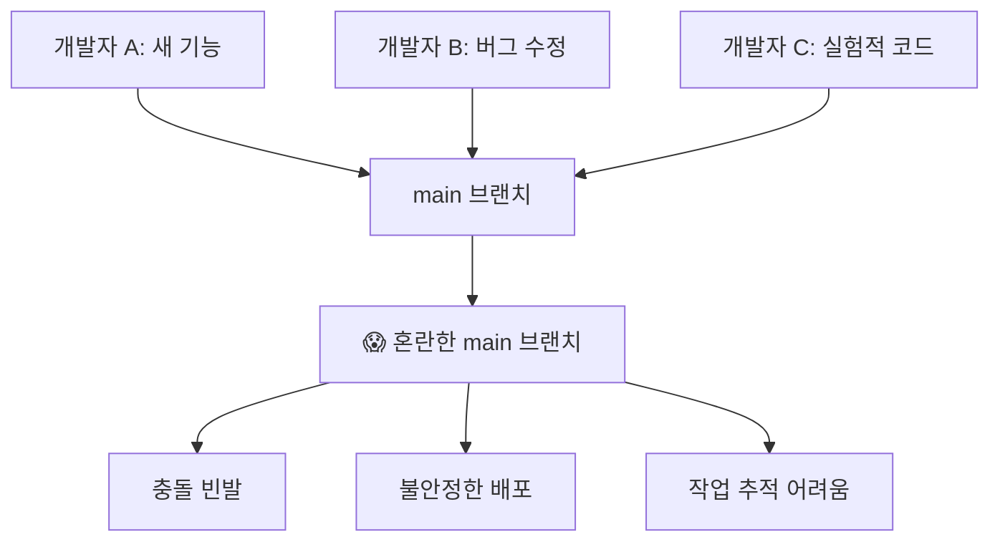
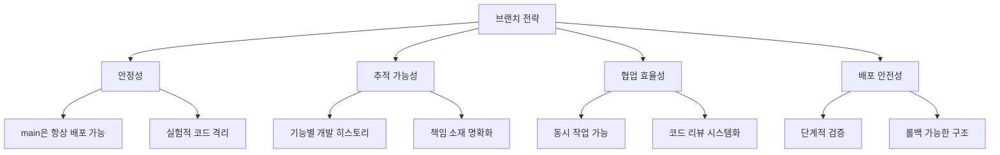
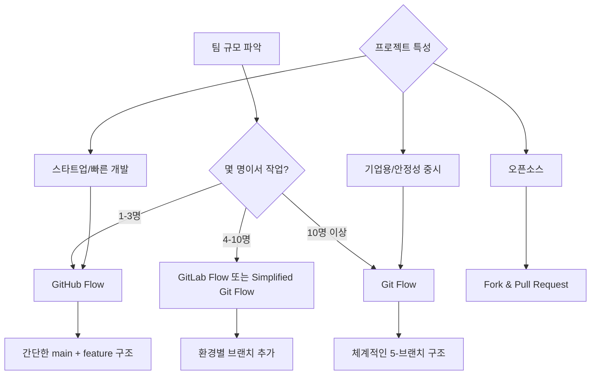
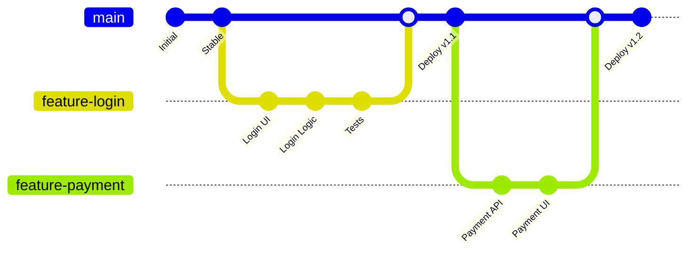
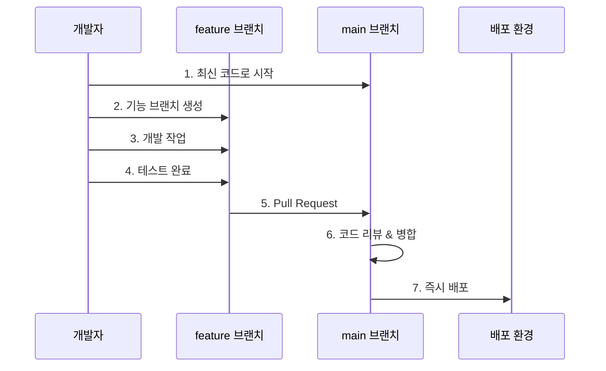
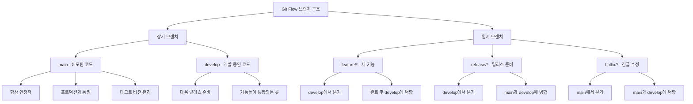
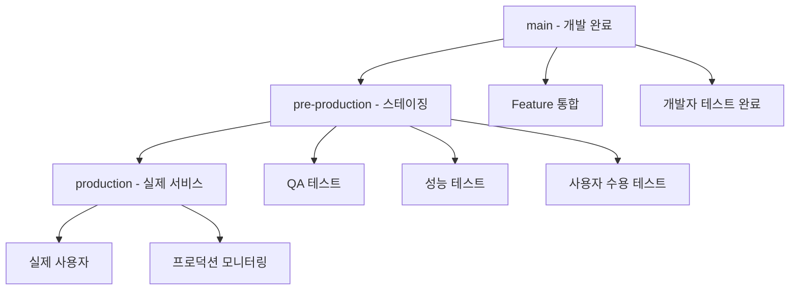
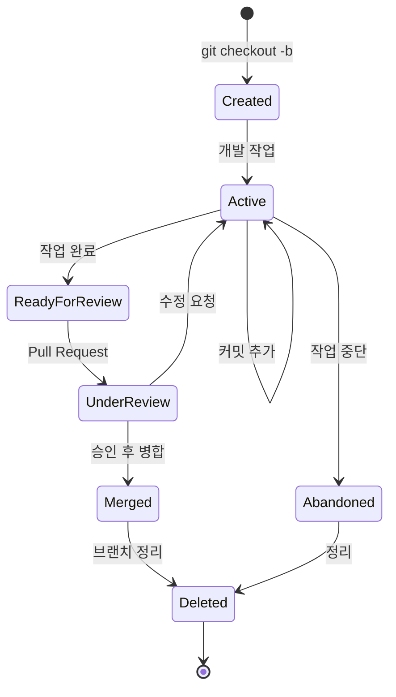

# Git 브랜치 전략

## 왜 브랜치 전략이 필요한가?

### 브랜치 전략 없이 개발하면?



**현실에서 일어나는 일들:**
- "누가 이 코드를 깨뜨렸지?"
- "어떤 기능이 언제 배포되었지?"
- "이 버그 수정이 다른 기능에 영향을 주나?"
- "긴급 수정이 필요한데 불안정한 코드와 섞여있어..."

### 브랜치 전략의 목표



## 팀 규모별 브랜치 전략 선택 가이드



## 주요 브랜치 전략들

### 1. GitHub Flow (가장 간단 - 소규모 팀용)

#### 구조와 철학
GitHub Flow는 **"main 브랜치가 항상 배포 가능한 상태"**라는 단순한 원칙에 기반합니다.



#### 브랜치 구조
- **main**: 유일한 장기 브랜치, 항상 배포 가능
- **feature/기능명**: 모든 새로운 작업 (기능, 버그, 실험)

#### 실제 워크플로우


**단계별 명령어:**
```bash
# 1. 최신 main에서 시작
git checkout main
git pull origin main

# 2. 새 기능 브랜치 생성
git checkout -b feature-user-profile

# 3. 개발 작업
# ... 코딩 ...
git add .
git commit -m "사용자 프로필 페이지 구현"

# 4. 원격에 푸시
git push -u origin feature-user-profile

# 5. GitHub에서 Pull Request 생성
# 6. 리뷰 받고 승인되면 main에 병합
# 7. main에서 자동 또는 수동 배포
```

**장점:**
- 매우 간단하고 이해하기 쉬움
- 빠른 배포 사이클
- 오버헤드 최소

**단점:**
- main의 안정성이 모든 것을 좌우
- 복잡한 릴리스 관리 어려움
- 여러 버전 동시 지원 불가

**적합한 상황:**
- 소규모 팀 (1-5명)
- 웹 서비스 (지속적 배포)
- 스타트업이나 빠른 프로토타입
- 마이크로서비스

### 2. Git Flow (가장 복잡 - 대규모 팀용)

#### 구조와 철학
Git Flow는 **체계적인 릴리스 관리**에 초점을 맞춘 전략입니다.

```mermaid
gitGraph
    commit id: "1.0"
    branch develop
    checkout develop
    commit id: "Dev Start"

    branch feature-login
    checkout feature-login
    commit id: "Login Dev"
    checkout develop
    merge feature-login

    branch feature-payment
    checkout feature-payment
    commit id: "Payment Dev"
    checkout develop
    merge feature-payment

    branch release-1.1
    checkout release-1.1
    commit id: "RC Testing"
    commit id: "Bug Fixes"

    checkout main
    merge release-1.1
    commit id: "Release 1.1"

    checkout develop
    merge release-1.1

    checkout main
    branch hotfix-security
    commit id: "Security Fix"
    merge hotfix-security
    commit id: "Hotfix 1.1.1"

    checkout develop
    merge hotfix-security
```

#### 5가지 브랜치 타입



#### 브랜치별 상세 역할

**Main 브랜치:**
- **역할**: 배포된 프로덕션 코드 보관
- **특징**: 절대 직접 커밋 금지, 태그로 버전 관리
- **업데이트**: release 브랜치나 hotfix 브랜치에서만 병합

**Develop 브랜치:**
- **역할**: 다음 릴리스를 위한 개발 통합
- **특징**: 기능들이 모이는 메인 개발 라인
- **업데이트**: feature 브랜치들이 지속적으로 병합

**Feature 브랜치:**
- **명명**: `feature/기능명` 또는 `feature/TICKET-123`
- **수명**: 기능 완성까지 (며칠~몇 주)
- **병합**: develop 브랜치에만

**Release 브랜치:**
- **명명**: `release/1.2.0`
- **역할**: 릴리스 준비 (버그 수정, 문서화, 테스트)
- **수명**: 릴리스까지 (며칠~몇 주)
- **병합**: main과 develop 양쪽에

**Hotfix 브랜치:**
- **명명**: `hotfix/critical-issue`
- **역할**: 프로덕션 긴급 수정
- **수명**: 매우 짧음 (몇 시간~하루)
- **병합**: main과 develop 양쪽에

#### 실제 워크플로우 시나리오

**시나리오 1: 새 기능 개발**
```bash
# 1. develop에서 feature 브랜치 생성
git checkout develop
git pull origin develop
git checkout -b feature-shopping-cart

# 2. 기능 개발
# ... 여러 날에 걸친 개발 ...
git add .
git commit -m "장바구니 UI 구현"
git commit -m "장바구니 로직 추가"
git commit -m "장바구니 테스트 완료"

# 3. develop에 병합 준비
git checkout develop
git pull origin develop
git merge feature-shopping-cart

# 4. 테스트 후 원격에 푸시
git push origin develop

# 5. feature 브랜치 정리
git branch -d feature-shopping-cart
git push origin --delete feature-shopping-cart
```

**시나리오 2: 릴리스 준비**
```bash
# 1. develop에서 release 브랜치 생성
git checkout develop
git checkout -b release-2.0.0

# 2. 릴리스 준비 작업
git commit -m "버전 번호를 2.0.0으로 업데이트"
git commit -m "릴리스 노트 작성"
git commit -m "마이너 버그 수정"

# 3. main에 병합 (프로덕션 배포)
git checkout main
git merge --no-ff release-2.0.0
git tag -a v2.0.0 -m "Release version 2.0.0"

# 4. develop에도 병합 (버그 수정 사항 반영)
git checkout develop
git merge --no-ff release-2.0.0

# 5. release 브랜치 정리
git branch -d release-2.0.0
git push origin --delete release-2.0.0
```

**시나리오 3: 긴급 핫픽스**
```bash
# 1. main에서 hotfix 브랜치 생성
git checkout main
git checkout -b hotfix-login-security

# 2. 긴급 수정
git commit -m "로그인 보안 취약점 수정"

# 3. main에 병합 (즉시 배포)
git checkout main
git merge --no-ff hotfix-login-security
git tag -a v2.0.1 -m "Hotfix version 2.0.1"

# 4. develop에도 병합 (개발 브랜치에 반영)
git checkout develop
git merge --no-ff hotfix-login-security

# 5. hotfix 브랜치 정리
git branch -d hotfix-login-security
```

**장점:**
- 매우 체계적이고 예측 가능
- 복잡한 릴리스 프로세스 지원
- 여러 버전 동시 관리 가능
- 긴급 수정과 정기 개발 분리

**단점:**
- 복잡하고 학습 비용 높음
- 빠른 배포에는 오버헤드
- 브랜치 관리 부담

**적합한 상황:**
- 대규모 팀 (10명 이상)
- 정기적인 릴리스 스케줄
- 기업용 소프트웨어
- 데스크톱 애플리케이션
- 여러 버전 지원이 필요한 제품

### 3. GitLab Flow (중간 복잡도 - 환경별 브랜치)

#### 구조와 철학
GitLab Flow는 **환경별 배포**를 고려한 실용적인 접근법입니다.

```mermaid
gitGraph
    commit id: "Feature A"
    commit id: "Feature B"

    branch pre-production
    checkout pre-production
    merge main
    commit id: "Test v1.1"

    branch production
    checkout production
    merge pre-production
    commit id: "Deploy v1.1"

    checkout main
    commit id: "Feature C"
    commit id: "Bugfix"

    checkout pre-production
    merge main
    commit id: "Test v1.2"

    checkout production
    merge pre-production
    commit id: "Deploy v1.2"
```

#### 환경별 브랜치 전략



**실제 워크플로우:**
```bash
# 1. 기능 개발 (GitHub Flow와 동일)
git checkout main
git checkout -b feature-notifications
# ... 개발 ...
git commit -m "알림 기능 구현"
# Pull Request를 통해 main에 병합

# 2. 스테이징 환경에 배포
git checkout pre-production
git merge main
git push origin pre-production  # 자동으로 스테이징에 배포

# 3. QA 테스트 완료 후 프로덕션 배포
git checkout production
git merge pre-production
git push origin production       # 자동으로 프로덕션에 배포
```

**장점:**
- GitHub Flow의 단순함 + 안전한 배포
- 환경별 테스트 가능
- 롤백이 쉬움

**단점:**
- 여전히 복잡한 릴리스 관리는 어려움
- 브랜치 수가 늘어남

**적합한 상황:**
- 중간 규모 팀 (5-15명)
- 웹 애플리케이션
- 스테이징 환경이 있는 프로젝트
- CI/CD가 잘 구축된 환경

## 브랜치 명명 규칙과 관리

### 효과적인 브랜치 명명법

좋은 브랜치 이름은 **무엇을 하는 브랜치인지 즉시 알 수 있게** 해줍니다:

```mermaid
graph TD
    A[브랜치 명명법] --> B[타입 접두사]
    A --> C[설명 부분]
    A --> D[구분자]

    B --> B1[feature/]
    B --> B2[bugfix/]
    B --> B3[hotfix/]
    B --> B4[release/]
    B --> B5[refactor/]
    B --> B6[docs/]

    C --> C1[간결하고 명확한 설명]
    C --> C2[소문자와 하이픈 사용]
    C --> C3[이슈 번호 포함 가능]

    D --> D1[슬래시 (/)]
    D --> D2[하이픈 (-)]
```

#### 브랜치 타입별 명명 예시

```bash
# 기능 개발
feature/user-authentication
feature/shopping-cart-ui
feature/payment-integration
feature/JIRA-123-user-profile    # 이슈 번호 포함

# 버그 수정
bugfix/login-validation-error
bugfix/memory-leak-fix
bugfix/ISSUE-456-checkout-crash

# 긴급 수정
hotfix/security-vulnerability
hotfix/payment-gateway-down
hotfix/critical-data-loss

# 릴리스 준비
release/v2.1.0
release/2024-spring-release

# 리팩토링
refactor/database-optimization
refactor/api-structure-cleanup

# 문서화
docs/api-documentation
docs/deployment-guide

# 실험/프로토타입
exp/new-ui-framework
prototype/machine-learning-model
```

#### 피해야 할 브랜치 이름

```bash
# ❌ 나쁜 예시
temp
test
my-branch
fix
new-stuff
branch-20241217
user-김개발

# ✅ 좋은 예시
feature/user-dashboard
bugfix/checkout-validation
experiment/performance-optimization
```

### 브랜치 수명 주기 관리



#### 브랜치 정리 자동화

```bash
# 병합된 로컬 브랜치들 자동 삭제
git branch --merged main | grep -v "main\|develop" | xargs -n 1 git branch -d

# 원격에서 삭제된 브랜치 참조 정리
git remote prune origin

# 또는
git fetch --prune

# 오래된 브랜치 찾기 (30일 이상)
git for-each-ref --format='%(refname:short) %(committerdate)' refs/heads | awk '$2 <= "'$(date -d '30 days ago' '+%Y-%m-%d')'"'
```

#### 브랜치 구조
- **main**: 배포된 안정적인 코드만
- **develop**: 개발 중인 코드들이 모이는 곳
- **feature/기능명**: 새 기능 개발
- **release/버전**: 배포 준비
- **hotfix/이슈명**: 긴급 수정

#### 작업 흐름
```bash
# 1. 새 기능 개발 시작
git checkout develop
git checkout -b feature/user-login

# 2. 기능 개발 완료
git checkout develop
git merge feature/user-login
git branch -d feature/user-login

# 3. 배포 준비
git checkout develop
git checkout -b release/1.2.0
# 버그 수정, 문서 업데이트 등

# 4. 배포
git checkout main
git merge release/1.2.0
git tag v1.2.0
git checkout develop
git merge release/1.2.0

# 5. 긴급 수정 시
git checkout main
git checkout -b hotfix/critical-bug
# 수정 작업
git checkout main
git merge hotfix/critical-bug
git checkout develop
git merge hotfix/critical-bug
```

**장점**: 체계적, 안정적
**단점**: 복잡함, 오버헤드 큼

### 2. GitHub Flow (가장 간단, 소규모 팀용)

#### 브랜치 구조
- **main**: 모든 작업의 중심
- **feature/기능명**: 모든 새 작업

#### 작업 흐름
```bash
# 1. 새 작업 시작
git checkout main
git pull origin main
git checkout -b feature/add-search

# 2. 작업 완료 후 Push
git push -u origin feature/add-search

# 3. Pull Request 생성 (GitHub에서)
# 4. 코드 리뷰 후 main에 병합
# 5. main에서 즉시 배포
```

**장점**: 단순함, 빠른 배포
**단점**: main 브랜치 안정성 의존

### 3. GitLab Flow (중간 복잡도)

#### 환경별 브랜치
- **main**: 개발 코드
- **pre-production**: 스테이징 환경
- **production**: 실제 서비스

#### 작업 흐름
```bash
# 1. 기능 개발
git checkout main
git checkout -b feature/new-dashboard

# 2. main에 병합
# 3. pre-production에 병합 (테스트)
# 4. production에 병합 (배포)
```

### 4. OneFlow (단순화된 Git Flow)

#### 특징
- main 브랜치만 장기 브랜치로 유지
- 릴리스 브랜치를 기능별로 생성
- 히스토리가 깔끔함

## 브랜치 명명 규칙

### 기능별 분류
```bash
feature/기능명          # 새로운 기능
bugfix/버그명           # 버그 수정
hotfix/긴급수정명       # 긴급 수정
release/버전명          # 릴리스 준비
refactor/리팩토링명     # 코드 리팩토링
docs/문서명             # 문서 작업
style/스타일명          # 코드 스타일 변경
test/테스트명           # 테스트 코드
chore/작업명            # 기타 작업
```

### 예시
```bash
feature/user-authentication
feature/payment-integration
bugfix/login-validation-error
hotfix/security-vulnerability
release/v2.1.0
refactor/database-optimization
docs/api-documentation
```

## 팀 규모별 추천 전략

### 소규모 팀 (1-3명)
- **GitHub Flow** 추천
- 간단하고 빠른 개발 가능
- main 브랜치 중심으로 작업

### 중규모 팀 (4-10명)
- **GitLab Flow** 또는 **simplified Git Flow** 추천
- 환경별 브랜치로 안정성 확보
- 코드 리뷰 프로세스 도입

### 대규모 팀 (10명 이상)
- **Git Flow** 추천
- 체계적인 릴리스 관리
- 명확한 역할 분담

## 브랜치 보호 규칙 설정

### GitHub 설정
```bash
# main 브랜치 보호 설정:
1. Settings > Branches
2. Add rule for main
3. Require pull request reviews
4. Require status checks to pass
5. Restrict pushes to main
```

### 로컬 훅 설정
```bash
# .git/hooks/pre-push
#!/bin/sh
branch=$(git rev-parse --abbrev-ref HEAD)
if [ "$branch" = "main" ]; then
  echo "main 브랜치에 직접 push할 수 없습니다!"
  exit 1
fi
```

## 병합 전략

### 1. Merge Commit (기본)
```bash
git checkout main
git merge feature/new-feature
```
- 브랜치 히스토리 보존
- 병합 지점 명확

### 2. Squash and Merge
```bash
git checkout main
git merge --squash feature/new-feature
git commit -m "새 기능 추가"
```
- 깔끔한 히스토리
- 브랜치의 모든 커밋을 하나로 압축

### 3. Rebase and Merge
```bash
git checkout feature/new-feature
git rebase main
git checkout main
git merge feature/new-feature
```
- 선형적인 히스토리
- 병합 커밋 없음

## 릴리스 관리

### 시맨틱 버저닝
```
MAJOR.MINOR.PATCH
예: 2.1.3

MAJOR: 호환되지 않는 API 변경
MINOR: 하위 호환 가능한 기능 추가
PATCH: 하위 호환 가능한 버그 수정
```

### 태그 관리
```bash
# 태그 생성
git tag v1.0.0
git tag -a v1.0.0 -m "버전 1.0.0 릴리스"

# 태그 푸시
git push origin v1.0.0
git push origin --tags

# 태그 기반 릴리스 브랜치 생성
git checkout -b release/v1.0.0 v0.9.0
```

## 충돌 해결 전략

### 자동 병합 설정
```bash
# merge 시 Fast-forward만 허용
git config --global merge.ff only

# rebase 시 자동으로 stash
git config --global rebase.autoStash true
```

### 충돌 해결 도구
```bash
# 기본 merge 도구 설정
git config --global merge.tool vimdiff
git config --global merge.tool code

# 충돌 해결
git mergetool
```

## 모니터링과 분석

### 브랜치 분석
```bash
# 브랜치별 커밋 수
git for-each-ref --format='%(refname:short) %(committerdate)' refs/heads

# 오래된 브랜치 찾기
git for-each-ref --format='%(refname:short) %(committerdate)' --sort=committerdate refs/heads

# 병합되지 않은 브랜치 찾기
git branch --no-merged main
```

### 개발자별 기여도
```bash
# 커밋 수 통계
git shortlog -sn

# 특정 기간 통계
git shortlog -sn --since="1 month ago"
```

## 자동화 팁

### Git Hooks 활용
```bash
# pre-commit: 커밋 전 검사
#!/bin/sh
npm run lint
npm test

# pre-push: 푸시 전 검사
#!/bin/sh
branch=$(git rev-parse --abbrev-ref HEAD)
if [[ "$branch" =~ ^(main|develop)$ ]]; then
    echo "Protected branch에 직접 push 금지!"
    exit 1
fi
```

### CI/CD 연동
```yaml
# .github/workflows/branch-check.yml
name: Branch Check
on:
  pull_request:
    branches: [main]
jobs:
  check:
    runs-on: ubuntu-latest
    steps:
      - uses: actions/checkout@v2
      - run: npm ci
      - run: npm test
      - run: npm run lint
```

## 관련 문서
- [[Git 기본 개념]] - Git의 핵심 개념과 작동 원리
- [[Git 명령어 비교]] - 브랜치 작업에 필요한 명령어들
- [[Git 고급 워크플로우]] - 복잡한 브랜치 시나리오 처리법
- [[Git 커밋 메시지 작성법]] - 브랜치별 커밋 메시지 전략
- [[Git 트러블슈팅]] - 브랜치 관련 문제 해결법