# Git 트러블슈팅

Git을 사용하다 보면 예상치 못한 상황들이 발생합니다. 이 문서는 실제 개발 현장에서 자주 마주치는 Git 문제들과 그 해결법을 단계별로 설명합니다.

## 🚨 문제 해결 프로세스

```mermaid
graph TD
    A[문제 발생] --> B[현재 상태 파악]
    B --> C[git status 확인]
    C --> D[git log로 히스토리 확인]
    D --> E[문제 유형 분류]
    E --> F[적절한 해결책 선택]
    F --> G[백업 후 실행]
    G --> H[결과 검증]
    H --> I[문제 해결 완료]

    style A fill:#ffcccb
    style I fill:#90ee90
```

## 자주 발생하는 문제들과 해결법

### 1. 잘못된 커밋 수정하기

커밋을 잘못 만들었을 때의 해결 방법들을 상황별로 알아보겠습니다.

```mermaid
graph LR
    A[잘못된 커밋 발견] --> B{어떤 문제?}
    B --> C[메시지만 잘못됨]
    B --> D[파일을 빼먹음]
    B --> E[여러 커밋 문제]

    C --> C1["git commit --amend"]
    D --> D1["git add + amend"]
    E --> E1["git rebase -i"]

    style A fill:#ffcccb
    style C1 fill:#90ee90
    style D1 fill:#90ee90
    style E1 fill:#90ee90
```

#### 마지막 커밋 메시지 수정
**상황**: "로그인 기능 구현"이라고 쓰려던 것을 "로긴 기능 구현"으로 오타를 냈을 때

```bash
git commit --amend -m "로그인 기능 구현"
```

**주의사항**: 이미 `push`한 커밋은 수정하지 마세요! 다른 사람이 이미 받았을 수 있습니다.

#### 마지막 커밋에 파일 추가
**상황**: 커밋을 했는데 중요한 파일을 빼먹었을 때

```bash
# 빼먹은 파일을 스테이징
git add forgotten-file.txt

# 메시지 변경 없이 커밋에 추가
git commit --amend --no-edit

# 메시지도 함께 수정하려면
git commit --amend -m "로그인 기능 구현 (설정 파일 포함)"
```

#### 여러 커밋 수정 (Interactive Rebase)
**상황**: 최근 3개 커밋 중에 여러 문제가 있을 때

```bash
git rebase -i HEAD~3  # 최근 3개 커밋 수정
```

에디터가 열리면서 다음과 같이 나타납니다:
```
pick f7f7f7f 첫 번째 커밋
pick 310154e 두 번째 커밋
pick a5f4a0d 세 번째 커밋

# 명령어들:
# p, pick = 커밋 그대로 사용
# r, reword = 커밋 메시지 수정
# e, edit = 커밋 내용 수정
# s, squash = 이전 커밋과 합치기
# d, drop = 커밋 삭제
```

**실제 수정 예시**:
```
pick f7f7f7f 첫 번째 커밋        # 그대로 두기
reword 310154e 두 번째 커밋      # 메시지만 수정
squash a5f4a0d 세 번째 커밋      # 두 번째와 합치기
```

### 2. 파일 되돌리기

Git의 세 영역에서 파일을 되돌리는 방법을 이해해보겠습니다.

```mermaid
graph TD
    subgraph "Git 세 영역"
        A[Working Directory<br/>작업 중인 파일들]
        B[Staging Area<br/>커밋 예정 파일들]
        C[Repository<br/>커밋된 파일들]
    end

    A -->|git add| B
    B -->|git commit| C

    A -.->|git restore| A1[이전 상태]
    B -.->|git restore --staged| A2[스테이징 취소]
    C -.->|git reset/revert| C1[커밋 되돌리기]

    style A1 fill:#ffcccb
    style A2 fill:#ffcccb
    style C1 fill:#ffcccb
```

#### 워킹 디렉토리의 변경사항 취소
**상황**: 파일을 수정했는데 잘못 수정했다는 걸 깨달았을 때

```bash
# Git 2.23+ 새로운 방법 (추천)
git restore file.txt            # 특정 파일
git restore .                   # 모든 파일

# 기존 방법
git checkout -- file.txt        # 특정 파일
git checkout -- .               # 모든 파일
```

**경고**: 이 명령은 변경사항을 **완전히 삭제**합니다. 복구할 수 없습니다!

#### 스테이징 취소
**상황**: `git add`로 파일을 스테이징했는데 다시 빼고 싶을 때

```bash
# Git 2.23+ 새로운 방법 (추천)
git restore --staged file.txt   # 특정 파일
git restore --staged .          # 모든 파일

# 기존 방법
git reset HEAD file.txt         # 특정 파일
git reset HEAD .                # 모든 파일
```

**참고**: 이 명령은 스테이징만 취소하고, 파일의 실제 변경사항은 그대로 유지됩니다.

#### 커밋 되돌리기 - 위험도별 분류

```mermaid
graph TD
    A[커밋 되돌리기 방법] --> B[안전한 방법]
    A --> C[주의가 필요한 방법]
    A --> D[위험한 방법]

    B --> B1["git revert<br/>(새 커밋으로 되돌리기)"]
    C --> C1["git reset --soft<br/>(커밋만 취소)"]
    C --> C2["git reset --mixed<br/>(커밋+스테이징 취소)"]
    D --> D1["git reset --hard<br/>(모든 변경사항 삭제)"]

    style B1 fill:#90ee90
    style C1 fill:#fff3cd
    style C2 fill:#fff3cd
    style D1 fill:#ffcccb
```

**1. 안전한 되돌리기 (추천)**
```bash
git revert HEAD  # 마지막 커밋의 변경사항을 취소하는 새 커밋 생성
```
- 기존 히스토리를 보존
- 협업 시에도 안전
- 나중에 언제든 다시 되돌릴 수 있음

**2. 마지막 커밋만 취소 (변경사항은 유지)**
```bash
git reset --soft HEAD~1
```
- 커밋만 취소, 스테이징과 워킹 디렉토리는 그대로
- 커밋 메시지만 다시 쓰고 싶을 때 유용

**3. 커밋과 스테이징 취소**
```bash
git reset --mixed HEAD~1  # 기본값이므로 --mixed 생략 가능
git reset HEAD~1
```
- 커밋과 스테이징 취소, 워킹 디렉토리는 그대로
- 파일들을 다시 선별해서 커밋하고 싶을 때 유용

**4. 모든 변경사항 완전 삭제 (⚠️ 위험!)**
```bash
git reset --hard HEAD~1
```
- 커밋, 스테이징, 워킹 디렉토리 모두 되돌림
- **변경사항이 완전히 사라짐!**
- 정말 확실할 때만 사용

### 3. 브랜치 문제 해결

브랜치 관련 실수들은 매우 자주 발생합니다. 상황별 해결 방법을 알아보겠습니다.

```mermaid
graph TD
    A[브랜치 문제] --> B[잘못된 브랜치에서 작업]
    A --> C[브랜치를 실수로 삭제]
    A --> D[원격/로컬 브랜치 불일치]
    A --> E[브랜치가 너무 많음]

    B --> B1["git stash + 브랜치 이동"]
    C --> C1["git reflog로 복구"]
    D --> D1["git prune으로 정리"]
    E --> E1["병합된 브랜치 일괄 삭제"]

    style A fill:#ffcccb
    style B1 fill:#90ee90
    style C1 fill:#90ee90
    style D1 fill:#90ee90
    style E1 fill:#90ee90
```

#### 잘못된 브랜치에서 작업한 경우
**상황**: `main` 브랜치에서 작업하고 있었는데, 사실 `feature/login` 브랜치에서 작업했어야 했을 때

**해결 과정**:
```bash
# 1. 현재 상황 확인
git status
git branch  # 현재 브랜치 확인

# 2. 현재 변경사항을 임시 저장
git stash save "잘못된 브랜치에서 작업한 내용"

# 3. 올바른 브랜치로 이동 (없으면 생성)
git checkout -b feature/login  # 새 브랜치 생성 후 이동
# 또는
git checkout feature/login     # 기존 브랜치로 이동

# 4. 변경사항 복원
git stash pop
```

**시각적 표현**:
```mermaid
gitGraph
    commit id: "A"
    commit id: "B"
    branch main
    commit id: "C (실수)"
    checkout main
    branch feature/login
    commit id: "C (올바른 위치)"
```

#### 브랜치를 삭제했는데 복구하고 싶을 때
**상황**: `git branch -D feature/important`로 중요한 브랜치를 실수로 삭제했을 때

**해결 과정**:
```bash
# 1. 삭제된 브랜치의 커밋 해시 찾기
git reflog | grep "feature/important"
# 또는 모든 reflog 보기
git reflog

# 출력 예시:
# a1b2c3d HEAD@{5}: checkout: moving from feature/important to main
# e4f5g6h HEAD@{6}: commit: 중요한 기능 완성

# 2. 브랜치 복구
git checkout -b feature/important-recovered e4f5g6h

# 3. 복구 확인
git log --oneline
```

#### 원격 브랜치가 삭제되었는데 로컬에 남아있을 때
**상황**: GitHub에서 브랜치를 삭제했는데 로컬에는 여전히 남아있을 때

```bash
# 1. 현재 상황 확인
git branch -a  # 모든 브랜치 보기

# 출력 예시:
# * main
#   feature/old-feature
#   remotes/origin/main
#   remotes/origin/feature/old-feature  <- 이미 삭제된 원격 브랜치

# 2. 원격에서 삭제된 브랜치 정보 업데이트
git fetch --prune
# 또는
git remote prune origin

# 3. 로컬 브랜치도 삭제 (필요한 경우)
git branch -d feature/old-feature
```

#### 너무 많은 브랜치 정리하기
**상황**: 병합이 완료된 오래된 브랜치들이 너무 많을 때

```bash
# 1. 병합된 브랜치 목록 확인
git branch --merged main

# 2. main과 현재 브랜치를 제외하고 병합된 브랜치 일괄 삭제
git branch --merged main | grep -v "\*\|main\|develop" | xargs -n 1 git branch -d

# 3. 원격에서도 삭제된 브랜치들 정리
git remote prune origin
```

### 4. 병합 충돌 해결

병합 충돌은 Git에서 가장 무서워하는 상황 중 하나입니다. 하지만 단계적으로 접근하면 충분히 해결할 수 있습니다.

#### 충돌이 발생하는 이유


같은 파일의 같은 부분을 서로 다르게 수정했을 때 충돌이 발생합니다.

#### 충돌 해결 프로세스

```mermaid
flowchart TD
    A["git merge 실행"] --> B["충돌 발생!"]
    B --> C["git status로 충돌 파일 확인"]
    C --> D["충돌 파일 열어서 내용 확인"]
    D --> E["충돌 마커 이해하기"]
    E --> F["원하는 코드로 수정"]
    F --> G["충돌 마커 완전 삭제"]
    G --> H["git add로 해결 표시"]
    H --> I["git commit으로 병합 완료"]

    B --> J["너무 복잡하다면"]
    J --> K["git merge --abort"]
    K --> L["다른 방법 시도"]

    style B fill:#ffcccb
    style I fill:#90ee90
    style K fill:#fff3cd
```

#### 1. 충돌 상황 파악하기
```bash
# 병합을 시도했을 때 충돌이 발생하면
git merge feature-login
# Auto-merging user.js
# CONFLICT (content): Merge conflict in user.js
# Automatic merge failed; fix conflicts and then commit the result.

# 충돌 파일들 확인
git status
# On branch main
# You have unmerged paths.
# Unmerged paths:
#   (use "git add <file>..." to mark resolution)
#       both modified:   user.js
```

#### 2. 충돌 파일 내용 이해하기
실제 `user.js` 파일을 열면 다음과 같이 표시됩니다:

```javascript
function getUser(id) {
<<<<<<< HEAD
    // main 브랜치의 코드
    return database.findUser(id);
=======
    // feature-login 브랜치의 코드
    return userService.getUserById(id);
>>>>>>> feature-login
}
```

**충돌 마커 설명**:
- `<<<<<<< HEAD`: 현재 브랜치(main)의 내용 시작
- `=======`: 구분선
- `>>>>>>> feature-login`: 병합하려는 브랜치의 내용 끝

#### 3. 충돌 해결하기

**옵션 1: 현재 브랜치 코드 선택**
```javascript
function getUser(id) {
    return database.findUser(id);
}
```

**옵션 2: 병합하려는 브랜치 코드 선택**
```javascript
function getUser(id) {
    return userService.getUserById(id);
}
```

**옵션 3: 둘 다 포함한 새로운 코드 작성**
```javascript
function getUser(id) {
    // 두 방법을 모두 고려한 새로운 해결책
    if (userService.isAvailable()) {
        return userService.getUserById(id);
    }
    return database.findUser(id);
}
```

#### 4. 충돌 해결 완료하기
```bash
# 1. 수정된 파일을 스테이징
git add user.js

# 2. 충돌이 모두 해결되었는지 확인
git status
# On branch main
# All conflicts fixed but you are still merging.

# 3. 병합 커밋 생성
git commit -m "충돌 해결: user.js에서 userService와 database 방법 통합"
```

#### 고급 충돌 해결 도구

**병합 도구 사용**
```bash
# VS Code를 병합 도구로 설정
git config --global merge.tool vscode
git config --global mergetool.vscode.cmd 'code --wait $MERGED'

# 병합 도구 실행
git mergetool
```

**명령어로 특정 버전 선택**
```bash
# 현재 브랜치(HEAD) 버전 선택
git checkout --ours user.js

# 병합하려는 브랜치 버전 선택
git checkout --theirs user.js

# 선택 후 스테이징
git add user.js
```

#### 병합 취소하기
```bash
# 병합을 완전히 취소하고 이전 상태로 돌아가기
git merge --abort

# 충돌이 너무 복잡할 때 유용함
```

### 5. 원격 저장소 문제

원격 저장소와의 동기화 문제는 특히 팀 작업에서 자주 발생합니다.

```mermaid
sequenceDiagram
    participant L as 로컬 저장소
    participant R as 원격 저장소 (GitHub)
    participant T as 팀원의 저장소

    Note over L,T: 일반적인 협업 시나리오

    T->>R: git push (팀원이 먼저 푸시)
    L->>R: git push ❌ (거부됨!)

    Note over L: "Updates were rejected"

    R->>L: git fetch/pull (최신 변경사항 가져오기)
    L->>L: 병합 또는 리베이스
    L->>R: git push ✅ (성공!)
```

#### Push 거부당했을 때
**상황**: `git push`했는데 "Updates were rejected" 메시지가 나올 때

**원인**: 다른 사람이 먼저 push했어서 원격 저장소가 내 로컬보다 앞서 있음

**해결 과정**:
```bash
# 1. 현재 상황 확인
git status
git log --oneline -5

# 2. 원격의 최신 변경사항 가져오기
git fetch origin

# 3. 원격과 로컬의 차이 확인
git log --oneline --graph origin/main..HEAD    # 내가 추가한 커밋들
git log --oneline --graph HEAD..origin/main    # 원격에 있는 새 커밋들

# 4-A. 병합 방식 (merge commit 생성)
git merge origin/main
git push origin main

# 4-B. 리베이스 방식 (깔끔한 히스토리)
git rebase origin/main
git push origin main

# 4-C. 간단한 방식 (pull = fetch + merge)
git pull origin main
git push origin main
```

**어떤 방식을 선택할까?**
- **병합(merge)**: 안전하지만 히스토리가 복잡해짐
- **리베이스(rebase)**: 깔끔하지만 충돌 시 복잡할 수 있음
- **Pull**: 가장 간단하지만 자동으로 merge 수행

#### Force Push 상황과 주의사항

```mermaid
graph TD
    A[Force Push가 필요한 상황] --> B[rebase로 히스토리 정리함]
    A --> C[커밋 메시지를 amend로 수정함]
    A --> D[민감한 정보를 커밋에서 제거함]

    B --> E[혼자 작업하는 브랜치?]
    C --> E
    D --> E

    E --> F[Yes: force-with-lease 사용]
    E --> G[No: 절대 금지!]

    F --> H["git push --force-with-lease"]
    G --> I["새 커밋으로 문제 해결"]

    style G fill:#ffcccb
    style H fill:#fff3cd
    style I fill:#90ee90
```

**안전한 Force Push**:
```bash
# 다른 사람이 push하지 않았을 때만 force push 수행
git push --force-with-lease origin feature/my-work

# 만약 다른 사람이 push했다면 실패하고 안전하게 보호됨
```

**위험한 Force Push (절대 금지!)**:
```bash
# 다른 사람의 작업을 강제로 덮어써버림
git push --force origin main  # 😱 팀원들의 작업이 사라질 수 있음!
```

#### 원격 저장소 URL 변경
**상황**: 저장소가 이동했거나 HTTPS에서 SSH로 변경하고 싶을 때

```bash
# 1. 현재 원격 URL 확인
git remote -v
# origin  https://github.com/olduser/oldrepo.git (fetch)
# origin  https://github.com/olduser/oldrepo.git (push)

# 2. URL 변경
git remote set-url origin https://github.com/newuser/newrepo.git

# 3. SSH로 변경하는 경우
git remote set-url origin git@github.com:newuser/newrepo.git

# 4. 변경 확인
git remote -v
```

#### 여러 원격 저장소 관리
**상황**: GitHub과 GitLab에 동시에 push하고 싶을 때

```bash
# 추가 원격 저장소 등록
git remote add gitlab https://gitlab.com/username/repo.git

# 모든 원격 저장소 확인
git remote -v
# origin    https://github.com/username/repo.git (fetch)
# origin    https://github.com/username/repo.git (push)
# gitlab    https://gitlab.com/username/repo.git (fetch)
# gitlab    https://gitlab.com/username/repo.git (push)

# 특정 원격에 push
git push origin main
git push gitlab main

# 모든 원격에 한번에 push
git remote | xargs -L1 git push --all
```

### 6. 스테이시(Stash) 문제

스테이시는 임시 저장 기능이지만, 가끔 예상치 못한 문제들이 발생할 수 있습니다.

```mermaid
flowchart TD
    A[작업 중] --> B[긴급한 다른 작업 필요]
    B --> C["git stash save '설명'"]
    C --> D[다른 브랜치에서 작업]
    D --> E[원래 브랜치로 돌아옴]
    E --> F["git stash pop"]

    F --> G{충돌 발생?}
    G --> H[Yes: 수동 해결]
    G --> I[No: 작업 재개]

    C --> J[실수로 stash drop]
    J --> K[복구 시도]

    style J fill:#ffcccb
    style K fill:#fff3cd
```

#### 스테이시 기본 사용법 복습
```bash
# 현재 작업을 임시 저장 (설명과 함께)
git stash save "로그인 기능 작업 중 - 절반 완성"

# 스테이시 목록 확인
git stash list
# stash@{0}: On feature-login: 로그인 기능 작업 중 - 절반 완성
# stash@{1}: On main: 긴급 버그 수정 전 백업

# 가장 최근 스테이시 적용하고 삭제
git stash pop

# 특정 스테이시 적용 (삭제하지 않음)
git stash apply stash@{1}

# 특정 스테이시 삭제
git stash drop stash@{1}
```

#### 실수로 stash를 drop했을 때 복구
**상황**: 중요한 작업이 저장된 스테이시를 `git stash drop`으로 삭제했을 때

**복구 과정**:
```bash
# 1. 삭제된 stash의 해시값 찾기
git fsck --unreachable | grep commit | cut -d' ' -f3 | xargs git log --merges --no-walk --grep=WIP

# 더 간단한 방법: reflog에서 stash 기록 찾기
git reflog | grep stash
# a1b2c3d WIP on feature-login: 1234567 로그인 기능 작업 중

# 2. 해시값으로 stash 내용 확인
git show a1b2c3d

# 3. stash 복구
git stash apply a1b2c3d

# 4. 새로운 stash로 다시 저장 (선택사항)
git stash save "복구된 스테이시: 로그인 기능 작업"
```

#### 스테이시 충돌 해결
**상황**: `git stash pop`했는데 충돌이 발생했을 때

```bash
# stash를 적용하려다 충돌 발생
git stash pop
# Auto-merging login.js
# CONFLICT (content): Merge conflict in login.js
# The stash entry is kept in case you need it again.

# 1. 충돌 파일 수정 (병합 충돌과 동일한 방식)
# vim login.js 등으로 충돌 마커 제거 후 원하는 코드로 수정

# 2. 수정된 파일 스테이징
git add login.js

# 3. 스테이시는 자동으로 삭제되지 않았으므로 수동 삭제
git stash drop stash@{0}
```

#### 복잡한 스테이시 관리
**여러 스테이시들을 효율적으로 관리하기**

```bash
# 1. 의미있는 이름으로 스테이시 저장
git stash save "feature/user-profile: 프로필 이미지 업로드 구현 중"
git stash save "hotfix/login-bug: 로그인 실패 버그 수정 50% 완료"

# 2. 스테이시 내용 미리보기
git stash show -p stash@{0}  # 패치 형태로 보기
git stash show stash@{0}     # 변경된 파일 목록만 보기

# 3. 특정 파일만 스테이시에서 적용
git checkout stash@{0} -- src/login.js

# 4. 스테이시를 브랜치로 만들기
git stash branch new-feature-branch stash@{0}
```

#### 오래된 스테이시 정리
```bash
# 모든 스테이시 목록과 날짜 확인
git stash list --date=local

# 30일 이상 된 스테이시들 찾기
git for-each-ref --format="%(refname:short) %(committerdate)" refs/stash

# 특정 스테이시들만 선별 삭제
git stash drop stash@{2}
git stash drop stash@{3}

# 모든 스테이시 한번에 삭제 (주의!)
git stash clear
```

### 7. 인증 문제

Git에서 원격 저장소에 접근할 때 인증 문제는 매우 자주 발생합니다. 특히 GitHub의 정책 변경으로 더욱 복잡해졌습니다.

```mermaid
graph TD
    A[Git 인증 방법] --> B[HTTPS 방식]
    A --> C[SSH 방식]

    B --> B1[토큰 인증 필요]
    B --> B2[사용자명/비밀번호 저장]
    B --> B3[2FA 설정시 복잡]

    C --> C1[SSH 키 생성 필요]
    C --> C2[한번 설정시 편리]
    C --> C3[보안성 높음]

    B1 --> D["GitHub Personal Access Token"]
    C1 --> E["SSH 키 페어 생성"]

    style C fill:#90ee90
    style B fill:#fff3cd
```

#### HTTPS 인증 문제 해결

**1. GitHub Personal Access Token 사용 (권장)**

2021년 8월부터 GitHub는 비밀번호 대신 Personal Access Token을 요구합니다.

```bash
# 1. GitHub에서 Personal Access Token 생성
# Settings → Developer settings → Personal access tokens → Generate new token

# 2. 토큰을 비밀번호로 사용
# Username: 당신의_GitHub_사용자명
# Password: ghp_xxxxxxxxxxxxxxxxxxxx (생성한 토큰)

# 3. 인증 정보 저장 설정
# Windows
git config --global credential.helper manager-core

# Mac
git config --global credential.helper osxkeychain

# Linux
git config --global credential.helper store

# 4. 첫 push/pull 시 토큰으로 인증
git push origin main
# Username: your-username
# Password: ghp_xxxxxxxxxxxxxxxxxxxx
```

**2. 저장된 잘못된 인증 정보 삭제**

```bash
# Windows (Credential Manager에서)
# 제어판 → 사용자 계정 → Credential Manager → Windows 자격 증명
# git:https://github.com 항목 삭제

# Mac (Keychain에서)
# Applications → Utilities → Keychain Access
# github.com 항목 삭제
# 또는 명령어로:
security delete-internet-password -s github.com

# Linux (store 사용 시)
rm ~/.git-credentials

# 모든 플랫폼 공통: 설정에서 제거
git config --global --unset credential.helper
```

#### SSH 키 설정 (권장 방법)

**장점**: 한번 설정하면 토큰 관리 불필요, 더 안전함

```bash
# 1. 기존 SSH 키 확인
ls -la ~/.ssh/
# id_rsa, id_rsa.pub 또는 id_ed25519, id_ed25519.pub 파일 확인

# 2. SSH 키가 없다면 새로 생성
ssh-keygen -t ed25519 -C "your.email@example.com"
# 또는 RSA 방식 (구 시스템 호환성)
ssh-keygen -t rsa -b 4096 -C "your.email@example.com"

# 엔터 연타로 기본 설정 사용 (비밀번호는 선택사항)

# 3. SSH 에이전트 시작 및 키 추가
eval "$(ssh-agent -s)"
ssh-add ~/.ssh/id_ed25519  # 또는 id_rsa

# 4. 공개키를 GitHub에 등록
# 공개키 내용 복사
cat ~/.ssh/id_ed25519.pub  # 또는 id_rsa.pub
# 출력된 내용을 복사

# 5. GitHub에서 SSH 키 등록
# Settings → SSH and GPG keys → New SSH key
# 복사한 공개키 내용 붙여넣기

# 6. SSH 연결 테스트
ssh -T git@github.com
# Hi username! You've successfully authenticated, but GitHub does not provide shell access.
```

**7. 원격 URL을 SSH로 변경**
```bash
# 현재 URL 확인
git remote -v

# HTTPS에서 SSH로 변경
git remote set-url origin git@github.com:username/repository.git

# 확인
git remote -v
# origin  git@github.com:username/repository.git (fetch)
# origin  git@github.com:username/repository.git (push)
```

#### 인증 관련 오류 해결

**오류 1: "Permission denied (publickey)"**
```bash
# SSH 키가 제대로 등록되지 않았거나 SSH 에이전트가 키를 인식하지 못함

# 1. SSH 에이전트에 키 추가 확인
ssh-add -l

# 2. 키가 없다면 추가
ssh-add ~/.ssh/id_ed25519

# 3. SSH 연결 디버그
ssh -vT git@github.com
```

**오류 2: "Authentication failed"**
```bash
# Personal Access Token이 만료되었거나 권한이 부족

# 1. 토큰 재생성
# GitHub → Settings → Developer settings → Personal access tokens
# 기존 토큰 삭제 후 새로 생성 (repo 권한 필수)

# 2. 저장된 인증 정보 삭제 후 다시 로그인
git credential-manager-core erase
# host=github.com
# protocol=https
# [빈 줄 입력 후 Ctrl+C]
```

**오류 3: "Support for password authentication was removed"**
```bash
# GitHub가 비밀번호 인증을 중단함

# Personal Access Token 사용하거나 SSH로 전환
# 위의 해결 방법 참조
```

### 8. 대용량 파일 문제

대용량 파일을 Git에 잘못 커밋하면 저장소 크기가 급증하고 클론/푸시가 매우 느려집니다.

```mermaid
graph TD
    A[대용량 파일 문제] --> B[파일 크기 제한]
    A --> C[저장소 크기 급증]
    A --> D[클론/푸시 속도 저하]

    B --> B1["GitHub: 100MB 제한"]
    B --> B2["GitLab: 기본 10MB"]

    C --> E[해결 방법]
    D --> E

    E --> F["git filter-branch"]
    E --> G["BFG Repo-Cleaner"]
    E --> H["Git LFS 사용"]
    E --> I[".gitignore 설정"]

    style A fill:#ffcccb
    style E fill:#90ee90
```

#### 1. 대용량 파일 감지하기

```bash
# 저장소에서 큰 파일들 찾기
git rev-list --objects --all | git cat-file --batch-check='%(objecttype) %(objectname) %(objectsize) %(rest)' | \
sed -n 's/^blob //p' | sort --numeric-sort --key=2 | tail -20

# 더 간단한 방법 (Unix 시스템)
find . -size +50M -type f -not -path "./.git/*"

# 현재 저장소 크기 확인
git count-objects -vH
```

#### 2. 실수로 커밋한 대용량 파일 제거

**방법 1: git filter-branch (내장 도구)**

⚠️ **주의**: 이 작업은 전체 히스토리를 다시 쓰므로 팀 작업시 신중해야 합니다.

```bash
# 1. 작업 전 백업 브랜치 생성
git checkout -b backup-before-filter
git checkout main

# 2. 특정 파일을 히스토리에서 완전 제거
git filter-branch --force --index-filter \
'git rm --cached --ignore-unmatch large-video.mp4' \
--prune-empty --tag-name-filter cat -- --all

# 3. 여러 파일 패턴으로 제거
git filter-branch --force --index-filter \
'git rm --cached --ignore-unmatch -r "*.mp4" "*.zip" "node_modules/"' \
--prune-empty --tag-name-filter cat -- --all

# 4. 정리 작업
rm -rf .git/refs/original/
git reflog expire --expire=now --all
git gc --prune=now --aggressive

# 5. 강제 푸시 (팀원들에게 미리 알려야 함!)
git push origin --force --all
git push origin --force --tags
```

**방법 2: BFG Repo-Cleaner (더 빠름, 권장)**

```bash
# 1. BFG 다운로드
# https://rtyley.github.io/bfg-repo-cleaner/
wget https://repo1.maven.org/maven2/com/madgag/bfg/1.14.0/bfg-1.14.0.jar

# 2. 백업 클론 생성 (bare 저장소)
git clone --mirror git@github.com:username/repo.git

# 3. 대용량 파일 제거 (50MB 이상)
java -jar bfg-1.14.0.jar --strip-blobs-bigger-than 50M repo.git

# 4. 특정 파일/폴더 제거
java -jar bfg-1.14.0.jar --delete-files "*.mp4" repo.git
java -jar bfg-1.14.0.jar --delete-folders "node_modules" repo.git

# 5. 정리 및 푸시
cd repo.git
git reflog expire --expire=now --all && git gc --prune=now --aggressive
git push
```

#### 3. Git LFS로 대용량 파일 관리 (권장)

**Git LFS**는 대용량 파일을 별도 저장소에 보관하고 Git에는 포인터만 저장합니다.

```bash
# 1. Git LFS 설치
# https://git-lfs.github.io/
# Mac: brew install git-lfs
# Windows: Git for Windows에 포함
# Linux: apt install git-lfs

# 2. 저장소에서 LFS 초기화
git lfs install

# 3. 추적할 파일 타입 설정
git lfs track "*.mp4"
git lfs track "*.zip"
git lfs track "*.psd"  # Photoshop 파일
git lfs track "*.ai"   # Illustrator 파일

# 4. .gitattributes 파일이 생성됨 - 이것도 커밋
git add .gitattributes
git commit -m "Git LFS 설정: 대용량 파일 추적"

# 5. 이제 대용량 파일 추가
git add large-video.mp4
git commit -m "대용량 비디오 파일 추가 (LFS)"
git push origin main

# 6. LFS 상태 확인
git lfs ls-files
git lfs status
```

#### 4. .gitignore로 예방하기

```bash
# .gitignore 파일에 대용량 파일 패턴 추가
cat >> .gitignore << EOF

# 대용량 파일들
*.mp4
*.avi
*.mov
*.zip
*.tar.gz
*.iso

# 빌드 결과물
node_modules/
dist/
build/
target/

# IDE 설정
.vscode/
.idea/

# 로그 파일
*.log
logs/

# 데이터베이스
*.db
*.sqlite
EOF

git add .gitignore
git commit -m "gitignore: 대용량 파일 및 빌드 결과물 제외"
```

#### 5. 저장소 크기 최적화

```bash
# 정기적인 저장소 정리
git gc --aggressive --prune=now

# 참조되지 않는 객체 확인
git fsck --unreachable

# 저장소 크기 확인
du -sh .git/
git count-objects -vH

# 리팩토링으로 커밋 히스토리 정리 (주의!)
git rebase -i HEAD~10  # 최근 10개 커밋 정리
```

### 9. 라인 엔딩 문제

서로 다른 운영체제에서 작업할 때 라인 엔딩 차이로 인한 문제가 발생할 수 있습니다.

```mermaid
graph TD
    A[라인 엔딩 문제] --> B[Windows: CRLF]
    A --> C["Mac/Linux: LF"]

    B --> D["\r\n (Carriage Return + Line Feed)"]
    C --> E["\n (Line Feed만)"]

    D --> F[협업시 충돌 발생]
    E --> F

    F --> G[해결책]
    G --> H["core.autocrlf 설정"]
    G --> I[".gitattributes 파일"]
    G --> J["EditorConfig 사용"]

    style F fill:#ffcccb
    style G fill:#90ee90
```

#### 라인 엔딩 문제의 증상

```bash
# 이런 메시지들을 본 적이 있다면 라인 엔딩 문제입니다:
# warning: LF will be replaced by CRLF
# warning: CRLF will be replaced by LF

# 파일을 수정하지 않았는데도 git diff에서 모든 줄이 변경된 것으로 나타남
git diff
# - 기존 라인 (전체 파일)
# + 새로운 라인 (전체 파일)
```

#### 해결 방법 1: core.autocrlf 설정

**Windows 사용자**:
```bash
# Git이 커밋시 CRLF → LF로 변환, 체크아웃시 LF → CRLF로 변환
git config --global core.autocrlf true

# 현재 설정 확인
git config core.autocrlf
```

**Mac/Linux 사용자**:
```bash
# Git이 커밋시 CRLF → LF로 변환, 체크아웃시는 변환하지 않음
git config --global core.autocrlf input

# 현재 설정 확인
git config core.autocrlf
```

**순수주의자 (모든 OS)**:
```bash
# Git이 라인 엔딩을 전혀 변환하지 않음 (권장하지 않음)
git config --global core.autocrlf false
```

#### 해결 방법 2: .gitattributes 파일 (권장)

프로젝트별로 더 세밀한 제어가 가능합니다.

```bash
# 프로젝트 루트에 .gitattributes 파일 생성
cat > .gitattributes << 'EOF'
# 기본적으로 모든 텍스트 파일은 LF를 사용
* text=auto eol=lf

# 특정 파일 타입들
*.js text eol=lf
*.css text eol=lf
*.html text eol=lf
*.md text eol=lf
*.json text eol=lf
*.yml text eol=lf
*.yaml text eol=lf

# Windows 배치 파일은 CRLF 유지
*.bat text eol=crlf
*.cmd text eol=crlf

# 바이너리 파일들 (라인 엔딩 변환 안함)
*.png binary
*.jpg binary
*.gif binary
*.ico binary
*.zip binary
*.exe binary
EOF

git add .gitattributes
git commit -m "gitattributes: 라인 엔딩 통일 설정"
```

#### 기존 파일들의 라인 엔딩 정규화

**새로운 설정을 기존 파일들에 적용하기**:

```bash
# 1. 현재 변경사항이 있다면 커밋하거나 스테이시
git status

# 2. 모든 파일의 라인 엔딩을 정규화
git add --renormalize .

# 3. 변경사항 확인 (많은 파일이 수정될 수 있음)
git status

# 4. 정규화 커밋
git commit -m "라인 엔딩 정규화: 모든 파일을 LF로 통일"
```

#### EditorConfig로 예방하기

여러 에디터에서 일관된 설정을 사용하기 위해:

```bash
# 프로젝트 루트에 .editorconfig 파일 생성
cat > .editorconfig << 'EOF'
root = true

[*]
charset = utf-8
end_of_line = lf
insert_final_newline = true
trim_trailing_whitespace = true

[*.{js,jsx,ts,tsx,vue,css,scss,html,json,md,yml,yaml}]
indent_style = space
indent_size = 2

[*.{py,rb}]
indent_style = space
indent_size = 4

[*.{java,kt}]
indent_style = space
indent_size = 4

[*.{bat,cmd}]
end_of_line = crlf
EOF

git add .editorconfig
git commit -m "EditorConfig 설정: 일관된 코드 스타일"
```

#### 라인 엔딩 문제 디버깅

```bash
# 특정 파일의 라인 엔딩 확인
file -b filename.txt
# 또는
hexdump -C filename.txt | head

# Git이 파일을 어떻게 처리할지 확인
echo "filename.txt" | git check-attr --stdin -a

# 현재 설정들 확인
git config --list | grep -i crlf
git config --list | grep -i eol

# 특정 파일의 Git 속성 확인
git check-attr text filename.txt
```

#### 팀 프로젝트에서의 모범 사례

```bash
# 1. 팀 전체가 동일한 설정 사용
# .gitattributes와 .editorconfig 파일을 저장소에 포함

# 2. 프로젝트 시작시 README에 설정 방법 명시
cat >> README.md << 'EOF'

## 개발 환경 설정

### Git 설정
```bash
# Windows 사용자
git config core.autocrlf true

# Mac/Linux 사용자
git config core.autocrlf input
```

### 에디터 설정
EditorConfig 플러그인을 설치하세요.
EOF

# 3. CI/CD에서 라인 엔딩 검사 추가
cat > .github/workflows/line-ending-check.yml << 'EOF'
name: Line Ending Check
on: [push, pull_request]
jobs:
  check:
    runs-on: ubuntu-latest
    steps:
      - uses: actions/checkout@v2
      - name: Check line endings
        run: |
          if git ls-files -z | xargs -0 file | grep CRLF; then
            echo "CRLF line endings found!"
            exit 1
          fi
EOF
```

### 10. 성능 문제

Git 저장소가 커지거나 파일 수가 많아지면 성능이 저하될 수 있습니다. 상황별 최적화 방법을 알아보겠습니다.

```mermaid
graph TD
    A[Git 성능 문제] --> B[저장소 크기가 큼]
    A --> C[파일 수가 많음]
    A --> D[히스토리가 복잡함]
    A --> E[네트워크가 느림]

    B --> F["git gc --aggressive"]
    B --> G["큰 파일 제거"]

    C --> H["core.preloadindex"]
    C --> I["core.fscache"]

    D --> J["shallow clone"]
    D --> K["partial clone"]

    E --> L["git config http.postBuffer"]
    E --> M["압축 설정 조정"]

    style A fill:#ffcccb
    style F fill:#90ee90
    style G fill:#90ee90
    style H fill:#90ee90
    style I fill:#90ee90
    style J fill:#90ee90
    style K fill:#90ee90
    style L fill:#90ee90
    style M fill:#90ee90
```

#### 1. 저장소 크기 최적화

**기본 정리 작업**:
```bash
# 일반적인 가비지 컬렉션
git gc

# 적극적인 최적화 (시간이 오래 걸림)
git gc --aggressive --prune=now

# 팩 파일 재구성으로 저장 공간 절약
git repack -ad

# 참조되지 않는 객체 정리
git prune --expire=now

# 저장소 크기 확인
du -sh .git/
git count-objects -vH
```

**고급 최적화**:
```bash
# 팩 파일 최적화 설정
git config pack.window 250
git config pack.depth 250
git config pack.deltaCacheSize 256m
git config pack.packSizeLimit 2g

# 최적화 실행
git gc --aggressive

# 결과 확인
git verify-pack -v .git/objects/pack/pack-*.idx | sort -k 3 -nr | head -20
```

#### 2. 대용량 프로젝트 성능 향상

**파일 시스템 캐시 활용**:
```bash
# Windows에서 파일 시스템 캐시 활성화
git config core.preloadindex true
git config core.fscache true
git config core.untrackedCache true

# 자동 가비지 컬렉션 임계값 조정
git config gc.auto 6700
git config gc.autoPackLimit 50
git config gc.autoDetach false

# 인덱스 압축 활성화
git config feature.manyFiles true
```

**병렬 처리 활용**:
```bash
# 서브모듈 병렬 처리
git config submodule.fetchJobs 4

# 푸시/풀 병렬 처리
git config push.default simple
git config pull.rebase true
```

#### 3. 느린 네트워크 환경 최적화

**전송 최적화**:
```bash
# HTTP 버퍼 크기 증가 (기본값: 1MB)
git config http.postBuffer 524288000  # 500MB

# 압축 레벨 조정 (0-9, 기본값: 1)
git config core.compression 9

# 팩 전송시 압축 (기본값: true)
git config pack.compression 9

# 델타 압축 설정
git config pack.deltaCacheSize 2g
git config pack.windowMemory 2g
```

**부분 클론 사용**:
```bash
# 최근 커밋만 클론 (얕은 클론)
git clone --depth 1 https://github.com/user/repo.git

# 필요시 히스토리 확장
git fetch --unshallow

# 특정 브랜치만 클론
git clone -b main --single-branch https://github.com/user/repo.git

# 부분 클론 (Git 2.19+)
git clone --filter=blob:limit=100m https://github.com/user/repo.git
```

#### 4. 일상적인 작업 성능 향상

**git status 최적화**:
```bash
# 상태 확인 캐시 활성화
git config core.untrackedCache true

# 파일 시스템 모니터 활성화 (Git 2.25+)
git config core.fsmonitor true

# 성능 측정
time git status

# 디버그 정보로 병목점 확인
GIT_TRACE_PERFORMANCE=1 git status
```

**브랜치 전환 최적화**:
```bash
# 작업 디렉토리 스캔 최적화
git config core.precomposeunicode true  # Mac용
git config core.trustctime false

# 스파스 체크아웃으로 필요한 파일만 작업
git config core.sparseCheckout true
echo "src/" >> .git/info/sparse-checkout
git read-tree -m -u HEAD
```

#### 5. 모니터링 및 진단

**성능 측정 도구**:
```bash
# 명령어 실행 시간 측정
time git log --oneline -n 100

# 상세한 성능 정보
GIT_TRACE_PERFORMANCE=1 git log --oneline -n 100

# 메모리 사용량 확인
GIT_TRACE_PERFORMANCE=1 GIT_TRACE_PACK_ACCESS=1 git log --oneline -n 100

# 팩 파일 분석
git verify-pack -v .git/objects/pack/pack-*.idx | head -20

# 가장 큰 객체들 찾기
git rev-list --objects --all | \
git cat-file --batch-check='%(objecttype) %(objectname) %(objectsize) %(rest)' | \
sed -n 's/^blob //p' | sort --numeric-sort --key=2 | tail -10
```

**주기적인 건강 검진**:
```bash
# 저장소 무결성 검사
git fsck --full

# 성능 통계
git count-objects -v

# 설정 확인
git config --list | grep -E "(core|pack|gc)\."

# 정리 작업 자동화 스크립트
cat > git-maintenance.sh << 'EOF'
#!/bin/bash
echo "Git 저장소 최적화 시작..."
git gc --auto
git prune --expire=2.weeks.ago
git remote prune origin
echo "최적화 완료!"
EOF
chmod +x git-maintenance.sh
```

#### 6. 극한 상황 대응

**매우 큰 저장소 처리**:
```bash
# 워크트리 사용으로 브랜치별 별도 디렉토리
git worktree add ../feature-branch feature-branch
cd ../feature-branch
# 메인 저장소에 영향 없이 작업

# 부분 클론으로 필요한 부분만
git clone --filter=tree:0 https://github.com/user/huge-repo.git
# 필요시 특정 경로만 가져오기
git sparse-checkout set src/important/

# LFS로 대용량 파일 분리
git lfs migrate import --include="*.zip,*.mp4"
```

## 예방 방법 - 문제가 생기기 전에

대부분의 Git 문제는 좋은 습관과 예방적 설정으로 예방할 수 있습니다.

```mermaid
graph TB
    A[예방 전략] --> B[좋은 습관]
    A --> C[예방적 설정]
    A --> D[백업 전략]

    B --> B1["커밋 전 확인"]
    B --> B2["작은 단위 커밋"]
    B --> B3["정기적 동기화"]

    C --> C1["hooks 활용"]
    C --> C2[".gitignore 설정"]
    C --> C3["자동 검사"]

    D --> D1["중요 작업 전 백업"]
    D --> D2["원격 브랜치 유지"]
    D --> D3["주기적 카피"]

    style A fill:#90ee90
```

### 1. 좋은 습관들

```bash
# 작업 시작 전 루틴
git status              # 현재 상태 파악
git pull origin main    # 최신 변경사항 동기화
git checkout -b feature/new-feature  # 새 작업 브랜치

# 커밋 전 체크리스트
git status              # 변경된 파일 확인
git diff                # 미리보기
git add -p              # 선별적 스테이징
git commit -m "의미있는 메시지"  # 명확한 메시지

# 작업 끝난 후
git push origin feature/new-feature  # 백업
```

**한 커밋에 한 기능** 원칙:
- ✅ 좋은 예: "로그인 버튼 색상 변경"
- ❌ 나쁜 예: "로그인 기능 + 사용자 프로필 + 버그 수정"

### 2. 예방적 설정

**전역 설정**:
```bash
# 사용자 정보 (중요!)
git config --global user.name "이름"
git config --global user.email "email@example.com"

# 자동 공백 문제 감지
git config --global core.whitespace trailing-space,space-before-tab

# 색상 표시 활성화
git config --global color.ui auto

# 기본 브랜치명 설정
git config --global init.defaultBranch main

# 풀 전략 설정 (병합 커밋 없이 리베이스)
git config --global pull.rebase true

# 라인 엔딩 통일
git config --global core.autocrlf input  # Mac/Linux
# 또는 git config --global core.autocrlf true  # Windows
```

**프로젝트별 예방 설정**:
```bash
# .gitignore 파일 작성
cat > .gitignore << 'EOF'
# 빌드 결과물
node_modules/
dist/
build/
*.log

# IDE 설정
.vscode/
.idea/
*.swp

# OS 파일
.DS_Store
Thumbs.db

# 임시 파일
*.tmp
*.temp
*.backup
EOF

# 커밋 메시지 템플릿
mkdir -p .gitmessage
cat > .gitmessage/template << 'EOF'
# 제목: 50자 이내로 요약

# 본문: 72자마다 줄바꿈, 처리 이유 설명
# 예시:
# - 왜 이 변경이 필요한가?
# - 어떻게 이 문제를 해결했는가?
# - 어떤 다른 영향이 있는가?

# 관련 이슈: #
EOF

git config commit.template .gitmessage/template
```

### 3. Git Hooks로 자동 검사

**Pre-commit Hook** (커밋 전 실행):
```bash
# .git/hooks/pre-commit 파일 생성
cat > .git/hooks/pre-commit << 'EOF'
#!/bin/sh

# 디버깅 로그 제거 검사
if git diff --cached | grep -E "(console\.log|debugger|TODO:|FIXME:)"; then
    echo "오류: 디버깅 코드가 포함되어 있습니다!"
    exit 1
fi

# 코드 린터 실행 (예: ESLint, Prettier)
if command -v npm >/dev/null 2>&1; then
    npm run lint || exit 1
fi

echo "✅ Pre-commit 검사 통과"
EOF

chmod +x .git/hooks/pre-commit
```

**Pre-push Hook** (푸시 전 실행):
```bash
# .git/hooks/pre-push 파일 생성
cat > .git/hooks/pre-push << 'EOF'
#!/bin/sh

# 테스트 실행
if command -v npm >/dev/null 2>&1; then
    echo "테스트 실행 중..."
    npm test || {
        echo "오류: 테스트 실패! push를 중단합니다."
        exit 1
    }
fi

# main/master 브랜치에 직접 push 방지
protected_branch='main'
local_ref=$(git symbolic-ref HEAD)
local_branch=${local_ref#refs/heads/}

if [ "$local_branch" = "$protected_branch" ]; then
    echo "오류: $protected_branch 브랜치에 직접 push할 수 없습니다!"
    echo "Pull Request를 사용하세요."
    exit 1
fi

echo "✅ Pre-push 검사 통과"
EOF

chmod +x .git/hooks/pre-push
```

### 4. 백업 전략

**중요한 작업 전 백업**:
```bash
# 작업 시작 전 백업 브랜치 생성
git checkout -b backup-$(date +%Y%m%d-%H%M%S)
git checkout -  # 원래 브랜치로 돌아가기

# 위험한 작업 (rebase, force push 등) 전
git tag backup-before-rebase
# 또는
git checkout -b backup-before-dangerous-operation

# 상태 저장 (스테이시 활용)
git stash save "중요한 작업 중 - 대기 중"
```

**원격 백업 습관**:
```bash
# 매일 작업 끝에
git push origin feature/my-work  # 원격에 백업

# 주기적인 복수 원격 백업
git remote add backup-gitlab https://gitlab.com/user/repo.git
git push backup-gitlab --all     # 모든 브랜치
git push backup-gitlab --tags    # 모든 태그

# 로컬 디스크 백업 스크립트
cat > backup-git-repo.sh << 'EOF'
#!/bin/bash
BACKUP_DIR="/backup/git-repos/$(date +%Y%m%d)"
mkdir -p "$BACKUP_DIR"
git clone --mirror . "$BACKUP_DIR/$(basename $(pwd))"
echo "백업 완료: $BACKUP_DIR"
EOF
chmod +x backup-git-repo.sh
```

### 5. 팀 규칙 및 가이드라인

**CONTRIBUTING.md 예시**:
```markdown
# 기여 가이드

## 브랜치 전략
- `main`: 안정된 버전만
- `develop`: 개발 중인 기능들
- `feature/*`: 새로운 기능 개발
- `hotfix/*`: 긴급 버그 수정

## 커밋 메시지 규칙
- feat: 새로운 기능
- fix: 버그 수정
- docs: 문서 수정
- style: 코드 포매팅
- refactor: 리팩토링

## 금지사항
- main 브랜치에 직접 push 금지
- force push 사용 금지 (예외: 개인 브랜치)
- 대용량 파일 커밋 금지
```

## 상황별 대처법 - 이것만은 알아두자

정말 대처 방법이 없는 상황과 그 해결책을 알아보겠습니다.

### 1. "Git 저장소가 완전히 망가졌어!" 상황

**reflog는 Git의 중요한 안전망입니다**. 대부분의 작업은 복구 가능합니다.

```mermaid
flowchart TD
    A["회복 불가능해 보이는 상황"] --> B["git reflog 확인"]
    B --> C{작업 기록 있음?}
    C --> D[Yes: 대부분 복구 가능]
    C --> E[No: 다른 방법 시도]

    D --> F["git reset --hard HEAD@{n}"]
    E --> G["원격 저장소에서 복구"]
    E --> H["팀원의 로컬 저장소"]
    E --> I["백업에서 복구"]

    style A fill:#ffcccb
    style D fill:#90ee90
```

**`git reset --hard` 후 변경사항 복구**:
```bash
# 1. reflog에서 이전 상태 찾기
git reflog
# 7d3a8b2 HEAD@{0}: reset: moving to HEAD~1
# a1b2c3d HEAD@{1}: commit: 중요한 작업 완료
# e4f5g6h HEAD@{2}: commit: 다른 작업

# 2. 원하는 시점으로 복구
git reset --hard HEAD@{1}  # "중요한 작업 완료" 로 돌아가기

# 3. 복구 확인
git log --oneline -5
```

**실수로 삭제한 브랜치 복구**:
```bash
# 1. 삭제된 브랜치 찾기
git reflog --all | grep "feature/important"
# 또는 브랜치 삭제 시점 찾기
git reflog | grep "branch"

# 2. 브랜치 재생성
git checkout -b feature/important-recovered a1b2c3d

# 3. 원격에 백업 (즉시!)
git push origin feature/important-recovered
```

### 2. 강제 푸시로 인한 히스토리 손실

**최악의 시나리오**: 누군가 `git push --force`로 중요한 작업을 덮어쓸 때

```bash
# 1. 타임라인 조사
echo "누가 force push 했나?"
git log --all --full-history --graph --color --oneline --since="1 day ago"

# 2. 다른 팀원들에게 지원 요청
echo "모든 팀원에게: 로컬 저장소를 검사해주세요!"

# 3. 팀원의 로컬에서 복구
# 팀원: 로컬에 아직 남아있다면
git log --oneline
git push origin feature/lost-work --force-with-lease

# 4. GitHub/GitLab의 보호 기능 활용
# GitHub: Settings → Branches → main → Restrict pushes that create files
# GitLab: Settings → Repository → Push Rules
```

### 3. 저장소 완전 첨해 (Corruption)

**증상**: `git status`나 다른 Git 명령어가 오류를 낼 때

```bash
# 1. 문제 진단
git fsck --full
# error: object file .git/objects/xx/xxxxxx is empty
# error: xxxxx: invalid sha1 pointer in cache-tree

# 2. 경미한 첨해 수정 시도
git gc --aggressive
git repack -Ad

# 3. 인덱스 재구성
rm .git/index
git reset

# 4. 이것도 안 되면 원격에서 새로 클론
cd ..
mv broken-repo broken-repo-backup
git clone <remote-url> broken-repo
cd broken-repo

# 5. 작업 중인 파일들만 복사
cp ../broken-repo-backup/src/* ./src/  # 작업 디렉토리만
```

### 4. 대용량 파일로 인한 충돌

**상황**: Git LFS 또는 대용량 파일 문제로 아무것도 할 수 없을 때

```bash
# 1. 원격 저장소 확인
git remote -v

# 2. fresh start 전략
cd ..
mv problematic-repo problematic-repo-backup
git clone --depth 1 <remote-url> problematic-repo  # 얇은 클론
cd problematic-repo

# 3. 필요한 파일들만 전수 쿠키
scp -r ../problematic-repo-backup/src/ ./
scp ../problematic-repo-backup/package.json ./
# 대용량 파일은 제외

# 4. 새 커밋으로 시작
git add .
git commit -m "프로젝트 청소 후 새 시작"
git push origin main
```

### 5. "그냥 포기할까?" 판단 기준

```mermaid
graph TD
    A["문제 상황"] --> B{"매우 심각함?"}
    B --> C[Yes: 포기 고려]
    B --> D[No: 다양한 방법 시도]

    C --> E{"대체 수단 있음?"}
    E --> F[Yes: 새로 시작]
    E --> G[No: 동료/커뮤니티 지원 요청]

    D --> H["reflog, 백업, 원격 저장소 활용"]

    style A fill:#ffcccb
    style F fill:#90ee90
    style G fill:#fff3cd
    style H fill:#e6f3ff
```

**포기 기준**:
- ✅ 포기해도 될 때: 측체 프로젝트, 학습용 저장소
- ❌ 절대 포기하면 안 될 때: 회사 프로젝트, 중요한 개인 작업

**원칙**: **대체 수단이 있는 경우에만 포기**
- 원격 저장소에 백업 있음
- 다른 개발자들도 같은 파일들을 가지고 있음
- 없어도 상관없는 작업이었음

## 도움이 되는 도구들

문제를 더 쉽게 해결하고 예방하기 위한 도구들을 소개합니다.

### Git GUI 도구들

```mermaid
graph LR
    A[사용자 수준] --> B[초보자]
    A --> C[중급자]
    A --> D[고급자]

    B --> B1["GitHub Desktop<br/>이해하기 쉬움"]
    B --> B2["VS Code Git<br/>에디터 내장"]

    C --> C1["Sourcetree<br/>기능 풍부"]
    C --> C2["GitKraken<br/>시각적 브랜치"]

    D --> D1["IntelliJ Git<br/>IDE 통합"]
    D --> D2["명령어 + GUI"]

    style B1 fill:#e6f3ff
    style B2 fill:#e6f3ff
    style C1 fill:#fff3cd
    style C2 fill:#fff3cd
    style D1 fill:#ffe6e6
    style D2 fill:#ffe6e6
```

**상황별 추천 도구**:

1. **초보자 친화적**:
   - **GitHub Desktop**: 드래그 앤 드롭으로 간단한 기능
   - **VS Code Git**: 에디터에 내장, 명령어 병행 학습 가능

2. **기능 풍부**:
   - **Sourcetree**: 고급 기능 (인터랙티브 리베이스, 체리픽 등)
   - **GitKraken**: 브랜치 시각화가 뛰어남, 충돌 해결 도구

3. **개발자용**:
   - **IntelliJ/WebStorm Git**: 강력한 IDE 통합
   - **VS Code GitLens**: Git 블레임, 히스토리 확장

### 매우 유용한 맥 오열이들

```bash
# .gitconfig에 추가할 수 있는 유용한 alias들
[alias]
    # 로그 및 히스토리
    lg = log --oneline --graph --decorate --all
    hist = log --graph --pretty=format:'%h %ad | %s%d [%an]' --date=short
    timeline = log --all --graph --pretty=format:'%C(auto)%h%d %s %C(black)%C(bold)%cr'

    # 상태 확인
    st = status -sb
    unstage = reset HEAD --
    last = log -1 HEAD

    # 변경사항 확인
    dc = diff --cached
    changes = diff --name-status
    diffstat = diff --stat

    # 브랜치 관리
    co = checkout
    br = branch
    ci = commit
    merged = branch --merged main
    unmerged = branch --no-merged main

    # 청소 작업
    cleanup = "!git branch --merged main | grep -v main | xargs git branch -d"
    prune-all = "!git remote prune origin && git branch -vv | grep ': gone]' | awk '{print $1}' | xargs git branch -D"

    # 백업
    backup = "!git checkout -b backup-$(date +%Y%m%d-%H%M%S)"
    snapshot = "!git stash save 'snapshot: $(date)' && git stash apply 'stash@{0}'"

# 사용법
git lg           # 예쁜 로그
git hist         # 상세 히스토리
git st           # 상태 요약
git cleanup      # 병합된 브랜치 정리
git backup       # 빠른 백업 브랜치 생성
```

### 명령어 도구들

**문제 진단용**:
```bash
# 저장소 건강 상태 체크
git fsck --full --strict

# 충돌 배경 조사
git log --merge --left-right --oneline

# 누가 언제 무엇을 바꿨는지 추적
git blame -L 100,110 filename.js  # 100-110번 줄 추적
git log -S "function_name" --source --all  # 함수 추적
git log --follow filename.js     # 파일명 변경도 추적

# 바이너리 서치로 버그 찾기
git bisect start
git bisect bad HEAD
git bisect good v1.0
# Git이 자동으로 커밋들을 테스트해줌
```

**간단한 모니터링**:
```bash
# 바로 쓸 수 있는 스크립트들
cat > git-health-check.sh << 'EOF'
#!/bin/bash
echo "=== Git 건강 체크 ==="
echo "저장소 크기: $(du -sh .git | cut -f1)"
echo "커밋 수: $(git rev-list --all --count)"
echo "브랜치 수: $(git branch -r | wc -l)"
echo "스테이시 수: $(git stash list | wc -l)"
echo "대용량 파일:"
git rev-list --objects --all | git cat-file --batch-check='%(objecttype) %(objectname) %(objectsize) %(rest)' |
sed -n 's/^blob //p' | sort --numeric-sort --key=2 | tail -5
EOF
chmod +x git-health-check.sh

# 사용법
./git-health-check.sh
```

### 웹 기반 도구들

**GitHub/GitLab 기능 활용**:
- **Insights/Analytics**: 프로젝트 활동 분석
- **Blame View**: 웹에서 쉽게 코드 추적
- **Network Graph**: 브랜치 관계 시각화
- **Compare**: 브랜치 사이 변경사항 비교

**온라인 학습 도구**:
- [Learn Git Branching](https://learngitbranching.js.org/) - 인터랙티브 Git 학습
- [Git Explorer](https://gitexplorer.com/) - 상황별 명령어 추천
- [Oh My Git!](https://ohmygit.org/) - 게임으로 Git 학습

### 산체 플래그

**⚠️ 도구만으로는 해결 불가능**:
Git 도구들은 문제를 시각화하고 더 쉽게 해결할 수 있게 도와주지만, **기본 개념 이해가 선행되어야 합니다**. 도구는 보조 수단일 뿐입니다.

**추천 학습 순서**:
1. 명령어로 기본 이해 (이 문서들)
2. GUI 도구로 시각적 확인
3. 복잡한 상황에서는 명령어 + GUI 혼용

## 참고 문서

### 전체 Git 학습 로드맵
- [[Git 마스터 가이드]] - 전체 학습 계획 및 단계별 가이드
- [[Git 기본 개념]] - 기본적인 Git 개념 이해
- [[Git 명령어 비교]] - 상황별 적절한 명령어 선택

### 실무 전략
- [[Git 브랜치 전략]] - 팀 프로젝트에서의 브랜치 관리 전략
- [[Git 커밋 메시지 작성법]] - 명확하고 이해하기 쉬운 커밋 메시지 작성
- [[Git 고급 워크플로우]] - 복잡한 상황을 다루는 고급 기법

---

## 훈장: 진정한 Git 마스터의 마음가짐

> "진정한 Git 마스터는 문제를 위거하는 사람이 아니라, 문제를 예방하고 발생해도 잘 대처하는 사람이다."

### 문제 해결의 3단계
1. **진정**: 뭔가 잘못되었는지 정확히 파악
2. **침착**: 감정적으로 서두르지 말고 체계적으로 접근
3. **학습**: 같은 문제가 재발하지 않도록 예방책 마련

### 마지막 메시지
문제가 발생했을 때 당황하지 마세요. Git은 변경사항을 안전하게 관리하기 위해 만들어진 도구입니다. 대부분의 상황에서 어떤 방식으로든 복구나 해결 방법이 존재합니다.

**중요한 과제**: 이 문서의 예방 방법들을 실제로 적용해보세요. 문제가 생기고 난 후에 해결하는 것보다 예방하는 것이 훨씬 당신과 팀에게 도움이 될 것입니다.