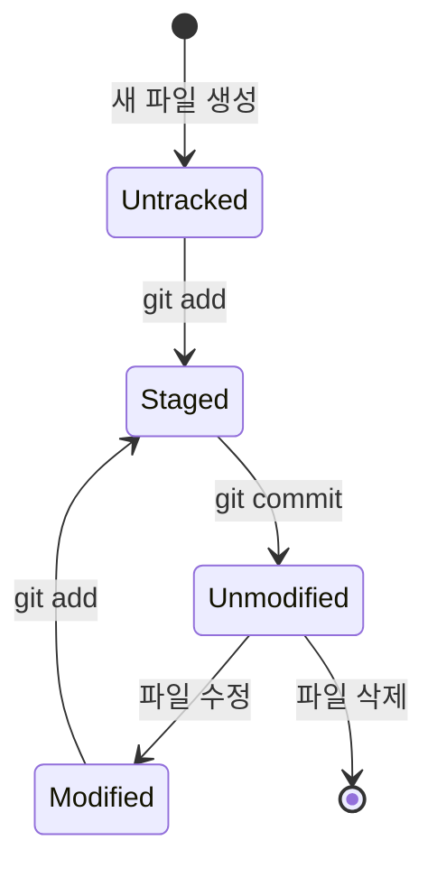

## Git 기본 개념: 버전 관리의 뼈대 세우기

Git 을 단순히 '파일 저장소'로 생각하면 복잡한 명령어에서 길을 잃기 쉽습니다. Git 의 핵심은 **스냅샷(Snapshot)** 과 **세 가지 관리 트리(The Three Trees)** 를 이해하는 데 있습니다.

---

### 💡 Why it matters (Context)

- **안전한 실험**: Working Directory 에서 마음껏 수정해도, Commit 전까지는 언제든 안전하게 되돌릴 수 있습니다.
- **논리적 작업 분리**: Staging Area 를 통해 한 파일 내의 여러 수정 사항 중 원하는 것만 골라 커밋할 수 있습니다.
- **분산 환경 최적화**: 로컬 레포지토리(Repository)에 모든 히스토리가 있어 네트워크 없이도 초고속 작업이 가능합니다.

---

### 🏢 실무 사례 (Online Shopping Analogy)

Git 의 워크플로우를 **온라인 쇼핑**에 비유하면 이해가 매우 빠릅니다.

1. **Working Directory (내 방)**: 물건(코드)을 고르고 상자에 담기 전, 방 여기저기에 늘어놓고 살펴보는 상태입니다.
2. **Staging Area (장바구니)**: 방에 흩어진 물건 중 살 것들만 골라 장바구니에 담습니다. (결제 대기)
3. **Repository (결제 완료)**: '주문하기(Commit)' 버튼을 누르면 그 시점의 상태가 주문 내역에 영구히 기록(Snapshot)됩니다.

---

## 🏗️ Git 의 핵심: The Three Trees

Pro Git 에서는 Git 이 세 가지 서로 다른 트리를 관리한다고 설명합니다. 이 구조를 이해해야 `reset`, `checkout`, `rebase` 를 마스터할 수 있습니다.

| 나무 (Tree) | 역할 | 설명 |
| :--- | :--- | :--- |
| **Working Directory** | **샌드박스 (Sandbox)** | 현재 내 눈에 보이는 실제 파일들. 실제 수정이 일어나는 공간입니다. |
| **Index (Staging Area)** | **커밋 대기소** | 다음에 커밋할 파일들의 상태를 미리 준비해놓는 공간입니다. |
| **HEAD (Repository)** | **마지막 커밋** | 현재 브랜치의 마지막 커밋 스냅샷입니다. 다음 커밋의 부모가 됩니다. |

---

## 🚀 파일의 상태 변화 (File Lifecycle)

파일은 Git 안에서 다음과 같은 상태를 오갑니다.

1. **Untracked**: Git 이 추적하지 않는 새 파일.
2. **Unmodified**: 커밋 이후 수정되지 않은 파일.
3. **Modified**: 수정되었으나 아직 스테이징되지 않은 파일.
4. **Staged**: 커밋을 위해 장바구니에 담긴 파일.

---

## 🚨 흔한 실수 (Common Mistakes)

1. **Staging Area 건너뛰기** ❌
   - 수정만 하고 커밋을 시도하면 "Nothing to commit" 메시지를 보게 됩니다. 반드시 `git add` 로 장바구니에 담아야 합니다. (단, `git commit -a` 옵션으로 생략은 가능하지만 권장되지 않음)
2. **잘못된 '되돌리기' 명령어 사용** ❌
   - `checkout` 과 `reset` 은 Working Directory 를 건드리는 방식이 다릅니다. 원리를 모른 채 `--hard` 옵션을 쓰면 작업 중인 코드를 날릴 수 있습니다.
3. **거대 커밋 (Jumbo Commits)**
   - 수십 개의 서로 다른 기능을 한 번에 커밋하면 나중에 특정 기능만 취소하거나 추적하기가 불가능해집니다. Staging Area 를 활용해 의미 있는 단위로 나누어 커밋하세요.

---

### 📚 연결 문서

- [Git 인턴십](git-internals.md) - 데이터가 실제로 어떻게 저장되는지 원리
- [Reset 완벽 가이드](../02_advanced/reset-demystified.md) - Three Trees 를 이용한 심화 학습
- [커밋 메시지](../01_strategies/commit-messages.md) - 의미 있는 스냅샷을 남기는 법
- [트러블슈팅](../02_advanced/troubleshooting.md) - 실수를 되돌리는 다양한 방법
