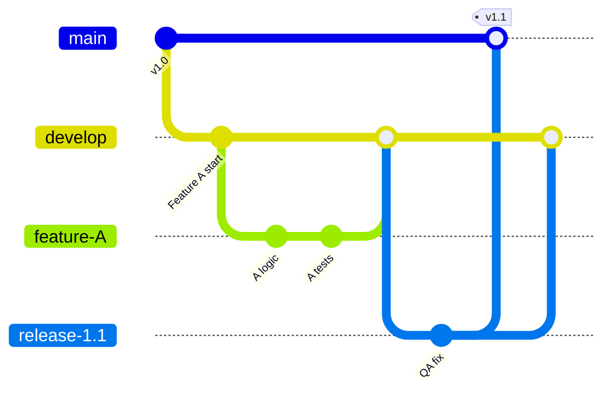

## Git 브랜치 전략: 팀의 생산성을 결정하는 설계도

브랜치 전략은 팀이 코드를 어떻게 관리하고 배포할지에 대한 **약속**입니다. 잘못된 전략은 잦은 충돌과 배포 지연을 야기하지만, 팀에 맞는 전략은 개발 순도를 높여줍니다.

### 💡 Why it matters (Context)

- **안정성**: `main` 브랜치는 항상 배포 가능한 상태를 유지해야 합니다.
- **병렬 개발**: 여러 개발자가 서로의 작업을 방해하지 않고 동시에 기능을 개발할 수 있도록 격리합니다.
- **QA/배포 자동화**: 브랜치 구조에 따라 테스트 및 배포 파이프라인(CI/CD)을 최적화할 수 있습니다.

---

### 🏢 실무 사례 (Selection Guide)

- **Early-stage Startup**: 빠른 배포가 생명입니다. 복잡한 Git Flow 대신 **GitHub Flow**나 **Trunk-based Development**를 통해 하루에도 수십 번 배포하는 구조를 지향합니다.
- **Enterprise / FinTech**: 안정성이 최우선입니다. 엄격한 코드 리뷰와 QA 단계를 보장하는 **Git Flow**를 사용하여 정기 배포 주기를 관리합니다.
- **Open Source Project**: 불특정 다수의 기여가 발생하므로 **Fork & Pull Request** 모델을 기본으로 사용합니다.

---

## 🏗️ 주요 브랜치 모델 분석

### 1. Git Flow (전통적 강자)
5가지 종류의 브랜치를 사용하는 가장 엄격하고 체계적인 모델입니다.

- **Main**: 배포된 프로덕션 코드. 태그로 버전 관리.
- **Develop**: 다음 출시를 위한 메인 개발 라인.
- **Feature**: 기능 개발용 단기 브랜치. 완성 후 `develop`으로 병합.
- **Release**: 배포 전 최종 버그 수정 및 문서화 공간.
- **Hotfix**: 프로덕션 긴급 수정용. `main`에서 따서 수정 후 양쪽(`main`, `develop`) 모두에 반영.

> [!TIP] **언제 쓰나요?**
> 배포 주기가 길고(예: 2주~1개월), 정기적인 릴리스 관리가 필수적인 환경에 권장합니다.

---

### 2. GitHub Flow (단순함의 미학)
`main` 브랜치 하나와 `feature` 브랜치만 사용하는 단순한 구조입니다.

- `main`은 항상 배포 가능한 상태여야 합니다.
- 새 작업은 `main`에서 브랜치를 따서 진행하고, PR(Pull Request)을 통해 리뷰 후 `main`에 병합합니다.
- **병합 직후 즉시 배포**하는 것이 핵심입니다.

> [!TIP] **언제 쓰나요?**
> 지속적 배포(CD)가 구축된 웹 서비스나 소규모 프로젝트에 가장 적합합니다.

---

### 3. GitLab Flow (환경별 최적화)
GitHub Flow가 너무 단순하여 Staging, Production 환경 관리가 어려울 때 사용하는 절충안입니다.

- `main` 브랜치는 '개발 완료' 상태를 의미합니다.
- `pre-production`(Staging), `production` 브랜치를 별도로 두어 상위 환경으로 순차적으로 병합(Upstream first)합니다.

---

## 🚨 흔한 실수 (Common Mistakes)

1. **Long-lived Feature Branches** ❌
   - 브랜치를 너무 오래(1주일 이상) 유지하면 나중에 합칠 때 엄청난 충돌(Merge Hell)을 겪게 됩니다. 작업 단위는 최대한 작게 쪼개어 자주 합치세요.
2. **Main 브랜치에 직접 Push** ❌
   - 코드 리뷰 없이 코드가 반영되어 배포 사고로 이어질 위험이 큽니다. 반드시 보호 브랜치(Protected Branch) 설정을 통해 PR을 강제하세요.
3. **병합 후 브랜치 삭제 누락**
   - 사용이 끝난 원격 브랜치를 지우지 않으면 관리 비효율이 발생합니다. GitHub/GitLab의 "Delete branch after merge" 옵션을 활성화하세요.
4. **의미 없는 브랜치 네이밍**
   - 이름만 봐도 목적을 알 수 있어야 합니다. (예: `feature/login-api` ✅, `work-1` ❌)

---

### 📚 연결 문서
- [[00_fundamentals/basic-concepts|Git 기본 개념]] - 영역과 포인터의 원리
- [[01_strategies/commit-messages|커밋 메시지]] - 브랜치 작업의 기록 방식
- [[02_advanced/troubleshooting|트러블슈팅]] - 잘못된 병합 되돌리기
- [[02_advanced/advanced-workflows|고급 워크플로우]] - Rebase vs Merge 선택 기준