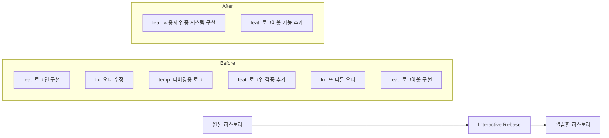
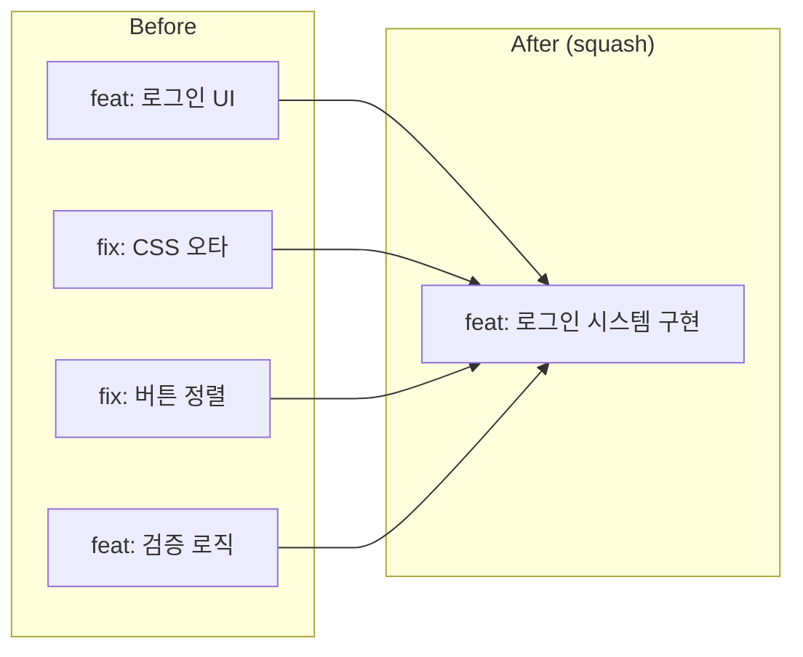
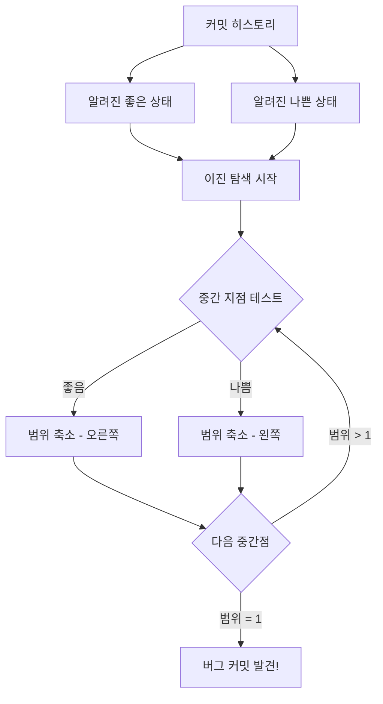
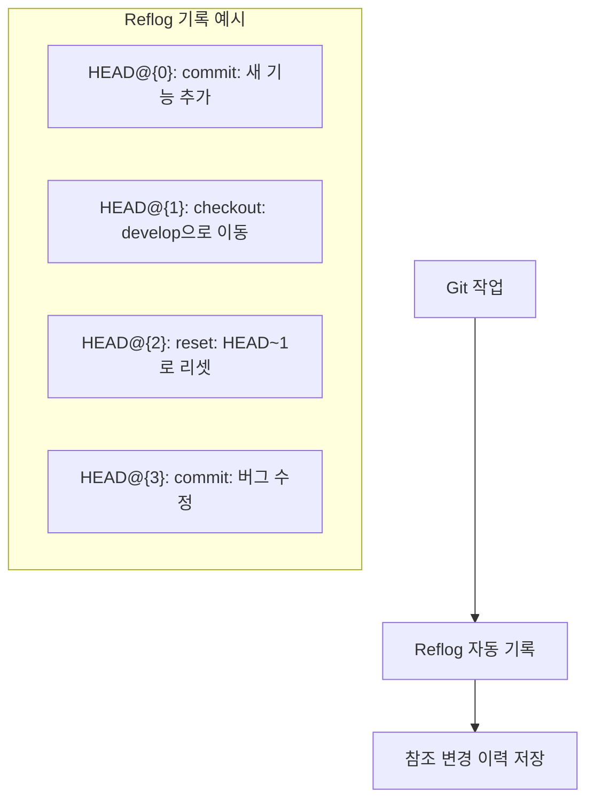
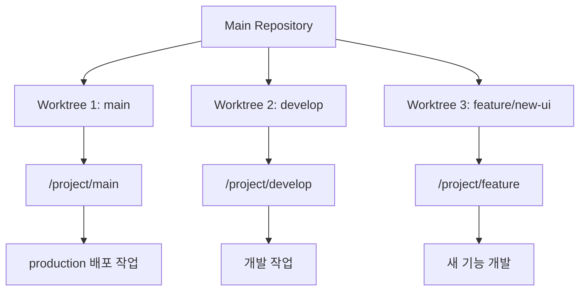

# Git 고급 워크플로우

Git의 고급 기능들을 활용하여 **복잡한 개발 상황을 효율적으로 처리**하는 방법을 다룹니다. 이 문서는 기본적인 Git 사용법을 넘어서 **10년차 엔지니어 수준의 워크플로우**를 익히는 것을 목표로 합니다.

## Interactive Rebase - 히스토리 조각사 되기

### Interactive Rebase란?
Interactive Rebase는 **커밋 히스토리를 원하는 대로 편집**할 수 있는 Git의 가장 강력한 도구 중 하나입니다. 마치 워드프로세서에서 문서를 편집하듯이 커밋들을 수정, 결합, 삭제, 재배열할 수 있습니다.



### Interactive Rebase 작업 유형

#### 1. pick - 커밋 그대로 유지
가장 기본적인 동작으로, 커밋을 변경하지 않고 그대로 유지합니다.

#### 2. reword - 커밋 메시지만 수정
```bash
# 최근 3개 커밋의 메시지를 수정하고 싶을 때
git rebase -i HEAD~3

# 에디터에서
pick a1b2c3d 첫 번째 커밋
reword d4e5f6g 두 번째 커밋    # 이 커밋의 메시지 수정
pick h7i8j9k 세 번째 커밋
```

#### 3. edit - 커밋 내용 수정
커밋의 파일 내용이나 변경사항을 수정해야 할 때 사용합니다.

```bash
git rebase -i HEAD~3

# 에디터에서
pick a1b2c3d 첫 번째 커밋
edit d4e5f6g 두 번째 커밋    # 이 커밋에서 멈춤
pick h7i8j9k 세 번째 커밋
```

Rebase가 지정된 커밋에서 멈추면:
```bash
# 파일 수정
vim file.txt

# 변경사항 추가
git add file.txt

# 또는 새 파일 추가
git add new-file.txt

# rebase 계속 진행
git rebase --continue
```

#### 4. squash - 이전 커밋과 합치기
여러 개의 작은 커밋을 하나의 의미 있는 커밋으로 합칩니다.



```bash
# 실제 squash 예시
pick a1b2c3d feat: 로그인 UI 구현
squash d4e5f6g fix: CSS 오타 수정
squash h7i8j9k fix: 버튼 정렬 수정
pick l0m1n2o feat: 로그아웃 구현
```

#### 5. fixup - squash와 유사하지만 메시지는 버림
squash와 같지만 커밋 메시지를 합치지 않고 첫 번째 커밋의 메시지만 사용합니다.

#### 6. drop - 커밋 삭제
```bash
pick a1b2c3d feat: 유용한 기능
drop d4e5f6g temp: 실수로 만든 커밋
pick h7i8j9k feat: 다른 기능
```

### 실제 Interactive Rebase 시나리오

#### 시나리오 1: 개발 중 생긴 임시 커밋들 정리
```bash
# 현재 상황: 개발하면서 만든 지저분한 커밋들
git log --oneline
# h7i8j9k feat: 사용자 프로필 완성
# d4e5f6g temp: console.log 추가
# a1b2c3d fix: 오타 수정
# x9y8z7w feat: 사용자 프로필 시작
# ...

# 최근 4개 커밋을 정리
git rebase -i HEAD~4

# 에디터에서 작업 계획 수립
pick x9y8z7w feat: 사용자 프로필 시작
fixup a1b2c3d fix: 오타 수정          # 첫 번째 커밋에 합치기
drop d4e5f6g temp: console.log 추가    # 임시 커밋 삭제
squash h7i8j9k feat: 사용자 프로필 완성 # 첫 번째와 합쳐서 새 메시지 작성

# 결과: 깔끔한 하나의 커밋
# "feat: 사용자 프로필 기능 구현"
```

#### 시나리오 2: 커밋 순서 변경
```bash
# 현재 상황: 로직상 순서가 맞지 않는 커밋들
git log --oneline
# c3d4e5f feat: 고급 기능 추가
# b2c3d4e feat: 기본 설정
# a1b2c3d feat: 초기 설정

# 순서 변경
git rebase -i HEAD~3

# 에디터에서 순서 바꾸기
pick a1b2c3d feat: 초기 설정
pick b2c3d4e feat: 기본 설정
pick c3d4e5f feat: 고급 기능 추가
```

### Interactive Rebase 고급 팁

#### 1. 특정 시점부터 rebase
```bash
# 특정 커밋 해시부터
git rebase -i abc1234

# 특정 브랜치와의 분기점부터
git rebase -i main

# 첫 번째 커밋부터 (루트 커밋 포함)
git rebase -i --root
```

#### 2. 중간에 rebase 중단/재시작
```bash
# 문제가 생겼을 때 중단
git rebase --abort

# 충돌 해결 후 계속
git add resolved-files
git rebase --continue

# 현재 커밋 건너뛰기
git rebase --skip
```

#### 3. 자동화된 fixup 커밋 생성
```bash
# 특정 커밋을 수정하는 fixup 커밋 생성
git commit --fixup abc1234

# 자동으로 fixup 커밋들을 정리
git rebase -i --autosquash HEAD~10
```

## Cherry-pick - 필요한 커밋만 골라내기

### Cherry-pick의 개념과 활용
Cherry-pick은 **다른 브랜치의 특정 커밋만 현재 브랜치로 가져오는** 기능입니다.

```mermaid
gitGraph
    commit id: "A"
    commit id: "B"
    branch feature
    checkout feature
    commit id: "C: 버그수정"
    commit id: "D: 새기능"
    commit id: "E: 또다른수정"
    checkout main
    commit id: "F"
    cherry-pick id: "C"
    commit id: "C': 버그수정"
```

### Cherry-pick 사용 시나리오

#### 시나리오 1: 핫픽스를 다른 브랜치에 적용
```bash
# 상황: develop 브랜치에서 버그를 발견하고 수정함
git checkout develop
git commit -m "fix: 중요한 보안 버그 수정"
# 커밋 해시: abc123def

# 이 수정사항을 main 브랜치에도 적용해야 함
git checkout main
git cherry-pick abc123def

# release 브랜치에도 적용
git checkout release/v2.1
git cherry-pick abc123def
```

#### 시나리오 2: 실험적 브랜치에서 성공한 기능만 가져오기
```bash
# 실험 브랜치에서 여러 시도 중 일부만 성공
git checkout experiment/performance
git log --oneline
# def456 feat: 성공한 최적화 기법
# abc123 feat: 실패한 최적화 시도
# 789xyz temp: 디버깅용 코드

# 성공한 커밋만 main으로 가져오기
git checkout main
git cherry-pick def456
```

### 고급 Cherry-pick 기법

#### 1. 여러 커밋을 한 번에 cherry-pick
```bash
# 연속된 커밋 범위
git cherry-pick abc123..def456

# 개별 커밋들
git cherry-pick abc123 def456 ghi789

# 병합 커밋 cherry-pick (부모 지정)
git cherry-pick -m 1 merge-commit-hash
```

#### 2. Cherry-pick 충돌 해결
```bash
git cherry-pick abc123
# CONFLICT가 발생한 경우

# 충돌 해결
vim conflicted-file.txt
git add conflicted-file.txt

# cherry-pick 계속 진행
git cherry-pick --continue

# 또는 중단
git cherry-pick --abort
```

#### 3. Cherry-pick without commit
```bash
# 커밋하지 않고 변경사항만 가져오기
git cherry-pick --no-commit abc123

# 수정 후 직접 커밋
git add modified-files
git commit -m "새로운 커밋 메시지"
```

## Bisect - 버그가 생긴 커밋 찾기

### Binary Search로 버그 추적
Git bisect는 **이진 탐색 알고리즘**을 사용하여 버그가 도입된 정확한 커밋을 찾습니다.



### Bisect 실전 사용법

#### 수동 bisect
```bash
# bisect 시작
git bisect start

# 현재 상태가 나쁜(버그 있음) 상태라고 표시
git bisect bad

# 버그가 없었던 알려진 좋은 커밋 지정
git bisect good v1.0.0

# Git이 중간 커밋으로 이동
# 테스트 후 결과 입력
npm test
git bisect good    # 또는 git bisect bad

# 반복하면서 범위 축소
git bisect bad
git bisect good
...

# 최종적으로 문제 커밋 발견
git bisect reset    # 원래 브랜치로 돌아가기
```

#### 자동 bisect
```bash
# 테스트 스크립트를 사용한 자동 bisect
git bisect start HEAD v1.0.0
git bisect run npm test

# 또는 커스텀 스크립트 사용
git bisect run ./test-script.sh

# test-script.sh 예시
#!/bin/bash
npm test
if [ $? -eq 0 ]; then
    exit 0    # 테스트 성공 (good)
else
    exit 1    # 테스트 실패 (bad)
fi
```

### Bisect 고급 활용

#### 1. 성능 회귀 찾기
```bash
# 성능이 떨어진 커밋 찾기
git bisect start
git bisect bad            # 현재 느림
git bisect good v2.0.0    # 이전에는 빨랐음

# 성능 측정 스크립트 사용
git bisect run ./performance-test.sh

# performance-test.sh
#!/bin/bash
time_taken=$(npm run benchmark | grep "Total time" | cut -d: -f2)
if (( $(echo "$time_taken < 5.0" | bc -l) )); then
    exit 0  # 성능 좋음
else
    exit 1  # 성능 나쁨
fi
```

#### 2. 특정 기능이 사라진 시점 찾기
```bash
#!/bin/bash
# feature-test.sh
# 특정 기능이 작동하는지 확인

if grep -q "특정함수" src/main.js; then
    npm test 2>/dev/null && exit 0
fi
exit 1

git bisect start HEAD v1.5.0
git bisect run ./feature-test.sh
```

## Reflog - Git의 안전망

### Reflog란?
Reflog는 **Git의 모든 참조 변경 이력**을 기록합니다. HEAD가 이동한 모든 기록이 남아있어 실수로 삭제한 커밋이나 브랜치도 복구할 수 있습니다.



### Reflog 활용법

#### 1. 실수로 삭제한 커밋 복구
```bash
# 상황: reset --hard로 커밋을 잃어버림
git reset --hard HEAD~3
# "앗, 중요한 커밋이 사라졌다!"

# reflog로 이력 확인
git reflog
# a1b2c3d HEAD@{0}: reset: moving to HEAD~3
# d4e5f6g HEAD@{1}: commit: 잃어버린 중요한 커밋
# h7i8j9k HEAD@{2}: commit: 또 다른 커밋

# 잃어버린 커밋으로 복구
git reset --hard d4e5f6g
```

#### 2. 삭제된 브랜치 복구
```bash
# 브랜치를 실수로 삭제
git branch -D important-feature
# error: 브랜치가 삭제되었습니다

# reflog에서 해당 브랜치의 마지막 커밋 찾기
git reflog --all | grep important-feature
# abc123 refs/heads/important-feature@{0}: commit: 중요한 기능 완성

# 브랜치 복구
git checkout -b important-feature abc123
```

#### 3. 잘못된 merge 되돌리기
```bash
# 잘못된 병합 실행
git merge wrong-branch

# reflog로 병합 전 상태 찾기
git reflog
# def456 HEAD@{0}: merge wrong-branch: Merge made by recursive
# abc123 HEAD@{1}: checkout: moving to main

# 병합 전으로 되돌리기
git reset --hard abc123
```

### Reflog 고급 활용

#### 1. 특정 브랜치의 reflog 확인
```bash
git reflog show develop
git reflog show feature/login
```

#### 2. 시간 기반 참조
```bash
# 2시간 전 상태
git show HEAD@{2.hours.ago}

# 어제 이 시간
git show HEAD@{yesterday}

# 특정 날짜
git show HEAD@{2024-01-15}
```

#### 3. Reflog 정리 및 관리
```bash
# reflog 만료 설정 확인
git config gc.reflogExpire         # 기본 90일
git config gc.reflogExpireUnreachable  # 기본 30일

# reflog 수동 정리 (주의!)
git reflog expire --expire=30.days --all

# 특정 브랜치만 정리
git reflog delete HEAD@{10}
```

## Worktree - 여러 브랜치 동시 작업

### Worktree의 개념
Git worktree는 **하나의 저장소에서 여러 브랜치를 동시에 체크아웃**할 수 있게 해줍니다. 각각 다른 디렉토리에서 독립적으로 작업할 수 있습니다.



### Worktree 사용법

#### 1. 새 worktree 생성
```bash
# 현재 위치에서 새 브랜치로 worktree 생성
git worktree add ../feature-work feature/payment

# 기존 브랜치로 worktree 생성
git worktree add ../hotfix-work hotfix/security-fix

# 새 브랜치 생성과 동시에 worktree 생성
git worktree add -b experiment/new-idea ../experiment-work
```

#### 2. Worktree 목록 확인
```bash
git worktree list
# /project/main        abc123 [main]
# /project/feature     def456 [feature/payment]
# /project/hotfix      ghi789 [hotfix/security-fix]
```

#### 3. 실제 사용 시나리오
```bash
# 시나리오: 긴급 패치 작업 중 새 기능 개발도 해야 함

# 1. 현재 main에서 핫픽스 작업 중
cd /project/main
git checkout -b hotfix/critical-bug
# ... 핫픽스 작업 중 ...

# 2. 갑자기 새 기능 개발도 해야 함 (브랜치 전환 없이)
git worktree add ../feature-work feature/user-dashboard

# 3. 새 터미널에서 기능 개발
cd ../feature-work
# ... 새 기능 개발 ...

# 4. 첫 번째 터미널에서 핫픽스 계속
cd /project/main
# ... 핫픽스 완료 ...
```

#### 4. Worktree 정리
```bash
# worktree 제거 (디렉토리는 수동으로 삭제해야 함)
git worktree remove ../feature-work

# 또는
rm -rf ../feature-work
git worktree prune    # 정리되지 않은 worktree 참조 제거
```

### Worktree 고급 활용

#### 1. 빌드와 개발을 분리
```bash
# 개발용 worktree
git worktree add ../dev develop

# 프로덕션 빌드용 worktree
git worktree add ../build main

# CI/CD용 worktree
git worktree add ../ci release/v2.1.0

# 각각 다른 환경 설정으로 동시 작업 가능
```

#### 2. 병렬 테스트 환경
```bash
# 여러 버전 동시 테스트
git worktree add ../test-v1 v1.0.0
git worktree add ../test-v2 v2.0.0
git worktree add ../test-latest main

# 각 환경에서 독립적으로 테스트 실행
```

## GitHub Flow
간단하고 실용적인 워크플로우

### 기본 원칙
1. main 브랜치는 항상 배포 가능한 상태
2. 새 기능은 브랜치에서 개발
3. Pull Request로 코드 리뷰
4. 테스트 통과 후 main에 병합
5. main에 병합하면 즉시 배포

```bash
# GitHub Flow 예시
git checkout main
git pull origin main
git checkout -b feature/user-profile
# 개발 작업...
git push -u origin feature/user-profile
# GitHub에서 Pull Request 생성
```

## Rebase vs Merge 전략

### Interactive Rebase
커밋 히스토리를 깔끔하게 정리

```bash
git rebase -i HEAD~3      # 최근 3개 커밋을 인터랙티브하게 수정

# 옵션들:
# pick: 커밋 그대로 사용
# reword: 커밋 메시지 수정
# edit: 커밋 내용 수정
# squash: 이전 커밋과 합치기
# drop: 커밋 삭제
```

### 언제 Rebase를 사용할까?
- 개인 브랜치에서 커밋 히스토리 정리할 때
- 공개되지 않은 로컬 커밋들을 정리할 때
- 깔끔한 히스토리를 원할 때

**주의사항**: 이미 원격에 올라간 커밋은 rebase하지 말기!

### 언제 Merge를 사용할까?
- 협업하는 브랜치에서
- 브랜치의 히스토리를 보존하고 싶을 때
- 안전하게 작업하고 싶을 때

## 고급 명령어들

### Cherry-pick
다른 브랜치의 특정 커밋만 가져오기

```bash
git cherry-pick abc1234   # 특정 커밋을 현재 브랜치에 적용
git cherry-pick abc1234..def5678  # 범위의 커밋들 적용
```

### Bisect
버그가 생긴 커밋을 찾기

```bash
git bisect start         # bisect 시작
git bisect bad          # 현재 커밋에 버그 있음
git bisect good v1.0    # v1.0에는 버그 없었음
# Git이 중간 커밋으로 이동
# 테스트 후 good 또는 bad 입력
git bisect good/bad
# 반복하면 문제 커밋을 찾아줌
git bisect reset        # bisect 종료
```

### Reflog
Git의 모든 행동 기록 보기

```bash
git reflog              # Git 행동 기록 보기
git reset --hard HEAD@{2}  # 2번째 이전 상태로 되돌리기
```

## 협업 시 주의사항

### Commit Convention
팀에서 정한 커밋 메시지 규칙 따르기

```
feat: 새로운 기능 추가
fix: 버그 수정
docs: 문서 변경
style: 코드 포맷팅
refactor: 코드 리팩토링
test: 테스트 코드
chore: 빌드 업무, 패키지 매니저 설정

예시:
feat: 사용자 로그인 기능 추가
fix: 패스워드 유효성 검사 버그 수정
```

### Force Push 주의사항
```bash
# 위험한 명령어 (협업 시 금지!)
git push --force

# 더 안전한 방법
git push --force-with-lease
```

### 대용량 파일 관리
Git LFS (Large File Storage) 사용

```bash
git lfs track "*.psd"    # .psd 파일을 LFS로 관리
git add .gitattributes
git add design.psd
git commit -m "디자인 파일 추가"
```

## 브랜치 보호 규칙
GitHub/GitLab에서 설정 가능한 보호 규칙들:

1. **Required reviews**: Pull Request에 최소 리뷰 개수 설정
2. **Status checks**: CI/CD 통과 필수
3. **Restrict pushes**: 직접 push 금지
4. **Require signed commits**: 서명된 커밋만 허용

## 고급 설정

### Git Hooks
특정 Git 이벤트 시 자동으로 실행되는 스크립트

```bash
# .git/hooks/pre-commit 파일 생성
#!/bin/sh
npm run lint      # 커밋 전 린트 검사
npm test         # 커밋 전 테스트 실행
```

### Git Aliases
자주 사용하는 명령어 단축키 설정

```bash
git config --global alias.co checkout
git config --global alias.br branch
git config --global alias.ci commit
git config --global alias.st status
git config --global alias.unstage 'reset HEAD --'
git config --global alias.last 'log -1 HEAD'
git config --global alias.visual '!gitk'
```

### 유용한 Git 설정
```bash
# 글로벌 사용자 정보
git config --global user.name "Your Name"
git config --global user.email "your.email@example.com"

# 편집기 설정
git config --global core.editor "code --wait"

# 줄바꿈 설정 (Windows)
git config --global core.autocrlf true

# 줄바꿈 설정 (Mac/Linux)
git config --global core.autocrlf input

# 색깔 활성화
git config --global color.ui auto

# Push 기본 설정
git config --global push.default simple
```

## 성능 최적화

### 대용량 저장소 관리
```bash
# 저장소 최적화
git gc --aggressive

# 참조되지 않는 객체 정리
git prune

# 저장소 크기 확인
git count-objects -vH

# 특정 파일의 히스토리에서 완전 삭제
git filter-branch --force --index-filter \
'git rm --cached --ignore-unmatch huge-file.zip' \
--prune-empty --tag-name-filter cat -- --all
```

### Shallow Clone
히스토리를 제한해서 빠르게 클론

```bash
git clone --depth 1 <url>    # 최신 커밋만 가져오기
git clone --depth 5 <url>    # 최근 5개 커밋만 가져오기
```

## 관련 문서
- [[Git 기본 개념]]
- [[Git 명령어 비교]]
- [[Git 트러블슈팅]]
- [[Git 브랜치 전략]]
- [[Git 커밋 메시지 작성법]]