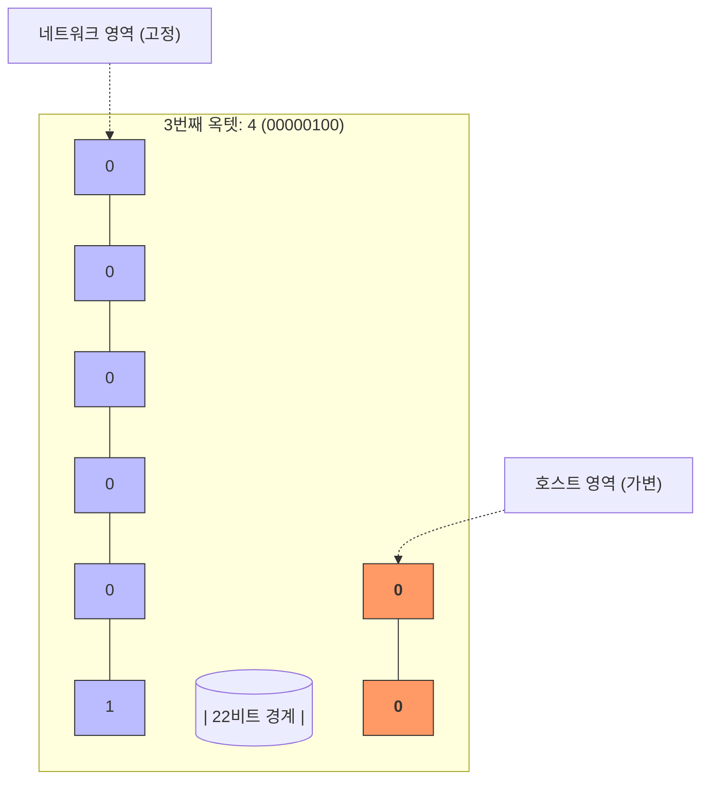

## [4] 네트워크 기본 학습

<details>
<summary>(단답형) 점차 고도화되는 보안 위협에 대처하기 위해 이기종 보안 장비 및 솔루션들을 하나의 시스템으로 통합 연동하고, 위협 탐지 및 대응, 침해 사고 등 보안 운영 업무를 '자동화'함으로써 효율성을 극대화하는 플랫폼 또는 기술의 명칭을 영문 약어로 쓰시오.</summary>
<blockquote>
<strong>정답:</strong> <strong>SOAR (Security Orchestration, Automation and Response)</strong> (보안 오케스트레이션, 자동화 및 대응)<br><br>

※ <strong>SOAR 기술 상세 가이드</strong><br>

1. <strong>SOAR 의 세 가지 핵심 기둥 (3 Pillars)</strong><br>
- <strong>오케스트레이션 (Orchestration)</strong>: 서로 다른 제조사의 보안 장비(방화벽, EDR, 이메일 보안 등)들을 하나의 워크플로우로 묶어 협업하게 만드는 '조율' 기능입니다.<br>
- <strong>자동화 (Automation)</strong>: 사람이 반복적으로 수행하던 단순 작업(IP 평판 조회, 파일 해시 검사 등)을 기계가 자동으로 처리하도록 만드는 기술입니다.<br>
- <strong>대응 (Response)</strong>: 분석된 위협에 대해 즉각적인 차단, 격리 등 후속 조치를 실행하는 기능입니다.<br><br>

1. <strong>핵심 도구: 플레이북 (Playbook)</strong><br>
- **플레이북**은 특정 보안 이벤트 발생 시 대응해야 할 표준 운영 절차(SOP)를 <strong>자동화된 워크플로우</strong>로 코딩해 놓은 것입니다. 예를 들어, "악성 메일 유입 시 -> 첨부파일 분석 -> 악성 확인 시 -> 전사 메일 삭제 -> 유포 IP 차단"과 같은 일련의 과정을 사람이 없어도 즉각 수행하게 만듭니다.<br><br>

1. <strong>SIEM 과 SOAR 의 관계 (탐지 vs 대응)</strong><br>
- <strong>SIEM</strong>: 전방위적인 로그를 모니터링하여 "침입이 발생했다!"라는 <strong>탐지(Detection)</strong>와 알람 발생에 집중합니다.<br>
- <strong>SOAR</strong>: 탐지된 알람을 넘겨받아 "어떻게 처리할 것인가?"라는 대응(Response)의 실행 효율에 집중합니다.<br>
- **결론**: SIEM 이 위협을 찾아내면, SOAR 가 그 위협을 플레이북에 따라 신속하게 처리함으로써 보안 운영(SOC)의 완성도를 높입니다.<br><br>

1. <strong>보안 운영 효율화 (MTTR 단축)</strong><br>
- SOAR 의 궁극적인 목표는 사고 발생 후 해결까지 걸리는 시간인 <strong>MTTR (Mean Time To Respond, 평균 대응 시간)</strong>을 획기적으로 단축하고, 보안 분석가의 피로도(Burnout)를 낮추는 데 있습니다.
</blockquote>
</details>

<details>
<summary>(단답형) IP 관리 시스템에서 발전하여 MAC 주소를 기반으로 네트워크 접근 제어 및 인증 기능을 수행하는 보안 시스템의 명칭을 쓰시오.</summary>
<blockquote>
<strong>정답:</strong> <strong>NAC (Network Access Control)</strong> (네트워크 접근 제어)<br><br>

※ <strong>NAC 기술 상세 가이드</strong><br>

1. <strong>정의 및 발전 배경</strong><br>
- <strong>NAC</strong>는 네트워크에 접속하려는 모든 기기의 신원을 확인하고, 보안 정책(백신 설치, 패치 현황 등)을 준수한 기기만 통과시키는 통합 보안 솔루션입니다. 단순히 내부 IP 자원을 관리하던 <strong>IPMS (IP Management System)</strong>에서 진화하여, 사용자 인증과 단말 무결성 검증 기능을 강화한 형태입니다.<br><br>

1. <strong>계층 Header 와 식별 원리 (L2 중심)</strong><br>
- <strong>계층 식별</strong>: NAC 는 주로 **데이터 링크 계층(Layer 2)** 에서 동작합니다. 단말이 네트워크 스위치나 AP 에 접속하는 즉시 전송되는 **Ethernet Frame 헤더**의 **Source MAC 주소**를 가로채어 해당 단말이 등록된 장비인지 식별합니다.<br>
- <strong>연동</strong>: 더 정밀한 인증을 위해 **802.1X** 프로토콜을 사용하거나, 외부 인증 서버(**RADIUS**, LDAP)와 연동하여 사용자 계정(L7 정보)까지 통합 확인합니다.<br><br>

1. <strong>NAC 의 4 단계 워크플로우 (주요 프로세스)</strong><br>
- <strong>탐지 (Detection)</strong>: 새로운 단말이 네트워크 접속 시 MAC 주소를 기반으로 존재를 파악합니다.<br>
- <strong>인증 (Authentication)</strong>: 등록된 유효 사용자인지 확인합니다 (고유 MAC 정보 또는 ID/PW 인증).<br>
- <strong>검신 (Posture Assessment)</strong>: 접속 단말의 보안 상태(백신 최신화 여부, 필수 SW 설치 등)를 검사하여 '무결성'을 확보합니다.<br>
- <strong>권한 부여/격리 (Authorization / Quarantine)</strong>: 인증에 성공하고 무결성이 확인되면 네트워크 권한을 부여하고, 실패 시 치료(Remediation) 영역으로 격리하여 보안 업데이트를 유도합니다.<br><br>

1. <strong>구현 방식의 차이</strong><br>
- <strong>인라인/아웃오브밴드</strong> 방식으로 나뉘며, 스위치 설정을 바꾸지 않고 비인가 단말을 차단하기 위해 **ARP Redirect (ARP Poisoning)** 기술을 사용하여 비인가자의 통신을 NAC 서버로 가로채는 방식이 많이 사용됩니다. 반면, 보안성이 가장 높은 방식은 스위치 포트 자체를 제어하는 **802.1X(Port-based)** 방식입니다.
</blockquote>
</details>

<details>
<summary>(기출 19회 2번 문제) (단답형) 네트워크 진입 시 단말과 사용자를 인증하고, 단말에 대한 지속적인 보안 취약점 점검(안티바이러스 설치 여부 등)과 통제를 통해 내부 시스템을 보호하는 솔루션은?</summary>
<blockquote>
<strong>정답:</strong> <strong>NAC (Network Access Control)</strong>
</blockquote>
</details>

<details>
<summary>(기출 25회 2번 문제) (단답형) 도청, 해킹 등으로부터 중요 자산의 정보를 보호하기 위해 컴퓨터, 모니터, 키보드 등에서 발생하는 불필요한 전자파 방출을 제어하거나 차단하는 기술의 명칭을 쓰시오.</summary>
<blockquote>
<strong>정답:</strong> <strong>TEMPEST</strong> (전자파 방출 방지 기술)<br><br>

※ <strong>TEMPEST 기술 상세 가이드</strong><br>

1. <strong>용어의 유래와 뉘앙스</strong><br>
- <strong>Tempest</strong>는 본래 '폭풍우'라는 뜻의 일반 명사입니다. 전자 기기에서 수없이 쏟아져 나오는 불필요한 전자파 신호들이 마치 '폭풍우'처럼 사방으로 퍼져나가는 형상을 비유한 것이며, 미국 NSA(국가안보국)에서 이러한 신호를 통한 도청 위험을 정의할 때 사용한 암호명(Codename)에서 유래되었습니다.<br><br>

1. <strong>Full Name (백로님, Backronym)</strong><br>
- <strong>T</strong>elecommunications <strong>E</strong>lectronics <strong>M</strong>aterial <strong>P</strong>rotected from <strong>E</strong>manating <strong>S</strong>purious <strong>T</strong>ransmissions<br>
- (직역: 불필요하게 방출되는 스퓨리어스 전송으로부터 보호되는 통신 전자 장비)<br><br>

1. <strong>기술적 원리 (부채널 공격 방어)</strong><br>
- 모니터, 키보드, CPU 등 모든 전자 기기는 작동 시 고유한 전자파(EMR)를 방출합니다. 공격자는 특수 안테나를 이용해 멀리서도 이 신호를 수집하여 복원함으로써, 화면에 나오는 내용이나 입력 중인 패스워드를 알아낼 수 있습니다(Van Eck Phreaking). TEMPEST 는 이러한 <strong>비의도적인 정보 유출</strong>을 원천적으로 차단하는 기술입니다.<br><br>

1. <strong>주요 대응 방안</strong><br>
- <strong>차폐 (Shielding)</strong>: 장비나 건물을 구리판 등으로 감싸는 <strong>파라데이 케이지(Faraday Cage)</strong> 기법을 사용합니다.<br>
- <strong>필터링 (Filtering)</strong>: 전원선이나 통신선을 통해 유출되는 신호를 제거하기 위해 저주파 필터 등을 설치합니다.<br>
- <strong>차폐대 설정 (Zoning)</strong>: 장비 간의 이격 거리를 충분히 확보하여 신호가 도달하지 못하게 가둡니다.<br>
- <strong>잡음 생성 (Masking)</strong>: 해석이 불가능하도록 인위적인 전자기 노이즈(Noise)를 발생시켜 신호를 섞어버립니다.
</blockquote>
</details>

<details>
<summary>(기출 25회 12번 문제 변형) (단답형) 네트워크 내 산재한 이기종 보안 장비의 방대한 이벤트를 통합 수집·분석하는 기존 시스템에 인공지능(AI)과 빅데이터 분석 기술을 결합하여, 스스로 위협 우선순위를 부여하고 알려지지 않은 위협(Zero-day)까지 실시간으로 탐지하는 차세대 지능형 보안 관제 플랫폼의 명칭을 쓰시오.</summary>
<blockquote>
<strong>정답:</strong> <strong>AI-SIEM</strong> (또는 지능형 보안관제 시스템)<br><br>

※ <strong>SIEM(심)과 AI-SIEM 상세 가이드</strong><br>

1. <strong>SIEM 의 의미 (Full Name)</strong><br>
- <strong>SIEM</strong>: <strong>S</strong>ecurity <strong>I</strong>nformation and <strong>E</strong>vent <strong>M</strong>anagement<br>
- (직역: 보안 정보 및 이벤트 관리 시스템)<br><br>

1. <strong>SIEM 의 탄생 배경 (SIM + SEM)</strong><br>
- <strong>SIM (Security Information Management)</strong>: 방대한 로그 데이터의 수집, 저장 및 보고서 생성 등 사후 분석에 집중하는 기술입니다.<br>
- <strong>SEM (Security Event Management)</strong>: 실시간으로 발생하는 보안 이벤트 간의 <strong>상관관계(Correlation)</strong>를 분석하여 즉각적인 경보를 발생시키는 실시간 관제 기술입니다.<br>
- **SIEM**은 이 두 기술을 통합하여 전사적인 보안 장비(방화벽, IPS, 안티바이러스 등)의 로그를 한곳으로 모아 통합 분석함으로써 가시성을 확보하는 역할을 수행합니다.<br><br>

1. <strong>AI-SIEM 으로의 진화 (차세대 보안 관제)</strong><br>
기존 SIEM 은 관리자가 미리 정의한 **'룰(Rule) 기반'** 탐지 방식을 사용하므로 다음과 같은 한계가 있었습니다.<br>
- **알람 피로도 (Alert Fatigue)**: 너무 많은 오탐(False Positive) 알람이 쏟아져 관리자가 분석에 지치는 현상 발생<br>
- **알려지지 않은 공격 탐지 불가**: 이미 정의된 패턴만 찾기 때문에 제로데이 공격(Zero-day Attack) 대응 한계<br><br>

**AI-SIEM**은 인공지능(심층 학습, 머신러닝)을 결합하여 다음을 가능하게 합니다.<br>

- <strong>행위 분석 (Behavioral Analysis)</strong>: 단순 룰이 아닌, 평소와 다른 '이상 행위'를 스스로 학습하여 탐지합니다.<br>
- <strong>정밀도 향상</strong>: 수많은 이벤트 중 실제 공격 가능성이 높은 위협에 우선순위를 부여하여 오탐을 획기적으로 줄입니다.<br>
- <strong>대응 자동화</strong>: 빅데이터를 통해 상관관계 분석을 초고속으로 수행하여 실시간 침해 사고 조사를 지원합니다.
</blockquote>
</details>

<details>
<summary>(단답형) "아무것도 신뢰하지 말고 항상 검증하라(Never Trust, Always Verify)"는 철학을 바탕으로, 네트워크 경계 내부라도 무조건 신뢰하지 않고 모든 사용자, 기기, 어플리케이션에 대해 지속적인 인증과 최소 권한을 부여하는 현대 보안 아키텍처의 명칭을 쓰시오.</summary>
<blockquote>
<strong>제로 트러스트 (Zero Trust)</strong>
</blockquote>
</details>

<details>
<summary>(서술형) 기존의 안티바이러스(Legacy AV)와 비교하여 <strong>EDR (Endpoint Detection and Response)</strong> 솔루션이 가지는 기술적 차별성과 핵심 기능을 2가지 기술하시오.</summary>
<blockquote>
1. <strong>차별성 (탐지 중심)</strong>: 기존 AV가 알려진 패턴(Signature) 기반 차단에 집중한다면, EDR은 엔드포인트(PC, 서버 등)에서 발생하는 모든 행위 로그를 수집하여 <strong>실시간 모니터링 및 공격 징후를 탐지</strong>하는 데 집중한다.<br>
2. <strong>핵심 기능 (조사 및 대응)</strong>: 침해 사고 발생 시 공격의 유입 경로 및 확산 과정을 추적하는 <strong>가시성(Visibility)</strong>을 제공하며, 격리 및 프로세스 강제 종료 등 <strong>신속한 대응 및 사후 조사</strong> 기능을 수행한다.<br><br>

※ <strong>EDR 상세 가이드</strong><br>

- <strong>탐지 철학의 변화</strong>: "모든 공격을 막을 수 없다"는 전제하에, 침투한 공격자가 시스템 내에서 수행하는 <strong>이상 행위를 끝까지 추적</strong>하는 것에 방점을 둡니다.<br>
- <strong>위협 헌팅 (Threat Hunting)</strong>: 아직 경보가 울리지 않은 잠재적 위협을 보안 분석가가 로그를 통해 능동적으로 찾아내는 작업을 지원합니다.<br><br>

※ <strong>혼동 방지: AI-SIEM vs EDR 비교</strong><br>
둘 다 '로그'와 'AI'를 활용하지만, <strong>감시의 범위와 깊이</strong>에서 결정적인 차이가 있습니다.<br>

- <strong>비유</strong>: **AI-SIEM**은 도시 전체의 CCTV 를 한곳에서 감시하는 '통합 관제 센터'이고, **EDR**은 건물 각 방 안에 설치된 '개별 정밀 모니터'입니다.<br>
<table border="1" style="border-collapse: collapse; width: 100%;">
  <thead>
    <tr>
      <th style="padding: 8px; text-align: left; background-color: #f0f0f0;">구분</th>
      <th style="padding: 8px; text-align: left; background-color: #f0f0f0;">AI-SIEM (통합 보안 관제)</th>
      <th style="padding: 8px; text-align: left; background-color: #f0f0f0;">EDR (엔드포인트 탐지/대응)</th>
    </tr>
  </thead>
  <tbody>
    <tr>
      <td style="padding: 8px;"><strong>감시 범위</strong></td>
      <td style="padding: 8px;"><strong>광대역(Broad)</strong>: 방화벽, IPS, 서버, DB 등 모든 장비의 로그</td>
      <td style="padding: 8px;"><strong>심층적(Deep)</strong>: 특정 PC나 서버(엔드포인트) 내부 OS 행위</td>
    </tr>
    <tr>
      <td style="padding: 8px;"><strong>수집 데이터</strong></td>
      <td style="padding: 8px;">정형화된 <strong>이벤트 로그</strong> (로그 발생 시점 위주)</td>
      <td style="padding: 8px;">프로세스 트리, 메모리 덤프, 파일 I/O 등 <strong>원천 행위 데이터</strong></td>
    </tr>
    <tr>
      <td style="padding: 8px;"><strong>핵심 가치</strong></td>
      <td style="padding: 8px;"><strong>상관관계 분석</strong>: "전체 네트워크 요충지에서 무슨 일이 일어나는가?"</td>
      <td style="padding: 8px;"><strong>정밀 포렌식</strong>: "이 단말 안에서 공격자가 어떻게 권한을 획득했는가?"</td>
    </tr>
    <tr>
      <td style="padding: 8px;"><strong>주요 액션</strong></td>
      <td style="padding: 8px;">보안 정책 권고, 실시간 경보 발생</td>
      <td style="padding: 8px;">프로세스 즉시 종료, PC 네트워크 격리 등 직접 제어</td>
    </tr>
  </tbody>
</table>
</blockquote>
</details>

<details>
<summary>(작업형) 다음 보기에서 설명하는 현대 보안 기술 또는 프레임워크의 명칭을 쓰시오.<br>
<div style="border: 1px solid #777; padding: 10px; margin-top: 10px; border-radius: 5px;">
(A) 공격자의 전술(Tactics), 기술(Techniques), 절차(Procedures)를 체계적으로 분류하고 데이터베이스화하여 실제 침해 사고 대응 및 위협 헌팅에 활용되는 전 세계 공통의 지식 베이스: <strong>( )</strong><br>
(B) 네트워크 보안 장비(FW, CASB, ZTNA)와 네트워크 서비스(SD-WAN)를 클라우드 기반의 단일 서비스 모델로 통합하여, 장소에 구애받지 않고 안전한 접근을 보장하는 보안 모델: <strong>( )</strong>
</div></summary>
<blockquote>
(A) <strong>MITRE ATT&CK</strong> (마이프 어택 프레임워크)<br>
(B) <strong>SASE</strong> (Secure Access Service Edge)<br><br>

※ <strong>주요 현대 보안 프레임워크 상세 가이드</strong><br>

1. <strong>MITRE ATT&CK (TTP 기반 지식 베이스)</strong><br>
- <strong>T</strong>actics(전술: 공격 목적), <strong>T</strong>echniques(기술: 목적 달성 방법), <strong>P</strong>rocedures(절차: 실제 실행 단계)를 매트릭스 형태로 정리한 것입니다. 단순 악성코드(CVE) 리스트가 아닌 **공격자의 '수법'** 에 집중하여 방어 전략을 수립하게 돕습니다.<br><br>

1. <strong>SASE (네트워크 + 보안 통합 서비스)</strong><br>
- <strong>배경</strong>: 클라우드와 재택 근무 확산으로 인해 "사무실 경계 보안"이 무너지면서 탄생한 모델입니다.<br>
- <strong>구성 요소</strong>: <br>
  - <strong>SD-WAN</strong>: 효율적인 네트워크 경로 제어 <br>
  - <strong>ZTNA (Zero Trust Network Access)</strong>: 지속적 인증 기반 접근 제어 <br>
  - <strong>CASB (Cloud Access Security Broker)</strong>: 안전한 SaaS 이용 보장 <br>
  - <strong>SWG (Secure Web Gateway)</strong>: 웹 취약점 및 악성 사이트 차단
</blockquote>
</details>

<details>
<summary>(서술형) <strong>XDR (Extended Detection and Response)</strong>이 EDR이나 SIEM과 비교하여 가지는 강점을 '통합 분석' 관점에서 서술하시오.</summary>
<blockquote>
XDR은 단일 엔드포인트(EDR)를 넘어 네트워크, 클라우드, 이메일 등 **다양한 보안 계층의 데이터를 통합하여 분석** 한다. SIEM이 방대한 로그를 단순 수집하고 규칙 기반으로 분석한다면, XDR은 각 계층의 정밀한 탐지 데이터를 상관관계 분석(Correlation)하고 인공지능을 통해 공격의 전체 맥락을 자동으로 연결함으로써 **탐지의 정확도를 높이고 대응 시간을 획기적으로 단축** 시킨다.<br><br>

※ <strong>XDR 의 핵심 가치: 데이터 사일로(Silo) 제거</strong><br>

- <strong>데이터 사일로 현상</strong>: 각 보안 장비(방화벽, 백신, 이메일 솔루션 등)가 자기 영역만 보고 따로 노는 현상을 말합니다. XDR 은 이 장벽을 허물어 단편적인 이벤트들을 하나의 <strong>공격 타임라인(Kill Chain)</strong>으로 엮어냄으로써 보안 가시성을 극대화합니다.
</blockquote>
</details>

### 프로토콜

<details>
<summary>(단답형) 프로토콜을 구성하는 3대 요소 중, 데이터의 포맷(Format)이나 부호화(Encoding) 등 송수신 데이터의 형식과 구조를 정의하는 요소를 쓰시오.</summary>
<blockquote>
<strong>구문 (Syntax)</strong>
</blockquote>
</details>

<details>
<summary>(단답형) 프로토콜의 3대 요소 중 비트 스트림의 각 부분이 나타내는 구체적인 약속, 상호 조정을 위한 전송 제어 정보, 그리고 오류 발생 시 처리 규정 등을 정의하는 요소를 쓰시오.</summary>
<blockquote>
<strong>의미 (Semantics)</strong>
</blockquote>
</details>

<details>
<summary>(서술형) 프로토콜의 3대 요소 중 '타이밍(Timing)'이 담당하는 구체적인 역할 2가지를 기술하시오.</summary>
<blockquote>
1. <strong>속도 조절 (Speed Matching)</strong>: 데이터를 얼마나 빨리 보낼 것인지 정의한다.<br>
2. <strong>순서 제어 (Order)</strong>: 데이터의 송수신 순서 및 전송 주기 등을 동기화한다.
</blockquote>
</details>

<details>
<summary>(작업형) 다음 보기의 각 사례가 프로토콜의 3대 요소(구문, 의미, 타이밍) 중 어느 기능에 해당하는지 연결하시오.<br>
<div style="border: 1px solid #777; padding: 10px; margin-top: 10px; border-radius: 5px;">
(A) 패킷 헤더의 9번째부터 16번째 비트까지는 '목적지 주소' 영역으로 정의: <strong>( )</strong><br>
(B) 전송된 비트 패턴이 '0101'이면 데이터 전송의 '시작'을 의미하는 것으로 약속: <strong>( )</strong><br>
(C) 수신 측의 버퍼가 가득 찼으므로 송신 측에 일시적인 전송 중단을 요청: <strong>( )</strong>
</div></summary>
<blockquote>
(A) <strong>구문 (Syntax)</strong> (데이터의 물리적 구조 및 형식 정의)<br>
(B) <strong>의미 (Semantics)</strong> (특정 비트 패턴에 대한 제어 정보 및 의미 부여)<br>
(C) <strong>타이밍 (Timing)</strong> (속도 조절 및 동기화 제어)
</blockquote>
</details>

<details>
<summary>(서술형) 프로토콜의 3대 요소(구문, 의미, 타이밍)의 핵심 정의를 각각 한 문장으로 기술하시오.</summary>
<blockquote>
※ <strong>프로토콜 3요소 핵심 요약</strong><br>
1. <strong>구문 (Syntax)</strong>: 데이터의 형식, 구조, 부호화 방식을 정의한다.<br>
2. <strong>의미 (Semantics)</strong>: 원활한 소통을 위한 제어 정보와 오류 처리를 위한 의미를 부여한다.<br>
3. <strong>타이밍 (Timing)</strong>: 송수신 기간의 통신 속도를 맞추고 데이터 전송 순서를 동기화한다.
</blockquote>
</details>

### OSI 7 Layer

<details>
<summary>(단답형) 네트워크에 연결된 모든 물리적·논리적 장치를 통칭하여 <strong>( A )</strong>라 하며, 그 중에서 PC나 서버와 같이 네트워크 주소를 가지고 연산 능력을 갖춘 종단 노드를 일컬어 <strong>( B )</strong>라 부른다.</summary>
<blockquote>
(A) <strong>노드 (Node)</strong><br>
(B) <strong>호스트 (Host)</strong>
</blockquote>
</details>

<details>
<summary>(서술형) OSI 7계층 참조 모델이 '분할 정복(Divide and Conquer)' 아키텍처를 채택함으로써 얻을 수 있는 설계 및 관리상의 이점 2가지를 기술하시오.</summary>
<blockquote>
1. <strong>복잡성 감소</strong>: 큰 네트워크 시스템을 독립적인 계층으로 세분화하여 설계 및 구현을 단순화하고 유지보수를 용이하게 한다.<br>
2. <strong>제조사 간 독립성 확보</strong>: 상위 및 하위 계층 간의 인터페이스 표준만 충족하면, 각 제조사(Vendor)들이 해당 계층의 기술을 독자적으로 개발하고 발전시킬 수 있어 상호 호환성을 유지하면서도 기술 혁신이 가능하다.
</blockquote>
</details>

<details>
<summary>(단답형) OSI 7계층 중 2계층(데이터 링크 계층)에서 사용되며, 6바이트로 구성되어 제조사 코드(OUI)와 고유 번호로 이루어진 물리적 주소의 명칭을 쓰시오.</summary>
<blockquote>
MAC 주소 (Media Access Control Address)
</blockquote>
</details>

<details>
<summary>(서술형) OSI 7계층 모델에서 2계층(데이터 링크 계층)이 데이터 전송의 신뢰성을 보장하기 위해 수행하는 주요 기능 3가지를 기술하시오.</summary>
<blockquote>
1. <strong>회선 제어 (Line Control)</strong>: 전송 링크에 대한 <strong>제어 규범 (Line Discipline)</strong>을 확립하여 전송 권한 및 순서를 조정함<br>
2. <strong>흐름 제어 (Flow Control)</strong>: 송신 측과 수신 측의 처리 속도 차이로 인한 데이터 범람을 방지함<br>
3. <strong>오류 제어 (Error Control)</strong>: 전송 도중 발생한 부호 오류를 검출하고 정정하여 신뢰성을 확보함<br><br>

※ <strong>회선 제어(Line Control) 상세 가이드</strong><br>
교재의 정의에 따르면, 회선 제어는 다음 환경 요소에 따라 결정되는 **전송 링크에 대한 제어 규범(Line Discipline)**을 의미합니다.<br>

- <strong>결정 요소</strong>: <br>
  - <strong>회선 구성 방식 (Line Configuration)</strong>: 점 - 대 - 점(Point-to-Point) 또는 다중점(Multi-point)<br>
  - <strong>전송 방식 (Transmission Mode)</strong>: 단방향(Simplex), 반이중(Half-duplex), 전이중(Full-duplex)<br><br>
- <strong>주요 제어 방식 (Line Discipline) 실례</strong>:<br>
  - <strong>ENQ/ACK 방식</strong>: 점 - 대 - 점 환경에서 송신 측이 전송 준비를 묻고(ENQ), 수신 측이 수락(ACK)하면 데이터를 보내는 방식<br>
  - <strong>폴링/셀렉션 (Poll/Select) 방식</strong>: 다중점 환경에서 주 스테이션(Master)이 종속 스테이션(Slave)에게 보낼 데이터 유무를 묻거나(Poll), 데이터를 받을 준비가 되었는지 선택(Select)하는 방식
</blockquote>
</details>

<details>
<summary>(단답형) OSI 7계층 중 2계층(데이터 링크 계층)을 다시 세분화한 두 개의 부계층(Sublayer) 명칭을 쓰시오.</summary>
<blockquote>
(A) <strong>LLC (Logical Link Control)</strong>: 상위 계층과의 인터페이스 및 흐름/오류 제어 담당<br>
(B) <strong>MAC (Media Access Control)</strong>: 물리적 매체에 대한 다중 접근 제어 담당
</blockquote>
</details>

<details>
<summary>(단답형) 네트워크 카드(NIC)에 설정되는 동작 모드 중 하나로, 자신의 MAC 주소와 일치하지 않는 패킷이라도 하드웨어 필터링을 거치지 않고 모두 수신하여 상위 계층으로 전달하는 설정 방식의 명칭을 영문으로 쓰시오.</summary>
<blockquote>
<strong>프라미스큐어스 모드 (Promiscuous Mode)</strong> (혼재 모드)
</blockquote>
</details>

<details>
<summary>(서술형) 와이어샤크(Wireshark)와 같은 패킷 분석 도구를 사용하여 동일 네트워크 세그먼트 전반의 트래픽을 가로채려 할 때(Sniffing), 반드시 <strong>프라미스큐어스 모드</strong>가 활성화되어야 하는 기술적 이유를 기술하시오.</summary>
<blockquote>
일반적인 네트워크 카드는 성능 최적화를 위해 패킷 헤더의 **수신지 MAC 주소** 가 자신의 주소와 일치하거나 브로드캐스트/멀티캐스트인 경우에만 수신하고 나머지는 하드웨어 수준에서 버린다(Discard). 따라서 분석 목적으로 **다른 호스트 간의 유니캐스트 패킷** 까지 모두 수집하기 위해서는, 이 하드웨어 필터링 기능을 해제하고 모든 프레임을 통과시키도록 설정해야 하기 때문이다.
</blockquote>
</details>

<details>
<summary>(단답형) OSI 7계층 중 데이터의 인코딩(ASCII, EBCDIC 등), 암호화, 압축 등을 담당하여 응용 계층 간의 데이터 표현 방식 차이를 해결하는 계층의 명칭을 쓰시오.</summary>
<blockquote>
표현 계층 (Presentation Layer, Layer 6)
</blockquote>
</details>

<details>
<summary>(작업형) OSI 7계층의 각 계층별 데이터 전송 단위(PDU)를 알맞게 연결하시오.<br>
<div style="border: 1px solid #777; padding: 10px; margin-top: 10px; border-radius: 5px;">
(1) 물리 계층 (Physical Layer): <strong>( A )</strong><br>
(2) 데이터 링크 계층 (Data Link Layer): <strong>( B )</strong><br>
(3) 네트워크 계층 (Network Layer): <strong>( C )</strong><br>
(4) 전송 계층 (Transport Layer): <strong>( D )</strong><br>
(5) 세션/표현/응용 계층: <strong>( E )</strong>
</div>
</summary>
<blockquote>
(A) 비트 (Bit)<br>
(B) 프레임 (Frame)<br>
(C) 패킷 (Packet)<br>
(D) 세그먼트 (Segment)<br>
(E) 데이터 (Data) (또는 Message)
</blockquote>
</details>

<details>
<summary>(단답형) 다음 보안 프로토콜들이 주로 동작하는 OSI 참조 모델의 계층을 각각 쓰시오.<br>
<div style="border: 1px solid #777; padding: 10px; margin-top: 10px; border-radius: 5px;">
(A) <code>L2TP</code>, <code>PPTP</code><br>
(B) <code>IPsec</code><br>
(C) <code>SSL/TLS</code>, <code>SSH</code></div></summary>
<blockquote>
(A) 데이터 링크 계층 (Layer 2)<br>
(B) 네트워크 계층 (Layer 3)<br>
(C) 전송 계층 (Layer 4) (※ 보안 소켓 계층으로 전송 계층 위에서 동작)
</blockquote>
</details>

<details>
<summary>(기출 25회 3번 문제) (서술형) 네트워크 계층(Layer 3)의 보안 프로토콜인 IPsec(IP Security)이 제공하는 주요 보안 기능 3가지를 기술하시오.</summary>
<blockquote>
1. <strong>기밀성(Confidentiality)</strong>: 암호화를 통해 데이터 유출을 방지한다.<br>
2. <strong>무결성(Integrity)</strong>: 데이터가 전송 도중 변조되지 않았음을 보장한다.<br>
3. <strong>인증(Authentication)</strong>: 데이터의 출처 및 송신자의 신원을 확인한다. (또는 재전송 공격 방지)
</blockquote>
</details>

### OSI 모델 데이터 교환 방식

<details>
<summary>(단답형) 송신 측에서 상위 계층의 데이터를 하위 계층으로 보낼 때, 각 계층의 프로토콜이 자신의 기능을 수행하기 위해 필요한 제어 정보(Header)를 추가하여 전송 메시지를 완성하는 과정을 무엇이라 하는가?</summary>
<blockquote>
<strong>캡슐화 (Encapsulation)</strong>
</blockquote>
</details>

<details>
<summary>(단답형) 수신 측에서 상위 계층으로 데이터를 전달할 때, 해당 계층의 헤더 정보를 확인한 후 이를 제거하고 상위 계층으로 데이터를 올려보내는 과정을 무엇이라 하는가?</summary>
<blockquote>
<strong>역캡슐화 (Decapsulation)</strong>
</blockquote>
</details>

<details>
<summary>(단답형) OSI 모델의 데이터 교환 방식 중 하나로, 송신 측의 특정 계층에서 여러 상위 계층 프로토콜로부터 전달받은 다수의 데이터 스트림을 하나의 하위 계층 프로토콜 전송 서비스로 통합하여 전달하는 기법을 무엇이라 하는가?</summary>
<blockquote>
<strong>다중화 (Multiplexing)</strong>
</blockquote>
</details>

<details>
<summary>(단답형) 수신 측의 특정 계층 프로토콜이 여러 상위 계층 프로토콜 중 데이터가 도달해야 할 정확한 대상을 식별하여 전달하기 위해, 헤더에 포함된 '프로토콜 식별자'를 이용하는 기법을 무엇이라 하는가?</summary>
<blockquote>
<strong>역다중화 (Demultiplexing)</strong>
</blockquote>
</details>

<details>
<summary>(서술형) TCP/IP 계층 구조에서 역다중화(Demultiplexing)를 수행할 때, 각 계층의 헤더에서 상위 프로토콜을 식별하기 위해 참조하는 '식별 필드'와 주요 대표값들을 기술하시오.</summary>
<blockquote>
수신 측은 아래 필드 값들을 확인하여 데이터를 전달할 최적의 차상위 프로토콜을 결정합니다.<br><br>
1. <strong>네트워크 인터페이스 계층 (L2) → 인터넷 계층</strong>: 이더넷 프레임의 <strong>Type (EtherType)</strong> 필드<br>
   - <code>0x0800</code>: IPv4 / <code>0x0806</code>: ARP / <code>0x86DD</code>: IPv6<br>
2. <strong>인터넷 계층 (L3) → 전송 계층</strong>: IP 헤더의 <strong>Protocol</strong> 필드<br>
   - <code>1</code>: ICMP / <code>6</code>: TCP / <code>17</code>: UDP / <code>89</code>: OSPF<br>
3. <strong>전송 계층 (L4) → 응용 계층</strong>: TCP/UDP 헤더의 <strong>Destination Port</strong> 필드<br>
   - <code>22</code>: SSH / <code>53</code>: DNS / <code>80</code>: HTTP / <code>443</code>: HTTPS
</blockquote>
</details>

<details>
<summary>(단답형) 수신된 IP 패킷을 역캡슐화하여 전송 계층으로 올릴 때, IP 헤더 내의 특정 필드 값을 보고 이 페이로드가 TCP인지 UDP인지를 판단한다. 이때 참조하는 필드의 명칭과 그 크기를 쓰시오.</summary>
<blockquote>
명칭: <strong>프로토콜 (Protocol)</strong> 필드<br>
크기: <strong>8비트</strong>
</blockquote>
</details>

<details>
<summary>(작업형) 다음 데이터 패킷의 헤더 정보와 식별되는 상위 프로토콜 내용을 바르게 연결하시오.<br>
<div style="border: 1px solid #777; padding: 10px; margin-top: 10px; border-radius: 5px;">
(A) Ethernet Type: <code>0x0800</code> -> <strong>( )</strong><br>
(B) IP Protocol Number: <code>1</code> -> <strong>( )</strong><br>
(C) TCP Destination Port: <code>443</code> -> <strong>( )</strong>
</div></summary>
<blockquote>
(A) <strong>IPv4</strong><br>
(B) <strong>ICMP</strong><br>
(C) <strong>HTTPS</strong>
</blockquote>
</details>

<details>
<summary>(서술형) OSI 7계층 중 전송 계층(Layer 4)의 통신 범위를 데이터 링크 계층(Layer 2)과 비교하여 '목적지 식별' 관점에서 설명하시오.</summary>
<blockquote>
<strong>데이터 링크 계층</strong>은 인접한 인접한 두 장치 간의 전송인 <strong>Node-to-Node Delivery</strong>를 담당하지만, <strong>전송 계층</strong>은 데이터의 최종 출발지부터 최종 목적지 세그먼트까지의 양 끝단 전송인 <strong>End-to-End Delivery</strong>를 담당하며, 구체적으로는 각 호스트 내에서 동작하는 프로세스 간의 통신용 주소(Port)를 식별한다.
</blockquote>
</details>

<details>
<summary>(작업형) 다음 TCP <strong>연결 설정(3-way)</strong> 및 <strong>연결 종료(4-way)</strong> 과정의 플래그 비트와 순서 번호를 채우시오.(플래그 비트 예: 010001, 순서: URG, ACK, PSH, RST, SYN, FIN 순)<br>
<div style="border: 1px solid #777; padding: 10px; margin-top: 10px; border-radius: 5px;">
(1) 서버 응답(SYN+ACK): TCP Flag [ <strong>( A )</strong> ], SEQ( <strong>( B )</strong> ), ACK( X+1 )<br>
(2) 클라이언트 종료 요청(FIN+ACK): TCP Flag [ <strong>( C )</strong> ], SEQ( 1234 ), ACK( 6789 )<br>
(3) 서버 확인 응답(ACK): TCP Flag [ <strong>( D )</strong> ], SEQ( 6789 ), ACK( 1235 )
</div></summary>
<blockquote>
<strong>정답:</strong> (A) 010010 (SYN+ACK) (B) Y (서버의 초기 순서 번호) (C) 010001 (ACK+FIN) (D) 010000 (ACK)
</blockquote>
</details>

<details>
<summary>(서술형) 흐름 제어 방식 중 '정지-대기(Stop-and-Wait)' 방식과 '슬라이딩 윈도우(Sliding Window)' 방식의 차이점을 효율성 관점에서 설명하시오.</summary>
<blockquote>
<strong>정지-대기</strong>: 프레임 하나를 보낼 때마다 ACK를 기다려야 하므로 전송 효율이 낮다.<br>
<strong>슬라이딩 윈도우</strong>: 수신 측의 응답 없이도 윈도우 크기만큼의 프레임을 연속해서 보낼 수 있어 대역폭 활용도가 높고 전송 효율이 우수하다.
</blockquote>
</details>

<details>
<summary>(단답형) 데이터 전송 중 발생한 오류를 해결하기 위해 수신 측에서 오류 발생 사실을 알리고 재전송을 요청하는 방식을 무엇이라 하는지 쓰시오.</summary>
<blockquote>
ARQ (Automatic Repeat Request)
</blockquote>
</details>

<details>
<summary>(기출 23회 14번 문제) (서술형) TCP 헤더에 포함되어 있는 6비트의 플래그(Flag) 중 다음의 역할과 의미를 기술하시오.
<div style="border: 1px solid #777; padding: 10px; margin-top: 10px; border-radius: 5px;">
(A) SYN<br>
(B) ACK<br>
(C) FIN<br>
(D) RST
</div>
</summary>
<blockquote>
(A) <strong>SYN</strong>: 전송 주체 간 세션을 수립할 때 사용하는 동기화 신호로, 순서 번호(Sequence Number)를 동기화한다.<br>
(B) <strong>ACK</strong>: 상대방으로부터 패킷을 정상적으로 수신했음을 알리는 응답 신호이다.<br>
(C) <strong>FIN</strong>: 데이터 전송이 완료되어 정상적으로 통신 세션을 종료할 때 사용한다.<br>
(D) <strong>RST</strong>: 연결 상의 문제가 발생하거나 비정상적인 세션을 강제로 중단할 때 사용한다.
</blockquote>
</details>

<details>
<summary>(기출 23회 16번 문제) (서술형) HTTP GET Flooding 공격 중 하나인 <strong>'HTTP Get Flooding with Cache Control'</strong>(또는 C&C 공격)은 캐시 서버를 우회하여 직접 웹 서버에 부하를 유도한다. 이때 패킷 헤더의 <code>Cache-Control</code> 필드에 설정하는 옵션 명칭과 실제 공격 원리를 기술하시오.</summary>
<blockquote>
<strong>옵션 명칭</strong>: <code>Cache-Control: max-age=0</code> (또는 no-cache)<br>
<strong>공격 원리</strong>: 캐시 서버(프록시)가 저장된 데이터를 사용하지 않고 매번 원본 웹 서버에 새로운 데이터를 요청하도록 강제함으로써, 대량의 요청이 직접 웹 서버로 전달되어 자원을 고갈시킨다.
</blockquote>
</details>

### 이더넷(Ethernet) 및 스위칭(Switching) 보안

<details>
<summary>(서술형) 더미 허브(Dummy Hub) 환경에서 공격자가 스니퍼(Sniffer)를 통해 다른 호스트의 패킷을 엿볼 수 있는 이유를 장비의 물리 계층(Layer 1) 동작 특성과 관련하여 설명하시오.</summary>
<blockquote>
더미 허브는 수신한 전기적 신호를 목적지 주소 식별 없이 모든 포트로 단순히 복제하여 전달(Flooding)하기 때문에, 매체에 흐르는 모든 패킷이 물리적으로 공격자의 호스트에도 도달하게 되어 스니핑이 용이해진다.
</blockquote>
</details>

<details>
<summary>(서술형) 네트워크 카드(NIC)의 '무차별 모드(Promiscuous Mode)' 설정이 스니핑 공격에서 필수적으로 요구되는 하드웨어적 이유를 기술하시오.</summary>
<blockquote>
일반적인 NIC는 자신의 MAC 주소를 목적지로 하지 않는 패킷을 수신하면 하드웨어 수준에서 즉시 폐기(Discard)한다. 무차별 모드를 활성화해야만 목적지 주소와 상관없이 매체 상의 모든 패킷을 가로채서 상위 분석 소프트웨어(Wireshark 등)로 전달할 수 있다.
</blockquote>
</details>

<details>
<summary>(서술형) 장비 장애 발생 시 보안 정책인 'Fail Open'과 'Fail Close'의 개념을 가용성과 보안성 관점에서 비교하여 기술하시오.</summary>
<blockquote>
- <strong>Fail Open (장애 안전)</strong>: 시스템 장애 시 모든 트래픽이나 접근을 허용하는 조치로, <strong>가용성</strong>을 최우선으로 하나 보안성이 약화된다 (예: 스위치 장애 시 허브로 동작).<br>
- <strong>Fail Close (장애 보안)</strong>: 장애 발생 시 모든 통신을 차단하는 조치로, 가용성은 떨어지지만 <strong>보안성</strong>을 일정하게 유지하거나 강화할 수 있다.
</blockquote>
</details>

<details>
<summary>(작업형) 다음 Wireshark 캡처 옵션 중 스니핑을 위해 반드시 체크해야 할 옵션의 명칭과 그 목적을 쓰시오.<br>
[ ] <code>Use promiscuous mode on all interfaces</code></summary>
<blockquote>
- <strong>명칭</strong>: <strong>무차별 모드 (Promiscuous Mode)</strong><br>
- <strong>목적</strong>: 자신의 MAC 주소가 아닌 패킷도 폐기하지 않고 모두 수신하여 전체 네트워크 트래픽을 모니터링하기 위함이다.
</blockquote>
</details>

<details>
<summary>[기출 20회 12번 문제] (서술형) L2 스위칭 허브의 주요 기능과 5가지 동작 원리(Learning, Forwarding, Filtering, Flooding, Aging)에 대해 설명하시오.</summary>
<blockquote>
1. <strong>주요 기능</strong>: 패킷의 목적지 주소(MAC)를 기반으로 해당 포트에만 전송하여 대역폭 효율을 높이고 충돌을 방지함<br>
2. <strong>동작 원리</strong><br>
- <strong>Learning</strong>: 유입되는 프레임의 출발지 MAC 주소를 보고 해당 포트 번호를 MAC 주소 테이블에 저장함<br>
- <strong>Forwarding</strong>: 목적지 MAC 주소가 테이블에 있는 경우, 해당 포트로만 프레임을 전달함<br>
- <strong>Filtering</strong>: 목적지 포트 이외의 다른 포트로는 전달되지 않도록 제어함<br>
- <strong>Flooding</strong>: 목적지 MAC 주소를 모를 경우, 수신 포트를 제외한 모든 포트로 뿌림<br>
- <strong>Aging</strong>: 일정 시간 사용되지 않은 MAC 주소는 테이블에서 삭제하여 최신 상태를 유지함
</blockquote>
</details>

<details>
<summary>(단답형) 다음 (A), (B)에 들어갈 알맞은 매체 접근 제어 기술의 명칭을 쓰시오.<br>
<div style="border: 1px solid #777; padding: 10px; margin-top: 10px; border-radius: 5px;">
(A) 유선 이더넷(IEEE 802.3) 표준에서 사용하며, 데이터 전송 중 충돌이 탐지(Detection)되면 즉시 전송을 중단하고 재전송을 시도하는 방식<br>
(B) 무선랜(IEEE 802.11) 표준에서 사용하며, 충돌이 발생하지 않도록 사전에 회피(Avoidance)하기 위해 RTS/CTS 프레임을 사용하는 방식
</div>
</summary>
<blockquote>
(A) <strong>CSMA/CD</strong> (Collision Detection)<br>
(B) <strong>CSMA/CA</strong> (Collision Avoidance)<br><br>

※ <strong>매체 접근 제어 기술 상세 가이드</strong><br>

1. <strong>CSMA/CD (유선): "들으면서 말하기"</strong><br>
- <strong>탐지(Detection)</strong>: 유선 매체는 전기적 신호 변화를 통해 전송 중 실시간으로 충돌을 감지할 수 있습니다.<br>
- <strong>동작</strong>: 충돌 발생 시 즉시 전송을 멈추고 **잼 신호(Jam Signal)** 를 송출하여 다른 노드에 충돌을 알린 후, **백오프(Backoff)** 시간만큼 기다렸다가 재전송합니다.<br><br>

1. <strong>CSMA/CA (무선): "말하기 전 허락받기"</strong><br>
- <strong>배경</strong>: 무선 환경은 전파 감쇄가 심하고 자신의 송신 신호 때문에 충돌 여부를 실시간으로 알기 어려운 **반이중(Half-duplex)** 구조이므로, 충돌을 <strong>회피(Avoidance)</strong>하는 방식이 필수적입니다.<br><br>

1. <strong>RTS/CTS 와 숨은 노드(Hidden Node) 문제</strong><br>
- <strong>전제조건</strong>: 무선 네트워크에서 서로 신호가 닿지 않는 두 단말(A, C)이 중앙의 AP(B)와 통신하려 할 때, 서로의 존재를 몰라 동시에 패킷을 보내면 AP 에서 충돌이 발생합니다. 이것이 **숨은 노드 문제**입니다.<br>
- <strong>해결 (RTS/CTS 핸드셰이크)</strong>:<br>
  1. <strong>RTS (Request to Send)</strong>: 송신 노드가 AP 에게 "데이터를 보내도 될까요?"라고 요청을 보냅니다.<br>
  2. <strong>CTS (Clear to Send)</strong>: AP 가 수락 신호를 브로드캐스트합니다. 이때 주변의 모든 단말은 일정 시간(**NAV**) 동안 전송을 중단하고 대기합니다.<br>
  3. <strong>Data 전송</strong>: 허락받은 단말만 안전하게 데이터를 보냅니다.<br>
  4. <strong>ACK</strong>: 수신 측은 데이터가 잘 도착했다는 확인 응답(ACK)을 보내 통신을 마무리합니다.
</blockquote>
</details>

<details>
<summary>(서술형) CSMA/CD 방식에서 이더넷 프레임 전송 중 충돌(Collision)이 발생했을 때, 호스트가 취하는 두 가지 주요 동작을 설명하시오.</summary>
<blockquote>
1. <strong>잼 신호(Jam Signal) 전송</strong>: 충돌 발생 사실을 네트워크 상의 모든 호스트에게 알리기 위해 32~48비트의 잼 신호를 보낸다.<br>
2. <strong>백오프(Backoff) 알고리즘 실행</strong>: 충돌 직후 각 호스트는 임의의 시간(Wait Time) 동안 대기한 후 다시 재전송을 시도하여 재충돌을 방지한다.
</blockquote>
</details>

<details>
<summary>(작업형) 다음 빈칸 (A), (B), (C)에 들어갈 알맞은 스위치 장비의 전송 방식을 쓰시오.<br>
<div style="border: 1px solid #777; padding: 10px; margin-top: 10px; border-radius: 5px;">
(A) 수신된 프레임 전체를 내부 버퍼에 저장하고 CRC 오류 검사를 수행한 후 목적지로 전송하는 방식<br>
(B) 수신된 프레임의 목적지 MAC 주소(앞 6byte)만 확인하고 즉시 목적지 포트로 전송하는 방식으로, 지연 시간이 가장 짧지만 에러 프레임까지 전송될 수 있는 단점이 있음<br>
(C) 위 두 방식을 결합하여 충돌이 주로 발생하는 구역인 프레임의 첫 64바이트까지만 읽어 에러 여부를 확인하고 전송하는 방식
</div>
</summary>
<blockquote>
(A) <code>Store-and-Forward</code> 방식<br>
(B) <code>Cut-Through</code> 방식 (또는 Fast-Forward)<br>
(C) <code>Fragment-Free</code> 방식
</blockquote>
</details>

<details>
<summary>(기출 24회 3번 문제) (단답형) LAN 스위치의 프레임 처리 방식 중 다음 설명에 해당하는 용어를 쓰시오.<br>
<div style="border: 1px solid #777; padding: 10px; margin-top: 10px; border-radius: 5px;">
(A) 목적지 주소만 확인하고 즉시 전송하여 가장 빠르지만 에러 체크가 제한적인 방식<br>
(B) 충돌 가능성이 높은 첫 64바이트(Collision Window)만 검사하는 방식<br>
(C) 전체 프레임을 수신하여 에러 체크 후 전송하는 신뢰성이 가장 높은 방식
</div>
</summary>
<blockquote>
<strong>정답:</strong> (A): <strong>Cut Through 방식</strong>, (B): <strong>Fragment-Free 방식</strong>, (C): <strong>Store and Forward 방식</strong><br>
<strong>해설:</strong> LAN 스위치의 프레임 처리 방식은 성능과 신뢰성의 균형을 고려합니다.
</blockquote>
</details>

<details>
<summary>(단답형) 스위치 환경에서 특정 포트로 전달되는 패킷을 모니터링 및 분석하기 위해 다른 포트로 복제하여 전달하는 기술의 명칭을 쓰시오.</summary>
<blockquote>
포트 미러링 (Port Mirroring) (또는 SPAN - Switch Port Analyzer)
</blockquote>
</details>

<details>
<summary>(단답형) 다음 빈칸 (A), (B)에 들어갈 알맞은 용어를 쓰시오.<br>
<div style="border: 1px solid #777; padding: 10px; margin-top: 10px; border-radius: 5px;">
- <code>( A )</code>: 허브와 같이 같은 매체를 공유하는 장치들이 동시에 데이터를 전송할 때 충돌이 발생할 수 있는 영역<br>
- <code>( B )</code>: 네트워크 상의 한 장치가 보낸 브로드캐스트 패킷이 도달하는 논리적인 영역
</div>
</summary>
<blockquote>
(A) 충돌 도메인 (Collision Domain)<br>
(B) 브로드캐스트 도메인 (Broadcast Domain)
</blockquote>
</details>

<details>
<summary>(단답형) 다음 네트워크 장비 (A), (B)에 대한 설명을 읽고 알맞은 명칭을 쓰시오.<br>
<div style="border: 1px solid #777; padding: 10px; margin-top: 10px; border-radius: 5px;">
(A) 수신한 신호를 연결된 모든 포트로 단순히 복제하여 전송하며, 충돌 도메인을 나누지 못하는 장비<br>
(B) 목적지 MAC 주소를 확인하여 해당 포트로만 신호를 전달하며, 각 포트가 독립된 충돌 도메인을 가지도록 분할하는 장비
</div>
</summary>
<blockquote>
(A) 허브 (Hub) (또는 더미 허브)<br>
(B) 스위치 (Switch) (또는 L2 스위치, 스위칭 허브)
</blockquote>
</details>

<details>
<summary>(서술형) 스위치 간 이중화 경로가 구성되었을 때 패킷이 네트워크를 무한히 회전하는 '루핑(Looping)' 현상을 방지하기 위해 사용하는 프로토콜의 명칭과 그 원리를 간략히 서술하시오.</summary>
<blockquote>
<strong>프로토콜</strong>: STP (Spanning Tree Protocol, 스패닝 트리 프로토콜)<br>
<strong>원리</strong>: 무한 루프를 방지하기 위해 네트워크 토폴로지 상에서 임의의 경로를 논리적으로 차단(Blocking)하여 트리 구조의 단일 경로를 유지하도록 하는 프로토콜이다.
</blockquote>
</details>

<details>
<summary>(단답형) 브로드캐스트와 멀티캐스트 패킷이 다른 네트워크 영역으로 넘어가지 않도록 차단하고, 서로 다른 VLAN 간의 통신(Inter-VLAN Routing)을 가능하게 하는 네트워크 장비의 명칭을 쓰시오.</summary>
<blockquote>
라우터 (Router) (또는 L3 스위치)
</blockquote>
</details>

<details>
<summary>(단답형) <code>161.134.4.0/22</code> 네트워크 환경에서 모든 호스트에게 데이터를 전송하기 위한 <strong>Directed Broadcast</strong> 주소를 쓰시오.</summary>
<blockquote>
<strong>정답:</strong> <code>161.134.7.255</code><br><br>

※ <strong>상세 풀이 과정</strong><br>

1. <strong>서브넷 마스크 확인 (/22)</strong><br>
- 앞에서부터 22 비트가 네트워크 영역입니다.<br>
- <strong>1~2 번째 옥텟 (16 비트)</strong>: <code>255.255</code> (모두 네트워크 고정)<br>
- <strong>3 번째 옥텟 (6 비트)</strong>: 네트워크 고정 영역<br>
- <strong>나머지 (2+8=10 비트)</strong>: 호스트 가변 영역<br><br>

1. <strong>3 번째 옥텟(4)의 비트 분해 및 경계 설정</strong><br>
문제의 IP 161.134.<strong>4</strong>.0 에서 3 번째 옥텟인 **4**를 2 진수로 변환하여 22 비트 지점에서 선을 긋습니다.
- **10 진수 4** → **2 진수 <code>00000100</code>**


- 파란색(상위 6 비트): 네트워크 주소의 일부로 **고정**됨 (`000001`)<br>
- 주황색(하위 2 비트): 호스트 주소 영역이며, 문제의 IP 에서는 **`00`**으로 되어 있음<br><br>

1. <strong>Broadcast 주소로 변환 (호스트 영역을 모두 1 로)</strong><br>
브로드캐스트 주소는 호스트 영역 비트를 모두 **최대치(1)**로 설정한 주소입니다.
- **3 번째 옥텟 변경**: 고정된 <code>000001</code> 뒤에 <code>11</code>을 붙임<br>
  - `000001` + `11` = `00000111` (2 진수) → <strong>7</strong> (10 진수)<br>
- **4 번째 옥텟 변경**: 호스트 영역 전체(8 비트)를 1 로 설정<br>
  - `11111111` (2 진수) → <strong>255</strong> (10 진수)<br><br>

1. <strong>최종 결과</strong><br>
- 고정된 161.134 뒤에 계산된 7.255 를 결합<br>
- **Directed Broadcast 주소**: <code>161.134.7.255</code>
</blockquote>
</details>

<details>
<summary>(단답형) 물리적 배치를 변경하지 않고도 논리적으로 네트워크(브로드캐스트 도메인)를 분할하여 보안성과 성능을 향상시키는 기술의 명칭을 쓰시오.</summary>
<blockquote>
VLAN (Virtual LAN, 가상 랜)
</blockquote>
</details>

<details>
<summary>(서술형) 정적 VLAN(Static VLAN)과 동적 VLAN(Dynamic VLAN)의 할당 방식 차이점을 기술하시오.</summary>
<blockquote>
<strong>정적 VLAN</strong>: 관리자가 스위치의 각 포트에 직접 VLAN 정보를 할당하는 방식으로, 가장 일반적이고 설정이 간단하다.<br>
<strong>동적 VLAN</strong>: 접속하는 장치의 MAC 주소나 프로토콜 등을 기반으로 장비(VMPS 등)가 자동으로 해당 장치를 특정 VLAN에 배정하는 방식이다.
</div>

<details>
<summary>334. (서술형) <strong>VLAN (Virtual LAN)</strong>의 주요 개념과 구성 방식에 따른 4가지 종류를 나열하시오.</summary>
<blockquote>
<strong>기본 개념</strong>: 물리적 위치에 관계없이 논리적으로 LAN 영역을 분할하여 브로드캐스트 도메인을 격리하는 기술이다.<br><br>

<strong>※ 할당 방식에 따른 분류</strong><br>

1. <strong>정적 (Static) VLAN</strong>: 관리자가 스위치의 물리적 포트마다 직접 VLAN ID 를 설정하는 방식
   - <strong>Port 기반 VLAN</strong>: 가장 일반적인 방식으로, 특정 포트에 연결된 모든 장비는 해당 VLAN 에 속함<br><br>
2. <strong>동적 (Dynamic) VLAN</strong>: 접속하는 장비의 정보에 따라 자동으로 VLAN 이 결정되는 방식
   - <strong>MAC 기반 VLAN</strong>: 장비의 고유 MAC 주소를 사전에 데이터베이스화하여 접속 포트와 상관없이 VLAN 을 할당함
   - <strong>IP 기반 VLAN</strong>: 장비의 IP 주소 또는 서브넷 대역별로 계층적으로 VLAN 을 할당함
   - <strong>프로토콜 기반 VLAN</strong>: 상위 계층 프로토콜(IPv4, IPv6, IPX 등)에 따라 VLAN 을 다르게 할당함
</blockquote>
</details>

<details>
<summary>(응용) <strong>VLAN Hopping</strong> 공격 중 <strong>Switch Spoofing</strong>과 <strong>Double Tagging</strong>의 차이점을 간략히 설명하시오.</summary>
<blockquote>
<strong>Switch Spoofing</strong>: 공격자가 자신의 단말을 트렁크(Trunk) 포트로 속여서 다른 모든 VLAN 트래픽을 가로채는 방식이다.<br>
<strong>Double Tagging</strong>: 802.1Q 프레임 안에 두 개의 VLAN 태그를 삽입하여, 공격자가 속하지 않은 다른 VLAN으로 프레임을 침투시키는 방식이다. (Native VLAN 설정 오류 이용)
</blockquote>
</details>
</blockquote>

<details>
<summary>290. (단답형) 다음 네트워크 기술에 대한 설명 중 빈칸 (A), (B), (C)를 채우시오.<br>
<div style="border: 1px solid #777; padding: 10px; margin-top: 10px; border-radius: 5px;">
( A ): 가상의 네트워크를 구축하는 기술로 물리적인 위치에 관계없이 논리적인 기준으로 네트워크 영역을 분리하여 부하 분산 및 보안성을 확보한다.<br>
( B ): 다수의 사설 IP가 하나의 공인 IP로 인터넷을 사용할 수 있도록 하며, 외부로 사설 IP 정보가 노출되는 것을 방지한다.<br>
( C ): 네트워크 주소 정보를 수집하고 분배하여 호스트가 자동으로 IP 설정을 할 수 있게 해주는 기술이다.
</div></summary>
<blockquote>
<strong>정답:</strong> (A) VLAN (B) NAT (C) DHCP
</blockquote>
</details>

<details>
<summary>(응용) <code>VLAN</code> 세분화가 네트워크 보안 측면에서 제공하는 주요 이점을 서술하시오.</summary>
<blockquote>
<strong>정답:</strong> 물리적인 위치와 관계없이 네트워크를 논리적으로 격리함으로써 브로드캐스트 도메인을 제한하여 네트워크 트래픽 부담을 줄이고, 스니핑 공격의 영향을 최소화하며 비인가자의 접근을 원천적으로 차단하는 보안 경계를 생성할 수 있다.
</blockquote>
</details>

<details>
<summary>[기출 24회 5번 문제] (단답형) VLAN 구성 방식 중 스위치의 포트별로 직접 할당하여 관리가 용이하고 보안성이 높은 (A)와, MAC 주소를 기반으로 자동 할당되어 사용자 이동성을 지원하는 (B)를 각각 쓰시오.</summary>
<blockquote>
<strong>정답:</strong> (A): <strong>정적 VLAN (포트 기반)</strong>, (B): <strong>동적 VLAN (MAC 주소 기반)</strong><br>
<strong>해설:</strong>정적 VLAN은 관리가 용이하나 유연성이 낮고, 동적 VLAN은 이동성을 지원하지만 관리 오버헤드가 발생할 수 있습니다.
</blockquote>
</details>

<details>
<summary>[기출 13회 3번 문제] (서술형) 정적 VLAN과 동적 VLAN의 차이점을 설명하고, Cisco 스위치에서 VLAN 구성을 확인하는 명령어를 기술하시오.</summary>
<blockquote>
<strong>정답:</strong><br>
- <strong>정적 VLAN:</strong> 관리자가 스위치의 각 포트에 수동으로 VLAN을 할당하는 방식 (설정 간단, 안정적)<br>
- <strong>동적 VLAN:</strong> 호스트의 MAC 주소나 인증 정보를 기반으로 VLAN을 자동으로 할당하는 방식 (유연성 높음, 관리 서버 필요)<br>
- <strong>확인 명령어:</strong> <code>show vlan</code> (또는 <code>show vlan brief</code>)
</blockquote>
</details>

<details>
<summary>(응용) <code>DHCP</code> 환경에서 발생할 수 있는 주요 보안 위협 중 <strong>DHCP Starvation</strong> 공격에 대해 설명하시오.</summary>
<blockquote>
<strong>정답:</strong> 공격자가 가짜 MAC 주소를 무수히 생성하여 DHCP 서버에 대량의 IP 주소 할당을 요청함으로써, 서버의 가용 IP 주소 풀을 고갈시켜 정당한 사용자가 IP를 할당받지 못하게 만드는 서비스 거부(DoS) 공격이다.
</blockquote>
</details>

<details>
<summary>(서술형) 스위치의 MAC 주소 테이블을 위조된 주소들로 가득 차게 하여 스위치가 <code>Fail-Open</code> 상태가 되어 허브처럼 동작하게 만드는 공격의 명칭과 그 보안 위협을 기술하시오.</summary>
<blockquote>
<strong>공격 명칭</strong>: MAC 플러딩 (MAC Flooding) (또는 스위치 재밍)<br>
<strong>보안 위협</strong>: 스위치가 주소 테이블을 참조하지 못하고 모든 포트로 패킷을 뿌리게 됨으로써, 공격자가 동일 세그먼트 내의 다른 모든 통신 내용을 스니핑(Sniffing)할 수 있게 된다.
</blockquote>
</details>

### TCP/IP 프로토콜

<details>
<summary>(서술형) DNS(Domain Name System)는 기본적으로 UDP 53번 포트를 사용하지만, 특정 환경에서는 신뢰성 보장을 위해 TCP 53번 포트를 사용한다. TCP가 사용되는 주요 상황 2가지를 기술하시오.</summary>
<blockquote>
1. <strong>영역 전송 (Zone Transfer)</strong>: 주 영역 서버와 보조 영역 서버 간에 존 파일(Zone File) 정보를 동기화할 때 데이터의 무결성을 위해 TCP를 사용한다.<br>
2. <strong>메시지 크기 초과</strong>: 응답 데이터의 크기가 <strong>512바이트를 초과</strong>하여 UDP 패킷 하나에 담지 못하는 경우(Truncation 발생 시), TCP로 전환하여 전체 데이터를 전송한다.
</blockquote>
</details>

<details>
<summary>(서술형) 전자우편 수신 프로토콜인 POP3와 IMAP의 동작 방식 차이점을 '서버의 메일 데이터 관리' 측면에서 비교하여 설명하시오.</summary>
<blockquote>
- <strong>POP3</strong>: 서버에서 메일을 로컬로 다운로드한 후 서버의 원본을 삭제하는 방식이 기본이므로, 여러 기기에서 메일을 확인하는 데 제약이 있다.<br>
- <strong>IMAP</strong>: 서버에서 메일을 관리하며 클라이언트는 서버와 동기화하여 서비스하는 방식이므로, 서버에 원본이 보존되어 스마트폰, PC 등 다양한 환경에서 동일한 메일함을 실시간으로 공유할 수 있다.
</blockquote>
</details>

<details>
<summary>(작업형) 다음 주요 응용 계층 프로토콜과 기본적으로 사용하는 Well-known 포트 번호를 알맞게 연결하시오.<br>
<div style="border: 1px solid #777; padding: 10px; margin-top: 10px; border-radius: 5px;">
(A) SSH/SFTP: ( )<br>
(B) SMTP: ( )<br>
(C) POP3: ( )<br>
(D) DHCP Server: ( )<br>
(E) SNMP: ( )
</div>
</summary>
<blockquote>
(A) <strong>22</strong><br>
(B) <strong>25</strong><br>
(C) <strong>110</strong><br>
(D) <strong>67</strong><br>
(E) <strong>161</strong>
</blockquote>
</details>

<details>
<summary>(작업형) TCP/IP 인터넷 계층(Internet Layer)에서 수행하는 핵심 기능인 <strong>Host-to-Host Communication</strong>의 의미와, 이를 위해 사용하는 논리적 주소의 명칭 및 종류별 비트 수를 작성하시오.</summary>
<blockquote>
- <strong>의미</strong>: 네트워크 상의 서로 다른 두 호스트 간에 최적의 경로를 선택(Routing)하여 패킷을 전달하는 통신을 담당한다.<br>
- <strong>주소 명칭</strong>: <strong>IP 주소</strong><br>
- <strong>비트 수</strong>: <strong>IPv4 - 32비트</strong>, <strong>IPv6 - 128비트</strong>
</blockquote>
</details>

<details>
<summary>(작업형) TCP/IP 각 계층별 통신 범위와 식별 주소, 대표 프로토콜을 알맞게 연결하시오.<br>
<div style="border: 1px solid #777; padding: 10px; margin-top: 10px; border-radius: 5px;">
(1) 전송 계층 (Transport): <strong>( A )</strong> 통신 / 주소: <strong>( B )</strong> / 프로토콜: TCP, UDP, SCTP<br>
(2) 인터넷 계층 (Internet): <strong>( C )</strong> 통신 / 주소: IP / 프로토콜: ICMP, IGMP, ARP<br>
(3) 네트워크 인터페이스: <strong>( D )</strong> 전송 / 주소: MAC / 프로토콜: Ethernet, PPP
</div></summary>
<blockquote>
(A) <strong>Process-to-Process</strong> (프로세스 간 신뢰성 데이터 전송)<br>
(B) <strong>Port 주소 (16비트)</strong><br>
(C) <strong>Host-to-Host</strong> (호스트 간 라우팅 및 경로 선택)<br>
(D) <strong>Node-to-Node</strong> (인접 노드 간의 데이터 전달)
</blockquote>
</details>

<details>
<summary>(단답형) 전송 계층 프로토콜 중 하나로, TCP의 '연결 지향 및 신뢰성'과 UDP의 '메시지 기반 전송' 특성을 결합하고, 멀티호밍(Multi-homing)과 멀티스트리밍 기능을 지원하여 신뢰성을 극대화한 프로토콜의 명칭을 쓰시오.</summary>
<blockquote>
<strong>SCTP (Stream Control Transmission Protocol)</strong>
</blockquote>
</details>

<details>
<summary>(작업형) 다음 주요 프로토콜들의 핵심 용도를 간략히 기술하시오.<br>
<div style="border: 1px solid #777; padding: 10px; margin-top: 10px; border-radius: 5px;">
(1) <strong>IGMP</strong>: <strong>( A )</strong><br>
(2) <strong>RARP</strong>: <strong>( B )</strong><br>
(3) <strong>PPP</strong>: <strong>( C )</strong>
</div></summary>
<blockquote>
(A) <strong>IGMP (Internet Group Management Protocol)</strong>: 호스트가 자신의 멀티캐스트 그룹 멤버십을 라우터에 알리기 위한 프로토콜 (멀티캐스트 용)<br>
(B) <strong>RARP (Reverse ARP)</strong>: 물리적 주소(MAC)를 알고 있을 때 논리적 주소(IP)를 요청하기 위한 프로토콜<br>
(C) <strong>PPP (Point-to-Point Protocol)</strong>: 점대점 직렬 링크(WAN)에서 데이터 캡슐화, 인증(PAP/CHAP), 압축 등을 위해 사용되는 표준 프로토콜
</blockquote>
</details>

<details>
<summary>(단답형) 네트워크 인터페이스 계층 프로토콜 중, WAN(Wide Area Network) 환경에서 주로 사용되는 대표적인 캡슐화 프로토콜 3가지를 쓰시오.</summary>
<blockquote>
<strong>HDLC, PPP, Frame Relay</strong> (또는 X.25, SLIP 등)
</blockquote>
</details>

### ARP/RARP 프로토콜(TCP/IP 인터넷 계층)

<details>
<summary>(단답형) 논리적인 IP 주소를 물리적인 MAC 주소로 변환하는 프로토콜을 <strong>( A )</strong>라 하며, 반대로 하드웨어 MAC 주소를 기반으로 호스트의 IP 주소를 알아내는 프로토콜을 <strong>( B )</strong>라 한다.</summary>
<blockquote>
(A) <strong>ARP (Address Resolution Protocol)</strong><br>
(B) <strong>RARP (Reverse Address Resolution Protocol)</strong>
</blockquote>
</details>

<details>
<summary>(단답형) 32비트의 IP 주소를 48비트의 하드웨어 주소(MAC)로 변환하는 프로토콜(ARP)과 반대로, 하드웨어 주소로부터 IP 주소를 알아내기 위해 사용하는 프로토콜의 명칭을 쓰시오.</summary>
<blockquote>
RARP (Reverse Address Resolution Protocol)
</blockquote>
</details>

<details>
<summary>(서술형) RARP의 주요 사용 사례(Diskless 터미널 등)와 그 구체적인 동작 원리를 간략히 설명하시오.</summary>
<blockquote>
<strong>사례</strong>: 하드디스크가 없어 자신의 IP 정보를 로컬에 저장할 수 없는 터미널이나 워크스테이션에서 사용한다.<br>
<strong>원리</strong>: 장비 가동 시 자신의 MAC 주소를 담은 RARP 요청을 브로드캐스트하면, 네트워크상의 RARP 서버가 해당 MAC에 매핑된 IP 주소를 응답(Reply)해줌으로써 자신의 IP 정보를 획득한다.
</blockquote>
</details>

<details>
<summary>(단답형) ARP Request 패킷은 네트워크상의 모든 노드가 수신해야 하므로 이더넷 프레임의 목적지 MAC 주소를 특정 값으로 브로드캐스트 설정한다. 이에 해당하는 48비트 주소 값을 16진수 형식으로 쓰시오.</summary>
<blockquote>
<strong>FF:FF:FF:FF:FF:FF</strong>
</blockquote>
</details>

<details>
<summary>(서술형) ARP 캐시(Cache) 테이블의 'Static(정적)' 타입과 'Dynamic(동적)' 타입이 가지는 수명 및 관리적 측면의 차이점을 설명하시오.</summary>
> - <strong>Dynamic</strong>: ARP 요청/응답을 통해 자동으로 생성되며, 일정 시간(약 2분 내외) 동안 통신이 없으면 캐시에서 자동 삭제(Aging)된다.<br>
> - <strong>Static</strong>: 관리자가 명령어로 직접 설정하며, 사용자가 삭제하지 않거나 시스템이 종료되기 전까지 시간이 지나도 삭제되지 않고 유지된다. 주로 게이트웨이 등의 주요 장비에 대한 ARP 스푸핑 방어를 위해 사용된다.
</details>

<details>
<summary>(단답형) IP 프로토콜의 비연결성 및 비신뢰성 특성을 보완하기 위해, 전송 중 발생한 오류를 보고하거나 네트워크 상태를 진단할 목적으로 사용되는 캡슐화된 3계층 프로토콜의 명칭을 쓰시오.</summary>

> **ICMP (Internet Control Message Protocol)**
>
> ※ **ICMP 메시지 포맷(Header Structure)**
>
> ```mermaid
> graph LR
>     T["Type<br/>(8 bits)"] --- C["Code<br/>(8 bits)"] --- CS["Checksum<br/>(16 bits)"]
>     CS --- RH["Rest of Header<br/>(32 bits)"]
>     RH --- D["Data<br/>(Variable)"]
>     
>     style T fill:#f9f,stroke:#333
>     style C fill:#f9f,stroke:#333
>     style CS fill:#bbf,stroke:#333
>     style RH fill:#dfd,stroke:#333
>     style D fill:#eee,stroke:#333
> ```
>
> - **Type**: 메시지의 종류 (예: 0-Reply, 8-Request, 3-Unreachable 등)
> - **Code**: 각 유형에 대한 세부 이유 (예: Type 3의 경우 Code 3은 Port Unreachable)
> - **Rest of Header**: 메시지 유형에 따라 달라지는 필드 (예: Identifier, Sequence Number 등)
</details>

<details>
<summary>(서술형) ARP 스푸핑(Spoofing) 공격자가 패킷 가로채기(Sniffing) 성공 후에도 희생자들이 정상적인 통신 상태라고 느끼게 하기 위해 공격자 자신의 시스템에서 반드시 활성화해야 하는 기능의 명칭과 그 사유를 기술하시오.</summary>
> - <strong>명칭</strong>: <strong>IP Forwarding (IP 포워딩)</strong><br>
> - <strong>사유</strong>: 공격자가 중간에서 패킷을 가로챈 후 이를 다시 정당한 목적지로 전달해 주어야 세션이 끊기지 않고 정상 통신이 유지된다. 만약 이 기능이 없다면 희생자들 간의 통신이 중단되어 공격 사실이 즉시 노출된다.
</details>

<details>
<summary>(서술형) GARP(Gratuitous ARP)의 정의와, 네트워크 관리 및 보안성 측면에서 수행하는 핵심 기능 2가지를 작성하시오.</summary>
> - <strong>정의</strong>: ARP 패킷의 송신자 IP(Sender IP)와 목적지 IP(Target IP)가 동일하게 설정된 특수한 ARP 요청 패킷이다.<br>
> - <strong>기능 1 (IP 충돌 감지)</strong>: 동일 네트워크 내에 자신과 같은 IP를 사용하는 호스트가 있는지 확인하여 IP 중복 설정을 방지한다.<br>
> - <strong>기능 2 (ARP 캐시 갱신)</strong>: 자신의 MAC 정보가 변경되었을 때 주변 호스트의 ARP 캐시 테이블 정보를 최신 상태로 갱신하도록 방송한다.
</details>

<details>
<summary>(작업형) 다음 실무적인 ARP 관련 조치 사항에 해당하는 명령어를 작성하시오 (Windows/Linux 공통 옵션 기준).<br>
<div style="border: 1px solid #777; padding: 10px; margin-top: 10px; border-radius: 5px;">
1) 현재 메모리에 저장된 ARP 캐시 테이블의 내용을 화면에 출력함: <strong>( A )</strong><br>
2) 캐시 테이블에서 특정 IP(192.168.0.1) 항목을 수동으로 삭제함: <strong>( B )</strong><br>
3) ARP 스푸핑 공격을 방어하기 위해 특정 IP(192.168.10.1)와 MAC 주소(00-aa-bb-cc-dd-ee)를 <strong>정적(Static)으로 고정</strong>함: <strong>( C )</strong>
</div></summary>
<blockquote>
(A) <strong><code>arp -a</code></strong><br>
(B) <strong><code>arp -d 192.168.0.1</code></strong><br>
(C) <strong><code>arp -s 192.168.10.1 00-aa-bb-cc-dd-ee</code></strong><br><br>

※ <strong>ARP 명령어 주요 옵션 요약 가이드</strong>

<table border="1" style="border-collapse: collapse; width: 100%;">
  <thead>
    <tr>
      <th style="padding: 8px; text-align: left; background-color: #f0f0f0;">옵션</th>
      <th style="padding: 8px; text-align: left; background-color: #f0f0f0;">의미 (Full Word)</th>
      <th style="padding: 8px; text-align: left; background-color: #f0f0f0;">기능 설명</th>
    </tr>
  </thead>
  <tbody>
    <tr>
      <td style="padding: 8px;"><strong>-a</strong></td>
      <td style="padding: 8px;"><strong>All / Address</strong></td>
      <td style="padding: 8px;">현재 캐시 테이블에 저장된 모든 IP-MAC 매핑 정보를 출력합니다.</td>
    </tr>
    <tr>
      <td style="padding: 8px;"><strong>-d</strong></td>
      <td style="padding: 8px;"><strong>Delete</strong></td>
      <td style="padding: 8px;">캐시 테이블에서 특정 호스트의 항목을 삭제합니다. (IP 지정 필요)</td>
    </tr>
    <tr>
      <td style="padding: 8px;"><strong>-s</strong></td>
      <td style="padding: 8px;"><strong>Static / Set</strong></td>
      <td style="padding: 8px;">IP와 MAC 주소를 <strong>정적으로 고정</strong>합니다. 스푸핑 차단 시 핵심 옵션입니다.</td>
    </tr>
    <tr>
      <td style="padding: 8px;"><strong>-g</strong></td>
      <td style="padding: 8px;"><strong>Get</strong></td>
      <td style="padding: 8px;">-a와 동일한 기능으로 캐시 정보를 가져옵니다. (Windows/UNIX 공통)</td>
    </tr>
  </tbody>
</table>
</blockquote>
</details>

<details>
<summary>(작업형) 아래 화면은 게이트웨이(192.168.10.1)에 대한 ARP 스푸핑 공격 성공 시의 결과이다. ( A )와 ( B )에 들어갈 내용을 쓰시오.<br>
<div style="border: 1px solid #777; padding: 10px; margin-top: 10px; border-radius: 5px;">
[공격 전] 192.168.10.1 -> 00-50-56-11-22-33 (Gateway 정석 MAC)<br>
[공격 후] 192.168.10.1 -> 00-0c-29-ba-02-17 ( ( A )의 MAC)<br><br>

"공격 성공 시 희생자의 캐시 테이블에는 게이트웨이의 MAC 주소가 <strong>( B )</strong>의 MAC 으로 변조되어 모든 외부 전송 패킷이 <strong>( B )</strong>에게 흐르게 된다."

</div>
</summary>
<blockquote>
(A) <strong>공격자</strong><br>
(B) <strong>공격자</strong> (또는 해커)
</blockquote>
</details>

<details>
<summary>(작업형) 로컬 네트워크(LAN) 구역 내에서 공격자가 자신이 라우터인 것처럼 위조된 MAC 주소 정보를 담은 ARP Reply를 주기적으로 방송하여 외부로 나가는 트래픽을 조작 및 감취하는 공격의 정확한 명칭을 쓰시오.</summary>
<blockquote>
<strong>ARP 리다이렉트 (ARP Redirect)</strong>
</blockquote>
</details>

<details>
<summary>[기출 22회 7번 문제] (단답형) ARP request 요청을 보내는 경우 목적지(Ethernet) 주소를 형식에 맞춰서 기술하시오.</summary>
<blockquote>
<strong>정답:</strong> <strong>FF:FF:FF:FF:FF:FF</strong> (브로드캐스트 주소)
</blockquote>
</details>

<details>
<summary>(기출 25회 14번 문제) (서술형) 로컬 네트워크(LAN) 내에서 스니핑(Sniffing) 공격을 탐지하기 위해 'Ping(ICMP Echo Request)'을 이용하는 'Ping 방식'의 동작 원리를 서술하시오.</summary>
<blockquote>
<strong>동작 원리</strong>: 네트워크 카드가 무차별 모드(Promiscuous Mode)로 동작 중인 호스트를 대상으로, 해당 호스트의 실제 MAC 주소가 아닌 가짜 MAC 주소를 목적지로 하여 ICMP Echo Request 패킷을 전송한다. 일반적인 호스트는 자신과 상관없는 패킷을 버리지만, 무차별 모드인 호스트는 이를 수신하여 ICMP Echo Reply를 응답하기 때문에 스니핑 여부를 탐지할 수 있다.
</blockquote>
</details>

<details>
<summary>(기출 25회 17번 문제) (작업형) 다음은 리눅스 시스템에서 내부 네트워크 침해 사고 정밀 분석 과정의 일부이다. 물음에 답하시오.
<div style="border: 1px solid #777; padding: 10px; margin-top: 10px; border-radius: 5px;">
1. <code>( A )</code> 명령을 실행하여 현재 시스템의 IP와 MAC 주소 매핑 테이블을 확인한다.<br>
2. 분석 결과, 게이트웨이(192.168.100.1)의 MAC 주소가 공격자의 MAC 주소로 변조되어 있음을 확인하였다. 이 공격을 무엇이라 하는가? <code>( B )</code><br>
3. 이 공격을 탐지하는 주요 징후는 무엇인가? <code>( C )</code><br>
4. 이 문제를 일시적으로 해결하기 위해 게이트웨이의 MAC 주소를 정적으로 고정하는 명령은 무엇인가? <code>( D )</code>
</div>
</summary>
<blockquote>
(A) <code>arp -a</code><br>
(B) <code>ARP Redirect</code> (또는 ARP Spoofing)<br>
(C) (게이트웨이와 공격자 등) 서로 다른 여러 IP 주소가 <strong>동일한 MAC 주소</strong>로 매핑되어 있는 현상<br>
(D) <code>arp -s 192.168.100.1 00-0a-00-62-c6-09</code> (예시 MAC 주소 포함)
</blockquote>
</details>

<details>
<summary>(서술형) <code>ARP 스푸핑(Spoofing)</code> 공격의 원리를 설명하고, 이 공격이 네트워크 계층(Layer 3)이 아닌 데이터 링크 계층(Layer 2)의 보안 문제인 이유를 기술하시오.</summary>
<blockquote>
원리: 공격자가 로컬 네트워크 상에서 자신의 MAC 주소를 희생자의 IP 주소와 매칭시킨 위조된 ARP 응답 패킷을 지속적으로 전송하여, 희생자의 ARP 캐시 테이블을 오염시키고 패킷을 가로채는 공격이다.<br>
이유: ARP 프로토콜은 IP 주소를 MAC 주소(L2 주소)로 대응시키는 기능을 수행하며, 인증 절차 없이 응답 패킷을 신뢰하는 이더넷(Ethernet) 환경의 구조적 결함을 이용하기 때문이다.
</blockquote>
</details>

<details>
<summary>[기출 19회 4번 문제] (단답형) 로컬 네트워크(LAN) 상에서 가짜 ARP 응답 패킷을 보내 서버나 다른 PC의 MAC 주소를 공격자의 MAC 주소로 속임으로써 통신을 가로채는 공격 기법은?</summary>
<blockquote>
<strong>정답:</strong> <strong>ARP 스푸핑 (ARP Spoofing)</strong>
</blockquote>
</details>

<details>
<summary>(단답형) ARP 스푸핑(Spoofing) 공격을 방어하기 위해 ARP 테이블을 정적으로 관리하는 명령어를 작성하시오.</summary>
<blockquote>
<code>arp -s [IP주소] [MAC주소]</code>
</blockquote>
</details>

<details>
<summary>335. (서술형) <strong>ARP 스푸핑(Spoofing)</strong> 공격의 전제 조건과 공격 과정을 기술하시오.</summary>
<blockquote>
<strong>전제 조건</strong>: 공격자와 희생자는 반드시 동일한 로컬 네트워크(동일 LAN/동일 서브넷) 상에 위치해야 한다. (ARP는 L2 프로토콜이므로 라우터를 넘지 못하기 때문)<br>
<strong>공격 과정</strong>:
1. 공격자가 희생자에게 자신의 MAC 주소를 특정 대상(호스트 또는 게이트웨이)의 IP 주소인 것처럼 위조한 ARP Reply 패킷을 주기적으로 전송함
2. 희생자의 ARP Cache Table에 잘못된 IP-MAC 정보가 등재(오염)됨
3. 이후 희생자가 원래의 목적지로 보내려는 패킷이 공격자에게 전달됨
4. 공격자는 패킷을 가로채서 확인한 뒤 정상 목적지로 전달(Forwarding)하여 연결을 유지함
</blockquote>
</details>

<details>
<summary>336. (작업형) 윈도우 환경에서 ARP 스푸핑 공격을 탐지하고 대응하기 위한 다음 질문에 답하시오.<br>
<div style="border: 1px solid #777; padding: 10px; margin-top: 10px; border-radius: 5px;">
1) 현재 ARP 캐시 테이블을 확인하는 명령어<br>
2) 특정 항목을 정적(Static)으로 고정하여 공격을 방어하는 명령어 형식
</div>
</summary>
<blockquote>
<strong>정답:</strong>
1) <code>arp -a</code>
2) <code>arp -s [IP주소] [MAC주소]</code> (참조: 최신 윈도우에서는 <code>netsh</code> 명령 권장)
</blockquote>
</details>

<details>
<summary>337. (작업형) 다음은 네트워크 관리자가 <code>arp -a</code> 명령을 통해 의심스러운 상황을 발견한 결과이다. 공격 여부를 판단하고 대응 방안을 작성하시오.<br>
<div style="border: 1px solid #777; padding: 10px; margin-top: 10px; border-radius: 5px;">
Internet Address &nbsp;&nbsp;&nbsp;&nbsp; Physical Address &nbsp;&nbsp;&nbsp;&nbsp; Type<br>
192.168.10.1 &nbsp;&nbsp;&nbsp;&nbsp;&nbsp;&nbsp; 00-0c-29-aa-bb-cc &nbsp;&nbsp;&nbsp;&nbsp; dynamic (Gateway)<br>
192.168.10.20 &nbsp;&nbsp;&nbsp;&nbsp;&nbsp; 00-0c-29-aa-bb-cc &nbsp;&nbsp;&nbsp;&nbsp; dynamic (PC-A)
</div></summary>
<blockquote>
<strong>공격 판단</strong>: 서로 다른 두 개의 IP 주소(10.1 게이트웨이와 10.20 PC)가 동일한 MAC 주소를 가졌으므로 <strong>ARP 스푸핑</strong> 공격을 받고 있음<br>
<strong>대응 방안</strong>: 게이트웨이 등의 주요 서버 정보를 커맨드를 통해 정적(Static)으로 설정함 (<code>arp -s 192.168.10.1 [정상_MAC]</code>)
</blockquote>
</details>

### IP(IPv4) 프로토콜

<details>
<summary>(단답형) IP 패킷이 라우팅 경로 상에서 무한 루핑(Looping)되는 것을 방지하기 위해 사용되는 필드로, 라우터(L3 장비)를 통과할 때마다 1씩 감소하며 그 값이 0이 되면 패킷이 폐기되는 정보의 명칭을 쓰시오.</summary>
<blockquote>
<strong>TTL (Time To Live, 생존 시간)</strong>
</blockquote>
</details>

<details>
<summary>(단답형) IP 옵션 헤더는 경로 설정이나 타이밍 관리 등 부가 정보를 위해 존재하지만, 보편적으로 라우터가 사용하지 않으며 이를 이용한 악의적 데이터 전송 위협(Covert Channel 등)이 존재한다. 보안 솔루션을 통해 이러한 <strong>( A )</strong> 정보가 포함된 패킷을 차단하기도 한다.</summary>
<blockquote>
(A) <strong>옵션 (Option)</strong>
</blockquote>
</details>

<details>
<summary>(서술형) IP 헤더의 HLEN(Header Length) 필드 값은 4비트로 구성되며 실제 길이를 4바이트 단위로 표현한다. 옵션 필드가 없는 기본 헤더(20바이트)의 경우 HLEN 필드에 기록되는 값과 그 이유를 기술하시오.</summary>
<blockquote>
- <strong>기록되는 값</strong>: <strong>5</strong> (또는 0101)<br>
- <strong>이유</strong>: 실제 헤더 길이가 20바이트일 때, 4바이트 단위를 기준으로 값을 저장하므로 20 / 4 = 5가 기록된다. (최대값인 15(1111)일 경우 60바이트의 헤더를 가짐)
</blockquote>
</details>

<details>
<summary>(서술형) IP 단편화(Fragmentation)가 발생했을 때 중계 경로 상의 라우터가 아닌 '최종 목적지 호스트'에서만 패킷의 재조합(Reassembly)을 수행하는 주요 사유를 효율성 측면에서 설명하시오.</summary>
<blockquote>
중계 기점인 라우터에서 재조합을 수행할 경우 라우터의 처리 부하(CPU/Memory)가 가중되고 전체적인 전송 효율이 저하되기 때문이다. 라우터는 단순 전달(Forwarding) 작업에만 집중하게 하고, 최종 데이터를 소비하는 목적지 호스트에게 재조합 책임을 위임함으로써 네트워크 전체의 전송 속도를 최적화할 수 있다.
</blockquote>
</details>

<details>
<summary>(서술형) 유닉스/리눅스의 '트러스트(Trust)' 관계를 이용한 IP 스푸핑 공격에 대해 설명하고, <code>/etc/hosts.equiv</code> 파일에 설정된 <code>+ +</code> 레코드의 보안상 위험성을 기술하시오.</summary>
<blockquote>
- <strong>공격 원리</strong>: ID/PW가 아닌 IP 기반 인증을 수행하는 신뢰 관계(Trust)를 악용하여, 공격자가 신뢰받는 클라이언트의 IP로 위조(Spoofing)한 후 서버에 무인증 원격 접속하는 공격이다.<br>
- <strong>위험성</strong>: <code>+ +</code> 설정은 전 세계 모든 호스트(+)로부터의 모든 사용자(+)에 대해 무조건적인 신뢰 접속을 허용하겠다는 의미이므로, 공격자가 별도의 인증 없이 서버 권한을 손쉽게 획득할 수 있는 최악의 취약점을 노출하게 된다.
</blockquote>
</details>

<details>
<summary>(작업형) 다음 라우팅 테이블(Routing Table)을 보고 목적지 주소가 <code>10.0.122.100</code>인 패킷이 전송될 Gateway 주소를 찾아 기재하고, 그 검색 우선순위 논리를 설명하시오.<br>
<div style="border: 1px solid #777; padding: 10px; margin-top: 10px; border-radius: 5px;">
1. Destination: 10.0.96.100, Genmask: 255.255.255.255, Gateway: 10.0.160.1<br>
2. Destination: 10.0.64.0, Genmask: 255.255.192.0, Gateway: 10.0.160.3<br>
3. Destination: 0.0.0.0, Genmask: 0.0.0.0, Gateway: 10.0.160.5
</div></summary>
<blockquote>
- <strong>전송될 Gateway</strong>: <strong>10.0.160.3</strong><br>
- <strong>우선순위 논리</strong>: 라우팅 테이블 검색 시 1) 목적지 호스트 IP와 정확히 일치하는 경로를 먼저 찾고, 없으면 2) 목적지 네트워크 주소(네트워크 ID)와 일치하는 경로를 찾는다. <code>10.0.122.100</code>과 두 번째 행의 마스크(255.255.192.0)를 비트 AND 연산하면 <code>10.0.64.0</code>이 도출되어 일치하므로 해당 게이트웨이를 선택한다.
</blockquote>
</details>

<details>
<summary>(작업형) IPv6의 주소 체계와 보안성 특징에 대한 다음 빈칸을 채우시오.<br>
<div style="border: 1px solid #777; padding: 10px; margin-top: 10px; border-radius: 5px;">
1) 주소 비트 수: ( A ) 비트<br>
2) 표기 방식: ( B )진수 8개 블록을 콜론(:)으로 구분<br>
3) 보안 특징: 패킷 암호화 및 인증 기능을 제공하는 ( C ) 프레임워크를 기본 프로토콜 규격에 포함하여 보안성을 강화함
</div>
</summary>
<blockquote>
(A) <strong>128</strong><br>
(B) <strong>16</strong><br>
(C) <strong>IPsec</strong>
</blockquote>
</details>

<details>
<summary>(작업형) IPv4 환경에서 IPv6로 전환하기 위한 기술 중 다음 설명에 해당하는 방식을 각각 쓰시오.<br>
<div style="border: 1px solid #777; padding: 10px; margin-top: 10px; border-radius: 5px;">
(1) 호스트와 라우터에 두 프로토콜 스택을 모두 설치하여 데이터의 목적지에 따라 선택적으로 사용하는 방식: ( A )<br>
(2) IPv4 네트워크 상에 논리적인 가상 경로(터널)를 설정하여 IPv6 패킷을 IPv4 패킷으로 캡슐화해 전송하는 방식: ( B )
</div>
</summary>
<blockquote>
(A) <strong>듀얼 스택 (Dual Stack)</strong><br>
(B) <strong>터널링 (Tunneling)</strong>
</blockquote>
</details>

<details>
<summary>(기출 25회 8번 문제) (작업형) 서브넷 마스크(Subnet Mask)가 <code>255.255.255.192</code>인 경우, 이를 2진수(Binary) 형식으로 변환하여 기술하시오.</summary>
<blockquote>
<strong>정답</strong>: <code>11111111.11111111.11111111.11000000</code>
</blockquote>
</details>

<details>
<summary>(단답형) 다음 IP 주소 클래스에 대한 설명 중 빈칸 (A), (B)에 들어갈 알맞은 숫자를 쓰시오.<br>
<div style="border: 1px solid #777; padding: 10px; margin-top: 10px; border-radius: 5px;">
- <strong>B 클래스</strong>: 네트워크 ID 비트가 '10'으로 시작하며, 하나의 네트워크에서 호스트에게 할당 가능한 IP 주소의 최대 개수는 <code>( A )</code>개이다.<br>
- <strong>C 클래스</strong>: 네트워크 ID 비트가 '110'으로 시작하며, 서브넷 마스크의 기본 형태는 <code>( B )</code>이다.
</div>
</summary>
<blockquote>
(A) <strong>65,534 개 (2^16 - 2)</strong><br>
(B) <strong>255.255.255.0</strong><br><br>

- <strong>해설</strong>:
  - **B 클래스**: 전체 32 비트 중 앞의 16 비트가 네트워크 영역(10 + 14bit)이며, 뒤의 **16 비트가 호스트 영역**입니다. 따라서 총 IP 개수는 $2^{16}(65,536)$ 개이며, 여기서 **네트워크 주소**와 **브로드캐스트 주소** 2 개를 제외한 65,534 개가 실제 할당 가능한 IP 수가 됩니다.
  - **C 클래스**: 전제 32 비트 중 앞의 24 비트가 네트워크 영역(110 + 21bit)입니다. 서브넷 마스크는 네트워크 비트 부분을 모두 '1'로 채운 값이므로, 11111111(255)이 세 번 반복되는 **255.255.255.0**(/24) 형식을 갖습니다.
</blockquote>
</details>

<details>
<summary>(단답형) <code>133.253.27.45</code> IP 주소의 네트워크 주소와 브로드캐스트 주소를 쓰시오. (단, 클래스 기반 할당 방식 기준)</summary>
<blockquote>
네트워크 주소: <code>133.253.0.0</code> (B 클래스)<br>
브로드캐스트 주소: <code>133.253.255.255</code><br><br>

※ <strong>IP 주소 클래스 범위 및 특징 요약</strong>

<table border="1" style="border-collapse: collapse; width: 100%;">
  <thead>
    <tr>
      <th style="padding: 8px; text-align: left; background-color: #f0f0f0;">클래스</th>
      <th style="padding: 8px; text-align: left; background-color: #f0f0f0;">첫 번째 옥텟 범위</th>
      <th style="padding: 8px; text-align: left; background-color: #f0f0f0;">기본 서브넷 마스크</th>
      <th style="padding: 8px; text-align: left; background-color: #f0f0f0;">용도</th>
    </tr>
  </thead>
  <tbody>
    <tr>
      <td style="padding: 8px;"><strong>A</strong></td>
      <td style="padding: 8px;">0 ~ 127</td>
      <td style="padding: 8px;">255.0.0.0 (/8)</td>
      <td style="padding: 8px;">대규모 네트워크</td>
    </tr>
    <tr>
      <td style="padding: 8px;"><strong>B</strong></td>
      <td style="padding: 8px;"><strong>128 ~ 191</strong></td>
      <td style="padding: 8px;">255.255.0.0 (/16)</td>
      <td style="padding: 8px;">중규모 네트워크</td>
    </tr>
    <tr>
      <td style="padding: 8px;"><strong>C</strong></td>
      <td style="padding: 8px;">192 ~ 223</td>
      <td style="padding: 8px;">255.255.255.0 (/24)</td>
      <td style="padding: 8px;">소규모 네트워크</td>
    </tr>
    <tr>
      <td style="padding: 8px;"><strong>D</strong></td>
      <td style="padding: 8px;">224 ~ 239</td>
      <td style="padding: 8px;">-</td>
      <td style="padding: 8px;">멀티캐스트 용도</td>
    </tr>
    <tr>
      <td style="padding: 8px;"><strong>E</strong></td>
      <td style="padding: 8px;">240 ~ 255</td>
      <td style="padding: 8px;">-</td>
      <td style="padding: 8px;">학술/연구용(실험용)</td>
    </tr>
  </tbody>
</table><br>

- <strong>해설</strong>: <code>133.253.27.45</code>의 첫 번째 옥텟인 **133**은 B 클래스 범위(128~191)에 속하므로, 기본 서브넷 마스크는 <code>255.255.0.0</code>(/16)이 된다. 따라서 앞의 2 개 옥텟이 네트워크 주소가 되며, 나머지를 0 또는 255 로 채우면 각각 네트워크 주소와 브로드캐스트 주소가 도출된다.
</blockquote>
</details>

<details>
<summary>(단답형) 클래스 기반(Classful) IP 할당 방식의 낭비 문제를 해결하고, 가변 길이 서브넷 마스크(VLSM)를 활용하여 IP 주소를 효율적으로 할당하는 차세대 주소 할당 기법의 명칭을 쓰시오.</summary>
<blockquote>
<strong>정답:</strong> <strong>CIDR (Classless Inter-Domain Routing)</strong>
</blockquote>
</details>

<details>
<summary>(서술형) CIDR 표기법에서 <strong>'Prefix (프리픽스)'</strong>와 <strong>'Suffix (서픽스)'</strong>의 의미를 구분하여 설명하고, 기존 클래스 방식 대비 CIDR의 장점을 기술하시오.</summary>
<blockquote>
- <strong>정의</strong>: IP 주소 뒤에 슬래시(/)와 함께 네트워크 비트 수(Prefix)를 표기하여 네트워크 영역의 크기를 가변적으로 정의한다. (나머지는 Suffix 즉, 호스트 영역임)<br>
- <strong>장점</strong>: 고정된 클래스 기반 할당의 비효율성을 개선하여 IP 주소 낭비를 최소화하고, 여러 경로를 하나로 합치는 **경로 요약(Route Aggregation)** 기능을 통해 라우팅 테이블 크기를 줄여 네트워크 성능을 향상시킨다.
</blockquote>
</details>

<details>
<summary>(작업형) 특정 기업에 할당된 IP가 <code>192.168.10.130/26</code>일 때, 다음 물음에 답하시오. (계산 과정과 함께 작성하시오.)<br>
<div style="border: 1px solid #777; padding: 10px; margin-top: 10px; border-radius: 5px;">
1. 해당 네트워크의 <strong>서브넷 마스크</strong>를 점진적 10진수로 쓰시오.<br>
2. 해당 네트워크의 <strong>네트워크 주소</strong>와 <strong>브로드캐스트 주소</strong>를 쓰시오.<br>
3. 실제 호스트에게 할당 가능한 <strong>IP 주소 범위</strong>와 <strong>최대 호스트 수</strong>를 쓰시오.
</div>
</summary>
<blockquote>
<strong>정답 및 풀이 과정:</strong><br>
1. <strong>서브넷 마스크</strong>: /26은 앞의 26비트가 1이므로 <code>11111111.11111111.11111111.11000000</code> -> <strong>255.255.255.192</strong><br>
2. <strong>주소 식별</strong>: 130을 2진수로 변환하면 10000010. 마지막 옥텟 상위 2비트(10)가 네트워크 영역이므로 10000000(128)이 시작점임
   - <strong>네트워크 주소</strong>: <strong>192.168.10.128</strong><br>
   - <strong>브로드캐스트 주소</strong>: 호스트 비트(6개)를 모두 1로 채우면 10111111(191) -> <strong>192.168.10.191</strong><br>
3. <strong>범위 및 호스트 수</strong>:
   - <strong>IP 주소 범위</strong>: <strong>192.168.10.129 ~ 192.168.10.190</strong> (네트워크 및 브로드캐스트 주소 제외)<br>
   - <strong>최대 호스트 수</strong>: $2^6 - 2 = $ <strong>62개</strong>
</blockquote>
</details>

<details>
<summary>(단답형) IPv4 헤더 필드 중, 패킷이 네트워크 상에서 무한 루핑되는 것을 방지하기 위해 라우터를 거칠 때마다 1씩 감소시키며, 0이 되면 패킷을 폐기하는 필드의 명칭을 쓰시오.</summary>
<blockquote>
TTL (Time To Live, 생존 시간)
</blockquote>
</details>

<details>
<summary>(서술형) 특정 라우터에서 패킷의 TTL 값이 0이 되어 패킷을 폐기할 때, 해당 라우터가 송신 측에 반환하는 ICMP 메시지의 종류를 기술하시오.</summary>
<blockquote>
<code>ICMP Time Exceeded</code> (유형 11, 코드 0): 패킷의 생존 시간이 초과되었음을 알린다.
</blockquote>
</details>

<details>
<summary>(단답형) IP 프로토콜을 사용하는 주요 운영체제별로 패킷 송신 시 설정하는 기본 TTL(Time To Live) 값이 서로 다르다. 다음 OS별 대표적인 기본 TTL 값을 쓰시오.<br>
<div style="border: 1px solid #777; padding: 10px; margin-top: 10px; border-radius: 5px;">
1. <strong>Windows</strong> 계열 (XP, 7, 10, 11 등): [ ( A ) ]<br>
2. <strong>Linux / Unix / macOS</strong> 계열: [ ( B ) ]
</div>
</summary>
<blockquote>
(A) <strong>128</strong><br>
(B) <strong>64</strong><br>
(참고: 구형 Solaris나 특수 목적 OS의 경우 255를 사용하기도 함)
</blockquote>
</details>

<details>
<summary>(서술형) 공격자가 <code>ping</code> 응답 패킷의 TTL 값을 분석하여 대상 시스템의 운영체제 정보를 파악하는 기법의 명칭과, 이를 통해 얻을 수 있는 보안상 위협을 서술하시오.</summary>
<blockquote>
- <strong>기법 명칭</strong>: <strong>OS 핑거프린팅 (OS Fingerprinting)</strong><br>
- <strong>보안 위협</strong>: 각 운영체제가 가진 고유한 네트워크 스택 특성(TTL, Window Size 등)을 통해 대상 시스템이 윈도우인지 리눅스인지 등을 식별할 수 있다. 이를 통해 공격자는 특정 OS에만 존재하는 알려진 취약점(Exploit)을 선별하여 정밀 타격 공격을 시도할 수 있는 기초 정보를 확보하게 된다.
</blockquote>
</details>

<details>
<summary>(작업형) 외부 웹 서버에 <code>ping</code>을 보낸 결과, TTL 값이 <strong>54</strong>로 확인되었다. 응답을 보낸 서버의 운영체제를 추측하고 그 근거를 기술하시오. (단, 네트워크 경로에는 약 10개의 라우터가 존재한다고 가정한다.)</summary>
<blockquote>
<strong>추측 운영체제</strong>: <strong>Linux</strong> (또는 macOS/Unix 계열)<br>
<strong>근거</strong>: 리눅스 계열의 기본 TTL 값은 <strong>64</strong>이다. 응답 패킷이 10개의 라우터를 거치면서 홉(Hop) 하나당 TTL이 1씩 감소하여 최종적으로 $64 - 10 = 54$의 값이 도출된 것으로 판단할 수 있다. 만약 윈도우(기본 128)였다면 약 118 내외의 값이 측정되었을 것이다.
</blockquote>
</details>

<details>
<summary>(단답형) IP 헤더 필드 중 본래 단편화된 패킷의 재조합을 위해 사용되나, 운영체제별로 값의 생성 방식(0 고정, 순차 증가, 랜덤 등)이 달라 TTL과 함께 OS 식별을 위한 핑거프린팅 정보로 활용되는 필드의 명칭을 쓰시오.</summary>
<blockquote>
<strong>Identification (식별자 / ID)</strong>
</blockquote>
</details>

<details>
<summary>(작업형) IP 단편화(Fragmentation)가 발생한 패킷을 <code>tcpdump</code>로 확인했을 때의 출력 형식인 <code>(frag id:size@offset[+])</code>에서 각 항목의 의미를 설명하시오.</summary>
<blockquote>
- <strong>id</strong>: 단편화되기 전 원본 IP 데이터그램을 식별하기 위한 식별자<br>
- <strong>size</strong>: IP 헤더를 제외한 해당 단편의 페이로드 크기(Byte)<br>
- <strong>offset</strong>: 전체 데이터에서 해당 단편이 시작되는 상대적 위치<br>
- <strong>+</strong>: 추가적인 단편이 더 있음을 의미 (없으면 마지막 단편)
</blockquote>
</details>

<details>
<summary>(단답형) IP 패킷이 단편화될 때, 조각난 패킷들의 오프셋(Offset) 값을 겹치게 하거나 비정상적으로 조작하여 수신 측 시스템의 재조합 과정에서 오작동을 유발하는 공격 명칭을 쓰시오.</summary>
<blockquote>
티어드롭 (Teardrop) 공격
</blockquote>
</details>

<details>
<summary>(단답형) MTU(Maximum Transmission Unit)가 1,500바이트인 이더넷 환경에서 4,000바이트 크기의 데이터를 전송할 때, 첫 번째로 단편화된 패킷에 포함된 순수 데이터(페이로드)의 최대 크기를 구하시오. (단, 기본 IP 헤더 20바이트 기준)</summary>
<blockquote>
1,480 바이트 (1,500 - 20)
</blockquote>
</details>

<details>
<summary>(서술형) 네트워크 전송 중 의도치 않은 단편화 발생을 방지하기 위해, 통신 경로상의 최소 MTU를 파악하여 이에 맞춰 전송 크기를 조절하는 기술의 명칭과 그 동작 방식을 간략히 설명하시오.</summary>
<blockquote>
<strong>기술 명칭</strong>: PMTUD (Path MTU Discovery)<br>
<strong>동작 방식</strong>: IP 헤더의 DF(Don't Fragment) 비트를 1로 설정하여 패킷을 보내고, MTU가 작은 라우터를 만났을 때 반환되는 'ICMP Fragmentation Needed' 메시지를 통해 적절한 MTU 값을 점진적으로 찾아낸다.
</blockquote>
</details>

<details>
<summary>(서술형) <code>IP 스푸핑(Spoofing)</code> 공격의 원리와 이를 네트워크 경계에서 방어하기 위해 사용하는 <strong>Unicast RPF (uRPF)</strong> 기술의 개념을 설명하시오.</summary>
<blockquote>
<strong>원리</strong>: 공격자가 자신의 IP 주소를 신뢰받는 호스트의 IP 주소로 위조하여 패킷을 전송함으로써, 인증을 우회하거나 공격지를 숨기는 기술이다.<br>
<strong>uRPF</strong>: 패킷이 들어온 인터페이스로 해당 출발지 IP로 가는 경로가 실제로 존재하는지 라우팅 테이블을 확인하여, 경로가 일치하지 않으면 위조된 패킷으로 간주하고 폐기하는 기술이다.
</blockquote>
</details>

<details>
<summary>(단답형) IPv4에서 IPv6로 전환하는 기술 중 다음 (A), (B), (C)에 해당하는 명칭을 각각 쓰시오.<br>
<div style="border: 1px solid #777; padding: 10px; margin-top: 10px; border-radius: 5px;">
(A) 호스트나 라우터가 IPv4와 IPv6 스택을 동시에 모두 가지고 있어 선택적으로 사용할 수 있는 방식<br>
(B) IPv6 패킷을 IPv4 패킷으로 캡슐화하여 IPv4 네트워크를 경유하게 하는 방식<br>
(C) IPv4 주소와 IPv6 주소 간의 헤더 변환을 통해 서로 다른 프로토콜 간 통신을 가능하게 하는 방식
</div>
</summary>
<blockquote>
(A) <code>듀얼 스택</code> (Dual Stack)<br>
(B) <code>터널링</code> (Tunneling)<br>
(C) <code>주소/헤더 변환</code> (Address/Header Translation)
</blockquote>
</details>

<details>
<summary>(서술형) IPv6 기본 헤더(Base Header)의 구조적 특징과 관련하여 다음 물음에 답하시오.<br>
<div style="border: 1px solid #777; padding: 10px; margin-top: 10px; border-radius: 5px;">
1) IPv6 기본 헤더의 전체 크기는 몇 바이트로 고정되어 있는가?<br>
2) 다음 중 IPv4의 <strong>TTL(Time to Live)</strong> 및 <strong>Protocol</strong> 필드와 동일한 역할을 수행하는 IPv6의 필드 명칭을 각각 쓰시오.
</div>
</summary>
<blockquote>
<strong>정답:</strong><br>
1) <strong>40 바이트 (Fixed)</strong><br>
2) TTL 대용: <strong>Hop Limit</strong> / Protocol 대용: <strong>Next Header</strong><br><br>

※ <strong>IPv6 기본 헤더 상세 가이드 (Total 40 Bytes / 320 Bits)</strong>

<table border="1" style="border-collapse: collapse; width: 100%;">
  <thead>
    <tr>
      <th style="padding: 8px; text-align: left; background-color: #f0f0f0;">필드명</th>
      <th style="padding: 8px; text-align: left; background-color: #f0f0f0;">크기 (bits)</th>
      <th style="padding: 8px; text-align: left; background-color: #f0f0f0;">명칭 및 주요 역할</th>
      <th style="padding: 8px; text-align: left; background-color: #f0f0f0;">IPv4 비교/대응</th>
    </tr>
  </thead>
  <tbody>
    <tr>
      <td style="padding: 8px;"><strong>Version</strong></td>
      <td style="padding: 8px;">4</td>
      <td style="padding: 8px;">IP 버전 번호 (값: 6)</td>
      <td style="padding: 8px;"><strong>Version</strong> (동일)</td>
    </tr>
    <tr>
      <td style="padding: 8px;"><strong>Traffic Class</strong></td>
      <td style="padding: 8px;">8</td>
      <td style="padding: 8px;">패킷의 우선순위(QoS)를 정의</td>
      <td style="padding: 8px;"><strong>ToS</strong> (유사)</td>
    </tr>
    <tr>
      <td style="padding: 8px;"><strong>Flow Label</strong></td>
      <td style="padding: 8px;">20</td>
      <td style="padding: 8px;">특정 스트림(Flow) 식별 및 실시간 트래픽 처리 지원</td>
      <td style="padding: 8px;">(신설 필드)</td>
    </tr>
    <tr>
      <td style="padding: 8px;"><strong>Payload Length</strong></td>
      <td style="padding: 8px;">16</td>
      <td style="padding: 8px;">기본 헤더를 제외한 데이터 부분의 길이</td>
      <td style="padding: 8px;"><strong>Total Length</strong> (유사 / 헤더 제외)</td>
    </tr>
    <tr>
      <td style="padding: 8px;"><strong>Next Header</strong></td>
      <td style="padding: 8px;">8</td>
      <td style="padding: 8px;">확장 헤더 종류 또는 상위 계층 프로토콜 식별</td>
      <td style="padding: 8px;"><strong>Protocol</strong> (매칭)</td>
    </tr>
    <tr>
      <td style="padding: 8px;"><strong>Hop Limit</strong></td>
      <td style="padding: 8px;">8</td>
      <td style="padding: 8px;">패킷이 경유할 수 있는 최대 라우터 수</td>
      <td style="padding: 8px;"><strong>TTL</strong> (동일)</td>
    </tr>
    <tr>
      <td style="padding: 8px;"><strong>Source Address</strong></td>
      <td style="padding: 8px;">128</td>
      <td style="padding: 8px;">출발지 IPv6 주소</td>
      <td style="padding: 8px;"><strong>Source Addr</strong> (확장)</td>
    </tr>
    <tr>
      <td style="padding: 8px;"><strong>Destination Address</strong></td>
      <td style="padding: 8px;">128</td>
      <td style="padding: 8px;">목적지 IPv6 주소</td>
      <td style="padding: 8px;"><strong>Dest Addr</strong> (확장)</td>
    </tr>
  </tbody>
</table><br>

<strong>※ IPv6 헤더의 주요 개선점 (시험 핵심)</strong><br>

- <strong>헤더 단순화</strong>: 검사합(Checksum) 필드를 삭제하여 라우팅 지연을 줄임 (Checksum 처리는 L2 와 L4 에 위임함)<br>
- <strong>확장성</strong>: 가변적인 옵션 정보는 기본 헤더에 넣지 않고 별도의 '확장 헤더'를 체인 형태로 연결하여 처리함<br>
- <strong>단편화(Fragmentation)</strong>: 기본 헤더에서 삭제되었으며, 라우터가 아닌 <strong>송신 호스트</strong>가 단환화를 사전에 수행함
</blockquote>
</details>

### ICMP 프로토콜

<details>
<summary>(단답형) IP 프로토콜의 비연결성 및 비신뢰성 특성을 보완하기 위해, 전송 중 발생한 오류를 보고하거나 네트워크 상태를 진단할 목적으로 사용되는 캡슐화된 3계층 프로토콜의 명칭을 쓰시오.</summary>
<blockquote>
ICMP (Internet Control Message Protocol)
</blockquote>
</details>

<details>
<summary>(단답형) 특정 서버의 UDP 포트 상태를 점검하기 위해 패킷을 전송했으나 해당 포트가 닫혀 있을 때, 수신 측 호스트가 송신 측에 반환하는 ICMP 에러 메시지의 유형(Type)과 코드(Code)를 각각 쓰시오.</summary>
<blockquote>
유형: <strong>Type 3 (Destination Unreachable)</strong><br>
코드: <strong>Code 3 (Port Unreachable)</strong>
</blockquote>
</details>

<details>
<summary>(단답형) IP 헤더의 DF(Don't Fragment) 플래그가 설정된 패킷이 중계 라우터를 통과하던 중, 해당 라우터 인터페이스의 MTU보다 패킷이 커서 전송에 실패할 때 반환되는 ICMP 메시지의 코드를 쓰시오.</summary>
<blockquote>
<strong>Code 4 (Fragmentation needed and DF set)</strong>
</blockquote>
</details>

<details>
<summary>(서술형) 네트워크 진단 도구인 'traceroute' 유틸리티가 최종 목적지까지의 경로 상에 있는 라우터 정보를 알아내고 도착 여부를 판단하기 위해 이용하는 ICMP 메시지 유형 2가지와 그 원리를 설명하시오.</summary>
<blockquote>
1. <strong>Time Exceeded (Type 11)</strong>: TTL 값을 1부터 순차적으로 증가시키며 패킷을 보내, 각 홉(Hop)의 라우터에서 TTL이 0이 될 때 반환하는 메시지를 통해 경로 상의 IP 주소를 획득한다.<br>
2. <strong>Destination Unreachable (Type 3)</strong>: 최종 목적지에 도달했을 때 사용하지 않는 높은 포트 번호(UDP)로 전송한 뒤 반환되는 메시지를 통해 도착 완료를 인지한다.
</blockquote>
</details>

<details>
<summary>(서술형) ICMP Redirect(유형 5, 코드 1) 공격의 원리를 설명하고, 이 공격이 희생자 시스템에서 조작하는 설정 테이블의 명칭과 보안 위협을 서술하시오.</summary>
<blockquote>
- <strong>원리</strong>: 공격자가 희생자의 게이트웨이를 사칭하여 조작된 ICMP Redirect 메시지를 전송함으로써 패킷 경로를 재설정하는 공격이다.<br>
- <strong>조작 테이블</strong>: <strong>라우팅 테이블 (Routing Table)</strong><br>
- <strong>보안 위협</strong>: 특정 목적지로 나가는 패킷이 공격자의 시스템을 거치도록 유도하여 스니핑, 변조 등 중간자 공격(MITM)을 수행한다.
</blockquote>
</details>

<details>
<summary>(서술형) ARP 리다이렉트 공격과 ICMP 리다이렉트 공격의 공통된 공격 범주와, 데이터 전달 경로를 가로채기 위해 조작하는 대상(Target Table)의 결정적 차이점을 비교 설명하시오.</summary>
<blockquote>
- <strong>공통 범주</strong>: 두 공격 모두 네트워크 중간에서 통신 내용을 가로채는 <strong>중간자 공격 (MITM)</strong>에 해당한다.<br>
- <strong>차이점</strong>: <strong>ARP 리다이렉트</strong>는 희생자의 <strong>ARP 캐시 테이블</strong> 상의 MAC 정보를 변조하며, <strong>ICMP 리다이렉트</strong>는 희생자의 <strong>라우팅 테이블</strong> 상의 경로(Gateway) 정보를 변조한다는 차이가 있다.
</blockquote>
</details>

<details>
<summary>(작업형) <code>ping</code> 정상 동작 시 (A)Echo Request 및 (B)Echo Reply의 ICMP 유형 번호를 쓰시오.</summary>
<blockquote>
(A) 8<br>(B) 0<br><br>
※ 주요 ICMP 메시지 유형(Type) 요약<br>
- 0 (Echo Reply): Echo 요청에 대한 응답 (ping 응답 시 확인)<br>
- 3 (Destination Unreachable): 목적지 도달 불가 (포트 닫힘 등)<br>
- 5 (Redirect): 최적의 경로로 라우팅 정보 갱신 요청<br>
- 8 (Echo Request): 상대방 활성화 여부 확인 (ping 요청)<br>
- 11 (Time Exceeded): TTL 값이 0이 되어 패킷이 폐기된 경우

</blockquote>
</details>

<details>
<summary>(작업형) 리눅스 서버 보안 강화 과정에서 ICMP Redirect 메시지를 수신해도 이를 라우팅 테이블에 반영하지 않도록 설정하고자 한다. 커널 파라미터 설정을 위한 명령어를 완성하시오.<br>
<div style="border: 1px solid #777; padding: 10px; margin-top: 10px; border-radius: 5px;">
<code>sysctl -w net.ipv4.conf.all.( A ) = ( B )</code>
</div>
</summary>
<blockquote>
(A) <strong>accept_redirects</strong><br>
(B) <strong>0</strong>
</blockquote>
</details>

<details>
<summary>(작업형) ICMP 에러 메시지 중 <strong>Time Exceeded (Type 11)</strong>의 발생 사유 2가지를 각각의 코드(Code) 번호와 함께 기술하시오.</summary>
<blockquote>
- <strong>Code 0</strong>: 패킷이 최종 목적지에 도달하기 전 라우터에서 <strong>TTL 값이 0</strong>이 되어 폐기된 경우<br>
- <strong>Code 1</strong>: IP 단편화 패킷의 <strong>재조합 대기 시간(Reassembly Timeout)</strong>이 초과되어 전체 데이터그램이 폐기된 경우
</blockquote>
</details>

<details>
<summary>(단답형) IP 패킷 전송 도중 단편(Fragment)의 손실이 발생하여 최종 목적지 호스트에서 일정 시간 대기 후 재조합에 실패했을 때, 최초 출발지로 반환되는 ICMP 에러 메시지의 유형(Type)과 코드(Code)를 각각 쓰시오.</summary>
<blockquote>
유형: <strong>Type 11 (Time Exceeded)</strong><br>
코드: <strong>Code 1 (Fragment reassembly time exceeded)</strong>
</blockquote>
</details>

<details>
<summary>(단답형) TCP/IP 프로토콜 그룹 중 하나로, IP 패킷 전송 중 오류 발생 보고나 전송 경로 제어, 네트워크 상태 진단 등을 위해 사용되는 프로토콜의 명칭을 쓰시오.</summary>
<blockquote>
ICMP (Internet Control Message Protocol)
</blockquote>
</details>

<details>
<summary>(서술형) <code>ICMP Redirect</code> 메시지의 본래 사용 목적과, 공격자가 이를 악용할 때 발생할 수 있는 보안 위협을 기술하시오.</summary>
<blockquote>
<strong>목적</strong>: 라우터가 특정 목적지로 가는 더 최적의 경로를 알고 있을 때, 해당 사실을 호스트에게 알려 라우팅 테이블을 갱신하도록 하기 위함이다.<br>
<strong>위협</strong>: 공격자가 위조된 ICMP Redirect 패킷을 전송하여 호스트의 트래픽이 공격자의 시스템을 경유하게 함으로써 스니핑(Sniffing)이나 중간자 공격(MITM)을 수행할 수 있다.
</blockquote>
</details>

<details>
<summary>338. (작업형) 다음 알기사 교육기관 보인팀원이 <code>netstat -rn</code> 명령을 통해 호스트의 라우팅 테이블을 점검한 결과이다. 공격 여부를 판단하고 대응 방안을 작성하시오.<br>
<div style="border: 1px solid #777; padding: 10px; margin-top: 10px; border-radius: 5px;">
Destination &nbsp;&nbsp;&nbsp;&nbsp; Netmask &nbsp;&nbsp;&nbsp;&nbsp;&nbsp; Gateway &nbsp;&nbsp;&nbsp;&nbsp;&nbsp;&nbsp; Interface<br>
0.0.0.0 &nbsp;&nbsp;&nbsp;&nbsp;&nbsp;&nbsp;&nbsp;&nbsp; 0.0.0.0 &nbsp;&nbsp;&nbsp;&nbsp;&nbsp;&nbsp; 192.168.8.2 &nbsp;&nbsp;&nbsp;&nbsp; eth0 (Default GW)<br>
172.16.18.13 &nbsp;&nbsp; 255.255.255.255 192.168.8.129 &nbsp;&nbsp; eth0<br>
</div></summary>
<blockquote>
<strong>공격 판단</strong>: <strong>ICMP Redirect</strong> 공격을 받고 있음. 특정 목적지(172.16.18.13)로 가는 경로가 디폴트 게이트웨이가 아닌 공격자 의심 호스트(192.168.8.129)로 비정상적으로 설정되어 있음<br>
<strong>대응 방안</strong>: 운영체제의 네트워크 설정에서 ICMP Redirect 수신 옵션을 비활성화(Ignore) 처리함 (예: Linux의 <code>net.ipv4.conf.all.accept_redirects = 0</code>)
</blockquote>
</details>

<details>
<summary>(단답형) 로컬 네트워크상의 라우터와 호스트 간에 멀티캐스트 그룹 멤버십 정보를 구성하고 유지하기 위해 관리 정보를 교환하는 프로토콜의 명칭을 쓰시오.</summary>
<blockquote>
IGMP (Internet Group Management Protocol)
</blockquote>
</details>

<details>
<summary>(단답형) 스위치 환경에서 IGMP 메시지를 모니터링하여, 멀티캐스트 트래픽이 해당 그룹에 가입된 멤버가 있는 포트로만 전달되도록 필터링하는 기능을 무엇이라 하는지 쓰시오.</summary>
<blockquote>
IGMP 스누핑 (IGMP Snooping)
</blockquote>
</details>

### TCP 프로토콜

<details>
<summary>(단답형) TCP 연결 설정(3-Way Handshake) 시 초기 순서 번호(ISN)를 상호 동기화하기 위해 사용하는 제어 플래그(Flag)의 명칭을 쓰시오.</summary>
<blockquote>
<strong>SYN (Synchronize)</strong>
</blockquote>
</details>

<details>
<summary>(단답형) 수신 측에서 송신 측에 자신의 수신 버퍼 여유 공간 크기를 알려줌으로써, 데이터를 얼마나 보낼지 결정하여 흐름 제어(Flow Control)를 수행할 수 있게 하는 헤더 필드는?</summary>
<blockquote>
<strong>Window Size (윈도우 크기)</strong>
</blockquote>
</details>

<details>
<summary>(단답형) TCP 연결 종료 단계 중 능동 종료(Active Close)를 수행한 호스트가 마지막 ACK를 보낸 후, 지연된 패킷 수신 및 재전송 처리를 위해 일정 시간(2MSL) 동안 소켓을 소멸시키지 않고 유지하는 상태는?</summary>
<blockquote>
<strong>TIME_WAIT</strong>
</blockquote>
</details>

<details>
<summary>(서술형) TCP 세그먼트 데이터부의 최대 크기인 MSS(Maximum Segment Size)의 결정 원리와, 일반적인 이더넷(MTU 1500) 환경에서 표준적인 MSS 값이 도출되는 계산 과정을 기술하시오.</summary>
<blockquote>
- <strong>결정 원리</strong>: MSS는 하위 물리 계층의 MTU(최대 전송 단위) 크기에 따라 결정되며, IP 단편화가 발생하지 않도록 하여 전송 효율을 극대화하는 수준에서 설정된다.<br>
- <strong>계산 과정</strong>: <code>MSS = MTU - (IP 헤더 표준 크기: 20바이트) - (TCP 헤더 표준 크기: 20바이트)</code> 공식에 따라 <code>1500 - 40 = 1460 바이트</code>로 계산된다.
</blockquote>
</details>

<details>
<summary>(서술형) 재전송 타이머(RTO) 만료 전이라도 빠른 데이터 복구를 위해 수행되는 '빠른 재전송(Fast Retransmission)'의 발생 조건과 동작 방식을 '중복 ACK' 관점에서 설명하시오.</summary>
<blockquote>
- <strong>발생 조건</strong>: 송신 측이 동일한 응답 번호를 가진 <strong>중복 ACK(Duplicate ACK)를 3회</strong> 연속으로 수신했을 때 발생한다.<br>
- <strong>동작 방식</strong>: 타이머 만료(RTO)를 기다리지 않고 즉시 해당 순서 번호의 세그먼트가 유실된 것으로 간주하여 즉각 재전송을 수행함으로써 네트워크 전송 지연을 최소화한다.
</blockquote>
</details>

<details>
<summary>(서술형) TCP 세션 하이재킹(Session Hijacking) 공격 시 발생하는 'ACK Storm' 현상의 발생 원인과 그 파급 결과에 대해 서술하시오.</summary>
<blockquote>
- <strong>발생 원인</strong>: 공격자가 세션을 가로채며 조작한 순서 번호(Sequence Number)가 서버와 클라이언트가 본래 관리하던 번호와 일치하지 않게 되어, 양측이 이를 교정(비동기화 해결)하기 위해 서로에게 계속해서 응답(ACK) 패킷을 보내게 되기 때문이다.<br>
- <strong>파급 결과</strong>: 무수한 ACK 패킷이 네트워크에 폭주하여 시스템 및 네트워크 부하를 초래하고 통신 장애를 유발하며, 공격자는 최종적으로 한쪽을 강제 종료(RST)시켜 세션을 완전히 탈취한다.
</blockquote>
</details>

<details>
<summary>(작업형) TCP 제어 플래그의 6비트 순서(URG-ACK-PSH-RST-SYN-FIN)를 참조하여, 다음 상황에서의 제어 플래그 값을 2진수 6자리로 작성하시오.<br>
<div style="border: 1px solid #777; padding: 10px; margin-top: 10px; border-radius: 5px;">
(A) 최초 연결 요성 시 (SYN): ( A )<br>
(B) 연결 요성 수락 및 동시 요청 시 (SYN+ACK): ( B )<br>
(C) 정상적인 연결 종료 요청 시 (FIN+ACK): ( C )
</div>
</summary>
<blockquote>
(A) <strong>000010</strong><br>
(B) <strong>010010</strong><br>
(C) <strong>010001</strong>
</blockquote>
</details>

<details>
<summary>(작업형) 다음은 TCP 연결 설정(3-Way Handshake) 과정의 일부이다. 빈칸 (A), (B)에 들어갈 알맞은 숫자를 채우시오.<br>
<div style="border: 1px solid #777; padding: 10px; margin-top: 10px; border-radius: 5px;">
1) Client -> Server: [SYN] Seq: 1000<br>
2) Server -> Client: [SYN+ACK] Seq: 2000, Ack: <strong>( A )</strong><br>
3) Client -> Server: [ACK] Seq: 1001, Ack: <strong>( B )</strong>
</div>
</summary>
<blockquote>
(A) <strong>1001</strong><br>
(B) <strong>2001</strong>
</blockquote>
</details>

<details>
<summary>(작업형) TCP 연결 종료(4-Way Handshake) 단계 중 다음 설명에 해당하는 소켓 상태 명칭을 쓰시오.<br>
<div style="border: 1px solid #777; padding: 10px; margin-top: 10px; border-radius: 5px;">
(A) 상대방의 FIN 패킷을 받고 자신의 로컬 애플리케이션 종료를 대기하는 상태: <strong>( A )</strong><br>
(B) 연결 종료 요청(FIN)에 대한 ACK를 받은 후, 상대의 FIN 패킷을 기다리는 상태: <strong>( B )</strong><br>
(C) 데이터 전송을 모두 마친 후 마지막 ACK를 송신하고 2MSL 동안 머무는 상태: <strong>( C )</strong>
</div>
</summary>
<blockquote>
(A) <strong>CLOSE_WAIT</strong><br>
(B) <strong>FIN_WAIT_2</strong><br>
(C) <strong>TIME_WAIT</strong>
</blockquote>
</details>

<details>
<summary>(단답형) 전송 계층 프로토콜 중 하나로, 가상 회선을 설정하여 연결을 지향하며 신뢰성 있는 전송과 흐름 제어를 보장하는 프로토콜은 <strong>( A )</strong>이며, 비연결형으로 신뢰성 보장은 없으나 오버헤드가 적어 빠른 전송이 가능한 프로토콜은 <strong>( B )</strong>이다.</summary>
<blockquote>
(A) TCP (Transmission Control Protocol)<br>
(B) UDP (User Datagram Protocol)
</blockquote>
</details>

<details>
<summary>(서술형) 실시간 스트리밍이나 인터넷 전화(VoIP) 서비스에서 주로 UDP를 사용하는 이유와, 신뢰성 있는 데이터 배달이 필요한 웹(HTTP) 통신에서 TCP를 사용하는 이유를 비교 설명하시오.</summary>
<blockquote>
<strong>UDP</strong>: 실시간성(Latency)이 중요하므로 재전송 알고리즘에 의한 지연을 피하기 위해 사용한다. 일부 데이터 손실이 있더라도 스트리밍 재생에는 큰 지장이 없기 때문이다.<br>
<strong>TCP</strong>: 데이터의 정확성이 최우선이므로 패킷 손실 시 재전송을 통해 모든 데이터를 완벽히 복구하고 순서를 보장해야 하기 때문이다.
</blockquote>
</details>

<details>
<summary>(서술형) 이미 연결되어 있는 두 시스템 사이의 세션을 가로채어 별도의 인증 과정 없이 서비스를 무단으로 이용하거나 권한을 탈취하는 공격의 명칭과 그 주요 원리를 기술하시오.</summary>
<blockquote>
<strong>명칭</strong>: 세션 하이재킹 (Session Hijacking)<br>
<strong>원리</strong>: 공격자가 스니핑 등을 통해 정상적인 세션의 일련번호(Sequence Number)를 파악한 후, 자신을 정당한 사용자로 위조한 패킷을 전송하여 서버와의 통신 흐름을 가로채는 방식이다.
</blockquote>
</details>

<details>
<summary>[기출 19회 10번 문제] (단답형) 공격자가 이미 연결이 수립된 정상적인 TCP 세션을 가로채어 장악한 뒤, 서버와 클라이언트 사이에서 정보를 가로채거나 가짜 데이터를 삽입하는 공격 기법은?</summary>
<blockquote>
<strong>정답:</strong> <strong>세션 하이재킹 (Session Hijacking)</strong>
</blockquote>
</details>

<details>
<summary>(단답형) 세션 하이재킹 공격을 원천적으로 차단하기 위해 데이터 전송 구간 전체를 암호화하여 패킷 내용이 노출되더라도 세션 정보(시퀀스 넘버 등)를 가로챌 수 없도록 하는 통신 방식(프로토콜)은?</summary>
<blockquote>
SSL/TLS (또는 HTTPS, SSH, VPN 등 기반의 암호화 통신)
</blockquote>
</details>

<details>
<summary>(작업형) 다음 정지 상태의 포트와 관련된 서비스 및 프로토콜을 알맞게 매칭하시오.<br>
<div style="border: 1px solid #777; padding: 10px; margin-top: 10px; border-radius: 5px;">
(1) TCP 135: <strong>( A )</strong><br>
(2) UDP 137/138: <strong>( B )</strong><br>
(3) TCP 139: <strong>( C )</strong><br>
(4) TCP 445: <strong>( D )</strong>
</div>
</summary>
<blockquote>
(A) RPC Endpoint Mapper<br>
(B) NetBIOS (Name Service / Datagram Service)<br>
(C) NetBIOS Session Service<br>
(D) Direct Host (SMB over TCP/IP)
</blockquote>
</details>

<details>
<summary>(단답형) 2017년 전 세계적으로 확산되었던 <code>WannaCry</code> 랜섬웨어가 윈도우 시스템의 취약점을 이용해 전파될 때, 주로 스캐닝하고 침투에 이용했던 네트워크 서비스 포트 번호를 쓰시오.</summary>
<blockquote>
445번 (SMB/CIFS 프로토콜)
</blockquote>
</details>

### 포트 스캐닝(Port Scanning)

<details>
<summary>(단답형) 대상 시스템의 포트 활성화 여부를 확인하기 위해 3-Way Handshake를 완성하지 않고, SYN+ACK 응답을 받은 즉시 연결을 중단하기 위한 RST 패킷을 전송하는 스캔 방식은 무엇인가?</summary>
<blockquote>
<strong>TCP SYN 스캔 (또는 Half-Open 스캔)</strong>
</blockquote>
</details>

<details>
<summary>399. (서술형) Nmap의 <strong>Stealth Scan(SYN Scan)</strong> 기법이 일반적인 <strong>Connect Scan</strong>에 비해 보안상 유리한 점을 로그 생성 관점에서 설명하시오.</summary>
<blockquote>
<strong>정답:</strong> CONNECT 스캔은 대상 시스템과 완전한 <strong>3-Way Handshake</strong>를 완료하여 세션을 맺으므로 애플리케이션 로그에 접속 기록이 남는다. 반면, SYN 스캔은 연결 과정 도중 중단하여 세션을 완전히 성립하지 않기 때문에 일반적인 애플리케이션 수준의 로그에는 기록이 남지 않아 탐지하기가 더 어렵다.</blockquote>
</details>

<details>
<summary>(단답형) TCP FIN, NULL, Xmas 스캔을 수행할 때, 대상 호스트의 해당 포트가 <strong>닫혀(Closed)</strong> 있을 경우 반환되는 공통적인 응답 패킷의 제어 비트 조합을 쓰시오.</summary>
<blockquote>
<strong>RST + ACK</strong>
</blockquote>
</details>

<details>
<summary>(단답형) 스캔 대상 호스트의 관리자가 실제 스캐너의 IP 주소를 식별하기 어렵게 하기 위해, 실제 스캐너 주소 외에 다양한 위조된 주소를 섞어서 스캔하는 기법의 명칭은?</summary>
<blockquote>
<strong>디코이(Decoy) 스캔</strong>
</blockquote>
</details>

<details>
<summary>(서술형) 일반 사용자 권한으로 수행하는 TCP Connect(Open) 스캔과 관리자 권한으로 수행하는 TCP SYN(Half-Open) 스캔의 가장 큰 차이점을 '시스템 로그' 관점에서 기술하시오.</summary>
<blockquote>
- <strong>TCP Connect 스캔</strong>: 운영체제의 <code>connect()</code> 시스템 호출을 통해 3-Way Handshake를 완전히 성립시키므로 대상 시스템의 <strong>애플리케이션 로그에 접속 기록이 남는다.</strong><br>
- <strong>TCP SYN 스캔</strong>: 세션이 완전히 성립되기 전(ACK 전송 전)에 연결을 강제 중단하므로 <strong>애플리케이션 로그에 흔적이 남지 않아(Stealth)</strong> 탐지하기가 더 어렵다.
</blockquote>
</details>

<details>
<summary>(서술형) SYN, ACK, RST 이외의 비정상적인 플래그를 사용하는 FIN/NULL/Xmas 스캔에서, 대상 포트가 '열린(Open)' 상태일 때 아무런 응답이 없는 기술적 근거를 TCP 표준(RFC 793)과 연관 지어 설명하시오.</summary>
<blockquote>
TCP 표준(RFC 793)에 따르면, <strong>열린 포트</strong>는 예상치 못한 형태(SYN/ACK/RST 이외)의 패킷을 수신할 경우 해당 패킷을 <strong>무시(Drop)하고 응답하지 않도록</strong> 규정되어 있다. 따라서 응답이 없는(No Response) 상태를 통해 해당 포트가 열려 있거나 방화벽에 의해 필터링되고 있음을 추측할 수 있다.
</blockquote>
</details>

<details>
<summary>(서술형) TCP ACK 스캔이 일반적인 포트 스캐닝(Open/Closed 확인)과 다른 주된 목적과, 'Unfiltered' 결과가 의미하는 보안적 해석을 서술하시오.</summary>
<blockquote>
- <strong>목적</strong>: 대상 포트의 활성화 여부를 확인하는 것이 아니라, 대상 시스템 앞단에 위치한 <strong>방화벽의 필터링 규칙(룰셋)</strong>을 파악하기 위해 사용된다.<br>
- <strong>해석</strong>: ACK 패킷에 대해 대상으로부터 RST 응답이 왔다면 'Unfiltered'로 판단하며, 이는 해당 포트가 <strong>방화벽에 의해 차단되지 않고 통과(허용)</strong>되고 있음을 의미한다.
</blockquote>
</details>

<details>
<summary>(작업형) 다음 Nmap 실행 옵션과 그에 따른 스캔 수행 기법을 알맞게 매칭하시오.<br>
<div style="border: 1px solid #777; padding: 10px; margin-top: 10px; border-radius: 5px;">
(1) <code>-sS</code> : ( A )<br>
(2) <code>-sX</code> : ( B )<br>
(3) <code>-sA</code> : ( C )<br>
(4) <code>-sU</code> : ( D )
</div>
</summary>
<blockquote>
(A) <strong>TCP SYN (Half-Open) 스캔</strong><br>
(B) <strong>TCP Xmas 스캔</strong><br>
(C) <strong>TCP ACK 스캔</strong><br>
(D) <strong>UDP 스캔</strong>
</blockquote>
</details>

<details>
<summary>(작업형) TCP Xmas 스캔 시 전송되는 패킷의 제어 비트(Flags) 중 설정되는 비트 3가지를 쓰시오.</summary>
<blockquote>
<strong>FIN, PSH, URG</strong>
</blockquote>
</details>

<details>
<summary>(작업형) UDP 스캔 시 대상 시스템의 특정 포트가 <strong>닫혀(Closed)</strong> 있을 경우, 목적지 호스트로부터 반환되는 ICMP 에러 메시지의 유형(Type)과 코드(Code)를 각각 기재하시오.</summary>
<blockquote>
- 유형: <strong>Type 3 (Destination Unreachable)</strong><br>
- 코드: <strong>Code 3 (Port Unreachable)</strong>
</blockquote>
</details>

### TCP 제어 비트 및 소켓 관리

<details>
<summary>(단답형) TCP 헤더의 제어 비트(Flags) 중, 연결의 종료를 요청하는 비트와 예기치 못한 원인으로 연결을 즉시 강제 종료(초기화)할 때 사용하는 비트를 각각 쓰시오.</summary>
<blockquote>
종료 요청: <code>FIN</code> (Finish)<br>
강제 종료: <code>RST</code> (Reset)
</blockquote>
</details>

<details>
<summary>(작업형) 다음 TCP 플래그 조합을 사용하는 포트 스캔 공격의 명칭을 쓰시오.<br>
<div style="border: 1px solid #777; padding: 10px; margin-top: 10px; border-radius: 5px;">
(A) 아무런 플래그도 설정하지 않은 패킷을 전송: <code>( A )</code><br>
(B) FIN, PSH, URG 플래그를 모두 설정하여 전송: <code>( B )</code>
</div>
</summary>
<blockquote>
(A) <code>NULL Scan</code><br>
(B) <code>XMAS Scan</code>
</blockquote>
</details>

<details>
<summary>(단답형) 네트워크 통신을 위해 IP 주소와 포트(Port) 번호가 결합된 논리적인 접점(Interface)을 무엇이라 하는지 쓰시오.</summary>
<blockquote>
소켓 (Socket)
</blockquote>
</details>

<details>
<summary>(단답형) 시스템에서 현재 활성화된 네트워크 소켓 연결 상태와 프로토콜별 통계, 라우팅 테이블 등을 확인하기 위해 사용하는 리눅스/윈도우 공통 명령어는?</summary>
<blockquote>
<code>netstat</code>
</blockquote>
</details>

<details>
<summary>347. (작업형) 윈도우 <code>netstat</code> 명령어의 주요 옵션에 대한 설명이다. 빈칸 (A)~(D)에 알맞은 옵션 문자를 쓰시오.<br>
<div style="border: 1px solid #777; padding: 10px; margin-top: 10px; border-radius: 5px;">
- <strong>( A )</strong>: 모든 연결 및 대기 포트를 표시함<br>
- <strong>( B )</strong>: 주소와 포트 번호를 이름 대신 숫자로 표시함<br>
- <strong>( C )</strong>: 각 연결의 소유자 프로세스 ID(PID)를 표시함<br>
- <strong>( D )</strong>: 라우팅 테이블 정보를 표시함
</div>
</summary>
<blockquote>
<strong>정답:</strong> (A) -a (B) -n (C) -o (D) -r
</blockquote>
</details>

<details>
<summary>(응용) 침해사고 분석 시 <code>netstat -ano</code> 명령어가 유용한 이유를 프로세스 관리 관점에서 설명하시오.</summary>
<blockquote>
<strong>정답:</strong> 의심스러운 외부 IP와의 연결 상태를 확인할 뿐만 아니라, <code>-o</code> 옵션을 통해 해당 연결을 생성한 실행 프로세스의 <strong>PID(Process ID)</strong>를 즉시 파악할 수 있기 때문이다. 이를 통해 작업 관리자나 <code>tasklist</code> 명령을 병행하여 악성 프로그램의 실체와 경로를 추적할 수 있다.
</blockquote>
</details>

### 네트워크 주소 변환(NAT) 및 VPN

<details>
<summary>370. (서술형) <strong>NAT(Network Address Translation)</strong> 기술의 3가지 유형(Static, Dynamic, NAPT)에 대해 각각 설명하시오.</summary>
<blockquote>
<strong>1. Static NAT (정적 NAT)</strong>: 사설 IP 주소 하나에 공인 IP 주소 하나를 1:1로 고정하여 매핑하는 방식이다.<br>
<strong>2. Dynamic NAT (동적 NAT)</strong>: 공인 IP 주소 풀(Pool)을 구성해 두고, 사설 IP 호스트가 외부 연결 시 가용한 공인 IP를 m:n으로 동적 할당하는 방식이다.<br>
<strong>3. NAPT / PAT (Port Address Translation)</strong>: 하나의 공인 IP 주소에 여러 개의 사설 IP 주소를 <strong>포트 번호</strong>를 기반으로 구분하여 많은 대 1(Many:1)로 매핑하는 방식이다.
</blockquote>
</details>

<details>
<summary>372. (서술형) <strong>IPsec VPN</strong>의 두 가지 동작 모드인 <strong>전송 모드(Transport Mode)</strong>와 <strong>터널 모드(Tunnel Mode)</strong>의 보안 보호 범위 차이를 기술하시오.</summary>
<blockquote>
<strong>전송 모드</strong>: IP 패킷의 페이로드(Payload)만 암호화하며, 원래의 IP 헤더는 유지한다. 주로 호스트 대 호스트 단대단(End-to-End) 통신에 사용된다.<br>
<strong>터널 모드</strong>: 원래의 IP 패킷 전체(헤더 포함)를 암호화하고 새로운 외부 IP 헤더를 추가하여 캡슐화한다. 주로 게이트웨이 대 게이트웨이(Site-to-Site) 구간 암호화에 사용된다.
</blockquote>
</details>

<details>
<summary>373. (서술형) IPsec 프로토콜인 <strong>AH</strong>와 <strong>ESP</strong>가 제공하는 보안 서비스의 결정적인 차이점을 기술하시오.</summary>
<strong>결결정적 차이</strong>: <strong>ESP</strong>는 데이터의 <strong>기밀성(암호화)</strong>을 제공하지만, <strong>AH</strong>는 암호화 기능을 제공하지 않고 인증과 무결성, 재전송 공격 방지만 제공한다. 또한 AH는 외외부 IP 헤더(변경 가능 필드 제외)까지 인증 범위에 포함하지만, ESP는 외부 IP 헤더를 인증 범위에 포함하지 않는다.
</blockquote>

<details>
<summary>398. (단답형) <strong>nmap</strong> 도구를 사용하여 네트워크 스캔을 수행할 때 사용하는 다음 옵션들의 용도를 각각 쓰시오.</summary>
<blockquote>
1. <strong>-sP</strong>: Ping 스캔 (활성 호스트 확인)<br>
2. <strong>-sS</strong>: TCP SYN 스캔 (Half-open / Stealth 스캔)<br>
3. <strong>-sU</strong>: UDP 스캔<br>
4. <strong>-sF</strong>: TCP FIN 스캔<br>
5. <strong>-O</strong>: 대상 시스템의 운영체제(OS) 정보 확인
</blockquote>
</details>

<details>
<summary>399. (서술형) <strong>TCP SYN 스캔(-sS)</strong>이 <strong>TCP Connect 스캔(-sT)</strong>에 비해 갖는 보안상의 이점이 무엇인지 기술하시오.</summary>
<blockquote>
<strong>이점</strong>: TCP SYN 스캔은 완전한 3-way handshake를 맺지 않고(마지막 ACK를 보내지 않음) 중간에 연결 시도를 중단하기 때문에, 대상 시스템의 애플리케이션 로그에 연결 기록이 남지 않아 탐지를 피하기 용이한 <strong>스텔스(Stealth)</strong> 능력이 뛰어나다.
</blockquote>
</details>

<details>
<summary>400. (작업형/분석) 다음 패킷 덤프 자료를 분석하여 발생 중인 공격의 명칭과 증폭 네트워크를 방어하기 위한 설정을 기술하시오.<br>
- <strong>패킷 내용</strong>: <code>Source: 10.10.10.20, Dest: 192.168.56.255, Protocol: ICMP Echo Request</code></summary>
<blockquote>
<strong>공격 명칭</strong>: <strong>스머프 (Smurf) 공격</strong> (피해자 IP인 10.10.10.20으로 위조하여 브로드캐스트 전송)<br>
<strong>방어 설정</strong>: 증폭지로 악용되는 것을 막기 위해 라우터 인터페이스에서 <strong>Directed Broadcast</strong> 패킷 수신을 허용하지 않도록 설정한다. (명령어: <code>no ip directed-broadcast</code>)
</blockquote>
</details>

### 네트워크 패킷 분석(tcpdump)

<details>
<summary>348. (작업형) 리눅스 환경의 대표적인 스니핑 및 패킷 분석 도구인 <strong>tcpdump</strong>의 주요 옵션이다. 각 설명에 알맞은 옵션을 쓰시오.<br>
<div style="border: 1px solid #777; padding: 10px; margin-top: 10px; border-radius: 5px;">
1) 캡처할 네트워크 인터페이스를 지정함: <code>-i</code><br>
2) 패킷의 내용을 16진수 및 ASCII 형식으로 덤프하여 출력함: <code>( A )</code><br>
3) 캡처한 내용을 파일로 저장함: <code>( B )</code><br>
4) 주소나 포트 번호를 이름으로 변환하지 않고 숫자로만 출력함: <code>( C )</code>
</div>
</summary>
<blockquote>
<strong>정답:</strong> (A) -X (또는 -XX) (B) -w (C) -nn
</blockquote>
</details>

<details>
<summary>(응용) 다음 중 <strong>tcpdump</strong>를 사용하여 "출발지 IP가 192.168.1.10이고 목적지 포트가 443(HTTPS)인 TCP 패킷"만 캡처하기 위한 필터링 식(BPF)을 작성하시오.</summary>
<blockquote>
<strong>정답:</strong> <code>tcp and src host 192.168.1.10 and dst port 443</code>
</blockquote>
</details>

### NetBIOS 보안 및 서비스

<details>
<summary>346. (서술형) 윈도우 시스템에서 **NetBIOS over TCP/IP** 바인딩이 활성화되어 있을 때 발생할 수 있는 보안 취약점과 그 방어 대책을 기술하시오.</summary>
<blockquote>
<strong>보안 취약점</strong>: 인터넷에 직접 연결된 윈도우 시스템에서 NetBIOS가 활성화되어 있으면, 외부 공격자가 SMB 프로토콜을 이용해 공유 자원(파일, 프린터 등)에 접근하거나 사용자 이름, 그룹 정보 등을 수집(Enumeration)할 수 있는 위험이 있다.<br>
<strong>방어 대책</strong>: 인터넷 접점의 인터페이스에서는 NetBIOS 바인딩을 제거하거나, [고급 TCP/IP 설정]의 WINS 탭에서 <strong>'NetBIOS over TCP/IP 사용 안 함'</strong>을 선택하여 비활성화한다.
</blockquote>
</details>

### 잘 알려진 포트 (Well-Known Ports)

<details>
<summary>(작업형) 다음 서비스들이 기본적으로 사용하는 포트 번호(Well-Known Port)를 알맞게 작성하시오.<br>
<div style="border: 1px solid #777; padding: 10px; margin-top: 10px; border-radius: 5px;">
(1) SSH: <code>( A )</code><br>
(2) DNS: <code>( B )</code><br>
(3) SMTP: <code>( C )</code><br>
(4) SNMP: <code>( D )</code><br>
(5) HTTPS: <code>( E )</code>
</div>
</summary>
<blockquote>
(A) 22<br>
(B) 53<br>
(C) 25<br>
(D) 161 (또는 162)<br>
(E) 443
</blockquote>
</details>

<details>
<summary>(서술형) 텔넷(Telnet, 23번)과 SSH(22번)의 가장 핵심적인 보안적 차이점을 서술하시오.</summary>
<blockquote>
텔넷은 데이터 전송 시 평문(Plaintext)으로 통신하여 스니핑에 매우 취약하지만, SSH는 모든 통신 구간을 암호화하고 강력한 인증 절차를 제공하여 기밀성과 무결성을 보장한다.
</blockquote>
</details>

### UDP 프로토콜

<details>
<summary>(단답형) TCP와 달리 논리적인 연결 설정 과정이 없으며, 데이터그램 전송 시마다 주소 정보를 새로 설정하여 전송하는 비연결형 전송 계층 프로토콜의 약칭은?</summary>
<blockquote>
<strong>UDP (User Datagram Protocol)</strong>
</blockquote>
</details>

<details>
<summary>(단답형) UDP 헤더의 고정된 총 길이를 바이트(Byte) 단위로 쓰시오.</summary>
<blockquote>
<strong>8 바이트</strong>
</blockquote>
</details>

<details>
<summary>(단답형) 다음 서비스들이 기본적으로 사용하는 UDP 포트 번호를 각각 쓰시오.<br>
<div style="border: 1px solid #777; padding: 10px; margin-top: 10px; border-radius: 5px;">
(A) NTP (Network Time Protocol): ( A )<br>
(B) SNMP (Simple Network Management Protocol): ( B )</summary>
</div>
<blockquote>
(A) <strong>123</strong><br>
(B) <strong>161</strong>
</blockquote>
</details>

<details>
<summary>(서술형) UDP 프로토콜이 TCP에 비해 전송 지연이 적고 속도가 빠른 핵심적인 기술 사유 2가지를 설명하시오.</summary>
<blockquote>
1. <strong>핸드셰이크 생략</strong>: 연결 설정을 위한 사전 교환 과정이 없어 즉각적인 데이터 전송이 가능하다.<br>
2. <strong>제어 오버헤드 최소화</strong>: 순서 보장, 흐름 제어, 혼잡 제어 등의 복잡한 신뢰성 보장 메커니즘을 수행하지 않아 헤더가 가볍고 처리 부하가 적기 때문이다.
</blockquote>
</details>

<details>
<summary>(서술형) UDP의 전송 방식인 '데이터그램(Datagram)' 기반 통신의 특징을 데이터의 단위와 연관 지어 서술하시오.</summary>
<blockquote>
UDP는 데이터를 연속적인 바이트 스트림이 아닌 <strong>독립적인 패킷(데이터그램) 단위</strong>로 취급한다. 각 데이터그램은 독립적인 주소 정보를 포함하며, 애플리케이션에서 전달한 데이터 블록의 경계를 그대로 유지하여 상대방에게 전송하는 특성을 가진다.
</blockquote>
</details>

<details>
<summary>(서술형) UDP 헤더의 'Total Length' 필드가 포함하는 정보의 범위와 해당 값이 기록되는 단위를 설명하시오.</summary>
<blockquote>
- <strong>정보 범위</strong>: <strong>UDP 헤더(8바이트)와 데이터부(Payload)</strong>를 모두 합산한 전체 데이터그램의 길이를 나타낸다.<br>
- <strong>기록 단위</strong>: <strong>바이트(Byte)</strong> 단위로 표시되며, 16비트 필드이므로 최대 65,535바이트까지 표현 가능하다.
</blockquote>
</details>

<details>
<summary>(작업형) 다음 UDP 헤더 구조의 빈칸 (A), (B)에 들어갈 필드의 명칭을 작성하시오.<br>
<div style="border: 1px solid #777; padding: 10px; margin-top: 10px; border-radius: 5px;">
[ ( A ) (16 bits) ] [ Destination Port (16 bits) ]<br>
[ Total Length (16 bits) ] [ ( B ) (16 bits) ]
</div></summary>
<blockquote>
(A) <strong>Source Port (출발지 포트)</strong><br>
(B) <strong>Checksum (체크섬)</strong>
</blockquote>
</details>

<details>
<summary>(작업형) 다음 서비스들 중 기본적으로 UDP 프로토콜을 기반으로 동작하는 프로토콜을 3가지 이상 골라 쓰시오.<br>
[ HTTP, DNS, SNMP, FTP, NTP, SSH, DHCP, TELNET ]</summary>
<blockquote>
<strong>DNS, SNMP, NTP, DHCP</strong>
</blockquote>
</details>

<details>
<summary>(작업형) 실시간 동영상 스트리밍이나 온라인 게임 등에서 신뢰성 있는 TCP보다 비신뢰적인 UDP를 선호하는 이유를 '패킷 유실 시 대응 방식' 측면에서 설명하시오.</summary>
<blockquote>
해당 서비스들은 데이터의 정확한 복구보다 <strong>실시간성(Low Latency)</strong> 유지가 더 중요하다. 패킷 유실 시 TCP처럼 재전송을 기다리게 되면 화면이나 소리가 끊기는 지연(Lag)이 발생하므로, 유실된 패킷은 무시하고 즉시 다음 최신 데이터를 처리하는 UDP 방식이 사용자 경험에 더 적합하기 때문이다.
</blockquote>
</details>

<details>
<summary>(단답형) UDP 헤더의 제어 비트(Flags) 중, 연결의 종료를 요청하는 비트와 예기치 못한 원인으로 연결을 즉시 강제 종료(초기화)할 때 사용하는 비트를 각각 쓰시오.</summary>
<blockquote>
종료 요청: <code>FIN</code> (Finish)<br>
강제 종료: <code>RST</code> (Reset)
</blockquote>
</details>

### 네트워크 관리 명령어

<details>
<summary>(단답형) IP 프로토콜의 신뢰성 없는 전송을 보완하여, 대상 시스템의 네트워크 접근 가능 여부와 왕복 시간(RTT) 및 손실률을 측정하기 위해 ICMP Echo Request와 Reply를 사용하는 명령어는?</summary>
<blockquote>
<strong>ping</strong>
</blockquote>
</details>

<details>
<summary>(단답형) 리눅스의 <code>ifconfig</code> 실행 결과에서 네트워크 인터페이스가 목적지 주소와 상관없이 통과하는 모든 패킷을 수신할 수 있는 스니핑 모드로 동작 중임을 나타내는 상태 표시어는?</summary>
<blockquote>
<strong>PROMISC (Promiscuous Mode)</strong><br><br>
※ 실행 예시 (Unix-like 계열 공통)<br>
네트워크 인터페이스의 <code>flags</code> 항목 내 꺾쇠 괄호(<code>&lt;...&gt;</code>) 안에 해당 키워드가 표시됩니다.<br><br>
<code>en1: flags=8963&lt;UP,BROADCAST,SMART,RUNNING,<strong>PROMISC</strong>,SIMPLEX,MULTICAST&gt; mtu 1500</code><br><br>
- <strong>위치</strong>: 각 인터페이스 정보의 첫 번째 라인인 <code>flags</code> 필드 내부 리스트에서 확인할 수 있습니다.<br>
- <strong>보안상 의미</strong>: 이 모드가 켜져 있다면 해당 네트워크 카드가 목적지 주소에 상관없이 해당 세그먼트를 지나가는 <strong>모든 패킷을 수집(Sniffing)</strong>하고 있음을 의미하므로, 인가되지 않은 스니퍼 설치 여부를 확인하는 중요한 점검 포인트입니다.
</blockquote>
</details>

<details>
<summary>(단답형) 리눅스 시스템에서 현재 활성화된 TCP 소켓뿐만 아니라 대기(LISTEN) 중인 모든 포트 정보를 조회하며, 해당 소켓을 점유하고 있는 프로세스(PID) 정보까지 조회하는 <code>netstat</code> 옵션 조합은?</summary>
<blockquote>
<strong>netstat -antp (또는 -atp)</strong><br><br>
※ 주요 옵션 요약 가이드 (Full Word)<br>
- <strong>-a (All)</strong>: 연결된 소켓뿐만 아니라 대기(Listening) 중인 소켓까지 모든 소켓 정보 출력<br>
- <strong>-n (Numeric)</strong>: 주소 및 포트를 이름이 아닌 숫자 형식으로 표시 (DNS 미해석으로 빠름)<br>
- <strong>-t (TCP)</strong>: TCP 프로토콜 소켓 정보만 출력<br>
- <strong>-u (UDP)</strong>: UDP 프로토콜 소켓 정보만 출력<br>
- <strong>-p (Programs/PID)</strong>: 소켓을 사용하는 프로세스의 PID 및 프로그램 명칭 표시 (관리자 권한)<br>
- <strong>-l (Listening)</strong>: 대기(Listening) 상태인 포트 정보만 출력<br>
- <strong>-r (Routing)</strong>: 시스템의 라우팅 테이블 정보 출력
</blockquote>
</details>

<details>
<summary>(서술형) 윈도우의 <code>tracert</code> 명령과 유닉스/리눅스의 <code>traceroute</code> 명령이 경로 추적 시 최종 목적지에 도달했음을 판단하는 기술적인 차이점(반환되는 메시지 및 포트)을 비교 설명하시오.</summary>
<blockquote>
- <strong>윈도우 (tracert)</strong>: 최종 목적지까지 <strong>ICMP Echo Request</strong> 패킷을 보내며, 목적지 호스트로부터 <strong>ICMP Echo Reply(Type 0)</strong> 응답이 오면 도달한 것으로 판단한다.<br>
- <strong>유닉스/리눅스 (traceroute)</strong>: 33434 이상의 높은 포트 번호를 가진 <strong>UDP 패킷</strong>을 보내며, 최종 목적지에 도달 시 해당 포트가 닫혀 있어 반환되는 <strong>ICMP Destination Unreachable(Type 3, Code 3: Port Unreachable)</strong> 메시지를 통해 도달을 판단한다.
</blockquote>
</details>

<details>
<summary>(서술형) 네트워크 품질 점검 명령어인 <code>netstat -i</code> 또는 <code>ifconfig</code> 결과에서 'DRP(Drop)'와 'OVR(Overrun)' 수치가 증가하고 있을 때의 의미와 발생 가능한 원인을 서술하시오.</summary>
<blockquote>
- <strong>의미</strong>: 인터페이스가 수신(RX) 또는 전송(TX)하려던 패킷이 정상적으로 처리되지 못하고 커널에서 버려지고 있음을 의미한다.<br>
- <strong>원인</strong>: 유입되는 네트워크 트래픽이 시스템의 인입 인터페이스의 <strong>처리 용량(수신 버퍼)을 초과</strong>하여 오버플로우가 발생했거나, 시스템 사양 대비 과도한 패킷 처리 부하가 걸린 경우에 발생한다.
</blockquote>
</details>

<details>
<summary>(서술형) 리눅스 시스템에서 특정 인터페이스가 프롬스큐어스(Promiscuous) 모드로 전환되었을 때 보안상 발생할 수 있는 잠재적 위험을 기술하고, 관리자가 이 설정을 탐지하기 위해 점검해야 하는 로그 파일의 경로를 쓰시오.</summary>
<blockquote>
- <strong>보안 위험</strong>: 자신에게 향하지 않는 모든 네트워크 트래픽을 가로채어 읽을 수 있게 되므로, 공격자에 의한 <strong>네트워크 스니핑(Sniffing)</strong> 및 사용자 계정/패스워드/기밀 데이터 유출의 위험이 대단히 높다.<br>
- <strong>점검 로그</strong>: <strong><code>/var/log/messages</code></strong> 파일에서 'entered promiscuous mode' 또는 'left promiscuous mode' 커널 메시지가 있는지 확인해야 한다.
</blockquote>
</details>

<details>
<summary>(작업형) 다음 상황에 맞는 리눅스 및 윈도우 <code>ping</code> 명령어 옵션을 작성하시오.<br>
<div style="border: 1px solid #777; padding: 10px; margin-top: 10px; border-radius: 5px;">
(A) 리눅스에서 패킷 전송 횟수를 5회로 제한하여 전송할 때: <code>ping ( A ) 5 도메인</code><br>
(B) 윈도우에서 전송할 패킷의 크기를 1024바이트로 지정할 때: <code>ping ( B ) 1024 도메인</code>
</div>
</summary>
<blockquote>
(A) <strong>-c</strong> (Linux: Count)<br>
(B) <strong>-l</strong> (Windows: Length)<br><br>
※ 주요 ping 옵션 비교 가이드 (Linux vs Windows)<br>
- <strong>횟수 제한</strong>: Linux <strong>-c</strong> (Count) / Windows <strong>-n</strong> (Number)<br>
- <strong>패킷 크기</strong>: Linux <strong>-s</strong> (Size) / Windows <strong>-l</strong> (Length)<br>
- <strong>지속 전송</strong>: Linux (기본 동작) / Windows <strong>-t</strong> (Infinite)<br>
- <strong>TTL 설정</strong>: Linux <strong>-t</strong> (TTL) / Windows <strong>-i</strong> (IP TTL)<br>
- <strong>대기 시간</strong>: Linux <strong>-W</strong> (Wait) / Windows <strong>-w</strong> (Watch timeout)
</blockquote>
</details>

<details>
<summary>(작업형) 리눅스에서 특정 네트워크 인터페이스(eth0)의 프롬스큐어스 모드를 설정 및 해제하는 명령어를 완성하시오.<br>
<div style="border: 1px solid #777; padding: 10px; margin-top: 10px; border-radius: 5px;">
(1) eth0에 프롬스큐어스 모드 설정: <code>ifconfig eth0 ( A )</code><br>
(2) eth0의 프롬스큐어스 모드 해제: <code>ifconfig eth0 ( B )</code>
</div>
</summary>
<blockquote>
(A) <strong>promisc</strong><br>
(B) <strong>-promisc</strong>
</blockquote>
</details>

<details>
<summary>(작업형) 다음 <code>netstat</code> 명령어 옵션에 따른 실행 결과의 핵심 정보를 알맞게 연결하시오.<br>
<div style="border: 1px solid #777; padding: 10px; margin-top: 10px; border-radius: 5px;">
(1) <code>netstat -rn</code> : <strong>( )</strong><br>
(2) <code>netstat -s</code> : <strong>( )</strong><br>
(3) <code>netstat -ntp</code> : <strong>( )</strong>
</div>
</summary>
<blockquote>
(1) <strong>숫자 형식으로 표기된 시스템 라우팅 테이블 정보</strong><br>
(2) <strong>프로토콜별(IP, TCP, UDP, ICMP 등) 누적 통계 정보</strong><br>
(3) <strong>PID와 프로그램 명을 포함한 숫자로 환산된 활성 TCP 소켓 정보</strong>
</blockquote>
</details>

<details>
<summary>(기출 23회 8번 문제) (단답형) Salvatore Sanfilippo가 개발한 CLI(명령줄) 기반의 네트워크 보안 테스트 도구로, 다양한 프로토콜(ICMP, TCP, UDP 등)을 지원하며 패킷 생성 및 스캔 기능을 통해 침입 테스트나 DDoS 공격 훈련용으로도 사용되는 툴의 이름은?</summary>
<blockquote>
<strong>hping3</strong>
</blockquote>
</details>

<details>
<summary>(단답형) 특정 대상 호스트의 활성 여부(Liveness)를 확인하고 네트워크 도달 가능성을 테스트하기 위해 ICMP Echo Request를 보내고 Reply를 받는 유틸리티의 명칭을 쓰시오.</summary>
<blockquote>
ping (Packet InterNet Groper)
</blockquote>
</details>

<details>
<summary>(서술형) 대량의 ICMP Echo Request 패킷을 생성하여 대상 서버에 전송함으로써 서버의 자원을 고갈시키거나, ICMP 패킷의 크기를 비정상적으로 크게 만들어 시스템을 마비시키는 DoS 공격 기법의 명칭을 쓰시오.</summary>
<blockquote>
ICMP 플러딩 (Flooding) 및 핑 오브 데스 (Ping of Death)
</blockquote>
</details>

<details>
<summary>(단답형) 리눅스 및 윈도우 시스템에서 현재 열려 있는 포트, 연결된 세션 상태, 프로토콜 통계 등을 확인하기 위해 사용하는 명령어 중, 모든 연결 상태를 숫자로 표시하고 관련 프로세스 ID(PID)까지 확인하기 위해 리눅스에서 사용하는 옵션(예: -antp)의 의미를 각각 설명하시오.</summary>
<blockquote>
- <strong>a</strong>: 모든(all) 소켓 상태 표시<br>
- <strong>n</strong>: 호스트명/서비스명 대신 숫자(number)로 표시<br>
- <strong>t</strong>: TCP 프로토콜 연결 표시<br>
- <strong>p</strong>: 해당 소켓을 사용하는 프로세스/프로그램명(pid) 표시
</blockquote>
</details>

<details>
<summary>(단답형) 리눅스 시스템에서 외부의 특정 IP(예: <code>10.10.10.10</code>)와 현재 연결된 모든 프로세스 정보를 확인하기 위해 <code>netstat</code> 명령과 조합할 수 있는 가장 적절한 필터링 명령어를 포함하여 작성하시오.</summary>
<blockquote>
<code>netstat -anp | grep 10.10.10.10</code>
</blockquote>
</details>

<details>
<summary>(단답형) <code>tcpdump</code>와 같은 도구로 패킷을 스니핑할 때, 목적지 MAC 주소가 자신의 것과 다르더라도 패킷을 폐기하지 않고 수신하기 위해 네트워크 인터페이스에 설정해야 하는 모드의 명칭을 쓰시오.</summary>
<blockquote>
무차별 모드 (Promiscuous Mode)
</blockquote>
</details>

<details>
<summary>(서술형) 라우팅 경로를 추적하여 네트워크 장애 지점이나 중간 경유 노드를 파악하기 위해 사용하는 진단 유틸리티 명령어(Windows와 Linux 환경 각각)를 쓰고, 이 도구가 사용하는 프로토콜 및 원리를 간략히 설명하시오.</summary>
<blockquote>
<strong>명령어</strong>: Windows에서는 <code>tracert</code>, Linux에서는 <code>traceroute</code><br>
<strong>사용 프로토콜 및 원리</strong>: ICMP(또는 UDP) 패킷을 사용한다. IP 패킷의 헤더 중 TTL(Time to Live) 값을 1부터 순차적으로 증가시키며 전송하고, 패킷이 라우터를 거칠 때마다 TTL이 0이 되면 반환되는 ICMP Time Exceeded 에러 메시지를 수신하여 경유하는 라우터 정보를 점진적으로 알아낸다.
</blockquote>
</details>

<details>
<summary>(서술형) 목적지 노드까지 패킷이 전달되는 경로(중간 경유 라우터 정보)를 추적하기 위해 <code>traceroute</code> 명령어가 사용하는 핵심적인 원리(TTL과 ICMP의 관계)를 서술하시오.</summary>
<blockquote>
IP 헤더의 <strong>TTL(Time to Live)</strong> 값을 1부터 순차적으로 증가시키며 패킷을 전송한다. 각 라우터는 패킷을 받을 때마다 TTL을 1 감소시키며, TTL이 0이 되면 패킷을 폐기하고 송신자에게 <strong>ICMP Time Exceeded</strong>(유형 11) 에러 메시지를 반환한다. 이를 통해 송신자는 경로상의 각 라우터 주소 정보를 점진적으로 파악하게 된다.
</blockquote>
</details>

<details>
<summary>(단답형) 윈도우 환경의 <code>tracert</code>는 ICMP 패킷을 기본으로 사용하는 반면, 리눅스의 <code>traceroute</code>가 중간 경로 탐색을 위해 기본적으로 사용하는 전송 계층 프로토콜의 명칭은?</summary>
<blockquote>
UDP (User Datagram Protocol) (※ 높은 포트 번호를 사용하여 전송)
</blockquote>
</details>

<details>
<summary>(단답형) 네트워크 진단 도구로 네트워크 라우팅 문제점을 찾아내는 목적으로 많이 사용되며, IP 헤더의 TTL 값을 1씩 증가시킨 UDP 패킷을 반복 전송하는 도구의 명칭을 쓰시오.</summary>
<blockquote>
<strong>정답:</strong> traceroute<br>
<strong>해설:</strong> <code>traceroute</code>는 TTL 값을 1씩 증가시키며 전송하여, 각 라우터에서 반환되는 <code>ICMP Time Exceeded</code> 메시지를 통해 경로를 추적한다. 목적지 도달 시에는 닫힌 포트를 건드려 <code>ICMP Port Unreachable</code> 메시지를 수신함으로써 완료를 확인한다.
</blockquote>
</details>

<details>
<summary>(서술형) Linux 환경에서 <code>traceroute</code>가 목적지 서버에 도달했음을 판단하기 위해 활용하는 ICMP 메시지의 종류와 발생 원리를 설명하시오.</summary>
<blockquote>
<strong>정답:</strong> <code>ICMP Destination Unreachable</code> (Type 3, Code 3: Port Unreachable)<br>
<strong>원리:</strong> <code>traceroute</code>는 목적지 서버에서 사용하지 않는 높은 번호의 UDP 포트로 패킷을 보낸다. 서버는 해당 포트가 열려 있지 않으므로 <code>Port Unreachable</code> 에러를 반환하며, 송신측은 이 메시지를 통해 패킷이 목적지까지 도달했음을 알 수 있다.
</blockquote>
</details>

<details>
<summary>(작업형) 다음 빈칸 (A), (B), (C)에 들어갈 알맞은 용어를 쓰시오.<br>
<div style="border: 1px solid #777; padding: 10px; margin-top: 10px; border-radius: 5px;">
- 윈도우의 <strong>( A )</strong> 유틸리티는 경로 추적을 위해 <strong>( B )</strong> 프로토콜을 사용한다.<br>
- 리눅스의 <code>traceroute</code>는 경로 추적을 위해 UDP 또는 ICMP를 사용하며, 각 라우터를 거칠 때마다 <strong>( C )</strong> 값이 1씩 감소하여 0이 되면 패킷이 폐기되는 원리를 이용한다.
</div>
</summary>
<blockquote>
<strong>정답:</strong> (A) <code>tracert</code> (B) <code>ICMP</code> (C) <code>TTL</code> (Time To Live)
</blockquote>
</details>

<details>
<summary>243. (단답형) 다음 보기는 포트 스캐닝(Port Scanning) 공격의 결과이다. 대상 호스트 포트가 <strong>닫힌 상태</strong>일 때 반환되는 공통적인 패킷 응답(A, B, C)에 적절한 용어를 쓰시오.<br>
<div style="border: 1px solid #777; padding: 10px; margin-top: 10px; border-radius: 5px;">
1) TCP Open(Connect) 스캔 공격 시: <strong>( A )</strong> 패킷<br>
2) TCP Half Open(SYN) 스캔 공격 시: <strong>( B )</strong> 패킷<br>
3) TCP NULL 스캔 공격 시: <strong>( C )</strong> 패킷
</div></summary>
<blockquote>
<strong>정답:</strong> (A) RST+ACK, (B) RST+ACK, (C) RST+ACK
</blockquote>
</details>

<details>
<summary>(응용) 특정 서버를 대상으로 <code>Nmap</code>을 사용하여 스캔을 수행한 결과, 대상 포트로부터 어떠한 응답 패킷도 수신하지 못했다(Ignore/Drop). 이때 공격자가 시도했을 것으로 추정되는 포트 스캔 방식 3가지를 기술하시오.</summary>
<blockquote>
<strong>정답:</strong> <code>FIN 스캔</code>, <code>NULL 스캔</code>, <code>Xmas 스캔</code><br>
<strong>해설:</strong> 이 방식들은 포트가 '열려 있을 때' 응답을 보내지 않는 특성을 가진다. 다만, 대상 시스템이 RFC 793 표준을 준수하지 않거나 방화벽이 존재할 경우 판단이 제한될 수 있다.
</blockquote>
</details>

<details>
<summary>244. (단답형) 다음 빈칸 (A), (B), (C)에 적절한 TCP 제어 플래그를 쓰시오.<br>
<div style="border: 1px solid #777; padding: 10px; margin-top: 10px; border-radius: 5px;">
TCP 기반의 포트 스캐닝 기법 중 TCP Connect(Open) 스캔 기법은 최초 <strong>( A )</strong> 플래그를 설정하여 패킷을 전송한다. 만약 포트가 열린 상태이면 <strong>( A )</strong>와 <strong>( B )</strong> 플래그가 설정된 응답을 수신하고 연결 설정을 위한 <strong>( B )</strong> 플래그 패킷을 전송한다. 이와 달리 TCP SYN(Half-Open) 스캔 공격은 타겟 시스템의 열린 포트에 대해 응답 수신 후 <strong>( C )</strong> 플래그 패킷을 전송하여 연결 설정을 즉시 중단한다.
</div></summary>
<blockquote>
<strong>정답:</strong> (A) SYN, (B) ACK, (C) RST
</blockquote>
</details>

<details>
<summary>(응용) 스텔스 스캔 중 하나인 <code>FIN 스캔</code>을 수행할 때, 공격자가 <code>FIN</code> 플래그만 설정하여 패킷을 보내는 근본적으로 의도하는 바를 서술하시오.</summary>
<blockquote>
<strong>정답:</strong> 정상적인 3-Way Handshake 과정을 거치지 않고, 닫힌 포트에서만 <code>RST</code> 응답이 오는 TCP 프로토콜의 특성을 이용하여 열린 포트를 탐색함으로써 서버 측 로그 기록을 최소화하기 위함이다.
</blockquote>
</details>

<details>
<summary>(단답형) 공격자가 침입 전 대상 시스템에 어떤 서비스(포트)가 열려 있는지 확인하기 위해 시도하는 탐색 작업을 무엇이라 하는지 영문으로 쓰시오.</summary>
<blockquote>
<strong>정답:</strong> Port Scanning (포트 스캐닝)
</blockquote>
</details>

<details>
<summary>349. (서술형) <strong>TCP Connect(Open) 스캔</strong>의 동작 과정에서 포트가 열려있음을 확인한 직후 <strong>RST(Reset) 패킷</strong>을 보내는 이유와, 포트 상태별 응답(Open/Closed)을 기술하시오.</summary>
<blockquote>
<strong>RST 전송 이유</strong>: 3-Way Handshake를 완료하여 포트 오픈 여부를 확인한 즉시, 연결을 명시적으로 강제 종료하여 시스템 자원 낭비를 줄이고 불필요한 로그 기록을 최소화하기 위함이다.<br>
<strong>응답 상태</strong>: 포트가 열린 상태(Open)에서는 <strong>SYN+ACK</strong> 응답이 오고, 닫힌 상태(Closed)에서는 <strong>RST+ACK</strong> 응답이 발생한다.
</blockquote>
</details>

<details>
<summary>350. (작업형) 다음 그림은 특정 호스트를 대상으로 수행한 <strong>TCP SYN(Half-Open) 스캔</strong> 결과이다. 각 케이스별 포트 상태를 판별하시오.<br>
<div style="border: 1px solid #777; padding: 10px; margin-top: 10px; border-radius: 5px;">
(가) A(SYN) -> B(SYN+ACK) -> A(RST) [Port: 25]<br>
(나) A(SYN) -> B(RST+ACK) [Port: 443]<br>
(다) A(SYN) -> (응답 없음) [Port: 110]</summary>
</div>
<blockquote>
<strong>정답:</strong> (가) <strong>Open</strong> (나) <strong>Closed</strong> (다) <strong>Filtered</strong> (방화벽 등에 의한 차단)
</blockquote>
</details>

<details>
<summary>351. (서술형) <strong>TCP ACK 스캔</strong>의 목적은 무엇이며, 결과를 통해 무엇을 파악할 수 있는지 설명하시오.</summary>
<blockquote>
<strong>학습 목표</strong>: 포트의 오픈 여부보다는 대상 시스템 앞단의 <strong>방화벽(IDS/IPS)의 룰셋(필터링 정책)</strong>을 파악하는 것이 주된 목적이다.<br>
<strong>판단 근거</strong>: 방화벽에 의해 차단되지 않는 포트에 대해서는 포트 개방 여부와 상관없이 <strong>RST</strong> 응답이 오며, 차단된 포트에서는 응답이 없거나 ICMP 에러가 발생한다.
</blockquote>
</details>

<details>
<summary>(응용) <strong>TCP Xmas 스캔</strong> 패킷의 플래그 설정 방식과 포트가 열려있을 때의 응답 특징을 기술하시오.</summary>
<blockquote>
<strong>플래그 설정</strong>: TCP 제어 비트 중 <strong>URG, PSH, FIN</strong> 플래그를 모두 설정하여 전송한다.<br>
<strong>응답 특징</strong>: 포트가 열려(Open/Listening) 있거나 방화벽에 의해 필터링된 경우에는 <strong>응답이 없으며</strong>, 포트가 닫혀 있는 경우에만 <strong>RST+ACK</strong> 패킷이 돌아온다.
</blockquote>
</details>

<details>
<summary>(서술형) TCP 포트가 닫힌(Closed) 경우, <code>FIN 스캔</code>, <code>NULL 스캔</code>, <code>Xmas 스캔</code>을 수행했을 때 대상 서버로부터 공통적으로 돌아오는 응답 패킷의 종류를 기술하시오.</summary>
<blockquote>
<strong>정답:</strong> <code>RST + ACK</code> 패킷 (또는 RST 패킷)<br>
<strong>해설:</strong> RFC 793 표준에 따르면, 닫힌 포트에 대해 비정상적인 플래그(FIN, NULL, Xmas 등)가 포함된 패킷이 도달하면 서버는 연결을 종료(초기화)하기 위해 RST 응답을 보낸다. 반면 포트가 열려 있는 경우 서버는 이 패킷들을 무시(Drop)하여 응답이 없다.
</blockquote>
</details>

<details>
<summary>(작업형) 다음 포트 스캔 방식별 '포트가 열려 있을 때'의 응답 패킷을 쓰시오.<br>
<div style="border: 1px solid #777; padding: 10px; margin-top: 10px; border-radius: 5px;">
(1) TCP Connect Scan: <strong>( A )</strong><br>
(2) TCP Half-Open Scan: <strong>( B )</strong><br>
(3) TCP FIN Scan: <strong>( C )</strong>
</div></summary>
<blockquote>
<strong>정답:</strong> (A) <code>SYN/ACK</code> 후 <code>ACK</code>로 연결 성립 (B) <code>SYN/ACK</code> 후 즉시 <code>RST</code>로 종료 (C) 응답 없음 (Ignore)
</blockquote>
</details>

<details>
<summary>(단답형) 3-Way Handshake 과정을 완전히 완료하지 않아 대상 시스템의 로그에 기록이 남지 않도록 설계된 포트 스캔 기법의 총칭을 쓰시오.</summary>
<blockquote>
<strong>정답:</strong> 스텔스 스캔 (Stealth Scan) (또는 Half-Open Scan)
</blockquote>
</details>

<details>
<summary>(작업형) <code>TCP Half-Open (SYN) Scan</code>의 패킷 교환 순서를 바르게 나열하시오.<br>
<div style="border: 1px solid #777; padding: 10px; margin-top: 10px; border-radius: 5px;">
(1) 공격자 -> 서버: SYN 패킷 전송<br>
(2) 서버 -> 공격자: <strong>( A )</strong> 패킷 수신<br>
(3) 공격자 -> 서버: <strong>( B )</strong> 패킷 전송하여 연결 강제 종료
</div></summary>
<blockquote>
<strong>정답:</strong> (A) <code>SYN/ACK</code> (B) <code>RST</code> (Reset)
</blockquote>
</details>

<details>
<summary>(서술형) <code>TCP Half-Open 스캔</code>이 일반적인 <code>Connect 스캔</code>에 비해 스텔스(Stealth)성을 갖는 이유를 보안 로그 관점에서 설명하시오.</summary>
<blockquote>
<strong>정답:</strong> <code>Connect 스캔</code>은 3-Way Handshake를 완료하여 세션을 완전히 맺기 때문에 애플리케이션 로그에 연결 기록이 남는다. 반면 <code>Half-Open 스캔</code>은 마지막 ACK 대신 RST를 보내 연결을 중단하므로, 세션 성립을 전제로 기록되는 애플리케이션 수준의 로그에 기록이 남지 않아 탐지가 어렵다.
</blockquote>
</details>

<details>
<summary>(서술형) 공격자가 다수의 대상에 대해 포트 스캐닝을 수행할 때, <code>Full Connect 스캔</code>보다 <code>Half-Open 스캔</code>을 선호하는 이유 두 가지를 성능 및 보안 측면에서 기술하시오.</summary>
<blockquote>
<strong>1. 보안(스텔스성):</strong> 세션을 완전히 맺지 않아 서버 측 애플리케이션 로그에 흔적을 남기지 않는다.<br>
<strong>2. 성능(효율성):</strong> 마지막 단계인 ACK와 세션 해제 과정을 생략하고 즉시 RST로 끝내기 때문에, 전체 패킷 수가 적고 더 빠른 속도로 대량의 포트 조사가 가능하다.
</blockquote>
</details>

### 서비스 거부(DoS: Denial of Service) 공격

<details>
<summary>(단답형) 시스템 가용성을 저하시키는 공격으로, 패킷의 출발지 IP와 목적지 IP를 대상 시스템(Target)의 IP로 동일하게 위조하여 수신측이 자기 자신에게 무한 응답하도록 유도하는 공격은?</summary>
<blockquote>
<strong>Land Attack (랜드 공격)</strong>
</blockquote>
</details>

<details>
<summary>(단답형) IP 패킷 재조합 과정에서 단편(Fragment)들의 오프셋(Offset) 정보를 중첩되거나 잘못된 값으로 조작하여, 수신 시스템의 커널이 패킷을 재조합하는 도중 오류가 발생하거나 시스템이 마비되도록 하는 공격은?</summary>
<blockquote>
<strong>Teardrop Attack (티어드롭 공격)</strong>
</blockquote>
</details>

<details>
<summary>(단답형) 스머프(Smurf) 공격을 방지하기 위해 중계지(Amplifier) 역할을 하는 라우터에서 외부로부터 유입되는 직접 브로드캐스트 패킷을 차단하는 설정 명령어는?</summary>
<blockquote>
<strong>no ip directed-broadcast</strong>
</blockquote>
</details>

<details>
<summary>(서술형) Ping of Death 공격의 동작 원리를 'MTU'와 '패킷 재조합' 관점에서 설명하고, 이 공격이 대상 시스템에 미치는 보안적 영향을 기술하시오.</summary>
<blockquote>
- <strong>동작 원리</strong>: ICMP 패킷을 IP 데이터그램의 최대 크기인 65,535바이트보다 훨씬 크게 생성하여 전송한다. 이 거대 패킷은 전송 경로 상에서 하위 계층의 <strong>MTU(이더넷 1500바이트 등)</strong>에 의해 수많은 작은 단편으로 쪼개지게 된다.<br>
- <strong>보안적 영향</strong>: 수신 시스템은 이 다량의 단편화된 패킷들을 다시 하나로 <strong>재조합(Reassembly)</strong>하는 과정에서 시스템 자원(CPU/Memory)에 극심한 부하가 걸리거나, 재조합 버퍼의 <strong>오버플로우(Overflow)</strong>가 발생하여 서비스가 중단되는 가용성 침해를 입게 된다.
</blockquote>
</details>

<details>
<summary>(서술형) 스머프(Smurf) 공격에서 발생하는 '트래픽 증폭'의 원리를 공격 흐름에 따라 논리적으로 서술하시오.</summary>
<blockquote>
1. 공격자는 출발지 IP를 희생자(Target)의 IP로 위조(Spoofing)한다.<br>
2. 위조된 IP로 특정 네트워크의 <strong>Directed Broadcast</strong> 주소에 ICMP Echo Request 패킷을 전송한다.<br>
3. 해당 네트워크 내의 <strong>모든 활성화된 호스트들</strong>이 브로드캐스트된 요청을 수신하고, 위조된 출발지(희생자)로 동시에 ICMP Echo Reply 응답을 전송한다.<br>
4. 결과적으로 소수의 요청 패킷이 수백, 수천 배로 증폭되어 희생자에게 집중됨으로써 네트워크 대역폭이 고갈된다.
</blockquote>
</details>

<details>
<summary>(서술형) IP 단편화를 이용한 보안 장비 우회 공격인 'Tiny Fragment' 공격과 'Fragment Overlap' 공격의 우회 원리를 비교하여 설명하시오.</summary>
<blockquote>
- <strong>Tiny Fragment</strong>: TCP/UDP 헤더 정보를 포함하는 첫 번째 단편을 포트 번호가 포함되지 않을 정도로 <strong>매우 작게 쪼개어</strong> 보낸다. 보안 장비는 포트 정보가 없는 첫 번째 단편을 통과시키고 이후 단편들도 신뢰하여 통과시키는 점을 이용한다.<br>
- <strong>Fragment Overlap</strong>: 첫 번째 단편에는 보안 장비가 허용하는 포트(예: 80)를 넣고, 두 번째 단편의 <strong>오프셋을 조작</strong>하여 재조합 시 첫 번째 포트 정보를 공격자가 원하는 금지된 포트로 덮어쓰게(Overwrite) 하여 우회하는 방식이다.
</blockquote>
</details>

<details>
<summary>(작업형) 다음 서비스 거부 공격 기법에 대한 설명 중 잘못된 설명이 포함된 항목을 모두 고르시오.<br>
<div style="border: 1px solid #777; padding: 10px; margin-top: 10px; border-radius: 5px;">
(A) Land Attack은 대량의 ICMP Echo Reply 패킷 폭주를 유발하는 공격이다.<br>
(B) DoS는 가용성(Availability)을 해치는 공격 유형에 속한다.<br>
(C) DDoS 공격은 단일 발신지에서 수행되는 단일 경로 공격이다.<br>
(D) Teardrop 공격은 IP 단편화 오프셋 중첩을 이용한 취약점 공격이다.
</div>
</summary>
<blockquote>
<strong>(A), (C)</strong><br>
(설명: A는 Smurf나 Flooding에 가깝고 Land는 무한 루프 유발임. C는 분산된 다수 시스템을 이용하는 공격임)
</blockquote>
</details>

<details>
<summary>(작업형) 패킷 분석 도구인 <code>tcpdump</code> 실행 결과 다음과 같은 데이터가 대량으로 수집되었다면, 의심되는 공격 명칭과 그 근거를 쓰시오.<br>
<div style="border: 1px solid #777; padding: 10px; margin-top: 10px; border-radius: 5px;">
<code>IP 10.10.10.50 > 10.10.10.50: ICMP echo request, id 1, seq 1</code>
</div>
</summary>
<blockquote>
- <strong>공격 명칭</strong>: <strong>Land Attack (랜드 공격)</strong><br>
- <strong>판단 근거</strong>: 출발지(Source) IP와 목적지(Destination) IP 주소가 <strong><code>10.10.10.50</code>으로 서로 일치</strong>하며, 이를 통해 루핑을 유도하고 있음을 알 수 있다.
</blockquote>
</details>

<details>
<summary>(작업형) 스머프 공격을 유발하는 ICMP 요청을 수신했을 때, 대량의 응답 패킷을 생성하여 피해를 입히는 네트워크를 지칭하는 용어와 해당 네트워크의 라우터 측 대응 방안을 쓰시오.</summary>
<blockquote>
- <strong>용어</strong>: <strong>Amplifier Network (증폭 네트워크 또는 Bounce Network)</strong><br>
- <strong>대응 방안</strong>: 라우터 인터페이스에서 <code>no ip directed-broadcast</code> 설정을 적용하여 외부로부터 내부로의 직접 브로드캐스트를 허용하지 않도록 차단한다.
</blockquote>
</details>

<details>
<summary>[기출 22회 16번 문제] (서술형) DNS 증폭 공격(DNS Amplification Attack)에 사용되는 IP 공격 기법을 설명하고, 해당 공격 기법을 사용하는 이유를 설명하시오.</summary>
<blockquote>
<strong>공격 기법</strong>: <strong>IP 스푸핑(IP Spoofing)</strong>을 통해 출발지 IP를 공격 대상의 IP로 위조하고, DNS 쿼리 타입을 <strong>ANY</strong>로 지정하여 대량의 요청을 보냄으로써 증폭된 응답이 공격 대상에게 쏟아지게 함<br>
<strong>사용 이유</strong>: 공격자의 실제 IP를 은닉할 수 있고, 별도의 좀비 PC 확보 없이도 반사 서버를 이용하여 강력한 트래픽 부하를 유발할 수 있기 때문임
</blockquote>
</details>

<details>
<summary>245. (단답형) 다음 보기는 통신 프로토콜의 특성을 이용하는 네트워크 공격에 대한 설명이다. 각각의 공격 명칭(A, B, C)을 쓰시오.<br>
<div style="border: 1px solid #777; padding: 10px; margin-top: 10px; border-radius: 5px;">
(A): 네트워크 대역을 고갈시키는 등의 공격을 말한다. 대표적으로 TCP SYN Flooding, HTTP GET Flooding 등이 있다.<br>
(B): 공격 도구를 이용하여 랜카드를 무차별 모드(Promiscuous Mode)로 설정한 후 연결된 회선에 흐르는 패킷을 가로채는 공격을 말한다.<br>
(C): IP 주소, MAC 주소 등을 조작하여 네트워크 트래픽 흐름을 왜곡하고 시스템 권한 탈취 등의 행위를 수행하는 공격을 말한다.
</div></summary>
<blockquote>
<strong>정답:</strong> (A) 도스(DoS) 또는 디도스(DDoS), (B) 스니핑(Sniffing), (C) 스푸핑(Spoofing)
</blockquote>
</details>

<details>
<summary>246. (단답형) 다음 보기에 제시된 <code>tcpdump</code> 패킷 로그의 패턴으로 보아 유추할 수 있는 공격 명칭을 쓰시오.<br>
<div style="border: 1px solid #777; padding: 10px; margin-top: 10px; border-radius: 5px;">
22:35:39.282312 <strong>172.16.0.3</strong>:2543 > <strong>172.16.0.3</strong>:http SW …<br>
22:35:49.282312 <strong>172.16.0.3</strong>:1943 > <strong>172.16.0.3</strong>:http SW …<br>
22:35:59.282312 <strong>172.16.0.3</strong>:1822 > <strong>172.16.0.3</strong>:http SW …
</div></summary>
<blockquote>
<strong>정답:</strong> Land Attack (랜드 어택)
</blockquote>
</details>

<details>
<summary>247. (단답형) 공격자가 패킷의 출발지 주소를 목적지 주소와 동일하게 설정하여 전송함으로써, 자기 자신에게 응답하게 하여 시스템 자원을 고갈시키거나 마비시키는 공격 명칭을 쓰시오.</summary>
<blockquote>
<strong>정답:</strong> Land Attack (랜드 어택)
</blockquote>
</details>

<details>
<summary>(응용) 라우터나 방화벽 설정 시, <code>Land Attack</code>을 차단하기 위한 가장 효과적인 패킷 필터링 규칙(Ingress Filtering)의 조건을 기술하시오.</summary>
<blockquote>
<strong>정답:</strong> 패킷의 출발지 IP 주소와 목적지 IP 주소가 동일하거나, 내부 네트워크 대역에서 생성된 패킷의 출발지 주소가 외부망으로부터 들어오는 것을 차단하도록 설정한다.
</blockquote>
</details>

<details>
<summary>248. (단답형) IP 단편화(Fragmentation) 시 단편의 오프셋(offset) 값을 아주 작게 조작하여 첫 번째 단편의 포트 번호 부분이 두 번째 단편에 의해 덮어씌워지게 함으로써 패킷 필터링 장비를 우회하는 공격 기법을 쓰시오.</summary>
<blockquote>
<strong>정답:</strong> Fragment Overlap 공격
</blockquote>
</details>

<details>
<summary>249. (단답형) TCP 헤더 부분을 아주 작게 쪼개어 첫 번째 단편에 목적지 포트 번호가 포함되지 않도록 함으로써, 포트 기반 패킷 필터링 장비(ACL 등)를 우회하여 목적지 서버에 도달하게 하는 공격 기법을 쓰시오.</summary>
<blockquote>
<strong>정답:</strong> Tiny Fragment 공격
</blockquote>
</details>

<details>
<summary>250. (단답형) 헤더가 조작된 일련의 IP 패킷 조각(IP Fragment)들을 전송하고, 수신측에서 이를 재조합할 때 오프셋이 겹치거나 빈 자리가 생기는 오류를 이용하여 수신측 시스템을 마비시키는 DoS 공격의 명칭은?</summary>
<blockquote>
<strong>정답:</strong> Teardrop 공격 (티어드롭 공격)
</blockquote>
</details>

<details>
<summary>251. (작업형) 다음 빈칸 (A), (B), (C)에 적절한 용어를 쓰시오.<br>
<div style="border: 1px solid #777; padding: 10px; margin-top: 10px; border-radius: 5px;">
- <strong>( A )</strong> 공격은 출발지 주소를 목적지 주소와 동일하게 위조하여 루프 상태에 빠지는 공격이다.<br>
- <strong>( B )</strong> 공격은 단편화된 패킷 재조합 과정에서 오프셋 값을 중첩시켜 오류를 유발하는 공격이다.<br>
- <strong>( C )</strong> 공격은 아주 작은 조각(Fragment)이 되어 보안 장비를 우회하거나 성능을 떨어뜨린다. (※ 문맥상 Ping Of Death 대비 설명)
</div></summary>
<blockquote>
<strong>정답:</strong> (A) Land, (B) Teardrop, (C) Ping Of Death (또는 문맥에 따라 Tiny Fragment/Fragment Overlap)
</blockquote>
</details>

<details>
<summary>252. (작업형) 다음 빈칸 (A), (B), (C)에 적절한 공격 명칭을 쓰시오.<br>
<div style="border: 1px solid #777; padding: 10px; margin-top: 10px; border-radius: 5px;">
(A): 출발지와 목적지 IP 주소를 동일하게 설정하여 시스템을 마비시키는 형태<br>
(B): 출발지 IP 주소를 희생자 주소로 위조한 ICMP 패킷을 증폭 네트워크로 브로드캐스트하는 공격<br>
(C): 출발지 IP 주소를 위조한 대량의 TCP SYN 패킷을 전송하여 백로그 큐를 가득 채우는 공격
</div></summary>
<blockquote>
<strong>정답:</strong> (A) Land Attack, (B) Smurf Attack, (C) TCP SYN Flooding Attack
</blockquote>
</details>

<details>
<summary>253. (작업형) 다음 빈칸 (A), (B), (C)에 적절한 용어를 쓰시오.<br>
<div style="border: 1px solid #777; padding: 10px; margin-top: 10px; border-radius: 5px;">
서비스 거부 공격(DoS) 중 Land 공격은 출발지와 목적지의 <strong>( A )</strong>을/를 공격 대상과 동일하게 만들어 전송함으로써 공격 대상 컴퓨터를 루프 상태에 빠뜨리는 공격을 말하며, Ping of Death 공격은 공격자가 큰 용량의 <strong>( B )</strong> 패킷을 보내면 라우터가 패킷당 보낼 수 있는 크기인 <strong>( C )</strong>에 맞춰 패킷을 나누어 전송함으로써 CPU의 부하를 초래한다.
</div></summary>
<blockquote>
<strong>정답:</strong> (A) IP 주소, (B) ICMP (또는 ICMP Echo Request), (C) MTU(Maximum Transmission Unit)
</blockquote>
</details>

<details>
<summary>400. (서술형/작업형) 다음은 네트워크 패킷 덤프(Packet Dump) 결과이다. 해당 덤프에서 발생하는 공격명을 기술하고, 이 공격을 방어하기 위한 라우터 설정 방법을 쓰시오.<br>
<div style="border: 1px solid #777; padding: 10px; font-family: monospace;">
Source: 10.10.1.5, Destination: 192.168.1.255, Protocol: ICMP Echo Request<br>
Source: 10.10.1.5, Destination: 192.168.1.255, Protocol: ICMP Echo Request<br>
(수많은 호스트들이 10.10.1.5에게 ICMP Echo Reply를 전송 중)
</div></summary>
<blockquote>
<strong>공격명:</strong> 스머프(Smurf) 공격 (공격자가 서버 10.10.1.5의 IP로 위조하여 타겟 망의 브로드캐스트 주소로 ICMP 요청을 보냄)<br>
<strong>방어 방안 (라우터 설정):</strong> 라우터 인터페이스에 브로드캐스트로 전달되는 패킷을 중계하지 않도록 <code>no ip directed-broadcast</code> 설정을 적용한다.
</blockquote>
</details>

<details>
<summary>254. (작업형) 다음 빈칸 (A), (B), (C)에 적절한 용어를 쓰시오.<br>
<div style="border: 1px solid #777; padding: 10px; margin-top: 10px; border-radius: 5px;">
<strong>( A )</strong> 공격이란 여러 호스트가 특정 공격 대상에게 다량의 ICMP Echo Reply를 보내게 하여 서비스 거부를 유발하는 공격이다. 이러한 공격에 대응하기 위해서는 다음과 같은 방법이 있다.<br>
- 중간 매개자로 쓰이는 것을 막기 위해서 다른 네트워크로부터 자신의 네트워크로 들어오는 <strong>( B )</strong> 패킷을 막도록 라우터를 설정한다.<br>
- 호스트는 IP Broadcast Address로 전송된 <strong>( C )</strong> 패킷에 대해 응답하지 않도록 시스템을 설정할 수 있다.
</div></summary>
<blockquote>
<strong>정답:</strong> (A) 스머프(Smurf), (B) Directed Broadcast, (C) ICMP Echo Request
</blockquote>
</details>

<details>
<summary>255. (서술형) <code>스머프(Smurf) 공격</code>의 원리를 공격자, 희생자(Victim), 증폭 네트워크(Amplifier) 간의 관계를 바탕으로 설명하시오.</summary>
<blockquote>
<strong>정답:</strong> 공격자가 출발지 IP 주소를 희생자의 IP로 위조(Spoofing)하여, 증폭 네트워크의 브로드캐스트 주소로 대량의 ICMP Echo Request 패킷을 전송한다. 증폭 네트워크 내의 호스트들은 이 요청에 대한 응답(Echo Reply)을 위조된 주소인 희생자에게 한꺼번에 보냄으로써 희생자의 네트워크 대역폭과 자원을 고갈시킨다.
</blockquote>
</details>

<details>
<summary>[기출 13회 1번 문제] (단답형) 네트워크 공격에서 공격자는 특정 네트워크의 모든 시스템에 다량의 ( A ) 패킷을 전송하고, 이를 받은 시스템들이 대상 시스템에 많은 양의 ( B ) 패킷을 보내게 하여 서비스 장애를 일으키는 공격 방법은 무엇인가?</summary>
<blockquote>
<strong>정답:</strong> (A) <strong>브로드캐스트 (Broadcast)</strong>, (B) <strong>ICMP Echo Reply</strong> (또는 ICMP), <strong>Smurf (스머프) 공격</strong>
</blockquote>
</details>

<details>
<summary>(응용) 라우터 수준에서 <code>스머프(Smurf) 공격</code>을 방어하기 위해 <code>Directed Broadcast</code> 패킷을 차단하는 Cisco IOS 명령어를 기술하시오.</summary>
<blockquote>
<strong>정답:</strong> (인터페이스 모드에서) <code>no ip directed-broadcast</code><br>
<strong>해설:</strong> 이 설정을 통해 인터페이스로 들어오는 외부의 브로드캐스트 패킷이 해당 네트워크 내부로 전달되는 것을 방지하여 증폭 네트워크로 이용되는 것을 막을 수 있다.
</blockquote>
</details>

<details>
<summary>256. (단답형) 다음 보기에 열거된 공격 도구들은 어떤 공격을 위한 도구인지 쓰시오.<br>
<div style="border: 1px solid #777; padding: 10px; margin-top: 10px; border-radius: 5px;">
Trinoo, TFN, Stacheldracht, Shaft, Trinity
</div></summary>
<blockquote>
<strong>정답:</strong> 분산 서비스 거부 공격(DDoS: Distributed Denial of Service)
</blockquote>
</details>

<details>
<summary>(응용) 초기 DDoS 도구 중 하나인 <code>TFN(Tribe Flood Network)</code>이 통신을 제어하기 위해 사용하는 메시지 프로토콜과 주요 공격 유형 3가지를 기술하시오.</summary>
<blockquote>
<strong>메시지 프로토콜:</strong> ICMP (Echo Reply 메시지를 사용하여 명령 전달)<br>
<strong>주요 공격 유형:</strong> UDP Flood, TCP SYN Flood, ICMP Flood, Smurf 공격
</blockquote>
</details>

<details>
<summary>257. (단답형) 다음 보기에서 설명하는 도구의 이름을 쓰시오.<br>
<div style="border: 1px solid #777; padding: 10px; margin-top: 10px; border-radius: 5px;">
Salvatore Sanfilippo가 만든 TCP/IP 프로토콜용 오픈소스 패킷 생성 및 분석 도구로 TCP, UDP, ICMP, IP 등 다양한 프로토콜의 패킷을 옵션을 이용하여 손쉽게 생성할 수 있다. 네트워크 보안장비의 동작을 테스트하거나 디도스(DDoS) 모의훈련 시 모의 공격 패킷을 생성하기 위해 해당 도구가 주로 활용된다.
</div></summary>
<blockquote>
<strong>정답:</strong> hping3
</blockquote>
</details>

<details>
<summary>(응용) <code>hping3</code> 명령어를 사용하여 대상 서버(1.1.1.1)의 80번 포트에 대해 <code>TCP SYN Flooding</code> 공격을 모사하는 명령어를 작성하시오. (단, 출발지 주소는 랜덤하게 위조하고 패킷은 가능한 한 빨리 전송한다.)</summary>
<blockquote>
<strong>정답:</strong> <code>hping3 1.1.1.1 -p 80 -S --rand-source --flood</code><br>
<strong>해설:</strong> <code>-S</code>(SYN 패킷), <code>--rand-source</code>(출발지 IP 위조), <code>--flood</code>(최대 속도로 전송) 옵션을 사용한다.
</blockquote>
</details>

<details>
<summary>258. (단답형) 다음 보기에 설명하는 봇넷(Botnet)의 종류를 쓰시오.<br>
<div style="border: 1px solid #777; padding: 10px; margin-top: 10px; border-radius: 5px;">
- 분산형 명령/제어(Command/Control) 방식<br>
- 참여 멤버(좀비/봇) 모두 C&C(Command & Control) 역할을 하므로 별도의 도메인과 C&C 서버가 불필요하다.<br>
- 대표적인 봇넷으로 Storm, Peacomm 등이 있다.
</div></summary>
<blockquote>
<strong>정답:</strong> P2P 봇넷
</blockquote>
</details>

<details>
<summary>259. (작업형) 다음 빈칸 (A), (B), (C)에 적절한 용어를 쓰시오.<br>
<div style="border: 1px solid #777; padding: 10px; margin-top: 10px; border-radius: 5px;">
DNS <strong>( A )</strong> 서비스는 악성 봇에 감염된 PC가 해커의 명령을 받기 위해 명령&제어 서버(C&C 서버)로 연결을 시도할 때 이를 <strong>( B )</strong> 서버로 우회시켜 더 이상 해커로부터 조종 명령을 받지 않도록 해 주는 서비스를 말한다. 악성 봇에 감염된 PC가 <strong>( B )</strong>이 적용된 DNS에 질의를 요청하면 DNS는 악성 봇 PC에 <strong>( C )</strong> 서버 IP 주소를 반환한다.
</div></summary>
<blockquote>
<strong>정답:</strong> (A) 싱크홀(Sinkhole), (B) 싱크홀(Sinkhole), (C) 가상(또는 싱크홀용 가공의) IP 주소
</blockquote>
</details>

<details>
<summary>(응용) <code>DNS 싱크홀</code>의 주요 목적 두 가지를 보안 측면에서 서술하시오.</summary>
<blockquote>
<strong>1. 격리 및 통제:</strong> 감염된 호스트가 실제 C&C 서버와 통신하는 것을 차단하여 추가 공격이나 정보 유출을 막는다.<br>
<strong>2. 탐지 및 분석:</strong> 싱크홀 서버로 유입되는 트래픽을 모니터링하여 내부의 감염된 PC 리스트를 파악하고, 공격자의 활동 범위를 분석할 수 있다.
</blockquote>
</details>

<details>
<summary>260. (단답형) 봇넷을 구성하는 악성 봇이나 랜섬웨어가 C&C 서버로 접속할 때 보안 장비의 차단을 우회하기 위해, 특정 규칙에 따라 대량의 도메인명을 동적으로 생성하는 기술을 무엇이라 하는지 영문 약어로 쓰시오.</summary>
<blockquote>
<strong>정답:</strong> DGA (Domain Generation Algorithm)
</blockquote>
</details>

<details>
<summary>(응용) C&C 서버의 탐지를 피하기 위한 기술 중 <code>Fast Flux</code>와 <code>Domain Shadowing</code>의 차이점을 도메인과 IP 관점에서 비교하여 서술하시오.</summary>
<blockquote>
<strong>정답:</strong> <code>Fast Flux</code>는 하나의 도메인에 수많은 IP 주소를 할당하고 TTL(Time To Live)을 짧게 설정하여 IP를 빠르게 교체하는 기술인 반면, <code>Domain Shadowing</code>은 합법적인 도메인 관리자의 계정을 탈취하여 해당 도메인 아래에 수많은 하위(Sub) 도메인을 몰래 생성하고 이를 거쳐 공격지로 연결하는 기술이다.
</blockquote>
</details>

<details>
<summary>261. (단답형) 다음 그림은 여러 대의 좀비 PC를 이용하여 특정 웹서버에 과도한 동적 콘텐츠 요청을 보냄으로써 서버 자원을 고갈시키는 공격의 예이다. 이 공격 기법의 명칭을 쓰시오.</summary>
<blockquote>
<strong>정답:</strong> HTTP GET Flooding 공격
</blockquote>
</details>

<details>
<summary>262. (서술형) <code>HTTP GET Flooding</code> 공격이 일반적인 네트워크 기반 DoS 공격(예: SYN Flooding)에 비해 탐지가 어려운 이유를 연결 세션 및 프로토콜 관점에서 설명하시오.</summary>
<blockquote>
<strong>정답:</strong> 일반적인 DoS 공격은 IP 주소를 위조하거나 비정상적인 세션(Half-Open 등)을 생성하는 경우가 많으나, <code>HTTP GET Flooding</code>은 정상적인 TCP 3-Way Handshake를 완료한 후 표준 HTTP 명령어를 사용하여 요청을 보내기 때문에 정상 사용자의 요청과 기술적으로 구분하기가 매우 어렵다.
</blockquote>
</details>

<details>
<summary>263. (단답형) 다음 <code>ngrep</code> 명령어를 사용하여 웹 서버의 통신 내역을 분석한 결과, 동일한 URL에 대한 대량의 GET 요청이 발생했음을 확인했다. 이 분석을 통해 유추할 수 있는 공격 명칭은?<br>
<code>ngrep -I server1.pcap -tW byline | grep GET | sort | uniq -c | sort -rn</code></summary>
<blockquote>
<strong>정답:</strong> HTTP GET Flooding (또는 HTTP Flooding)
</blockquote>
</details>

<details>
<summary>264. (작업형) 다음은 웹 서버의 패킷 로그를 분석한 표이다. 짧은 시간 동안 특정 IP(192.168.197.134)로부터 동일한 페이지에 대해 반복적인 요청이 발생하는 것을 볼 수 있다. 빈칸 (A), (B), (C)에 들어갈 알맞은 용어를 쓰시오.<br>
<div style="border: 1px solid #777; padding: 10px; margin-top: 10px; border-radius: 5px;">
위 패킷 패턴은 짧은 시간 동안 <strong>( A )</strong> 메소드를 이용한 요청을 하는데, 이는 <strong>( B )</strong> 공격의 한 방법으로 <strong>( C )</strong> 공격이라 한다.
</div></summary>
<blockquote>
<strong>정답:</strong> (A) GET (B) DoS (C) HTTP GET Flooding
</blockquote>
</details>

<details>
<summary>265. (단답형) 서버 관리자가 서버 상태를 점검하던 중 <code>netstat -an</code> 명령을 수행했더니 다수의 소켓 상태가 <code>SYN_RECV</code>로 나타나고 있었다. 의심되는 공격 명칭을 쓰시오.</summary>
<blockquote>
<strong>정답:</strong> TCP SYN Flooding 공격
</blockquote>
</details>

<details>
<summary>266. (서술형) 패킷 캡처 도구로 수집된 결과에서 다수의 클라이언트로부터 <code>[SYN]</code> 패킷은 수신되지만, 이에 대응하는 <code>ACK</code> 응답이 수신되지 않아 서버의 백로그 큐(Backlog Queue)가 가득 차는 현상이 발생했다. 의심되는 공격 명칭과 그 공격이 성립하기 위해 공격자가 패킷 생성 시 사용하는 주요 위조 기술을 기술하시오.</summary>
<blockquote>
<strong>공격 명칭:</strong> TCP SYN Flooding 공격<br>
<strong>위조 기술:</strong> IP Spoofing (출발지 IP 주소 위조)
</blockquote>
</details>

<details>
<summary>(응용) <code>TCP SYN Flooding</code> 공격을 차단하는 대표적인 기술인 <code>SYN Cookie</code>의 작동 원리를 서버의 메모리(백로그 큐) 관리 관점에서 설명하시오.</summary>
<blockquote>
<strong>정답:</strong> 서버는 클라이언트의 SYN 패킷을 받았을 때 백로그 큐에 자원을 미리 할당하지 않고, 연결 정보를 암호화된 값(Cookie)으로 만들어 SYN+ACK 패킷의 Sequence Number에 담아 보낸다. 이후 클라이언트로부터 정당한 ACK가 돌아올 때만 해당 쿠키값을 검증하여 실제 세션 자원을 할당함으로써, 큐 임계치 초과를 방지한다.
</blockquote>
</details>

<details>
<summary>260. (단답형) 봇넷을 구성하는 악성 봇이나 랜섬웨어가 C&C 서버로 접속할 때 보안 장비의 차단을 우회하기 위해, 특정 규칙에 따라 대량의 도메인명을 동적으로 생성하는 기술을 무엇이라 하는지 영문 약어로 쓰시오.</summary>
<blockquote>
<strong>정답:</strong> DGA (Domain Generation Algorithm)
</blockquote>
</details>

<details>
<summary>(응용) C&C 서버의 탐지를 피하기 위한 기술 중 <code>Fast Flux</code>와 <code>Domain Shadowing</code>의 차이점을 도메인과 IP 관점에서 비교하여 서술하시오.</summary>
<blockquote>
<strong>정답:</strong> <code>Fast Flux</code>는 하나의 도메인에 수많은 IP 주소를 할당하고 TTL(Time To Live)을 짧게 설정하여 IP를 빠르게 교체하는 기술인 반면, <code>Domain Shadowing</code>은 합법적인 도메인 관리자의 계정을 탈취하여 해당 도메인 아래에 수많은 하위(Sub) 도메인을 몰래 생성하고 이를 거쳐 공격지로 연결하는 기술이다.
</blockquote>
</details>

<details>
<summary>261. (단답형) 다음 그림은 여러 대의 좀비 PC를 이용하여 특정 웹서버에 과도한 동적 콘텐츠 요청을 보냄으로써 서버 자원을 고갈시키는 공격의 예이다. 이 공격 기법의 명칭을 쓰시오.</summary>
<blockquote>
<strong>정답:</strong> HTTP GET Flooding 공격
</blockquote>
</details>

<details>
<summary>262. (서술형) <code>HTTP GET Flooding</code> 공격이 일반적인 네트워크 기반 DoS 공격(예: SYN Flooding)에 비해 탐지가 어려운 이유를 연결 세션 및 프로토콜 관점에서 설명하시오.</summary>
<blockquote>
<strong>정답:</strong> 일반적인 DoS 공격은 IP 주소를 위조하거나 비정상적인 세션(Half-Open 등)을 생성하는 경우가 많으나, <code>HTTP GET Flooding</code>은 정상적인 TCP 3-Way Handshake를 완료한 후 표준 HTTP 명령어를 사용하여 요청을 보내기 때문에 정상 사용자의 요청과 기술적으로 구분하기가 매우 어렵다.
</blockquote>
</details>

<details>
<summary>263. (단답형) 다음 <code>ngrep</code> 명령어를 사용하여 웹 서버의 통신 내역을 분석한 결과, 동일한 URL에 대한 대량의 GET 요청이 발생했음을 확인했다. 이 분석을 통해 유추할 수 있는 공격 명칭은?<br>
<code>ngrep -I server1.pcap -tW byline | grep GET | sort | uniq -c | sort -rn</code></summary>
<blockquote>
<strong>정답:</strong> HTTP GET Flooding (또는 HTTP Flooding)
</blockquote>
</details>

<details>
<summary>264. (서술형) 다음은 웹 서버의 패킷 로그를 분석한 표이다. 짧은 시간 동안 특정 IP(192.168.197.134)로부터 동일한 페이지에 대해 반복적인 요청이 발생하는 것을 볼 수 있다. 빈칸 (A), (B), (C)에 들어갈 알맞은 용어를 쓰시오.<br>
<div style="border: 1px solid #777; padding: 10px; margin-top: 10px; border-radius: 5px;">
위 패킷 패턴은 짧은 시간 동안 <strong>( A )</strong> 메소드를 이용한 요청을 하는데, 이는 <strong>( B )</strong> 공격의 한 방법으로 <strong>( C )</strong> 공격이라 한다.
</div></summary>
<blockquote>
<strong>정답:</strong> (A) GET (B) DoS (C) HTTP GET Flooding
</blockquote>
</details>

<details>
<summary>265. (단답형) 서버 관리자가 서버 상태를 점검하던 중 <code>netstat -an</code> 명령을 수행했더니 다수의 소켓 상태가 <code>SYN_RECV</code>로 나타나고 있었다. 의심되는 공격 명칭을 쓰시오.</summary>
<blockquote>
<strong>정답:</strong> TCP SYN Flooding 공격
</blockquote>
</details>

<details>
<summary>266. (서술형) 패킷 캡처 도구로 수집된 결과에서 다수의 클라이언트로부터 <code>[SYN]</code> 패킷은 수신되지만, 이에 대응하는 <code>ACK</code> 응답이 수신되지 않아 서버의 백로그 큐(Backlog Queue)가 가득 차는 현상이 발생했다. 의심되는 공격 명칭과 그 공격이 성립하기 위해 공격자가 패킷 생성 시 사용하는 주요 위조 기술을 기술하시오.</summary>
<blockquote>
<strong>공격 명칭:</strong> TCP SYN Flooding 공격<br>
<strong>위조 기술:</strong> IP Spoofing (출발지 IP 주소 위조)
</blockquote>
</details>

<details>
<summary>(응용) <code>TCP SYN Flooding</code> 공격을 차단하는 대표적인 기술인 <code>SYN Cookie</code>의 작동 원리를 서버의 메모리(백로그 큐) 관리 관점에서 설명하시오.</summary>
<blockquote>
<strong>정답:</strong> 서버는 클라이언트의 SYN 패킷을 받았을 때 백로그 큐에 자원을 미리 할당하지 않고, 연결 정보를 암호화된 값(Cookie)으로 만들어 SYN+ACK 패킷의 Sequence Number에 담아 보낸다. 이후 클라이언트로부터 정당한 ACK가 돌아올 때만 해당 쿠키값을 검증하여 실제 세션 자원을 할당함으로써, 큐 임계치 초과를 방지한다.
</blockquote>
</details>

<details>
<summary>267. (단답형) TCP 연결 설정 과정의 구조적 취약점을 이용한 공격으로, 3-Way Handshake 과정에서 Half-Open 연결 시도를 과도하게 발생시켜 목표 시스템이 더 이상 연결 요청을 수용할 수 없게 만드는 공격은?</summary>
<blockquote>
<strong>정답:</strong> TCP SYN Flooding 공격
</blockquote>
</details>

<details>
<summary>268. (단답형) 서버의 동시 연결 대기 사용자 공간(Backlog Queue)이 제한되어 있다는 점을 이용하여, 실제 존재하지 않는 클라이언트가 접속한 것처럼 속여 정상적인 사용자가 서비스를 받지 못하게 하는 공격은?</summary>
<blockquote>
<strong>정답:</strong> TCP SYN Flooding 공격
</blockquote>
</details>

<details>
<summary>269. (작업형) <code>TCP SYN Flooding</code> 공격 상황에서의 패킷 흐름을 분석한 결과이다. 빈칸 (A), (B), (C)에 들어갈 알맞은 플래그 명칭을 쓰시오.<br>
<div style="border: 1px solid #777; padding: 10px; margin-top: 10px; border-radius: 5px;">
먼저 공격자가 서버의 특정 포트에 대해 TCP 연결 설정을 위한 <strong>( A )</strong> 플래그 패킷을 보내면 대상 서버는 <strong>( A )</strong> + <strong>( B )</strong> 플래그 패킷으로 응답한다. 정상적인 클라이언트라면 <strong>( C )</strong> 플래그 패킷으로 응답하지만, 공격자는 아무런 응답을 보내지 않아 서버의 연결 자원을 소모시킨다.
</div></summary>
<blockquote>
<strong>정답:</strong> (A) SYN, (B) ACK, (C) ACK
</blockquote>
</details>

<details>
<summary>270. (단답형) HTTP 프로토콜의 취약점을 이용한 공격으로, 다수의 HTTP 요청 시 헤더의 끝을 의미하는 개행문자(CRLF)를 전송하지 않고 불필요한 헤더 정보를 천천히 지속해서 전송하여 서버의 연결 자원을 고갈시키는 공격은?</summary>
<blockquote>
<strong>정답:</strong> Slow HTTP Header DoS (또는 Slowloris) 공격
</blockquote>
</details>

<details>
<summary>271. (단답형) 정상적인 HTTP 패킷의 헤더 마지막에는 개행문자(CRLF)가 두 번 나타나야 하지만, 해당 공격은 헤더의 마지막에 개행문자를 하나만 전송하여 연결 상태를 장시간 유지함으로써 서버 자원을 잠식한다. 이 공격의 명칭을 쓰시오.</summary>
<blockquote>
<strong>정답:</strong> Slow HTTP Header DoS (또는 Slowloris) 공격
</blockquote>
</details>

<details>
<summary>(응용) 다음 <code>Slow HTTP</code> 계열의 공격 방식과 그 특징을 바르게 연결하시오.<br>
<div style="border: 1px solid #777; padding: 10px; margin-top: 10px; border-radius: 5px;">
(1) <strong>Slowloris</strong>: ( A )<br>
(2) <strong>RUDY (Slow HTTP POST)</strong>: ( B )<br>
(3) <strong>Slow Read DoS</strong>: ( C )
</div><br>
[보기]<br>
가. TCP 윈도우 크기를 작게 조작하여 서버의 응답 패킷 전송을 매우 느리게 함<br>
나. HTTP Header의 끝(CRLF)을 보내지 않아 서버가 헤더를 계속 기다리게 함<br>
다. Content-Length를 크게 설정하고 메시지 본문(Body)을 1바이트씩 매우 천천히 전송함</summary>
<blockquote>
<strong>정답:</strong> (1)-(나), (2)-(다), (3)-(가)
</blockquote>
</details>

<details>
<summary>272. (단답형) <code>DNS 증폭 공격(Amplification Attack)</code>에서 악용하는 질의 방식으로, DNS Record 질의 타입을 <strong>( A )</strong>로 지정하면 요청한 도메인에 대한 모든 레코드 타입의 응답이 반환되어 응답 패킷이 크게 증폭되는 효과가 있다. 빈칸에 알맞은 레코드 타입을 쓰시오.</summary>
<blockquote>
<strong>정답:</strong> ANY
</blockquote>
</details>

<details>
<summary>273. (단답형) 다음 <code>tcpdump</code> 패킷 분석 결과, 대량의 DNS TXT 질의와 함께 Fragment된 응답 패킷들이 특정 IP(192.168.56.100)로 집중되고 있다. 어떤 공격으로 판단되는지 쓰시오.<br>
<div style="border: 1px solid #777; padding: 10px; margin-top: 10px; border-radius: 5px;">
… [udp sum ok] 24093+ [1au] TXT? algisa.com …<br>
… IP … id 54509, offset 0 … proto UDP (17), length 1500 …<br>
… IP … id 54509, offset 1480 … length 826 …
</div></summary>
<blockquote>
<strong>정답:</strong> DNS 증폭 DRDoS 공격 (또는 DNS Amplification 공격)
</blockquote>
</details>

<details>
<summary>274. (단답형) 2018년 GitHub를 대상으로 발생했던 대규모 디도스 공격에 악용된 기술로, 별도의 인증 과정 없이 접근을 허용하는 오픈소스 메모리 캐싱 시스템을 이용해 원래 패킷보다 수만 배 증폭된 패킷을 희생자에게 반사하는 공격 도구의 명칭을 쓰시오.</summary>
<blockquote>
<strong>정답:</strong> 멤캐시드 (Memcached)
</blockquote>
</details>

<details>
<summary>275. (단답형) 윈도우 기반 기기들이 네트워크 프린터 등을 자동으로 찾기 위해 사용하는 서비스로, UDP 3702번 포트를 사용하며 2019년부터 대규모 증폭 공격에 빈번하게 악용되고 있는 기술의 명칭을 쓰시오.</summary>
<blockquote>
<strong>정답:</strong> WSD (또는 WS-Discovery, Web Service Discovery)
</blockquote>
</details>

<details>
<summary>276. (단답형) 애플(Apple) 기기들의 원격 제어 기능을 활성화할 때 사용되는 프로토콜로, TCP/UDP 3283번 포트를 사용하며 최근 증폭 반사 공격에 악용되는 서비스의 명칭을 쓰시오.</summary>
<blockquote>
<strong>정답:</strong> ARMS (Apple Remote Management Service)
</blockquote>
</details>

<details>
<summary>277. (단답형) 사물인터넷(IoT) 장비들을 위해 만들어진 저전력 통신 프로토콜로, HTTP 형식을 따르지만 UDP 5683번 포트를 사용하며 최근 증폭 공격의 매개체로 사용되는 기술은?</summary>
<blockquote>
<strong>정답:</strong> CoAP (Constrained Application Protocol)
</blockquote>
</details>

<details>
<summary>(응용) <code>DRDoS (Distributed Reflection DoS)</code> 공격이 주로 UDP 프로토콜을 사용하는 이유 두 가지를 기술하시오.</summary>
<blockquote>
<strong>1. 비연결성(Stateless):</strong> TCP와 달리 3-Way Handshake 과정이 없어 출발지 IP 주소를 위조(Spoofing)하기 매우 쉽다.<br>
<strong>2. 큰 증폭 효율:</strong> 작은 질의 요청에 대해 수십~수만 배 큰 응답을 생성하는 프로토콜(DNS, Memcached 등)이 주로 UDP 기반으로 동작하므로 공격 효율이 매우 높다.
</blockquote>
</details>

### 분산 서비스 거부(DDoS: Distributed Denial of Service) 공격

<details>
<summary>(단답형) 악성 봇에 감염된 좀비 PC가 조종 명령을 받기 위해 해커의 C&C 서버로 접속을 시도할 때, 해당 질의를 가로채어 보안 기관의 가짜 서버로 연결을 유도함으로써 명령을 차단하는 시스템은?</summary>
<blockquote>
<strong>DNS 싱크홀 (Sinkhole)</strong>
</blockquote>
</details>

<details>
<summary>(단답형) 하나의 C&C 서버 도메인에 수많은 IP 주소를 할당하고 DNS 응답 시 TTL 값을 매우 작게 설정하여, 조종 서버의 IP를 빠르고 지속적으로 변경함으로써 블랙리스트 차단을 우회하는 기법은?</summary>
<blockquote>
<strong>Fast Flux</strong>
</blockquote>
</details>

<details>
<summary>(단답형) 리눅스 시스템에서 TCP SYN Flooding 공격을 방어하기 위해 사용하는 설정으로, SYN 패킷에 대해 일정한 암호화된 규칙으로 생성된 일회성 응답(Cookie)을 보내 세션을 검증하는 기능을 활성화하는 커널 매개변수는?</summary>
<blockquote>
<strong>net.ipv4.tcp_syncookies</strong>
</blockquote>
</details>

<details>
<summary>(서술형) DDoS 공격을 구성하는 4대 핵심 요소(Attacker, C&C Server, Zombie PC, Target)의 상호 관계와 공격 명령이 하달되는 단계를 설명하시오.</summary>
<blockquote>
1. <strong>공격자(Bot Master)</strong>: 해커가 직접 제어하며 C&C 서버에 공격 명령을 전달한다.<br>
2. <strong>C&C 서버(Master)</strong>: 봇 마스터로부터 받은 명령을 감염된 다수의 봇(좀비 PC)들에게 전파하는 중앙 통제 시스템이다.<br>
3. <strong>좀비 PC(Bot/Agent)</strong>: 악성 봇에 감염되어 대기하다가 C&C 서버의 명령에 따라 실제 공격 트래픽을 생성한다.<br>
4. <strong>공격 대상(Target)</strong>: 좀비 PC들로부터 다량의 요청을 받아 마비되는 최종 희생 시스템이다.
</blockquote>
</details>

<details>
<summary>(서술형) 아파치(Apache) 웹 서버에서 Slowloris(Slow HTTP Header DoS) 공격이 발생하는 기술적 사유와, 이를 효과적으로 차단하기 위한 <code>RequestReadTimeout</code> 설정의 동작 방식(Timeout)을 기술하시오.</summary>
<blockquote>
- <strong>발생 사유</strong>: 웹 서버는 HTTP 요청 헤더의 끝을 알리는 <strong>빈 라인(CR/LF, 0x0d0a0d0a)</strong>이 올 때까지 연결을 유지하며 대기한다. 공격자가 불필요한 헤더 정보를 고의로 매우 천천히 혹은 나누어 전송하면 서버의 가용 연결 자원이 소진되어 정상 접속이 불가능해진다.<br>
- <strong>동작 방식</strong>: <code>RequestReadTimeout header=5</code>와 같이 설정하여, 지정된 시간(예: 5초) 내에 수신되어야 할 헤더 정보가 모두 도착하지 않을 경우 강제로 연결을 종료함으로써 불필요한 자원 점유를 회수한다.
</blockquote>
</details>

<details>
<summary>(서술형) TCP SYN Flooding 공격이 대상 시스템의 'Backlog Queue'를 소진시키는 과정을 설명하고, 공격자가 출발지 IP 주소를 도달 불가능한 주소로 위조(Spoofing)하는 이유를 서버의 상태(State)와 연합하여 서술하시오.</summary>
<blockquote>
- <strong>소진 과정</strong>: 공격자가 다량의 SYN 패킷을 보내면 서버는 이를 <strong>SYN_RECV</strong> 상태로 전환하고 <strong>Incomplete Connection Queue(Backlog Queue)</strong>에 저장한 뒤 SYN+ACK를 보낸다.<br>
- <strong>위조 이유</strong>: 도달할 수 없는 IP로 출발지를 위조하면, 서버는 클라이언트로부터 마지막 ACK 응답을 영원히 받지 못하게 된다. 이로 인해 대기 큐의 정보가 삭제되지 않고 금세 가득 차게 되어, 정상적인 사용자의 신규 연결 요청을 수용할 수 없는 '거부' 상태에 빠지게 된다.
</blockquote>
</details>

<details>
<summary>(작업형) 다음 DDoS 공격 유형과 그 수행 원리를 알맞게 매칭하시오.<br>
<div style="border: 1px solid #777; padding: 10px; margin-top: 10px; border-radius: 5px;">
(1) Cache-Control 헤더의 no-store 설정을 조작해 캐싱 무력화: ( A )<br>
(2) TCP 윈도우 크기를 0으로 조작해 서버 응답을 대기 상태로 유지: ( B )<br>
(3) HTTP GET 요청의 URL 파라미터를 지속적으로 변경해 임계값 기반 장비를 우회: ( C )
</div>
</summary>
<blockquote>
(A) <strong>CC Attack (또는 GET Flooding with Cache-Control)</strong><br>
(B) <strong>Slow HTTP Read DoS</strong><br>
(C) <strong>Hulk DoS</strong>
</blockquote>
</details>

<details>
<summary>(작업형) 다음 리눅스 및 유닉스(솔라리스) 환경에서 TCP 백로그 큐(Backlog Queue)의 크기를 1024로 증설하기 위한 명령어를 완성하시오.<br>
<div style="border: 1px solid #777; padding: 10px; margin-top: 10px; border-radius: 5px;">
(1) Linux: <code>sysctl -w ( A ) = 1024</code><br>
(2) Solaris: <code>ndd -set /dev/tcp ( B ) 1024</code>
</div>
</summary>
<blockquote>
(A) <strong>net.ipv4.tcp_max_syn_backlog</strong><br>
(B) <strong>tcp_conn_req_max_q0</strong>
</blockquote>
</details>

<details>
<summary>(작업형) 봇넷(Botnet)의 탐지 회피 및 조종 방식 중 다음 설명에 해당하는 기법/명칭을 쓰시오.<br>
<div style="border: 1px solid #777; padding: 10px; margin-top: 10px; border-radius: 5px;">
(A) 특정 알고리즘 기반으로 대량의 도메인 명을 동적으로 생성하여 조종 서버 탐지를 피하는 기법: <strong>( A )</strong><br>
(B) 별도의 중앙 C&C 서버 없이 봇들이 서로 직접 명령을 전파하여 차단이 어려운 분산 모델: <strong>( B )</strong>
</div>
</summary>
<blockquote>
(A) <strong>DGA (Domain Generation Algorithm)</strong><br>
(B) <strong>P2P (Peer-to-Peer) 봇넷</strong>
</blockquote>
</details>

<details>
<summary>(단답형) 2016년에 처음 발견되었으며, 패스워드가 취약한 IP 카메라, 공유기 등 IoT 장비를 스캐닝하여 악성코드에 감염시킨 후 거대한 봇넷(Botnet)을 형성해 <code>DDoS</code> 공격을 수행하는 대표적 공격용 봇넷의 명칭을 쓰시오.</summary>
<blockquote>
미라이 (Mirai) 봇넷
</blockquote>
</details>

<details>
<summary>(단답형) HTTP POST 메소드를 사용하며, Content-Length를 비정상적으로 크게 설정한 뒤 1바이트씩 매우 느리게 전송하여 웹 서버의 연결 상태를 장시간 유지시키는 공격 기법은?</summary>
<blockquote>
<strong>RUDY (R-U-Dead-Yet?) 또는 Slow HTTP POST DoS</strong>
</blockquote>
</details>

<details>
<summary>(단답형) 네트워크 패킷의 응용 계층(L7) 데이터를 ASCII 형식으로 필터링하여 실시간 분석이 가능하게 해주는 도구의 명칭은?</summary>
<blockquote>
<strong>ngrep (Network Grep)</strong>
</blockquote>
</details>

<details>
<summary>(단답형) 클라이언트의 첫 번째 SYN 패킷을 강제로 드롭(Drop)한 후, 시스템의 재전송 동작 여부를 통해 실제 접속 시도자임을 검증하여 IP 스푸핑 공격을 차단하는 기법은?</summary>
<blockquote>
<strong>First SYN Drop</strong>
</blockquote>
</details>

<details>
<summary>(서술형) Slow HTTP Read DoS 공격 시 공격자가 전송하는 'Zero Window Packet'의 기술적 의미와, 이로 인해 서버 자원이 고갈되는 원리를 TCP 흐름 제어 관점에서 설명하시오.</summary>
<blockquote>
- <strong>기술적 의미</strong>: 공격자가 자신의 수신 버퍼 여유 공간이 0임을 알리는 패킷을 전송하는 것이다.<br>
- <strong>자원 고갈 원리</strong>: TCP 흐름 제어(Flow Control) 규약에 따라 서버는 클라이언트로부터 버퍼 여유를 알리는 'Window Update' 패킷을 받을 때까지 응답 전송을 중단하고 세션을 유지하며 무한정 대기하게 된다. 이로 인해 서버의 가용 세션 자원이 모두 소진되어 정상적인 서비스를 제공할 수 없게 된다.
</blockquote>
</details>

<details>
<summary>(서술형) 리눅스에서 웹 서버 액세스 로그를 대상으로 <code>awk '{print $1}' | sort | uniq -c | sort -rn</code> 명령을 순차적으로 수행하는 목적과 각 단계별 처리 내용을 기술하시오.</summary>
<blockquote>
- <strong>수행 목적</strong>: 액세스 로그에서 비정상적으로 요청 빈도가 높은 공격 의심 IP를 식별하기 위함이다.<br>
- <strong>처리 내용</strong>: 1) <code>awk</code>로 접속 IP 컬럼만 추출, 2) <code>sort</code>로 동일 IP 인접 정렬, 3) <code>uniq -c</code>로 IP별 중복 횟수(요청 수) 카운트, 4) <code>sort -rn</code>으로 요청이 많은 순서대로 내림차순 정렬한다.
</blockquote>
</details>

<details>
<summary>(서술형) Hulk DoS 공격이 일반적인 HTTP GET Flooding과 비교하여 보안 장비(DDoS 대응 장비)를 무력화하는 기술적 원리를 '임계치(Threshold)' 관점에서 기술하시오.</summary>
<blockquote>
일반적인 GET Flooding은 특정 URL에 요청이 집중되므로 접근 임계치를 설정해 차단이 용이하다. 반면 <strong>Hulk DoS</strong>는 요청 시 파라미터 값을 지속적으로 변경하여 요청 주소(URL)를 매번 다르게 생성한다. 이로 인해 보안 장비가 이를 각각 별개의 정상적인 서비스 요청으로 인식하게 되어 임계치 기반의 자동 차단 시스템을 우회하며 서버 부하를 유발한다.
</blockquote>
</details>

<details>
<summary>(작업형) 다음 아파치(Apache) 보안 설정의 의미를 '헤더'와 '바디' 관점에서 각각 설명하시오.<br>
<div style="border: 1px solid #777; padding: 10px; margin-top: 10px; border-radius: 5px;">
<code>RequestReadTimeout header=5 body=10</code>
</div>
</summary>
<blockquote>
- <strong>header=5</strong>: 클라이언트로부터 HTTP 요청 헤더 정보를 모두 수신하는 시간을 5초로 제한한다.<br>
- <strong>body=10</strong>: 클라이언트로부터 HTTP 요청 바디(메시지 본문) 정보를 모두 수신하는 시간을 10초로 제한한다.<br>
(※ 지정된 시간 내에 완료되지 않으면 공격으로 간주하여 연결을 종료함)
</blockquote>
</details>

<details>
<summary>(작업형) 리눅스 <code>iptables</code>를 사용하여 80번 포트로 유입되는 트래픽 중, 동일 출발지 IP당 동시 연결 수가 30개를 초과할 경우 차단하는 규칙을 작성하시오.</summary>
<blockquote>
<strong>iptables -A INPUT -p tcp --dport 80 -m connlimit --connlimit-above 30 -j DROP</strong>
</blockquote>
</details>

<details>
<summary>(작업형) 패킷 분석 중 다음과 같은 특징이 발견되었다면 의심되는 DDoS 공격 명칭을 쓰시오.<br>
<div style="border: 1px solid #777; padding: 10px; margin-top: 10px; border-radius: 5px;">
- 요청 방식: <code>GET /home.php HTTP/1.1</code><br>
- 전송 형태: 10초 간격으로 무의미한 <code>Pragma: [랜덤값]</code> 헤더 필드만 지속 전송<br>
- 결정적 근거: 헤더의 끝을 알리는 <strong>빈 라인(CR/LF)이 전송되지 않음</strong>
</div>
</summary>
<blockquote>
<strong>Slowloris (Slow HTTP Header DoS)</strong>
</blockquote>
</details>

### DRDoS(Distributed Reflection Denial of Service) 공격

<details>
<summary>(단답형) 공격자가 출발지 IP 주소를 희생자의 IP로 위조하여 다수의 반사 서버(Reflector)로 요청을 전송하고, 희생자는 반사 서버로부터 대량의 응답을 받아 서비스가 마비되는 공격 기법은?</summary>
<blockquote>
<strong>DRDoS (Distributed Reflection Denial of Service)</strong>
</blockquote>
</details>

<details>
<summary>(단답형) DNS 증폭 공격 시, 질의 대비 응답의 크기를 극대화하기 위해 공격자가 주로 사용하는 DNS 질의 레코드 타입 2가지는?</summary>
<blockquote>
<strong>ANY, TXT</strong>
</blockquote>
</details>

<details>
<summary>(단답형) 라우터로 유입된 패킷의 출발지 IP에 대해 라우팅 테이블을 조회하여, 해당 패킷이 들어온 인터페이스로 다시 나가는 역경로(Reverse Path)가 존재하는지 확인함으로써 IP 스푸핑 여부를 판별하여 차단하는 기술은?</summary>
<blockquote>
<strong>uRPF (Unicast Reverse Path Forwarding)</strong>
</blockquote>
</details>

<details>
<summary>(서술형) 일반적인 DDoS(좀비 PC 직접 공격)와 비교하여, 공격자가 DRDoS를 선호하는 이유 두 가지를 '추적'과 '효율' 관점에서 기술하시오.</summary>
<blockquote>
- <strong>추적 관점</strong>: 반사 서버(정상적인 서버)를 경유하므로 공격의 근원지인 좀비 PC의 IP가 노출되지 않으며, 모든 공격 트래픽이 반사 서버로부터 오는 것으로 나타나 역추적 및 원점 타격이 매우 어렵다.<br>
- <strong>효율 관점</strong>: 요청 패킷의 크기보다 응답 패킷의 크기가 수십 배 이상 큰 <strong>증폭(Amplification)</strong> 현상을 이용하므로, 소량의 좀비 PC 자원만으로도 공격 대상에게 막대한 트래픽 부하를 줄 수 있다.
</blockquote>
</details>

<details>
<summary>(서술형) TCP 기반 DRDoS 공격에서 '증폭'이 발생하는 기술적 사유를 TCP 재전송 메커니즘과 연관 지어 설명하시오.</summary>
<blockquote>
공격자가 희생자 IP로 위조된 SYN 패킷을 반사 서버로 보내면, 반사 서버는 SYN+ACK 응답을 보낸다. 이때 실제 응답을 받은 희생자는 해당 요청을 한 적이 없으므로 ACK를 보내지 않는데, 반사 서버는 TCP 표준 동작에 따라 ACK를 받지 못할 경우 <strong>다수의 SYN+ACK 재전송(Retransmission)</strong>을 수행하게 된다. 이 과정에서 최초 공격자가 보낸 패킷보다 훨씬 많은 양의 데이터가 응답이라는 명목으로 희생자에게 전달되어 증폭이 발생한다.
</blockquote>
</details>

<details>
<summary>(서술형) NTP 증폭 공격과 SNMP 증폭 공격에서 각각 대량의 응답 트래픽을 유발하기 위해 활용되는 명령어 및 그 원리를 기술하시오.</summary>
<blockquote>
- <strong>NTP</strong>: <code>monlist</code> 명령을 사용한다. 이 명령은 해당 NTP 서버에 최근 접속한 최대 600개의 클라이언트 목록을 반환하므로, 아주 작은 질의로도 거대한 응답 패킷을 생성하게 된다.<br>
- <strong>SNMP</strong>: <code>GetBulkRequest</code> 방식을 사용한다. 이는 한 번의 요청으로 관리 정보 베이스(MIB)의 방대한 데이터를 연속적으로 회신하게 유도하여 트래픽 효율을 극대화한다.
</blockquote>
</details>

<details>
<summary>(작업형) 다음 <code>tcpdump</code> 분석 결과 중 (A), (B), (C)에 들어갈 정보를 기입하시오.<br>
<div style="border: 1px solid #777; padding: 10px; margin-top: 10px; border-radius: 5px;">
<code>08:05:23 IP 10.10.10.10.51996 > 1.2.3.4.53: 51996+ ANY algisa.com</code><br>
<br>
(1) 반사 서버(Reflector)의 IP 주소: ( A )<br>
(2) 공격 대상(Target/Victim)의 IP 주소: ( B )<br>
(3) DNS 질의 종류 및 근거: ( C )
</div>
</summary>
<blockquote>
(A) <strong>1.2.3.4</strong> (목적지 53번 포트로 동작 중인 DNS 서버)<br>
(B) <strong>10.10.10.10</strong> (위조된 출발지 IP이며, 반사 서버의 응답을 최종적으로 받게 되는 대상)<br>
(C) <strong>ANY 타입 질의</strong> (패킷 내의 'ANY' 문구와 모든 레코드를 요청하는 질의 특성)
</blockquote>
</details>

<details>
<summary>(작업형) 네트워크 보안 장비에서 수행하는 패킷 필터링 기법 중 Ingress 필터링과 Egress 필터링의 차이점을 패킷의 흐름과 검증 대상을 중심으로 기술하시오.</summary>
<blockquote>
- <strong>Ingress 필터링</strong>: 외부 인터넷망에서 <strong>내부 네트워크로 유입</strong>되는 패킷 중, 출발지 IP 주소가 사설 IP나 유효하지 않은 대역 등 외부에서 절대로 올 수 없는 엉뚱한 IP인 경우를 차단한다.<br>
- <strong>Egress 필터링</strong>: 내부에서 <strong>외부 인터넷망으로 나가는</strong> 패킷 중, 출발지 IP 주소가 내부망에서 실제 할당하여 관리 중인 정당한 대역의 IP가 아닌(위조된) 경우를 차단한다.
</blockquote>
</details>

<details>
<summary>(작업형) DNS 증폭 공격의 반사 서버로 악용되지 않기 위해 자사 DNS 서버에서 수행할 수 있는 구체적인 보안 설정 방안 두 가지를 서술하시오.</summary>
<blockquote>
1. <strong>재귀 질의(Recursive Query) 제한</strong>: 공개용 서버가 아닌 경우, 내부 사용자나 특정 IP 대역에서만 재귀 쿼리가 가능하도록 ACL을 설정하여 외부 공격자가 질의를 보내지 못하게 한다.<br>
2. <strong>임계치(Threshold) 기반 차단</strong>: 동일 IP(희생자 주소)에 대해 단위 시간당 비정상적으로 많은 질의가 발생하거나, 특정 바이트 이상의 대형 응답 패킷이 연속 전송될 경우 해당 IP를 일시 차단한다.
</blockquote>
</details>

### 무선랜(Wireless LAN) 보안

<details>
<summary>(단답형) 무선 AP가 자신의 존재와 무선랜 식별 이름(SSID)을 주위에 정기적으로 알리기 위해 전송하는 IEEE 802.11 관리 프레임의 명칭은?</summary>
<blockquote>
<strong>비콘(Beacon) 프레임</strong>
</blockquote>
</details>

<details>
<summary>(단답형) 무선랜 보안 규격인 WPA2에서 데이터 암호화와 무결성 보장을 위해 사용하며, AES 블록 암호의 카운터 모드(Counter Mode)와 CBC-MAC을 결합하여 설계된 프로토콜 명칭은?</summary>
<blockquote>
<strong>CCMP (Counter mode with CBC-MAC Protocol)</strong>
</blockquote>
</details>

<details>
<summary>(단답형) 무선랜 인터페이스의 동작 모드 중 하나로, 자신에게 전달되는 패킷뿐만 아니라 주변의 모든 수신 가능한 무선 패킷을 수집할 수 있는 모드의 명칭은?</summary>
<blockquote>
<strong>모니터 모드 (Monitor Mode)</strong>
</blockquote>
</details>

<details>
<summary>(서술형) 초기 무선랜 보안 모델인 WEP(Wired Equivalent Privacy)의 구조적 한계로 인한 취약점 두 가지를 '초기화 벡터(IV)'와 '암호 알고리즘' 측면에서 설명하시오.</summary>
<blockquote>
- <strong>IV 취약성</strong>: 초기화 벡터(IV)의 길이가 24비트(bit)로 너무 짧아 대량의 데이터 전송 시 동일한 IV가 재사용될 확률이 매우 높으며, 이를 통해 공격자는 암호 키를 몰라도 평문을 유추할 수 있다.<br>
- <strong>암호 알고리즘</strong>: 보안성이 낮은 스트림 암호 방식인 RC4를 사용하며, 키 스케줄링 알고리즘의 결함으로 인해 대량의 패킷 수집 시 암호 키가 쉽게 노출되는 구조적 결함이 존재한다.
</blockquote>
</details>

<details>
<summary>(서술형) WPA/WPA2-Personal(PSK) 방식의 '4-way Handshake' 과정 중 MSG2와 MSG3에서 상호 검증에 사용되는 'MIC(Message Integrity Check)'의 역할과, 이 과정을 통해 최종적으로 인증하고자 하는 핵심 정보가 무엇인지 기술하시오.</summary>
<blockquote>
- <strong>역할</strong>: 각 단계에서 단말(Supplicant)과 AP(Authenticator)가 생성한 메시지의 무결성을 검증하고, 양측이 동일한 암호화 키인 <strong>PTK(Pairwise Transient Key)</strong>를 생성했는지 확인한다.<br>
- <strong>핵심 정보</strong>: MIC 검증에 성공했다는 것은 결과적으로 양측이 사전에 공유한 비밀값인 <strong>PSK(또는 PMK)</strong>가 서로 일치함을 최종적으로 인증하는 것이다.
</blockquote>
</details>

<details>
<summary>(서술형) 기업용 무선랜 보안 모델인 IEEE 802.1X/EAP 방식의 구성 요소 3가지(단말, 인증자, 인증 서버)의 역할을 기술하고, 인증 서버로 주로 사용되는 프로토콜의 명칭을 명시하시오.</summary>
<blockquote>
- <strong>단말(Supplicant)</strong>: 무선랜에 접속하려는 사용자로 인증 서버에 자신의 신원 및 인증 정보를 제공한다.<br>
- <strong>인증자(Authenticator/AP)</strong>: 단말과 서버 사이에서 인증 메시지를 중계하며, 인증 결과에 따라 해당 단말의 네트워크 포트를 허용하거나 차단한다.<br>
- <strong>인증 서버(Authentication Server)</strong>: 실제 사용자의 DB를 보유하고 단말이 보낸 정보를 검증하여 최종 승인 여부를 판단한다. 주 사용 프로토콜은 <strong>RADIUS</strong>이다.
</blockquote>
</details>

<details>
<summary>(작업형) 다음 칼리 리눅스(Kali Linux) 환경에서 실행된 명령어 (1)~(4)의 수행 목적을 순서대로 기술하시오.<br>
<div style="border: 1px solid #777; padding: 10px; margin-top: 10px; border-radius: 5px;">
(1) <code>airmon-ng start wlan0</code><br>
(2) <code>airodump-ng --bssid [AP_MAC] -c 5 -w capfile wlan0mon</code><br>
(3) <code>aireplay-ng --deauth 100 -a [AP_MAC] -c [ST_MAC] wlan0mon</code><br>
(4) <code>aircrack-ng -w wordlist.txt capfile-01.cap</code>
</div>
</summary>
<blockquote>
(1) 무선랜 카드의 <strong>모니터 모드</strong> 활성화<br>
(2) 특정 채널 및 AP의 무선 패킷을 실시간 수집하여 파일로 저장<br>
(3) 대상 단말에 인증 해제 패킷을 전송하여 강제 재인증(Handshake) 유도<br>
(4) 수집된 핸드쉐이크 패킷과 사전 파일을 비교하여 무차별/사전 공격으로 <strong>비밀번호 크래킹</strong> 수행
</blockquote>
</details>

<details>
<summary>(작업형) 무선랜 보안 용어에 대한 다음 설명 중 옳은 번호를 모두 고르시오.<br>
<div style="border: 1px solid #777; padding: 10px; margin-top: 10px; border-radius: 5px;">
① BSSID는 논리적인 무선랜 이름으로 최대 32바이트의 문자열이다.<br>
② TKIP은 WEP의 하드웨어 교체 없이 소프트웨어 업데이트만으로 보안성을 높인 방식이다.<br>
③ SSID 브로드캐스트를 중단(숨김 모드)하면 전문 도구로도 무선 네트워크 탐지가 불가능하다.<br>
④ DS(Distribution System)는 무선 AP가 연결된 유선 네트워크 시스템을 의미한다.
</div>
</summary>
<blockquote>
<strong>②, ④</strong><br>
(※ ① BSSID는 AP의 MAC 주소를 의미함, ③ airodump-ng 등의 도구로 숨겨진 SSID도 탐지 가능함)
</blockquote>
</details>

<details>
<summary>(작업형) WPA-PSK 방식의 사전 공격(Dictionary Attack)을 방어하기 위해 수행할 수 있는 가장 효과적인 대응 방안을 사용자 관점과 기술 표준 관점에서 각각 한 가지씩 기술하시오.</summary>
<blockquote>
- <strong>사용자 관점</strong>: 비밀번호를 충분히 길고 유추하기 어려운 복잡한 문자 조합(영문 대소문자, 숫자, 특수문자 포함)으로 설정하여 사전의 단어 조합으로 풀리지 않게 한다.<br>
- <strong>기술 표준 관점</strong>: 보안성이 낮은 WEP이나 WPA1 대신 최신 규격인 <strong>WPA2</strong> 이상의 표준과 <strong>AES-CCMP</strong> 암호화 방식을 강제 적용한다.
</blockquote>
</details>

<details>
<summary>(단답형) WEP 또는 TKIP과 같은 스트림 암호 방식에서 암호화와 복호화에 공통적으로 사용되는 비트 연산으로, 동일한 키스트림을 두 번 적용하면 원래의 평문을 얻을 수 있는 특성을 가진 연산은?</summary>
<blockquote>
<strong>XOR (Exclusive OR)</strong>
</blockquote>
</details>

<details>
<summary>(단답형) WPA-PSK 방식에서 사용자의 패스워드(PW)와 SSID, SSID 길이 등을 입력으로 하여 4,096번의 해시 반복을 통해 256비트의 사전 공유 키(PSK)를 생성하는 함수 명칭은?</summary>
<blockquote>
<strong>PBKDF2 (Password-Based Key Derivation Function 2)</strong>
</blockquote>
</details>

<details>
<summary>(단답형) WPA-PSK의 4-way 핸드쉐이크를 통해 생성된 PTK(Pairwise Transient Key)로부터 파생되는 3가지 하위 키 중, EAPoL-Key 메시지의 무결성을 검증하기 위한 MIC 생성에 사용되는 키의 명칭은?</summary>
<blockquote>
<strong>KCK (EAPoL-Key Confirmation Key)</strong>
</blockquote>
</details>

<details>
<summary>(서술형) WEP의 암호화 과정에서 무결성 보장을 위해 평문 뒤에 추가되는 ICV(Integrity Check Value)를 생성할 때 사용하는 알고리즘과, 수신 측에서 이를 검증하는 기술적 단계를 기술하시오.</summary>
<blockquote>
- <strong>사용 알고리즘</strong>: <strong>CRC-32</strong> 알고리즘을 사용한다.<br>
- <strong>검증 단계</strong>: 1) 수신한 암호문을 키스트림과 XOR하여 복호화된 평문과 ICV를 얻는다. 2) 복호화된 평문에 대해 수신자가 직접 CRC-32를 수행하여 새로운 ICV'를 계산한다. 3) 직접 계산한 ICV'와 패킷에서 복호화된 ICV가 일치하는지 비교하여 데이터 변조 여부를 확인한다.
</blockquote>
</details>

<details>
<summary>(서술형) 동일한 키스트림($K_s$)을 사용하여 두 개의 평문($P_1, P_2$)이 각각 암호문($C_1, C_2$)으로 생성되었을 때, 공격자가 평문 $P_1$을 알고 있다면 암호 키를 몰라도 $P_2$를 복호화할 수 있는 원리를 비트 연산 수식을 이용하여 증명하시오.</summary>
<blockquote>
- <strong>증명</strong>: $C_1 = P_1 \oplus K_s$, $C_2 = P_2 \oplus K_s$ 일 때,<br>
1) 두 암호문을 XOR하면 $C_1 \oplus C_2 = (P_1 \oplus K_s) \oplus (P_2 \oplus K_s) = P_1 \oplus P_2$ 가 된다.<br>
2) 공격자는 $P_1$을 알고 있으므로, $(C_1 \oplus C_2) \oplus P_1 = (P_1 \oplus P_2) \oplus P_1 = P_2$ 가 성립한다.<br>
- <strong>결과</strong>: 따라서 공격자는 암호 키($K_s$)가 없어도 알고 있는 평문($P_1$)을 이용해 다른 암호문을 즉시 복호화할 수 있다.
</blockquote>
</details>

<details>
<summary>(서술형) WEP 인증 방식은 AP가 단말을 인증하는 '단방향 인증' 구조이다. 이로 인해 발생할 수 있는 보안 위협인 'Rogue AP(비인가 AP)' 공격의 위험성을 단말(사용자) 관점에서 설명하시오.</summary>
<blockquote>
WEP 인증은 무선 AP가 사용자에게 도전 문구(Challenge)를 보내 정당한 키를 가졌는지 확인만 할 뿐, 사용자가 접속하려는 AP가 정당한 서버인지 확인하는 상호 인증 절차가 없다. 이로 인해 단말 사용자는 공격자가 설치한 가짜 AP인 <strong>Rogue AP</strong>에 무심코 접속할 수 있으며, 이 경우 모든 네트워크 트래픽이 공격자에게 도청되거나 위변조될 수 있는 치명적 위험이 존재한다.
</blockquote>
</details>

<details>
<summary>(작업형) 다음 무선랜 보안 기술을 암호 알고리즘과 무결성 보장 알고리즘의 조합으로 올바르게 연결하시오.<br>
<div style="border: 1px solid #777; padding: 10px; margin-top: 10px; border-radius: 5px;">
(1) WEP : ( A )<br>
(2) WPA (WPA1) : ( B )<br>
(3) WPA2 : ( C )
</div>
</summary>
<blockquote>
(A) <strong>RC4 + CRC-32</strong><br>
(B) <strong>RC4-TKIP + MIC (Michael)</strong><br>
(C) <strong>AES-CCMP (AES-CTR + CBC-MAC)</strong>
</blockquote>
</details>

<details>
<summary>(작업형) WPA-PSK 방식의 사전 공격(Dictionary Attack) 시, 공격자가 무선 패킷 스니핑을 통해 반드시 수집해야 하는 4-way 핸드쉐이크 내의 파라미터 4가지와 MIC값 이외에, 패스워드 크래킹을 위해 반드시 알아야 하는 무선 네트워크 설정 정보(이름)를 쓰시오.</summary>
<blockquote>
- <strong>파라미터 4가지</strong>: AA(AP MAC), SA(단말 MAC), ANonce(AP 난수), SNonce(단말 난수)<br>
- <strong>추가 필수 정보</strong>: <strong>SSID</strong> (PBKDF2 알고리즘의 입력값으로 사용되므로 SSID를 모르면 PSK 생성이 불가하여 크래킹에 실패함)
</blockquote>
</details>

<details>
<summary>(작업형) 무선랜 분석 및 해킹 과정에서 사용되는 다음 명령 도구의 수행 목적을 기술하시오.<br>
<div style="border: 1px solid #777; padding: 10px; margin-top: 10px; border-radius: 5px;">
(1) <code>iwconfig</code>: ( A )<br>
(2) <code>airdecap-ng</code>: ( B )
</div>
</summary>
<blockquote>
(A) <strong>무선랜 인터페이스의 정보 확인 및 설정 변경</strong> (유선의 ifconfig와 유사한 역할)<br>
(B) <strong>이미 수집된 암호화된 덤프 파일(cap/pcap)을 크랙한 패스워드를 이용해 평문으로 복호화</strong>
</blockquote>
</details>

<details>
<summary>(단답형) 무선랜 규격 중 1999년에 제정되었으며, 5GHz 대역의 주파수를 사용하여 최대 54Mbps의 데이터 전송 속도를 제공하는 표준은?</summary>
<blockquote>
<strong>IEEE 802.11a</strong>
</blockquote>
</details>

<details>
<summary>(단답형) 무선랜의 구성 단위 중 하나로, 한 개 이상의 BSS(Basic Service Set)가 유선망인 DS(Distribution System)를 통해 논리적으로 하나로 연결된 확장된 집합을 의미하는 용어는?</summary>
<blockquote>
<strong>ESS (Extended Service Set)</strong>
</blockquote>
</details>

<details>
<summary>(단답형) 기업용 무선랜 보안(WPA-Enterprise)에서 사용하는 인증 프레임워크인 EAP 중, 서버와 클라이언트 모두 디지털 인증서를 사용하여 상호 인증을 수행함으로써 가장 높은 보안 수준을 제공하는 방식은?</summary>
<blockquote>
<strong>EAP-TLS</strong>
</blockquote>
</details>

<details>
<summary>(서술형) 무선랜의 관리적/물리적 취약점 중 하나인 '전파 유출(RF Leaking)'의 정의와, 이로 인해 발생할 수 있는 보안 위협을 공격자의 위치 관점에서 설명하시오.</summary>
<blockquote>
- <strong>정의</strong>: 무선 AP의 전파 출력을 적절히 조정하지 않아 신호가 건물 내부를 넘어 외부(주차장, 도로 등)까지 도달하는 현상이다.<br>
- <strong>위협</strong>: 공격자는 건물 내부에 직접 침입하지 않고도 외부에서 고성능 안테나를 이용해 무선 패킷을 스니핑하거나, 내부 네트워크로의 침입 공격을 시도할 수 있는 물리적 접점을 얻게 된다.
</blockquote>
</details>

<details>
<summary>(서술형) <code>airmon-ng</code> 명령을 통해 무선 인터페이스를 모니터 모드로 전환했을 때, 인터페이스 명칭이 변경되는 일반적인 관례와 이때 사용할 수 있는 'Managed Mode'와의 결정적인 수집 패킷 범위 차이를 기술하시오.</summary>
<blockquote>
- <strong>명칭 변경</strong>: 보통 <code>wlan0</code>에서 <code>wlan0mon</code> 또는 <code>mon0</code>으로 변경된다.<br>
- <strong>수집 범위 차이</strong>: 관리 모드(Managed Mode)는 자신에게 오거나 자신이 속한 BSS의 패킷만 수신하지만, 모니터 모드(Monitor Mode)는 유선의 무차별 모드와 같이 해당 주파수 채널 내에서 공중에 떠도는 <strong>모든 무선 프레임(관리, 제어, 데이터 프레임 전체)</strong>을 하위 계층에서 수집할 수 있다.
</blockquote>
</details>

<details>
<summary>(서술형) 사설 무선랜 환경(가정용)에서 MAC 주소 필터링을 설정했음에도 불구하고, 공격자가 이를 우회하여 접속하기 위해 수행하는 기술적 절차를 순차적으로 기술하시오.</summary>
<blockquote>
1. 공격자는 모니터 모드 도구(airodump-ng 등)로 주변 패킷을 스니핑하여 현재 AP에 정상적으로 접속되어 통신 중인 단말의 MAC 주소를 식별한다.<br>
2. 공격자는 자신의 무선랜 카드 MAC 주소를 수집한 정상 단말의 MAC 주소로 <strong>변조(Spoofing)</strong>한다.<br>
3. AP는 공격자의 위조된 MAC 주소를 보고 승인된 단말로 오인하여 접속을 허용하게 된다.
</blockquote>
</details>

<details>
<summary>(작업형) 다음 IEEE 802.11 무선랜 표준의 특징을 올바르게 연결하시오.<br>
<div style="border: 1px solid #777; padding: 10px; margin-top: 10px; border-radius: 5px;">
(1) 802.11b : ( A )<br>
(2) 802.11g : ( B )<br>
(3) 802.11n : ( C )
</div>
</summary>
<blockquote>
(A) <strong>2.4GHz / 11Mbps</strong><br>
(B) <strong>2.4GHz / 54Mbps</strong><br>
(C) <strong>2.4GHz 및 5GHz / 300~600Mbps</strong>
</blockquote>
</details>

<details>
<summary>(작업형) 본문 가이드에 명시된 PBKDF2 함수를 이용하여 256비트 PSK(PMK)를 생성할 때 입력값으로 들어가는 5가지 요소를 모두 나열하시오.</summary>
<blockquote>
<strong>패스워드(PW), SSID, SSID 길이(또는 Salt), 반복 횟수(4,096), 생성할 키의 비트수(256)</strong>
</blockquote>
</details>

<details>
<summary>(작업형) 무선 AP의 물리적/관리적 보안 대책 중 다음 설명에 해당하는 조치 사항을 쓰시오.<br>
<div style="border: 1px solid #777; padding: 10px; margin-top: 10px; border-radius: 5px;">
(A) 공격자가 관리자 페이지에 쉽게 접근하지 못하도록 공장 출고 시 설정된 값을 바꾸는 것: ( A )<br>
(B) 외부인이 무선랜 목록에서 해당 네트워크 이름을 보지 못하게 하는 설정: ( B )
</div>
</summary>
<blockquote>
(A) <strong>디폴트 패스워드(Default Password) 변경</strong><br>
(B) <strong>SSID 브로드캐스트 금지 (또는 숨김 모드 설정)</strong>
</blockquote>
</details>

<details>
<summary>[기출 22회 13번 문제] (서술형) BYOD 환경에서 모바일 오피스 서비스를 하려고 한다. 관련된 다음의 3가지 보안 기술(MDM, 컨테이너화, 가상화)에 대하여 설명하시오.</summary>
<blockquote>
1. <strong>MDM (Mobile Device Management)</strong>: 모바일 기기의 도난/분실 방지 및 보안 정책(앱 차단, 원격 삭제 등)을 중앙에서 관리함<br>
2. <strong>컨테이너화 (Containerization)</strong>: 하나의 기기 내에서 업무용 영역과 개인용 영역을 논리적으로 분리하여 데이터를 보호함<br>
3. <strong>모바일 가상화 (Virtualization)</strong>: 별도의 가상 OS를 구동하여 업무용 환경을 완전하게 격리함
</blockquote>
</details>

<details>
<summary>278. (단답형) <code>WEP</code>(Wired Equivalent Privacy) 무선 데이터 암호화 방식은 40비트의 공유 비밀키와 임의로 선택되는 24비트의 <strong>( A )</strong>(을)를 조합하여 암호키를 생성하고 <strong>( B )</strong> 스트림 암호 방식을 사용하여 데이터를 보호한다. 빈칸에 알맞은 용어를 쓰시오.</summary>
<blockquote>
<strong>정답:</strong> (A) IV (또는 Initial Vector, 초기화 벡터) (B) RC4
</blockquote>
</details>

<details>
<summary>279. (단답형) <code>WEP</code> 암호화 방식은 IEEE 802.11b 표준에 정의되어 있으나, 모든 무선 단말기가 하나의 고정된 <strong>( A )</strong>(을)를 사용하여 통신하므로 암호 분석이 용이하다는 보안상 치명적인 단점이 있다. 빈칸에 들어갈 용어를 쓰시오.</summary>
<blockquote>
<strong>정답:</strong> 공유키 (또는 공유 비밀키)
</blockquote>
</details>

<details>
<summary>(응용) <code>WEP</code> 암호화가 공격자에게 쉽게 해독되는 이유를 <code>IV</code>(초기화 벡터)의 크기와 재사용 관점에서 설명하시오.</summary>
<blockquote>
<strong>정답:</strong> <code>WEP</code>에서 사용하는 <code>IV</code>는 24비트로 그 크기가 매우 작아, 통계적으로 수시간 내에 동일한 <code>IV</code>가 재사용되는 'IV 충돌'이 발생한다. 공격자가 충분한 양의 패킷을 수집하면 <code>FMS</code> 공격 등을 통해 공유 비밀키를 쉽게 계산해낼 수 있다.
</blockquote>
</details>

<details>
<summary>280. (단답형) 무선랜 해킹과 관련하여 해커가 차량 등을 타고 이동하며 노트북이나 고성능 안테나를 이용해 보안이 설정되지 않은 무선 AP(Access Point)를 찾아내어 네트워크에 불법 침입하는 행위를 무엇이라 하는는가?</summary>
<blockquote>
<strong>정답:</strong> 워 드라이빙 (War Driving)
</blockquote>
</details>

<details>
<summary>281. (작업형) 다음 무선랜 보안 표준 및 기술에 대한 설명이다. 빈칸 (A), (B), (C)에 알맞은 용어를 쓰시오.<br>
<div style="border: 1px solid #777; padding: 10px; margin-top: 10px; border-radius: 5px;">
( A ): RC4 알고리즘을 사용하며 24비트의 IV를 사용하는 초기 무선랜 보안 기술<br>
( B ): WEP의 보안 결함을 보완하기 위해 802.11i의 일부를 채택하여 발표되었으며, RC4 알고리즘 기반의 <code>TKIP</code> 방식을 사용함<br>
( C ): 802.11i 표준을 완전하게 구현한 기술로, <code>AES</code> 알고리즘 기반의 <code>CCMP</code> 방식을 사용하여 강력한 보안을 제공함
</div></summary>
<blockquote>
<strong>정답:</strong> (A) WEP (B) WPA (또는 WPA1) (C) WPA2
</blockquote>
</details>

<details>
<summary>282. (작업형) 다음 무선랜 보안 기술별 암호 알고리즘 비교표의 빈칸 (A), (B), (C)를 채우하시오.<br>
<div style="border: 1px solid #777; padding: 10px; margin-top: 10px; border-radius: 5px;">
- WEP: <strong>( A )</strong> 알고리즘 사용<br>
- WPA (개인/기업 모드): <strong>( B )</strong> 기술을 이용한 RC4 기반 암호화<br>
- WPA2 (개인/기업 모드): <strong>( C )</strong> 기술을 이용한 AES 기반 암호화
</div></summary>
<blockquote>
<strong>정답:</strong> (A) RC4 (B) TKIP (C) CCMP
</blockquote>
</details>

<details>
<summary>283. (단답형) IEEE 802.11i 규격의 완성에 따라 발표된 무선랜 보안 표준으로, AES-CCMP를 통한 암호화 성능 향상과 인증 강화를 위해 EAP(802.1x)를 완벽히 수용하는 기술의 명칭은?</summary>
<blockquote>
<strong>정답:</strong> WPA2
</blockquote>
</details>

<details>
<summary>284. (단답형) <code>WPA2</code> 보안 기술에서 데이터 기밀성과 무결성을 보장하기 위해 사용하며, 128비트 키 크기의 AES 대칭키 알고리즘을 블록 암호 모드 중 하나인 <code>Counter Mode</code>와 <code>CBC-MAC</code>을 결합하여 사용하는 방식의 명칭을 쓰시오.</summary>
<blockquote>
<strong>정답:</strong> CCMP (Counter mode with CBC-MAC Protocol)
</blockquote>
</details>

<details>
<summary>285. (작업형) 2018년 발표된 최신 무선랜 보안 표준인 <code>WPA3</code>의 주요 특징이다. 빈칸 (A), (B)에 알맞은 용어를 쓰시오.<br>
<div style="border: 1px solid #777; padding: 10px; margin-top: 10px; border-radius: 5px;">
- <strong>개인 모드</strong>: 취약한 <code>PSK</code> 방식을 대체하여 오프라인 사전 대입 공격을 방어하는 <strong>( A )</strong>(을)를 도입하였다.<br>
- <strong>공공 모드</strong>: 비밀번호가 없는 개방형 네트워크에서도 <strong>( B )</strong> 기술을 통해 개별 기기별 데이터 암호화를 제공한다.
</div></summary>
<blockquote>
<strong>정답:</strong> (A) SAE (Simultaneous Authentication of Equals) (B) OWE (Opportunistic Wireless Encryption)
</blockquote>
</details>

<details>
<summary>(응용) <code>WPA3</code>에 도입된 <code>SAE</code>(인증 기술)가 기존 <code>WPA2</code>의 <code>PSK</code> 방식에 비해 갖는 보안적 이점을 서술하시오.</summary>
<blockquote>
<strong>정답:</strong> <code>SAE</code>는 핸드셰이크 과정에서 비밀번호 자체를 노출하지 않고 기하학적 증명을 사용하여 인증하므로, 패킷을 엿듣더라도 오프라인 사전 대입 및 무차별 대입 공격이 거의 불가능하다. 또한 <strong>순방향 비밀성(Forward Secrecy)</strong>을 제공하여 나중에 비밀번호가 유출되더라도 이전에 캡처된 통신 내용을 복호화할 수 없다.
</blockquote>
</details>

<details>
<summary>[기출 24회 4번 문제] (단답형) 무선 랜 보안 표준 중 WEP의 취약점을 보완하기 위해 802.11i 표준의 일부를 채택하여 개발된 (A) 방식과, 802.11i 표준을 완전하게 준수하며 CCMP 기술을 통해 강력한 보안을 제공하는 (B) 방식을 서술하시오.</summary>
<blockquote>
<strong>정답:</strong> (A): <strong>WPA (또는 WPA1)</strong>, (B): <strong>WPA2</strong><br>
<strong>해설:</strong> WPA2는 AES 암호 알고리즘과 CCMP 기술을 사용하여 무선 랜 보안의 표준으로 널리 사용되고 있습니다.
</blockquote>
</details>

<details>
<summary>286. (단답형) 무선 AP(Access Point)를 식별하기 위한 고유 이름인 <strong>( A )</strong>(을)를 외부로 홍보하지 않도록 설정(Disable)하여, 정당한 사용자만 이름을 직접 입력하여 접속하게 함으로써 보안성을 높이는 설정 기능의 명칭을 쓰시오.</summary>
<blockquote>
<strong>정답:</strong> SSID (Service Set Identifier) 브로드캐스트 금지
</blockquote>
</details>

<details>
<summary>287. (단답형) 보유하고 있는 IP 주소가 부족한 경우, 사설 IP 주소를 사용하여 공인 IP 주소를 확장하는 방법으로 이를 이용하면 내부 네트워크의 사설 IP 주소는 외부로 공개되지 않으므로 외부의 공격으로부터 비교적 안전한 네트워크 환경을 구성할 수 있다. 이 기술의 명칭을 쓰시오.</summary>
<blockquote>
<strong>정답:</strong> NAT (Network Address Translation)
</blockquote>
</details>

<details>
<summary>(응용) NAT가 보안 및 주소 관리 측면에서 제공하는 대표적인 이점 두 가지를 서술하시오.</summary>
<blockquote>
<strong>1. 보안 강화</strong>: 내부 호스트의 실제 사설 IP 주소와 네트워크 토폴로지를 외부로부터 숨기는 방어막(은닉) 역할을 수행한다.<br>
<strong>2. 주소 절약</strong>: 다수의 사설 IP를 적은 수의 공인 IP로 변환하여 유한한 IPv4 주소 자원을 효율적으로 사용할 수 있게 해준다.
</blockquote>
</details>

<details>
<summary>(단답형) 무선 인증 구조 <code>IEEE 802.1x</code> 에서 AP(Access Point)가 인증 요청을 전달하고 실제 사용자의 권한을 검증하는 서버 프로토콜로 자주 사용되는 인증 서버의 명칭을 쓰시오.</summary>
<blockquote>
RADIUS (또는 TACACS+)
</blockquote>
</details>

### 블루투스(Bluetooth) 및 BLE 보안

<details>
<summary>(단답형) 블루투스 기술을 이용한 다양한 공격 기법 중 다음 (A), (B), (C)에 해당하는 명칭을 각각 쓰시오.<br>
<div style="border: 1px solid #777; padding: 10px; margin-top: 10px; border-radius: 5px;">
(A) 블루투스를 통해 익명으로 스팸 메시지 등을 전송하여 상대를 괴롭히는 공격 기법<br>
(B) 페어링(Pairing)된 상대의 주소록, 메시지 등 기기 내부의 데이터에 허가 없이 접근하여 정보를 탈취하는 공격 기법<br>
(C) 블루투스 취약점을 이용해 대상 기기를 원격에서 제어하거나 통화 내용을 도청하는 등 가장 심각한 수준의 권한 탈취 공격 기법
</div>
</summary>
<blockquote>
(A) <code>Bluejacking</code> (블루재킹)<br>
(B) <code>Bluesnarfing</code> (블루스나핑)<br>
(C) <code>Bluebugging</code> (블루버깅)<br><br>
※ 참고: 블루재킹은 단순히 메시지를 보내는 수준이지만, 블루스나핑은 데이터를 탈취하고 블루버깅은 기기를 완전히 통제(전화 걸기, 문자 읽기 등)한다는 점에서 위험도 차이가 큽니다.
</blockquote>
</details>

<details>
<summary>(단답형) 2017년에 발견되었으며, 타겟 기기가 블루투스 활성화 상태이기만 하면 페어링 과정이나 사용자 상호작용 없이도 안드로이드, iOS, 윈도우 등 다양한 OS의 취약점을 이용해 원격 코드 실행(RCE)이나 정보 유출이 가능한 제로데이 취약점 모음의 명칭을 쓰시오.</summary>
<blockquote>
<code>BlueBorne</code> (블루본)<br><br>
※ 참고: 블루본은 단일 취약점이 아니라 8개의 제로데이 취약점 모음입니다. 사용자가 링크를 클릭하거나 페어링을 수락하지 않아도 공중에 퍼지는 블루투스 신호만으로 감염될 수 있어 '공기 감염(Airborne)'을 의미하는 이름이 붙었습니다.
</blockquote>
</details>

<details>
<summary>(서술형) 저전력 블루투스(BLE, Bluetooth Low Energy)의 페어링 방식 중 <code>Just Works</code> 방식이 중간자 공격(MITM, Man-In-The-Middle)에 취약한 근본적인 이유를 다른 방식(Numeric Comparison 등)과 비교하여 서술하시오.</summary>
<blockquote>
<code>Just Works</code> 방식은 사용자 확인 절차(Passkey 입력 또는 숫자 비교 확인 등) 없이 두 기기가 즉시 페어링을 수행한다. 이 과정에서 암호화 키 생성 시 인증(Authentication) 과정이 결여되어 있어, 공격자가 통신 경로 중간에서 기기를 위장하더라도 이를 검증할 방법이 없기 때문에 중간자 공격에 매우 취약하다.
</blockquote>
</details>

<details>
<summary>(작업형) 다음 빈칸 (A), (B)에 들어갈 알맞은 블루투스 보안 취약점 명칭을 작성하시오.<br>
<div style="border: 1px solid #777; padding: 10px; margin-top: 10px; border-radius: 5px;">
<strong>[상황 및 공격 시나리오]</strong><br>
(A) 공격: 블루투스 기기가 페어링 시 사용할 암호화 키의 길이를 협상하는 과정에서, 공격자가 중간에 개입하여 키 길이를 최솟값인 1바이트(8비트)로 강제 설정하여 무차별 대입(Brute-force) 공격으로 통신 내용을 해독하는 기법이다.<br>
(B) 공격: 이미 페어링된 경험이 있는 두 기기 사이의 신뢰 관계를 이용하며, 공격자가 이전에 연결된 기기의 주소 등을 위장하여 인증 과정을 우회함으로써 목표 기기에 불법적으로 연결하는 기법이다.
</div>
</summary>
<blockquote>
(A) <code>KNOB</code> (Key Negotiation Of Bluetooth) 공격<br>
(B) <code>BIAS</code> (Bluetooth Impersonation AttackS) 공격<br><br>
※ 참고: KNOB는 '암호화 키 길이'를 조작하고, BIAS는 '기기 식별 정보'를 위장합니다. 이 두 공격은 블루투스 표준 프로토콜 자체의 결함을 이용하기 때문에 특정 기기가 아닌 거의 모든 블루투스 장치에 영향을 미칠 수 있어 매우 치명적입니다.
</blockquote>
</details>

<details>
<summary>(서술형) 블루투스 보안 모드(Security Mode) 중 <code>Service-level Security</code> (L2CAP 계층 이상에서 보안 적용)와 <code>Link-level Security</code> (LMP 계층에서 보안 적용)의 차이점을 보안 설정의 유연성 측면에서 서술하시오.</summary>
<blockquote>
<code>Link-level Security</code>는 링크가 설정되는 즉시 모든 통신에 대해 일관된 보안 규칙을 적용하여 강력하지만 특정 서비스별로 차등된 보안 설정이 어렵다. 반면 <code>Service-level Security</code>는 상위 계층에서 동작하므로, 특정 앱이나 서비스의 요구사항에 따라 서로 다른 보안 등급(인증, 암호화 필요 여부 등)을 유연하게 적용할 수 있다는 장점이 있다.
</blockquote>
</details>

<details>
<summary>391. (작업형) 다음과 같이 <strong>arp -a</strong> 명령을 수행했을 때, 게이트웨이(10.10.24.1)의 MAC 주소가 평상시와 다르게 공격자의 MAC 주소로 변조되어 나타나는 현상을 무엇이라 하며, 이를 운영체제 차원에서 명령어로 방어하는 방법(`Static` 설정)을 기술하시오.</summary>
<blockquote>
<strong>공격 명칭</strong>: <strong>ARP Spoofing (또는 ARP Redirect)</strong><br>
<strong>방어 방법</strong>: 게이트웨이의 IP와 올바른 MAC 주소를 통계적(`Static`)으로 고정하여 동적인 ARP 응답에 의해 표가 변조되지 않도록 설정한다.<br>
(명령어 예: <code>arp -s 10.10.24.1 aa-aa-aa-aa-aa-aa</code>)
</blockquote>
</details>

<details>
<summary>393. (서술형) 시스템 관리자가 <strong>ifconfig eth0</strong> 명령을 수행한 결과, 인터페이스 정보에 <strong>PROMISC</strong>라는 문구가 포함되어 있는 것을 발견했다. 이 상태가 의미하는 바와 보안상 위험성을 기술하시오.</summary>
<blockquote>
<strong>의미</strong>: 해당 네트워크 인터페이스가 <strong>정숙 모드(Promiscuous Mode)</strong>로 동작하고 있음을 의미한다. 이 모드에서는 목적지 MAC 주소가 자신의 주소가 아닌 패킷도 폐기하지 않고 모두 수신하여 상위 계층으로 전달한다.<br>
<strong>보안상 위험성</strong>: 공격자가 <strong>스니핑(Sniffing)</strong> 도구를 사용하여 동일 네트워크 세그먼트상의 다른 사용자 통신 내용을 도청하고 있을 가능성이 매우 높음을 시사한다.
</blockquote>
</details>

<details>
<summary>394. (작업형) <strong>TCP 3-way Handshake</strong> 과정에서 클라이언트가 <code>Sequence Number: 100</code>인 SYN 패킷을 보냈을 때, 서버가 보내는 <strong>SYN+ACK</strong> 패킷의 <code>Acknowledgment Number</code>와 클라이언트가 마지막으로 보내는 <strong>ACK</strong> 패킷의 <code>Sequence Number</code>를 각각 구하시오.</summary>
<blockquote>
<strong>서버의 ACK Number</strong>: 101 (클라이언트의 Sequence Number 100에 1을 더한 값)<br>
<strong>클라이언트의 마지막 Sequence Number</strong>: 101 (서버에 보냈던 요청에 대한 다음 순서 번호)
</blockquote>
</details>

### NFC 및 RFID 보안

<details>
<summary>(단답형) 13.56MHz 대역을 사용하는 비접촉식 근거리 무선 통신 기술로, 약 10cm 이내의 매우 가까운 거리에서만 통신이 가능하여 보안성이 높고, 결제/출입통제/P2P 데이터 전송 등에 폭넓게 사용되는 기술의 명칭을 쓰시오.</summary>
<blockquote>
<code>NFC (Near Field Communication)</code><br><br>
※ 참고: NFC는 RFID의 일종이지만, 13.56MHz 대역을 사용하며 리더기(Reader)와 태그(Tag)의 역할을 동시에 수행할 수 있는 '양방향 통신'이 가능하다는 점이 일반적인 RFID와 가장 큰 차이점입니다.
</blockquote>
</details>

<details>
<summary>(서술형) NFC 및 RFID 환경에서 발생하는 대표적인 공격 기법인 <strong>릴레이 공격 (Relay Attack)</strong>의 동작 원리를 중간자 공격(MITM) 관점에서 서술하시오.</summary>
<blockquote>
공격자가 원격에 떨어진 두 개의 릴레이 장치를 사용하여, 하나는 정당한 태그(카드) 근처에, 다른 하나는 정당한 리더기 근처에 위치시킨다. 리더기에서 보낸 챌린지 신호를 릴레이 장치들이 통신망을 통해 전달하여 마치 태그가 리더기 바로 앞에 있는 것처럼 속여 인증이나 결제를 무단으로 수행하는 원리이다. 이는 물리적 거리 제한을 무력화하는 일종의 MITM 공격이다.
</blockquote>
</details>

<details>
<summary>(단답형) 삼성페이, 애플페이 등 모바일 태그 결제 서비스에서 실제 카드 번호를 직접 전송하지 않고, 일회성 혹은 고유한 가상 번호로 대체하여 전송함으로써 카드 정보 유출 및 재전송 공격(Replay Attack)을 방어하는 핵심 보안 기술의 명칭을 쓰시오.</summary>
<blockquote>
<code>토큰화 (Tokenization)</code><br><br>
※ 참고: 토큰은 일회성 번호이므로 공격자가 이를 가로채더라도 실제 카드 번호를 알 수 없으며, 유효 기간이나 사용처가 제한되어 있어 도난된 데이터의 재사용(Replay Attack)을 원천 차단하는 이점이 있습니다.
</blockquote>
</details>

<details>
<summary>(작업형) 다음 빈칸 (A), (B), (C)에 들어갈 알맞은 NFC/RFID 보안 위협 및 대책에 관한 용어를 작성하시오.<br>
<div style="border: 1px solid #777; padding: 10px; margin-top: 10px; border-radius: 5px;">
- <strong>보안 위협</strong>: 공격자가 무선 구간의 RF 신호를 가로채어 데이터를 엿보는 <code>( A )</code> 위협이 존재하며, 리더로부터 읽히는 태그의 고유 정보를 추적하여 개인의 위치나 행동 양식을 알아내는 <code>( B )</code> 침해 문제가 발생할 수 있다.<br>
- <strong>보안 대책</strong>: 무선 구간에서의 데이터 기밀성을 보장하기 위해 <code>( C )</code> (을)를 수행하고, 상호 인증 메커니즘을 적용하여 위장 리더나 위조 태그를 식별해야 한다.
</div>
</summary>
<blockquote>
(A) <code>도청 (Eavesdropping)</code><br>
(B) <code>프라이버시 (Privacy)</code> (또는 위치 추적)<br>
(C) <code>데이터 암호화 (Encryption)</code>
</blockquote>
</details>

<details>
<summary>(서술형) NFC의 동작 모드 중 <code>카드 에뮬레이션(Card Emulation)</code> 모드와 <code>P2P(Peer-to-Peer)</code> 모드의 차이점을 보안 관점에서 설명하시오.</summary>
<blockquote>
<code>카드 에뮬레이션</code> 모드는 스마트폰이 비접촉식 카드처럼 동작하여 리더기로부터 에너지를 공급받아 통신하며, 주로 Secure Element(SE)나 HCE 기술을 통해 엄격한 결제 보안이 요구된다. <code>P2P</code> 모드는 두 기기가 능동적으로 데이터를 교환하며 결제보다는 데이터 공유에 쓰이므로, 연결 과정에서의 기기 인증 및 페어링 보안이 중요하게 다뤄진다.
</blockquote>
</details>

## [5] 네트워크 보안 프로토콜

### 가상 사설망(VPN: Virtual Private Network)

<details>
<summary>289. (단답형) 전용선과 같은 고비용, 비효율적인 관리를 해결하기 위해 등장한 기술로 인터넷망과 같은 공중망을 마치 전용선으로 사설망을 구축한 것처럼 사용하는 방식을 무엇이라 하는가?</summary>
<blockquote>
<strong>정답:</strong> 가상사설망 (VPN: Virtual Private Network)
</blockquote>
</details>

<details>
<summary>291. (서술형) <code>가상사설망(VPN)</code>의 주요 보안 기능을 3가지 이상 기술하시오.</summary>
<blockquote>
<strong>정답:</strong> 1. 터널링(Tunneling) 2. 암호화(Encryption) 3. 무결성(Integrity) 및 인증(Authentication) 4. 접근제어(Access Control)
</blockquote>
</details>

<details>
<summary>294. (작업형) VPN 구성 시 사용되는 터널링 프로토콜들을 동작 계층별로 분류하고자 한다. 빈칸 (A), (B), (C)에 알맞은 프로토콜을 각각 작성하시오.<br>
<div style="border: 1px solid #777; padding: 10px; margin-top: 10px; border-radius: 5px;">
- 2계층(Data Link Layer) 프로토콜: <strong>( A )</strong>, <strong>( B )</strong>, L2TP 등<br>
- 3계층(Network Layer) 표준 프로토콜: <strong>( C )</strong>
</div></summary>
<blockquote>
<strong>정답:</strong> (A) L2F (또는 PPTP) (B) PPTP (또는 L2F) (C) IPsec
</blockquote>
</details>

<details>
<summary>295. (서술형) <code>VPN</code>의 핵심 기술인 <strong>터널링(Tunneling)</strong>에 대해 간략히 설명하시오.</summary>
<blockquote>
<strong>정답:</strong> 공중 통신망상에 외부의 영향을 받지 않는 두 지점 간의 가상적인 단일 통로(Pipe)를 구축하여, 원격 데이터 패킷을 암호화하여 캡슐화한 상태로 안전하게 전송하는 기술이다.
</blockquote>
</details>

<details>
<summary>(단답형) VPN 터널링 과정에서 전송되는 실질적인 데이터인 페이로드를 터널링 프로토콜을 통해 안전하게 감싸는 처리 과정을 무엇이라 하는가?</summary>
<blockquote>
<strong>캡슐화 (Encapsulation)</strong>
</blockquote>
</details>

### IP 보안 - IPSec(IP Security)

<details>
<summary>(단답형) IPsec 터널 모드에서 원본 IP 패킷 전체를 캡슐화한 후, 패킷이 공중망 상에서 목적지 게이트웨이까지 정상적으로 라우팅될 수 있도록 전송용 정보를 담아 새롭게 추가하는 헤더의 명칭은?</summary>
<blockquote>
<strong>새로운(New) IP 헤더</strong>
</blockquote>
</details>

<details>
<summary>(서술형) IPsec 터널 모드에서 캡슐화된 패킷에 '새로운(New) IP 헤더'가 반드시 추가되어야 하는 기술적 이유를 라우팅 관점에서 설명하시오.</summary>
<blockquote>
IPsec 터널 모드는 원본 IP 헤더를 포함한 전체 패킷을 IPsec 헤더로 감싸 보호(암호화)한다. 하지만 **IPsec 헤더(AH/ESP) 자체에는 라우팅을 수행하기 위한 주소나 제어 정보가 포함되어 있지 않으므로**, 패킷이 네트워크 상에서 목적지까지 정상적으로 전달(라우팅)되기 위해서는 전송용 정보를 담은 새로운 IP 헤더가 반드시 필요하다.
</blockquote>
</details>

<details>
<summary>(서술형) AH(Authentication Header) 프로토콜이 무결성(MAC)을 계산할 때, IP 헤더 내의 TTL(Time To Live) 필드와 Header Checksum 필드 등을 제외하고 계산하는 통신상의 이유를 기술하시오.</summary>
<blockquote>
해당 필드들은 패킷이 네트워크를 통과할 때 라우터를 거치며 값이 동적으로 변경되는 <strong>가변(Mutable) 필드</strong>이기 때문이다. 만약 송신 시점에 이 필드들을 포함하여 인증 데이터를 구하면, 수신 측에서 값을 검증할 때 필드 값의 변화로 인해 무결성 오류가 발생하여 정상적인 패킷도 폐기되기 때문이다.
</blockquote>
</details>

<details>
<summary>(서술형) NAT(Network Address Translation) 환경에서 AH 프로토콜을 사용하면 무결성 검증 실패가 발생하는 이유와, 이를 ESP 프로토콜로 대체했을 때 정상 통신이 가능한 근거를 비교 설명하시오.</summary>
<blockquote>
- <strong>AH</strong>: IP 헤더의 출발지/목적지 주소 등을 인증 대상에 포함시킨다. NAT 장비에서 IP 주소가 바뀌면 수신 측 인증 데이터 불일치로 통신이 실패한다.<br>
- <strong>ESP</strong>: IP 헤더 자체를 인증 범위에 포함하지 않고 페이로드와 ESP 헤더/트레일러만 인증하므로, 중간에서 NAT에 의해 IP 주소가 바뀌더라도 문제없이 정상 통신이 가능하다.
</blockquote>
</details>

<details>
<summary>(서술형) IKE 프로토콜의 1단계(Phase 1)와 2단계(Phase 2) 협상을 통해 각각 생성되는 '보안 연관(SA)'의 명칭을 쓰고, 각 SA의 '방향성' 차이를 기술하시오.</summary>
<blockquote>
1단계: <strong>IKE SA</strong> (양방향성: 송수신 모두 사용 가능)<br>
2단계: <strong>IPsec SA</strong> (단방향성: 수신용과 송신용이 각각 별도로 생성되어야 함)
</blockquote>
</details>

<details>
<summary>(단답형) IKE 1단계 협상 모드 중 하나로, 총 3개의 메시지만을 교환하여 빠르게 연결을 수립하지만 세션 ID 등을 암호화하지 않아 보안성은 상대적으로 낮은 방식은?</summary>
<blockquote>
<strong>어그레시브 모드 (Aggressive Mode)</strong>
</blockquote>
</details>

<details>
<summary>(작업형) IPsec 패킷 송신 절차에 대한 다음 시나리오의 빈칸을 채우시오.<br>
<div style="border: 1px solid #777; padding: 10px; margin-top: 10px; border-radius: 5px;">
(1) 전송할 패킷에 대해 먼저 ( A ) 데이터베이스를 검색하여 보안 정책을 확인한다.<br>
(2) 정책이 'Protect'인 경우, ( B ) 데이터베이스를 검색하여 적용할 보안 연관(SA)이 있는지 확인한다.<br>
(3) 일치하는 SA가 없을 경우, ( C ) 프로토콜을 동작시켜 동적으로 보안 연관과 키를 협상한다.
</div>
</summary>
<blockquote>
(A) <strong>SPD (Security Policy Database)</strong><br>
(B) <strong>SAD (Security Association Database)</strong><br>
(C) <strong>IKE (Internet Key Exchange)</strong>
</blockquote>
</details>

<details>
<summary>(작업형) IPsec의 주요 프로토콜인 AH와 ESP가 제공하는 보안 서비스를 분류하시오.<br>
<div style="border: 1px solid #777; padding: 10px; margin-top: 10px; border-radius: 5px;">
(1) AH 프로토콜 서비스: ( A )<br>
(2) ESP 프로토콜 서비스: ( B )
</div>
</summary>
<blockquote>
(A) <strong>무결성, 송신처 인증</strong> (암호화 제외)<br>
(B) <strong>기밀성(암호화), 무결성, 송신처 인증</strong>
</blockquote>
</details>

<details>
<summary>(작업형) ESP 헤더 및 트레일러 필드 중, 암호화된 페이로드 뒤쪽에 위치하며 블록 암호의 크기를 맞추기 위해 사용되는 필드와 다음 프로토콜 타입을 명시하는 필드의 명칭은?</summary>
<blockquote>
<strong>Padding (패딩), Next Header (다음 헤더)</strong>
</blockquote>
</details>

<details>
<summary>[기출 20회 6번 문제] (단답형) IPSec에서 실질적으로 제공하는 보안 기능(서비스)을 3가지만 기술하시오.</summary>
<blockquote>
<strong>정답:</strong> (다음 중 3가지 기술) <strong>기밀성, 메시지 인증(데이터 근원지 인증), 무결성 보장, 재전송 공격 방지(Anti-replay), 접근 제어</strong>
</blockquote>
</details>

<details>
<summary>[기출 21회 7번 문제] (단답형) TCP/IP의 인터넷계층에서 동작하는 프로토콜에 대하여 ( )에 들어갈 용어를 기술하시오.<br>
<div style="border: 1px solid #777; padding: 10px; margin-top: 10px; border-radius: 5px;">
1. (A): 인터넷 계층에서 동작하는 대표적인 VPN 프로토콜<br>
2. (B): (A)의 세부 프로토콜로 무결성 보장, 메시지 인증 가능<br>
3. (C): (A)의 세부 프로토콜로도 암호화를 통한 기밀성 유지 가능
</div>
</summary>
<blockquote>
<strong>정답:</strong> (A) <strong>IPSec</strong>, (B) <strong>AH (Authentication Header)</strong>, (C) <strong>ESP (Encapsulating Security Payload)</strong>
</blockquote>
</details>

<details>
<summary>[기출 13회 14번 문제] (서술형) IPsec의 주요 개념과 작동 모드 2가지 및 적용 방식(프로토콜) 2가지를 기술하시오.</summary>
<blockquote>
<strong>정답:</strong><br>
- <strong>개념:</strong> IP 계층(3계층)에서 무결성, 기밀성, 인증 등의 보안 서비스를 제공하는 프로토콜 집합<br>
- <strong>작동 모드:</strong> 전송 모드 (Transport Mode), 터널 모드 (Tunnel Mode)<br>
- <strong>적용 방식:</strong> AH (인증 헤더), ESP (암호화 페이로드)
</blockquote>
</details>

<details>
<summary>[기출 12회 2번 문제] (단답형) 3계층(네트워크 계층)에서 패킷의 기밀성, 무결성, 가상 사설망(VPN) 기능을 제공하는 보안 프로토콜인 (A)에 대하여 설명하시오.
<div style="border: 1px solid #777; padding: 10px; margin-top: 10px; border-radius: 5px;">
1) 무결성과 데이터 근원 인증 기능을 제공하며 가변 필드 제외한 전체 패킷의 해시값을 생성하는 프로토콜: <strong>( B )</strong><br>
2) 데이터의 암호화(기밀성)를 통해 페이로드 정보를 보호하는 프로토콜: <strong>( C )</strong>
</div>
</summary>
<blockquote>
<strong>정답:</strong><br>
(A) <strong>IPSec</strong><br>
(B) <strong>AH (Authentication Header)</strong><br>
(C) <strong>ESP (Encapsulating Security Payload)</strong>
</blockquote>
</details>

<details>
<summary>300. (작업형) IPsec 프로토콜의 세부 구성 요소에 대한 설명이다. 빈칸 (A), (B), (C)에 알맞은 용어를 작성하시오.<br>
<div style="border: 1px solid #777; padding: 10px; margin-top: 10px; border-radius: 5px;">
- <strong>( A )</strong>: 메시지 인증 코드(MAC)를 사용하여 송신처 인증과 데이터 무결성을 보장하며, 데이터 암호화는 제공하지 않는다.<br>
- <strong>( B )</strong>: IP 패킷의 페이로드를 암호화하여 기밀성을 제공하며, 스니핑 공격을 방지한다.<br>
- <strong>( C )</strong>: 보안 연관(SA) 생성을 위한 키 교환 프로토콜로, UDP 500번 포트를 사용한다.
</div></summary>
<blockquote>
<strong>정답:</strong> (A) AH (B) ESP (C) IKE (Internet Key Exchange)
</blockquote>
</details>

<details>
<summary>301. (작업형) IPsec의 두 가지 동작 모드에 대한 설명이다. 빈칸 (A), (B), (C)를 채우시오.<br>
<div style="border: 1px solid #777; padding: 10px; margin-top: 10px; border-radius: 5px;">
- IPsec은 OSI 7계층 중 <strong>( A )</strong> 계층에서 보안 서비스를 제공한다.<br>
- <strong>( B )</strong> 모드: 원래의 IP 패킷 전체를 캡슐화하고 새로운 IP 헤더를 추가한다. 주로 게이트웨이 간(Site-to-Site) 통신에 사용된다.<br>
- <strong>( C )</strong> 모드: 원래의 IP 헤더는 유지하고 상위 계층 데이터(페이로드)만 보호한다. 주로 호스트 간(End-to-End) 통신에 사용된다.
</div></summary>
<blockquote>
<strong>정답:</strong> (A) 네트워크 (B) 터널 (Tunnel) (C) 전송 (Transport)
</blockquote>
</details>

<details>
<summary>303. (작업형) IPsec을 통해 제공되는 보안 서비스들을 설명한 것이다. 빈칸 (A)~(F)에 알맞은 보안 용어를 작성하시오.<br>
<div style="border: 1px solid #777; padding: 10px; margin-top: 10px; border-radius: 5px;">
1) <strong>( A )</strong>: 제3자가 패킷을 읽지 못하도록 대칭키 암호화를 제공함 (ESP)<br>
2) <strong>( B )</strong>: 데이터가 위변조되지 않았음을 증명함<br>
3) <strong>( C )</strong>: 패킷의 송신처가 정당한지 확인하며 데이터 위조를 배부에서 탐지함<br>
4) <strong>( D )</strong>: 가로챈 정상 패킷을 다시 보내는 반복 공격을 방지함 (Sequence Number 이용)<br>
5) <strong>( E )</strong>: 수신한 패킷의 헤더 내 보호된 정보가 실제로 존재하는지 확인하는 기법임<br>
6) <strong>( F )</strong>: 터널 모드 사용 시 원본 IP 헤더가 숨겨져 내부 네트워크 구조 노출을 방지함
</div>
</summary>
<blockquote>
<strong>정답:</strong> (A) 기밀성(Confidentiality) (B) 비연결형 무결성(Connectionless Integrity) (C) 데이터 원천 인증(Data Origin Authentication) (D) 재전송(Replay) 공격 방지 (E) 접근 제어(Access Control) (F) 트래픽 흐름 기밀성(Traffic Flow Confidentiality)
</blockquote>
</details>

<details>
<summary>376. (작업형) IPsec의 <strong>ESP 터널 모드(Tunnel Mode)</strong>로 전송할 때의 패킷 구조와 보호 범위를 분석하시오.<br>
<div style="border: 1px solid #777; padding: 10px; margin-top: 10px; border-radius: 5px;">
1) 전송 시 추가되는 주요 필드 2가지를 나열하시오.<br>
2) 암호화(Encryption)가 적용되는 범위를 기술하시오.<br>
3) 인증(Authentication)이 적용되는 범위를 기술하시오.
</div>
</summary>
<blockquote>
<strong>정답:</strong><br>
5) <strong>New IP Header</strong> (새로운 IP 주소), <strong>ESP Header/Trailer</strong> (암호화용), <strong>ESP Auth</strong> (인증용)<br>
6) <strong>암호화 범위</strong>: 원본 IP 패킷 전체(IP 헤더 + 상위 페이로드)와 ESP 트레일러가 암호화됨<br>
7) <strong>인증 범위</strong>: ESP 헤더, 암호화된 원본 IP 패킷, ESP 트레일러 전체가 인증 대상임 (즉, 새로운 IP 헤더를 제외한 거의 모든 패킷이 인증됨)
</blockquote>
</details>

<details>
<summary>377. (서술형) 다음 통신 환경에 따라 가장 적절한 **IPsec 동작 모드**를 짝짓고 그 이유를 간략히 설명하시오.<br>
- <strong>환경 A</strong>: 두 지점 간의 게이트웨이(VPN 장비) 대 게이트웨이 통신 (Site-to-Site)<br>
- <strong>환경 B</strong>: 특정 호스트와 호스트 간의 직접적인 종단 간(End-to-End) 보안 통신</summary>
<blockquote>
<strong>환경 A - 터널 모드(Tunnel Mode)</strong>: 각 지점의 내부 사설 IP 정보를 외부 공인망으로부터 숨겨야 하므로 원본 패킷 전체를 캡슐화하는 터널 모드가 보안상 유리하다.<br>
<strong>환경 B - 전송 모드(Transport Mode)</strong>: IP 헤더 사이의 상위 프로토콜 부분만 암호화 및 인증하면 되므로, 추가적인 IP 헤더 생성이 불필요하여 패킷 오버헤드가 적다.
</blockquote>
</details>

<details>
<summary>378. (단답형/분석) 사내 보안 관리자는 VPN 장비를 배치한 후 IPsec의 **AH(Authentication Header)**를 사용하였으나, **NAT(Network Address Translation)** 기능과 결합되었을 때 인증 오류가 발생하여 통신이 두절되는 문제를 발견하였다. 이 현상의 원인은 무엇인가?</summary>
<blockquote>
<strong>정답:</strong> AH 프로토콜은 패킷의 **IP 헤더 전체**(가변 필드 제외)를 포함하여 무결성(MAC 값)을 계산한다. 그런데 중간에 NAT 장비를 거치면 IP 주소(IP 헤더의 필드)가 변경되므로, 수신측에서 다시 계산한 MAC 값과 달라져서 인증 오류(Integrity Check Failure)가 발생하기 때문이다.
</blockquote>
</details>

<details>
<summary>(응용) 위 378번 문제의 원인을 해결하고 NAT 환경에서도 IPsec 보안 통신을 원활히 수행하기 위해 사용하는 기술 또는 대체 프로토콜은 무엇인가?</summary>
<blockquote>
<strong>정답:</strong> IP 헤더 정보를 인증 범위에서 제외하는 <strong>ESP</strong> 프로토콜을 사용하거나, NAT 통과(Traversal)를 위해 IPsec 패킷을 UDP(Port 4500) 패킷 안에 캡슐화하는 <strong>NAT-T (NAT Traversal)</strong> 기술을 적용한다.
</blockquote>
</details>

<details>
<summary>381. (서술형) 평문 통신 방식인 **HTTP/TELNET**과 암호화 통신 방식인 **HTTPS/SSH**를 보안 측면에서 비교 설명하시오.</summary>
<blockquote>
<strong>HTTP/TELNET:</strong> 데이터 전송 시 <strong>평문(Plaintext)</strong> 형식을 사용하므로 네트워크 상의 스니핑 공격에 의해 ID, 패스워드 및 민감한 정보가 그대로 노출될 수 있다.<br>
<strong>HTTPS/SSH:</strong> <strong>SSL/TLS 또는 SSH</strong> 프로토콜을 사용하여 데이터 전송 구간을 암호화하고 무결성을 보장하므로, 가로채기나 변조를 방지하여 기밀성(Confidentiality)을 보장한다.
</blockquote>
</details>
<div style="border: 1px solid #777; padding: 10px; margin-top: 10px; border-radius: 5px;">
( A ): 데이터가 도청되더라도 내용을 알 수 없도록 보장함<br>
( B ): 데이터가 도중에 위·변조되지 않았음을 보장함<br>
( C ): 데이터가 올바른 발신지로부터 온 메시지임을 보장함<br>
( D ): 동일한 패킷이 재전송되는 공격을 방지함<br>
( E ): 권한이 있는 사용자나 시스템만 접근할 수 있도록 제어함<br>
( F ): 네트워크 트래픽 흐름 정보에 대한 기밀성을 일부 보장함
</div>

<details>
<summary>305. (단답형) IPsec 프로토콜에서 <code>재전송(Replay) 공격</code>을 방어하기 위해 사용하는 정보는 무엇인가?</summary>
<blockquote>
<strong>정답:</strong> 시퀀스 번호 (Sequence Number)
</blockquote>
</details>

<details>
<summary>(응용) IPsec의 키 관리 프로토콜인 <code>IKE</code>의 1단계(Phase 1)와 2단계(Phase 2)의 주요 목적 차이점을 서술하시오.</summary>
<blockquote>
<strong>정답:</strong> 1단계(ISAKMP SA)는 IKE 자체 메시지를 보호하기 위해 두 지점 간의 안전한 채널을 형성하는 것이 목적이며, 2단계(IPsec SA)는 이렇게 형성된 채널 위에서 실제 사용자 데이터를 보호할 IPsec 보안 매개변수(키, 알고리즘 등)를 협상하는 것이 목적이다.
</blockquote>
</details>

<details>
<summary>296. (작업형) IPsec 프로토콜 모음(Suite) 구성에 대한 설명이다. 빈칸 (A), (B), (C)에 알맞은 용어를 작성하시오.<br>
<div style="border: 1px solid #777; padding: 10px; margin-top: 10px; border-radius: 5px;">
- <strong>( A )</strong>: 인터넷에서 네트워크 계층의 보안성을 제공하기 위한 표준화된 프로토콜이다.<br>
- <strong>( B )</strong>: 데이터 인증과 무결성을 보장하지만 기밀성(암호화)은 제공하지 않는다.<br>
- <strong>( C )</strong>: 기밀성, 무결성, 인증을 모두 제공하는 프로토콜이다.
</div></summary>
<blockquote>
<strong>정답:</strong> (A) IPsec (B) AH (C) ESP
</blockquote>
</details>

<details>
<summary>299. (작업형) IPsec이 보호를 위해 사용하는 세부 프로토콜 식별 번호에 대한 설명이다. 빈칸 (A), (B), (C)를 채우시오.<br>
<div style="border: 1px solid #777; padding: 10px; margin-top: 10px; border-radius: 5px;">
- IPsec은 OSI 7 Layer 중 <strong>( A )</strong> 계층에서 동작한다.<br>
- 데이터 인증 및 무결성을 보장하는 <strong>AH</strong>의 프로토콜 식별 번호는 <strong>( B )</strong>번이다.<br>
- 데이터 암호화(기밀성)를 함께 제공하는 <strong>ESP</strong>의 프로토콜 식별 번호는 <strong>( C )</strong>번이다.
</div></summary>
<blockquote>
<strong>정답:</strong> (A) 네트워크 (Layer 3) (B) 51 (C) 50
</blockquote>
</details>

<details>
<summary>(단답형) 가상사설망(VPN) 환경에서 IP 패킷의 암호화 및 무결성을 보장하기 위해 주로 사용되며, 네트워크 계층에서 동작하는 널리 알려진 보안 프로토콜 모음(Suite)의 명칭을 쓰시오.</summary>
<blockquote>
<code>IPsec (IP Security)</code>
</blockquote>
</details>

<details>
<summary>(서술형) <code>IPsec</code>의 터널 모드(Tunnel Mode)와 전송 모드(Transport Mode)의 차이점을 패킷 구조 관점에서 서술하시오.</summary>
<blockquote>
전송 모드는 원래 IP 헤더 뒤에 <code>AH</code>나 <code>ESP</code> 헤더를 삽입하여 데이터(페이로드)만 보호하지만, 터널 모드는 원래의 패킷 전체를 암호화(보호)하고 새로운 외부 IP 헤더를 추가하여 캡슐화한다.
</blockquote>
</details>

<details>
<summary>(서술형) <code>IPsec(IP Security)</code> 프로토콜의 두 가지 모드(전송 모드, 터널 모드)와 두 가지 프로토콜(<code>AH</code>, <code>ESP</code>)의 조합에 따른 보안 서비스 제공 차이점을 서술하시오.</summary>
<blockquote>
전송 모드: 원래의 IP 헤더는 유지하고 데이터 부분만 보호하며, 종단 간(End-to-End) 통신에 사용된다.<br>
터널 모드: 원래 패킷 전체를 캡슐화하여 새로운 IP 헤더를 추가하며, 게이트웨이 간(Site-to-Site) VPN 구축에 사용된다.<br>
<code>AH</code>: 데이터의 무결성과 인증은 제공하지만 암호화(기밀성)는 제공하지 않는다.<br>
<code>ESP</code>: 무결성, 인증과 함께 데이터 암호화를 통한 기밀성을 제공한다.
</blockquote>
</details>

### 전송 계층 보안 - SSL/TLS

<details>
<summary>308. (작업형) SSL/TLS를 구성하는 주요 하위 프로토콜에 대한 설명이다. 빈칸 (A), (B), (C)에 들어갈 프로토콜 명칭을 작성하시오.<br>
<div style="border: 1px solid #777; padding: 10px; margin-top: 10px; border-radius: 5px;">
- <strong>( A ) 프로토콜</strong>: 클라이언트와 서버 간에 상호 인증을 수행하고 보안 매개변수(암호화 알고리즘, 키 등)를 협상한다.<br>
- <strong>( B ) 프로토콜</strong>: 협상된 보안 매개변수가 이후부터 적용됨(변경됨)을 상대방에게 알리는 역할을 한다.<br>
- <strong>( C ) 프로토콜</strong>: 통신 과정에서 발생하는 오류나 위험 상황을 알리기 위해 사용된다.
</div></summary>
<blockquote>
<strong>정답:</strong> (A) 핸드셰이크(Handshake) (B) 변경 암호 규격(Change Cipher Spec) (C) 경보(Alert)
</blockquote>
</details>

<details>
<summary>(단답형) SSL/TLS 프로토콜이 동작하는 계층은 어디이며, 상위/하위 계층 중 어디에 보안 서비스를 제공하는지 기술하시오.</summary>
<blockquote>
<strong>계층:</strong> 전송 계층(Layer 4)과 응용 계층(Layer 7) 사이 (또는 전송 계층 상단)<br>
<strong>제공 대상:</strong> TCP 기반의 다양한 응용 계층(Application) 프로토콜(HTTP, FTP, SMTP 등)에 종단간 보안 서비스를 제공한다.
</blockquote>
</details>

<details>
<summary>(단답형) SSL/TLS 통신 중 웰노운(Well-known) 포트를 사용하는 서비스 중 <strong>SMTPS</strong>와 <strong>FTPS</strong>의 기본 포트 번호를 각각 쓰시오.</summary>
<blockquote>
<strong>SMTPS:</strong> 465 (TCP)<br>
<strong>FTPS:</strong> 990 (TCP)
</blockquote>
</details>

<details>
<summary>(단답형) SSL/TLS 키 생성 과정 중, 클라이언트가 생성하여 서버의 공개키로 암호화해 전달하거나 디피-헬만 연산을 통해 도출하는 공통의 초기 비밀값 명칭은?</summary>
<blockquote>
<strong>사전 마스터 비밀 (Premaster Secret)</strong>
</blockquote>
</details>

<details>
<summary>(단답형) 세션 상태에 저장된 마스터 비밀(Master Secret)과 단축 핸드쉐이크 시 생성된 난수들을 조합하여, 데이터 암호화(Write Key), 무결성(MAC Key), IV 등에 사용될 여러 키들을 한꺼번에 생성하기 위한 데이터 블록 명칭은?</summary>
<blockquote>
<strong>키 블록 (Key Block)</strong>
</blockquote>
</details>

<details>
<summary>(서술형) SSL/TLS의 <strong>세션(Session)</strong> 상태 정보와 <strong>연결(Connection)</strong> 상태 정보의 차이점을 '보안 파라미터 재사용' 관점에서 설명하시오.</summary>
<blockquote>
<strong>세션:</strong> 완전 핸드쉐이크를 통해 수립되며, 마스터 비밀과 암호 명세 등 공통 보안 파라미터를 유지하여 장기간 지속된다.<br>
<strong>연결:</strong> 세션 범위 내에서 단축 핸드쉐이크를 통해 생성되며, 실제 데이터 송수신에 필요한 개별 암호키, 인증키, IV 등을 포함하여 수시로 생성 및 소멸된다. 세션 정보를 재사용함으로써 매번 무거운 인증 절차를 거치지 않고도 여러 연결을 빠르게 수립할 수 있다.
</blockquote>
</details>

<details>
<summary>(서술형) Record 프로토콜의 동작 순서 4단계를 기술하고, '암호화(Encryption)' 단계 직전에 수행되는 두 가지 세부 과정을 설명하시오.</summary>
<blockquote>
<strong>1. 단편화 2. 압축 및 MAC 추가 3. 암호화 4. Record 헤더 추가</strong><br>
<strong>직전 과정:</strong> 단편화된 데이터를 협상된 알고리즘으로 압축(선택적)한 후, 데이터의 무결성 보장을 위해 메지시 인증 코드(MAC)를 계산하여 데이터 뒤에 덧붙인다.
</blockquote>
</details>

<details>
<summary>(서술형) <strong>완전 순방향 비밀성(PFS: Perfect Forward Secrecy)</strong>의 개념을 서버의 개인키가 노출된 시나리오와 연관 지어 설명하시오.</summary>
<blockquote>
서버의 마스터 개인키가 추후에 탈취되더라도, 과거의 세션 키를 유도해낼 수 없어 이전에 기록된 트래픽의 기밀성이 그대로 유지되는 성질을 말한다. 키 교환 시 RSA 대신 <strong>DHE(Ephemeral Diffie-Hellman)</strong>를 사용하면 매 통신마다 일휘성 키를 생성하므로 서버 개인키 노출로부터 과거 데이터를 보호할 수 있다.
</blockquote>
</details>

<details>
<summary>(작업형) SSL/TLS 핸드쉐이크 메시지 중 <strong>Server Hello</strong>에 포함되는 주요 결정 정보 3가지를 기술하시오.</summary>
<blockquote>
1. 서버가 결정한 <strong>SSL/TLS 버전</strong><br>
2. 서버가 최종 선택한 <strong>암호 도구(Cipher Suite)</strong><br>
3. 서버가 생성한 32바이트 난수 값(<strong>Server Random</strong>)
</blockquote>
</details>

<details>
<summary>(작업형) 클라이언트 인증 요청 시, 클라이언트가 자신의 인증서를 전달한 후 해당 인증서에 대응하는 개인키를 실제로 소유하고 있음을 서버에 증명하기 위해 전송하는 메시지의 명칭은?</summary>
<blockquote>
<strong>Certificate Verify (인증서 확인)</strong>
</blockquote>
</details>

<details>
<summary>(작업형) 다음 Cipher Suite의 구성 항목별 의미를 분석하시오.<br>
<div style="border: 1px solid #777; padding: 10px; margin-top: 10px; border-radius: 5px;">
<strong>TLS_ECDHE_RSA_WITH_AES_256_GCM_SHA384</strong>
</div>
</summary>
<blockquote>
(1) <strong>ECDHE</strong>: 키 교환 알고리즘 (타원곡선 디피-헬만 에페머럴)<br>
(2) <strong>RSA</strong>: 인증 및 서명 알고리즘<br>
(3) <strong>AES_256_GCM</strong>: 대칭 암호 알고리즘(AES), 키 길이(256), 운용 모드(GCM)<br>
(4) <strong>SHA384</strong>: PRF(의사 난수 함수) 및 HMAC을 위한 해시 알고리즘
</blockquote>
</details>

<details>
<summary>(작업형) 서버의 세션 정보가 일정 시간 후 만료(Expire)된 상태에서 클라이언트가 기존 Session ID로 재접속을 시도할 때 일어나는 과정을 기술하시오.</summary>
<blockquote>
서버는 기존 세션 정보를 찾지 못하므로 <strong>새로운 Session ID</strong>를 생성하여 전달하며, 클라이언트는 세션 재사용이 불가함을 인지하고 다시 <strong>완전 핸드쉐이크(Full Handshake)</strong> 과정을 수행한다.
</blockquote>
</details>

### TCP 제어 플래그 및 연결 관리

<details>
<summary>344. (작업형) TCP 프로토콜의 6가지 주요 제어 플래그(Control Flags) 중 다음 설명에 해당하는 플래그의 명칭을 쓰시오.<br>
<div style="border: 1px solid #777; padding: 10px; margin-top: 10px; border-radius: 5px;">
(A) 긴급한 데이터 전송이 있을 때 사용하며, 수신자에게 높은 우선순위로 처리할 데이터가 있음을 알림<br>
(B) 수신 버퍼의 데이터를 즉시 상위 응용 계층으로 전달하도록 요청함<br>
(C) 비정상적인 상황에서 연결을 강제로 즉시 종료하거나 재설정함
</div>
</summary>
<blockquote>
<strong>정답:</strong> (A) URG (B) PSH (C) RST
</blockquote>
</details>

<details>
<summary>345. (작업형) TCP 제어 플래그 중 연결의 수립과 해제에 사용되는 아래 플래그들의 역할을 기술하시오.<br>
<div style="border: 1px solid #777; padding: 10px; margin-top: 10px; border-radius: 5px;">
1) <strong>SYN</strong><br>
2) <strong>ACK</strong><br>
3) <strong>FIN</strong>
</div>
</summary>
<blockquote>
<strong>정답:</strong>
1) <strong>SYN (Synchronize)</strong>: 연결 시작 시 시퀀스 번호를 동기화하기 위해 사용함 (3-Way Handshake의 시작)<br>
2) <strong>ACK (Acknowledgment)</strong>: 상대방으로부터 패킷을 정상적으로 수신했음을 확인해 주는 응답 번호의 유효성을 나타냄<br>
3) <strong>FIN (Finish)</strong>: 데이터 전송이 완료되어 양방향 연결을 정상적으로 종료하고자 할 때 사용함
</blockquote>
</details>

<details>
<summary>(응용) TCP 연결 종료 과정에서 발생하는 <strong>RST(Reset)</strong> 패킷과 <strong>FIN(Finish)</strong> 패킷의 결정적인 차이점을 기술하시오.</summary>
<blockquote>
<strong>정답:</strong> FIN은 데이터 전송을 모두 마친 후 세션을 정상적으로 종료하기 위한 **Graceful Close** 과정(4-Way Handshake)에서 사용되지만, RST는 오류 발생이나 타임아웃 등으로 인해 세션을 강제로 중단시키는 **Abrupt Close** 상황에서 일방적으로 전송된다는 차이가 있다.
</blockquote>
</details>

<details>
<summary>311. (작업형) 웹 브라우저와 서버 간 안전한 정보 교환을 위한 SSL/TLS의 보안 기능에 대한 설명이다. 빈칸 (A), (B), (C)에 알맞은 용어를 작성하시오.<br>
<div style="border: 1px solid #777; padding: 10px; margin-top: 10px; border-radius: 5px;">
- <strong>기밀성</strong>: <strong>( A )</strong> 과정을 통해 공유된 대칭키를 사용하여 통신 데이터를 암호화함으로써 보장한다.<br>
- <strong>인증</strong>: 공개키 <strong>( B )</strong>를 사용하여 통신 상대방이 신뢰할 수 있는 대상인지를 확인한다.<br>
- <strong>무결성</strong>: 데이터의 변조 여부를 확인하기 위해 <strong>( C )</strong> 함수를 사용하여 메시지 인증 코드를 생성 및 검증한다.
</div></summary>
<blockquote>
<strong>정답:</strong> (A) 핸드셰이크 (B) 인증서(Certificate) (C) MAC (또는 해시)
</blockquote>
</details>

<details>
<summary>312. (작업형) SSL/TLS <strong>레코드(Record) 프로토콜</strong>이 상위 계층 데이터를 처리하는 4단계 과정을 순서대로 나열한 것이다. 빈칸 (A), (B), (C), (D)에 들어갈 용어를 작성하시오.<br>
<div style="border: 1px solid #777; padding: 10px; margin-top: 10px; border-radius: 5px;">
1단계: <strong>( A )</strong> (데이터를 일정한 크기로 나눔)<br>
2단계: <strong>( B )</strong> (나누어진 데이터의 크기를 줄임, 선택 사항)<br>
3단계: <strong>( C )</strong> 생성 (데이터의 무결성 보장을 위한 코드 추가)<br>
4단계: <strong>( D )</strong> (협상된 알고리즘으로 암호화 수행)
</div></summary>
<blockquote>
<strong>정답:</strong> (A) 단편화 (B) 압축 (C) MAC (D) 암호화
</blockquote>
</details>

<details>
<summary>315. (단답형) SSL/TLS 개발 역사와 특징에 대한 설명 중 빈칸 (A)~(C)를 채우시오.<br>
<div style="border: 1px solid #777; padding: 10px; margin-top: 10px; border-radius: 5px;">
- SSL은 처음에 <strong>( A )</strong> 사에서 개발하였다.<br>
- HTTPS의 기본 포트 번호는 TCP <strong>( B )</strong>번이다.<br>
- 무선 환경(WAP)에서의 통신 보안을 위해 개발된 프로토콜은 <strong>( C )</strong>이다.
</div></summary>
<blockquote>
<strong>정답:</strong> (A) 넷스케이프 (B) 443 (C) WTLS (Wireless TLS)
</blockquote>
</details>

<details>
<summary>314. (단답형) TCP와 달리 신뢰성이 보장되지 않는 UDP 환경에서 보안 서비스를 제공하기 위해 TLS를 기반으로 고안된 프로토콜의 명칭을 쓰시오.</summary>
<blockquote>
<strong>정답:</strong> DTLS (Datagram Transport Layer Security)
</blockquote>
</details>

<details>
<summary>(응용) SSL/TLS 핸드셰이크 과정에서 <code>Change Cipher Spec</code> 메시지가 별도의 하위 프로토콜로 분리되어 있는 목적은 무엇인가?</summary>
<blockquote>
<strong>정답:</strong> 핸드셰이크를 통해 협상된 암호화 알고리즘과 보안 매개변수가 **실제로 적용되는 명확한 경계**를 표시하기 위함이다. 이 메시지 이후에 전송되는 모든 레코드는 새로 협상된 설정에 따라 암호화된다.
</blockquote>
</details>

<details>
<summary>(응용) <code>DTLS</code>가 일반 <code>TLS</code>와 달리 메시지 전송의 신뢰성을 보장하기 위해 추가적으로 사용하는 메커니즘을 한 가지만 서술하시오.</summary>
<blockquote>
<strong>정답:</strong> UDP의 비신뢰성을 극복하기 위해 패킷의 순서 번호(Sequence Number)를 명시적으로 헤더에 포함하고, 패킷 손실 시 재전송(Retransmission) 메커니즘과 타이머를 사용하여 메시지의 순서 보장과 도달을 확인한다.
</blockquote>
</details>

<details>
<summary>316. (작업형) SSL/TLS의 하위 프로토콜인 <strong>Handshake 프로토콜</strong>이 수행되는 단계를 순서대로 나열하시오.<br>
<div style="border: 1px solid #777; padding: 10px; margin-top: 10px; border-radius: 5px;">
A: 초기 보안 파라미터(프로토콜 버전, 키 교환 및 인증 알고리즘, 암호명세 등) 협상<br>
B: 클라이언트 인증 및 키 교환<br>
C: 서버 인증 및 키 교환<br>
D: 협상된 보안 파라미터를 적용하여 메시지 교환
</div></summary>
<blockquote>
<strong>정답:</strong> A - C - B - D
</blockquote>
</details>

<details>
<summary>317. (작업형) 2018년 승인된 <strong>TLS 1.3</strong> 버전의 주요 개선 사항에 대한 설명이다. 빈칸 (A), (B)를 채우시오.<br>
<div style="border: 1px solid #777; padding: 10px; margin-top: 10px; border-radius: 5px;">
- TLS 1.3은 보안을 강화하기 위해 다운그레이드 공격 방어 기능을 도입하였다.<br>
- 성능 향상을 위해 최초 세션 연결 시 협상 과정을 <strong>( A )</strong>-RTT로 단축하였다.<br>
- 세션 재연결 시에는 라운드 트립을 줄이기 위해 <strong>( B )</strong>-RTT 모드를 지원한다.
</div></summary>
<blockquote>
<strong>정답:</strong> (A) 1 (B) 0
</blockquote>
</details>

<details>
<summary>318. (단답형) SSL/TLS 프로토콜 자체의 취약점이나 암호화 방식(압축 등)을 악용한 공격 기법 2가지를 쓰시오.</summary>
<blockquote>
<strong>정답:</strong> BEAST 공격, CRIME 공격 (또는 POODLE, Heartbleed 등)
</blockquote>
</details>

<details>
<summary>(응용) <code>TLS 1.3</code>에서 핸드셰이크 전체 메시지에 대해 디지털 서명을 수행하는 이유는 무엇인가?</summary>
<blockquote>
<strong>정답:</strong> 핸드셰이크 과정에서 공격자가 중간에 개입하여 더 낮은 버전의 보안 프로토콜이나 약한 암호 알고리즘을 사용하도록 유도하는 **다운그레이드(Downgrade) 공격**을 방지하고 핸드셰이크 전체의 무결성을 보장하기 위함이다.
</blockquote>
</details>

<details>
<summary>306. (단답형) 1994년 넷스케이프 사가 웹 브라우저와 웹 서버 간의 안전한 통신을 위해 처음 개발하였으며, TCP를 기반으로 인증, 기밀성, 무결성 기능을 제공하는 보안 프로토콜의 명칭을 영문 약어로 쓰시오.</summary>
<blockquote>
<strong>정답:</strong> SSL (Secure Socket Layer) (또는 TLS)
</blockquote>
</details>

<details>
<summary>307. (서술형) <code>SSL/TLS</code>가 OSI 7계층 중 어느 계층 사이에서 동작하며, 어떤 역할을 수행하는지 간략히 설명하시오.</summary>
<blockquote>
<strong>정답:</strong> 응용 계층과 전송 계층 사이에서 동작하며, 데이터 전송 시 대칭키 알고리즘을 통한 암호화와 공개키 알고리즘을 통한 키 교환 및 인증을 수행하여 통신의 안전성을 보장한다.
</blockquote>
</details>

<details>
<summary>(응용) 최신 <code>TLS 1.3</code> 버전이 이전 버전(TLS 1.2 등)에 비해 보안성과 성능 측면에서 개선된 점을 한 가지씩 서술하시오.</summary>
<blockquote>
<strong>정답:</strong> 1. 보안성: 취약한 암호화 알고리즘(RC4, DES 등) 사용을 금지하고 순방향 비밀성(PFS)을 강제하여 보안을 강화하였다. 2. 성능: 핸드셰이크 과정을 간소화(1-RTT 또는 0-RTT)하여 연결 지연 시간을 대폭 단축시켰다.
</blockquote>
</details>

<details>
<summary>(서술형) 쿠키 스니핑이나 세션 하이재킹과 같이 네트워크 상에서 평문으로 전송되는 인증 정보를 가로채는 공격을 방어하기 위해 웹 서버 통신에서 필수적으로 적용해야 하는 프로토콜을 쓰고, 그 원리를 간략히 서술하시오.</summary>
<blockquote>
<strong>프로토콜</strong>: <code>HTTPS</code> (또는 SSL/TLS)<br>
<strong>원리</strong>: 애플리케이션 계층과 전송 계층 사이에서 클라이언트와 서버 간의 데이터 전송 구간 전체를 공개키(비대칭키) 알고리즘 방식과 공유키(대칭키) 알고리즘 방식을 함께 사용하여 암호화하므로, 패킷이 도청 유출되더라도 내용을 해독할 수 없어 기밀성을 완벽히 보장한다.
</blockquote>
</details>

## [6] 라우터 보안

### 라우터 자체 보안

<details>
<summary>(단답형) 시스코 라우터에서 재부팅이나 라우팅 설정 등 모든 명령어를 수행할 수 있는 모드의 명칭과 해당 모드의 프롬프트 모양을 쓰시오.</summary>
<blockquote>
<strong>Privileged EXEC 모드 (관리자 모드), Router#</strong>
</blockquote>
</details>

<details>
<summary>(단답형) 라우터의 전반적인 설정을 변경하기 위해 Privileged EXEC 모드에서 'configure terminal' 명령을 입력하여 진입하는 모드의 명칭은?</summary>
<blockquote>
<strong>Global Configuration 모드</strong>
</blockquote>
</details>

<details>
<summary>(단답형) 설정 파일 내의 평문 패스워드들을 Type 7 방식으로 암호화하여 직접적인 노출을 방지하기 위해 수행하는 글로벌 설정 명령어는?</summary>
<blockquote>
<strong>service password-encryption</strong>
</blockquote>
</details>

<details>
<summary>(서술형) 라우터 접속 시 처음 마주하는 'User EXEC 모드'와 'Privileged EXEC 모드'의 주요 차이점을 권한 범위를 중심으로 설명하시오.</summary>
<blockquote>
- <strong>User EXEC 모드 (Router>)</strong>: 한정된 명령어만 사용 가능하며, 주로 라우터의 기본 상태 조회 및 테스트 용도로 사용된다. 시스템 설정에 영향을 주는 명령은 수행할 수 없다.<br>
- <strong>Privileged EXEC 모드 (Router#)</strong>: 라우터의 모든 자원에 접근할 수 있는 관리자 권한 모드이다. 시스템 설정 변경, 재부팅, 라우팅 테이블 제어, 설정 저장 등 핵심적인 모든 작업을 수행할 수 있다.
</blockquote>
</details>

<details>
<summary>(서술형) 라우터 패스워드 설정 시 사용하는 'enable password'와 'enable secret'의 결정적인 차이점을 암호화 방식과 보안성 관점에서 기술하시오.</summary>
<blockquote>
- <strong>enable password</strong>: 기본적으로 평문(Type 0)으로 저장되며, 암호화 설정을 해도 역함수가 존재하는 취약한 방식인 Type 7로 저장되어 보안성이 낮다.<br>
- <strong>enable secret</strong>: MD5와 같은 일방향 해시 함수를 사용하는 Type 5 방식으로 암호화되어 저장된다. 원본 파일에서도 평문을 유추할 수 없어 보안성이 훨씬 우수하며 권장되는 방식이다.
</blockquote>
</details>

<details>
<summary>(서술형) 라우터 설정에 'enable password'와 'enable secret'이 동시에 존재할 경우, 패스워드 검증 시 적용되는 우선순위와 그 이유를 설명하시오.</summary>
<blockquote>
- <strong>우선순위</strong>: <strong>enable secret</strong>이 우선 적용된다.<br>
- <strong>이유</strong>: 보안이 더 취약한 평문 계열(password)보다 강력한 일방향 암호화 방식(secret)을 사용하는 설정을 우선시하여 인가되지 않은 접근으로부터 시스템을 더욱 안전하게 보호하기 위함이다.
</blockquote>
</details>

<details>
<summary>(작업형) 다음 라우터 설정 모드별 프롬프트 형태를 보고 각 모드의 명칭을 쓰시오.<br>
<div style="border: 1px solid #777; padding: 10px; margin-top: 10px; border-radius: 5px;">
(1) Router(config)# : ( A )<br>
(2) Router(config-if)# : ( B )<br>
(3) Router# : ( C )
</div>
</summary>
<blockquote>
(A) <strong>Global Configuration 모드</strong><br>
(B) <strong>Other Configuration 모드 (인터페이스 설정 모드)</strong><br>
(C) <strong>Privileged EXEC 모드</strong>
</blockquote>
</details>

<details>
<summary>(작업형) 다음 각 패스워드 저장 방식의 'Type' 번호를 기입하시오.<br>
<div style="border: 1px solid #777; padding: 10px; margin-top: 10px; border-radius: 5px;">
(1) 평문으로 저장되는 방식: ( A )<br>
(2) 일방향 함수(MD5)로 암호화되어 원본 유추가 불가능한 방식: ( B )<br>
(3) service password-encryption 명령으로 암호화되지만 복호화가 가능한 방식: ( C )
</div>
</summary>
<blockquote>
(A) <strong>Type 0</strong><br>
(B) <strong>Type 5</strong><br>
(C) <strong>Type 7</strong>
</blockquote>
</details>

<details>
<summary>(작업형) 현재 구성 모드에서 즉시 빠져나와 Privileged EXEC 모드로 돌아가기 위해 사용하는 단축키 또는 명령어 2가지를 쓰시오.</summary>
<blockquote>
<strong>end</strong> 또는 <strong>Ctrl + z</strong>
</blockquote>
</details>

<details>

<summary>382. (서술형) 라우터 인터페이스에 **no ip unreachables** 설정을 적용해야 하는 보안상 이유 2가지를 기술하시오.</summary>
<blockquote>
<strong>이유 1 (정보 노출 방지)</strong>: 공격자가 포트 스캐닝 등을 수행할 때, 차단된 포트로부터 ICMP Unreachable 메시지가 나가게 되면 해당 네트워크의 활성 호스트 정보를 쉽게 노출시켜 정찰(Reconnaissance) 활동에 이용될 수 있다.<br>
<strong>이유 2 (성능 부하 경감)</strong>: 대량의 분산 서비스 거부(DDoS) 공격이나 웜 트래픽이 유입될 때, 라우터가 유입되는 모든 패킷에 대해 일일이 ICMP Unreachable 메시지를 생성하여 보내게 되면 라우터의 CPU 자원을 과다하게 소모하여 성능 저하를 유발한다.
</blockquote>
</details>

<details>
<summary>383. (서술형/작업형) **블랙홀 필터링(Blackhole Filtering)** 기법의 개념을 설명하고, DDoS 공격 상황에서 이 기법이 라우터에 과부하를 줄 수 있는 상황과 이를 방지하기 위한 추가 설정을 쓰시오.</summary>
<blockquote>
<strong>기념</strong>: 특정 목적지 IP 또는 대역으로의 접근을 차단하기 위해 해당 패킷들을 가상의 Null 인터페이스(Null0)로 강제로 보내버리는 라우팅(Null Routing) 기법이다. (명령어 예: <code>ip route 211.1.1.1 255.255.255.255 Null0</code>)<br>
<strong>과부하 원인</strong>: 패킷이 Null 인터페이스로 갈 때마다 라우터가 출발지(공격자)로 ICMP Unreachable 메시지를 생성하여 보내게 되는데, DDoS 공격 시 이 과정이 기하급수적으로 반복되어 부하를 초래한다.<br>
<strong>방지 설정</strong>: 해당 인터페이스에서 <strong>no ip unreachables</strong> 명령을 사용하여 ICMP 응답 생성 자체를 차단해야 한다.
</blockquote>
</details>

<details>
<summary>384. (서술형) 라우터에서 **no ip source-route** 명령을 사용하여 **소스 라우팅(Source Routing)**을 금지해야 하는 이유를 보안 관점에서 설명하시오.</summary>
<blockquote>
<strong>정답:</strong> 소스 라우팅은 송신자가 패킷이 목적지까지 가는 경로를 직접 지정할 수 있게 한다. 이를 허용할 경우, 공격자가 정상적인 라우팅 경로를 우회하여 내부 망에 직접 접근하거나 시스템 간의 신뢰 관계를 악용할 수 있다. 또한 내부 네트워크의 구조를 노출시킬 위험이 있으므로 반드시 금지해야 한다.
</blockquote>
</details>

<details>
<summary>386. (작업형/분석) 다음 Cisco 라우터 설정 옵션들의 보안 의미를 설명하시오.<br>
<div style="border: 1px solid #777; padding: 10px; margin-top: 10px; border-radius: 5px;">
1) <code>enable secret [비밀번호]</code><br>
2) <code>snmp-server community [문자열] ro</code><br>
3) <code>logging 192.168.10.13</code>
</div>
</summary>
<blockquote>
<strong>정답:</strong><br>
4) 프리비리지(Privileged) 모드 진입 패스워드를 설정할 때 <strong>MD5/SHA 등 해시 알고리즘</strong>을 사용하여 시스템 설정(running-config)을 봐도 암호를 알 수 없게 안전하게 저장한다.<br>
5) SNMP 질의용 커뮤니티 문자열을 설정하며, <code>ro</code>(Read-Only) 옵션을 통해 정보를 조회만 가능하게 제한한다. (보안을 위해 기본값인 public/private는 사용하지 말아야 함)<br>
6) 라우터에서 발생하는 모든 로그 정보를 별도의 지정된 <strong>원격 Syslog 서버</strong>(192.168.10.13)로 전송하여 관리한다.
</blockquote>
</details>

<details>
<summary>(서술형) 출발지 IP 주소를 공격 대상의 외부 IP 주소로 위조(Spoofing)하고 목적지 IP 주소를 브로드캐스트 주소로 설정하여 다수의 시스템이 일제히 공격 대상에게 ICMP Echo Reply 응답을 보내 시스템을 마비시키도록 유도하는 공격의 명칭을 쓰고, 그 대응 방안을 라우터 설정 측면에서 설명하시오.</summary>
<blockquote>
<strong>공격 명칭</strong>: 스머프 (Smurf) 공격<br>
<strong>라우터 대응 방안</strong>: 라우터에서 브로드캐스트 패킷의 망 내 진입을 원천 차단하기 위해 Direct Broadcast 패킷 수신 허용 옵션을 비활성화(예: `no ip directed-broadcast`) 하도록 설정한다.
</blockquote>
</details>

<details>
<summary>384. (서술형) 라우터에서 <strong>IP 소스 라우팅(Source Routing)</strong>을 금지해야 하는 보안상 이유에 대해 기술하시오.</summary>
<blockquote>
<strong>이유</strong>: IP 소스 라우팅은 패킷 송신 측에서 목적지까지의 경로를 직접 지정하는 기술이다. 이를 허용할 경우, 공격자가 정상적인 라우팅 경로를 통하지 않고 보안 필터링 장비를 우회하거나 외부에서 직접 접근이 불가능한 내부 시스템에 접근할 수 있는 경로를 지정할 수 있기 때문에 반드시 금지(`no ip source-route`)해야 한다.
</blockquote>
</details>

<details>
<summary>385. (서술형) Cisco 라우터의 <strong>ACL(Access Control List)</strong> 적용 순서와 가장 마지막에 자동으로 적용되는 묵시적 규칙에 대해 설명하시오.</summary>
<blockquote>
<strong>적용 순서</strong>: ACL은 상단에서 하단 방향으로 <strong>순차적으로(Sequential)</strong> 검사하며, 패킷이 특정 규칙과 일치(Match)하면 그 즉시 해당 규칙을 적용하고 검사를 중단한다.<br>
<strong>묵시적 규칙</strong>: 리스트의 가장 마지막에는 모든 트래픽을 차단하는 <strong>Implicit Deny All</strong> 규칙이 자동으로 존재하므로, 명시적으로 허용(`permit`)되지 않은 모든 패킷은 차단된다.
</blockquote>
</details>

<details>
<summary>386. (작업형) Cisco 라우터에서 디버깅 수준(`debugging`)의 로그를 원격 로그 서버(`192.168.10.13`)로 전송하도록 설정하는 명령어를 순서대로 기술하시오.</summary>
<blockquote>
1. `logging on` (로깅 기능 활성화)<br>
2. `logging trap debugging` (전송할 로그 수준을 디버깅으로 설정)<br>
3. `logging 192.168.10.13` (로그를 수신할 서버의 IP 지정)
</blockquote>
</details>

<details>
<summary>387. (서술형) SNMP 보안 설정 시 <strong>Community String</strong>의 역할과 'public', 'private'와 같은 기본 문자열을 사용했을 때의 위험성을 기술하시오.</summary>
<blockquote>
<strong>역할</strong>: SNMP 매니저와 에이전트 간의 인증을 위해 사용되는 일종의 비밀번호이다.<br>
<strong>위험성</strong>: 기본 문자열은 누구나 추측하기 쉬워 공격자가 해당 장비의 <strong>시스템 정보(Read)</strong>를 탈취하거나, 쓰기 권한이 있을 경우 <strong>설정 변경(Write)</strong>을 통해 장비를 장악할 수 있는 위험이 있다.
</blockquote>
</details>

### 라우터와 접근제어(ACL)

<details>
<summary>(단답형) 시스코 라우터에서 패킷의 출발지(Source) IP 주소만을 기준으로 필터링을 수행하며, ACL 번호 대역으로 1~99를 사용하는 ACL의 종류는?</summary>
<blockquote>
<strong>표준(Standard) ACL</strong>
</blockquote>
</details>

<details>
<summary>(단답형) 서브넷 마스크의 비트를 반전시킨 형태와 동일하며, 라우터 ACL 설정 시 특정 호스트나 네트워크 대역의 범위를 지정하기 위해 사용하는 마스크의 명칭은?</summary>
<blockquote>
<strong>와일드카드 마스크 (Wildcard Mask)</strong>
</blockquote>
</details>

<details>
<summary>(단답형) 특정 IP 또는 대역에 대해 비정상적인 시도가 감지되었을 때, 해당 패킷을 가상의 쓰레기 인터페이스인 Null interface로 보내 통신이 되지 않도록 차단하는 기법은?</summary>
<blockquote>
<strong>블랙홀 필터링 (Blackhole Filtering) 또는 Null Routing</strong>
</blockquote>
</details>

<details>
<summary>(서술형) '확장(Extended) ACL'이 '표준(Standard) ACL'에 비해 가지는 기술적 장점과 제어 가능한 패킷 정보의 종류를 기술하시오.</summary>
<blockquote>
- <strong>기술적 장점</strong>: 출발지 주소뿐만 아니라 목적지 주소 및 포트, 프로토콜 종류에 따라 정교한 제어가 가능하여 보안 정책을 세밀하게 적용할 수 있다.<br>
- <strong>제어 가능 정보</strong>: 출발지 IP, 목적지 IP, 프로토콜(TCP/UDP/ICMP 등), 목적지 포트 번호.
</blockquote>
</details>

<details>
<summary>(서술형) 'Egress 필터링'의 개념과, 이를 통해 내부 네트워크에서 외부로 나가는 패킷의 출발지 IP 위조(Spoofing) 여부를 판별하는 원리를 설명하시오.</summary>
<blockquote>
- <strong>개념</strong>: 내부에서 외부 인터넷망으로 나가는 패킷의 정보를 체크하여 허용하거나 거부하는 필터링 기법이다.<br>
- <strong>판별 원리</strong>: 외부로 나가는 패킷의 출발지 IP는 반드시 내부에서 실제 사용 중인 주소 대역이어야 한다. 만약 내부 대역이 아닌 IP를 달고 나가는 패킷이 있다면, 이는 내부 호스트가 출발지 주소를 위조한 비정상 패킷으로 간주하여 즉시 차단한다.
</blockquote>
</details>

<details>
<summary>(서술형) 'Unicast RPF (Reverse Path Forwarding)' 기법이 별도의 ACL 항목을 일일이 지정하지 않고도 비정상 트래픽을 효율적으로 필터링하는 동작 원리를 라우팅 테이블과 연관 지어 기술하시오.</summary>
<blockquote>
인터페이스로 유입된 패킷의 <strong>출발지 IP</strong>를 대상으로 라우팅 테이블을 조회한다. 만약 해당 출발지 IP로 패킷을 보낼 때(역방향 경로) 나가는 인터페이스가 패킷이 유입된 인터페이스와 <strong>동합한지</strong> 확인한다. 만약 경로가 다르거나 존재하지 않는다면, 출발지 주소가 위조된 부적절한 패킷으로 판단하여 즉시 드랍(Drop)시킨다.
</blockquote>
</details>

<details>
<summary>(작업형) 다음 ACL 설정 명령어의 의미를 구체적으로 기술하시오.<br>
<div style="border: 1px solid #777; padding: 10px; margin-top: 10px; border-radius: 5px;">
<code>access-list 150 deny tcp 192.168.1.0 0.0.0.255 host 10.10.10.5 eq 80</code>
</div>
</summary>
<blockquote>
출발지 IP 대역이 <code>192.168.1.0/24</code>이고 목적지 호스트 IP가 <code>10.10.10.5</code>이며 목적지 포트가 <code>80</code>인 <strong>TCP</strong> 패킷에 대해 접근을 <strong>거절(Deny)</strong>한다.
</blockquote>
</details>

<details>
<summary>(작업형) 출발지 IP가 10.1.1.5인 호스트에서 서버 200.1.1.100으로의 UDP 100~200번 포트 접근을 차단하는 100번대 ACL 규칙을 완성하시오.<br>
<div style="border: 1px solid #777; padding: 10px; margin-top: 10px; border-radius: 5px;">
<code>access-list 100 deny ( A ) host 10.1.1.5 host 200.1.1.100 ( B ) 100 200</code>
</div>
</summary>
<blockquote>
(A) <strong>udp</strong><br>
(B) <strong>range</strong>
</blockquote>
</details>

<details>
<summary>(작업형) 다음 와일드카드 마스크 계산 결과 중 빈칸 (A), (B)를 채우시오.<br>
<div style="border: 1px solid #777; padding: 10px; margin-top: 10px; border-radius: 5px;">
(1) 서브넷 마스크: 255.255.255.0 → 와일드카드 마스크: 0.0.0.255<br>
(2) 서브넷 마스크: 255.255.255.252 → 와일드카드 마스크: ( A )<br>
(3) 특정 호스트 1개 지정(255.255.255.255) 시 → 와일드카드 마스크: ( B )
</div>
</summary>
<blockquote>
(A) <strong>0.0.0.3</strong><br>
(B) <strong>0.0.0.0</strong>
</blockquote>
</details>

<details>
<summary>387. (작업형/분석) 다음 **Simple Access List(ACL 12)**의 설정 순서상 문제점을 찾아서 서술하고, 이를 올바르게 수정하시오.<br>
<div style="border: 1px solid #777; padding: 10px; margin-top: 10px; border-radius: 5px;">
access-list 12 permit 123.123.0.0 0.0.255.255<br>
access-list 12 deny 123.123.1.0 0.0.0.255<br>
access-list 12 deny 123.123.2.0 0.0.0.255
</div></summary>
<blockquote>
<strong>문제점:</strong> ACL은 위에서 아래로(Top-down) 순차적으로 일치 여부를 검사하고, 일치하는 규칙이 발견되면 즉시 처리를 종료하고 빠져나간다. 현재 가장 범위가 넓은 <code>123.123.0.0/16</code> 허용 규칙이 맨 위에 있어, 그 하위 대역인 1.0 및 2.0에 대한 차단 규칙은 결코 실행되지 않는다.<br>
<strong>수정 방안:</strong> 상세한 범위를 갖는 Deny 규칙을 상단에 배치하고, 광범위한 Permit 규칙을 아래로 이동시킨다.<br>
(수정 예: deny 123.123.1.0 -> deny 123.123.2.0 -> permit 123.123.0.0)
</blockquote>
</details>

<details>
<summary>385. (작업형) 다음 Cisco 라우터의 <strong>access-list 150</strong> 설정 내용을 해석하여 각 빈칸을 채우시오.<br>
<div style="border: 1px solid #777; padding: 10px; margin-top: 10px; border-radius: 5px;">
<code>access-list 150 deny tcp any any eq 445</code><br>
- <strong>해석</strong>: 출발지와 목적지에 관계없이 TCP 포트 <strong>( A )</strong>번으로 들어오는 모든 트래픽을 차단한다. 이는 대표적인 <strong>( B )</strong> 서비스의 취약점을 이용한 웜 차단을 위해서이다.
</div>
</summary>
<blockquote>
<strong>정답:</strong> (A) 445 (B) SMB/CIFS (또는 NetBIOS)
</blockquote>
</details>

<details>
<summary>388. (작업형) Cisco 라우터에서 원격 관리(Telnet/SSH 등)를 위한 **가상 터미널(VTY)**에 접속 패스워드를 'security'로 설정하는 일련의 과정을 순서대로 작성하시오.</summary>
<blockquote>
<strong>정답:</strong><br>
1. <code>router(config)# line vty 0 4</code> (VTY 0번부터 4번까지 포컬 접속 설정)<br>
2. <code>router(config-line)# password security</code> (패스워드 지정)<br>
3. <code>router(config-line)# login</code> (접속 시 패스워드 인증 활성화)
</blockquote>
</details>

<details>
<summary>(서술형) 내부 네트워크 보호를 위해 방화벽(Firewall)을 구축할 때 사용하는 방식 중, 패킷 필터링(Packet Filtering)과 상태 기반 검사(Stateful Inspection)의 차이점을 보안성과 성능 측면에서 비교 서술하시오.</summary>
<blockquote>
<strong>패킷 필터링</strong>: 네트워크 계층(IP, Port 등)의 헤더 정보만을 단순히 검사하여 차단하므로 처리 속도가 매우 빠르지만, 데이터 내부(Payload)의 내용이나 세션 연결 상태를 추적하지 않아 IP 스푸핑 등 우회 공격에 취약하다.<br>
<strong>상태 기반 검사 (Stateful Inspection)</strong>: 패킷 필터링의 단점을 보완하여, 연결이 성립된 세션의 상태표(State Table)를 유지·추적함으로써, 인가된 세션에 속한 패킷들만 통과시키므로 보안성이 우수하다. 그러나 모든 세션을 추적해야 하므로 메모리와 CPU 자원 소모가 패킷 필터링보다 크다.
</blockquote>
</details>

### 라우터를 통한 네트워크 보안

<details>
<summary>(단답형) 수동적인 케이블 연결만으로 라우터 설정을 조작할 수 있는 물리적 포트로, 장애 처리 시 주로 사용되지만 외부 노출 시 보안 위협이 크므로 반드시 패스워드를 설정해야 하는 포트는?</summary>
<blockquote>
<strong>콘솔(Console) 포트</strong>
</blockquote>
</details>

<details>
<summary>(단답형) 시스코 라우터가 부팅될 때 자동으로 로드되거나 네트워크 관리를 돕는 echo, discard, daytime 등 20번 이하 포트를 사용하는 서비스들을 일컫는 용어와 이를 비활성화하는 명령어를 쓰시오.</summary>
<blockquote>
<strong>Small Services (TCP/UDP Small Services)</strong><br>
명령어: <code>no service tcp-small-servers</code>, <code>no service udp-small-servers</code>
</blockquote>
</details>

<details>
<summary>(단답형) 소스 호스트가 패킷의 전송 경로를 직접 지정할 수 있는 기능으로, 공격자가 방화벽을 우회하거나 경로를 가로채는 데 악용될 수 있어 비활성화가 권장되는 기능은?</summary>
<blockquote>
<strong>소스 라우트(Source Route)</strong> (명령어: <code>no ip source-route</code>)
</blockquote>
</details>

<details>
<summary>(서술형) 라우터의 원격 접속 보안을 위해 텔넷(Telnet) 대신 SSH를 설정할 때, 'crypto key generate rsa' 명령 이전에 반드시 설정되어야 하는 전제 조건 2가지를 기술하시오.</summary>
<blockquote>
1. <strong>호스트네임(hostname) 설정</strong>: 기본값인 Router가 아닌 고유한 장비 이름이 지정되어야 한다.<br>
2. <strong>도메인 네임(ip domain-name) 설정</strong>: RSA 키 쌍을 생성할 때 장비 이름과 도메인 정보가 조합되어 키의 식별자로 사용되기 때문이다.
</blockquote>
</details>

<details>
<summary>(서술형) SNMPv1, v2와 비교하여 SNMPv3가 보안 측면에서 제공하는 결정적인 개선 요소 2가지를 기술하시오.</summary>
<blockquote>
이전 버전은 Community String을 평문으로 전송하여 스니핑에 취약했으나, <strong>SNMPv3</strong>는 <strong>사용자 계정 기반 인증(USM)</strong> 기능과 <strong>데이터 암호화(DES, AES 등)</strong> 기능을 도입하여 메시지의 기밀성, 무결성, 인증을 모두 보장한다.
</blockquote>
</details>

<details>
<summary>(서술형) 'ip proxy-arp' 기능을 라우터 인터페이스에서 비활성화해야 하는 보안상의 이유를 기술하시오.</summary>
<blockquote>
Proxy ARP가 활성화되어 있으면 라우터가 클라이언트의 ARP 요청에 대해 자신의 MAC 주소를 목적지인 것처럼 속여 응답하게 된다. 공격자는 이를 이용해 패킷의 주소를 위조하여 라우터가 잘못된 응답을 하게 유도함으로써 네트워크 정보를 획득하거나 트래픽을 가로채는 정찰 및 중간자 공격에 악용할 수 있기 때문이다.
</blockquote>
</details>

<details>
<summary>(작업형) 다음 각 ICMP 관련 보안 설정의 목적을 기술하시오.<br>
<div style="border: 1px solid #777; padding: 10px; margin-top: 10px; border-radius: 5px;">
(1) no ip unreachables : ( A )<br>
(2) no ip mask-reply : ( B )
</div>
</summary>
<blockquote>
(A) <strong>정보 노출 방지 및 CPU 부하 경감</strong>: 공격자의 포트 스캔에 대한 응답을 차단하여 활성 정보를 숨기고, 대량의 ICMP 메시지 생성에 따른 라우터 자원 소모를 막는다.<br>
(B) <strong>네트워크 구조 정보 노출 차단</strong>: 공격자가 네트워크의 서브넷 마스크 정보를 파악하여 전체 네트워크 구성을 지도화(Mapping)하는 것을 방지한다.
</blockquote>
</details>

<details>
<summary>(작업형) 라우터로 들어오는 비정상적인 IP 주소를 차단하기 위한 Ingress 필터링 설정을 위해 다음 예약된 IP 대역(RFC 1918 및 기타)을 차단하는 ACL 조건을 완성하시오.<br>
<div style="border: 1px solid #777; padding: 10px; margin-top: 10px; border-radius: 5px;">
(1) Loopback 차단: access-list 15 deny ( A ) 0.255.255.255<br>
(2) Private (Class C) 차단: access-list 15 deny 192.168.0.0 ( B )<br>
(3) Multicast 차단: access-list 15 deny 224.0.0.0 ( C )
</div>
</summary>
<blockquote>
(A) <strong>127.0.0.0</strong><br>
(B) <strong>0.0.255.255</strong><br>
(C) <strong>15.255.255.255</strong>
</blockquote>
</details>

<details>
<summary>(작업형) 라우터의 불필요한 관리 서비스 및 프로토콜을 비활성화하는 시스코 명령어를 기술하시오.<br>
<div style="border: 1px solid #777; padding: 10px; margin-top: 10px; border-radius: 5px;">
(1) 웹 기반 설정 서비스 중지: ( A )<br>
(2) 시스코 장비 간 정보 공유 프로토콜 중지(전체 레벨): ( B )<br>
(3) 사용자 접속 정보 제공 서비스(Finger) 중지: ( C )
</div>
</summary>
<blockquote>
(A) <strong>no ip http server</strong><br>
(B) <strong>no cdp run</strong><br>
(C) <strong>no service finger</strong>
</blockquote>
</details>

<details>

<summary>321. (작업형) 리눅스 호스트에서 `netstat -rn` 명령을 수행한 결과의 일부이다. 목적지 IP가 <strong>10.0.192.100</strong>인 패킷이 전송될 때 사용되는 Gateway 주소는 무엇인가?<br>
<div style="border: 1px solid #777; padding: 10px; margin-top: 10px; border-radius: 5px;">
Destination | Gateway | Genmask | Flags | Iface<br>
10.0.96.100 | 10.0.160.1 | 255.255.255.255 | UGH | eth0<br>
…<br>
0.0.0.0 | 10.0.160.5 | 0.0.0.0 | UG | eth0
</div></summary>
<blockquote>
<strong>정답:</strong> 10.0.160.5 (매칭되는 특정 경로가 없으므로 Default Gateway를 사용한다.)
</blockquote>
</details>

<details>
<summary>322. (작업형) 라우터의 네트워크 보안 필터링 기술에 대한 설명이다. 빈칸 (A), (B), (C)를 채우시오.<br>
<div style="border: 1px solid #777; padding: 10px; margin-top: 10px; border-radius: 5px;">
( A ): 외부에서 내부로 들어오는 패킷의 출발지 IP 주소를 검사하여 비정상적인 유입을 차단한다.<br>
( B ): 내부에서 외부로 나가는 패킷의 출발지 IP 주소가 적절한지 검사하여 IP 스푸핑 형태의 공격을 방지한다.<br>
( C ): 특정 목적지 IP로 가는 패킷을 Null(가상) 인터페이스로 보내 실제 목적지에 도달하지 못하고 폐기되도록 하는 기술이다.
</div></summary>
<blockquote>
<strong>정답:</strong> (A) 인그레스(Ingress) 필터링 (B) 이그레스(Egress) 필터링 (C) 블랙홀(Blackhole) 필터링 (또는 Null 라우팅)
</blockquote>
</details>

<details>
<summary>[기출 24회 16번 문제] (단답형) SNMP 보안 설정 시 Community String 정보의 기밀성을 보장하기 위해 도입된 버전으로, (A) 인증 방식과 (B) 암호화 기술을 제공하는 SNMP 버전을 쓰시오.</summary>
<blockquote>
<strong>정답:</strong> <strong>SNMPv3</strong><br>
<strong>해설:</strong> SNMPv3는 이전 버전(v1, v2c)의 기밀성 결여 문제를 해결하기 위해 사용자 계정 기반 인증(USM)과 DES, AES 등을 이용한 패킷 암호화를 제공합니다.
</blockquote>
</details>

<details>
<summary>324. (작업형) Cisco IOS 장비에서 불필요한 `SNMP` 서비스를 통한 정보 유출이나 공격을 방지하기 위해 해당 기능을 비활성화하는 명령어를 작성하시오.</summary>
<blockquote>
<strong>정답:</strong> `no snmp-server`
</blockquote>
</details>

<details>
<summary>325. (작업형) 스머프(Smurf) 공격을 방지하기 위해 라우터 인터페이스에서 직접 통과되는 브로드캐스트 패킷을 차단하고자 한다. 관련 Cisco 명령어를 완성하시오.<br>
<div style="border: 1px solid #777; padding: 10px; margin-top: 10px; border-radius: 5px;">
<strong>Router(config-if)# ( A )</strong>
</div>
</summary>
<blockquote>
<strong>정답:</strong> `no ip directed-broadcast`
</blockquote>
</details>

<details>
<summary>[기출 20회 15번 문제] (실무형) Smurf Attack을 방지하기 위해, 특정 네트워크(192.168.1.0/24)에서 시작하는 ip directed-broadcast를 제한하는 라우터 설정을 (A)~(C)에 맞춰 기술하시오.</summary>
<blockquote>
<strong>정답:</strong><br>
(A) <code>access-list 100 permit udp 192.168.1.0 0.0.0.255 any</code> (ACL 정의)<br>
(B) <code>interface FastEthernet 0/0</code> (해당 인터페이스 진입)<br>
(C) <strong><code>no ip directed-broadcast</code></strong> (브로드캐스트 제한 명령)
</blockquote>
</details>

<details>
<summary>323. (작업형) 네트워크 관리자가 트래픽 폭주 원인을 분석하여 특정 UDP 포트 트래픽을 차단하고자 한다. <strong>Any</strong> 출발지에서 <strong>Any</strong> 목적지의 <strong>UDP 53번(DNS)</strong> 포트 트래픽을 차단하는 Cisco 확장 ACL 설정을 완성하시오.<br>
<div style="border: 1px solid #777; padding: 10px; margin-top: 10px; border-radius: 5px;">
<strong>access-list 100 deny ( A ) any any eq ( B )</strong>
</div>
</summary>
<blockquote>
<strong>정답:</strong> (A) udp (B) 53
</blockquote>
</details>

<details>
<summary>(응용) DDoS 공격 대응 시 `Blackhole Routing`을 활용하는 것이 일반적인 ACL 차단 방식보다 성능 면에서 유리한 이유는 무엇인가?</summary>
<blockquote>
<strong>정답:</strong> ACL은 매 패킷마다 복잡한 필터링 조건을 CPU를 사용하여 검사해야 하지만, 블랙홀 라우팅은 라우팅 결정 테이블(FIB) 단계에서 패킷을 즉시 폐기하므로 처리 오버헤드가 매우 적고 대량의 트래픽을 신속하게 처리할 수 있기 때문이다.
</blockquote>
</details>

<details>
<summary>[기출 13회 18번 문제] (실무형) 리눅스 서버에서 Telnet 및 FTP 서비스가 운영 중일 때, 다음 연결 결과(Banner)를 보고 물음에 답하시오.
<div style="border: 1px solid #777; padding: 10px; margin-top: 10px; border-radius: 5px;">
A) <code>telnet 192.168.0.2</code> -> <code>Connected: Ubuntu 21.04.01 LTS</code><br>
B) <code>telnet 192.168.0.2 21</code> -> <code>Connected: 220 (vsFTPd 3.0.3)</code>
</div>
1) 위 상황에서 발생 가능한 보안 취약점을 설명하시오.<br>
2) A 서비스(Telnet)의 보안 대응 방법을 기술하시오.<br>
3) B 서비스(FTP)의 보안 대응 방법을 기술하시오.
</summary>
<blockquote>
<strong>정답:</strong><br>
1) <strong>취약점:</strong> Telnet과 FTP 모두 평문 프로토콜로, ID/PW 및 데이터 전송 시 스니핑(Sniffing)에 의한 정보 유출 위험이 매우 높음<br>
2) <strong>A 대응:</strong> Telnet 서비스를 중단하고, 암호화 통신을 지원하는 <strong>SSH (Secure Shell)</strong>로 대체<br>
3) <strong>B 대응:</strong> 일반 FTP 대신 암호화된 전송을 지원하는 <strong>SFTP</strong> (또는 FTPS)로 전환
</blockquote>
</details>

### 네트워크 데이터 전송 원리

<details>
<summary>389. (서술형) 데이터 통신에서 각 계층의 <strong>PDU(Protocol Data Unit)</strong>를 구성하는 두 가지 주요 요소에 대해 설명하시오.</summary>
<blockquote>
<strong>1. PCI (Protocol Control Information)</strong>: 하위 계층에 서비스를 요청하거나 상위 계층으로 데이터를 전달할 때 사용하는 헤더(Header) 및 트레일러(Trailer) 정보를 말한다.<br>
2. <strong>SDU (Service Data Unit)</strong>: 상위 계층에서 전달받은 실제 서비스 데이터(페이로드)를 말한다.
</blockquote>
</details>

<details>
<summary>390. (단답형) 전송 계층(Transport Layer)에서 사용되는 프로토콜인 TCP와 UDP의 PDU 명칭을 각각 쓰시오.</summary>
<blockquote>
<strong>TCP</strong>: 세그먼트(Segment)<br>
<strong>UDP</strong>: 데이터그램(Datagram)
</blockquote>
</details>

### SSH(Secure Shell)

<details>
<summary>320. (서술형) 평문 통신을 하는 Telnet, FTP, rlogin 등의 취약점을 보완하기 위해 암호화 통신을 지원하며, 기본적으로 TCP 22번 포트를 사용하는 네트워크 프로토콜의 명칭과 주요 특징을 기술하시오.</summary>
<blockquote>
<strong>명칭</strong>: SSH (Secure Shell)<br>
<strong>주요 특징</strong>: 1. 패킷 암호화를 통한 스니핑 방지 2. 강력한 인증 방법(비밀번호, 공개키 방식 등) 제공 3. 데이터 무결성 보장 4. 압축 전송 지원
</blockquote>
</details>

<details>
<summary>(응용) SSH Tunneling(Port Forwarding) 중 <strong>Local Port Forwarding</strong>의 개념과 활용 목적을 간략히 설명하시오.</summary>
<blockquote>
<strong>정답:</strong> 내 컴퓨터(Local)의 특정 포트로 들어오는 접속을 SSH 터널을 통해 저쪽 서버(Remote)의 특정 포트로 전달하는 기술이다. 보안상 방화벽으로 막혀 있는 외부 서비스에 안전하게 접근하거나, 암호화되지 않은 프로토콜을 안전하게 전송하기 위한 목적으로 활용된다.
</blockquote>
</details>

### 라우팅(Routing) 프로토콜

<details>
<summary>[기출 22회 1번 문제] (단답형) 라우팅 프로토콜에 대한 설명이다. ( )에 들어갈 프로토콜명을 기술하시오.<br>
<div style="border: 1px solid #777; padding: 10px; margin-top: 10px; border-radius: 5px;">
1. (A): 거리 벡터 알고리즘을 사용하며, 가장 오래되고 널리 사용되는 내부 라우팅 프로토콜<br>
2. (B): 링크 상태 알고리즘을 사용하며, 링크 상태 변화시에만 라우팅 정보를 교환하는 내부 라우팅 프로토콜<br>
3. (C): 시스코에서 제안하였으며, 거리벡터와 링크 상태 알고리즘의 장점을 수용한 하이브리드 라우팅 프로토콜
</div>
</summary>
<blockquote>
<strong>정답:</strong> (A) <strong>RIP (Routing Information Protocol)</strong>, (B) <strong>OSPF (Open Shortest Path First)</strong>, (C) <strong>EIGRP (Enhanced Interior Gateway Routing Protocol)</strong>
</blockquote>
</details>

<details>
<summary>326. (작업형) 동적 라우팅 프로토콜(Dynamic Routing Protocol)의 분류에 대한 설명이다. 빈칸 (A)~(D)에 알맞은 라우팅 알고리즘 방식을 작성하시오.<br>
<div style="border: 1px solid #777; padding: 10px; margin-top: 10px; border-radius: 5px;">
1. IGP (Interior Gateway Protocol): AS 내부 라우팅<br>
- ( A ) 방식: RIP, IGRP<br>
- ( B ) 방식: IS-IS, OSPF<br>
- ( C ) 방식: EIGRP (Cisco 제안)<br>
2. EGP (Exterior Gateway Protocol): AS 간 라우팅<br>
- ( D ) 방식: BGP
</div></summary>
<blockquote>
<strong>정답:</strong> (A) 거리 벡터(Distance Vector) (B) 링크 상태(Link State) (C) 하이브리드(Hybrid) (D) 경로 벡터(Path Vector)
</blockquote>
</details>

<details>
<summary>327. (작업형) 주요 라우팅 프로토콜의 특징에 대한 설명이다. 빈칸 (A), (B), (C)에 알맞은 프로토콜 명칭을 작성하시오.<br>
<div style="border: 1px solid #777; padding: 10px; margin-top: 10px; border-radius: 5px;">
- <strong>( A )</strong>: 거리 벡터 알고리즘을 사용하며, 최대 홉(Hop) 수가 15로 제한되어 소규모 네트워크에 적합하다.<br>
- <strong>( B )</strong>: 링크 상태 알고리즘(Dijkstra)을 사용하며, 계층적 구조(Area)를 지원하여 대규모 네트워크에 적합하다.<br>
- <strong>( C )</strong>: 시스코에서 제안한 하이브리드 방식의 프로토콜로, 거리 벡터와 링크 상태 방식의 장점을 결합하였다.
</div></summary>
<blockquote>
<strong>정답:</strong> (A) RIP (B) OSPF (C) EIGRP
</blockquote>
</details>

<details>
<summary>329. (작업형) 라우팅 테이블 갱신 방식에 따라 (A), (B)로 구분한다. 빈칸을 채우시오.<br>
<div style="border: 1px solid #777; padding: 10px; margin-top: 10px; border-radius: 5px;">
- <strong>( A ) 라우팅</strong>: 관리자가 직접 라우팅 테이블을 설정하는 방식. 보안성이 좋고 부하가 적지만 네트워크 변경 시 수동 업데이트가 필요하다.<br>
- <strong>( B ) 라우팅</strong>: 라우팅 프로토콜을 통해 자동으로 경로 정보를 교환하고 갱신하는 방식. 관리가 편리하지만 라우터 자원을 소모한다.
</div></summary>
<blockquote>
<strong>정답:</strong> (A) 정적(Static) (B) 동적(Dynamic)
</blockquote>
</details>

<details>
<summary>(응용) 거리 벡터(Distance Vector) 프로토콜에서 발생하는 `Count-to-Infinity` 문제를 방지하기 위해 사용하는 기술 2가지만 나열하고 간략히 설명하시오.</summary>
<blockquote>
<strong>정답:</strong> 1. 스플릿 호라이즌(Split Horizon): 특정 루팅 정보를 수신한 인터페이스로는 동일한 정보를 다시 전송하지 않는 방식. 2. 포이즌 리버스(Poison Reverse): 특정 경로가 고장 났을 때 해당 경로에 대한 거리를 무한대(Hop 16)로 설정하여 즉시 전파하는 방식.
</blockquote>
</details>

### OSI 7 계층 및 스위치 장비

<details>
<summary>330. (서술형) <strong>OSI 7 Layer</strong>의 전송 계층(Transport Layer)과 네트워크 계층(Network Layer)의 주요 역할 및 대표 장비를 각각 기술하시오.</summary>
<blockquote>
<strong>전송 계층</strong>: 종단 간(End-to-End) 신뢰성 있는 데이터 전송 및 프로세스 식별(Port). 장비: <strong>L4 스위치</strong><br>
<strong>네트워크 계층</strong>: 논리적 주소(IP)를 기반으로 최적의 경로(Routing) 선택 및 패킷 전송. 장비: <strong>L3 스위치, 라우터</strong>
</blockquote>
</details>

### 서비스 거부 공격(DoS/DDoS) 상세

<details>
<summary>352. (서술형) 대표적인 증폭(Amplification) 공격인 <strong>스머프(Smurf) 공격</strong>의 원리와 이를 방어하기 위한 네트워크 장비(라우터) 설정 방안을 기술하시오.</summary>
<blockquote>
<strong>공격 원리</strong>: 출발지 IP를 희생자(Target)의 IP로 위조한 후, 대규모 네트워크의 <strong>Direct Broadcast</strong> 주소로 ICMP Echo Request를 전송한다. 이로 인해 해당 네트워크의 모든 호스트가 희생자에게 대량의 Echo Reply를 보내게 되어 부하를 발생시킨다.<br>
<strong>방어 대책</strong>: 라우터 등 게이트웨이 장비에서 외부로부터 들어오는 <strong>Directed Broadcast</strong> 패킷을 허용하지 않도록 설정한다. (예: Cisco 라우터의 `no ip directed-broadcast`)
</blockquote>
</details>

<details>
<summary>354. (작업형) 다음 패킷 덤프 자료를 보고 공격 유형을 판별하고, 해당 공격의 특징을 설명하시오.<br>
<div style="border: 1px solid #777; padding: 10px; margin-top: 10px; border-radius: 5px;">
[Source IP: 10.1.1.5, Port: 80] -> [Dest IP: 10.1.1.5, Port: 80]
</div>
</summary>
<blockquote>
<strong>공격 유형</strong>: <strong>Land Attack (랜드 공격)</strong><br>
<strong>특징</strong>: 출발지 IP 주소와 목적지 IP 주소가 동일하게 설정된 패킷을 전송하는 공격이다. 시스템은 수신한 패킷의 출발지로 응답을 보내게 되는데, 이것이 자기 자신이기 때문에 가용 자원을 고갈시키거나 루프에 빠져 시스템 가용성을 침해하게 된다.
</blockquote>
</details>

<details>
<summary>356. (작업형) 분산 서비스 거부 공격(DDoS)의 일반적인 4단계 구성 요소를 나열하고 각 역할을 설명하시오.</summary>
<blockquote>
<strong>1. Attacker (공격자)</strong>: 전체 공격을 기획하고 C&C 서버에 명령을 내리는 주체<br>
<strong>2. C&C 서버 (Master)</strong>: 공격자로부터 명령을 전달받아 다수의 좀비 PC를 제어하고 공격 명령을 전달함<br>
<strong>3. Zombie PC (Slave/Agent)</strong>: C&C 서버의 명령에 따라 실제 대상(Target)에게 공격 트래픽을 전송하는 감염된 시스템<br>
<strong>4. Target (대상)</strong>: DDoS 공격의 최종 대상이 되는 피해 시스템 또는 네트워크
</blockquote>
</details>

<details>
<summary>402. (작업형/분석) 다음 **iptables** 명령어를 사용하여 **TCP SYN Flooding** 공격을 방어하고자 한다. 빈칸 (A), (B), (C)에 알맞은 옵션을 쓰시오.<br>
<div style="border: 1px solid #777; padding: 10px; margin-top: 10px; border-radius: 5px;">
<code>iptables -A INPUT -p TCP <strong>( A )</strong> 80 --syn -m limit <strong>( B )</strong> 10/second <strong>( C )</strong> ACCEPT</code><br>
<code>iptables -A INPUT -p TCP <strong>( A )</strong> 80 --syn -j DROP</code>
</div>
</summary>
<blockquote>
<strong>정답:</strong> (A) --dport (B) --limit (C) -j
</blockquote>
</details>

<details>
<summary>[기출 24회 15번 문제] (단답형) 리눅스 서버에서 iptables를 이용한 TCP SYN Flooding 공격 대응 시, 초당 접속 요청 수를 제한하는 (A) 모듈과 전역 정책 적용을 위해 사용되는 타켓인 (B)를 각각 쓰시오.</summary>
<blockquote>
<strong>정답:</strong> (A): <strong>limit 모듈 (--limit 옵션)</strong>, (B): <strong>DROP</strong><br>
<strong>해설:</strong> <code>-m limit --limit 10/s</code> 옵션을 사용하여 임계치를 초과하는 SYN 요청을 차단할 수 있습니다.
</blockquote>
</details>

<details>
<summary>403. (서술형/분석) **Slow HTTP Header DoS(Slowloris)** 공격이 발생하는 원리를 보안 관점에서 기술하고, 패킷 덤프 상에서 확인할 수 있는 특징 1가지를 설명하시오.</summary>
<blockquote>
<strong>원리</strong>: HTTP 요청 헤더를 서버로 전송할 때, 헤더의 끝을 알리는 <strong>빈 라인(CRLF 2번)</strong>을 보내지 않고 불필요한 헤더 정보를 매우 느린 속도로 지속적으로 보냄으로써, 웹 서버가 클라이언트로부터 헤더가 다 오기만을 기다리며 연결 세션을 오랫동안 유지하게 만든다. 이로 인해 서버의 가용 연결 자원(MaxClients 등)이 모두 소모되어 정상적인 요청을 처리하지 못하게 된다.<br>
<strong>특징</strong>: 패킷 덤프 상의 페이로드 마지막 부분에 <code>\r\n\r\n</code>이 나타나지 않고 계속해서 개별 헤더 라인만 전송되는 것을 확인할 수 있다.
</blockquote>
</details>

<details>
<summary>404. (서술형) **Slowloris** 공격을 탐지하기 위해 웹 서버 측에서 점검해야 할 주요 상황과 대응 방안을 각각 1가지씩 서술하시오.</summary>
<blockquote>
<strong>점검 사항</strong>: 웹 서버(Apache 등)의 현재 연결 상태를 모니터링하여, 여러 개의 세션이 동시에 <strong>Reading Request</strong>(또는 ESTABLISHED) 상태로 장기간 머물러 있는지 확인한다.<br>
<strong>대응 방안</strong>: 연결 유지 시간(TimeOut) 설정을 합리적으로 단축하거나, IP당 동시 접속자 수를 제한(LimitConn)하며, 가급적 전단에 공격 차단 솔루션(IPS/WAF)을 배치한다.
</blockquote>
</details>

<details>
<summary>(작업형) 리눅스 서버에서 현재 시스템이 <strong>TCP SYN Flooding</strong> 공격을 받고 있는지 여부를 `netstat` 명령어를 통해 확인하고자 한다. 이때 출력 결과에서 비정상적으로 많이 발견되는 연결 상태(State)는 무엇인가?</summary>
<blockquote>
<strong>정답:</strong> `SYN_RECV`
</blockquote>
</details>

<details>
<summary>358. (작업형/분석) 다음은 웹 서버의 비정상 트래픽 분석 결과이다. (A) 공격의 명칭과 (B) 그렇게 판단한 이유를 서술하시오.<br>
- <strong>헤더 정보</strong>: `POST /index.php … Content-Length: 1,000,000`<br>
- <strong>패킷 특징</strong>: 실제 데이터가 1바이트씩 매우 느린 간격으로 나누어 전송됨</summary>
<blockquote>
<strong>(A) 공격 명칭</strong>: <strong>Slow HTTP POST DoS (RUDY - R-U-Dead-Yet)</strong><br>
<strong>(B) 판단 이유</strong>: Content-Length 헤더를 매우 크게 가공하여 서버에 전송한 뒤, 실제 데이터는 아주 소량씩 장시간에 걸쳐 전송함으로써 서버의 연결 자원(Worker Thread 등)을 장기간 점유하여 다른 정상적인 요청을 처리하지 못하게 만들기 때문이다.
</blockquote>
</details>

<details>
<summary>359. (작업형/분석) 다음 HTTP 헤더 정보를 보고 (A) 공격 명칭을 맞추고, (B) 정상 트래픽과의 결정적 차이점을 기술하시오.<br>
- <strong>트래픽 샘플</strong>: `GET / HTTP/1.1\r\nHost: www.target.com\r\nUser-Agent: …\r\n` (이후 빈 라인 없이 대기)</summary>
<blockquote>
<strong>(A) 공격 명칭</strong>: <strong>Slow HTTP Header DoS (Slowloris)</strong><br>
<strong>(B) 결정적 차이</strong>: 정상적인 HTTP 요청은 헤더의 끝을 알리기 위해 <strong>개행 문자 2개(`\r\n\r\n`)</strong>가 연속으로 와야 하지만, Slowloris는 의도적으로 <strong>하나의 개행 문자(`\r\n`)</strong>만 보낸 후 연결을 유지시켜 서버가 요청이 끝날 때까지 대기하도록 만든다.
</blockquote>
</details>

<details>
<summary>360. (서술형) <strong>Slow HTTP Read DoS</strong> 공격이 TCP의 흐름 제어(Flow Control) 메커니즘을 어떻게 악용하는지 설명하시오.</summary>
<blockquote>
<strong>공격 원리</strong>: 공격자는 서버로부터 데이터를 정상적으로 수신하는 것처럼 보이나, TCP 헤더의 <strong>Window Size</strong> 필드를 <strong>0</strong> 또는 매우 작은 값으로 설정하여 서버에 전송한다. 서버는 클라이언트의 수신 버퍼가 가득 찬 것으로 판단하여 데이터를 전송하지 못하고 연결을 유지한 채 대기하게 되며, 이로 인해 서버의 연결 자원이 고갈된다.
</blockquote>
</details>

<details>
<summary>361. (서술형) <strong>DRDoS(Distributed Reflection DoS)</strong> 공격이 기존 DDoS 공격과 비교하여 갖는 주요 특징 및 장점(공격자 관점) 2가지를 기술하시오.</summary>
<blockquote>
<strong>1. 반사 및 증폭 효과</strong>: 별도의 좀비 PC 네트워크 없이도 정상적인 서비스(DNS, NTP 등)를 반사체(Reflector)로 이용하여 소량의 요청으로 대량의 응답 패킷을 유도할 수 있다.<br>
<strong>2. 공격 근원지 은닉 우수</strong>: 공격자는 출발지 IP를 희생자 IP로 위조하여 요청을 보내므로, 반사체 로그에는 공격자가 아닌 희생자의 IP만 남게 되어 역추적이 매우 어렵다.
</blockquote>
</details>

<details>
<summary>362. (서술형) 라우터 보안 설정 중 IP Spoofing을 방어하기 위한 <strong>uRPF (Unicast Reverse Path Forwarding)</strong>의 동작 원리를 기술하시오.</summary>
<blockquote>
<strong>동작 원리</strong>: 패킷이 인터페이스를 통해 유입될 때, 해당 패킷의 <strong>출발지 IP</strong>로 되돌아가기 위한 경로가 유입된 인터페이스와 일치하는지 라우팅 테이블을 참조하여 확인한다. 만약 출발지 주소에 대한 경로가 존재하지 않거나 유입된 인터페이스와 다를 경우, 위조된 IP로 판단하여 해당 패킷을 차단한다.
</blockquote>
</details>

<details>
<summary>(서술형) <strong>DNS 증폭(Amplification) 공격</strong>에서 주로 사용되는 DNS 질의 타입(Query Type) 2가지와 그 이유를 설명하시오.</summary>
<blockquote>
<strong>질의 타입</strong>: `ANY` 또는 `TXT`<br>
<strong>이유</strong>: 해당 타입들은 응답 패킷의 크기가 상대적으로 매우 크기 때문에, 적은 요청 트래픽으로도 최대 수십 배 이상의 증폭 효과를 얻어 효율적인 서비스 거부 공격이 가능하기 때문이다.
</blockquote>
</details>

<details>
<summary>[기출 12회 15번 문제] (실무형) 다음은 NTP(Network Time Protocol) 서버를 이용한 증폭(Amplification) DDoS 공격에 대한 대응 방안이다. 각 항목의 빈칸에 알맞은 조치 사항을 작성하시오.
<div style="border: 1px solid #777; padding: 10px; margin-top: 10px; border-radius: 5px;">
1) 최근 접속한 모니터링 정보를 요청하는 취약한 기능을 비활성화하기 위한 설정: <strong>( A )</strong><br>
2) 점검 대상 NTP 서버가 <code>monlist</code> 명령을 허용하는지 확인하기 위해 외부에서 수행하는 점검 명령: <strong>( B )</strong><br>
3) 리눅스 서버에서 응답 길이가 100바이트 이상인 패킷(NTP 증폭 응답으로 의심되는 패킷)을 차단하기 위한 iptables 설정: <code>iptables ( C ) -j DROP</code>
</div>
</summary>
<blockquote>
<strong>정답:</strong><br>
(A) <strong>disable monlist</strong> (또는 데몬의 최신 버전 업그레이드)<br>
(B) <strong>ntpdc -n -c monlist [서버IP]</strong><br>
(C) <strong>-A OUTPUT -p udp --sport 123 -m length --length 100:</strong>
</blockquote>
</details>

### 네트워크 커널 보안 설정

<details>
<summary>366. (작업형) 리눅스 및 유닉스(Solaris) 계열 서버에서 다음 공격에 대응하기 위한 <strong>커널 파라미터</strong> 설정값을 기술하시오.<br>
<div style="border: 1px solid #777; padding: 10px; margin-top: 10px; border-radius: 5px;">
(A) <strong>스머프(Smurf) 공격</strong> 방어 (리눅스 기준)<br>
(B) <strong>TCP SYN Flooding</strong> 공격 대응 (Backlog Queue 확대 - 리눅스 기준)
</div>
</summary>
<blockquote>
<strong>정답:</strong><br>
(A) <code>net.ipv4.icmp_echo_ignore_broadcasts = 1</code> (브로드캐스트로 전송된 ICMP Echo Request 무시)<br>
(B) <code>net.ipv4.tcp_max_syn_backlog = 1024</code> (또는 그 이상의 값으로 큐 크기 확장)
</blockquote>
</details>

<details>
<summary>(서술형) 보안 강화를 위해 서버에서 <strong>ICMP Redirect</strong> 패킷 수신과 <strong>IP Source Routing</strong> 기능을 비활성화해야 하는 이유를 각각 설명하시오.</summary>
<blockquote>
<strong>ICMP Redirect 비활성화 이유</strong>: 공격자가 악의적인 ICMP Redirect 메시지를 보내 서버의 라우팅 테이블을 변조하여 패킷을 공격자 호스트로 우회(스니핑)시키는 것을 방지하기 위함이다.<br>
<strong>IP Source Routing 비활성화 이유</strong>: 패킷이 전송되는 경로를 공격자가 임의로 지정할 수 있게 되면, 내부의 신뢰 관계를 이용하거나 방화벽 정책을 우회하여 침투할 수 있는 보안 취약점이 발생하기 때문이다.
</blockquote>
</details>

<details>
<summary>(단답형) 다음은 유닉스(Solaris) 환경에서 네트워크 보안 설정을 위해 사용하는 명령어이다. 빈칸을 채우시오.<br>
<div style="border: 1px solid #777; padding: 10px; margin-top: 10px; border-radius: 5px;">
- <strong>( A )</strong> -set /dev/ip ip_forward_src_routed 0<br>
- <strong>( A )</strong> -set /dev/tcp tcp_conn_req_max_q0 1024
</div>
</summary>
<blockquote>
<strong>정답:</strong> (A) <code>ndd</code>
</blockquote>
</details>

<details>
<summary>368. (서술형) 48비트로 구성된 <strong>MAC 주소</strong>의 두 가지 구성 요소에 대해 설명하고, 무선 LAN에서 <strong>MAC 필터링</strong> 보안 기법을 우회하는 공격 기법에 대해 서술하시오.</summary>
<blockquote>
<strong>MAC 주소 구성</strong>: 앞쪽 24비트는 <strong>OUI(Organizationally Unique Identifier)</strong>로 제조사 식별 코드이며, 뒤쪽 24비트는 제조사에서 각 장비에 부여한 고유 일련번호이다.<br>
<strong>우회 기법</strong>: 공격자는 스니핑 도구를 사용하여 해당 AP를 정상적으로 이용 중인 단말의 MAC 주소를 알아낸 뒤, 자신의 무선 랜카드 설정에서 MAC 주소를 알아낸 주소로 <strong>위조(Spoofing)</strong>하여 접속을 시도함으로써 필터링을 무력화한다.
</blockquote>
</details>

<details>
<summary>369. (서술형) 무선 LAN의 초기 보안 방식인 <strong>WEP(Wired Equivalent Privacy)</strong>가 보안에 취약한 근본적인 이유 3가지를 기술하시오.</summary>
<blockquote>
<strong>취약 이유:</strong><br>
1. 24비트의 짧은 <strong>IV(Initialization Vector)</strong>를 사용하므로 데이터가 많을 경우 IV가 중복될 확률이 매우 높아 암호키가 쉽게 노출된다.<br>
2. 사용되는 <strong>RC4</strong> 암호 알고리즘에 대한 취약점(분석적 공격)이 발견되어 단시간 내에 키를 복복구할 수 있다.<br>
3. 암호키가 고정되어 있어 수동으로 변경하지 않는 한 반영구적으로 사용되므로 키 관리 측면에서 취약하다.
</blockquote>
</details>

<details>
<summary>331. (서술형) 스위칭 허브(L2 Switch)의 4가지 주요 동작 원리(Learning, Forwarding, Filtering, Flooding) 중 <strong>Filtering</strong>과 <strong>Learning</strong>에 대해 서술하시오.</summary>
<blockquote>
<strong>Learning</strong>: 수신된 프레임의 출발지 MAC 주소를 확인하여 해당 포트 번호와 매핑하여 MAC Address Table에 기록함<br>
<strong>Filtering</strong>: MAC Address Table을 참조하여, 목적지 MAC 주소가 다른 포트에 있다면 수신 포트를 제외한 나머지 포트로 프레임이 나가지 않도록 차단함
</blockquote>
</details>

<details>
<summary>332. (서술형) 스위치(L2 Switch) 환경에서 일반적인 방법으로는 불가능한 **스니핑(Sniffing)**을 수행하기 위한 대표적인 기법 4가지를 나열하고 간략히 설명하시오.</summary>
<blockquote>
1. <strong>Switch Jamming / MAC Flooding</strong>: MAC 주소 테이블을 가득 채워 스위치가 허브처럼 모든 패킷을 브로드캐스팅(Fail-Open)하도록 유도함<br>
2. <strong>ARP Spoofing/Redirect</strong>: 위조된 ARP 응답을 보내 희생자의 통신 경로를 공격자에게로 유도함<br>
3. <strong>ICMP Redirect</strong>: 라우팅 경로를 재설정하라는 ICMP 메시지를 악용하여 패킷 경로를 공격자로 변경함<br>
4. <strong>Switch Port Mirroring (SPAN)</strong>: 관리용으로 제공되는 모니터 포트를 설정하여 특정 포트의 트래픽을 복제하여 가로챔
</blockquote>
</details>

<details>
<summary>333. (작업형) 네트워크 인터페이스 카드(NIC)의 기본 동작 방식과 보안 관련 설정에 대한 설명이다. 빈칸을 채우시오.<br>
<div style="border: 1px solid #777; padding: 10px; margin-top: 10px; border-radius: 5px;">
- <strong>( A ) 모드</strong>: 수신한 패킷의 목적지 주소가 자신의 주소가 아니더라도 모두 수용하여 분석할 수 있게 하는 NIC의 동작 모드이다.<br>
- 스위치 환경에서 스니핑을 막기 위해 허브 대신 스위치를 사용하는데, 이는 스위치가 <strong>( B )</strong> 테이블을 참조하여 목적지에 해당하는 포트로만 패킷을 전달하기 때문이다.
</div>
</summary>
<blockquote>
<strong>정답:</strong> (A) 무차별(Promiscuous) (B) MAC Address (주소)
</blockquote>
</details>

<details>
<summary>(응용) <strong>ICMP Redirect</strong> 공격이 **ARP 스푸핑** 공격과 차별화되는 결정적인 특징은 무엇인가?</summary>
<blockquote>
<strong>정답:</strong> ARP 스푸핑은 데이터 링크 계층(L2)의 취약점을 이용하며 동일 서브넷 내에서만 가능한 반면, ICMP Redirect 공격은 <strong>네트워크 계층(L3)</strong>의 취약점을 악용하며 호스트의 <strong>라우팅 테이블</strong> 정보를 직접 조작하여 경로를 변경한다는 점이 가장 큰 차이이다.
</blockquote>
</details>

<details>
<summary>(응용) L3 스위치와 L4 스위치의 가장 결정적인 차이점은 패킷의 어떤 정보를 기반으로 부하 분산(Load Balancing)이나 스위칭을 수행하는지에 있다. 그 기준을 각각 기술하시오.</summary>
<blockquote>
<strong>정답:</strong> L3 스위치는 IP 계층의 **IP 주소**를 기반으로 패킷을 전송하며, L4 스위치는 전송 계층의 **TCP/UDP 포트 번호** 및 세션 정보를 기반으로 트래픽 제어 및 부하 분산을 수행한다.
</blockquote>
</details>

### 스니핑(Sniffing) 탐지 및 보안 서비스

<details>
<summary>408. (작업형) 다음 **WPA/WPA2** 무선 랜 보안성 점검 시 사용하는 단계별 명칭과 주요 목적을 쓰시오.<br>
<div style="border: 1px solid #777; padding: 10px; margin-top: 10px; border-radius: 5px;">
1) <code>airodump-ng -c 3 --bssid …</code>: <strong>( A )</strong><br>
2) <code>aireplay-ng -0 1 -a … -c …</code>: <strong>( B )</strong><br>
3) <code>aircrack-ng -w pw.lst -b … *.cap</code>: <strong>( C )</strong>
</div>
</summary>
<blockquote>
<strong>정답:</strong><br>
(A) <strong>무선 트래픽 캡처 (스캐닝)</strong>: 특정 채널과 AP의 트래픽을 모니터링하고 4-way handshake 패킷을 수집하기 위해 필요함<br>
(B) <strong>인증 해제(Deauthentication) 공격</strong>: 연결 중인 클라이언트를 강제로 끊어 다시 재접속을 유도함으로써, 4-way handshake 과정을 발생시켜 패킷을 캡처하기 위함<br>
(C) <strong>암호 크래킹 (사전 대입 공격)</strong>: 캡처된 핸드셰이크 패킷과 사전 파일(Dictionary File)을 비교하여 공유 키(PSK)를 해독함
</blockquote>
</details>

<details>
<summary>409. (작업형) 시스코(CISCO) 라우터에서 패스워드 보안 수준을 높이기 위해 사용하는 다음 설정 명령어들의 차이점을 설명하시오.<br>
<div style="border: 1px solid #777; padding: 10px; margin-top: 10px; border-radius: 5px;">
(A) <code>enable password [비밀번호]</code><br>
(B) <code>enable secret [비밀번호]</code><br>
(C) <code>service password-encryption</code>
</div>
</summary>
<blockquote>
<strong>정답:</strong><br>
(A) <code>enable password</code>: 예전 방식으로, <code>service password-encryption</code> 미사용 시 설정 파일(Running-config)에 평문으로 저장되며 보안에 취약하다.<br>
(B) <code>enable secret</code>: MD5 또는 SHA와 같은 강력한 단방향 해시 알고리즘을 사용하여 암호화된 형태로 저장되므로 훨씬 안전하며, (A)보다 우선순위가 높다.<br>
(C) <code>service password-encryption</code>: 설정 파일 내에 있는 모든 평문 암호(예: enable password, vty/console password)를 가독성이 낮은 형태(Type 7)로 암호화하여 노출을 방지한다.
</blockquote>
</details>

<details>
<summary>410. (작업형/분석) 시스코 라우터에서 다음과 같은 보안 정책을 구현하기 위한 **Extended Access Control List (110번)**를 작성하시오.<br>
<div style="border: 1px solid #777; padding: 10px; margin-top: 10px; border-radius: 5px;">
1) 192.168.1.0/24 네트워크에서 오는 Telnet 접근 허용<br>
2) 192.168.2.5에서 오는 UDP 100~150번 포트 트래픽 허용<br>
3) 위 조건 외 모든 접근 차단
</div>
</summary>
<blockquote>
<strong>정답:</strong><br>
<code>access-list 110 permit tcp 192.168.1.0 0.0.0.255 any eq 23</code><br>
<code>access-list 110 permit udp host 192.168.2.5 any range 100 150</code><br>
<code>access-list 110 deny ip any any</code>
</blockquote>
</details>

<details>
<summary>411. (작업형) 시스코 라우터에서 원격 로그 서버(IP: 192.168.0.10)로 시스템 로그를 실시간 전송하기 위한 설정 명령어를 쓰시오.</summary>
<blockquote>
<strong>정답:</strong><br>
<code>logging on</code> (로깅 활성화)<br>
<code>logging 192.168.0.10</code> (원격 로그 서버 지정)
</blockquote>
</details>

<details>
<summary>396. (작업형/분석) 리눅스 서버에서 **ifconfig** 명령을 수행한 결과, 특정 인터페이스 상태가 <strong>PROMISC</strong>인 것이 확인되었다. 이 설정의 의미를 설명하고, 이를 정상 상태로 되돌리는 명령어를 쓰시오.</summary>
<blockquote>
<strong>의미</strong>: 프라미스큐어스(Promiscuous) 모드이며, 목적지 MAC 주소가 자신의 것과 일치하지 않는 패킷이라 할지라도 무조건 수용하고 상위 계층으로 올리는 모드이다. (주로 스니핑 공격에 활용됨)<br>
<strong>명령어</strong>: <code>ifconfig [인터페이스명] -promisc</code>
</blockquote>
</details>

<details>
<summary>397. (서술형) 리눅스 시스템 로그(<code>/var/log/messages</code> 등)를 분석하던 중 <strong>"device eth0 entered promiscuous mode"</strong>라는 로그가 발견되었다. 이 로그가 시사하는 보안 위협과 이에 대응하기 위한 네트워크 장비 측면의 방어 방안 1가지를 쓰시오.</summary>
<blockquote>
<strong>보안 위협</strong>: 스니퍼(Sniffer) 프로그램이 해당 인터페이스를 무차별 모드로 전환하여 네트워크 상의 모든 트래픽(암호화되지 않은 패킷 등)을 도청하고 있을 가능성이 매우 높다.<br>
<strong>방어 방안</strong>: 더미 허브(Dummy Hub) 대신 <strong>스위칭 허브(Switching Hub)</strong>를 사용하여 MAC 주소 기반으로 패킷을 목적지 포트로만 전송하게 함으로써 도청 범위를 차단한다.
</blockquote>
</details>

<details>
<summary>339. (서술형) 네트워크 상의 **스니퍼(Sniffer)**를 탐지하기 위한 `Ping을 이용한 탐지 기법`의 원리를 설명하시오.</summary>
<blockquote>
<strong>원리</strong>: 스니핑 호스트는 모든 패킷을 수용하기 위해 NIC를 <strong>무차별(Promiscuous) 모드</strong>로 설정한다. 이때, 대상 호스트의 IP 주소는 맞지만 MAC 주소는 틀리게 설정한 ICMP Echo Request를 네트워크에 전송한다. 일반적인 호스트는 MAC 불일치로 폐기하지만, 무차별 모드인 스니퍼는 이를 수신하여 ICMP Echo Reply를 보냄으로써 자신의 존재를 드러내게 된다.
</blockquote>
</details>

<details>
<summary>341. (작업형) 스니퍼(Sniffer)를 탐지하기 위한 다음 4가지 기법의 명칭을 쓰시오.<br>
<div style="border: 1px solid #777; padding: 10px; margin-top: 10px; border-radius: 5px;">
(A) 특정 도구를 사용하여 네트워크 상의 MAC 주소 변경이나 비정상 ARP 패킷을 상시 감시함<br>
(B) 가짜 아이디와 비밀번호를 네트워크에 흘린 후, 이를 이용한 접속 시도가 있는지 확인함<br>
(C) 스니핑 공격자가 캡처한 IP에 대해 도메인 네임을 확인하려는 역방향 DNS 질의 과정을 모니터링함<br>
(D) 로컬 네트워크에 가짜 MAC 주소를 포함한 패킷을 보내어 응답 여부를 확인함
</div>
</summary>
<blockquote>
<strong>정답:</strong> (A) Arpwatch (B) Decoy(유인) (C) Reverse DNS Lookup 감시 (D) Ping/ARP 탐지
</blockquote>
</details>

<details>
<summary>[기출 19회 13번 문제] (서술형) 시스템 로그에 <code>device eth0 entered Promiscuous mode</code>가 출력되었을 때 다음 물음에 답하시오.<br>
<div style="border: 1px solid #777; padding: 10px; margin-top: 10px; border-radius: 5px;">
1) Promiscuous mode의 의미는?<br>
2) 이 모드를 활용한 대표적인 공격 유형은?<br>
3) 이에 대한 대응 방안 1가지를 설명하시오.
</div>
</summary>
<blockquote>
<strong>의미</strong>: NIC(랜카드)의 주소 필터링 기능을 해제하여, 자신의 MAC 주소가 아닌 패킷도 모두 수신하도록 설정된 모드<br>
<strong>공격 유형</strong>: <strong>스니핑 (Sniffing)</strong> 또는 패킷 감청<br>
<strong>대응 방안</strong>: SSL/TLS, SSH, VPN 등의 <strong>암호화 통신 적용</strong> 또는 스위칭 환경 구성(포트별 도메인 분리)
</blockquote>
</details>

<details>
<summary>[기출 19회 5번 문제] (단답형) 침입탐지시스템(IDS) 중 네트워크 트래픽을 모니터링하는 유형(A)과 개별 서버에 설치되어 시스템 로그 및 동작을 감시하는 유형(B)을 기술하시오.</summary>
<blockquote>
<strong>정답:</strong> (A) <strong>NIDS (Network IDS)</strong>, (B) <strong>HIDS (Host IDS)</strong>
</blockquote>
</details>

<details>
<summary>343. (서술형) 유닉스/리눅스 계층의 **r-계열 명령어(rlogin, rsh, rexec)**가 네트워크 보안 측면에서 매우 위험한 이유 2가지를 기술하고, 적절한 보안 조치 방안을 제시하시오.</summary>
<blockquote>
<strong>위험 이유</strong>:
1. ID와 패스워드 등 모든 데이터가 <strong>평문(Plaintext)</strong>으로 전송되어 스니핑에 취약함
2. <code>hosts.equiv</code> 또는 <code>.rhosts</code> 파일을 통한 IP 기반 신뢰 관계 설정은 <strong>IP 스푸핑</strong> 공격을 통해 무단 침입이 용이함<br>
<strong>보안 조치</strong>:
- 평문 전송 명령어 사용을 중단하고 암호화 프로토콜인 <strong>SSH</strong>로 대체함
- 불가피하게 사용 시 인증 설정 파일(<code>.rhosts</code> 등)에 <code>+</code>(모두 허용) 설정을 금지하고, 파일 소유자를 root로 하며 권한을 600 이하로 제한함
</blockquote>
</details>

<details>
<summary>342. (단답형) IP 주소 부족 문제를 해결하고 효율적인 네트워크 할당을 위해, 기존 클래스(Class) 구분 없이 비트 단위로 주소를 할당하고 서브넷 마스크를 접두어(Prefix)로 표기하는 방식의 명칭은?</summary>
<blockquote>
<strong>정답:</strong> CIDR (Classless Inter-Domain Routing)
</blockquote>
</details>

<details>
<summary>(응용) 스니핑 탐지 기법 중 **Reverse DNS Lookup** 모니터링이 유효한 근거를 스니퍼(공격자)의 행동 관점에서 설명하시오.</summary>
<blockquote>
<strong>정답:</strong> 스니핑 도구를 사용하여 패킷을 캡처하는 공격자는 캡처된 IP 주소를 사람이 읽기 쉬운 호스트명으로 변환하여 정보를 가공하려 한다. 이 과정에서 네트워크 인터페이스는 자동으로 해당 IP들에 대해 다량의 Reverse DNS Lookup 질의를 생성하게 되는데, 이를 별도의 IDS나 모니터링 툴로 감지하여 스니퍼의 위치를 추적할 수 있다.
</blockquote>
</details>

<details>
<summary>412. (작업형) 라우터(CISCO 라우터) 설정에서 **ip directed-broadcast**를 허용할 경우 발생할 수 있는 보안 위협과, 이를 비활성화하기 위한 빈칸을 채우시오.<br>
<div style="border: 1px solid #777; padding: 10px; margin-top: 10px; border-radius: 5px;">
(config)# <strong>( A )</strong><br>
(config)# <strong>( B )</strong><br>
(config-if)# <strong>( C )</strong>
</div>
</summary>
<blockquote>
<strong>정답:</strong><br>
(A) <code>access-list 100 permit udp 192.168.1.0 0.0.0.255 any</code> (임의의 예시)<br>
(B) <code>interface FastEthernet 0/0</code><br>
(C) <code>no ip directed-broadcast</code><br>
<strong>위험성:</strong> <strong>Smurf 공격</strong>(증폭 공격)에 악용되어 네트워크 마비를 유발할 수 있다.
</blockquote>
</details>

<details>
<summary>413. (작업형) 다음 조건에 맞게 라우터의 **Extended Access-list (110번)**를 설정하시오.<br>
<div style="border: 1px solid #777; padding: 10px; margin-top: 10px; border-radius: 5px;">
1) 192.168.1.0 대역에서 Telnet 접속 허용<br>
2) 192.168.2.5에서 오는 UDP 100~150번 포트 트래픽 허용<br>
3) 모든 웹(80) 및 DNS(53) 서비스를 허용<br>
4) 그 외 모든 접근 차단<br>
5) Serial 0 인터페이스의 인바운드에 적용
</div>
</summary>
<blockquote>
<strong>정답:</strong><br>
<code>access-list 110 permit tcp 192.168.1.0 0.0.0.255 any eq 23</code><br>
<code>access-list 110 permit udp host 192.168.2.5 any range 100 150</code><br>
<code>access-list 110 permit tcp any any eq 80</code><br>
<code>access-list 110 permit tcp any any eq 53</code><br>
<code>access-list 110 permit udp any any eq 53</code><br>
<code>access-list 110 deny ip any any</code><br>
<code>interface serial 0</code><br>
<code>ip access-group 110 in</code>
</blockquote>
</details>

<details>
<summary>414. (작업형) 라우터 보안 설정을 위해 패스워드를 <strong>secret</strong> 방식으로 설정하고, 로깅 서버(192.168.0.10)를 지정하는 명령어를 쓰시오.</summary>
<blockquote>
<strong>정답:</strong><br>
<code>enable secret [패스워드]</code> (암호화된 형태로 저장)<br>
<code>logging on</code><br>
<code>logging 192.168.0.10</code>
</blockquote>
</details>

<details>
<summary>[기출 19회 8번 문제] (단답형) 필 짐머만이 개발하였으며, PEM보다 보안성은 다소 낮지만 공개 프로그램으로 제공되어 현재 가장 널리 사용되는 이메일 암호화 표준은?</summary>
<blockquote>
<strong>정답:</strong> <strong>PGP (Pretty Good Privacy)</strong>
</blockquote>
</details>
