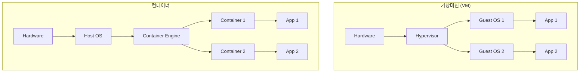
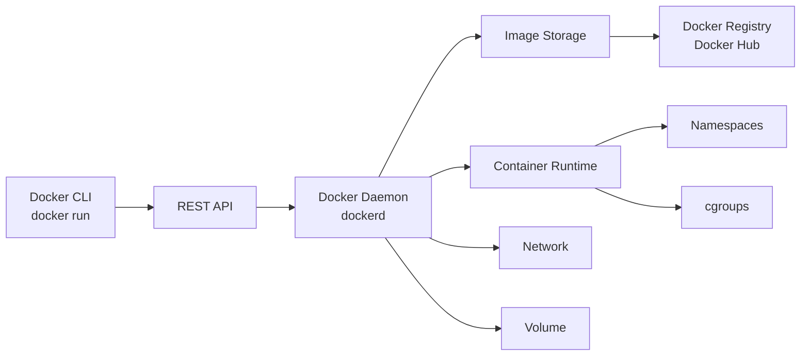
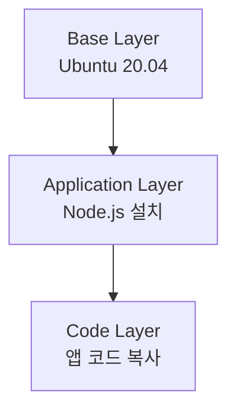

## 🌐 개요 (Overview)

컨테이너는 애플리케이션과 그 의존성을 격리된 환경에서 실행하는 경량 가상화 기술입니다. Linux 커널의 **네임스페이스(Namespaces)**와 **컨트롤 그룹(cgroups)** 을 활용한 [[process-states-lifecycle|프로세스]] 격리 메커니즘입니다.

## 🆚 가상머신 vs 컨테이너



| 특징 | 가상머신 (VM) | 컨테이너 |
|------|--------------|---------|
| **OS** | 각 VM마다 전체 OS | Host OS 커널 공유 |
| **크기** | GB 단위 | MB 단위 |
| **부팅 시간** | 분 단위 | 초 단위 |
| **리소스** | 무거움 (CPU, 메모리 많이 사용) | 경량 (프로세스 수준) |
| **격리** | 강함 (하드웨어 가상화) | 중간 (프로세스 격리) |
| **용도** | 서로 다른 OS 실행 | 동일 OS에서 앱 격리 |

## 🔑 Linux 커널 기능

### 1. Namespaces (네임스페이스)

프로세스가 볼 수 있는 시스템 리소스를 격리합니다.

| Namespace | 격리 대상 | 설명 |
|-----------|-----------|------|
| **PID** | 프로세스 ID | 컨테이너 내부에서 PID 1부터 시작 |
| **NET** | 네트워크 | 독립적인 네트워크 인터페이스, IP |
| **MNT** | 마운트 포인트 | 독립적인 파일시스템 뷰 |
| **UTS** | 호스트명 | 독립적인 hostname |
| **IPC** | IPC 리소스 | 공유 메모리, 세마포어 격리 |
| **USER** | 사용자/그룹 ID | UID/GID 매핑 |
| **CGROUP** | cgroup 루트 | cgroup 격리 |

**예시: PID Namespace**

```bash
# 호스트에서
ps aux
# PID 1 = systemd
# PID 1234 = nginx

# 컨테이너 내부에서
ps aux
# PID 1 = nginx (컨테이너의 메인 프로세스)
# PID 2 = php-fpm
# 호스트의 다른 프로세스는 안 보임!
```

### 2. cgroups (Control Groups)

리소스 사용량을 제한하고 모니터링합니다.

| cgroup | 제어 대상 | 예시 |
|--------|-----------|------|
| **CPU** | CPU 사용률 | 컨테이너 A는 CPU 2코어만 |
| **Memory** | 메모리 사용량 | 최대 512MB |
| **Blkio** | 디스크 I/O | 읽기/쓰기 속도 제한 |
| **Network** | 네트워크 대역폭 | 100Mbps 제한 |
| **PIDs** | 프로세스 수 | 최대 100개 |

**예시**:
```bash
# Docker 컨테이너 리소스 제한
docker run -m 512m --cpus=2 nginx
# 메모리 512MB, CPU 2코어로 제한
```

## 🐳 Docker 아키텍처



### 핵심 컴포넌트

**1. Docker Daemon (dockerd)**
- 컨테이너, 이미지, 네트워크, 볼륨 관리
- Docker API 요청 처리
- 백그라운드 서비스

**2. Docker Client (docker)**
- CLI 명령어 (`docker run`, `docker build` 등)
- REST API로 Daemon과 통신

**3. Docker Registry**
- 이미지 저장소 (Docker Hub, 프라이빗 레지스트리)
- `docker pull`/`docker push`로 이미지 공유

## 📦 이미지 vs 컨테이너

### 이미지 (Image)

- **읽기 전용** 템플릿
- 애플리케이션 + 의존성 + 설정 포함
- 레이어 구조 (변경사항만 저장 → 효율적)



### 컨테이너 (Container)

- 이미지의 **실행 인스턴스**
- 읽기/쓰기 레이어 추가
- 프로세스처럼 시작/중지 가능

```bash
# 비유
Image = 클래스 (class)
Container = 인스턴스 (instance)

# 하나의 이미지에서 여러 컨테이너 실행 가능
docker run nginx  # Container 1
docker run nginx  # Container 2
docker run nginx  # Container 3
```

## 🚀 왜 컨테이너를 사용하는가?

### 1. 환경 일관성

```bash
# 문제: "내 컴퓨터에서는 되는데요?" (Works on My Machine)
개발자 PC: Python 3.8, Ubuntu 20.04 ✅
테스트 서버: Python 3.7, CentOS 7 ❌
프로덕션: Python 3.9, Ubuntu 22.04 ❌

# 해결: 컨테이너 (모든 환경에서동일)
docker run myapp:1.0
  - Python 3.8, Ubuntu 20.04, 모든 의존성 포함 ✅
```

### 2. 빠른 배포

```bash
# 전통적 방식
1. 서버 준비 (OS 설치)
2. 런타임 설치 (Python, Node.js)
3. 의존성 설치 (pip, npm)
4. 애플리케이션 배포
5. 설정 파일 수정
시간: 수 시간~수 일

# 컨테이너 방식
docker run -d -p 80:8080 myapp:1.0
시간: 수 초
```

### 3. 마이크로서비스

```bash
# 모놀리식
[하나의 큰 애플리케이션]
- 배포 시 전체 재시작
- 한 부분의 버그가 전체 영향

# 마이크로서비스 (컨테이너)
[Frontend Container] [Backend API] [Database] [Cache]
- 독립적 배포 및 스케일링
- 한 서비스 장애가 격리됨
```

### 4. 리소스 효율성

```bash
# VM: 4개 앱 실행
VM1 (2GB) + VM2 (2GB) + VM3 (2GB) + VM4 (2GB) = 8GB

# Container: 같은 4개 앱
Container1 (200MB) + Container2 (150MB) + Container3 (180MB) + Container4 (170MB) = 700MB
→ 10배 이상 효율적!
```

## 🏗️ Docker 이미지 레이어

```Dockerfile
# Dockerfile 예시
FROM ubuntu:20.04              # Layer 1: 베이스 OS (50MB)
RUN apt-get update             # Layer 2: 패키지 업데이트 (30MB)
RUN apt-get install -y nginx   # Layer 3: nginx 설치 (20MB)
COPY app/ /var/www/html/       # Layer 4: 앱 코드 (5MB)
CMD ["nginx", "-g", "daemon off;"]  # Layer 5: 실행 명령 (1KB)
```

**레이어의 장점**:
1. **캐싱**: 변경되지 않은 레이어는 재사용
2. **공유**: 여러 이미지가 같은 베이스 레이어 공유
3. **효율성**: 변경된 레이어만 전송/저장

## 🌐 컨테이너 네트워킹

```bash
# Bridge 네트워크 (기본)
docker run -d -p 8080:80 nginx
# 호스트 8080 → 컨테이너 80 포트 매핑

# Host 네트워크
docker run --network host nginx
# 컨테이너가 호스트 네트워크 직접 사용

# None 네트워크
docker run --network none busybox
# 네트워크 없음 (격리)
```

## 💾 컨테이너 스토리지

### 문제: 데이터 영속성

```bash
docker run postgres
# 컨테이너 삭제 시 데이터베이스 데이터 손실!
```

### 해결: Volumes

```bash
# Named Volume
docker run -v pgdata:/var/lib/postgresql/data postgres
# pgdata 볼륨에 데이터 저장 (컨테이너 삭제해도 유지)

# Bind Mount
docker run -v /host/data:/container/data app
# 호스트 디렉토리를 컨테이너에 마운트
```

## 💡 실무 사용 예시

### Web Application 배포

```bash
# 1. Dockerfile 작성
cat > Dockerfile << EOF
FROM python:3.9
WORKDIR /app
COPY requirements.txt .
RUN pip install -r requirements.txt
COPY . .
CMD ["python", "app.py"]
EOF

# 2. 이미지 빌드
docker build -t myapp:1.0 .

# 3. 컨테이너 실행
docker run -d \
  -p 8000:8000 \
  -v /data:/app/data \
  --name myapp \
  myapp:1.0

# 4. 확인
docker ps
docker logs myapp

# 5. 업데이트 배포
docker stop myapp
docker rm myapp
docker run -d -p 8000:8000 myapp:2.0
```

## ⚖️ 컨테이너 vs VM 선택 기준

**컨테이너 사용**:
- ✅ 같은 OS에서 여러 앱 격리
- ✅ 빠른 배포 및 스케일링
- ✅ 마이크로서비스 아키텍처
- ✅ CI/CD 파이프라인

**VM 사용**:
- ✅ 서로 다른 OS 필요 (Windows + Linux)
- ✅ 강한 보안 격리 필요
- ✅ 레거시 애플리케이션

## 🔗 연결 문서 (Related Documents)

- [[process-states-lifecycle]] - 프로세스 개념
- [[ipc-mechanisms]] - 프로세스 간 통신
- [[network-security-protocols]] - 컨테이너 네트워킹 보안
- [[selinux]] - 컨테이너 보안 강화
