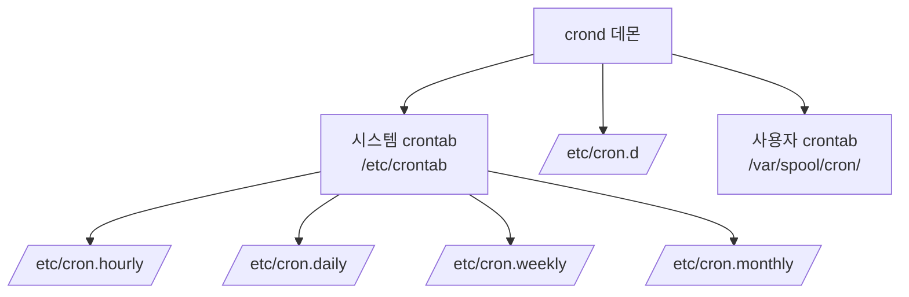

## 🌐 개요 (Overview)

**cron**은 Linux/Unix 시스템에서 **주기적인 작업을 자동으로 실행**하기 위한 데몬입니다. 백업, 로그 정리, 시스템 점검 등 반복 작업을 예약할 수 있습니다.

## ⏰ cron의 구성 요소



### 설정 파일 위치

| 파일/디렉토리 | 설명 |
|--------------|------|
| `/etc/crontab` | 시스템 전체 crontab (사용자 지정 가능) |
| `/etc/cron.d/` | 패키지별 cron 작업 |
| `/var/spool/cron/사용자명` | 사용자별 crontab |
| `/etc/cron.hourly/` | 매시간 실행할 스크립트 |
| `/etc/cron.daily/` | 매일 실행할 스크립트 |
| `/etc/cron.weekly/` | 매주 실행할 스크립트 |
| `/etc/cron.monthly/` | 매월 실행할 스크립트 |

---

## 📝 crontab 형식

### 기본 형식 (사용자 crontab)

```plaintext
분  시  일  월  요일  명령어
*   *   *   *   *     command
│   │   │   │   │
│   │   │   │   └─ 요일 (0-7, 0과 7은 일요일)
│   │   │   └───── 월 (1-12)
│   │   └───────── 일 (1-31)
│   └───────────── 시 (0-23)
└─────────────────  분 (0-59)
```

### 시스템 crontab (/etc/crontab)

```plaintext
분  시  일  월  요일  사용자  명령어
*   *   *   *   *     root    command
```

> 시스템 crontab에는 **사용자 필드**가 추가됨

---

## 💡 crontab 예시

### 시간 지정

| 예시 | 의미 |
|------|------|
| `0 * * * *` | 매시 정각 |
| `30 4 * * *` | 매일 04:30 |
| `0 0 * * *` | 매일 자정 |
| `0 0 * * 0` | 매주 일요일 자정 |
| `0 0 1 * *` | 매월 1일 자정 |
| `0 0 1 1 *` | 매년 1월 1일 자정 |

### 특수 문자

| 문자 | 의미 | 예시 |
|------|------|------|
| `*` | 모든 값 | `* * * * *` (매분) |
| `,` | 값 나열 | `0,30 * * * *` (0분, 30분) |
| `-` | 범위 | `0 9-17 * * *` (9시~17시 정각) |
| `/` | 간격 | `*/5 * * * *` (5분마다) |

### 실제 예시

```bash
# 매일 새벽 3시 백업 실행
0 3 * * * /home/user/backup.sh

# 평일(월~금) 오전 9시 보고서 생성
0 9 * * 1-5 /home/user/report.sh

# 5분마다 서버 상태 확인
*/5 * * * * /home/user/health_check.sh

# 매월 1일과 15일 로그 정리
0 0 1,15 * * /home/user/clean_logs.sh

# 매주 일요일 새벽 2시 전체 백업
0 2 * * 0 /home/user/full_backup.sh
```

### 특수 키워드

```bash
@reboot    # 시스템 시작 시 1회 실행
@hourly    # 매시간 (0 * * * *)
@daily     # 매일 자정 (0 0 * * *)
@weekly    # 매주 일요일 자정 (0 0 * * 0)
@monthly   # 매월 1일 자정 (0 0 1 * *)
@yearly    # 매년 1월 1일 자정 (0 0 1 1 *)

# 예시
@reboot /home/user/start_service.sh
@daily /home/user/daily_report.sh
```

---

## 🛠️ crontab 명령어

```bash
# 현재 사용자의 crontab 편집
crontab -e

# 현재 사용자의 crontab 확인
crontab -l

# 현재 사용자의 crontab 삭제
crontab -r

# 특정 사용자의 crontab 편집 (root만 가능)
crontab -u username -e

# 특정 사용자의 crontab 확인
crontab -u username -l
```

---

## 🔐 cron 보안

### 접근 제어

cron 사용 권한을 **cron.allow**와 **cron.deny** 파일로 제어합니다.

| 파일 | 위치 | 설명 |
|------|------|------|
| **cron.allow** | `/etc/cron.allow` | 허용된 사용자 목록 |
| **cron.deny** | `/etc/cron.deny` | 거부된 사용자 목록 |

### 접근 제어 규칙

```plaintext
판단 순서:
1. cron.allow 파일이 있으면 → 파일에 있는 사용자만 허용
2. cron.allow가 없고 cron.deny가 있으면 → 파일에 없는 사용자만 허용
3. 둘 다 없으면 → 시스템 정책에 따름 (보통 root만 허용 또는 전체 허용)
```

### 설정 예시

```bash
# /etc/cron.allow - 허용할 사용자만 나열
root
admin
backup_user

# /etc/cron.deny - 거부할 사용자만 나열
guest
tempuser
```

### 보안 권장사항

```plaintext
✅ DO
- cron.allow를 사용하여 화이트리스트 방식으로 관리
- cron 작업 스크립트의 권한을 최소화 (755 또는 700)
- 출력을 로그 파일로 리다이렉션하여 모니터링
- 중요 작업은 root 대신 전용 서비스 계정 사용

❌ DON'T
- 모든 사용자에게 cron 권한 부여
- 스크립트에 패스워드 하드코딩
- 출력을 /dev/null로 무조건 버리기
```

---

## 📋 cron 로그 및 디버깅

### 로그 확인

```bash
# cron 로그 확인 (시스템에 따라 다름)
# Debian/Ubuntu
grep CRON /var/log/syslog

# RedHat/CentOS
cat /var/log/cron

# systemd journal
journalctl -u cron
```

### 디버깅 팁

```bash
# 1. 출력을 로그 파일로 저장
* * * * * /path/script.sh >> /var/log/myscript.log 2>&1

# 2. 환경 변수 문제 해결 (cron은 최소 환경)
*/5 * * * * source /home/user/.bashrc && /path/script.sh

# 3. 전체 경로 사용
*/5 * * * * /usr/bin/python3 /home/user/script.py

# 4. PATH 환경변수 설정 (crontab 상단에)
PATH=/usr/local/bin:/usr/bin:/bin
* * * * * script.sh
```

---

## 🔄 anacron

cron은 시스템이 **꺼져 있으면 작업을 놓칩니다**. **anacron**은 시스템이 다시 켜졌을 때 놓친 작업을 실행합니다.

```bash
# /etc/anacrontab
# 기간(일)  지연(분)  식별자     명령어
1           5         daily      run-parts /etc/cron.daily
7           10        weekly     run-parts /etc/cron.weekly
30          15        monthly    run-parts /etc/cron.monthly
```

---

## 💡 실무 예시

### 자동 백업 스크립트

```bash
# /home/backup/daily_backup.sh
#!/bin/bash
DATE=$(date +%Y%m%d)
BACKUP_DIR=/backup
SOURCE=/var/www

tar -czf $BACKUP_DIR/www_$DATE.tar.gz $SOURCE
find $BACKUP_DIR -name "*.tar.gz" -mtime +7 -delete

# crontab 등록
# 0 2 * * * /home/backup/daily_backup.sh >> /var/log/backup.log 2>&1
```

### 시스템 모니터링

```bash
# /home/admin/health_check.sh
#!/bin/bash
DISK_USAGE=$(df -h / | awk 'NR==2 {print $5}' | tr -d '%')
if [ $DISK_USAGE -gt 80 ]; then
    echo "Disk usage critical: ${DISK_USAGE}%" | mail -s "Disk Alert" admin@example.com
fi

# crontab 등록
# */30 * * * * /home/admin/health_check.sh
```

## 🔗 연결 문서 (Related Documents)

- [[systemd]] - systemd timer (cron 대안)
- [[linux-log-management]] - cron 로그 분석
- [[backup-strategies]] - 백업 자동화
- [[service-management-commands]] - 서비스 관리
