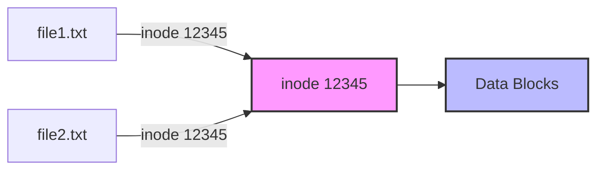
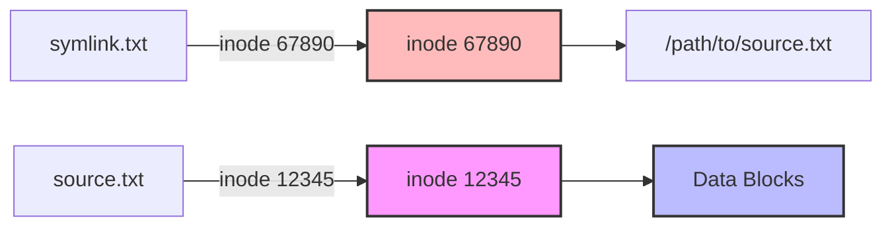

## 🌐 개요 (Overview)

Unix/Linux는 **"Everything is a file"** 철학을 따릅니다. 일반 파일뿐만 아니라 디렉토리, 디바이스, 소켓 등 모든 것을 파일처럼 다룹니다. 이러한 추상화는 일관된 인터페이스(`open`, `read`, `write`, `close`)를 제공하여 시스템을 단순하게 만듭니다.

## 📁 Linux 파일 타입 (File Types)

### 1. 일반 파일 (Regular File) - `-`

**특징**:
- 텍스트, 바이너리, 실행 파일 등 모든 데이터 파일
- 가장 일반적인 파일 형태
- 확장자는 관습일 뿐 시스템이 강제하지 않음

**예시**:
```bash
-rw-r--r-- 1 user group 1024 Dec 20 00:00 document.txt
-rwxr-xr-x 1 user group 8192 Dec 20 00:00 program
```

### 2. 디렉토리 (Directory) - `d`

**특징**:
- 파일과 디렉토리를 포함하는 컨테이너
- 내부적으로 "파일 이름 → [[inode]] 번호" 매핑을 저장하는 특수 파일
- 실행 권한(`x`)이 있어야 진입 가능

**예시**:

```bash
drwxr-xr-x 5 user group 4096 Dec 20 00:00 mydir
```

**디렉토리의 특수 엔트리**:
- `.` - 현재 디렉토리 자신
- `..` - 부모 디렉토리

### 3. 심볼릭 링크 (Symbolic Link) - `l`

**특징**:
- 다른 파일을 가리키는 포인터
- Windows의 바로가기와 유사
- 크기는 가리키는 경로의 문자열 길이

**예시**:

```bash
lrwxrwxrwx 1 user group 20 Dec 20 00:00 link -> /path/to/target
```

**사용 예**:

```bash
# 심볼릭 링크 생성
ln -s /usr/bin/python3.9 /usr/bin/python

# 링크 대상 확인
readlink /usr/bin/python
# 출력: /usr/bin/python3.9
```

### 4. 블록 디바이스 (Block Device) - `b`

**특징**:
- 블록 단위(보통 512B 또는 4KB)로 데이터 전송
- 랜덤 액세스 가능
- 버퍼링 지원 (커널 캐시 사용)

**예시**:
```bash
brw-rw---- 1 root disk 8, 0 Dec 20 00:00 /dev/sda
brw-rw---- 1 root disk 8, 1 Dec 20 00:00 /dev/sda1
```

**주요 디바이스**:
- `/dev/sda` - SATA/SCSI 디스크
- `/dev/nvme0n1` - NVMe SSD
- `/dev/loop0` - 루프백 디바이스

### 5. 캐릭터 디바이스 (Character Device) - `c`

**특징**:
- 문자 단위로 순차적 데이터 전송
- 랜덤 액세스 불가
- 버퍼링 없음 (직접 전송)

**예시**:
```bash
crw-rw-rw- 1 root tty  5, 0 Dec 20 00:00 /dev/tty
crw------- 1 root root 1, 8 Dec 20 00:00 /dev/random
```

**주요 디바이스**:
- `/dev/null` - 비트 버킷 (모든 입력 무시)
- `/dev/zero` - 무한 0 스트림
- `/dev/random` - 난수 생성기
- `/dev/tty*` - 터미널

### 6. Named Pipe (FIFO) - `p`

**특징**:
- 프로세스 간 통신(IPC)에 사용
- First In First Out 방식
- 파일시스템에 이름을 가진 파이프

**예시**:
```bash
prw-r--r-- 1 user group 0 Dec 20 00:00 mypipe
```

**생성 및 사용**:
```bash
# Named pipe 생성
mkfifo mypipe

# 터미널 1: 데이터 쓰기
echo "Hello" > mypipe

# 터미널 2: 데이터 읽기
cat < mypipe
# 출력: Hello
```

### 7. 소켓 (Socket) - `s`

**특징**:
- 네트워크 또는 로컬 프로세스 간 통신
- Unix domain socket은 파일시스템에 존재

**예시**:
```bash
srwxrwxrwx 1 user group 0 Dec 20 00:00 /var/run/docker.sock
```

## 🔗 링크의 상세 비교 (Hard Link vs Symbolic Link)

### 하드 링크 (Hard Link)



**특징**:
- ✅ 같은 [[inode]] 번호 공유
- ✅ 원본 삭제해도 데이터 접근 가능
- ✅ 디스크 공간 절약 (데이터는 1개만 저장)
- ❌ 디렉토리에는 생성 불가
- ❌ 다른 파일시스템 간 생성 불가

**생성 및 확인**:

```bash
# 하드 링크 생성
ln source.txt hardlink.txt

# inode 번호 확인 (둘 다 동일)
ls -li source.txt hardlink.txt
# 12345 -rw-r--r-- 2 user group 1024 ... source.txt
# 12345 -rw-r--r-- 2 user group 1024 ... hardlink.txt

# 링크 카운트가 2로 증가
stat source.txt | grep Links
# Links: 2
```

**원본 삭제 시**:

```bash
rm source.txt
# hardlink.txt는 여전히 접근 가능 (inode의 링크 카운트가 1로 감소)
# 링크 카운트가 0이 되면 데이터 블록이 삭제됨
```

### 심볼릭 링크 (Symbolic Link)



**특징**:
- ✅ 별도의 inode 번호
- ✅ 디렉토리에도 생성 가능
- ✅ 다른 파일시스템 간 생성 가능
- ✅ 링크 대상을 쉽게 식별 가능
- ❌ 원본 삭제 시 깨진 링크 (broken link)
- ❌ 간접 참조로 인한 약간의 성능 저하

**생성 및 확인**:

```bash
# 심볼릭 링크 생성
ln -s /path/to/source.txt symlink.txt

# 다른 inode 번호
ls -li source.txt symlink.txt
# 12345 -rw-r--r-- 1 user group 1024 ... source.txt
# 67890 lrwxrwxrwx 1 user group   20 ... symlink.txt -> /path/to/source.txt

# 링크 타겟 확인
readlink symlink.txt
# /path/to/source.txt
```

**원본 삭제 시**:

```bash
rm source.txt
ls -l symlink.txt
# lrwxrwxrwx 1 user group 20 ... symlink.txt -> /path/to/source.txt (빨간색 표시)

cat symlink.txt
# cat: symlink.txt: No such file or directory
```

### 비교표 (Comparison Table)

| 특성 | 하드 링크 | 심볼릭 링크 |
|------|-----------|-------------|
| **inode** | 동일 | 다름 |
| **원본 삭제** | 영향 없음 | 깨짐 (broken link) |
| **디렉토리** | 불가 | 가능 |
| **파일시스템** | 동일해야 함 | 상관없음 |
| **크기** | 원본과 동일 | 경로 길이 (작음) |
| **성능** | 직접 접근 | 간접 접근 |
| **식별** | 어려움 | 쉬움 (`ls -l`로 표시) |

## 🔍 파일 타입 확인 방법 (Identifying File Types)

### `ls -l` 출력 해석

```bash
ls -l /dev
# 출력:
# drwxr-xr-x  2 root root 4096 Dec 20 00:00 block
# brw-rw----  1 root disk 8, 0 Dec 20 00:00 sda
# crw-rw-rw-  1 root tty  5, 0 Dec 20 00:00 tty
# lrwxrwxrwx  1 root root    7 Dec 20 00:00 core -> /proc/kcore
```

**첫 문자의 의미**:
- `d` - Directory
- `b` - Block device
- `c` - Character device
- `l` - Symbolic link
- `p` - Named pipe (FIFO)
- `s` - Socket
- `-` - Regular file

### `file` 명령어

```bash
file /bin/ls
# /bin/ls: ELF 64-bit LSB executable, x86-64

file document.txt
# document.txt: ASCII text

file /dev/sda
# /dev/sda: block special (8/0)
```

### `stat` 명령어

```bash
stat /bin/ls
# 출력:
#   File: /bin/ls
#   Size: 133792    Blocks: 264        IO Block: 4096   regular file
#   Inode: 12345678 Links: 1
#   Access: (0755/-rwxr-xr-x)  Uid: (    0/    root)
```

## 💡 실무 활용 예시 (Practical Examples)

### 깨진 심볼릭 링크 찾기

```bash
find /path -type l ! -exec test -e {} \; -print
```

### 하드 링크 개수가 많은 파일 찾기

```bash
find / -type f -links +10 -ls
```

### 디바이스 major, minor 번호 확인

```bash
ls -l /dev/sda
# brw-rw---- 1 root disk 8, 0 Dec 20 00:00 /dev/sda
#                         ^  ^
#                    major  minor
```
- **Major**: 디바이스 드라이버 식별
- **Minor**: 특정 디바이스 식별

### Named Pipe로 로그 스트리밍

```bash
# 로그 수집 서버
mkfifo /tmp/logpipe
while true; do
    cat /tmp/logpipe >> /var/log/app.log
done &

# 애플리케이션
echo "Application started" > /tmp/logpipe
```

## 🔗 연결 문서 (Related Documents)

- [[inode]] - inode 구조와 링크의 내부 구현
- [[filesystem-hierarchy-standard]] - Linux 디렉토리 구조
- [[ipc-mechanisms]] - Named Pipe와 Socket을 통한 프로세스 간 통신
