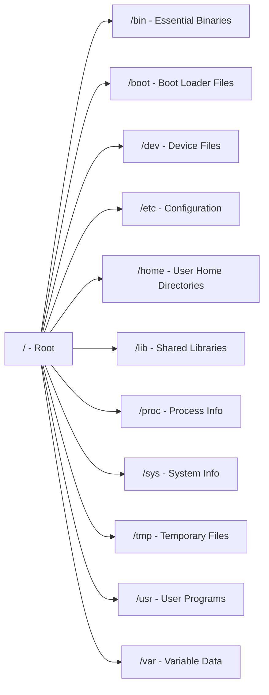

## 🌐 개요 (Overview)

**Filesystem Hierarchy Standard (FHS)** 는 Linux 및 Unix 계열 운영체제에서 디렉토리 구조를 표준화한 규격입니다. Linux Foundation 에서 관리하며, 다양한 Linux 배포판 간의 일관성을 유지하고 시스템 관리를 단순화하는 것이 목적입니다.

## 🔑 주요 특징 (Key Features)

1. **표준화된 구조**: 모든 Linux 배포판에서 동일한 디렉토리 의미를 제공
2. **계층적 구조**: 루트(`/`)를 시작으로 트리 형태로 구성
3. **목적별 분리**: 시스템 파일, 사용자 파일, 임시 파일 등을 명확히 구분
4. **이식성**: 애플리케이션이 표준 경로를 사용하여 호환성 향상

## 🏗️ 주요 디렉토리 구조 (Directory Structure)



### 필수 디렉토리 (Essential Directories)

#### `/bin` - Essential User Binaries

- **목적**: 모든 사용자가 사용하는 필수 명령어
- **내용**: `ls`, `cp`, `mv`, `cat`, `bash`, `grep` 등
- **특징**: 싱글 유저 모드에서도 필요한 명령어 포함

#### `/sbin` - System Binaries

- **목적**: 시스템 관리자용 필수 명령어
- **내용**: `fdisk`, `mkfs`, `shutdown`, `ifconfig` 등
- **특징**: 일반적으로 root 권한이 필요한 명령어

#### `/etc` - Configuration Files

- **목적**: 시스템 전역 설정 파일
- **내용**: 텍스트 기반 설정 파일들
- **주요 파일**:
  - `/etc/passwd` - 사용자 계정 정보
  - `/etc/shadow` - 암호화된 비밀번호
  - `/etc/group` - 그룹 정보
  - `/etc/fstab` - 파일시스템 마운트 정보
  - `/etc/hosts` - 호스트 이름 매핑
  - `/etc/resolv.conf` - DNS 설정

#### `/home` - User Home Directories

- **목적**: 일반 사용자의 개인 디렉토리
- **형식**: `/home/username`
- **내용**: 사용자 개인 파일, 설정, 문서 등

#### `/root` - Root User Home

- **목적**: root 사용자의 홈 디렉토리
- **위치**: `/home` 이 아닌 별도 위치
- **이유**: 시스템 복구 시에도 접근 보장

### 가상 파일시스템 (Virtual Filesystems)

#### `/proc` - Process Information

- **타입**: 가상 파일시스템 (메모리에만 존재)
- **내용**:
  - 프로세스 정보: `/proc/[PID]/`
  - CPU 정보: `/proc/cpuinfo`
  - 메모리 정보: `/proc/meminfo`
  - 커널 버전: `/proc/version`
  - 커널 파라미터: `/proc/sys/`
- **특징**: 실시간으로 커널 정보에 접근 가능

#### `/sys` - System Information

- **타입**: sysfs (커널 2.6+)
- **목적**: 커널 객체, 디바이스, 드라이버 정보
- **연동**: udev 와 함께 동적 디바이스 관리
- **내용**: `/sys/class/`, `/sys/block/`, `/sys/devices/`

#### `/dev` - Device Files

- **목적**: 하드웨어 디바이스에 대한 인터페이스
- **관리**: udev 를 통한 동적 관리
- **주요 디바이스**:
  - `/dev/sda` - 첫 번째 SATA/SCSI 디스크
  - `/dev/nvme0n1` - NVMe SSD
  - `/dev/null` - 비트 버킷 (모든 입력 무시)
  - `/dev/zero` - 0 으로 채워진 무한 스트림
  - `/dev/random` - 난수 생성기

### 애플리케이션 디렉토리 (Application Directories)

#### `/usr` - Unix System Resources

```plaintext
/usr/
├── bin/     - 일반 사용자 명령어
├── sbin/    - 시스템 관리 명령어
├── lib/     - 라이브러리
├── local/   - 로컬 설치 소프트웨어
├── share/   - 아키텍처 독립적 데이터
├── include/ - C 헤더 파일
└── src/     - 소스 코드
```

- **목적**: 사용자 애플리케이션과 데이터
- **/usr/local**: 시스템 관리자가 수동 설치한 소프트웨어

#### `/var` - Variable Data

```plaintext
/var/
├── log/     - 로그 파일
├── mail/    - 메일 스풀
├── spool/   - 프린터, cron 작업 큐
├── tmp/     - 재부팅 후에도 유지되는 임시 파일
├── cache/   - 캐시 데이터
└── lib/     - 상태 정보, 데이터베이스
```

- **목적**: 자주 변경되는 데이터
- **특징**: 크기가 동적으로 증가할 수 있는 파일들

### 임시 및 마운트 디렉토리

#### `/tmp` - Temporary Files

- **목적**: 임시 파일 저장
- **특징**: 재부팅 시 삭제될 수 있음
- **권한**: 모든 사용자가 쓰기 가능 (sticky bit 설정)

#### `/mnt` - Mount Point

- **목적**: 임시 파일시스템 마운트
- **사용**: 관리자가 수동으로 마운트할 때 사용

#### `/media` - Removable Media

- **목적**: 이동식 미디어 자동 마운트 포인트
- **내용**: USB, CD/DVD 등

## 🔄 역사적 변화 (Historical Changes)

### `/bin` vs `/usr/bin` 통합

최근 배포판(Fedora, Ubuntu 등)에서는 `/bin`, `/sbin`, `/lib` 을 `/usr` 아래로 통합하는 추세:

- `/bin` → `/usr/bin` (심볼릭 링크)
- `/sbin` → `/usr/sbin` (심볼릭 링크)
- **이유**: 역사적 구분(부팅 시 필요 vs 나중 필요)의 의미가 initramfs 로 인해 퇴색

### Systemd 의 영향

- `/run` 디렉토리 도입 (런타임 데이터)
- `/var/run` → `/run` (심볼릭 링크)

## 💡 실무 활용 (Practical Usage)

### 로그 파일 위치 찾기

```bash
# 시스템 로그
/var/log/syslog          # Debian/Ubuntu
/var/log/messages        # RHEL/CentOS

# 애플리케이션 로그
/var/log/apache2/        # 웹 서버
/var/log/mysql/          # 데이터베이스
```

### 설정 파일 백업

```bash
# 중요 설정 파일은 /etc에 집중
tar -czf /backup/etc-backup.tar.gz /etc
```

### 디스크 사용량 확인

```bash
# 각 디렉토리의 크기 확인
du -sh /*

# /var이 크게 증가하는 경우 로그 파일 확인
du -sh /var/log/*
```

## 🔗 연결 문서 (Related Documents)

- [[inode]] - 파일시스템의 내부 구조
- [[file-types-links]] - Linux 파일 타입과 링크
- [[kernel]] - 커널의 VFS(Virtual File System) 레이어
