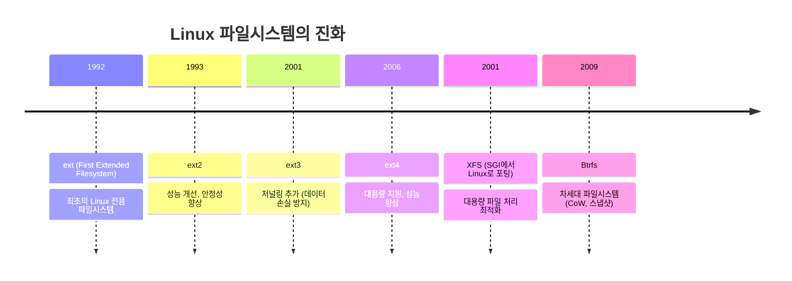

## 🌐 개요 (Overview)

파일시스템(Filesystem)은 디스크에 데이터를 저장하고 관리하는 방법을 정의하는 시스템입니다. Linux는 다양한 파일시스템을 지원하며, 각각 고유한 특징과 사용 사례가 있습니다.

## 🎯 왜 여러 파일시스템이 필요한가?

### 역사적 배경



### 사용 사례별 선택

| 파일시스템 | 최적 사용 사례 | 대표 사용처 |
|-----------|--------------|-----------|
| **ext4** | 범용, 안정성 중시 | 데스크톱, 서버 루트 파티션 |
| **XFS** | 대용량 파일, 고성능 | 미디어 서버, 데이터베이스 |
| **Btrfs** | 스냅샷, 데이터 무결성 | NAS, 백업 시스템 |

## 📊 주요 파일시스템 비교

### ext4 (Fourth Extended Filesystem)

**개요**: Linux의 사실상 표준 파일시스템

**특징**:
- ✅ 검증된 안정성 (20년 이상 사용)
- ✅ 광범위한 호환성
- ✅ 빠른 파일 시스템 체크 (`fsck`)
- ✅ 저널링 지원 (메타데이터 보호)
- ❌ 온라인 축소 불가 (확장만 가능)
- ❌ 스냅샷 미지원
- ❌ 데이터 체크섬 없음

**기술 사양**:
```plaintext
최대 파일 크기:     16TB
최대 볼륨 크기:     1EB (Exabyte)
최대 파일 개수:     40억 개
블록 크기:          1KB ~ 4KB
저널링:            메타데이터 (옵션: 데이터)
```

**생성 및 마운트**:
```bash
# ext4 파일시스템 생성
mkfs.ext4 /dev/sdb1

# 옵션 지정
mkfs.ext4 -L mydata -N 10000000 /dev/sdb1
#         ^label    ^inode 개수

# 마운트
mount /dev/sdb1 /mnt/data

# /etc/fstab 설정
/dev/sdb1  /mnt/data  ext4  defaults,noatime  0 2
```

**튜닝**:
```bash
# 파일시스템 정보 확인
tune2fs -l /dev/sdb1

# 예약 블록 비율 변경 (기본 5% → 1%)
tune2fs -m 1 /dev/sdb1

# 저널링 모드 변경
tune2fs -o journal_data /dev/sdb1
```

---

### XFS (eXtended File System)

**개요**: 고성능 64비트 저널링 파일시스템 (SGI 개발)

**특징**:
- ✅ 대용량 파일 처리 최적화
- ✅ 병렬 I/O 성능 우수
- ✅ 온라인 확장 가능
- ✅ 동적 [[inode]] 할당 (inode 고갈 없음)
- ✅ 지연 할당 (Delayed Allocation)
- ❌ **축소 불가능** (치명적 제약)
- ❌ ext4보다 느린 메타데이터 작업

**기술 사양**:
```plaintext
최대 파일 크기:     8EB
최대 볼륨 크기:     8EB
최대 파일 개수:     무제한 (동적 할당)
블록 크기:          512B ~ 64KB
저널링:            메타데이터
```

**생성 및 마운트**:
```bash
# XFS 파일시스템 생성
mkfs.xfs /dev/sdb1

# 옵션 지정 (블록 크기, 스트라이프)
mkfs.xfs -b size=4096 -d su=64k,sw=4 /dev/sdb1
#        ^블록 크기    ^RAID 최적화

# 마운트
mount /dev/sdb1 /mnt/data

# /etc/fstab 설정
/dev/sdb1  /mnt/data  xfs  defaults,noatime,largeio  0 2
```

**확장 (온라인)**:
```bash
# LV 확장 후
xfs_growfs /mnt/data

# ⚠️ 축소는 불가능!
# 해결책: 백업 → 재생성 → 복원
```

**복구 및 체크**:
```bash
# 파일시스템 체크 (언마운트 필요)
xfs_repair /dev/sdb1

# 메타데이터 덤프
xfs_metadump /dev/sdb1 /tmp/metadata.dump
```

---

### Btrfs (B-tree Filesystem)

**개요**: 차세대 Copy-on-Write (CoW) 파일시스템

**특징**:
- ✅ 내장 스냅샷 (순간 백업)
- ✅ 데이터 체크섬 (비트 부패 감지)
- ✅ 투명 압축 (zlib, lzo, zstd)
- ✅ 온라인 확장/축소
- ✅ RAID 0/1/10 내장 (mdadm 불필요)
- ✅ 서브볼륨 (논리적 파티션)
- ❌ RAID 5/6 불안정 (사용 비권장)
- ❌ ext4보다 느린 랜덤 쓰기

**기술 사양**:
```plaintext
최대 파일 크기:     16EB
최대 볼륨 크기:     16EB
최대 파일 개수:     2^64
블록 크기:          4KB ~ 64KB
저널링:            CoW (저널 불필요)
```

**생성 및 마운트**:
```bash
# Btrfs 파일시스템 생성
mkfs.btrfs /dev/sdb1

# 여러 디스크로 RAID 1 생성
mkfs.btrfs -m raid1 -d raid1 /dev/sdb1 /dev/sdc1
#          ^메타데이터 ^데이터

# 마운트
mount /dev/sdb1 /mnt/data

# 압축 활성화
mount -o compress=zstd /dev/sdb1 /mnt/data
```

**서브볼륨**:
```bash
# 서브볼륨 생성
btrfs subvolume create /mnt/data/home
btrfs subvolume create /mnt/data/var

# 서브볼륨 목록
btrfs subvolume list /mnt/data

# 서브볼륨 마운트
mount -o subvol=home /dev/sdb1 /home
```

**스냅샷**:
```bash
# 읽기 전용 스냅샷
btrfs subvolume snapshot -r /mnt/data /mnt/data/.snapshots/2025-12-22

# 읽기-쓰기 스냅샷
btrfs subvolume snapshot /mnt/data /mnt/data/.snapshots/test

# 스냅샷 복구
mv /mnt/data /mnt/data.old
btrfs subvolume snapshot /mnt/data/.snapshots/2025-12-22 /mnt/data
```

**압축**:
```bash
# 기존 파일 압축
btrfs filesystem defragment -r -czstd /mnt/data

# 압축률 확인
compsize /mnt/data
```

**밸런싱 및 유지보수**:
```bash
# 공간 재분배 (RAID 변경 후 필수)
btrfs balance start /mnt/data

# 스크러빙 (데이터 무결성 검사)
btrfs scrub start /mnt/data
btrfs scrub status /mnt/data
```

## 🔍 성능 비교

### 벤치마크 시나리오

#### 1. 대용량 파일 쓰기 (10GB)

```bash
# 테스트 명령
dd if=/dev/zero of=testfile bs=1M count=10240
```

| 파일시스템 | 속도 | 특징 |
|-----------|------|------|
| **ext4** | 500 MB/s | 안정적 성능 |
| **XFS** | 550 MB/s | 대용량 최적화 |
| **Btrfs** | 450 MB/s | CoW 오버헤드 |

#### 2. 작은 파일 생성 (100만 개)

```bash
# 테스트 명령
for i in {1..1000000}; do touch file$i; done
```

| 파일시스템 | 속도 | 특징 |
|-----------|------|------|
| **ext4** | 빠름 | 메타데이터 최적화 |
| **XFS** | 중간 | 동적 inode 할당 |
| **Btrfs** | 느림 | CoW 오버헤드 |

#### 3. 랜덤 읽기/쓰기 (데이터베이스)

| 파일시스템 | 읽기 | 쓰기 | 권장 |
|-----------|------|------|------|
| **ext4** | ⭐⭐⭐⭐ | ⭐⭐⭐⭐ | MySQL, PostgreSQL |
| **XFS** | ⭐⭐⭐⭐⭐ | ⭐⭐⭐ | MongoDB, 대용량 DB |
| **Btrfs** | ⭐⭐⭐ | ⭐⭐ | 스냅샷 필요 시 |

## 💡 실무 선택 가이드

### 시나리오 1: 웹 서버

```bash
# 권장: ext4
# 이유: 안정성, 빠른 메타데이터 작업

mkfs.ext4 /dev/sdb1
mount -o noatime,nodiratime /dev/sdb1 /var/www
```

### 시나리오 2: 미디어 서버 (대용량 파일)

```bash
# 권장: XFS
# 이유: 대용량 파일 처리 최적화

mkfs.xfs /dev/sdb1
mount -o noatime,largeio,swalloc /dev/sdb1 /media
```

### 시나리오 3: NAS / 백업 시스템

```bash
# 권장: Btrfs
# 이유: 스냅샷, 압축, 데이터 무결성

mkfs.btrfs -m raid1 -d raid1 /dev/sdb1 /dev/sdc1
mount -o compress=zstd,autodefrag /dev/sdb1 /storage

# 자동 스냅샷 (cron)
0 2 * * * btrfs subvolume snapshot -r /storage /storage/.snapshots/$(date +\%Y-\%m-\%d)
```

### 시나리오 4: 데이터베이스 서버

```bash
# 권장: ext4 또는 XFS
# ext4: 트랜잭션 많은 경우 (MySQL InnoDB)
# XFS: 대용량 데이터 (MongoDB, ClickHouse)

# ext4 (MySQL)
mkfs.ext4 /dev/sdb1
mount -o noatime,data=ordered /dev/sdb1 /var/lib/mysql

# XFS (MongoDB)
mkfs.xfs -d su=64k,sw=4 /dev/sdb1
mount -o noatime,largeio /dev/sdb1 /var/lib/mongodb
```

## 🔧 파일시스템 변환

### ext3 → ext4

```bash
# 1. 언마운트
umount /dev/sdb1

# 2. 파일시스템 체크
e2fsck -f /dev/sdb1

# 3. ext4로 변환
tune2fs -O extents,uninit_bg,dir_index /dev/sdb1

# 4. 다시 체크
e2fsck -f /dev/sdb1

# 5. 마운트
mount -t ext4 /dev/sdb1 /mnt/data
```

### ext4 → Btrfs (마이그레이션)

```bash
# ⚠️ 백업 필수!

# 1. 언마운트
umount /dev/sdb1

# 2. 파일시스템 체크
e2fsck -f /dev/sdb1

# 3. Btrfs로 변환
btrfs-convert /dev/sdb1

# 4. 마운트
mount /dev/sdb1 /mnt/data

# 5. 롤백 가능 (ext4로 복구)
btrfs-convert -r /dev/sdb1
```

## ⚠️ 주의사항 및 Best Practices

### ext4

```bash
# ✅ DO
- 안정성이 중요한 시스템에 사용
- 정기적인 fsck (재부팅 시 자동)
- noatime 옵션으로 성능 향상

# ❌ DON'T
- 매우 큰 파일 (>1TB) 처리에는 XFS 고려
- 스냅샷 필요 시 [[lvm]] 또는 Btrfs 사용
```

### XFS

```bash
# ✅ DO
- 대용량 파일 처리에 사용
- 충분한 공간 확보 (축소 불가)
- 정기적인 xfs_repair

# ❌ DON'T
- 크기 조정이 빈번한 환경
- 작은 파일 위주의 워크로드
```

### Btrfs

```bash
# ✅ DO
- 스냅샷 활용 (백업, 테스트)
- 정기적인 스크러빙 (월 1회)
btrfs scrub start /mnt/data

- 압축 활성화 (공간 절약)
mount -o compress=zstd

# ❌ DON'T
- RAID 5/6 사용 (불안정)
- 프로덕션 DB 서버 (성능 이슈)
```

## 🔗 연결 문서 (Related Documents)

- [[lvm]] - 논리 볼륨 관리와 파일시스템 조합
- [[raid-technologies]] - 디스크 중복성 및 성능 향상 기술
- [[inode]] - 파일시스템 내부 구조
- [[filesystem-hierarchy-standard]] - Linux 디렉토리 구조
