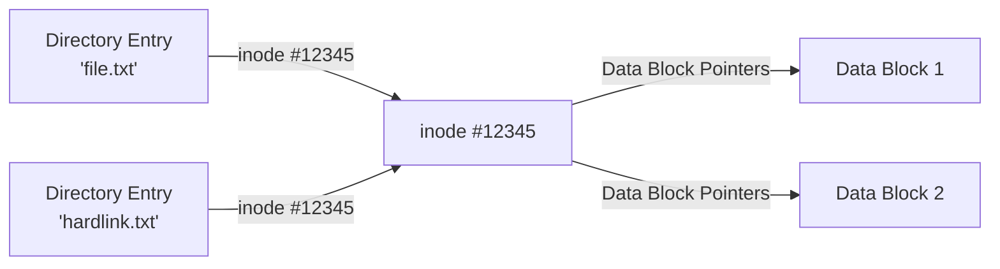
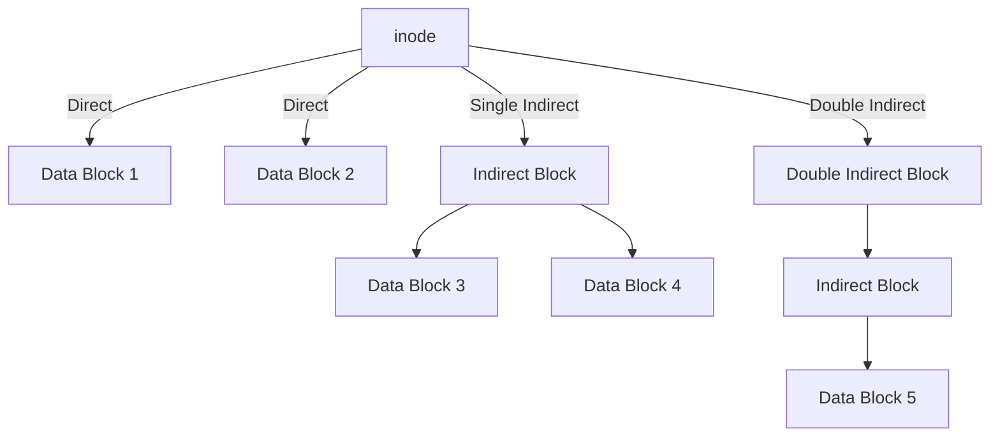

## 🌐 개요 (Overview)

**inode (Index Node)** 는 Unix/Linux 파일시스템에서 파일의 메타데이터를 저장하는 자료구조입니다. 파일의 실제 내용(데이터)과 파일 이름은 별도로 저장되며, inode는 이 둘을 연결하는 핵심 역할을 합니다.

## 🎯 역사적 배경 (Historical Context)

### 왜 inode가 필요했나?

초기 파일시스템은 파일 이름과 데이터를 직접 연결했습니다. 하지만 다음과 같은 문제가 발생했습니다:

1. **하드 링크 지원의 어려움**: 여러 이름이 같은 파일을 가리킬 수 없음
2. **메타데이터 중복**: 같은 파일을 여러 이름으로 참조하면 메타데이터가 중복 저장됨
3. **비효율적인 관리**: 파일명 변경 시 데이터 이동 필요

Unix의 설계자들은 **메타데이터를 분리**하는 방법을 고안했습니다:
- **inode**: 파일의 실제 정보와 데이터 위치 저장
- **Directory**: "파일 이름 → inode 번호" 매핑만 관리



## 🔑 inode에 저장되는 정보 (inode Contents)

### 메타데이터 (Metadata)

- **파일 타입**: 일반 파일, 디렉토리, 심볼릭 링크, 디바이스 등
- **권한 (Permissions)**: `rwxr-xr-x` (owner, group, others)
- **소유자 정보**: UID (User ID), GID (Group ID)
- **파일 크기**: 바이트 단위

### 타임스탬프 (Timestamps)

- **atime** (Access Time): 마지막으로 읽은 시간
- **mtime** (Modification Time): 마지막으로 내용을 수정한 시간
- **ctime** (Change Time): 마지막으로 inode 정보를 변경한 시간

### 데이터 블록 포인터 (Data Block Pointers)

- **직접 포인터 (Direct Pointers)**: 데이터 블록을 직접 가리킴 (보통 12개)
- **단일 간접 포인터 (Single Indirect)**: 포인터 블록을 가리킴
- **이중 간접 포인터 (Double Indirect)**: 포인터의 포인터
- **삼중 간접 포인터 (Triple Indirect)**: 매우 큰 파일용



### 기타 정보

- **링크 카운트 (Link Count)**: 이 inode를 가리키는 디렉토리 엔트리 개수
- **블록 개수 (Block Count)**: 할당된 블록 수

## ⚠️ inode에 저장되지 않는 정보

**파일 이름**은 inode에 저장되지 않습니다! 파일 이름은 디렉토리 파일에 저장됩니다.

```plaintext
디렉토리 파일 내용:
file1.txt → inode 12345
file2.txt → inode 67890
link.txt  → inode 12345  (하드 링크)
```

## 🔍 inode 확인 방법 (How to View inodes)

### inode 번호 확인

```bash
# inode 번호 표시
ls -i
# 출력: 12345678 file.txt

# 상세 정보
stat file.txt
```

### inode 사용량 확인

```bash
# 파일시스템별 inode 사용률
df -i

# 출력 예:
# Filesystem      Inodes  IUsed   IFree IUse% Mounted on
# /dev/sda1      6553600 245678 6307922    4% /
```

### inode 번호로 파일 찾기

```bash
# inode 번호 12345를 가진 모든 파일 찾기
find / -inum 12345
```

## 🔗 inode와 링크 (inode and Links)

### 하드 링크 (Hard Link)

- **정의**: 같은 inode를 가리키는 여러 디렉토리 엔트리
- **특징**:
  - 동일한 inode 번호 공유
  - 원본 파일 삭제해도 접근 가능 (링크 카운트가 0이 될 때까지)
  - 디렉토리에는 생성 불가 (무한 루프 방지)
  - 같은 파일시스템 내에서만 가능

```bash
# 하드 링크 생성
ln source.txt hardlink.txt

# 같은 inode 확인
ls -li source.txt hardlink.txt
# 12345 -rw-r--r-- 2 user group 1024 ... source.txt
# 12345 -rw-r--r-- 2 user group 1024 ... hardlink.txt
```

### 심볼릭 링크 (Symbolic Link)

- **정의**: 파일 경로를 저장하는 별도의 파일
- **특징**:
  - 별도의 inode 번호
  - 원본 삭제 시 깨진 링크 (broken link)
  - 디렉토리에도 생성 가능
  - 파일시스템을 넘어서 생성 가능

```bash
# 심볼릭 링크 생성
ln -s /path/to/source.txt symlink.txt

# 다른 inode 확인
ls -li source.txt symlink.txt
# 12345 -rw-r--r-- 1 user group 1024 ... source.txt
# 67890 lrwxrwxrwx 1 user group   20 ... symlink.txt -> /path/to/source.txt
```

## ⚡ inode 고갈 문제 (inode Exhaustion)

### 문제 상황

디스크 공간이 남아있는데도 파일을 생성할 수 없는 경우:

```bash
$ touch newfile
touch: cannot touch 'newfile': No space left on device

$ df -h
Filesystem      Size  Used Avail Use% Mounted on
/dev/sda1        50G   20G   30G  40% /

$ df -i
Filesystem      Inodes  IUsed    IFree IUse% Mounted on
/dev/sda1      3276800 3276800      0  100% /
```

### 발생 원인

- 많은 수의 작은 파일 생성 (로그 파일, 캐시 등)
- 각 파일이 1개의 inode를 사용하므로 inode가 먼저 고갈

### 해결 방법

```bash
# 1. inode를 많이 사용하는 디렉토리 찾기
find / -xdev -type f | cut -d "/" -f 2 | sort | uniq -c | sort -n

# 2. 불필요한 파일 삭제
find /var/log -type f -name "*.log" -mtime +30 -delete

# 3. 파일시스템 재생성 (inode 개수 지정)
mkfs.ext4 -N 10000000 /dev/sdb1  # 1000만 개 inode
```

## 🏗️ 파일시스템별 차이 (Filesystem Differences)

### ext4

- inode 개수는 파일시스템 생성 시 결정
- 나중에 변경 불가

### XFS

- 동적 inode 할당
- inode 고갈 문제가 거의 없음

### Btrfs
- inode 개념이 다름 (object ID 사용)
- inode 고갈 문제 없음

## 💡 실무 활용 예시 (Practical Examples)

### 백업 시 하드 링크 활용

```bash
# rsync로 증분 백업 (하드 링크 사용)
rsync -av --link-dest=/backup/previous /source /backup/current
# 변경되지 않은 파일은 하드 링크로 연결되어 공간 절약
```

### 같은 파일 여부 확인

```bash
# inode 번호로 비교
if [ $(stat -c %i file1) -eq $(stat -c %i file2) ]; then
    echo "Same file (hard link)"
else
    echo "Different files"
fi
```

### 깨진 심볼릭 링크 찾기

```bash
# 깨진 링크 검색
find /path -type l ! -exec test -e {} \; -print
```

## 🔗 연결 문서 (Related Documents)

- [[filesystem-hierarchy-standard]] - Linux 파일시스템 구조
- [[file-types-links]] - 파일 타입과 링크의 상세 설명
- [[kernel]] - VFS와 inode의 커널 레벨 구현
