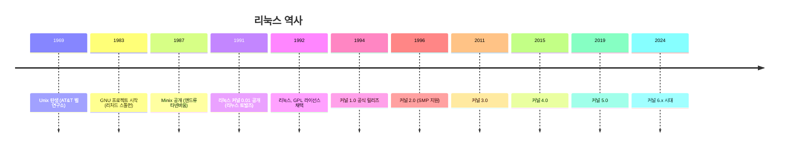

## 🌐 개요 (Overview)

리눅스(Linux)는 1991년 핀란드의 대학생 **리누스 토발즈(Linus Torvalds)**가 개발한 오픈소스 운영체제 커널입니다. 유닉스(Unix)의 철학을 계승하면서도 무료로 누구나 사용할 수 있도록 만들어졌습니다.

---

## 🕒 리눅스의 탄생 배경

### 주요 인물과 프로젝트

| 인물/프로젝트 | 역할 및 기여 |
| :--- | :--- |
| **리누스 토발즈** | 1991년 리눅스 커널 0.01 최초 공개. 헬싱키 대학교 재학 중 개발 시작. |
| **리처드 스톨먼 (Richard Stallman)** | 1983년 **GNU 프로젝트** 시작. 자유 소프트웨어 운동의 창시자. FSF(Free Software Foundation) 설립. |
| **앤드류 타넨바움 (Andrew Tanenbaum)** | 교육용 유닉스 호환 OS인 **Minix** 개발. 리누스 토발즈가 참고함. |
| **켄 톰슨 & 데니스 리치** | 1969년 AT&T 벨 연구소에서 최초의 **Unix** 개발. |

### 역사적 타임라인



---

## 🐧 리눅스 = 커널

> [!IMPORTANT]
> **중요 구분**: "리눅스"는 엄밀히 말하면 **커널(Kernel)**만을 지칭합니다. 우리가 흔히 "리눅스"라고 부르는 운영체제는 **GNU 프로젝트의 도구들(Bash, GCC, Coreutils 등) + 리눅스 커널**의 조합이므로, 정확하게는 **GNU/Linux**라고 불러야 합니다.

### 커널 버전 확인 명령어

```bash
# 커널 버전만 확인
uname -r
# 예: 6.5.0-44-generic

# 전체 시스템 정보
uname -a
# 예: Linux myhost 6.5.0-44-generic #44-Ubuntu SMP ... x86_64 GNU/Linux

# 배포판 정보 확인
cat /etc/os-release
# 또는
lsb_release -a
```

---

## 📜 주요 리눅스 배포판 (Distributions)

리눅스 커널 위에 다양한 패키지 관리자와 기본 소프트웨어를 묶어 배포하는 것을 **배포판(Distribution)**이라고 합니다.

| 계열 | 배포판 | 패키지 관리자 | 특징 |
| :--- | :--- | :--- | :--- |
| **Debian** | Ubuntu, Linux Mint | `apt` (deb) | 데스크탑/서버 범용, 초보자 친화적 |
| **Red Hat** | RHEL, CentOS, Fedora, Rocky | `dnf/yum` (rpm) | 엔터프라이즈 서버 시장 점유율 1위 |
| **Arch** | Arch Linux, Manjaro | `pacman` | 롤링 릴리즈, 최신 패키지, 고급 사용자용 |
| **SUSE** | openSUSE, SLES | `zypper` (rpm) | 유럽 기업 시장에서 강세 |
| **Slackware** | Slackware | `pkgtools` | 가장 오래된 배포판 중 하나. 순수주의적 |

---

## 🔗 연결 문서 (Related Documents)

- [[opensource-licenses]] - GPL, MIT, Apache 등 오픈소스 라이선스
- [[linux-characteristics]] - 리눅스의 기술적 특징
- [[boot-sequence]] - 리눅스 부팅 과정
