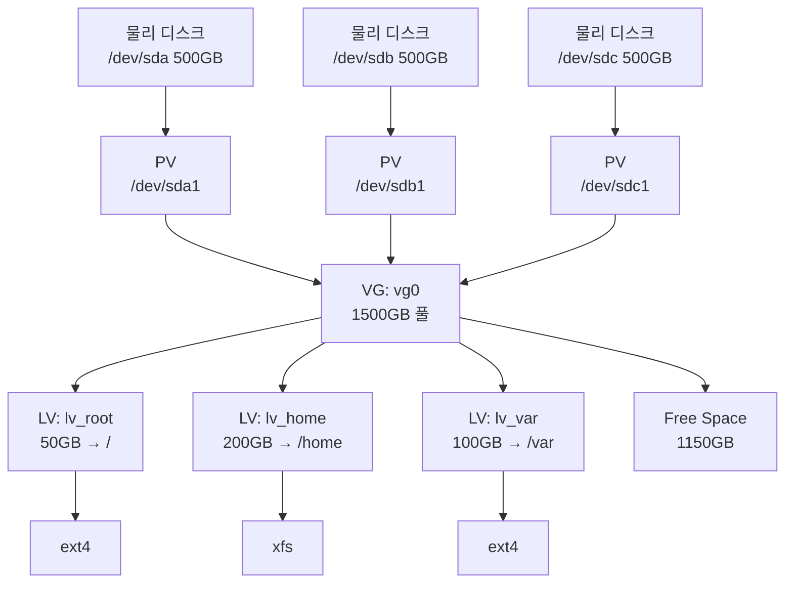

## 🌐 개요 (Overview)

LVM (Logical Volume Manager)은 Linux의 스토리지 관리 시스템으로, 물리적 디스크를 논리적으로 추상화하여 유연한 디스크 관리를 가능하게 합니다.

## 🎯 왜 LVM이 필요한가?

### 전통적 파티셔닝의 문제점

```bash
# 전통적 방식
/dev/sda1    50GB    /
/dev/sda2    100GB   /home
/dev/sda3    50GB    /var

# 문제: /var가 가득 참!
# 해결책: 재파티셔닝 (데이터 백업 → 재설치 → 복원)
# 다운타임: 수 시간~수 일
```

### LVM의 해결책

```bash
# LVM 방식
VolumeGroup: vg0 (200GB)
  ├─ lv_root   50GB    /
  ├─ lv_home   100GB   /home (가득 참!)
  └─ lv_var    50GB    /var (30GB 필요)

# 해결: 온라인 크기 조정
lvextend -L +30G /dev/vg0/lv_var
resize2fs /dev/vg0/lv_var
# 다운타임: 0초!

# 특징: 데이터 이전의 유연성
# ⚠️ 파티션 확장 시 별도의 '데이터 이전(Migration)' 작업이 필요 없습니다. 
# PV를 추가하고 LV를 확장하면 LVM이 알아서 물리적 위치를 관리합니다.
```

## 📊 LVM 구조



### 구성 요소

| 레이어 | 이름 | 설명 | 예시 |
|--------|------|------|------|
| **Physical Volume (PV)** | 물리 볼륨 | 실제 디스크/파티션 | `/dev/sda1`, `/dev/sdb1` |
| **Volume Group (VG)** | 볼륨 그룹 | PV들의 풀 (PE의 집합) | `vg0` (여러 PV 통합) |
| **Physical Extent (PE)** | 물리 확장 영역 | LVM이 데이터를 다루는 **최소 할당 단위** | 기본값: **4MB** |
| **Logical Volume (LV)** | 논리 볼륨 | VG에서 PE를 할당받아 생성된 볼륨 | `lv_root`, `lv_home` |
| **Filesystem** | 파일시스템 | LV 위의 파일시스템 | ext4, xfs, btrfs |

> [!TIP]
> **PE (Physical Extent)** 는 LVM의 가장 작은 블록 단위입니다. VG를 생성할 때 지정할 수 있으며, 기본값인 4MB는 대부분의 상황에서 적합합니다. LV의 크기는 항상 PE의 배수가 됩니다.

## 🛠️ LVM 명령어

### Physical Volume (PV) 관리

```bash
# PV 생성
pvcreate /dev/sdb1
pvcreate /dev/sdc1

# PV 정보
pvdisplay                # 상세 정보
pvs                      # 요약 (실무에서 자주 사용)
pvs -v                   # Verbose

# PV 제거
pvremove /dev/sdb1
```

### Volume Group (VG) 관리

```bash
# VG 생성 (여러 PV를 하나의 풀로)
vgcreate vg0 /dev/sdb1 /dev/sdc1

# VG 정보
vgdisplay
vgs                      # 요약
vgs -o +vg_free          # 남은 공간 포함

# VG 확장 (디스크 추가)
vgextend vg0 /dev/sdd1

# VG 축소 (디스크 제거)
vgreduce vg0 /dev/sdd1

# VG 제거
vgremove vg0
```

### Logical Volume (LV) 관리

```bash
# LV 생성
lvcreate -L 50G -n lv_root vg0           # 50GB 크기
lvcreate -l 100%FREE -n lv_home vg0      # 남은 공간 전부

# LV 정보
lvdisplay
lvs                                       # 요약

# LV 확장 (온라인 가능!)
lvextend -L +20G /dev/vg0/lv_var          # 20GB 추가
lvextend -L 100G /dev/vg0/lv_var          # 절대 크기로
lvextend -l +100%FREE /dev/vg0/lv_var     # 남은 공간 전부

# LV 축소 (주의: 언마운트 필요)
lvreduce -L 50G /dev/vg0/lv_var

# LV 제거
lvremove /dev/vg0/lv_test
```

## 📏 파일시스템 크기 조정

### ext4 확장 (온라인)

```bash
# 1. LV 확장
lvextend -L +20G /dev/vg0/lv_var

# 2. 파일시스템 확장
resize2fs /dev/vg0/lv_var

# 한 번에 (자동으로 파일시스템 확장)
lvextend -L +20G -r /dev/vg0/lv_var
```

### ext4 축소 (오프라인 필수)

```bash
# 1. 언마운트
umount /var

# 2. 파일시스템 체크
e2fsck -f /dev/vg0/lv_var

# 3. 파일시스템 축소
resize2fs /dev/vg0/lv_var 50G

# 4. LV 축소
lvreduce -L 50G /dev/vg0/lv_var

# 5. 마운트
mount /var
```

### XFS 확장 (온라인)

```bash
# 1. LV 확장
lvextend -L +20G /dev/vg0/lv_home

# 2. XFS 파일시스템 확장 (마운트된 상태에서)
xfs_growfs /home

# ⚠️ XFS는 축소 불가능!
```

## 📸 LVM 스냅샷

### 스냅샷이란?

특정 시점의 LV 복사본. 백업, 테스트, 롤백에 유용합니다.

```bash
# 스냅샷 생성 (1GB 크기)
lvcreate -L 1G -s -n snap_var_20251220 /dev/vg0/lv_var

# 스냅샷 마운트
mkdir /mnt/snapshot
mount /dev/vg0/snap_var_20251220 /mnt/snapshot

# 스냅샷 확인
lvs

# 원본 복구 (롤백)
lvconvert --merge /dev/vg0/snap_var_20251220

# 스냅샷 제거
lvremove /dev/vg0/snap_var_20251220
```

## 💡 실무 시나리오

### 시나리오 1: 디스크 공간 부족 해결

```bash
# 문제: /var 파티션이 95% 사용 중
df -h /var
# Filesystem           Size  Used Avail Use% Mounted on
# /dev/vg0/lv_var       50G   47G    3G  95% /var

# 해결: 20GB 확장 (다운타임 0초)
lvextend -L +20G -r /dev/vg0/lv_var

# 확인
df -h /var
# Filesystem           Size  Used Avail Use% Mounted on
# /dev/vg0/lv_var       70G   47G   23G  68% /var
```

### 시나리오 2: 새 디스크 추가

```bash
# 1. 새 디스크 확인
lsblk
# sdd    500G

# 2. PV 생성
pvcreate /dev/sdd1

# 3. VG에 추가
vgextend vg0 /dev/sdd1

# 4. 확인
vgs
# VG   PSize  PFree
# vg0  2.0TB  500GB  (500GB 증가!)

# 5. 필요한 LV 확장
lvextend -L +100G /dev/vg0/lv_home
resize2fs /dev/vg0/lv_home
```

### 시나리오 3: 업그레이드 전 스냅샷

```bash
# 1. 중요 파티션 스냅샷
lvcreate -L 10G -s -n snap_var_before_upgrade /dev/vg0/lv_var

# 2. 업그레이드 수행
apt upgrade -y
systemctl restart apache2

# 3-1. 성공: 스냅샷 삭제
lvremove /dev/vg0/snap_var_before_upgrade

# 3-2. 실패: 롤백
lvconvert --merge /dev/vg0/snap_var_before_upgrade
reboot
```

### 시나리오 4: 처음부터 LVM 설정

```bash
# 1. PV 생성 (2개 디스크)
pvcreate /dev/sdb1 /dev/sdc1

# 2. VG 생성
vgcreate vg_data /dev/sdb1 /dev/sdc1

# 3. LV 생성
lvcreate -L 100G -n lv_mysql vg_data
lvcreate -L 200G -n lv_backup vg_data

# 4. 파일시스템 생성
mkfs.ext4 /dev/vg_data/lv_mysql
mkfs.xfs /dev/vg_data/lv_backup

# 5. 마운트
mkdir -p /var/lib/mysql /backup
mount /dev/vg_data/lv_mysql /var/lib/mysql
mount /dev/vg_data/lv_backup /backup

# 6. /etc/fstab에 추가 (영구 마운트)
echo "/dev/vg_data/lv_mysql  /var/lib/mysql  ext4  defaults  0 2" >> /etc/fstab
echo "/dev/vg_data/lv_backup /backup         xfs   defaults  0 2" >> /etc/fstab
```

## ⚠️ 주의사항 및 Best Practices

### 주의사항

1. **LV 축소는 위험**: 데이터 손실 가능, 항상 백업 먼저
2. **XFS는 축소 불가**: XFS 사용 시 계획적으로 크기 설정
3. **스냅샷은 임시용**: 원본이 많이 변경되면 스냅샷 크기 부족
4. **VG 이름 중복 주의**: 시스템 간 VG 이름 충돌 방지

### Best Practices

```bash
# 1. 명명 규칙
vg_data, vg_system        # VG: vg_ 접두사
lv_mysql, lv_backup       # LV: lv_ 접두사

# 2. VG에 여유 공간 유지
# 최소 10-20% 여유 공간 확보

# 3. 모니터링
vgs -o +vg_free           # VG 여유 공간
lvs -o +lv_size,lv_free   # LV 크기

# 4. 정기 백업
lvcreate -L 10G -s -n snap_daily /dev/vg0/lv_data
```

## 🔗 연결 문서 (Related Documents)

- [[filesystem-hierarchy-standard]] - 파일시스템 구조
- [[raid-technologies]] - RAID 레벨 및 하드웨어/소프트웨어 방식 비교
- [[file-operations-commands]] - 디스크 관련 명령어
- [[system-monitoring-commands]] - `df`, `du`로 공간 확인
