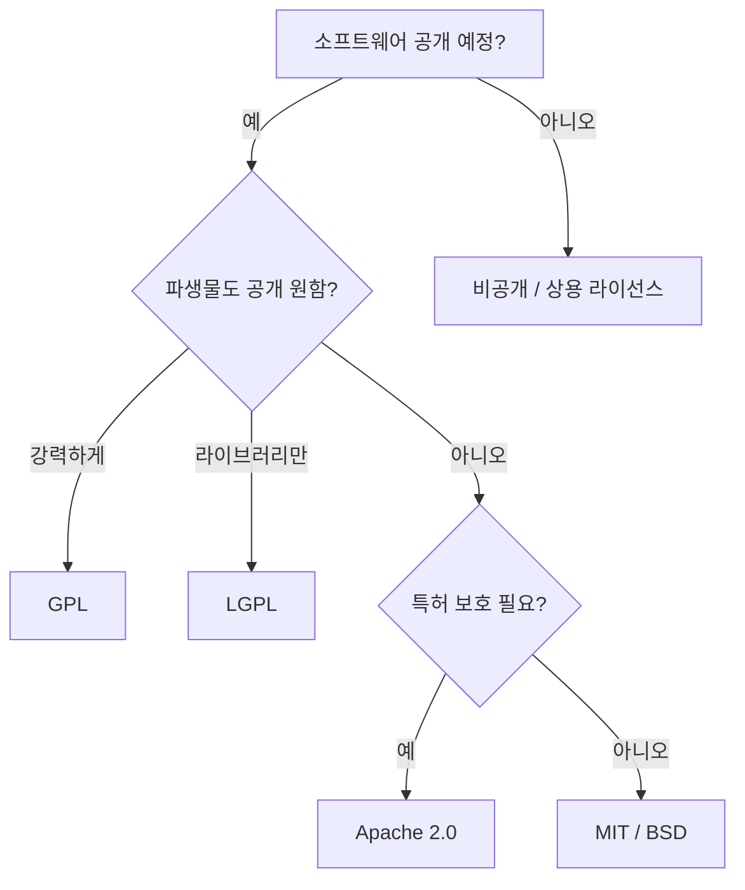

## 🌐 개요 (Overview)

오픈소스 라이선스는 소프트웨어의 자유로운 사용, 수정, 배포를 허용하면서도 특정 조건을 부과하는 법적 문서입니다. 리눅스 생태계를 이해하려면 주요 라이선스의 특징과 차이점을 알아야 합니다.

---

## 📊 주요 오픈소스 라이선스 비교

| 라이선스 | 복제권 (Copyleft) | 소스 코드 공개 의무 | 상업적 사용 | 특징 |
| :--- | :---: | :---: | :---: | :--- |
| **GPL v2/v3** | ⭐ **강함** | **필수** | ✅ | 파생물도 반드시 GPL로 공개해야 함 |
| **LGPL** | 중간 | 라이브러리 자체만 | ✅ | 동적 링크 시 소스 공개 불필요 |
| **MPL 2.0** | 중간 | **파일 단위** | ✅ | 수정한 MPL 파일만 공개. 다른 라이선스와 혼합 가능 |
| **Apache 2.0** | ❌ 없음 | 불필요 | ✅ | 특허 관련 조항 포함. 대기업 선호 |
| **BSD (2/3-Clause)** | ❌ 없음 | 불필요 | ✅ | 매우 자유로움. 저작권 명시만 요구 |
| **MIT** | ❌ 없음 | 불필요 | ✅ | 가장 간단하고 자유로운 라이선스 |

---

## 🔍 라이선스 상세 설명

### GPL (GNU General Public License)

**자유 소프트웨어 운동**의 핵심 라이선스. 리차드 스톨먼이 만듦.

*   **핵심 원칙 (Copyleft)**: GPL 소프트웨어를 사용하거나 수정해서 배포할 경우, 그 파생물도 **반드시 GPL**로 공개해야 함.
*   **소스 코드 공개 의무**: 배포 시 소스 코드를 함께 제공하거나, 요청 시 제공해야 함.
*   **대표 프로젝트**: Linux Kernel, GCC, Bash, GIMP

> [!IMPORTANT]
> **시험 Tip**: "GPL은 파생 소프트웨어도 반드시 GPL로 공개해야 한다"는 점이 가장 중요한 특징입니다. 이것이 **Copyleft(카피레프트)**의 핵심입니다.

### LGPL (Lesser GPL)

*   GPL의 "약한" 버전. **라이브러리** 사용에 적합.
*   동적 링크(Dynamic Linking)로 사용할 경우 소스 공개 의무 없음.
*   **대표 프로젝트**: GNU C Library (glibc)

### MPL (Mozilla Public License)

*   Mozilla 재단에서 만든 라이선스. GPL과 BSD/MIT의 **중간** 성격.
*   **파일 단위 Copyleft**: 수정한 MPL 파일만 공개하면 됨 (전체 프로젝트가 아님).
*   다른 라이선스(GPL, 상용 등)와 **혼합 사용 가능**.
*   **대표 프로젝트**: Firefox, Thunderbird, LibreOffice

> [!TIP]
> **GPL vs MPL**: GPL은 "프로젝트 전체" 공개, MPL은 "수정 파일만" 공개

### Apache License 2.0

*   비영리 재단 Apache Software Foundation에서 만든 라이선스.
*   **특허 조항** 포함: 기여자가 특허권을 사용자에게 묵시적으로 부여.
*   대기업에서 선호 (Google, Facebook 등의 오픈소스 프로젝트).
*   **대표 프로젝트**: Apache HTTP Server, Android (일부), Kubernetes

### BSD License

*   버클리 캘리포니아 대학에서 유래.
*   매우 자유로움. 저작권 표시만 요구.
*   2-Clause (Simplified) / 3-Clause (Original) 버전 존재.
*   **대표 프로젝트**: FreeBSD, Nginx

### MIT License

*   가장 짧고 간단한 라이선스.
*   거의 모든 것을 허용하며, 저작권 명시 및 라이선스 사본 포함만 요구.
*   **대표 프로젝트**: Node.js, jQuery, React

---

## 💡 라이선스 선택 가이드

---

## 🔗 연결 문서 (Related Documents)

- [[linux-history]] - 리눅스와 오픈소스 운동의 역사
- [[linux-characteristics]] - 리눅스의 기술적 특징
