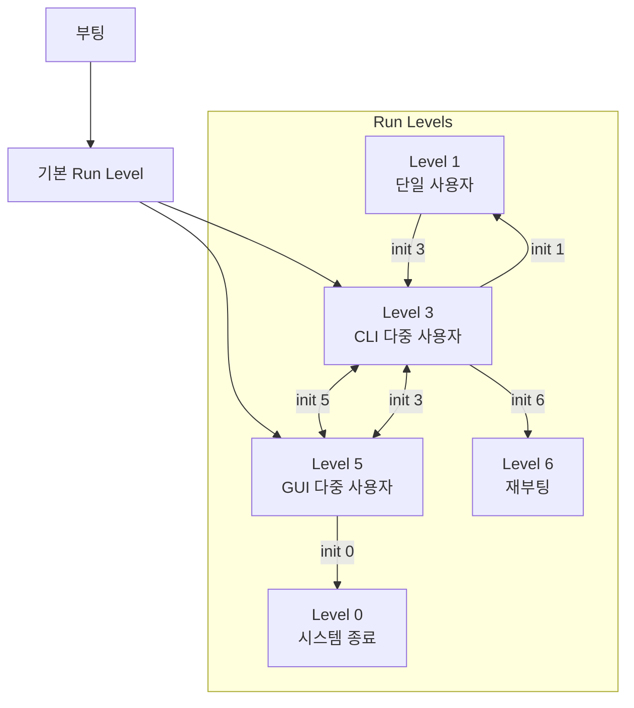
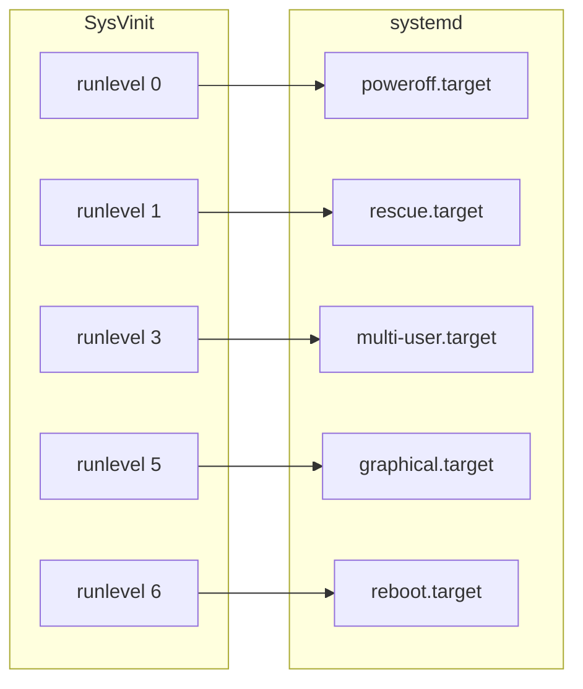

## 🌐 개요 (Overview)

**Run Level (실행 레벨)** 은 Unix/Linux 시스템의 **운영 상태**를 정의하는 개념입니다. 각 레벨은 어떤 서비스가 실행되는지를 결정합니다. 전통적인 **SysVinit**에서 사용되었으며, 현대 시스템에서는 **systemd target**으로 대체되었습니다.

---

## 📊 전통적인 Run Level (SysVinit)

### Run Level 정의

| Run Level | 이름 | 설명 |
|-----------|------|------|
| **0** | Halt | 시스템 **종료** (shutdown) |
| **1, S** | Single User | **단일 사용자 모드** (복구 모드, 네트워크 없음) |
| **2** | Multi-User (No NFS) | 네트워크 없는 다중 사용자 (Debian 계열에서는 GUI 포함) |
| **3** | Multi-User (Full) | **CLI 다중 사용자** (네트워크 활성, 서버 기본) |
| **4** | Unused | 사용자 정의 (미사용) |
| **5** | Graphical | **GUI 다중 사용자** (X Window, 데스크톱 기본) |
| **6** | Reboot | 시스템 **재부팅** |

### 배포판별 차이

| Run Level | Red Hat/CentOS | Debian/Ubuntu |
|-----------|----------------|---------------|
| **2** | NFS 없는 다중사용자 | 완전한 다중사용자 (GUI 포함) |
| **3** | CLI 다중사용자 | CLI 다중사용자 |
| **4** | 미사용 | 미사용 |
| **5** | GUI 다중사용자 | GUI 다중사용자 |

### Run Level 전환 다이어그램



### SysVinit 명령어

```bash
# 현재 Run Level 확인
runlevel
# N 3 (이전 레벨 N = 없음, 현재 3)

who -r
# run-level 3  2026-01-12 10:00

# Run Level 변경 (root 권한 필요)
init 5      # GUI 모드로 전환
init 3      # CLI 모드로 전환
init 1      # 단일 사용자 모드 (복구)
init 0      # 시스템 종료
init 6      # 재부팅

# 또는
telinit 5   # init과 동일

# 기본 Run Level 설정 (/etc/inittab)
# id:5:initdefault:
```

### /etc/inittab (SysVinit)

```bash
# /etc/inittab 예시 (전통적인 시스템)

# 기본 Run Level 설정
id:3:initdefault:

# 시스템 초기화
si::sysinit:/etc/rc.d/rc.sysinit

# Run Level별 스크립트 실행
l0:0:wait:/etc/rc.d/rc 0
l1:1:wait:/etc/rc.d/rc 1
l3:3:wait:/etc/rc.d/rc 3
l5:5:wait:/etc/rc.d/rc 5
l6:6:wait:/etc/rc.d/rc 6
```

### /etc/rc.d/init.d 구조

```plaintext
/etc/rc.d/
├── init.d/           # 서비스 스크립트
│   ├── sshd
│   ├── httpd
│   └── network
├── rc0.d/            # Run Level 0 심볼릭 링크
│   ├── K01sshd -> ../init.d/sshd
│   └── K02httpd -> ../init.d/httpd
├── rc3.d/            # Run Level 3 심볼릭 링크
│   ├── S10network -> ../init.d/network
│   ├── S55sshd -> ../init.d/sshd
│   └── S85httpd -> ../init.d/httpd
└── rc5.d/            # Run Level 5 심볼릭 링크
    ├── S10network -> ../init.d/network
    └── S99gdm -> ../init.d/gdm

파일 이름 규칙:
K = Kill (정지), S = Start (시작)
숫자 = 실행 순서 (낮을수록 먼저)
```

---

## 🎯 systemd Target (현대 시스템)

### Target ↔ Run Level 매핑



| Run Level | systemd Target | 설명 |
|-----------|---------------|------|
| **0** | `poweroff.target` | 시스템 종료 |
| **1** | `rescue.target` | 복구 모드 (단일 사용자) |
| **2, 3, 4** | `multi-user.target` | CLI 다중 사용자 |
| **5** | `graphical.target` | GUI 다중 사용자 |
| **6** | `reboot.target` | 재부팅 |

### systemd 명령어

```bash
# 현재 Target 확인
systemctl get-default
# graphical.target

# 활성 Target 목록
systemctl list-units --type=target --state=active

# Target 변경 (즉시)
systemctl isolate multi-user.target  # CLI 모드로
systemctl isolate graphical.target   # GUI 모드로
systemctl isolate rescue.target      # 복구 모드로

# 기본 Target 변경 (영구)
systemctl set-default multi-user.target  # 부팅 시 CLI
systemctl set-default graphical.target   # 부팅 시 GUI

# 시스템 제어
systemctl poweroff   # 종료 (runlevel 0)
systemctl reboot     # 재부팅 (runlevel 6)
systemctl rescue     # 복구 모드 (runlevel 1)
systemctl emergency  # 긴급 모드 (최소한의 환경)
```

### Target 의존성

```bash
# Target 의존성 확인
systemctl list-dependencies graphical.target

# 출력 예시:
graphical.target
├─gdm.service
├─multi-user.target
│ ├─sshd.service
│ ├─network.target
│ │ └─NetworkManager.service
│ └─basic.target
│   ├─sysinit.target
│   └─local-fs.target
└─...
```

---

## 📊 SysVinit vs systemd 비교

| 항목 | SysVinit | systemd |
|------|----------|---------|
| **Run Level 수** | 0~6 (7개) | Target (무제한) |
| **부팅 방식** | 순차적 | 병렬 |
| **설정 파일** | /etc/inittab | Unit 파일 (.service, .target) |
| **서비스 관리** | /etc/init.d/ 스크립트 | systemctl 명령 |
| **의존성 관리** | 숫자 순서 | After=, Requires= 지시어 |
| **부팅 속도** | 느림 | 빠름 |
| **로그** | 별도 (syslog) | journalctl 통합 |

---

## 💡 실무 활용

### 서버 부팅 모드 설정

```bash
# 서버: CLI 모드 (리소스 절약)
systemctl set-default multi-user.target

# 데스크톱: GUI 모드
systemctl set-default graphical.target

# 확인
ls -l /etc/systemd/system/default.target
# lrwxrwxrwx 1 root root ... -> /usr/lib/systemd/system/multi-user.target
```

### 복구 모드 진입

```bash
# 부팅 시 GRUB에서:
# 1. 커널 라인 끝에 추가
linux ... systemd.unit=rescue.target

# 또는
linux ... single
linux ... 1

# 비밀번호 재설정 등 복구 작업 후
systemctl default  # 정상 모드로 복귀
```

### 부팅 문제 해결

```bash
# Emergency 모드 (최소 환경)
# GRUB에서:
linux ... systemd.unit=emergency.target

# 또는
linux ... emergency

# 파일시스템 수동 마운트 필요
mount -o remount,rw /
```

---

## ⚠️ 시험 대비 핵심 포인트

```plaintext
📌 Run Level 암기:
0 = 종료 (Halt/Poweroff)
1 = 단일 사용자 (복구)
3 = CLI 다중 사용자 (서버)
5 = GUI 다중 사용자 (데스크톱)
6 = 재부팅 (Reboot)

📌 systemd Target 매핑:
runlevel 0 → poweroff.target
runlevel 1 → rescue.target
runlevel 3 → multi-user.target
runlevel 5 → graphical.target
runlevel 6 → reboot.target

📌 명령어:
- 현재 확인: runlevel, systemctl get-default
- 변경: init N, systemctl isolate xxx.target
- 기본값 설정: systemctl set-default xxx.target
```

---

## 🔗 연결 문서 (Related Documents)

- [[systemd]] - systemd 상세 설명 (Unit, Service, Target)
- [[boot-sequence]] - 리눅스 부팅 과정
- [[grub-bootloader]] - GRUB 부트로더 설정
- [[kernel-structure]] - 커널과 운영체제 구조
