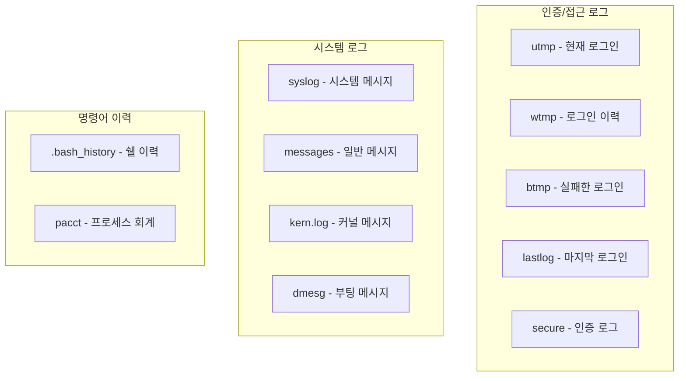

## 🌐 개요 (Overview)

Linux 시스템 보안에서 **로그 관리**는 침입 탐지 및 복구를 위해 필수적입니다. 이 문서에서는 주요 로그 파일과 분석 방법을 다룹니다.

## 📁 주요 로그 파일

### 로그 유형 분류


```mermaid
graph TB
    subgraph "인증/접근 로그"
        UTMP[utmp - 현재 로그인]
        WTMP[wtmp - 로그인 이력]
        BTMP[btmp - 실패한 로그인]
        LASTLOG[lastlog - 마지막 로그인]
        SECURE[secure - 인증 로그]
    end
    
    subgraph "시스템 로그"
        SYSLOG[syslog - 시스템 메시지]
        MESSAGES[messages - 일반 메시지]
        KERN[kern.log - 커널 메시지]
        DMESG[dmesg - 부팅 메시지]
    end
    
    subgraph "명령어 이력"
        HISTORY[.bash_history - 쉘 이력]
        PACCT[pacct - 프로세스 회계]
    end
```

---

## 🔐 인증/접근 로그

### utmp - 현재 로그인 사용자

**현재 시스템에 로그인한 사용자** 정보를 저장합니다.

**파일 위치**: `/var/run/utmp` 또는 `/run/utmp`

**상세 명령어 및 사용법**: [log-analysis-commands.md](../commands/log-analysis-commands.md#utmp---현재-로그인-사용자) 참고

---

### wtmp - 로그인/로그아웃 이력

**모든 로그인/로그아웃, 시스템 부팅/종료 이력**을 저장합니다.

**파일 위치**: `/var/log/wtmp`

**상세 명령어 및 사용법**: [log-analysis-commands.md](../commands/log-analysis-commands.md#wtmp---로그인-히스토리) 참고

---

### btmp - 실패한 로그인 시도

**로그인 실패 기록**을 저장합니다. 무차별 대입 공격 탐지에 중요합니다.

**파일 위치**: `/var/log/btmp` (root만 읽기 가능)

**상세 명령어 및 사용법**: [log-analysis-commands.md](../commands/log-analysis-commands.md#btmp---실패한-로그인-시도) 참고

**침입 탐지 관점**:
```bash
# 실패 횟수 집계 (IP별)
sudo lastb | awk '{print $3}' | sort | uniq -c | sort -rn | head

# 실패 횟수 집계 (사용자별)
sudo lastb | awk '{print $1}' | sort | uniq -c | sort -rn | head
```

---

### lastlog - 마지막 로그인 시간

**각 사용자의 마지막 로그인 시간**을 저장합니다.

**파일 위치**: `/var/log/lastlog`

**상세 명령어 및 사용법**: [log-analysis-commands.md](../commands/log-analysis-commands.md#lastlog---마지막-로그인) 참고

**보안 관점** - 30일 이상 미접속 계정 탐지:
```bash
lastlog -b 30
```

---

### secure / auth.log - 인증 로그

**인증 관련 이벤트** (SSH 접근, sudo 사용 등)를 기록합니다.

**파일 위치**:
- `/var/log/secure` (RHEL/CentOS)
- `/var/log/auth.log` (Debian/Ubuntu)

**상세 명령어 및 사용법**: [log-analysis-commands.md](../commands/log-analysis-commands.md#var-log-authlog-debian-ubuntu) 참고

**침입 탐지 분석**:
```bash
# SSH 실패 시도 IP 추출 및 집계
grep "Failed password" /var/log/auth.log | awk '{print $(NF-3)}' | sort | uniq -c | sort -rn

# 성공한 SSH 로그인만 확인
grep "Accepted" /var/log/auth.log

# 권한 상승 시도: sudo 명령 사용 이력
grep "sudo" /var/log/auth.log | grep "COMMAND"

# su 사용 이력
grep "su\[" /var/log/auth.log
```

---

## 📜 명령어 이력

### .bash_history - 쉘 명령어 이력

**각 사용자가 실행한 쉘 명령어** 이력입니다.

```bash
# 위치
~/.bash_history                 # 개인 이력
/home/username/.bash_history    # 다른 사용자 (root 권한)

# 확인
history           # 현재 세션 + 저장된 이력
cat ~/.bash_history
```

**보안 설정**:
```bash
# /etc/profile 또는 ~/.bashrc

# 이력 크기 설정
HISTSIZE=10000
HISTFILESIZE=20000

# 타임스탬프 추가 (포렌식용)
HISTTIMEFORMAT="%Y-%m-%d %H:%M:%S "

# 중복 제거
HISTCONTROL=ignoredups:erasedups

# 즉시 기록 (세션 종료 전에도)
shopt -s histappend
PROMPT_COMMAND="history -a"
```

---

### pacct/acct - 프로세스 회계

**사용자가 실행한 모든 명령어**를 시스템 수준에서 기록합니다.

```bash
# 패키지 설치
apt install acct    # Debian/Ubuntu
yum install psacct  # RHEL/CentOS

# 활성화
accton /var/log/pacct

# 확인 명령어
lastcomm            # 최근 명령어
lastcomm youngmin   # 특정 사용자
sa                  # 명령어 통계
ac                  # 접속 시간 통계
```

**출력 예시**:
```bash
$ lastcomm youngmin
ls        youngmin pts/0      0.00 secs Mon Jan  8 10:15
cat       youngmin pts/0      0.00 secs Mon Jan  8 10:14
vim       youngmin pts/0      0.05 secs Mon Jan  8 10:10
```

---

## ⚙️ syslog 시스템

### syslog 데몬

시스템 로그를 중앙 관리하는 데몬입니다.

```bash
# 종류
syslogd       # 전통적 syslog
rsyslogd      # 향상된 syslog (현재 표준)
syslog-ng     # 고급 기능 지원
journald      # systemd의 로깅 시스템
```

### rsyslog 설정

```bash
# 설정 파일
/etc/rsyslog.conf
/etc/rsyslog.d/*.conf
```

**설정 형식**:
```plaintext
facility.priority    action

예시:
auth,authpriv.*      /var/log/auth.log
*.*;auth,authpriv.none -/var/log/syslog
mail.*               /var/log/mail.log
kern.*               /var/log/kern.log
```

**Facility (출처)**:

| 값 | 이름 | 설명 |
|---|------|------|
| 0 | kern | 커널 메시지 |
| 1 | user | 사용자 프로세스 |
| 2 | mail | 메일 시스템 |
| 3 | daemon | 시스템 데몬 |
| 4 | auth | 보안/인증 |
| 5 | syslog | syslogd 자체 |
| 10 | authpriv | 보안/인증 (private) |
| 16-23 | local0-7 | 사용자 정의 |

**Priority (심각도)**:

| 값 | 이름 | 설명 |
|---|------|------|
| 0 | emerg | 시스템 사용 불가 |
| 1 | alert | 즉시 조치 필요 |
| 2 | crit | 치명적 상황 |
| 3 | err | 오류 |
| 4 | warning | 경고 |
| 5 | notice | 주의 |
| 6 | info | 정보 |
| 7 | debug | 디버그 |

---

## 📊 로그 관리 명령어

### journalctl (systemd)

**systemd 로그 관리 명령어**

**상세 명령어 및 사용법**: [service-management-commands.md](../commands/service-management-commands.md#-journalctl---systemd-logs) 참고

**보안 분석**:
```bash
# 인증 관련 로그 필터
journalctl -u sshd
journalctl -u sshd -p err            # SSH 에러만

# 시간대별 침입 탐지
journalctl -u sshd --since "1 hour ago"
journalctl -u sshd --since today -p warning
```

### 로그 순환 (logrotate)

**로그 파일 자동 관리 및 아카이브**

**설정 파일 위치**: `/etc/logrotate.conf`, `/etc/logrotate.d/*`

**상세 설정 및 명령어**: [log-analysis-commands.md](../commands/log-analysis-commands.md#-로그-로테이션) 참고

**보안 관점** - 로그 무결성 유지:
```bash
# 로그 순환 강제 실행
logrotate -f /etc/logrotate.conf

# 디버그 모드 (실제 실행 안함)
logrotate -d /etc/logrotate.conf
```

---

## 💡 침입 탐지 시나리오

### SSH 무차별 대입 공격 탐지

```bash
# 1. 실패한 로그인 시도 확인
sudo lastb | head -20

# 2. IP별 실패 횟수
grep "Failed password" /var/log/auth.log | \
  awk '{print $(NF-3)}' | sort | uniq -c | sort -rn | head

# 3. 특정 IP의 상세 로그
grep "192.168.1.50" /var/log/auth.log

# 4. fail2ban으로 자동 차단
apt install fail2ban
systemctl enable fail2ban
```

### 권한 상승 시도 탐지

```bash
# sudo 사용 이력
grep "sudo" /var/log/auth.log | grep "COMMAND"

# su 사용 이력
grep "su\[" /var/log/auth.log

# SetUID 파일 실행 감사 (auditd)
auditctl -w /usr/bin/passwd -p x -k passwd_exec
```

### 비정상 로그인 시간/위치

```bash
# 야간 로그인 확인 (예: 새벽 2-5시)
last | awk '$7 ~ /0[2-5]:/ {print}'

# 해외 IP 확인 (GeoIP 필요)
geoiplookup 192.168.1.50

# 30일 이상 미접속 계정
lastlog -b 30
```

---

## 🔗 연결 문서 (Related Documents)

- [linux-account-security](linux-account-security.md) - 계정 및 패스워드 보안
- [log-analysis-commands](../commands/log-analysis-commands.md) - 로그 분석 명령어
- [service-management-commands](../commands/service-management-commands.md) - journalctl 상세
- [selinux](selinux.md) - SELinux 감사 로그
