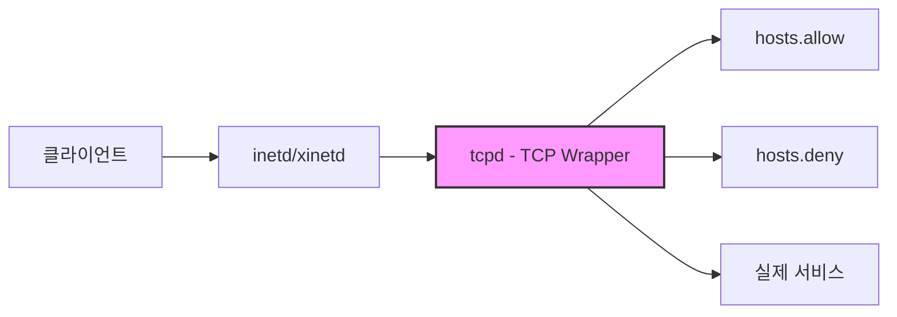
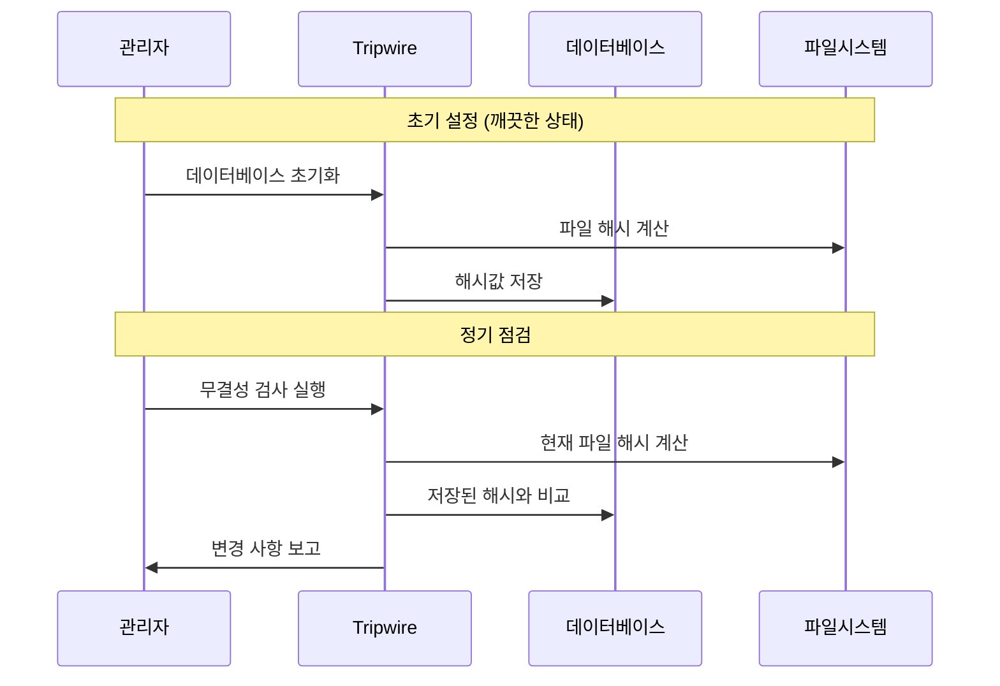

## 🌐 개요 (Overview)

Linux 서버 보안을 위한 주요 도구들을 다룹니다. 접근 통제(TCP Wrapper), 무결성 점검(Tripwire), 취약점 점검(nmap, Nessus) 등을 포함합니다.

## 🚪 TCP Wrapper

### 정의

inetd/xinetd 슈퍼 데몬에 의해 실행되는 서비스들의 **IP 기반 접근을 통제**합니다.

### 구조



### 설정 파일

| 파일 | 경로 | 역할 |
|------|------|------|
| **hosts.allow** | /etc/hosts.allow | 허용 규칙 (우선 적용) |
| **hosts.deny** | /etc/hosts.deny | 거부 규칙 |

### 처리 순서

```plaintext
1. /etc/hosts.allow 검사 → 매칭되면 허용
2. /etc/hosts.deny 검사 → 매칭되면 거부
3. 둘 다 없으면 허용 (기본)
```

### 설정 형식

```plaintext
서비스명: 클라이언트 [: 쉘 명령]
```

### 설정 예시

```bash
# /etc/hosts.allow
sshd: 192.168.1.0/255.255.255.0       # 특정 네트워크 허용
sshd: 10.0.0.100                       # 특정 IP 허용
sshd: .example.com                     # 도메인 허용
in.telnetd: LOCAL                      # 로컬 호스트만

# 로그 기록과 함께 허용
sshd: 192.168.1.0/24: spawn /bin/echo "SSH from %h" >> /var/log/tcp_wrapper.log

# /etc/hosts.deny
ALL: ALL                               # 기본 모두 거부 (권장)
sshd: 192.168.2.0/24                   # 특정 네트워크 거부
in.telnetd: ALL                        # telnet 전체 거부
```

### 와일드카드

| 키워드 | 의미 |
|--------|------|
| **ALL** | 모든 서비스 또는 모든 클라이언트 |
| **LOCAL** | 로컬 호스트 |
| **KNOWN** | 이름 해석 가능한 호스트 |
| **UNKNOWN** | 이름 해석 불가능한 호스트 |
| **PARANOID** | 이름과 IP 가 불일치하는 호스트 |

### 확인

```bash
# 접근 허용 여부 테스트
tcpdmatch sshd 192.168.1.100
# client: address 192.168.1.100
# access: granted

# 서비스가 TCP Wrapper 지원하는지 확인
ldd /usr/sbin/sshd | grep libwrap
```

---

## 🔍 Tripwire (무결성 점검)

### 정의

시스템의 주요 파일들에 대한 **해시값(지문)을 저장**해 두고, 주기적으로 비교하여 **변조 여부를 탐지**합니다.

### 동작 원리



### 설치 및 설정

```bash
# 설치 (RedHat/CentOS)
yum install tripwire

# 설치 (Debian/Ubuntu)
apt install tripwire

# 키 생성
tripwire-setup-keyfiles

# 정책 파일 편집
vi /etc/tripwire/twpol.txt

# 정책 파일 서명
twadmin --create-polfile /etc/tripwire/twpol.txt

# 데이터베이스 초기화 (깨끗한 시스템에서!)
tripwire --init
```

### 무결성 검사

```bash
# 무결성 검사 실행
tripwire --check

# 보고서 확인
twprint --print-report --twrfile /var/lib/tripwire/report/*.twr

# 데이터베이스 업데이트 (합법적 변경 후)
tripwire --update --twrfile /var/lib/tripwire/report/latest.twr
```

### 정책 파일 예시

```plaintext
# /etc/tripwire/twpol.txt
(
  rulename = "System Binaries",
  severity = 100
)
{
  /bin           -> $(SEC_CRIT);
  /sbin          -> $(SEC_CRIT);
  /usr/bin       -> $(SEC_CRIT);
  /usr/sbin      -> $(SEC_CRIT);
}

(
  rulename = "Configuration Files",
  severity = 80
)
{
  /etc           -> $(SEC_CONFIG);
}
```

---

## 🔎 취약점 점검 도구

### 호스트 기반 도구

서버 **내부**에서 설정, 권한 등을 점검합니다.

| 도구 | 설명 |
|------|------|
| **Tiger** | 시스템 보안 감사 도구 |
| **COPS** | Computer Oracle and Password System |
| **Lynis** | Unix/Linux 보안 스캐너 |

```bash
# Lynis 사용
apt install lynis
lynis audit system
```

### 네트워크 기반 도구

**외부**에서 포트 스캔 등을 통해 취약점을 점검합니다.

| 도구 | 설명 |
|------|------|
| **nmap** | 포트 스캐너, 서비스 탐지 |
| **Nessus** | 종합 취약점 스캐너 |
| **OpenVAS** | 오픈소스 취약점 스캐너 |
| **SAINT** | 상용 취약점 스캐너 |

```bash
# nmap 포트 스캔
nmap -sS -sV -O 192.168.1.100

# 취약점 스크립트 사용
nmap --script vuln 192.168.1.100
```

---

## 📝 Linux Audit (감사)

### auditd

시스템 콜 수준에서 **보안 관련 이벤트를 감사**합니다.

```bash
# 설치
apt install auditd

# 서비스 시작
systemctl enable --now auditd

# 규칙 확인
auditctl -l

# 규칙 추가 예시
# 파일 접근 감시
auditctl -w /etc/passwd -p wa -k passwd_changes

# 시스템 콜 감시
auditctl -a always,exit -F arch=b64 -S execve -k program_exec

# 로그 검색
ausearch -k passwd_changes
aureport --summary
```

---

## 🛡️ 기타 보안 도구

### fail2ban

**로그인 실패를 감지**하여 IP 를 자동 차단합니다.

```bash
# 설치
apt install fail2ban

# 설정
cp /etc/fail2ban/jail.conf /etc/fail2ban/jail.local
vi /etc/fail2ban/jail.local

# SSH 보호 설정 예시
[sshd]
enabled = true
port = ssh
filter = sshd
logpath = /var/log/auth.log
maxretry = 3
bantime = 3600
findtime = 600

# 상태 확인
fail2ban-client status
fail2ban-client status sshd
```

### rkhunter / chkrootkit

**루트킷을 탐지**합니다.

```bash
# 설치
apt install rkhunter chkrootkit

# 실행
rkhunter --check
chkrootkit

# 데이터베이스 업데이트
rkhunter --update
rkhunter --propupd
```

### ClamAV

**오픈소스 안티바이러스**입니다.

```bash
# 설치
apt install clamav clamav-daemon

# 데이터베이스 업데이트
freshclam

# 스캔
clamscan -r /home
clamscan -ri --remove /var/www
```

---

## 💡 보안 점검 체크리스트

```plaintext
[ ] TCP Wrapper 설정 (/etc/hosts.allow, hosts.deny)
[ ] Tripwire 초기화 및 정기 점검 스케줄
[ ] fail2ban 활성화
[ ] 불필요한 서비스 비활성화
[ ] SetUID 파일 정기 점검
[ ] 로그 모니터링 (auditd, journalctl)
[ ] 보안 업데이트 자동화
[ ] 방화벽 규칙 최소화
```

## 🔗 연결 문서 (Related Documents)

- [[linux-account-security]] - 계정 및 패스워드 보안
- [[linux-log-management]] - 로그 관리
- [[malware-types]] - 루트킷 탐지
- [[selinux]] - 강제적 접근 통제
