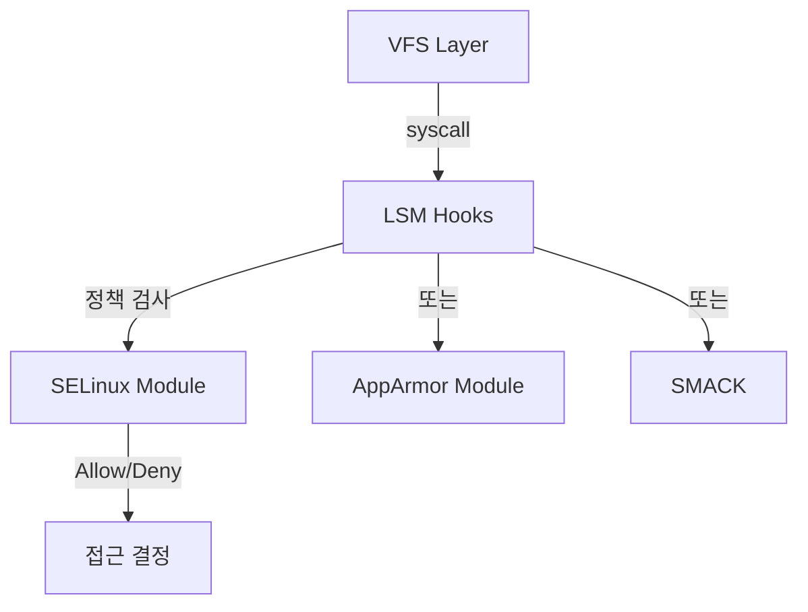
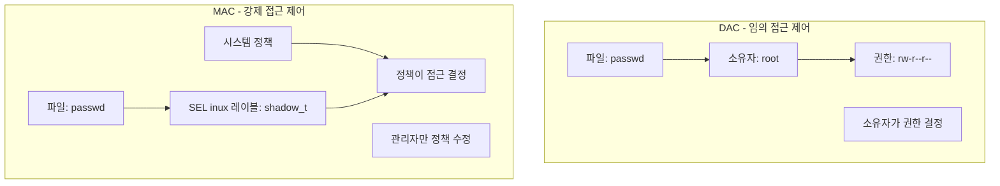
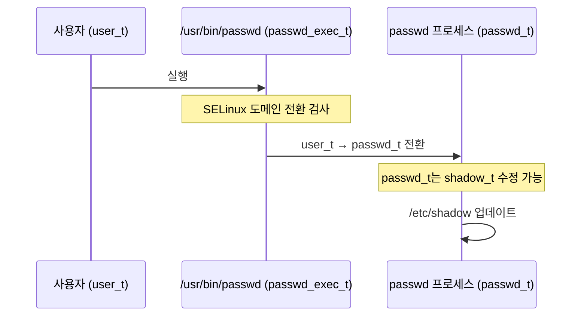

## SELinux(Security-Enhanced Linux) 란

SELinux 는 **Mandatory Access Control(MAC, 강제 접근 제어)** 을 구현하는 리눅스 보안 모듈이다. 전통적인 파일 권한 (소유자, 그룹, 기타) 만으로는 막을 수 없는 공격을 방어하기 위해, 시스템 관리자가 정의한 정책에 따라 모든 접근을 제어한다.

### 왜 SELinux 가 필요했나

#### 전통적인 Unix 보안의 한계 (DAC)

Unix/Linux 는 **DAC(Discretionary Access Control, 임의 접근 제어)** 를 사용한다:

```bash
-rw-r--r-- 1 alice users  file.txt
# alice(소유자): 읽기/쓰기
# users(그룹): 읽기
# 기타: 읽기
```

**근본적인 문제들**:

1. **루트 권한의 전능함**: root(UID 0) 는 모든 파일에 접근 가능. 하나의 취약점으로 root 권한을 얻으면 시스템 전체가 장악된다.
2. **소유자 결정권**: 파일 소유자가 권한을 설정. 악의적이거나 부주의한 사용자가 중요한 파일을 `chmod 777` 로 설정하면 누구나 접근 가능.
3. **setuid 의 위험성**: `setuid` 바이너리 (예: `passwd`, `su`) 는 일시적으로 root 권한으로 실행. 취약점이 있으면 공격 벡터가 된다.

```c
// setuid 취약점 예시
int main(int argc, char **argv) {
    setuid(0);  // root 권한 획득
    system(argv[1]);  // 사용자 입력을 shell로 실행 - 위험!
}
```

1. **프로세스 간 격리 부족**: 같은 UID 로 실행되는 프로세스는 서로의 메모리를 읽을 수 있다 (`/proc/<pid>/mem`).

#### 실제 공격 시나리오

**케이스 1: 웹 서버 침투**

```
1. 공격자가 웹 애플리케이션 취약점 발견 (SQL Injection 등)
2. 웹 서버(apache) 권한으로 코드 실행
3. apache는 /var/www/html 외에 /etc/shadow도 읽을 수 있음
4. 사용자 비밀번호 해시 탈취 → 크랙
5. SSH로 시스템 접근
```

DAC 로는 "apache 가 웹 디렉토리만 접근"하도록 강제할 방법이 없다.

**케이스 2: 컨테이너 탈출**

```
1. 컨테이너 내부에서 커널 취약점 exploit
2. root 권한 획득
3. 호스트의 /proc, /sys 접근
4. 다른 컨테이너의 데이터 읽기
5. 호스트 시스템 장악
```

---

## SELinux 의 역사

### 1. 탄생: NSA 의 Flask(1990 년대 후반)

**NSA(National Security Agency)** 와 SCC(Secure Computing Corporation) 가 **Flask** 아키텍처를 개발했다. 군사/정부 시스템의 엄격한 보안 요구사항 (Multi-Level Security, MLS) 을 충족하기 위해.

핵심 아이디어:

- **보안 정책을 코드에서 분리**: 정책을 변경해도 커널 재컴파일 불필요
- **최소 권한 원칙**: 프로세스는 작업에 필요한 최소한의 권한만 가짐
- **타입 강제 (Type Enforcement)**: 모든 객체 (파일, 프로세스, 소켓 등) 에 "타입" 레이블 부여

### 2. 리눅스로의 이식 (2000~2003)

NSA 가 Flask 을 리눅스 커널에 포팅해 **SELinux**로 공개.

- 2003 년: Linux 2.6 에 **LSM(Linux Security Modules)** 프레임워크 추가
- SELinux 가 LSM 의 첫 번째 주요 사용자



### 3. 배포판 채택

- **2003**: Fedora Core 2 가 기본 활성화 (최초의 주요 배포판)
- **2005**: Red Hat Enterprise Linux 4
- **2013**: Android 4.3 (permissive 모드)
- **2014**: Android 5.0 (enforcing 모드 필수)

초기에는 **사용성 문제**로 많은 사용자가 비활성화했다:

```bash
setenforce 0  # 비활성화 (permissive 모드)
```

프린터, 웹 서버 등 일상적 작업이 정책 위반으로 차단되었기 때문. 이후 정책이 개선되며 점차 수용되었다.

---

## SELinux 의 핵심 개념

### Mandatory vs Discretionary Access Control



**MAC 의 특징**:
- 사용자 (심지어 root) 도 정책을 우회할 수 없음
- 정책 변경은 시스템 관리자만 가능
- 프로세스가 root 권한을 얻어도 정책이 허용하지 않으면 차단

### 레이블 (Labels) 과 컨텍스트 (Context)

모든 **주체 (Subject, 프로세스)**와 **객체 (Object, 파일/소켓/etc)**는 **보안 컨텍스트**를 가진다.

```bash
ls -Z /etc/shadow
-r--------. root root system_u:object_r:shadow_t:s0 /etc/shadow

ps -eZ | grep sshd
system_u:system_r:sshd_t:s0-s0:c0.c1023 1234 ? 00:00:00 sshd
```

**컨텍스트 형식**: `user:role:type:level`

- **user**: SELinux 사용자 (Linux 사용자와 별개). 예: `system_u`, `user_u`
- **role**: 역할. 사용자가 가질 수 있는 타입을 제한. 예: `object_r`, `system_r`
- **type**: 가장 중요. Type Enforcement 의 기반. 예: `httpd_t`, `shadow_t`
- **level**: MLS/MCS 레벨 (선택적). `s0`, `s0-s0:c0.c1023` (범위)

### Type Enforcement (TE)

SELinux 정책의 핵심. **타입 (Type)** 간의 허용된 작업을 정의.

```
allow <source_type> <target_type>:<class> { <permissions> };
```

**예시**:

```bash
allow httpd_t httpd_config_t:file { read write };
# httpd_t 도메인(웹 서버 프로세스)은
# httpd_config_t 타입의 파일을
# 읽고 쓸 수 있다

allow httpd_t shadow_t:file read;
# 이 규칙이 없으면 웹 서버는 /etc/shadow 읽기 불가
```

**Permission Classes**:
- **file**: `read`, `write`, `execute`, `append`, `unlink`
- **dir**: `search`, `add_name`, `remove_name`
- **process**: `fork`, `signal`, `transition`
- **socket**: `bind`, `connect`, `listen`
- **capability**: `dac_override`, `sys_admin`, `net_admin`

---

## SELinux 정책 예시

### 웹 서버 보호

```bash
# 웹 서버는 자신의 설정 파일만 읽을 수 있음
allow httpd_t httpd_config_t:file { read getattr };

# 웹 컨텐츠 디렉토리는 읽기만 가능
allow httpd_t httpd_sys_content_t:file { read getattr };
allow httpd_t httpd_sys_content_t:dir { read search };

# 로그 파일은 쓰기 가능
allow httpd_t httpd_log_t:file { write append };

#/etc/shadow는 명시적으로 금지 (neverallow)
neverallow httpd_t shadow_t:file read;
```

**공격 시나리오 차단**:
```c
// 웹 서버가 침투당해도
FILE *f = fopen("/etc/shadow", "r");  // SELinux가 차단!
// Permission denied (DAC는 root라서 허용하지만, SELinux가 정책으로 거부)
```

### 도메인 전환 (Domain Transition)

프로세스가 다른 도메인으로 전환되는 규칙.

```bash
# passwd 명령어 실행 시
# user_t 도메인 → passwd_t 도메인으로 전환
type_transition user_t passwd_exec_t:process passwd_t;

# 전환 허용
allow user_t passwd_t:process transition;
allow user_t passwd_exec_t:file { execute };
allow passwd_t passwd_exec_t:file entrypoint;
```



일반 사용자 (user_t) 는 `/etc/shadow` 를 수정할 수 없지만, `passwd_t` 도메인으로 전환된 프로세스는 가능.

---

## SELinux 모드

### 1. Enforcing (강제 모드)

정책 위반 시 **차단**하고 **로그** 기록.

```bash
getenforce
# Enforcing

# 위반 시도
cat /etc/shadow  # Permission denied

# 로그 확인
ausearch -m AVC -ts recent
# type=AVC msg=audit(...): avc: denied { read } for pid=1234 
# comm="cat" name="shadow" scontext=user_u:user_r:user_t:s0 
# tcontext=system_u:object_r:shadow_t:s0 tclass=file
```

### 2. Permissive (허용 모드)

정책 위반을 **로그만** 기록하고 차단하지 않음. 정책 개발/디버깅용.

```bash
setenforce 0  # Permissive 전환
getenforce
# Permissive

cat /etc/shadow  # 성공하지만 로그 기록됨
```

### 3. Disabled (비활성 모드)

SELinux 완전 비활성화. 재부팅 필요.

```bash
# /etc/selinux/config
SELINUX=disabled
```

---

## SELinux 정책 작성

### Boolean 을 통한 간단한 조정

미리 정의된 Boolean 로 정책 일부를 켜고 끌 수 있다.

```bash
# 웹 서버가 홈 디렉토리 접근 허용 여부
getsebool httpd_enable_homedirs
# httpd_enable_homedirs --> off

setsebool httpd_enable_homedirs on  # 활성화
```

### Custom Policy 모듈 작성

```bash
# 1. AVC denial 로그 수집
ausearch -m AVC -ts recent > denials.txt

# 2. audit2allow로 정책 생성 제안
audit2allow -i denials.txt -M my_policy

# 3. 생성된 my_policy.te 검토
cat my_policy.te
# module my_policy 1.0;
# require {
#     type httpd_t;
#     type user_home_t;
#     class file { read write };
# }
# allow httpd_t user_home_t:file { read write };

# 4. 정책 컴파일 및 로드
semodule -i my_policy.pp
```

**주의**: `audit2allow` 의 제안을 맹목적으로 적용하면 보안 구멍이 생길 수 있다. 정책을 이해하고 최소 권한 원칙을 따라야 한다.

---

## 안드로이드에서의 SELinux

### 도입 배경

안드로이드는 수백만 개의 써드파티 앱을 실행한다. DAC 만으로는 부족:

1. 앱이 root 권한을 획득하면 (루팅, 취약점) 모든 데이터 접근 가능
2. System 앱과 일반 앱을 명확히 격리 필요
3. Binder 서비스 접근 제어

### 도입 타임라인

- **Android 4.3 (2013)**: SELinux permissive 모드 도입, 로그만 기록
- **Android 4.4**: 일부 도메인 enforcing (installd, netd, vold 등)
- **Android 5.0 (2014)**: **전체 enforcing 필수**, CTS(Compatibility Test Suite) 에서 검증
- **Android 8.0+**: Treble 아키텍처로 정책 분리 (platform/vendor)

### 주요 도메인 (Domain)

```bash
# 앱 프로세스
untrusted_app          # 일반 앱 (Play Store)
untrusted_app_25       # targetSdkVersion 25
untrusted_app_27       # targetSdkVersion 27 (scoped storage)
priv_app               # /system/priv-app (특권 앱)
platform_app           # 플랫폼 서명 앱

# 시스템 서비스
system_server          # ActivityManager, PackageManager 등
surfaceflinger         # 화면 합성
mediaserver            # 미디어 코덱
netd                   # 네트워크 데몬

# 커널/드라이버
kernel                 # 커널
init                   # init 프로세스
vendor_init            # vendor 파티션 init
```

### 안드로이드 정책 예시

```bash
# untrusted_app은 자기 데이터만 접근
allow untrusted_app app_data_file:file { read write };
allow untrusted_app app_data_file:dir { read write search };

# system_file은 읽기만 가능
allow untrusted_app system_file:file { read getattr execute };

# system_data_file은 절대 쓰기 불가
neverallow untrusted_app system_data_file:file write;

# Binder: SurfaceFlinger 서비스 접근 허용
allow untrusted_app surfaceflinger_service:service_manager find;
allow untrusted_app surfaceflinger:binder call;
```

### Binder 와 SELinux 통합

Binder 서비스도 SELinux 로 보호:

```bash
# ServiceManager에 서비스 등록 시 타입 확인
service_manager_type(surfaceflinger_service);

# 앱이 서비스를 find할 수 있는지 검사
allow untrusted_app surfaceflinger_service:service_manager find;
```

공격자가 root 권한을 얻어도, 정책이 없으면 시스템 서비스에 접근할 수 없다.

---

## SELinux 디버깅

### AVC Denial 로그 분석

```bash
# Android
adb shell dmesg | grep avc
# avc: denied { read } for pid=12345 comm="app_process" 
# name="file.txt" scontext=u:r:untrusted_app:s0:c512,c768 
# tcontext=u:object_r:system_data_file:s0 tclass=file permissive=0

# Linux
ausearch -m AVC -ts recent
```

**파싱**:
- `denied { read }`: 거부된 권한
- `pid=12345 comm="app_process"`: 프로세스 정보
- `scontext`: Source context (주체, 프로세스)
- `tcontext`: Target context (객체, 파일)
- `tclass`: Object class (file, dir, socket 등)
- `permissive=0`: Enforcing 모드

### 정책 확인

```bash
# 특정 타입에 허용된 규칙 확인
sesearch -A -s httpd_t -t shadow_t
# (없으면 접근 불가)

# 모든 httpd_t 규칙
sesearch -A -s httpd_t

# Boolean 목록
getsebool -a
```

### 컨텍스트 변경

```bash
# 파일 컨텍스트 변경
chcon -t httpd_sys_content_t /var/www/html/index.html

# 영구 설정 (재부팅 후에도 유지)
semanage fcontext -a -t httpd_sys_content_t "/var/www/html/.*"
restorecon -Rv /var/www/html
```

---

## SELinux vs AppArmor

| 특징 | SELinux | AppArmor |
|------|---------|----------|
| **정책 방식** | 레이블 기반 (labels) | 경로 기반 (paths) |
| **세분화** | 매우 높음 (타입별 상세 제어) | 중간 (프로파일 단위) |
| **복잡도** | 높음 | 낮음 |
| **기본 정책** | Deny by default (화이트리스트) | Deny by default |
| **주요 사용자** | RHEL, Fedora, Android | Ubuntu, SUSE |
| **학습 곡선** | 가파름 | 완만 |

**AppArmor 예시 (간단함)**:
```bash
# /etc/apparmor.d/usr.bin.firefox
/usr/bin/firefox {
    /home/*/.mozilla/** rw,
    /tmp/** rw,
    /etc/passwd r,
    deny /etc/shadow r,
}
```

**SELinux** 예시 (복잡하지만 세밀함):
```bash
allow firefox_t user_home_t:dir { read search };
allow firefox_t user_home_t:file { read write };
allow firefox_t mozilla_home_t:file { create read write unlink };
neverallow firefox_t shadow_t:file read;
```

---

## 성능 오버헤드

### 측정된 영향

- **시스템 콜 오버헤드**: ~3-7% (LSM 훅 실행 비용)
- **컨텍스트 스위칭**: 추가 ~1-2% (레이블 검증)
- **메모리**: 프로세스당 ~4KB (보안 컨텍스트 저장)

대부분의 워크로드에서 **체감할 수 없는 수준**. 보안 이득이 성능 비용을 초과한다.

### 최적화

- 정책 캐싱: 자주 사용되는 결정을 메모리에 캐시 (AVC, Access Vector Cache)
- 정책 컴파일: 이진 형식으로 미리 컴파일 (`checkpolicy`)

---

## 실전: SELinux 문제 해결

### 시나리오: 웹 서버가 커스텀 포트 바인딩 실패

```bash
# systemctl start httpd
Job for httpd.service failed.

# 로그 확인
ausearch -m AVC -ts recent
# avc: denied { name_bind } for pid=1234 comm="httpd" 
# src=8080 scontext=system_u:system_r:httpd_t:s0 
# tcontext=system_u:object_r:unreserved_port_t:s0 tclass=tcp_socket
```

**해결**:

```bash
# 옵션 1: 포트 타입 변경
semanage port -a -t http_port_t -p tcp 8080

# 옵션 2: Boolean 활성화 (있다면)
setsebool -P httpd_can_network_connect 1
```

### 시나리오: 안드로이드 앱이 system_server Binder 호출 실패

```bash
adb logcat | grep avc
# avc: denied { call } for scontext=u:r:untrusted_app:s0 
# tcontext=u:r:system_server:s0 tclass=binder
```

**원인**: 앱이 허용되지 않은 system service 접근 시도.

**해결**:
1. 정당한 접근이라면 정책 추가 (OEM/커스텀 ROM)
2. 앱 버그라면 수정

---

## 학습 리소스

**공식 문서**:
- [SELinux Project](https://github.com/SELinuxProject)
- [Red Hat SELinux User's and Administrator's Guide](https://access.redhat.com/documentation/en-us/red_hat_enterprise_linux/8/html/using_selinux)
- [Android SELinux](https://source.android.com/docs/security/features/selinux)

**책**:
- *SELinux System Administration* (Sven Vermeulen)
- *SELinux by Example* (Frank Mayer et al.)

**도구**:
- `audit2allow`: denial 을 정책으로 변환
- `sesearch`: 정책 검색
- `seinfo`: 정책 정보
- `sepolicy-analyze` (Android): 안드로이드 정책 분석

---

## 마무리

SELinux 는 **복잡하지만 강력하다**. 초기 설정과 정책 이해에 시간이 걸리지만, 올바르게 설정되면:

- 제로데이 취약점의 피해 최소화 (공격자가 root 를 얻어도 정책이 제한)
- 시스템 서비스와 데이터 격리
- Compliance 요구사항 충족 (HIPAA, PCI-DSS 등)

**핵심 원칙**:
1. **최소 권한**: 프로세스에 필요한 최소한의 권한만
2. **명시적 허용**: 기본은 차단, 필요한 것만 허용
3. **계층적 방어**: DAC + SELinux + 네트워크 방화벽

안드로이드에서 SELinux 는 **필수**이며, 모든 기기가 enforcing 모드로 출하되어야 CTS 를 통과한다.

---

## 연결 문서

[[kernel]] - 리눅스 커널의 보안 메커니즘

[[cpu-privilege-levels]] - 하드웨어 권한 레벨과 MAC 의 조합

[[android-kernel]] - 안드로이드에서의 SELinux 활용
