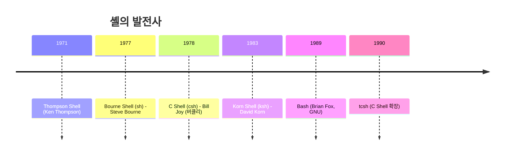
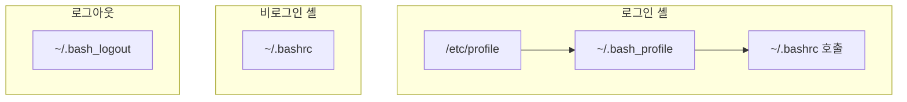

## 🌐 개요 (Overview)

**셸(Shell)** 은 사용자와 커널 사이의 인터페이스로, 명령어 해석기입니다. 다양한 셸이 개발되어 왔으며 각각 고유한 특징을 가집니다.

---

## 📜 셸의 역사 및 종류


```mermaid
timeline
    title 셸의 발전사
    1971 : Thompson Shell (Ken Thompson)
    1977 : Bourne Shell (sh) - Steve Bourne
    1978 : C Shell (csh) - Bill Joy (버클리)
    1983 : Korn Shell (ksh) - David Korn
    1989 : Bash (Brian Fox, GNU)
    1990 : tcsh (C Shell 확장)
```

| 셸 | 개발자/기관 | 연도 | 특징 |
| :--- | :--- | :--- | :--- |
| **Bourne Shell (sh)** | Steve Bourne (AT&T Bell Labs) | 1977 | **가장 오래된** 표준 셸, 스크립트 기본 |
| **C Shell (csh)** | Bill Joy (버클리 대학) | 1978 | 히스토리, alias, 작업 제어 도입 |
| **tcsh** | Ken Greer | 1983 | csh 확장, 명령 완성, TENEX 영향 |
| **Korn Shell (ksh)** | David Korn (AT&T Bell Labs) | 1983 | sh + csh 장점 결합 |
| **Bash** | Brian Fox (GNU) | 1989 | **가장 최근**, 리눅스 표준 셸 |
| **dash** | - | 2002 | Debian 기본, POSIX 호환 경량 셸 |

> [!IMPORTANT]
> **시험 포인트**:
> - **가장 오래된 셸**: Bourne Shell (sh)
> - **가장 최근 셸**: Bash (1989)
> - **C Shell 개발자**: 빌 조이 (Bill Joy), 버클리 대학, 1978년

---

## 🐚 주요 셸 상세

### Bourne Shell (sh)

- **창시자**: Steve Bourne (AT&T Bell Labs)
- UNIX 표준 셸의 기원
- 스크립트 작성의 기본
- 파일: `/bin/sh`

### C Shell (csh)

- **창시자**: Bill Joy (버클리 대학), 1978년
- C 언어와 유사한 문법
- 최초로 **히스토리**, **alias**, **작업 제어** 기능 도입
- 파일: `/bin/csh`

### Korn Shell (ksh)

- **창시자**: David Korn (AT&T Bell Labs), 1983년
- Bourne Shell + C Shell 장점 결합
- 파일: `/bin/ksh`

### Bash (Bourne Again Shell)

- **창시자**: Brian Fox
- **프로젝트**: GNU 프로젝트
- 현재 리눅스, macOS의 기본 셸
- sh, csh, ksh의 기능 통합
- 파일: `/bin/bash`

> [!TIP]
> Bash = **B**ourne **A**gain **SH**ell (Bourne Shell의 재탄생)

---

## ⚙️ 셸 관련 파일 및 명령어

### /etc/shells - 사용 가능한 셸 목록

```bash
# 사용 가능한 셸 목록 확인
cat /etc/shells

# 출력 예시
/bin/sh
/bin/bash
/bin/csh
/bin/tcsh
/bin/ksh
/bin/zsh
```

### chsh - 기본 셸 변경

```bash
# 현재 사용자 셸 확인
echo $SHELL

# 사용 가능한 셸 목록 확인
chsh -l        # 또는 cat /etc/shells

# 기본 셸 변경
chsh -s /bin/zsh

# 다른 사용자 셸 변경 (root)
chsh -s /bin/bash username
```

> [!WARNING]
> **`chsh -l`은 현재 셸을 확인하는 명령이 아닙니다!** 사용 가능한 셸 목록을 출력합니다.
> 
> - 현재 셸 확인: `echo $SHELL` 또는 `ps` 또는 `grep username /etc/passwd`
> - 셸 목록 확인: `chsh -l` 또는 `cat /etc/shells`

### /sbin/nologin - 로그인 불가 셸

시스템 계정(daemon, www-data 등)에 설정되어 대화형 로그인을 막습니다.

```bash
# /etc/passwd 예시
daemon:x:1:1:daemon:/usr/sbin:/usr/sbin/nologin
www-data:x:33:33:www-data:/var/www:/usr/sbin/nologin
```

---

## 🔧 셸 변수 vs 환경 변수

| 구분 | 셸 변수 | 환경 변수 |
| :--- | :--- | :--- |
| **범위** | 현재 셸에서만 유효 | 자식 프로세스에도 전달 |
| **선언** | `VAR=value` | `export VAR=value` |
| **확인** | `set` | `env` 또는 `printenv` |

```bash
# 셸 변수 선언 (현재 셸에서만)
user=lin

# 환경 변수 확인 (시스템)
echo $USER    # → posein (환경 변수, 변하지 않음)
echo $user    # → lin (셸 변수)

# 모든 셸 변수 확인
set

# 환경 변수만 확인
env
printenv
```

> [!IMPORTANT]
> **`set`**: 셸 변수 + 환경 변수 모두 출력
> **`env`**: 환경 변수만 출력

---

## 📝 히스토리 확장 (History Expansion)

| 명령 | 설명 |
| :--- | :--- |
| `!!` | 마지막 명령 재실행 |
| `!n` | n번째 히스토리 명령 실행 |
| `!-n` | n번째 이전 명령 실행 |
| `!string` | string으로 시작하는 최근 명령 |
| `!?string?` | string을 포함하는 최근 명령 |

```bash
# 마지막 명령 재실행
!!

# 5번째 히스토리 명령 실행
!5

# 'al'이라는 문자열을 포함하는 최근 명령 실행
!?al?
```

---

## 📂 셸 설정 파일


```mermaid
flowchart TD
    subgraph "로그인 셸"
        A["/etc/profile"] --> B["~/.bash_profile"]
        B --> C["~/.bashrc 호출"]
    end
    
    subgraph "비로그인 셸"
        D["~/.bashrc"]
    end
    
    subgraph "로그아웃"
        E[~/.bash_logout]
    end
```

| 파일 | 범위 | 용도 |
| :--- | :--- | :--- |
| `/etc/profile` | 전체 사용자 | 시스템 전역 환경 변수 |
| `/etc/bashrc` | 전체 사용자 | **alias, function** (전역) |
| `~/.bash_profile` | 개인 | 환경 변수, 시작 프로그램 |
| `~/.bashrc` | 개인 | **alias, function** (개인) |
| `~/.bash_logout` | 개인 | 로그아웃 시 실행 |

> [!TIP]
> **시험 포인트**: `.bashrc`는 alias와 function 설정에 사용됩니다.

---

## ⏰ TMOUT 환경 변수

사용자가 일정 시간 동안 작업하지 않으면 **자동 로그아웃** 됩니다.

```bash
# 300초 후 자동 로그아웃
export TMOUT=300

# ~/.bashrc에 영구 설정
echo 'export TMOUT=600' >> ~/.bashrc
```

---

## 🔗 연결 문서 (Related Documents)

- [shell-environment-commands](commands/shell-environment-commands.md) - 셸 환경 명령어
- [shell-scripting](shell-scripting.md) - 셸 스크립팅 가이드
- [process-job-control-commands](commands/process-job-control-commands.md) - 프로세스 제어
