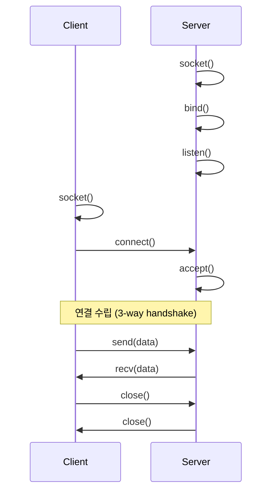
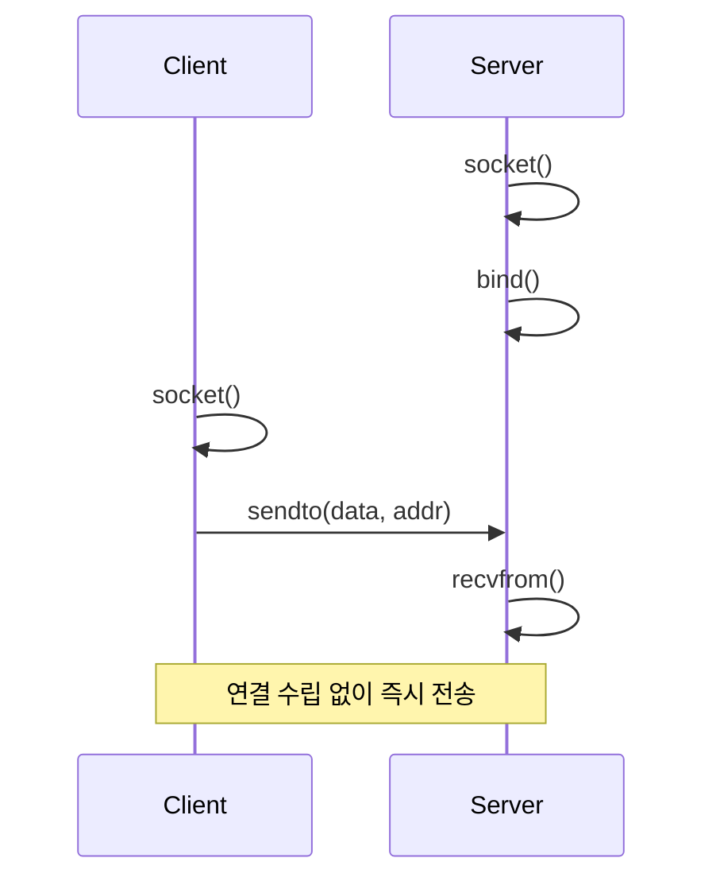
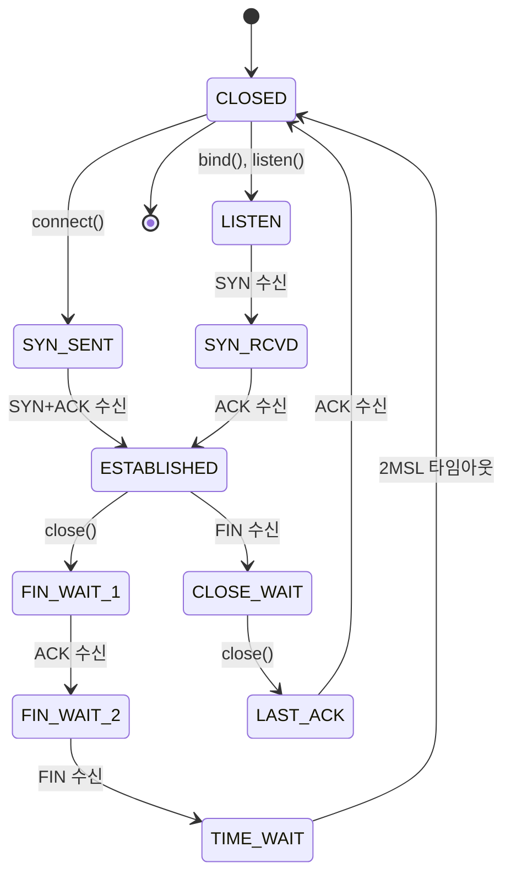

## 🌐 개요 (Overview)

**Socket (소켓)** 은 프로세스 간 통신(IPC)을 위한 엔드포인트(endpoint)입니다. "socket"이라는 용어는 맥락에 따라 다양한 의미로 사용되지만, 핵심 개념은 **"데이터를 주고받을 수 있는 통신 채널"** 입니다.

## 🎯 Socket의 다양한 의미

### 1. 개념적 정의 (Conceptual)

**통신의 끝점 (Communication Endpoint)**
- 네트워크 통신에서 데이터를 송수신하는 양쪽 끝
- 전화기의 수화기와 유사한 개념


### 2. 프로그래밍 인터페이스 (Programming Interface)

**Berkeley Sockets API**
- UNIX에서 시작된 네트워크 프로그래밍 표준 API
- `socket()`, `bind()`, `listen()`, `accept()`, `connect()` 등의 시스템 콜

```c
// C 언어 예시
int sockfd = socket(AF_INET, SOCK_STREAM, 0);  // 소켓 생성
```

### 3. 파일 시스템 객체 (Filesystem Object)

**Unix Domain Socket 파일**
- 파일시스템에 존재하는 특수 파일 타입 (`s`)
- 로컬 프로세스 간 통신에 사용

```bash
# Docker 소켓 예시
ls -l /var/run/docker.sock
# srwxrwxrwx 1 root docker 0 Dec 22 18:00 /var/run/docker.sock
```

### 4. 네트워크 식별자 (Network Identifier)

**IP:Port 조합**
- 네트워크 상에서 특정 프로세스를 식별
- 예: `192.168.1.100:8080`

```plaintext
Socket = IP Address + Port Number + Protocol
예: 192.168.1.100:8080 (TCP)
```

## 📊 Socket의 분류

### 1. 도메인 (Domain) 기준

#### AF_INET (Internet Socket)

**특징**:
- IPv4 네트워크 통신
- 인터넷을 통한 원격 통신
- IP 주소 + 포트 번호로 식별

**예시**:
```c
struct sockaddr_in addr;
addr.sin_family = AF_INET;
addr.sin_port = htons(8080);
addr.sin_addr.s_addr = inet_addr("192.168.1.100");
```

**사용 사례**:
- 웹 서버 (HTTP/HTTPS)
- 데이터베이스 클라이언트
- API 서버

#### AF_INET6 (IPv6 Socket)

**특징**:
- IPv6 네트워크 통신
- 128비트 주소 체계

**예시**:
```bash
# IPv6 리스닝
nc -6 -l 8080
```

#### AF_UNIX (Unix Domain Socket)

**특징**:
- 같은 시스템 내 프로세스 간 통신
- 파일시스템 경로로 식별
- 네트워크 오버헤드 없음 (더 빠름)
- 파일 권한으로 접근 제어

**예시**:
```c
struct sockaddr_un addr;
addr.sun_family = AF_UNIX;
strcpy(addr.sun_path, "/tmp/my.sock");
```

**실제 사용 예**:
```bash
# Docker
/var/run/docker.sock

# MySQL
/var/run/mysqld/mysqld.sock

# X11
/tmp/.X11-unix/X0

# systemd
/run/systemd/private
```

---

### 2. 타입 (Type) 기준

#### SOCK_STREAM (TCP Socket)

**특징**:
- ✅ 연결 지향 (Connection-oriented)
- ✅ 신뢰성 보장 (데이터 순서, 재전송)
- ✅ 양방향 통신 (Full-duplex)
- ❌ 오버헤드 존재 (핸드셰이크, 재전송)

**동작 방식**:


**사용 사례**:
- HTTP/HTTPS (웹)
- SSH (원격 접속)
- 데이터베이스 연결
- 파일 전송 (FTP)

**코드 예시 (Python)**:
```python
import socket

# 서버
server = socket.socket(socket.AF_INET, socket.SOCK_STREAM)
server.bind(('0.0.0.0', 8080))
server.listen(5)
client_sock, addr = server.accept()
data = client_sock.recv(1024)

# 클라이언트
client = socket.socket(socket.AF_INET, socket.SOCK_STREAM)
client.connect(('192.168.1.100', 8080))
client.send(b'Hello')
```

#### SOCK_DGRAM (UDP Socket)

**특징**:
- ✅ 비연결 (Connectionless)
- ✅ 낮은 오버헤드 (빠름)
- ✅ 브로드캐스트/멀티캐스트 지원
- ❌ 신뢰성 없음 (패킷 손실, 순서 보장 안 됨)

**동작 방식**:


**사용 사례**:
- DNS 쿼리
- 실시간 스트리밍 (음성, 영상)
- 게임 서버
- IoT 센서 데이터

**코드 예시 (Python)**:
```python
import socket

# 서버
server = socket.socket(socket.AF_INET, socket.SOCK_DGRAM)
server.bind(('0.0.0.0', 8080))
data, addr = server.recvfrom(1024)

# 클라이언트
client = socket.socket(socket.AF_INET, socket.SOCK_DGRAM)
client.sendto(b'Hello', ('192.168.1.100', 8080))
```

#### SOCK_RAW (Raw Socket)

**특징**:
- 커널의 프로토콜 처리를 우회
- IP 헤더 직접 조작 가능
- **root 권한 필요**

**사용 사례**:
- 네트워크 스캐너 (nmap)
- 패킷 스니퍼 (tcpdump, Wireshark)
- 커스텀 프로토콜 구현

```python
import socket

# ICMP 패킷 전송 (ping 구현)
sock = socket.socket(socket.AF_INET, socket.SOCK_RAW, socket.IPPROTO_ICMP)
```

---

### 3. 프로토콜 (Protocol) 기준

| 프로토콜 | 타입 | 포트 예시 | 용도 |
|---------|------|----------|------|
| **TCP** | SOCK_STREAM | 80 (HTTP), 443 (HTTPS) | 웹, 파일 전송 |
| **UDP** | SOCK_DGRAM | 53 (DNS), 123 (NTP) | DNS, 스트리밍 |
| **ICMP** | SOCK_RAW | - | Ping, 네트워크 진단 |
| **SCTP** | SOCK_STREAM | - | 통신 시스템 |

## 🔍 Socket 상태 확인

### ss (Socket Statistics)

```bash
# 모든 소켓 확인
ss -a

# TCP 소켓만
ss -t

# UDP 소켓만
ss -u

# 리스닝 소켓
ss -l

# 프로세스 정보 포함
ss -p

# 숫자로 표시 (DNS 조회 안 함)
ss -n

# 조합 (리스닝 TCP 소켓 + 프로세스)
ss -tlnp
```

**출력 예시**:
```bash
$ ss -tlnp
State   Recv-Q Send-Q Local Address:Port  Peer Address:Port Process
LISTEN  0      128    0.0.0.0:22          0.0.0.0:*     users:(("sshd",pid=1234,fd=3))
LISTEN  0      128    0.0.0.0:80          0.0.0.0:*     users:(("nginx",pid=5678,fd=6))
```

### netstat (레거시)

```bash
# ss와 동일한 기능 (구형 시스템)
netstat -tlnp
```

### lsof (List Open Files)

```bash
# 특정 포트 사용 프로세스 찾기
lsof -i :8080

# Unix Domain Socket 찾기
lsof -U

# 특정 프로세스의 소켓
lsof -p 1234 | grep sock
```

## 💡 실무 활용 예시

### 1. Unix Domain Socket으로 IPC

**시나리오**: 웹 서버 ↔ 애플리케이션 서버 통신

```nginx
# Nginx 설정
upstream app {
    server unix:/var/run/app.sock;
}

server {
    location / {
        proxy_pass http://app;
    }
}
```

```python
# Python Flask 앱
from flask import Flask
import socket

app = Flask(__name__)

if __name__ == '__main__':
    sock = socket.socket(socket.AF_UNIX, socket.SOCK_STREAM)
    sock.bind('/var/run/app.sock')
    app.run(sock=sock)
```

**장점**:
- TCP보다 30-50% 빠름 (네트워크 스택 우회)
- 파일 권한으로 보안 제어
- 로컬 통신에 최적화

### 2. TCP Socket으로 원격 통신

**시나리오**: 마이크로서비스 간 API 호출

```python
# 서비스 A (서버)
import socket

server = socket.socket(socket.AF_INET, socket.SOCK_STREAM)
server.setsockopt(socket.SOL_SOCKET, socket.SO_REUSEADDR, 1)
server.bind(('0.0.0.0', 8080))
server.listen(5)

while True:
    client, addr = server.accept()
    data = client.recv(1024)
    client.send(b'Response: ' + data)
    client.close()
```

```python
# 서비스 B (클라이언트)
import socket

client = socket.socket(socket.AF_INET, socket.SOCK_STREAM)
client.connect(('service-a.internal', 8080))
client.send(b'Request data')
response = client.recv(1024)
client.close()
```

### 3. UDP Socket으로 브로드캐스트

**시나리오**: 로컬 네트워크에서 서비스 발견

```python
import socket

# 브로드캐스트 송신
sock = socket.socket(socket.AF_INET, socket.SOCK_DGRAM)
sock.setsockopt(socket.SOL_SOCKET, socket.SO_BROADCAST, 1)
sock.sendto(b'DISCOVER', ('255.255.255.255', 9999))

# 브로드캐스트 수신
sock = socket.socket(socket.AF_INET, socket.SOCK_DGRAM)
sock.bind(('', 9999))
data, addr = sock.recvfrom(1024)
print(f"Received from {addr}: {data}")
```

### 4. Docker와 Unix Domain Socket

```bash
# Docker 데몬과 통신
curl --unix-socket /var/run/docker.sock http://localhost/containers/json

# Docker CLI가 내부적으로 하는 일
docker ps
# → Unix socket으로 Docker 데몬에 API 요청
```

### 5. MySQL Unix Socket 연결

```bash
# TCP 연결 (느림)
mysql -h 127.0.0.1 -P 3306 -u root -p

# Unix Socket 연결 (빠름)
mysql -S /var/run/mysqld/mysqld.sock -u root -p
```

**성능 비교**:
```bash
# 벤치마크
sysbench --mysql-socket=/var/run/mysqld/mysqld.sock ...
# → Unix Socket: 50,000 TPS

sysbench --mysql-host=127.0.0.1 --mysql-port=3306 ...
# → TCP Loopback: 35,000 TPS
```

## 🔧 Socket 옵션 (Socket Options)

### SO_REUSEADDR

**문제**: 서버 재시작 시 "Address already in use" 오류

```python
import socket

sock = socket.socket(socket.AF_INET, socket.SOCK_STREAM)
sock.setsockopt(socket.SOL_SOCKET, socket.SO_REUSEADDR, 1)
sock.bind(('0.0.0.0', 8080))
```

### SO_KEEPALIVE

**용도**: 장시간 유휴 연결 감지

```python
sock.setsockopt(socket.SOL_SOCKET, socket.SO_KEEPALIVE, 1)
sock.setsockopt(socket.IPPROTO_TCP, socket.TCP_KEEPIDLE, 60)
sock.setsockopt(socket.IPPROTO_TCP, socket.TCP_KEEPINTVL, 10)
sock.setsockopt(socket.IPPROTO_TCP, socket.TCP_KEEPCNT, 3)
```

### TCP_NODELAY

**용도**: Nagle 알고리즘 비활성화 (지연 감소)

```python
sock.setsockopt(socket.IPPROTO_TCP, socket.TCP_NODELAY, 1)
```

## 🏗️ Socket 상태 다이어그램 (TCP)



**상태 확인**:
```bash
ss -tan | grep ESTABLISHED
ss -tan | grep TIME_WAIT
```

## ⚠️ 주의사항 및 Best Practices

### 1. Unix Domain Socket

```bash
# ✅ DO
- 로컬 IPC에는 Unix Socket 사용 (성능 우수)
- 소켓 파일 권한 설정
chmod 660 /var/run/app.sock
chown www-data:www-data /var/run/app.sock

- 종료 시 소켓 파일 삭제
trap "rm -f /var/run/app.sock" EXIT

# ❌ DON'T
- 원격 통신에 Unix Socket 사용 (불가능)
- 소켓 파일을 /tmp에 생성 (보안 위험)
```

### 2. TCP Socket

```bash
# ✅ DO
- SO_REUSEADDR 설정 (빠른 재시작)
- 타임아웃 설정 (무한 대기 방지)
sock.settimeout(30)

- 연결 풀 사용 (재사용)

# ❌ DON'T
- 소켓 닫지 않고 종료 (리소스 누수)
- 에러 처리 없이 recv() (블로킹)
```

### 3. UDP Socket

```bash
# ✅ DO
- 패킷 손실 대비 재전송 로직
- 패킷 크기 제한 (MTU 고려, 보통 1472 bytes)

# ❌ DON'T
- 신뢰성 필요한 데이터 전송
- 대용량 파일 전송
```

### 4. 보안

```bash
# ✅ DO
- Unix Socket 파일 권한 최소화
- 방화벽 설정 (iptables, firewalld)
iptables -A INPUT -p tcp --dport 8080 -j ACCEPT

- TLS/SSL 사용 (민감 데이터)

# ❌ DON'T
- 0.0.0.0으로 바인딩 (불필요한 노출)
- 인증 없이 외부 접근 허용
```

## 🔗 연결 문서 (Related Documents)

- [[file-types-links]] - Unix Domain Socket 파일 타입
- [[network-commands]] - `ss`, `netstat` 명령어
- [[container-basics]] - Docker와 Unix Socket 활용
