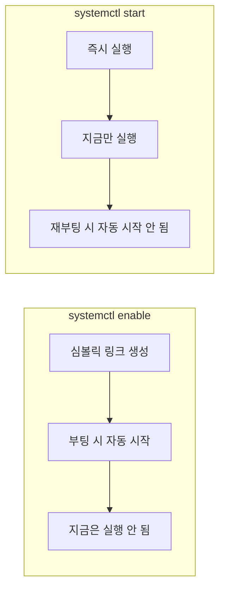
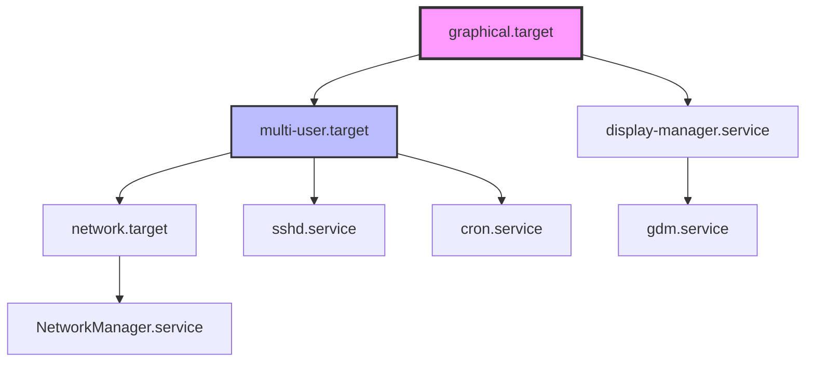
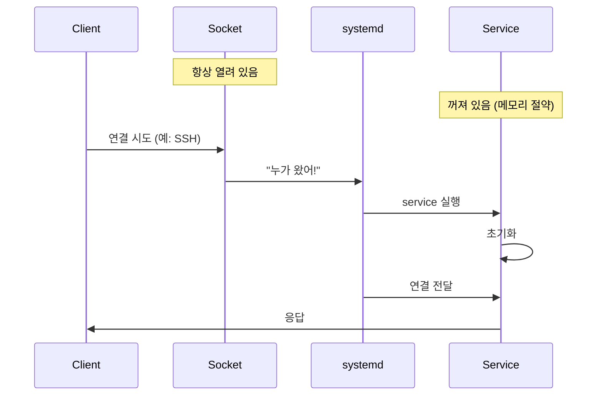
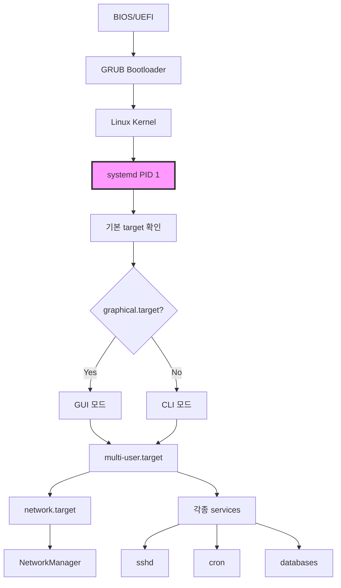

## 🌐 개요 (Overview)

**systemd**는 Linux의 init 시스템이자 서비스 관리자입니다. 시스템 부팅 시 가장 먼저 실행되며(PID 1), 모든 프로세스와 서비스를 관리합니다.

## 🎯 핵심 개념 (Core Concepts)

### 한 줄 요약

| 용어 | 의미 |
|------|------|
| **unit** | systemd가 관리하는 **모든 대상의 공통 이름** |
| **service** | 실제로 실행되는 **프로그램(데몬)** |
| **target** | 여러 unit을 한 번에 묶은 **목표 상태(단계)** |
| **socket** | 요청이 들어올 때 service를 켜주는 **초인종** |

### 비유로 이해하기 (학교 비유 🏫)

```plaintext
systemd = 학교 관리자

역할:
- 부팅할 때
- 어떤 프로그램을
- 어떤 순서로
- 언제 시작/종료할지 관리
```

## 📦 1. Unit (유닛)

### 정의

**unit = systemd가 관리하는 최소 단위**

모든 것이 unit입니다:
- 웹서버 (service)
- 네트워크 (service)
- 마운트된 디스크 (mount)
- 특정 상태 (target)
- 소켓 (socket)

### Unit 종류

| 종류 | 확장자 | 설명 | 예시 |
|------|--------|------|------|
| **service** | `.service` | 실행되는 프로그램 | `nginx.service` |
| **target** | `.target` | unit 묶음/상태 | `graphical.target` |
| **socket** | `.socket` | 소켓 활성화 | `sshd.socket` |
| **mount** | `.mount` | 마운트 포인트 | `home.mount` |
| **timer** | `.timer` | 스케줄러 (cron 대체) | `backup.timer` |
| **device** | `.device` | 디바이스 | `dev-sda.device` |
| **path** | `.path` | 파일 감시 | `config.path` |

### Unit 파일 위치

```bash
# 시스템 기본 unit
/lib/systemd/system/
/usr/lib/systemd/system/

# 관리자가 추가한 unit (우선순위 높음)
/etc/systemd/system/

# 런타임 unit (재부팅 시 삭제)
/run/systemd/system/
```

### Unit 파일 구조

```ini
# /etc/systemd/system/myapp.service

[Unit]
Description=My Application
Documentation=https://example.com/docs
After=network.target          # 네트워크 이후 시작
Requires=postgresql.service   # PostgreSQL 필수
Wants=redis.service           # Redis 선호 (없어도 됨)

[Service]
Type=simple
User=www-data
Group=www-data
WorkingDirectory=/opt/myapp
ExecStart=/opt/myapp/bin/server
ExecReload=/bin/kill -HUP $MAINPID
Restart=always
RestartSec=10

[Install]
WantedBy=multi-user.target    # 이 target에 포함
```

## 🔧 2. Service (서비스)

### 정의

**service = 실제로 실행되는 프로그램 (unit의 한 종류)**

백그라운드에서 계속 실행되는 데몬(daemon)입니다.

### 예시

```bash
# 웹서버
nginx.service

# 데이터베이스
postgresql.service
mysql.service

# 원격 접속
sshd.service

# 도커
docker.service
```

### Service 타입

| Type | 설명 | 사용 사례 |
|------|------|----------|
| **simple** | ExecStart가 메인 프로세스 | 대부분의 서비스 |
| **forking** | 부모가 fork 후 종료 | 전통적 데몬 (Apache, Nginx) |
| **oneshot** | 한 번 실행 후 종료 | 초기화 스크립트 |
| **notify** | 준비 완료 신호 전송 | systemd 인식 서비스 |
| **dbus** | D-Bus 이름 획득 | D-Bus 서비스 |
| **idle** | 다른 작업 완료 후 실행 | 낮은 우선순위 작업 |

### Service 명령어

```bash
# 시작/중지/재시작
systemctl start nginx
systemctl stop nginx
systemctl restart nginx

# 설정 리로드 (다운타임 없음)
systemctl reload nginx

# 상태 확인
systemctl status nginx

# 부팅 시 자동 시작
systemctl enable nginx        # 심볼릭 링크 생성
systemctl enable --now nginx  # 활성화 + 즉시 시작

# 자동 시작 비활성화
systemctl disable nginx
```

### enable vs start 차이



**실무 권장**:
```bash
# 둘 다 해야 함!
systemctl enable nginx   # 부팅 시 자동 시작
systemctl start nginx    # 지금 시작

# 또는 한 번에
systemctl enable --now nginx
```

## 🎯 3. Target (타겟)

### 정의

**target = "이 상태가 되려면 이것들 다 켜!" 목록**

- 자기 자신은 아무 것도 실행 안 함
- 그냥 service 묶음 목록
- 옛날 runlevel의 현대적 대체

### 비유

```plaintext
🎯 target = "학교의 특정 상황"

수업 시작 상태 → 필요: 교실, 선생님, 학생
시험 상태      → 필요: 교실, 감독관, 문제지
방학 상태      → 필요: 경비, 청소
```

### 주요 Target

| Target | 옛날 Runlevel | 설명 |
|--------|--------------|------|
| `poweroff.target` | 0 | 시스템 종료 |
| `rescue.target` | 1 | 단일 사용자 모드 (복구) |
| `multi-user.target` | 2, 3, 4 | CLI 멀티유저 (서버 모드) |
| `graphical.target` | 5 | GUI 로그인 화면 |
| `reboot.target` | 6 | 재부팅 |

### graphical.target 예시



**의미**:
```plaintext
graphical.target에 도달하려면:
1. multi-user.target 먼저 (네트워크, SSH 등)
2. display-manager.service (로그인 화면)
3. 기타 필요한 서비스들

→ systemd가 자동으로 순서대로 실행
```

### multi-user.target 예시

```bash
# 서버 모드 (GUI 없음)
# 포함되는 것들:
- 네트워크
- SSH
- 각종 서버 서비스 (nginx, mysql 등)
- cron
```

### Target 명령어

```bash
# 현재 기본 target 확인
systemctl get-default
# graphical.target

# 기본 target 변경
systemctl set-default multi-user.target  # CLI 모드
systemctl set-default graphical.target   # GUI 모드

# 즉시 target으로 전환
systemctl isolate multi-user.target
systemctl isolate rescue.target          # 복구 모드

# target에 포함된 unit 확인
systemctl list-dependencies graphical.target
```

## 🔌 4. Socket Activation (소켓 활성화)

### 정의

**socket = "누가 접속하면 그때 service를 켜주는 초인종"**

### 비유 (집 비유 🏠)

```plaintext
service = 집 안에서 일하는 사람
  - 평소엔 자고 있음 (꺼져 있을 수 있음)
  - 켜져 있으면 계속 자원 사용

socket = 초인종
  - 항상 켜져 있음
  - 누가 누르면 → 사람(service) 깨움
```

### 동작 방식



### 왜 Socket Activation을 쓰나?

#### 1️⃣ 자원 절약

```bash
# 전통 방식
sshd.service 항상 실행 중
→ 아무도 안 들어와도 메모리 사용

# Socket 방식
sshd.socket만 열어둠 (22번 포트)
sshd.service는 꺼져 있음
→ 접속 시도 시에만 실행
```

#### 2️⃣ 부팅 빨라짐

```bash
# 전통 방식
부팅 시 모든 서비스 실행
→ 느림

# Socket 방식
socket만 열어두고 service는 나중에
→ 빠름
```

#### 3️⃣ 병렬 부팅

```bash
# socket을 먼저 열어두면
# 의존성 있는 서비스들이 동시에 시작 가능
# (socket이 준비되었다고 간주)
```

### Socket Activation 예시

#### SSH 예제

```bash
# 1. Socket Unit 파일
# /lib/systemd/system/sshd.socket
[Unit]
Description=OpenSSH Server Socket
Before=sshd.service

[Socket]
ListenStream=22          # 22번 포트 대기
Accept=no                # systemd가 연결 관리

[Install]
WantedBy=sockets.target

# 2. Service Unit 파일
# /lib/systemd/system/sshd.service
[Unit]
Description=OpenSSH Server
After=network.target

[Service]
ExecStart=/usr/sbin/sshd -D
ExecReload=/bin/kill -HUP $MAINPID
KillMode=process
Restart=on-failure

# 3. Socket 활성화
systemctl enable sshd.socket
systemctl start sshd.socket

# 4. 확인
systemctl status sshd.socket  # 활성
systemctl status sshd.service # 비활성 (아직 접속 없음)

# 5. SSH 접속 시도
ssh user@localhost

# 6. 다시 확인
systemctl status sshd.service # 활성! (자동 실행됨)
```

#### Docker 예제

```bash
# Docker도 socket activation 사용
ls -l /var/run/docker.sock
# srwxrwxrwx 1 root docker 0 ... /var/run/docker.sock

# Docker CLI가 하는 일:
docker ps
# → Unix socket으로 Docker 데몬에 요청
# → 데몬이 꺼져있으면 systemd가 자동 실행
```

#### Custom Socket Activation

```bash
# 1. Socket Unit
# /etc/systemd/system/myapp.socket
[Unit]
Description=My App Socket

[Socket]
ListenStream=/run/myapp.sock  # Unix Domain Socket
SocketMode=0660
SocketUser=www-data
SocketGroup=www-data

[Install]
WantedBy=sockets.target

# 2. Service Unit
# /etc/systemd/system/myapp.service
[Unit]
Description=My App
Requires=myapp.socket

[Service]
Type=notify
ExecStart=/opt/myapp/server
StandardInput=socket        # socket에서 입력 받음

# 3. 활성화
systemctl enable --now myapp.socket
```

### Socket vs Service 비교

| 항목 | Socket Activation | 항상 실행 |
|------|------------------|----------|
| **메모리** | 절약 (필요 시만) | 항상 사용 |
| **부팅 속도** | 빠름 | 느림 |
| **첫 연결 지연** | 약간 있음 (서비스 시작) | 없음 |
| **사용 사례** | 가끔 사용하는 서비스 | 항상 필요한 서비스 |

## 🔄 부팅 프로세스 (Boot Process)

### 전체 흐름



### 실제 부팅 순서

```bash
1. 컴퓨터 켜짐
   ↓
2. systemd 실행 (PID 1)
   ↓
3. systemd: "기본 target이 뭐지?"
   systemctl get-default
   → graphical.target
   ↓
4. graphical.target에 포함된 것들 확인
   systemctl list-dependencies graphical.target
   ↓
5. 의존성 순서대로 실행
   - network.target
   - multi-user.target
   - display-manager.service
   - 기타 서비스들
   ↓
6. 결과: 로그인 화면 등장
```

### 부팅 분석

```bash
# 부팅 시간 확인
systemd-analyze
# Startup finished in 2.5s (kernel) + 8.3s (userspace) = 10.8s

# 각 서비스별 시간
systemd-analyze blame
# 3.2s NetworkManager.service
# 2.1s mysql.service
# 1.8s nginx.service

# 크리티컬 체인 (병목 지점)
systemd-analyze critical-chain
# graphical.target @8.3s
#   └─multi-user.target @8.2s
#     └─network.target @5.1s
#       └─NetworkManager.service @2.0s +3.1s

# 그래프 생성
systemd-analyze plot > boot.svg
```

## 🔍 Unit 의존성 (Dependencies)

### 의존성 종류

| 지시어 | 의미 | 실패 시 |
|--------|------|---------|
| **Requires** | 필수 의존성 | 함께 실패 |
| **Wants** | 선호 의존성 | 계속 진행 |
| **Requisite** | 필수 (이미 실행 중이어야 함) | 즉시 실패 |
| **BindsTo** | 강한 의존성 | 함께 중지 |
| **PartOf** | 부분 관계 | 함께 중지/재시작 |

### 순서 지시어

| 지시어 | 의미 |
|--------|------|
| **After** | 이후에 시작 |
| **Before** | 이전에 시작 |

### 예시

```ini
[Unit]
Description=My Web App
After=network.target postgresql.service
Requires=postgresql.service
Wants=redis.service

# 의미:
# 1. network.target과 postgresql.service 이후에 시작
# 2. postgresql.service 필수 (없으면 실패)
# 3. redis.service 선호 (없어도 시작)
```

### 의존성 확인

```bash
# 의존성 트리
systemctl list-dependencies nginx

# 역의존성 (누가 나를 필요로 하나?)
systemctl list-dependencies --reverse nginx

# 모든 의존성 (재귀)
systemctl list-dependencies --all nginx
```

## 💡 실무 활용 예시

### 1. Custom Service 생성

```bash
# /etc/systemd/system/myapp.service
[Unit]
Description=My Python Application
After=network.target postgresql.service
Requires=postgresql.service

[Service]
Type=simple
User=myapp
Group=myapp
WorkingDirectory=/opt/myapp
Environment="PYTHONUNBUFFERED=1"
Environment="DATABASE_URL=postgresql://localhost/mydb"
ExecStart=/opt/myapp/venv/bin/python server.py
ExecReload=/bin/kill -HUP $MAINPID
Restart=always
RestartSec=10
StandardOutput=journal
StandardError=journal

[Install]
WantedBy=multi-user.target

# 활성화
systemctl daemon-reload
systemctl enable --now myapp
```

### 2. Timer로 Cron 대체

```bash
# /etc/systemd/system/backup.service
[Unit]
Description=Backup Service

[Service]
Type=oneshot
ExecStart=/usr/local/bin/backup.sh

# /etc/systemd/system/backup.timer
[Unit]
Description=Backup Timer

[Timer]
OnCalendar=daily              # 매일
OnCalendar=*-*-* 02:00:00     # 매일 새벽 2시
Persistent=true               # 놓친 실행 보상

[Install]
WantedBy=timers.target

# 활성화
systemctl enable --now backup.timer

# 확인
systemctl list-timers
```

### 3. 서비스 격리 (Isolation)

```bash
[Service]
# 보안 강화
PrivateTmp=yes                # 독립 /tmp
ProtectSystem=strict          # 읽기 전용 /usr, /boot
ProtectHome=yes               # /home 접근 불가
NoNewPrivileges=yes           # 권한 상승 불가

# 리소스 제한
MemoryLimit=512M              # 메모리 제한
CPUQuota=50%                  # CPU 50%로 제한

# 네트워크 격리
PrivateNetwork=yes            # 네트워크 격리
```

### 4. 서비스 디버깅

```bash
# 1. 상태 확인
systemctl status myapp

# 2. 로그 확인
journalctl -u myapp -n 100 --no-pager

# 3. 실시간 로그
journalctl -u myapp -f

# 4. 에러만
journalctl -u myapp -p err

# 5. 설정 검증
systemd-analyze verify /etc/systemd/system/myapp.service

# 6. 의존성 확인
systemctl list-dependencies myapp
```

## 🔗 관계 정리 (최종 요약)

```plaintext
systemd (PID 1)
 │
 ├─ unit (관리 대상의 공통 이름)
 │   │
 │   ├─ service (실행되는 프로그램)
 │   │   ├─ nginx.service
 │   │   ├─ mysql.service
 │   │   └─ sshd.service
 │   │
 │   ├─ target (service 묶음 / 목표 상태)
 │   │   ├─ graphical.target
 │   │   │   ├─ multi-user.target
 │   │   │   └─ display-manager.service
 │   │   └─ multi-user.target
 │   │       ├─ network.target
 │   │       └─ sshd.service
 │   │
 │   ├─ socket (초인종)
 │   │   ├─ sshd.socket → sshd.service
 │   │   └─ docker.socket → docker.service
 │   │
 │   ├─ timer (스케줄러)
 │   │   └─ backup.timer → backup.service
 │   │
 │   └─ mount (마운트)
 │       └─ home.mount
```

### 한 문장으로 다시

- **unit**: systemd가 관리하는 모든 것의 공통 이름
- **service**: 실제로 실행되는 프로그램
- **target**: 여러 service를 묶은 "도달해야 할 상태"
- **socket**: 요청 시 service를 켜주는 "초인종"

## ⚠️ 주의사항 및 Best Practices

### ✅ DO

```bash
# 1. daemon-reload 잊지 말기
systemctl daemon-reload  # unit 파일 변경 후 필수

# 2. enable + start 둘 다
systemctl enable --now myapp

# 3. 로그 확인 습관
journalctl -u myapp -f

# 4. 의존성 명시
After=network.target
Requires=postgresql.service

# 5. Restart 정책 설정
Restart=always
RestartSec=10
```

### ❌ DON'T

```bash
# 1. enable만 하고 start 안 함
systemctl enable myapp  # 재부팅 전까지 안 켜짐!

# 2. daemon-reload 안 함
# unit 파일 수정 후 반드시 필요

# 3. root로 실행
# User=, Group= 지정하여 권한 최소화

# 4. 에러 처리 없음
# Restart=, RestartSec= 설정
```

## 🔗 연결 문서 (Related Documents)

- [[service-management-commands]] - systemctl, journalctl 명령어
- [[sockets]] - Unix Domain Socket과 Socket Activation
- [[process-job-control-commands]] - 프로세스 관리
