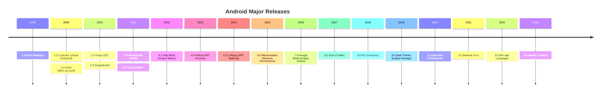

## Android 기술 진화

상위 노트: [[android-evolution-history]]

안드로이드는 2008 년 첫 출시 이후 모바일 환경의 변화에 맞춰 지속적으로 진화해왔다. 이 문서는 주요 기술적 전환점과 그 배경을 정리한다.

### Timeline

```mermaid
timeline
    title Android Major Releases
    2008 : 1.0 (First Release)
    2009 : 1.5 Cupcake (Virtual Keyboard)
         : 2.0 Eclair (Multi-account)
    2010 : 2.2 Froyo (JIT)
         : 2.3 Gingerbread
    2011 : 3.0 Honeycomb (Tablet)
         : 4.0 ICS (Unified)
    2012 : 4.1 Jelly Bean (Project Butter)
    2013 : 4.4 KitKat (ART Preview)
    2014 : 5.0 Lollipop (ART, Material)
    2015 : 6.0 Marshmallow (Runtime Permissions)
    2016 : 7.0 Nougat (Multi-window, Vulkan)
    2017 : 8.0 Oreo (Treble)
    2018 : 9.0 Pie (Gestures)
    2019 : 10 (Dark Theme, Scoped Storage)
    2020 : 11 (One-time Permissions)
    2021 : 12 (Material You)
    2022 : 13 (Per-app Language)
    2023 : 14 (Health Connect)
```

---
