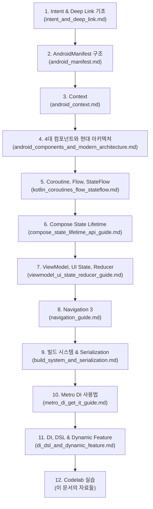

# 안드로이드 학습 자료 모음

이 문서는 AndroidManifest, Context, 4대 컴포넌트, Coroutine/Flow, 인텐트/인텐트 필터, 딥 링크, Navigation, 빌드 시스템 등 핵심 개념을 실습하며 마스터할 수 있는 **구글 공식 Codelab, 공식 문서, 영상 자료**를 정리합니다.

---

## 1. 구글 공식 Codelabs (실습 위주)

> [!NOTE]
> 구글 코드랩 시스템에서는 `AndroidManifest.xml`만을 단독으로 가르치는 기초 코드랩은 제공하지 않습니다. 매니페스트는 앱의 구성 요소를 등록하는 '설정 장부'이기 때문입니다. 아래 코드랩들을 통해 매니페스트를 자연스럽게 마스터할 수 있습니다.

### 1-1. 딥 링크 및 데이터 연동

| 코드랩 | 매니페스트 관점에서 배우는 내용 |
|:---|:---|
| **앱 링크 및 딥 링크 구현** ([검색: "Android App Links"](https://codelabs.developers.google.com/?product=android)) | `<action>`, `<category>`, `<data>` 태그의 실무 배치, `android:autoVerify` 검증 |
| **웹-앱 인증 공유** ([Seamless Credential Sharing](https://codelabs.developers.google.com/seamless-credential-sharing)) | Digital Asset Links(DAL) 설정, 패스키(Passkey) 웹-앱 교차 사용 |

#### 🔍 Credential Sharing 코드랩 핵심 요약

이 코드랩은 **"같은 회사의 여러 웹사이트(shopping.com, pay.com)와 Android 앱이 비밀번호/패스키를 공유하도록 묶어주는 기술"**을 다룹니다.

개발자가 세팅해야 하는 것:
1. **웹사이트**: `/.well-known/assetlinks.json`에 앱과의 공유 선언 JSON 업로드
2. **앱**: `AndroidManifest.xml`에 웹사이트와의 공유 선언
3. **구글 플레이 콘솔**: Credential Sharing 토글 활성화

> [!IMPORTANT]
> 비밀번호 없는 시대(Passwordless)의 핵심 기술인 **패스키(Passkey)**는 기술 표준상 생성 시 지정된 도메인이 아니면 암호학적으로 작동 자체가 불가능합니다. 이 설정 없이는 웹에서 만든 패스키를 앱에서 사용할 수 없습니다.

### 1-2. 인텐트(Intent)와 시스템 컴포넌트 확장

| 코드랩 | 매니페스트 관점에서 배우는 내용 |
|:---|:---|
| **메시징 및 People API 활용** (Jetchat 샘플 앱) | 대화형 알림, 버블(Bubbles), 공유 인텐트(`android.intent.action.SEND`) 처리 |
| **구글 어시스턴트 App Actions 연동** | 음성 명령 → 앱 딥 링크 비행 메커니즘, `shortcuts.xml` 인텐트 매핑 |

### 1-3. 권한 및 백그라운드 보안

| 코드랩 | 매니페스트 관점에서 배우는 내용 |
|:---|:---|
| **위치 정보 접근** (Kotlin) | `<uses-permission>` 권한 선언, Android 10~12 권한 정교화 |
| **접근성 서비스 개발** | `<service>` 태그, `BIND_ACCESSIBILITY_SERVICE` 권한, `<meta-data>` 활용 |

### 1-4. 멀티 디바이스 확장 (Wear OS)

| 코드랩 | 매니페스트 관점에서 배우는 내용 |
|:---|:---|
| **Wear OS Jetpack Compose** | `<uses-feature android:name="android.hardware.type.watch" />` 선언 |
| **Data Layer API Service** | 폰-워치 간 `WearableListenerService` 등록, 기기 간 딥 링크 메커니즘 |

### 1-5. 데이터 분석 (Google Analytics)

| 코드랩 | 매니페스트 관점에서 배우는 내용 |
|:---|:---|
| **Firebase Android Codelab** (Analytics 포함) | SDK가 백그라운드 데이터 수집을 위해 매니페스트에 자동 주입하는 권한(`INTERNET`, `ACCESS_NETWORK_STATE`) |

---

## 2. 구글 공식 개발자 문서 (개념 핵심 가이드)

| 문서 | 핵심 내용 |
|:---|:---|
| [Context API reference](https://developer.android.com/reference/android/content/Context) | Android 코드가 리소스, 저장소, 시스템 서비스, 컴포넌트 실행에 접근하는 기본 환경 객체 |
| [Intents and Intent Filters 공식 가이드](https://developer.android.com/guide/components/intents-filters) | 암시적/명시적 인텐트 차이, 시스템 매칭 원리 |
| [`<intent-filter>` 태그 레퍼런스](https://developer.android.com/guide/topics/manifest/intent-filter-element) | 매니페스트 속성 상세 명세 (예: `android:priority`) |
| [ViewModel overview](https://developer.android.com/topic/libraries/architecture/viewmodel) | 화면 단위 state holder, configuration change 대응, UI state 노출 |
| [UI layer](https://developer.android.com/topic/architecture/ui-layer) | UDF, UI state 생산, user event 처리, ViewModel 책임 |
| [Navigation 3 시작하기](https://developer.android.com/guide/navigation/navigation-3/get-started) | 최신 Navigation 3 설정, `libs.versions.toml` 의존성 |
| [Metro 공식 문서](https://zacsweers.github.io/metro/latest/) | Kotlin Multiplatform 컴파일 타임 DI, Dependency Graph, Provides, Scope |

---

## 3. 추천 영상 자료

| 영상 | 내용 |
|:---|:---|
| **[A Compose State of Mind - Using Jetpack Compose's Automatic State Observation](https://www.youtube.com/watch?v=rmv2ug-wW4U)** (Android Developers) | Compose Runtime이 State 읽기/쓰기를 자동 추적해 recomposition을 예약하는 방식. Flutter 개발자 관점 해설은 [[jetpack-compose-automatic-state-observation-for-flutter-developers]] |
| **[Intents & Intent Filters - Android Basics 2023](https://www.youtube.com/results?search_query=Philipp+Lackner+Intents+Intent+Filters)** (Philipp Lackner) | Jetpack Compose 환경에서 인텐트 필터를 연동하여 Activity를 제어하는 방식 |
| **[In-depth on Metro — with Zac Sweers](https://www.youtube.com/results?search_query=In-depth+on+Metro+Zac+Sweers)** (Code with the Italians) | Metro DI의 내부 동작, KAPT/KSP → 컴파일러 플러그인 전환, 빌드 속도 벤치마크 |

---

## 4. 학습 순서 추천

> [!TIP]
> Codelab 실습 시 단순 코드 복사-붙여넣기보다는 **"이 설정을 추가했을 때 `AndroidManifest.xml` 장부에 어떤 변화가 생기고, 안드로이드 OS가 이를 어떻게 인식할까?"**라는 관점으로 접근하면 아키텍처 이해에 큰 도움이 됩니다.
