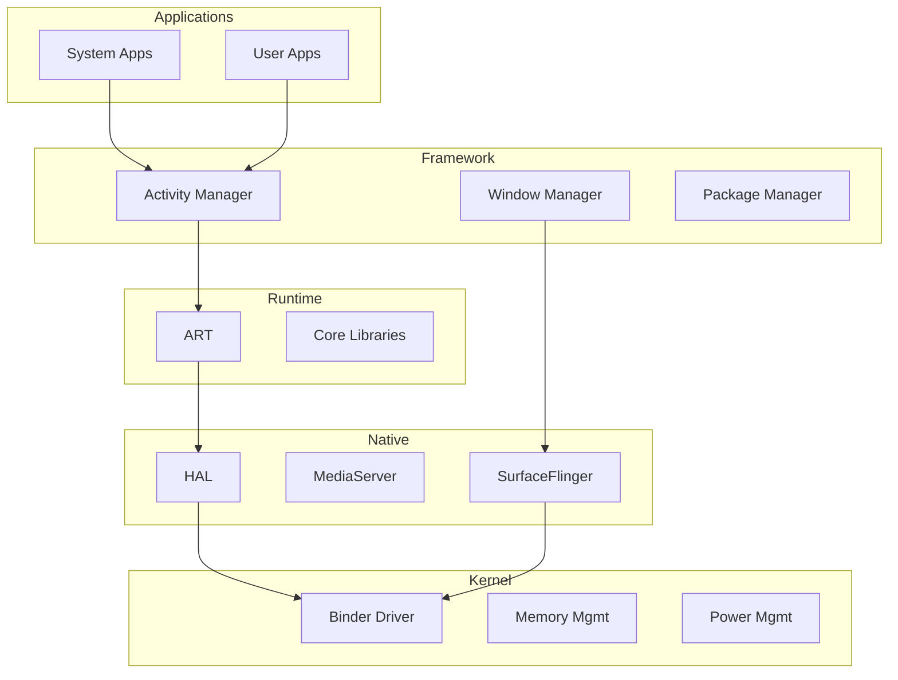

## 아키텍처 레이어

상위 노트: [[android-overview]]



### 1. Linux Kernel (최하단)

**역할**: 하드웨어 관리

- 프로세스 스케줄링
- 메모리 관리
- 드라이버 (디스플레이, 카메라, 센서)
- **보안**: [[selinux]]

**안드로이드 수정**:

- [[android-binder-and-ipc|Binder]] 드라이버 (IPC)
- [[android-kernel#LMKD|LMKD]] (메모리 부족 시 프로세스 종료)
- Wakelock (전원 관리)

**상세**: [[android-kernel]]

---

### 2. HAL (Hardware Abstraction Layer)

**역할**: 하드웨어와 안드로이드 연결

**왜 필요한가**:

- 칩셋마다 다른 드라이버
- OEM 별 다른 하드웨어
- → 표준 인터페이스로 추상화

**예시**:

```
Camera HAL → 삼성/LG/Google 카메라 모두 동일 API
Audio HAL → Qualcomm/MediaTek 오디오 칩 통합
```

**상세**: [[android-hal-and-kernel]]

---

### 3. Native Services

C/C++ 로 작성된 시스템 서비스:

| 서비스 | 역할 |
|--------|------|
| **SurfaceFlinger** | 화면 합성 |
| **MediaServer** | 오디오/비디오 코덱 |
| **AudioFlinger** | 오디오 믹싱 |

**상세**: [[android-graphics-and-media]]

---

### 4. Android Runtime (ART)

**역할**: 앱 코드 실행 엔진

**진화**:

```
2008-2013: Dalvik (JIT)
2014-현재: ART (AOT + JIT)
```

**핵심 기능**:

- DEX 바이트코드 실행
- Garbage Collection
- Profile-Guided Optimization

**상세**: [[android-zygote-and-runtime]]

---

### 5. Java Framework

앱 개발자가 사용하는 API:

```kotlin
// Activity (화면)
class MainActivity : AppCompatActivity() {
    override fun onCreate(savedInstanceState: Bundle?) {
        super.onCreate(savedInstanceState)
        setContentView(R.layout.activity_main)
    }
}
```

**주요 시스템 서비스**:

- **ActivityManager**: 앱 생명주기
- **WindowManager**: 화면 관리
- **PackageManager**: 앱 설치/제거
- **LocationManager**: 위치
- **ConnectivityManager**: 네트워크

**상세**: [[android-activity-manager-and-system-services]]

---

### 6. 앱 (최상단)

**4 대 컴포넌트**:

1. **Activity**: 화면
   ```kotlin
   class DetailActivity : AppCompatActivity()
   ```

2. **Service**: 백그라운드 작업
   ```kotlin
   class MusicService : Service()
   ```

3. **BroadcastReceiver**: 이벤트 수신
   ```kotlin
   class BootReceiver : BroadcastReceiver()
   ```

4. **ContentProvider**: 데이터 공유
   ```kotlin
   class ContactsProvider : ContentProvider()
   ```

---
