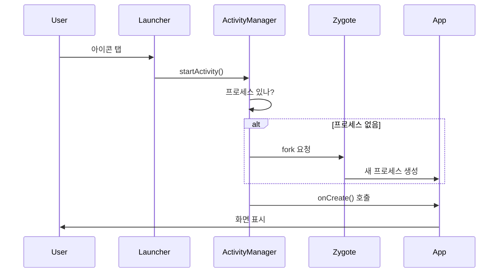

# 앱 실행 과정

상위 노트: [[android-overview]]

#### 1. 앱 시작



**상세**: [android-activity-manager-and-system-services](../01_system_internals/android-activity-manager-and-system-services.md)

---

#### 2. 프로세스 격리

각 앱은 독립된 환경에서 실행:

```
앱 A:
  UID: 10123
  프로세스: /data/app/com.example.a
  데이터: /data/data/com.example.a (A만 접근)
  SELinux: u:r:untrusted_app:s0:c512

앱 B:
  UID: 10124
  프로세스: /data/app/com.example.b
  데이터: /data/data/com.example.b (B만 접근)
  SELinux: u:r:untrusted_app:s0:c768
```

**상세**: [[android-security-sandbox]]

---

#### 3. 앱 간 통신 (Binder)

```kotlin
// 앱 A → 앱 B 서비스 호출
val intent = Intent("com.example.b.SERVICE")
bindService(intent, connection, Context.BIND_AUTO_CREATE)
```

**Binder 가 하는 일**:

- 프로세스 간 메시지 전달
- 자동 신원 확인 (UID/PID)
- 권한 검사

**상세**: [[android-binder-and-ipc]]

---
