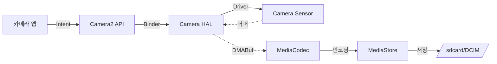

# 실전 예시: 사진 찍기

상위 노트: [[android-overview]]

**과정**:

1. 앱이 Camera2 API 호출
2. Camera Service (Binder) 로 요청
3. Camera HAL 이 센서에서 데이터 읽기
4. 공유 메모리 (DMABuf) 로 전달
5. MediaCodec 이 JPEG 인코딩
6. MediaStore 에 저장 (권한 확인)

---
