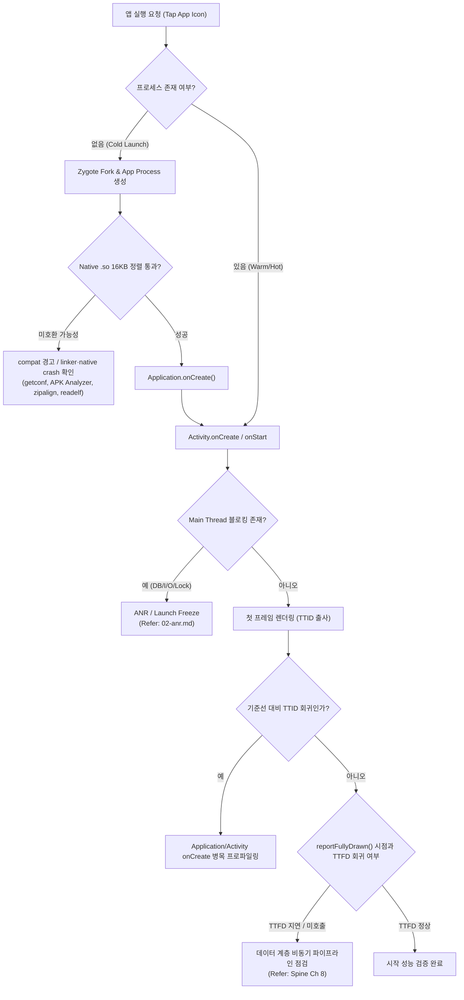

## 앱 실행이 느리거나 첫 프레임이 뜨지 않는다

### 1. 증상 및 징후 (Symptoms & Diagnostic Signals)

다음 중 하나 이상이 관찰된다.

- 앱 아이콘을 탭한 뒤 첫 화면(첫 프레임)이 뜨기까지 체감상 오래 걸린다(TTID 지연).
- 첫 화면(첫 프레임)은 빨리 뜨지만 콘텐츠가 없는 빈 화면/스켈레톤 상태가 오래 유지된다(TTFD 지연).
- 앱 실행 직후 하얀 화면(Blank Screen) 상태에서 응답이 없다가 ANR 다이얼로그가 뜨거나 앱이 즉시 종료된다(이 경우 [ANR runbook](02-anr.md) 또는 Crash 분석으로 전환한다).
- 16KB page-size 기기에서 실행 직후 native `.so` 로딩 경고나 `UnsatisfiedLinkError`, native crash 가 발생한다.

---

### 2. 재현 조건 및 환경 격리 (Reproduction & Isolation)

- **시작 유형(Cold / Warm / Hot) 분리**:
  - **Cold Launch**: `adb shell am force-stop <pkg>` 실행 후 앱 시작. 프로세스 생성, Zygote specialization, `Application` 생성, Activity 생성을 모두 거치는 최악의 경로.
  - **Warm Launch**: 뒤로 가기(Back) 버튼으로 Activity 를 파괴하되 프로세스는 유지한 상태에서 시작.
  - **Hot Launch**: 홈(Home) 버튼으로 백그라운드로 보낸 후 다시 전면 복귀.
- **측정 환경 고정**:
  - 반드시 **R8/Dex 최적화가 적용된 Release 빌드**(또는 Benchmark 빌드)에서 측정한다. Debug 빌드의 StrictMode, 디버거 에이전트, 로깅 코드는 시작 성능을 심각하게 왜곡한다.
  - 기기의 배터리 상태, 쓰로틀링(Thermal State), Baseline Profile 적용 여부를 동일하게 맞추고 최소 5 회 이상 반복 측정하여 중앙값을 확인한다.

---

### 3. 실패 경계 및 원인 우선순위 (Failure Boundaries & Priority)

1. **`Application.onCreate()` 또는 시작 Activity 의 `onCreate()` / `onStart()` 내 메인 스레드 차단 (우선순위 1)**
   - 가장 흔한 원인. DI 그래프 생성(Dagger/Hilt/Koin), SDK 초기화, SharedPreferences 읽기, SQLite/DB 동기 쿼리, 원격 설정(RemoteConfig) 동기 차단 등.
2. **TTID 는 정상이나 TTFD 가 지연됨 (우선순위 2)**
   - 첫 프레임은 즉시 그려지지만, 메인 화면 UI 가 비동기 네트워크/DB 데이터 응답에 직렬로 의존하여 렌더링을 미루는 경우 ([Worked Example: 앱 아이콘 탭에서 첫 프레임까지](../worked-examples/01-app-icon-tap-to-first-frame.md) 참고).
3. **16KB Page Size 미대응 native library (우선순위 3)**
   - Android 15 부터 지원되는 16KB page-size 기기에서 ELF segment 또는 APK ZIP alignment 가 호환되지 않으면 호환 모드 경고, linker 오류, native crash 등이 나타날 수 있다. 모든 Android 15+ 기기가 16KB 인 것도, 미정렬 앱이 항상 `dlopen` 에서 실패하는 것도 아니다.
4. **Zygote Fork 및 프로세스 생성 지연 (우선순위 4)**
   - 시스템 전반의 메모리 부족(Low Memory Pressure)으로 인한 Zygote specialization 지연 또는 OEM OS 차원의 프로세스 생성을 방해하는 저전력 모드 정책.
5. **메인 스레드 교착 상태(Deadlock) 또는 무한 루프 (우선순위 5)**
   - 첫 프레임이 뜨기 전 메인 스레드가 Binder 차단, Lock 경합, I/O 대기에 빠진 상태. [ANR runbook](02-anr.md) 으로 전환한다.

---

### 4. 진단 의사결정 흐름도 (Diagnostic Decision Flowchart)



---

### 5. 단계별 조사 절차 및 CLI 검증 (Step-by-Step CLI Investigation)

#### 1 단계: `am start-activity` (또는 `am start`) 로 TTID 정밀 측정

CLI 실행 시 `-W` (Wait) 옵션을 부여해 시간 측정 결과를 확인한다.

```bash
adb shell am start-activity -W -n com.example.app/.MainActivity
```

*출력 예시:*

```text
Starting: Intent { cmp=com.example.app/.MainActivity }
Status: ok
LaunchState: COLD
Activity: com.example.app/.MainActivity
TotalTime: 842
WaitTime: 845
Complete
```
- `TotalTime`: 시스템이 시작 요청을 수신한 시점부터 launch 가 완료될 때까지 보고되는 시간으로 TTID 진단에 사용한다. OS version 과 launch path 에 따른 필드 정의를 함께 확인한다.
- `LaunchState`: `COLD`, `WARM`, `HOT` 상태를 확인하여 재현 환경이 타당한지 검증.

#### 2 단계: Logcat 의 `Displayed` 및 `Fully drawn` 태그 관찰

수동 트리거 외에 실제 앱 실행 로그에서 타임스탬프를 수집한다.

```bash
adb logcat -d | grep -E "ActivityManager: Displayed|Fully drawn"
```

*출력 예시:*

```text
ActivityManager: Displayed com.example.app/.MainActivity: +842ms
system_process I/ActivityManager: Fully drawn com.example.app/.MainActivity: +1s450ms
```
- `Displayed`: TTID 신호. 괄호 안 `(total +2m10s)` 가 표기되면 이전 선행 Activity 나 SplashActivity 가 오래 지연되었음을 의미함.
- `Fully drawn`: 앱 내부에서 `reportFullyDrawn()` 을 호출했을 때 측정되는 TTFD 신호.

#### 3 단계: ApplicationExitInfo 를 이용한 실행 직후 종료 원인 조회 (Android 11+ / API 30+)

시작 직후 앱이 소리 없이 튕기거나 죽는 경우 프로세스 종료 원인을 시스템에 쿼리한다.

```bash
adb shell dumpsys activity exit-info com.example.app
```

*핵심 결과 필드:*

- `reason`: `REASON_CRASH_NATIVE`, `REASON_ANR`, `REASON_INITIALIZATION_FAILURE`, `REASON_FREEZER`
- `subreason`: `SUBREASON_UNDEF`, `SUBREASON_IMP_DEF`

#### 4 단계: Perfetto Trace 를 통한 메인 스레드 구간별 시간축 타임라인 수집

`Choreographer#doFrame` 이전 구간 중 어느 메인 스레드 콜백이 긴지 측정한다.

```bash
adb shell perfetto -o /data/misc/perfetto-traces/launch.trace -t 5s sched freq idle am wm gfx view
adb pull /data/misc/perfetto-traces/launch.trace .
```

ui.perfetto.dev 에서 트레이스를 열고 `ActivityThread.main` -> `Application.onCreate` -> `Activity.onCreate` 의 duration 을 확인한다.

---

### 6. 성공 / 실패 판정 신호 기준표 (Signal Criteria Matrix)

| 진단 지표 / 신호 (Signal) | 정상 기준 (Success Criteria) | 실패 기준 (Failure Criteria) | 주 원인 및 즉시 조치 (Action Boundary) |
| :--- | :--- | :--- | :--- |
| **am start -W TotalTime (TTID)** | 앱·기기군별 기준선과 release SLO 이내 | 동일 조건의 기준선 또는 Android Vitals 분포에서 유의하게 회귀 | `Application.onCreate()` 및 DI 그래프 동기 초기화 로직을 trace 로 분해 |
| **Fully drawn (TTFD)** | 앱이 정의한 fully usable 상태에서 `reportFullyDrawn()` 호출 | 호출 누락 또는 앱·기기군별 SLO 회귀 | first frame 이후 데이터·렌더링 critical path 를 trace 로 분해 ([Worked Example 01](../worked-examples/01-app-icon-tap-to-first-frame.md)) |
| **Logcat Displayed 라인** | 단일 `Displayed` 출력 기록 | 복수의 `Displayed` 유발 또는 `(total …)` 괄호 지연 존재 | SplashActivity 등 릴레이 액티비티 체인 단축 |
| **16KB Page Compatibility** | 실제 16KB 환경에서 ELF·ZIP alignment 검사와 launch test 통과 | compat 경고, linker 오류 또는 native crash | 최신 AGP/NDK 와 호환 SDK 로 재빌드하고 APK Analyzer·`zipalign`·`readelf` 로 검증 |
| **ApplicationExitInfo Reason** | N/A (정상 종료 없음) | `REASON_INITIALIZATION_FAILURE`<br>`REASON_CRASH_NATIVE` | 시작 시 Native Crash 로그 및 C++ crash dump 분석 |

---

### 7. OS / API (Android 14 / 15 / 16) 특화 제약 및 진단 신호

- **Android 14 (API 34)**:
  - **Foreground Service 시작 제약**: target 과 앱 상태에 따라 background FGS start 가 허용되지 않으면 `ForegroundServiceStartNotAllowedException` 이 발생할 수 있다. Activity 가 사용자에게 보이는 정상 launch 와 background start 를 구분한다.
  - Android 12 부터 system splash screen 이 모든 앱 cold/warm start 에 적용된다. `androidx.core:core-splashscreen` 은 이전 버전까지 일관된 API 를 제공하지만 모든 앱에 특정 library 사용이 강제되는 것은 아니다.
- **Android 15 (API 35)**:
  - **16KB Page Size 지원 시작**: 실제 16KB mode 인지 `adb shell getconf PAGE_SIZE` 로 확인한다. ELF LOAD segment 와 APK ZIP alignment 를 모두 검사하며 backcompat mode 존재도 고려한다.
  - **Edge-to-Edge 기본 적용**: Android 15 target SDK 앱은 Edge-to-edge 가 기본 활성화되어 첫 Activity 의 WindowInset 계산 및 UI layout pass 시간축이 변경될 수 있음.
- **Android 16/17**:
  - page-size 호환성과 startup 회귀는 release 별 공식 behavior-change 문서와 실제 target/runtime 조합에서 검증한다. cached-process 정책을 foreground launch coroutine 지연의 단일 원인으로 단정하지 않는다.

---

### 8. 다음 조사 경로 (Next Investigation Paths)

- ANR 다이얼로그 또는 메인 스레드 차단 관찰 시 → [ANR runbook](02-anr.md) 으로 이동.
- TTFD 만 느리고 TTID 는 정상인 경우 → 데이터 로딩 및 도메인/로컬 캐시 계층 문제이므로 [Learning Spine 8장](../learning-spine/08-data-storage-network-and-offline-recovery.md) 확인.
- 특정 기기/제조사에서만 시작 속도 이슈가 몰리는 경우 → Android Vitals 현장 분포 및 OEM 전력 정책 확인 ([Learning Spine 11장](../learning-spine/11-observation-testing-and-quality-feedback.md)).

---

### 9. 관련 자료 및 연결 노트 (Related Notes & Worked Examples)

- [Worked Example: 앱 아이콘 탭에서 첫 프레임까지](../worked-examples/01-app-icon-tap-to-first-frame.md)
- [Android 시작 성능은 TTID와 TTFD로 나눈다](../../06_testing_performance/performance/performance-contracts/startup-performance-is-measured-by-ttid-and-ttfd.md)
- [Profiler, Perfetto, dumpsys는 벤치마크가 아니라 진단 도구다](../../06_testing_performance/performance/performance-contracts/profiler-perfetto-dumpsys-are-diagnosis-tools-not-benchmarks.md)
- [Learning Spine 6장 메인 스레드, Binder, coroutine과 durable scheduler](../learning-spine/06-main-thread-binder-coroutine-and-durable-work-lifetime.md)
- [Learning Spine 8장 데이터 저장소, 네트워크와 offline recovery](../learning-spine/08-data-storage-network-and-offline-recovery.md)
- [Learning Spine 11장 관찰, 테스트와 품질 feedback](../learning-spine/11-observation-testing-and-quality-feedback.md)

---

### 10. 공식 근거 (Official References)

- [App startup time (Android Developers)](https://developer.android.com/topic/performance/vitals/launch-time)
- [Support 16 KB page sizes (Android Developers)](https://developer.android.com/guide/practices/page-sizes)
- [Diagnose ANRs (Android Developers)](https://developer.android.com/topic/performance/vitals/anr)

검증일: 2026-08-06. TTID/TTFD, 16KB 호환성, system splash 와 FGS 시작 제한의 적용 조건을 공식 문서 기준으로 검증했다.
