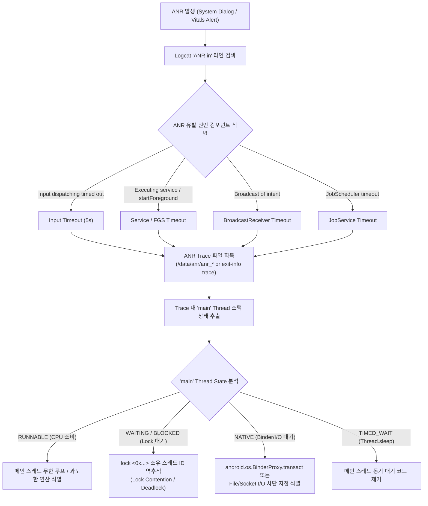

## ANR(Application Not Responding)이 발생한다

### 1. 증상 및 징후 (Symptoms & Diagnostic Signals)

다음 중 하나 이상이 관찰된다.

- 앱 사용 중 또는 백그라운드 전환 직후 "앱이 응답하지 않습니다" (Application Not Responding) 시스템 다이얼로그가 표시된다.
- 화면 터치, 버튼 클릭, 키 입력 뒤 UI 가 멈춘다. AOSP/Pixel 의 input dispatch 기본 timeout 은 5 초지만 OEM 에서 다를 수 있으므로 ANR subject 와 trace 를 확인한다.
- Google Play Console / Android Vitals 에서 user-perceived ANR rate 가 전체 bad-behavior threshold 0.47% 또는 특정 phone model threshold 8% 를 넘는다. 이는 최근 기간의 품질 지표이며 개별 ANR timeout 값이 아니다.
- Foreground service 관련 예외·ANR 이 보인다. background 에서 시작 자체가 금지된 경우, foreground 승격을 제때 하지 않은 경우, service type 별 실행 제한을 넘긴 경우를 서로 분리한다.

---

### 2. 재현 조건 및 환경 격리 (Reproduction & Isolation)

- **ANR 유발 이벤트 시점 특정**:
  - 사용자 입력을 처리하는 시점(Touch/Key input)인가?
  - `BroadcastReceiver.onReceive()` 수신 시점인가?
  - `Service.onCreate()`, `onStartCommand()`, `onBind()` 수행 시점인가?
  - `JobService.onStartJob()`, `onStopJob()` 수행 시점인가?
- **디버거 연결 여부 주의**:
  - 디버거가 연결된 상태에서는 스레드 실행 타이밍이 바뀌어 Lock 경합이나 Race Condition 이 사라지거나, 반대로 디버거 멈춤으로 인해 오탐 ANR 이 발생할 수 있다. 디버거 없이 실행하여 재현성을 파악한다.
- **Production(User) 빌드 vs Engineering(Userdebug) 빌드 구분**:
  - 일반 상용 기기(Production)에서는 `adb root` 가 거부되어 `/data/anr/` 직관 접근이 불가능하다. 이 경우 `adb bugreport` 추출 또는 `ApplicationExitInfo` API 를 사용하여 트레이스를 회수한다.

---

### 3. 실패 경계 및 원인 우선순위 (Failure Boundaries & Priority)

Android 시스템이 판정하는 대표적인 ANR 계약과 조사 우선순위:

1. **Input Dispatching Timeout (5 초) (우선순위 1)**
   - 전면(Foreground) Activity 가 키/터치 입력 이벤트를 5 초 이내에 처리 완료(또는 다음 이벤트 dequeue)하지 못함. 메인 스레드 블로킹의 가장 흔한 원인.
2. **BroadcastReceiver Timeout (우선순위 2)**
   - `BroadcastReceiver.onReceive()` 메인 스레드 콜백에서 무거운 DB/네트워크 작업이나 동기 블로킹 코드를 실행함.
   - AOSP/Pixel 기준 Android 13 이하는 foreground-priority intent 10 초, background-priority intent 60 초다. Android 14+ 는 process 가 CPU-starved 인지에 따라 각각 10~20 초, 60~120 초 범위다. `goAsync()`는 무제한 연장이 아니며 `PendingResult.finish()` 까지 같은 timeout 에 포함된다.
3. **Service 실행 또는 FGS 계약 위반 (우선순위 3)**
   - service callback 이 main thread 를 오래 점유하면 service ANR 이 될 수 있다.
   - background FGS start 가 허용되지 않는 상태(예: 엄격한 백그라운드 제약 상태)에서 시작을 시도하면 ANR 이 아니라 `ForegroundServiceStartNotAllowedException` 이 호출 지점에서 발생한다.
   - `startForegroundService()` 뒤 짧은 시간 안에 `startForeground()`로 승격하지 않으면 `ForegroundServiceDidNotStartInTimeException` 계열의 internal exception 이 발생한다. 이것을 ANR 이나 start-not-allowed 와 같은 실패로 분류하지 않는다.
   - `shortService`, `dataSync`, `mediaProcessing` 의 실행 시간 제한과 종료 방식은 service type 및 OS version 별 공식 문서를 확인한다.
4. **JobScheduler slow response (우선순위 4)**
   - `JobService.onStartJob()`, `onStopJob()` 또는 필요한 `setNotification()` 호출에 main thread 가 제때 응답하지 못한다. 고정 숫자를 앱 계약으로 외우기보다 ANR subject 와 실행 OS 의 공식 문서를 확인한다.
5. **Main Thread Lock Contention / Binder Synchronous IPC Wait (우선순위 5)**
   - 메인 스레드가 백그라운드 스레드가 쥐고 있는 Synchronized Lock 이나 Mutex 를 기다리거나(`waiting to lock`), 시스템 서버/외부 프로세스와의 동기 [binder ipc](../../01_system_internals/binder-ipc.md) 응답 (`BinderProxy.transact`) 대기 중 타임아웃 발생.

---

### 4. 진단 의사결정 흐름도 (Diagnostic Decision Flowchart)



---

### 5. 단계별 조사 절차 및 CLI 검증 (Step-by-Step CLI Investigation)

#### 1 단계: Logcat 으로 ANR 발생 시점 및 컴포넌트 특정
```bash
adb logcat -d | grep -E "ANR in|ApplicationNotResponding|ActivityManager: ANR"
```

*출력 예시:*

```text
E ActivityManager: ANR in com.example.app (com.example.app/.MainActivity)
E ActivityManager: PID: 14205
E ActivityManager: Reason: Input dispatching timed out (Waiting to send non-key input event to window...)
E ActivityManager: Load: 4.85 / 2.12 / 1.05
```

#### 2 단계: ANR Trace 파일 수집
- **Userdebug / Root 에뮬레이터 환경**:
  ```bash
  adb root
  adb shell ls -l /data/anr/
  adb pull /data/anr/anr_2026-08-04-16-00-00-000 trace_anr.txt
  ```
- **Production (User) 일반 기기 환경**:
  ```bash
  adb bugreport bugreport.zip
  # bugreport zip 압축 해제 후 FS/data/anr/ 폴더 내 trace 확인
  ```

#### 3 단계: ApplicationExitInfo 를 이용한 ANR 기록 및 스택 트레이스 CLI 조회 (Android 11+)
```bash
adb shell dumpsys activity exit-info com.example.app
```

*출력 예시:*

```text
ApplicationExitInfo #0:
  timestamp=2026-08-04 15:42:10
  pid=14205 realUid=10182 package=com.example.app
  reason=6 (ANR)
  subreason=1 (SUBREASON_INPUT_DISPATCHING_TIMEOUT)
  status=0
  description=bg anr
```

#### 4 단계: Trace 파일 내 `"main"` 스레드 스택 구문 분석 (ANR Trace Parsing)

`trace_anr.txt` 파일에서 target package 의 `"main"` 스레드 블록을 찾는다.

```text
"main" prio=5 tid=1 Blocked
  | group="main" sCount=1 dsCount=0 flags=1 obj=0x7384a200 self=0xb4000078a0123000
  | sysTid=14205 nice=-10 cgrp=default sched=0/0 handle=0x7b4a282498
  | state=S schedstat=( 1240500 450120 182 ) utm=10 stm=2 core=4 HZ=100
  | held mutexes= "mutator lock"(shared held)
  at com.example.app.Repository.getDataSync(Repository.kt:42)
  - waiting to lock <0x0a1b2c3d> (a java.lang.Object) held by thread 14 (tid=14)
  at com.example.app.MainActivity.onCreate(MainActivity.kt:20)
```
- **State 분석**:
  - `waiting to lock <0x…>`: thread 14 가 해당 락을 쥐고 있음. Trace 파일 내 `tid=14` 스레드를 검색하여 백그라운드 스레드가 어떤 작업을 하느라 락을 해제하지 않는지 분석.
  - `at android.os.BinderProxy.transact(Native Method)`: 메인 스레드가 Binder 동기 IPC 호출 후 상대 프로세스의 응답을 기다리고 있음.
  - `at java.io.FileInputStream.readBytes(Native Method)`: 메인 스레드에서 disk/file I/O 수행 중.

---

### 6. 성공 / 실패 판정 신호 기준표 (Signal Criteria Matrix)

| ANR 진단 지표 / 신호 | 정상 기준 (Success Criteria) | 실패 기준 (Failure Criteria) | 주 원인 및 즉시 조치 (Action Boundary) |
| :--- | :--- | :--- | :--- |
| **Input Dispatching Time** | 이벤트 수신 후 UI 반응 < 100ms | 이벤트 미처리 상태 > 5000ms 지속 | 메인 스레드 내 복잡한 계산/동기 DB 접근을 [Coroutines](../../02_app_framework/kotlin-coroutines.md) `Dispatchers.Default` / `IO` 로 이관 |
| **Main Thread Trace State** | `RUNNABLE` (Choreographer frame handling) | `BLOCKED` (`waiting to lock`) | 메인 스레드와 백그라운드 스레드 간 Shared Lock 범위 축소 또는 Concurrent Data Structure 사용 |
| **Binder Call on Main** | Async Binder call 또는 Binder 미호출 | `BinderProxy.transact` 대기 상태 지속 | 메인 스레드에서의 AIDL/System Server 동기 호출 금지, 비동기 콜백 체인 전환 |
| **FGS 승격** | service 생성 직후 notification 준비와 `startForeground()` 완료 | `ForegroundServiceDidNotStartInTimeException` 계열 로그 | 긴 초기화 전에 먼저 foreground 승격하고 실패 경로에서도 service 정리 |
| **BroadcastReceiver Execution** | `onReceive()`에서 빠르게 반환하고 `goAsync()` 사용 시 반드시 `finish()` | 실행 OS 의 foreground/background broadcast timeout 초과 | 짧은 비동기 정리만 `goAsync()` 로 넘기고 durable work 는 WorkManager 등으로 이관 |

---

### 7. OS / API (Android 14 / 15 / 16) 특화 제약 및 진단 신호

- **Android 14 (API 34)**:
  - **Foreground Service type 계약 강화**: 선언된 type, 해당 permission, runtime prerequisite 를 충족해야 한다. background start 금지, foreground 승격 지연, type 별 실행 timeout 은 서로 다른 예외·ANR 경계다.
  - **Unregistered Receiver 타임아웃 축소**: 백그라운드 런타임 동적 등록 브로드캐스트 리시버에 대한 타임아웃 처리가 엄격해짐.
- **Android 15 (API 35)**:
  - **`ApplicationExitInfo.getTraceInputStream()` 활용성 증대**: 앱 런타임 내에서 이전 세선의 ANR 트레이스 스트림을 직접 읽어 자체 에러 분석 서버로 전송 가능 (`reason == REASON_ANR`).
  - **새로운 ANR Subreason 세분화**: ApplicationExitInfo 조회 시 `SUBREASON_INPUT_DISPATCHING_TIMEOUT`, `SUBREASON_SERVICE_START_BACKGROUND`, `SUBREASON_WAIT_FOR_DEBUGGER` 등 정확한 시스템 트리거 세부 사유 제공.
- **Android 16/17**:
  - release 별 ANR·FGS 변경은 공식 behavior-change 문서에서 target/runtime 조건을 확인한다. CPU core 수나 cached-app freezer 를 trace 없이 ANR 원인으로 단정하지 않는다.

---

### 8. 다음 조사 경로 (Next Investigation Paths)

- 메인 스레드가 Binder IPC 대기(`BinderProxy.transact`) 중 ANR 이 났다면 → 시스템 서비스 결함 및 IPC 교착 상태이므로 [Learning Spine 6장](../learning-spine/06-main-thread-binder-coroutine-and-durable-work-lifetime.md) 의 Binder thread pool 모델 확인.
- 냉시작/앱 열기 직후 스플래시 구간 ANR 이라면 → [app launch runbook](01-app-launch-slow-or-fails.md) 으로 이동.
- 백그라운드 브로드캐스트/작업 실행 중 ANR 이라면 → [background delay runbook](05-background-work-delayed-or-not-running.md) 과 대조.
- 간헐적 ANR 발생 시 프로세스 사멸 조건과 연관되어 있는지 확인하려는 경우 → [process death runbook](03-process-death-state-loss.md) 참고.

---

### 9. 관련 자료 및 연결 노트 (Related Notes & Worked Examples)

- [ANR은 단일 timeout이 아니라 responsiveness 계약 위반이다](../../01_system_internals/boot-and-runtime/system-server-contracts/anr-responsiveness-contract.md)
- [Binder thread pool은 service concurrency와 deadlock 경계다](../../01_system_internals/ipc-and-process/ipc-process-contracts/binder-thread-pool-is-service-concurrency-and-deadlock-boundary.md)
- [Logcat, crash, ANR, debugger는 서로 다른 질문에 답한다](../../06_testing_performance/debugging/debugging-contracts/logcat-crash-anr-and-debugger-answer-different-questions.md)
- [Worked Example: 앱 아이콘 탭에서 첫 프레임까지](../worked-examples/01-app-icon-tap-to-first-frame.md)
- [Learning Spine 6장 메인 스레드, Binder, coroutine과 durable scheduler](../learning-spine/06-main-thread-binder-coroutine-and-durable-work-lifetime.md)

---

### 10. 공식 근거 (Official References)

- [Diagnose ANRs (Android Developers)](https://developer.android.com/topic/performance/vitals/anr)
- [ANR 유형별 timeout과 진단](https://developer.android.com/topic/performance/anrs/diagnose-and-fix-anrs)
- [ApplicationExitInfo (Android API reference)](https://developer.android.com/reference/android/app/ApplicationExitInfo)
- [Android vitals bad-behavior thresholds](https://developer.android.com/topic/performance/vitals)
- [Foreground service 시작과 예외](https://developer.android.com/develop/background-work/services/fgs/launch)
- [Foreground service timeouts](https://developer.android.com/develop/background-work/services/fgs/timeout)

검증일: 2026-08-06. Android Vitals 의 전체 0.47%·phone-model 별 8% 기준과 FGS start-not-allowed·승격 실패·type 별 timeout 을 공식 문서 기준으로 분리했다.
